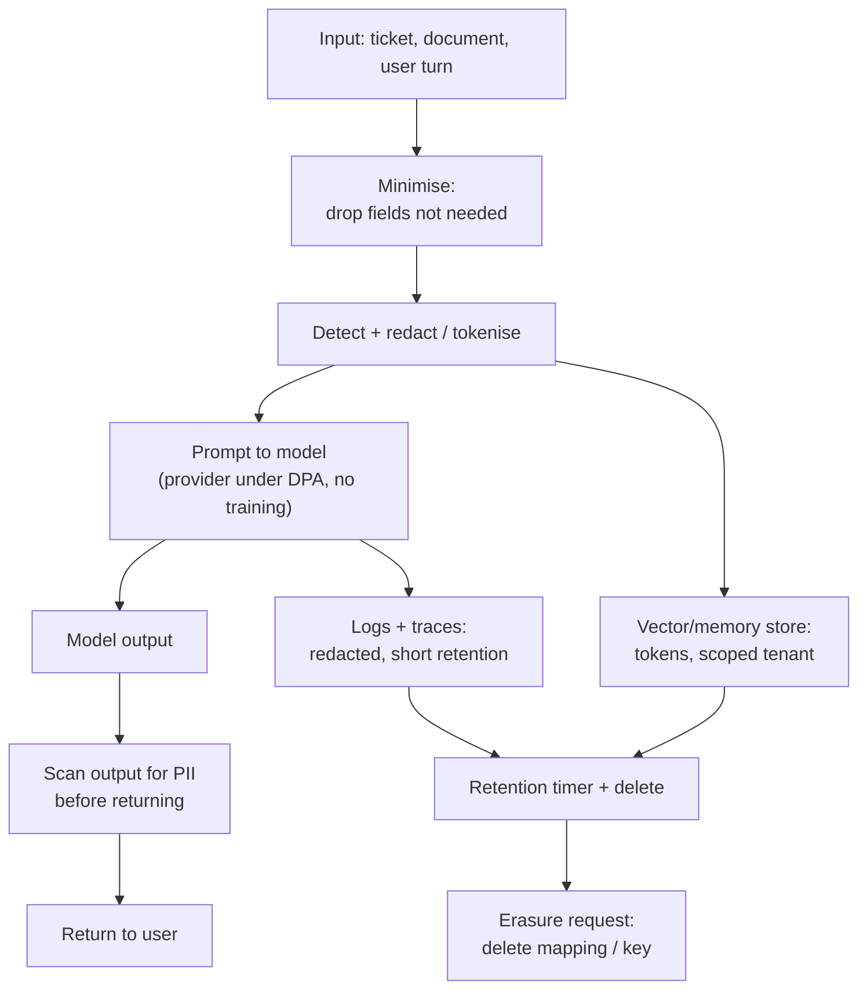

# Data Privacy and PII Handling

> **Interview answer (say this first).** PII is any data that identifies or can be linked to a person: names, emails, phone numbers, government ids, card numbers, and the identifiers that join them. Treat every prompt, completion, memory entry, log line, and trace as a place PII can appear and persist. The core controls are minimisation (send only what the task needs), detection and redaction or tokenisation before data leaves your boundary, and purpose limitation with consent. You also need retention and deletion that actually work — including in logs, backups, and vector stores — and provider agreements that forbid training on your data. Finally, scan model outputs before returning them, because a model can reveal PII it memorised or summarised. Detection is heuristic: it will both miss things and over-redact, so layer it and never treat one regex as compliance.

## Why this exists

Personal data flows through an AI system at every step. A user pastes a support ticket containing an email. A document loader ingests a contract with a home address. The model echoes a card number from context. A trace tool records the whole prompt. A vector store keeps the embeddings of the document plus its metadata.

Each of those is a copy of personal data with its own access control, retention, and breach exposure.

Three realities make this hard:

1. **Copies multiply.** The same PII lives in the prompt, the provider's logs (depending on the contract), your application logs, the trace backend, the memory store, and the vector store. You must reason about all of them, not just the database.
2. **Prompts are unstructured.** Structured columns can be classified and encrypted. A free-text prompt can contain anything, and there is no schema to rely on.
3. **Deletion is not one `DELETE`.** A record in an append-only log, a backup, and an embedding cannot be edited in place the way a row can. You need a deletion story for each.

Privacy engineering is how you keep personal data to the minimum, control where it goes, and still be able to prove deletion.

> **Note:**
>
> **Not legal advice.** The engineering controls here support privacy obligations; the specific rules and retention periods depend on your jurisdiction and contracts. Confirm policy with counsel, and keep the technical controls you can test.

## Start from zero

| Word | Plain meaning |
| --- | --- |
| **PII** | Personally Identifiable Information; data that identifies or can be linked to a person. |
| **Personal data** | The broader legal term for any information relating to an identified or identifiable person. |
| **Sensitive data** | Higher-risk categories: health, biometrics, race, religion, precise location. |
| **Data subject** | The person the data is about. |
| **Controller** | The party that decides why and how personal data is processed. |
| **Processor** | A party that processes data on the controller's instructions, such as a model provider. |
| **Subprocessor** | A processor a processor uses, for example a cloud host. |
| **DPA** | Data Processing Agreement; the contract that sets processing terms and guarantees. |
| **Purpose limitation** | Data collected for one purpose is not reused for an unrelated one. |
| **Data minimisation** | Collect and send only what the stated purpose needs. |
| **Consent** | A lawful basis where the person agrees to a defined processing. |
| **Redaction** | Removing or replacing a value, such as `[EMAIL]`. |
| **Masking** | Showing part of a value, such as `****1234`. |
| **Tokenisation** | Replacing a value with a token and keeping the mapping in a vault. |
| **Pseudonymisation** | Replacing identifiers with pseudonyms; still personal data because re-linking is possible. |
| **Anonymisation** | Irreversibly breaking identifiability; hard to achieve and easy to get wrong. |
| **Data residency** | Keeping data within a required country or region. |
| **Data transfer** | Moving data across a border, which may need extra safeguards. |
| **Retention** | How long data is kept before deletion or archiving. |
| **Right to erasure** | A person's right to have their data deleted (subject to legal exceptions). |
| **Crypto-shredding** | Deleting the key so ciphertext becomes unreadable instead of overwriting every copy. |
| **Zero data retention** | A provider setting where prompts are not stored after the request. |
| **No-training guarantee** | A contractual promise not to train models on the customer's data. |
| **DPIA** | Data Protection Impact Assessment; a review of a risky processing activity. |
| **PII detector** | Code that finds candidate PII; heuristic and imperfect. |
| **False positive / negative** | Over-redaction / a miss. Both matter. |

Two distinctions carry the topic.

**Pseudonymisation is not anonymisation.** A token that you can map back is still personal data and still in scope. Only irreversible de-identification counts, and it is genuinely hard.

**A detector is not a guarantee.** Regex and NER tools miss unusual formats and over-match ordinary numbers. Use them as a layer, minimise the data first, and assume some PII still gets through.

## The core idea

Think of **water moving through a building**. You do not try to filter all water at the exit. You close taps (minimise), install filters at each floor (redact on the way in), lock the tanks (control storage), and keep a drain plan (deletion). One filter at the door is not a strategy.

PII handling is the same: reduce what enters, filter at each boundary, control every store, and be able to delete.



The load-bearing idea is **minimise first**. Data that never left cannot leak. Redaction and tokenisation handle what must leave; retention and deletion handle what was stored.

| Where PII hides | Typical control |
| --- | --- |
| Prompt / context | Minimise, redact, or tokenise before sending |
| Model output | Scan and redact before returning |
| Application logs | Redact at the logging boundary; log ids not values |
| Traces / APM | Disable body capture or redact; short retention |
| Agent memory | Store tokens, scope by tenant, expiry |
| Vector store | Store tokens in text; metadata scoped; delete by document |
| Backups | Encrypted, retention-limited, part of the deletion plan |
| Provider logs | Contract: no-training and zero/short retention |

## How it works

1. **Classify the data.** Know which fields and documents are personal or sensitive, and which are not. Classification drives every later control.
2. **Minimise before you send.** Send only the fields the task needs. Do not attach the whole customer record to summarise one ticket.
3. **Detect PII at the boundary.** Run pattern and model-based detectors on input. Accept that detection is probabilistic; tune for the risk of misses versus over-redaction.
4. **Redact or tokenise.** Replace values with placeholders when the model only needs the shape (`[EMAIL]`). Tokenise when the system must link records later, keeping the mapping in an access-controlled vault.
5. **Keep only the minimum in prompts and memory.** Strip fields after use, expire memory, and scope it per tenant and user.
6. **Control the provider contract.** Use a DPA with no-training and retention terms, verify subprocessors and regions, and choose zero or short retention where available. For the strictest data, use a model you host.
7. **Redact logs and traces at the boundary.** Turn off request-body capture for authenticated routes, redact known field names, and store ids and digests instead of raw content.
8. **Enforce residency.** Pin storage and processing to the required region, prevent cross-region replication, and select provider regions accordingly.
9. **Scan outputs before returning.** Detect PII the model may have surfaced or invented, and redact or block according to policy.
10. **Set retention per store.** Define how long prompts, memories, logs, traces, and vectors live, and delete or archive on schedule.
11. **Make erasure real.** Find every copy; delete the row, memory, and vector; delete the token mapping or encryption key so remaining copies are unreadable; record the erasure.
12. **Prove it.** Emit an audit record for each erasure and retention action, with the id, scope, and time, and keep it consistent with your privacy policy.

> **Warning:**
>
> **Deleting the row is not deleting the person.** Copies persist in logs, backups, traces, and embeddings. Design deletion across every store, and prefer tokenisation with a deletable mapping or crypto-shredding so you do not have to edit immutable media.

## The syntax you will use

**Pattern detection with a correctness check for cards.** Regex finds candidates; a checksum cuts false positives. The checksum cannot itself cause a miss on a real card — every issued card is generated to pass Luhn — so coverage of lengths and schemes is what the regex must get right.

```python
import re

EMAIL = re.compile(r"\b[\w.+-]+@[\w-]+\.[\w.-]+\b")
SSN = re.compile(r"(?<!\d)\d{3}-\d{2}-\d{4}(?!\d)")
CARD = re.compile(r"(?<!\d)(?:\d[ -]?){11,18}\d(?!\d)")   # 12-19 digits, wider scheme coverage

def luhn(number: str) -> bool:
    digits = [int(c) for c in number if c.isdigit()]
    if len(digits) < 12:
        return False
    total = 0
    for i, d in enumerate(reversed(digits)):
        if i % 2 == 1:
            d *= 2
            if d > 9:
                d -= 9
        total += d
    return total % 10 == 0
```

**Redact only the confirmed card numbers.** A failed checksum stays, which is correct for a non-card; a real card the regex does not cover is the miss to watch for.

```python
def redact(text: str) -> str:
    text = EMAIL.sub("[EMAIL]", text)
    text = SSN.sub("[SSN]", text)
    return CARD.sub(lambda m: "[CARD]" if luhn(m.group(0)) else m.group(0), text)
```

**Tokenisation with a keyed MAC.** Use HMAC-SHA256 rather than `sha256(key || value)`; a plain prefix-hash is open to length-extension tricks, while HMAC is the standard construction. The same value always maps to the same token, so records link, but the raw value is not recoverable from the token alone.

```python
import hashlib, hmac

TOKEN_KEY = b"example-token-key"   # held in KMS / secret manager; rotation re-tokenises by policy

def tokenise(value: str) -> str:
    digest = hmac.new(TOKEN_KEY, value.encode(), hashlib.sha256).hexdigest()
    return "tok_" + digest[:16]     # 16 hex chars = 64 bits; short but collision-prone
```

A keyed hash is pseudonymisation: if an attacker also has the key, they can test guesses. The truncation keeps tokens readable but raises the chance of a collision, so use the full digest where you can. Keep the key separate from the token store.

**Minimise before sending.** Whitelist the fields the task needs rather than blacklisting ones to remove.

```python
def minimise(record: dict, keep: tuple[str, ...]) -> dict:
    return {k: v for k, v in record.items() if k in keep}

customer = {"name": "Ana Silva", "email": "ana@example.com",
            "ssn": "123-45-6789", "plan": "pro", "ticket": "cannot log in"}
prompt_record = minimise(customer, keep=("plan", "ticket"))
```

**Scan outputs before returning.** Detect the classes that matter for your product.

```python
def pii_classes(text: str) -> list[str]:
    found = []
    if EMAIL.search(text):
        found.append("email")
    if SSN.search(text):
        found.append("ssn")
    if any(luhn(m.group(0)) for m in CARD.finditer(text)):
        found.append("card")
    return found
```

**Use a real detector for richer cases.** Presidio combines regex with named-entity recognition, which catches names and locations a regex cannot.

```python
from presidio_analyzer import AnalyzerEngine
from presidio_anonymizer import AnonymizerEngine

analyzer, anonymizer = AnalyzerEngine(), AnonymizerEngine()
results = analyzer.analyze(text=user_text, language="en",
                           entities=["PERSON", "EMAIL_ADDRESS", "PHONE_NUMBER"])
clean = anonymizer.anonymize(text=user_text, analyzer_results=results).text
```

**Erasure via a deletable mapping (crypto-shred).** Delete the mapping or key so the remaining tokens cannot be tied back.

```python
class TokenVault:
    def __init__(self):
        self.mapping: dict[str, str] = {}      # token -> value, access controlled

    def token(self, value: str) -> str:
        t = tokenise(value)
        self.mapping[t] = value
        return t

    def erase(self, token: str) -> None:
        self.mapping.pop(token, None)          # value no longer recoverable
```

**Retention as data, not a comment.** Store a max age per data class and delete on schedule.

```python
RETENTION_DAYS = {"prompt_log": 30, "trace": 7, "memory": 90, "audit": 365}
```

**A privacy audit record.** Proof of the action without the personal data itself.

```python
def erasure_record(subject_ref: str, stores: list[str], now: str) -> dict:
    return {"event": "erasure", "subject_ref": subject_ref,
            "stores": sorted(stores), "timestamp": now, "result": "completed"}
```

## Examples: simple to real

**Example 1 — detect candidate PII classes.**

```python
print(pii_classes("Email ana@example.com, SSN 123-45-6789, card 4111 1111 1111 1111"))
```

Illustrative output:

```text
['email', 'ssn', 'card']
```

Each class has its own handling rule. A card number is not the same risk as a public email address.

**Example 2 — redact only what is actually a card.** The second number is an order id, not a card, so the checksum correctly leaves it alone. A genuine card always passes Luhn, so a missed card is never a checksum failure: it is a length or scheme the regex did not cover. The regex above is widened to 12-19 digits for that reason.

```python
text = "Reach ana@example.com. Card 4111 1111 1111 1111, order 1234 5678 9012 3456."
print(redact(text))
```

Illustrative output:

```text
Reach [EMAIL]. Card [CARD], order 1234 5678 9012 3456.
```

The checksum makes card redaction precise without over-redacting ordinary numbers. Coverage is the remaining risk: because Luhn cannot reject a real card, every miss is a pattern you did not match. Test with cards from each issuer and length you expect, and prefer not to send the field at all when you can.

**Example 3 — tokenise so records link without storing raw values.**

```python
print("same value ->", tokenise("ana@example.com"))
print("same again ->", tokenise("ana@example.com"))
print("other value ->", tokenise("bob@example.com"))
```

Illustrative output:

```text
same value -> tok_b4e743fedb1f8f95
same again -> tok_b4e743fedb1f8f95
other value -> tok_2be3f52e710a0e5b
```

Stable tokens let analytics join records without exposing the value. The key must stay in a secret manager, because anyone who has it can test guesses.

**Example 4 — scan the model's output before returning it.** Leakage can come from memory or from a prompt the user already trusted with the data.

```python
print("leaked:", pii_classes("Here is the record: ana@example.com, SSN 123-45-6789."))
print("clean :", pii_classes("The ticket was closed."))
```

Illustrative output:

```text
leaked: ['email', 'ssn']
clean : []
```

Policy decides whether to redact, block, or warn. For a support agent, redaction is usually right; for a regulated export, blocking is.

**Example 5 — minimise the record before the model sees it.**

```python
customer = {"name": "Ana Silva", "email": "ana@example.com",
            "ssn": "123-45-6789", "plan": "pro", "ticket": "cannot log in"}
print(minimise(customer, keep=("plan", "ticket")))
```

Illustrative output:

```text
{'plan': 'pro', 'ticket': 'cannot log in'}
```

The model can answer "why can't I log in?" with `plan` and `ticket`. It did not need the name, email, or SSN.

**Example 6 — erasure by removing the mapping.**

```python
vault = TokenVault()
t = vault.token("ana@example.com")
print("before erase:", vault.mapping.get(t))
vault.erase(t)
print("after erase :", vault.mapping.get(t))
```

Illustrative output:

```text
before erase: ana@example.com
after erase : None
```

The token may still appear in analytics and logs, but it can no longer be tied to a person. Plan how rotation interacts with this: if you rotate the token key, old tokens must still resolve or be intentionally retired.

## In production

- **Minimise first, filter second.** The cheapest data to protect is the data you never sent. Whitelist fields per task and delete what you do not need.
- **Detect and redact at every boundary, not just one.** Input, output, logs, traces, and memory each need their own check. A single gateway filter will be bypassed by a different path.
- **Know your detector's failure rate.** Regex misses unusual formats and over-matches ordinary numbers. Measure both false positives and false negatives on realistic data, and tune to the risk.
- **Tokenise when you must link, redact when you must not.** Stable tokens preserve analytics; placeholders do not. Choose per use case and keep the mapping vault separate.
- **Treat pseudonyms as personal data.** A reversible token is still in scope for retention and erasure. Do not call pseudonymised data anonymous.
- **Get provider terms in writing.** A DPA with no-training and defined retention, subprocessor list, and region. Verify that the technical configuration matches the contract, and prefer zero retention for sensitive workloads.
- **Control residency end to end.** Region pinning is not just the primary database; check replicas, backups, logs, CDN, and the provider region. Cross-region replication quietly breaks residency.
- **Redact logs and traces at the source.** Disable request-body capture for routes that carry personal data, and store ids and digests instead. Tracing tools are the most commonly forgotten copy.
- **Design deletion across every store.** Rows, memories, vectors, logs, and backups. Use deletable mappings or crypto-shredding for immutable media, and record the erasure.
- **Set retention explicitly and enforce it.** A policy with no timer is a wish. Automate deletion and test it, including for the vector store where deletion is per-embedding, not per-column.
- **Scrutinise generated content.** Models can hallucinate a plausible email or phone number. Scan outputs and treat any detected value as untrusted until matched against a source.
- **Document purpose and lawful basis.** Purpose limitation and consent shape what you may do; engineering should map each data flow to a purpose rather than storing everything "just in case."

## Interview questions

### 1. What counts as PII?

**Answer.** Anything that identifies a person or can be linked to one: names, emails, phone numbers, government ids, card numbers, account ids, precise location, and the quasi-identifiers that combine to single someone out. Sensitive categories such as health or biometrics carry higher obligations. The test is identifiability, not the field name, which is why a combination of "rare job plus small town" can be personal data.

**Follow-up: "Is an IP address PII?"** Often yes, because it can identify a device and person, and regulators treat it as personal data. Treat it as PII unless you have a clear reason not to.

**Trap.** Assuming hashed or pseudonymised values are out of scope. If they can be linked back, they are still personal data.

### 2. Where does PII end up in an AI system?

**Answer.** In the prompt and context, the model's output, agent memory, application logs, traces from observability tools, the vector store's text and metadata, backups, and possibly the provider's logs depending on the contract. Each is a separate store with its own access and retention, and each must be in the deletion plan.

**Follow-up: "Which is most often forgotten?"** Traces. They frequently capture full request bodies by default, live in a third-party tool, and keep data far longer than expected.

**Trap.** Securing only the primary database and assuming the rest is transient. Most copies outlive the request.

### 3. How do redaction and tokenisation differ, and when do you use each?

**Answer.** Redaction replaces a value with a placeholder and throws the value away; tokenisation replaces it with a token and keeps a mapping so you can link records. Use redaction when the model only needs the shape, and tokenisation when the system must correlate. Both reduce exposure, but a token is only as safe as the vault that holds the mapping.

**Follow-up: "What about masking?"** Masking reveals part of the value, such as the last four digits, for display or support. It is useful for humans and still personal data.

**Trap.** Keeping the mapping in the same store as the tokens. That is not tokenisation; it is relabelling.

### 4. How do you handle a right-to-erasure request when data is spread across stores?

**Answer.** Maintain a subject reference you can search across every store, then delete or de-identify each copy: the database rows, agent memories, vector embeddings, cache entries, and the token mapping. For append-only logs and backups, delete the mapping or encryption key so the remaining data is unreadable, and record the erasure. Where a legal exception preserves the data, document it.

**Follow-up: "How do you find every copy?"** Tag data with a subject reference at ingest, keep an inventory of stores, and test erasure with a synthetic subject. If you cannot find it, you cannot delete it.

**Trap.** Deleting the row and declaring victory while embeddings and traces still hold the content.

### 5. What should you check in a model provider contract?

**Answer.** That your data is not used to train models, how long it is retained and whether zero retention is available, which subprocessors and regions are involved, what the breach-notification terms are, and whether the terms cover the specific services you use. Then verify the technical configuration matches the contract.

**Follow-up: "Is a no-training guarantee enough for sensitive data?"** Not always. It addresses one risk. For the strictest categories you may need zero retention, a specific region, or a self-hosted model so the data never leaves your control.

**Trap.** Assuming a consumer tier has the same terms as the enterprise tier. Retention and training defaults differ.

### 6. How do you stop PII from appearing in logs and traces?

**Answer.** Redact at the logging boundary with a list of sensitive field names, log identifiers and digests instead of raw values, and disable request-body capture for routes that carry personal data. Add a test that runs representative traffic and asserts PII does not appear in captured logs, and review what tracing vendors retain.

**Follow-up: "What about debugging?"** Use a restricted, short-retention store with its own access control, or a redacted sample. Convenience is not a reason to keep PII in the general log.

**Trap.** Relying on the framework or tracer to redact by default. Most do not unless you configure and test it.

### 7. How do you detect PII in model output?

**Answer.** Run detectors on the output before returning it, covering the classes that matter, and apply policy — redact for a general assistant, block for a regulated export. Because models can hallucinate plausible values, also verify against a trusted source when the output drives a decision. Combine regex, checksums like Luhn, and an entity model, and accept that detection is imperfect.

**Follow-up: "How do you test it?"** Build a suite of positive cases (formats you must catch) and negative cases (numbers you must not over-redact), and track precision and recall as you change detectors.

**Trap.** Treating a clean scan as proof there is no PII. It is evidence about the patterns you tested, nothing more.

### 8. What is data residency, and where does it break?

**Answer.** Residency means data stays within a required region. It breaks at replicas, backups, log aggregation, CDN caches, third-party tracing, and the model provider's region. Enforce it by pinning storage and processing, blocking cross-region replication, and choosing provider regions deliberately, then verify with network and config tests.

**Follow-up: "How does that interact with availability?"** Failover across regions can move data. You need a residency-aware failover plan, or you accept the transfer with the required safeguards.

**Trap.** Setting the primary database region and assuming everything else follows. Residency is an end-to-end property, not a database setting.

## Remember this

- **Minimise first.** Data you never sent cannot leak; send only the fields the task needs.
- **Detect, redact, or tokenise at every boundary** — input, output, logs, traces, and memory — and never treat one filter as compliance.
- **Pseudonymised data is still personal data.** A reversible token is in scope for retention and erasure.
- **Design deletion across every store**, using a deletable mapping or crypto-shredding for logs, vectors, and backups, and record the erasure.
- **Get provider terms in writing** (no training, retention, subprocessors, region) and make residency an end-to-end property.
