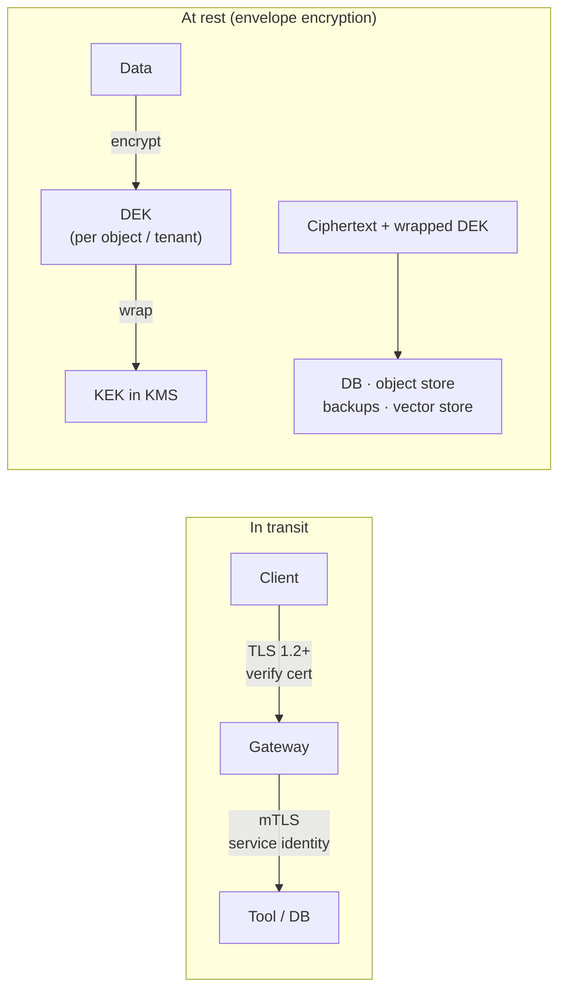

# Encryption at Rest and in Transit

> **Interview answer (say this first).** Encrypt data in transit with TLS 1.2+ everywhere, including service-to-service traffic, and use mTLS when you need both sides authenticated. Encrypt data at rest for databases, object storage, backups, and vector stores, none of it in a plaintext copy. Use a KMS with envelope encryption: a short-lived data key encrypts the data, and a master key wraps the data key. Rotate the master key by re-wrapping data keys, not by re-encrypting everything. Remember the two limits: encryption at rest protects against loss or theft of the storage medium, not against a compromised application that holds the key, and encryption is not access control — a user with the key or a live query sees plaintext. Use field-level encryption for the most sensitive fields, and never log decrypted data.

## Why this exists

Most data breaches start with data that was readable when it should not have been. A backup copied to the wrong bucket, a service calling an internal endpoint over plain HTTP, a vector store whose snapshots are unencrypted, a database whose disks were discarded or stolen.

Encryption is the control that makes those failures survivable. If the disk is encrypted and the key was not taken with it, the stolen bytes are useless.

AI systems add specific pressure:

- **New stores.** Vector databases and their snapshots, embedding caches, and agent memory are additional places to protect, and they are often outside the hardened database.
- **Long-lived data.** Prompts and embeddings can contain personal data and are kept for tuning or retrieval far longer than a request.
- **Broad internal traffic.** Model gateways, tool servers, and databases talk constantly. "It's internal" is not a security boundary.
- **Deep copies.** Backups and analytics exports are the classic leak, and AI pipelines create many of them.

Encryption at rest and in transit is the baseline. It does not replace access control; it buys time and limits damage when other controls fail.

> **Note:**
>
> **Encryption is a floor, not a wall.** A running system with the key decrypts for whoever is authorised to ask. Encryption protects data when it is at rest on a stolen disk or in transit on the wire, but it cannot stop an authorised application or user from reading it.

## Start from zero

| Word | Plain meaning |
| --- | --- |
| **Plaintext** | Readable data. |
| **Ciphertext** | Encrypted data; unreadable without the key. |
| **Symmetric encryption** | One shared key encrypts and decrypts; fast, used for bulk data. |
| **Asymmetric encryption** | A public key encrypts and a private key decrypts; slower, used for key exchange. |
| **TLS** | Transport Layer Security; encrypts data on the wire. |
| **mTLS** | Mutual TLS; both client and server present certificates. |
| **Certificate** | A signed statement binding a public key to an identity. |
| **CA** | Certificate Authority; signs certificates. |
| **Forward secrecy** | Session keys are not recoverable even if the long-term key later leaks. |
| **At rest** | Data stored on disk, object storage, tape, or backup. |
| **In transit** | Data moving over a network. |
| **KMS** | Key Management Service; stores and controls encryption keys. |
| **HSM** | Hardware Security Module; tamper-resistant hardware for keys. |
| **KEK** | Key Encryption Key; the master key that wraps data keys. |
| **DEK** | Data Encryption Key; the per-object key that encrypts data. |
| **Envelope encryption** | Encrypt data with a DEK, then encrypt the DEK with a KEK. |
| **Wrapped key** | A DEK encrypted under the KEK, stored with the ciphertext. |
| **Key rotation** | Replacing a key with a newer one. |
| **Re-encryption** | Decrypting and re-encrypting data under a new key. |
| **TDE** | Transparent Data Encryption; the database encrypts pages for you. |
| **Field-level encryption** | Encrypting one column or field before storage. |
| **AEAD** | Authenticated Encryption with Associated Data; confidentiality plus integrity. |
| **Nonce / IV** | A unique value per encryption so the same key never repeats. |
| **AAD** | Additional Authenticated Data; data that is authenticated but not encrypted. |

Two distinctions carry the topic.

**At rest vs in transit.** They are different threats. In transit protects against someone reading or altering traffic on the wire. At rest protects against someone reading the stored medium. You need both; one does not cover the other.

**Encryption vs access control.** Encryption limits who can read data *when they lack the key*. Access control limits what an authorised party may do. A database that decrypts transparently for every connected user is still protected at rest, and still fully readable by any query that connects.

## The core idea

Think of a **locked filing cabinet inside a locked room**. The cabinet lock (encryption at rest) protects the files if someone carries the cabinet away. The door lock and badge reader (access control) decide who can be in the room at all. The cabinet is useless if the room is full of people with keys, and the room does not save the files if the cabinet is wheeled out.



Envelope encryption is the standard pattern because it scales. You generate a data key per object or per tenant, encrypt the data with it, and ask the KMS to wrap that data key under a master key. The wrapped key travels with the ciphertext. The plaintext data key exists only in memory for the operation.

| Layer | Protects against | Does not protect against |
| --- | --- | --- |
| TLS in transit | Eavesdropping, tampering on the wire | Compromised endpoints |
| mTLS | Unauthenticated peers | A compromised authorised peer |
| At-rest envelope | Stolen disk, leaked backup, lost media | App with the key; live queries |
| Field-level | Broad DB read; logs/exports | A caller authorised for the field |
| TDE | Stolen database files | Any connected SQL client |

## How it works

1. **Inventory every store and every wire.** Databases, object storage, backups, snapshots, vector stores, caches, queues, and every service-to-service call. You cannot encrypt what you have not listed.
2. **Enforce TLS for all traffic.** Require TLS 1.2 or 1.3, verify the server certificate and hostname, and reject plaintext. This applies to internal traffic too.
3. **Use mTLS for service-to-service.** Both sides present a certificate, so neither end has to trust an open network. Map the certificate identity into your policy engine.
4. **Generate a data key per object or tenant.** Use a KMS `GenerateDataKey` so the plaintext key is short-lived and never stored.
5. **Encrypt with an AEAD cipher.** AES-GCM or an equivalent, with a unique nonce, gives confidentiality and integrity. Integrity matters: ciphertext without authentication can be silently altered.
6. **Wrap and store the DEK.** Persist the wrapped key next to the ciphertext, tagged with the KEK id so you know which master key to use.
7. **Keep plaintext keys in memory only.** Zero and discard the DEK after use where the runtime allows, and never write it to disk or logs.
8. **Decrypt on read with the KEK.** The KMS unwraps the DEK, the application decrypts, and the plaintext key is discarded again.
9. **Rotate the KEK by re-wrapping.** A new KEK wraps the existing DEKs; the data itself is untouched, so rotation is cheap. Turn on automatic rotation in the KMS and track key versions.
10. **Re-encrypt data only when the DEK changes.** Rotating the data key means decrypting and re-encrypting the object. Plan it as a background job with a version marker.
11. **Encrypt backups and snapshots too.** The most common miss is a plaintext backup of an encrypted database. Treat backups as first-class stores.
12. **Audit key use and access.** Log every KMS operation and every decryption, alert on unusual patterns, and restrict who and what can call `Decrypt`.

> **Warning:**
>
> **Rotation is not just a new key.** A new KEK is only useful once existing data keys are re-wrapped (or data is re-encrypted) and old versions can still be decrypted during the migration. Mark versions, keep the old KEK available for unwrap until the migration finishes, then disable it.

## The syntax you will use

**A verifying TLS client context.** Never disable verification; set a floor version.

```python
import ssl

ctx = ssl.create_default_context()            # verify_mode=CERT_REQUIRED, check_hostname=True
ctx.minimum_version = ssl.TLSVersion.TLSv1_2  # reject older protocol versions
# use: urllib/httpx with this context, or a server that enforces the same floor
```

**An mTLS server that requires a client certificate.** The verified peer identity then feeds authorization.

```python
server_ctx = ssl.SSLContext(ssl.PROTOCOL_TLS_SERVER)
server_ctx.minimum_version = ssl.TLSVersion.TLSv1_2
server_ctx.verify_mode = ssl.CERT_REQUIRED   # refuse clients without a valid cert
server_ctx.check_hostname = False            # server-side: cert CN is the client identity
server_ctx.load_cert_chain(certfile="server.pem", keyfile="server.key")
server_ctx.load_verify_locations(cafile="client-ca.pem")
```

**AEAD encryption with a unique nonce.** AES-GCM gives confidentiality and integrity, but only if the nonce never repeats for the same key.

```python
import os
from cryptography.hazmat.primitives.ciphers.aead import AESGCM

key = AESGCM.generate_key(bit_length=256)     # in practice a DEK from the KMS
nonce = os.urandom(12)                        # unique per encryption, 96 bits for GCM
aad = b"tenant:acme|object:42"                # authenticated, not encrypted
ct = AESGCM(key).encrypt(nonce, b"secret payload", aad)
pt = AESGCM(key).decrypt(nonce, ct, aad)      # raises if ct or aad was altered
```

**Generate an envelope data key with AWS KMS.** The plaintext key is used once, then discarded; the wrapped key is stored with the data.

```python
import boto3

kms = boto3.client("kms", region_name="us-east-1")
resp = kms.generate_data_key(KeyId="arn:aws:kms:us-east-1:123456789012:key/abcd",
                             KeySpec="AES_256")
plaintext_dek = resp["Plaintext"]              # use in memory, never persist
wrapped_dek = resp["CiphertextBlob"]           # store with the ciphertext
```

**Unwrap on read.** The application asks KMS to decrypt the wrapped key, then decrypts the object.

```python
plaintext_dek = kms.decrypt(CiphertextBlob=wrapped_dek)["Plaintext"]
# AESGCM(plaintext_dek).decrypt(nonce, ct, aad)  ->  plaintext
```

**Turn on KEK rotation.** Automatic rotation replaces the master key on a schedule without touching the data.

```python
kms.enable_key_rotation(KeyId="arn:aws:kms:us-east-1:123456789012:key/abcd")
```

Enabling rotation means new wraps use the new key version while old ciphertext still decrypts under the old version.

Two rotation models look the same but are not. With a **separate KEK** you must explicitly re-wrap every stored DEK under the new KEK and keep the old KEK available for unwrap during the migration. With **cloud KMS automatic rotation** the key id is unchanged: the service creates a new backing key version on schedule, new wraps use it, and old ciphertext still decrypts under the old version, so your code does not re-wrap anything. Know which model you rely on, because only the separate KEK gives you a distinct key you can revoke independently.

**A local stand-in for the KMS wrap/unwrap boundary.** This is not a cipher; it exists only to show the rotation mechanics in the examples without a cloud call.

```python
class KMS:
    def __init__(self, kek_id: str):
        self.kek_id = kek_id
        self.old: set = set()

    def rotate(self, new_kek_id: str) -> None:
        self.old.add(self.kek_id)          # keep old KEK for unwrap during migration
        self.kek_id = new_kek_id

    def wrap(self, dek: bytes) -> tuple[str, bytes]:
        return self.kek_id, b"wrapped:" + dek

    def unwrap(self, kek_id: str, wrapped: bytes) -> bytes:
        if kek_id != self.kek_id and kek_id not in self.old:
            raise KeyError("unknown KEK")
        return wrapped.removeprefix(b"wrapped:")
```

**A version tag with the ciphertext.** Store which KEK and DEK version produced this object so it can always be decrypted and migrated.

```python
record = {"ciphertext": ct, "nonce": nonce, "wrapped_dek": wrapped_dek,
          "kek_id": "key/abcd", "kek_version": 3, "alg": "AES-256-GCM"}
```

**Field-level encryption with a distinguishing argument.** Bind the field name and row id into the AAD so ciphertext cannot be moved between fields.

```python
def encrypt_field(value: bytes, key: bytes, row_id: str, field: str) -> bytes:
    aad = f"{row_id}:{field}".encode()        # ciphertext is bound to its location
    return AESGCM(key).encrypt(os.urandom(12), value, aad)
```

Field-level encryption limits a broad database read to ciphertext, but it also breaks server-side search and range queries on that field, so choose it deliberately.

## Examples: simple to real

**Example 1 — the TLS client verifies by default, and you keep it that way.**

```python
import ssl
ctx = ssl.create_default_context()
print("verify_mode:", ctx.verify_mode)     # 2 == CERT_REQUIRED
print("check_hostname:", ctx.check_hostname)
```

Illustrative output:

```text
verify_mode: 2
check_hostname: True
```

The classic mistake is passing `verify=False` or an empty CA bundle "to make it work." That turns off the control and enables a man-in-the-middle.

**Example 2 — mTLS requires a client certificate.**

```python
srv = ssl.SSLContext(ssl.PROTOCOL_TLS_SERVER)
srv.verify_mode = ssl.CERT_REQUIRED
print("requires client cert:", srv.verify_mode == ssl.CERT_REQUIRED)
```

Illustrative output:

```text
requires client cert: True
```

mTLS gives you a cryptographic service identity that you can feed into the policy engine, instead of trusting an internal network.

**Example 3 — rotate the KEK and still decrypt the data.** This is why envelope encryption is cheap to rotate.

```python
import os
from cryptography.hazmat.primitives.ciphers.aead import AESGCM

kms = KMS("kek-1")
dek = AESGCM.generate_key(bit_length=256)
nonce = os.urandom(12)
data_ciphertext = AESGCM(dek).encrypt(nonce, b"secret payload", b"")
old_kek, wrapped = kms.wrap(dek)            # DEK wrapped under kek-1

kms.rotate("kek-2")
new_kek, rewrapped = kms.wrap(dek)          # same DEK, new KEK, data untouched

# Read path: unwrap the stored DEK, then decrypt the unchanged ciphertext.
recovered = kms.unwrap(old_kek, wrapped)
print("kek now:", kms.kek_id)
print("data still decrypts:", AESGCM(recovered).decrypt(nonce, data_ciphertext, b"") == b"secret payload")
print("new wrap unwraps too:", kms.unwrap(new_kek, rewrapped) == dek)
```

Illustrative output:

```text
kek now: kek-2
data still decrypts: True
new wrap unwraps too: True
```

Only the wrapped key changes; the ciphertext and DEK are untouched, so the object still decrypts under the old wrapped key during migration and under the new one afterwards. Rotating the **DEK** is what forces re-encryption.

**Example 4 — a stored key version is what makes rotation safe.**

```python
print(record.keys())
```

Illustrative output:

```text
dict_keys(['ciphertext', 'nonce', 'wrapped_dek', 'kek_id', 'kek_version', 'alg'])
```

Without `kek_id` and `kek_version` you cannot tell which key to unwrap with, and a rotation can make old data unreadable.

**Example 5 — encryption is not access control.** The same ciphertext is readable by anyone the KMS grants `Decrypt` to; revoking access is a permission change, not a crypto change.

```python
# Same key, same nonce, same ciphertext: the holder reads the plaintext.
pt = AESGCM(key).decrypt(nonce, ct, aad)
print("holder reads:", pt)
# To stop a caller, remove its kms:Decrypt permission. The bytes are unchanged.
```

Illustrative output:

```text
holder reads: b'secret payload'
```

A live SQL query against a TDE database behaves the same way: the engine decrypts transparently for the connection, so the access decision is made by authorization, not encryption.

**Example 6 — the common mistakes, side by side.**

```text
BAD : backup of the encrypted DB stored unencrypted -> the backup is the breach
BAD : verify=False in an internal client           -> MITM is trivial
BAD : plaintext DEK written to a debug log         -> encryption defeated
GOOD: every store encrypted, certs verified, keys in KMS, plaintext never logged
```

Each "BAD" line has a matching control in the lists above, and each is a real incident that has happened.

## In production

- **Require TLS everywhere, including internal calls.** "It's inside the VPC" is not a threat boundary. Terminate TLS at the gateway and re-encrypt to backends; do not send plaintext across the network even briefly.
- **Verify certificates and set a protocol floor.** Disable TLS 1.0/1.1, keep hostname verification on, and pin or restrict CAs where the risk justifies it. `verify=False` is a finding, not a workaround.
- **Use mTLS for machine-to-machine.** It gives both sides a verifiable identity that maps into RBAC, and it survives a flat network better than an IP allowlist.
- **Envelope-encrypt with a KMS; keep plaintext keys in memory only.** Per-object or per-tenant data keys limit blast radius if one key leaks, and the KMS boundary means the master key never leaves it.
- **Rotate KEKs on a schedule and re-wrap.** Rotation is cheap for envelope encryption, so do it. Track key versions so old data stays decryptable during the migration, then retire the old version.
- **Plan for DEK re-encryption as a background job.** Rotating a data key means decrypting and re-encrypting data. Version it, throttle it, and make it resumable.
- **Encrypt backups, snapshots, and replicas.** The plaintext backup of an encrypted database is the most common at-rest failure. Inventory every copy and apply the same policy.
- **Encrypt vector stores and embedding caches.** Embeddings can leak content and often sit outside the hardened database. Encrypt storage and snapshots, and scope access per tenant.
- **Choose field-level encryption where a broad read is the risk.** It protects sensitive columns from DB admins and exports, but breaks server-side search and range queries, and deterministic modes leak equality.
- **Never log decrypted data or keys.** Redact at the logging boundary, keep plaintext keys out of traces and crash dumps, and add a test for it.
- **Audit and alarm on KMS use.** Log `Decrypt` and `GenerateDataKey`, alert on spikes or new callers, and restrict which identities may decrypt which keys.
- **Do not store secrets in environment variables.** Env vars leak through crash dumps, child processes, and orchestration dashboards. Fetch from a secret manager at runtime.

## Interview questions

### 1. What does encryption in transit protect, and where does it stop?

**Answer.** It protects data on the wire from passive eavesdropping and, when certificates are verified, from active man-in-the-middle and tampering. It stops at the endpoints: once data is decrypted at a service, that service and its logs are exposed. Internal traffic needs the same protection, because a flat network is not a boundary.

**Follow-up: "What does mTLS add?"** Authentication of both peers, so each side knows who the other is cryptographically. That identity can feed authorization, replacing "trust the network."

**Trap.** Setting `verify=False` or skipping hostname checks to fix a certificate error. That silently removes the protection TLS is supposed to give.

### 2. Explain envelope encryption and why it is used.

**Answer.** A data key encrypts the data, and a master key in a KMS encrypts the data key. The wrapped key is stored with the ciphertext, and the plaintext data key exists only in memory. It scales because you can create many data keys without putting them all in the KMS, and it makes rotation cheap: rotate the master key and re-wrap the data keys instead of re-encrypting data.

**Follow-up: "What is the blast radius if one data key leaks?"** Only the objects encrypted with that key. Per-tenant or per-object keys shrink it, and the master key never leaves the KMS.

**Trap.** Storing the plaintext data key next to the ciphertext "for convenience." That is the whole protection, discarded.

### 3. How do you rotate keys without downtime?

**Answer.** For a master key, generate a new version, keep the old version available for decryption, and re-wrap the stored data keys under the new version. For a data key, re-encrypt the objects in a versioned background job, marking each as migrated, then retire the old key. New writes use the new version immediately, so there is no cutover moment.

**Follow-up: "How do you know rotation is complete?"** Every object carries its key id and version. You are done when no object references the old version and no decrypt call uses it, which you can verify from the audit log.

**Trap.** Deleting the old key as soon as the new one is created. Any data still encrypted under the old key becomes permanently unreadable.

### 4. "Encryption is not access control." What does that mean?

**Answer.** Encryption protects data when it is away from the system, such as on a stolen disk or in a leaked backup. In a running system, whoever is authorised to use the key gets plaintext, and TDE decrypts transparently for any connected query. So encryption and authorization are complementary: encryption limits damage when storage leaks, authorization limits who may read and act when the system is live. Neither replaces the other.

**Follow-up: "Does field-level encryption change that?"** It reduces the set of people who see plaintext, because a broad database read returns ciphertext. But anyone with the field key still sees it, and the application holds that key, so it is still not a substitute for authorization.

**Trap.** Claiming the database is "safe because it is encrypted" while every service has a decrypt-capable role. That is encryption at rest only, with no access control improvement.

### 5. Where does encryption at rest most often fail?

**Answer.** Backups, snapshots, and replicas. Teams encrypt the primary database, then store an unencrypted dump, forget a read replica, or snapshot the vector store without encryption. Logs and analytics exports are close behind, because they copy data into a store with weaker controls. The fix is to inventory every copy and apply the same encryption and access policy.

**Follow-up: "What about keys in the environment?"** Environment variables leak through crash dumps and child processes. Fetch keys from a KMS or secret manager at runtime and keep them in memory.

**Trap.** Treating "the cloud provider encrypts the disk" as sufficient for your own object storage and backups. Provider defaults vary and may not cover your snapshots.

### 6. When would you use field-level encryption?

**Answer.** When the main risk is a broad read — a database admin, an export, or a compromised read-only replica — and only a narrow path needs the plaintext, such as government ids or card data. It keeps ciphertext in the column so a bulk read is useless. The cost is that you cannot search, sort, or range-query that field server-side, and you must manage the key per field or per tenant.

**Follow-up: "What about searching an encrypted field?"** You can store a separate keyed hash of the value for exact-match lookup, accepting that equality leaks; you cannot do ranges on encrypted data without a special scheme that adds real complexity.

**Trap.** Using deterministic encryption across many rows and assuming it is safe. Equal plaintexts produce equal ciphertexts, which leaks frequency patterns.

### 7. What are the most common encryption mistakes in an AI platform?

**Answer.** Unencrypted backups and snapshots; disabling certificate verification on internal calls; storing plaintext data keys or provider secrets in environment variables; logging decrypted payloads or keys through a tracing tool; leaving the vector store and its snapshots unencrypted; and treating a transparently encrypted database as if it were readable only by authorised users. Each is common because it is invisible until an incident.

**Follow-up: "How do you catch them?"** Scan infrastructure as code for missing encryption, check TLS config in tests, assert that logs and traces contain no plaintext keys or PII, and inventory every store. Make the controls testable.

**Trap.** Auditing the primary datastore and stopping there. The copies are where the data leaks.

### 8. How do you keep keys and plaintext out of logs and traces?

**Answer.** Redact at the logging boundary, keep plaintext keys in memory only, and never serialize a decrypted payload into a log or span. Log the key id and version, not the key material. Disable request-body capture for authenticated routes, and add a test that runs representative traffic and asserts no key or sensitive field appears in captured output.

**Follow-up: "Why is this so easy to get wrong?"** Keys travel through the same code paths as data, and a single `repr()` of a request can expose the data key or the decrypted body. One deep debug log defeats the whole encryption story.

**Trap.** Assuming the tracing library redacts by default. Most capture request and response bodies unless you turn it off.

## Remember this

- **TLS everywhere, including internal traffic; verify certificates and keep a protocol floor.** Use mTLS for service identity.
- **Envelope-encrypt with a KMS:** per-object data keys, master key wraps them, plaintext keys in memory only.
- **Rotate master keys by re-wrapping; re-encrypt only when the data key changes**, and version everything.
- **Encryption is not access control.** It protects data at rest and on the wire; authorization decides who may read and act.
- **Encrypt every copy — backups, snapshots, replicas, vector stores — and never log decrypted data or keys.**
