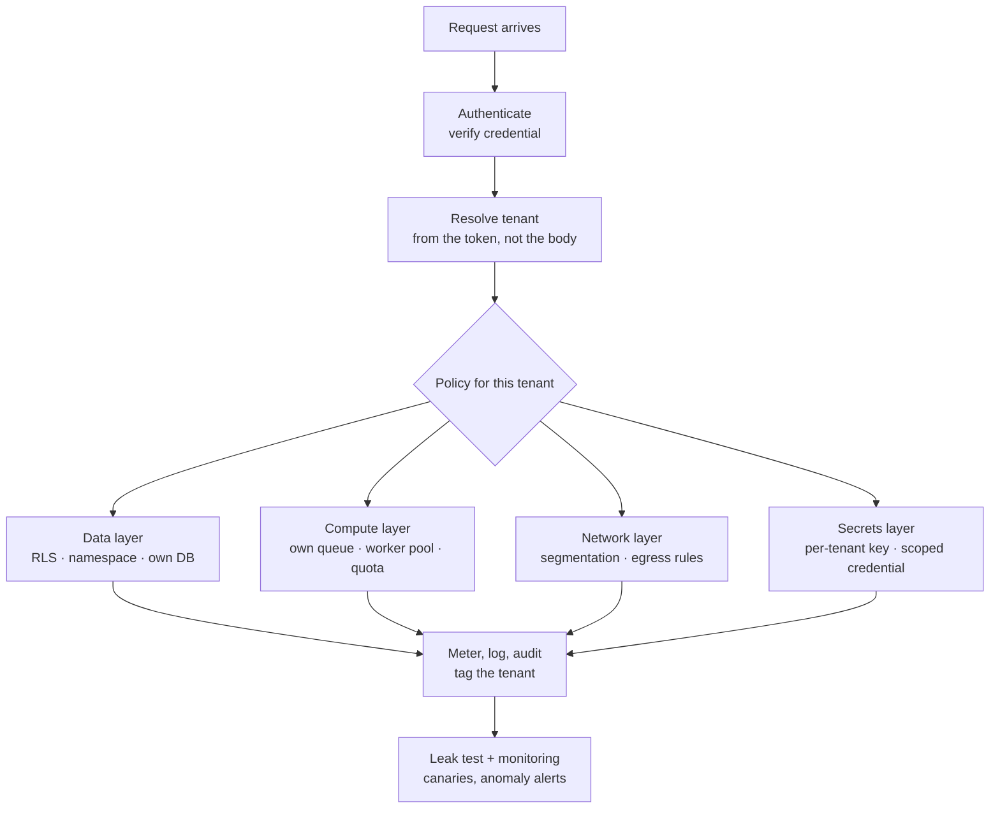

# Tenant Isolation

> **Interview answer (say this first).** Tenant isolation means one tenant's data, compute, and credentials cannot reach another tenant, even when a bug or an attacker gets past the application. You enforce it at every layer: **identity** (derive the tenant from a verified credential, never from the request body), **data** (row-level security, a namespace, or a database per tenant), **compute** (queues and worker pools), **network** (segmentation and egress rules), and **secrets** (per-tenant keys). A `WHERE tenant_id = ...` filter is necessary but not sufficient, because one forgotten clause or one shared cache leaks data. You prove isolation with canary leak tests in CI.

## Why this exists

A single-tenant system serves one organisation. Everything in it belongs to that organisation, so any query may see anything. Life is simple.

A **multi-tenant** system serves many organisations from the same code, the same model, and often the same database and cluster. Now every read and every write has a hidden second question: **which tenant owns this, and is the caller allowed to touch it?**

Miss that question once and you get the worst class of production bug: **cross-tenant leakage**. One customer's private document appears in another customer's answer. This is a breach and a contract violation, and in many settings a regulatory event. The same mistake on the write path is worse: one tenant overwrites or deletes another tenant's data.

The failure is usually quiet. A helper function reads a record by id and never checks the tenant:

```python
def fetch_unsafe(tenant_id, doc_id):
    for d in DOCS:
        if d["id"] == doc_id:
            return d["text"]      # BUG: tenant_id is ignored
    return None
```

It passes every test in development, because the developer's test data has one tenant. In production, tenant `acme` asks for `d2` and receives `globex`'s document. The model then summarises it and emails it to the wrong customer.

Multi-tenancy is not one feature you add at the end. It is a **property of every layer**: identity, indexes, queries, caches, logs, queues, quotas, and encryption keys all carry a tenant dimension. This page shows how to keep that dimension from the request to the byte on disk.

## Start from zero

| Word | Plain meaning |
| --- | --- |
| **Tenant** | One customer or organisation using your system. One tenant contains many users. |
| **Multi-tenancy** | Serving many tenants from one shared deployment. |
| **Isolation** | Making sure one tenant cannot read or change another tenant's data or resources. |
| **Tenant scoping** | Attaching the owning tenant to every object, query, and cache entry. |
| **Logical isolation** | Sharing one store and separating rows with a filter or policy. |
| **Physical isolation** | Giving a tenant its own database, cluster, or account. |
| **Silo model** | A fully separate stack per tenant. The strongest and most expensive option. |
| **Shared model** | One stack for everyone, separated by `tenant_id`. The cheapest option. |
| **Row-level security (RLS)** | A database feature where the database itself hides rows that fail a policy. |
| **Namespace** | A named partition inside one service or database, for example a vector collection per tenant. |
| **Blast radius** | How much is affected when one control fails. Isolation shrinks it. |
| **Noisy neighbour** | One tenant's heavy load slows or starves other tenants on shared hardware. |
| **Side channel** | Information leaked indirectly, by timing, cache behaviour, error text, or result counts. |
| **Cache key** | The identity of a cached answer. If it omits the tenant, answers cross over. |
| **Per-tenant key** | A separate encryption key for each tenant, usually wrapped by a shared KMS. |
| **Envelope encryption** | Encrypt data with a data key, then encrypt that data key with a master key. |
| **KMS** | Key Management Service: a managed store that creates, wraps, and audits keys. |
| **Canary document** | A unique, harmless record planted so a leak becomes visible immediately. |
| **Leak test** | A test that queries as one tenant and asserts nothing from another tenant appears. |
| **Network policy** | A rule that allows or blocks traffic between workloads or namespaces. |
| **Data residency** | A rule that some tenants' data must stay in a specific country or region. |

Three pairs are easy to confuse:

- **Logical vs physical isolation** is about *where the data lives*. Logical shares a store and filters; physical gives a separate store.
- **Isolation vs access control** is related but different. Isolation keeps tenants apart; access control (a separate topic) also keeps *users inside one tenant* apart. You need both.
- **Isolation vs encryption** is also different. Encryption protects data if the store leaks; isolation prevents the read in the first place. Encryption does not fix a missing tenant check, because the application has the key.

## The core idea

Picture an office building. Some landlords give every company a locked floor with its own lift and its own keys (**physical isolation**). Others run one open-plan floor where every desk has a nameplate, and everyone is trusted to read only desks with their own name (**logical isolation**).

The open-plan floor is cheaper and easier to run. But if the nameplate rule is forgotten, one company reads another's mail, and the room itself does not stop them. The locked floor is safer, but it costs more even when a tenant is tiny.

Now add the wrinkle that makes this a real design problem: even the locked-floor building shares a front door, a power supply, a fire alarm, and a landlord. Shared control planes, shared key services, and shared CI are the same. Isolation reduces coupling; it almost never removes it.



The tenant enters at the top and must survive every step. A check added only at the end is too late: the wrong data has already left the store and reached the model, the cache, and the logs.

Here are the two common models and what each one actually buys you:

| Model | How it stores | Isolation strength | Main cost | Best for |
| --- | --- | --- | --- | --- |
| Shared table + `tenant_id` (RLS) | One table, one index, one cluster | Medium — depends on the policy holding | Lowest | Many small tenants, lower sensitivity |
| Namespace / schema / partition per tenant | Shared server, separate logical store | Medium to strong | Medium | Mid-size tenants, clearer boundaries |
| Database or cluster per tenant | Fully separate store | Strongest | Highest | Regulated, large, or high-risk tenants |

Most real systems are **hybrid**: shared by default, a dedicated namespace for paying tiers, and a dedicated database for the few customers with the strictest contracts.

> **Note:**
>
> **The one-sentence rule.** Isolation is not a setting you turn on; it is a property you enforce at every layer and then prove with tests. If the tenant is not in the identity, the data, the compute, the network, and the keys, it is not isolated.

## How it works

1. **Authenticate and resolve the tenant.** The request carries a credential: a token, a session, or an API key. A verified token maps to exactly one tenant. Never let the client send an arbitrary `tenant_id`; derive it from the credential, and treat any mismatch between the token and the body as a security incident.

2. **Put the tenant in request context.** Store it once, in a `ContextVar` in Python or the request object in another language. Every function reads it from there. This removes the chance that one code path forgets to pass it down.

3. **Tag every object at write time.** When you store a document, chunk, vector, job, or file, write `tenant_id` on it. Reject records with no owner rather than storing them with a default. Defaults are how data ends up in the wrong tenant.

4. **Enforce in the data layer.** Prefer enforcement that a buggy query cannot silently skip: a per-tenant namespace, a separate database, or PostgreSQL RLS. RLS is **defence in depth, not an application-proof boundary**: the `app.tenant_id` value it reads is an application-supplied custom setting, and any role that can run SQL can change it. So never build SQL by string interpolation; bind parameters.

5. **Pre-filter, never post-filter.** Apply the tenant condition inside the query that ranks or selects. Fetching a global top-K and filtering afterwards loses results under load and moves restricted data closer to the model, the cache, and the logs.

6. **Scope compute.** Give tenants their own queues, worker pools, or concurrency limits. A shared unlimited pool lets one tenant's batch job consume the whole cluster. For the largest tenants, a dedicated pool or replica is often cheaper than the incident.

7. **Segment the network.** Use network policies, private endpoints, and egress rules so a workload in tenant A's namespace cannot reach tenant B's database. Egress control also limits exfiltration: a compromised agent should not be able to reach arbitrary hosts.

8. **Use per-tenant keys and credentials.** Encrypt each tenant's data with its own data key, wrapped by a shared KMS. Give workloads credentials scoped to one tenant where possible, so a stolen credential affects one tenant, not all of them.

9. **Meter and limit.** Tag every model call, embedding, and storage byte with the tenant, then enforce quotas. This protects other tenants from a noisy neighbour and turns one shared bill into per-tenant numbers.

10. **Test isolation continuously.** Plant one canary document per tenant, query as every tenant with adversarial prompts, and assert that no response, citation, cache entry, log line, or export ever contains another tenant's canary. Run it in CI and after every change to the retrieval path.

11. **Handle deletion and residency deliberately.** "Delete tenant X" must reach documents, chunks, vectors, caches, logs, and backups. "Keep tenant X in region Y" may force a separate database even when sharing would be cheaper.

## The syntax you will use

These are real production forms, smallest to largest. The SQL is PostgreSQL with pgvector; the Python is plain standard library.

**1. Row-level security: the database enforces the tenant for you.**

```sql
ALTER TABLE chunks ENABLE ROW LEVEL SECURITY;

CREATE POLICY tenant_isolation ON chunks
  USING      (tenant_id = current_setting('app.tenant_id')::uuid)
  WITH CHECK (tenant_id = current_setting('app.tenant_id')::uuid);
```

A query with no tenant clause still returns only the rows the policy allows. If `app.tenant_id` is unset, `current_setting('app.tenant_id')` raises an error, so the query fails closed rather than returning another tenant's rows. But `app.tenant_id` is just a setting any SQL-running role can change, so keep using bound parameters and treat RLS as one layer.

**2. Set the tenant for the transaction.** `SET LOCAL` scopes the value to the current transaction.

```sql
SELECT set_config('app.tenant_id', $1, true);   -- true = local to this transaction
```

Run it at the start of every request, in the **same transaction** as the query. With `true`, the value resets when the transaction ends, so a pooled connection cannot leak it to the next request.

**3. Force RLS even for the table owner.** Owners bypass their own policies by default.

```sql
ALTER TABLE chunks FORCE ROW LEVEL SECURITY;
```

Without this, an application that connects as the table owner silently skips the policy.

**4. Partition by tenant for very large shared tables.** Each partition can carry its own index and lifecycle.

```sql
CREATE TABLE chunks (
    id        bigserial,
    tenant_id uuid NOT NULL,
    content   text,
    embedding vector(1536)
) PARTITION BY LIST (tenant_id);

CREATE TABLE chunks_acme PARTITION OF chunks FOR VALUES IN ('<acme-uuid>');
```

RLS is per table, so enable it and create the policy on every partition too, or route all queries through the parent.

**5. Carry the tenant through the request with `contextvars`.**

```python
from contextvars import ContextVar

current_tenant: ContextVar[str] = ContextVar("current_tenant")
```

Every query function calls `current_tenant.get()` and **fails closed** if it is unset. No tenant means no query. In FastAPI, set it in middleware from the verified token.

**6. A per-tenant namespace in a vector database.** The tenant is part of the address, not a filter you might forget.

```python
results = client.search(
    namespace=f"tenant-{tenant_id}",   # a separate logical store
    vector=query_embedding,
    top_k=5,
)
```

**7. A per-tenant KMS key (envelope encryption).** The data key encrypts the data; the KMS key wraps the data key.

```python
# Pseudocode: the important part is that the key is chosen by tenant.
data_key = kms.generate_data_key(key_id=tenant_key_id(tenant_id))
ciphertext = encrypt(plaintext, data_key)
```

**8. A Kubernetes network policy per tenant namespace.**

```yaml
apiVersion: networking.k8s.io/v1
kind: NetworkPolicy
metadata:
  name: deny-cross-tenant
  namespace: tenant-acme
spec:
  podSelector: {}
  policyTypes: [Ingress, Egress]
  ingress:
    - from:
        - podSelector: {}          # only pods in this namespace
```

Default-deny both directions, then allow only the shared services the tenant legitimately needs.

## Examples: simple to real

These examples share one tiny, dependency-free setup: a list of documents owned by two tenants.

```python
DOCS = [
    {"tenant": "acme",   "id": "d1", "text": "acme refund policy"},
    {"tenant": "acme",   "id": "d3", "text": "acme holiday calendar"},
    {"tenant": "globex", "id": "d2", "text": "globex refund policy"},
]
TENANTS = ["acme", "globex"]
```

**Example 1 — the leak: an unscoped read.** A function that looks up by id and ignores the owner. It takes `tenant_id` so it matches the leak test's call signature, then throws it away.

```python
def fetch_unsafe(tenant_id, doc_id):
    for d in DOCS:
        if d["id"] == doc_id:
            return d["text"]      # BUG: tenant_id is ignored
    return None
```

Illustrative output for `acme` asking for `d2`:

```text
globex refund policy
```

The lookup was valid; the missing tenant check was the bug.

**Example 2 — scoped read that fails closed.**

```python
def fetch_scoped(tenant_id, doc_id):
    if not tenant_id:
        raise RuntimeError("no tenant in context: refuse to read")
    for d in DOCS:
        if d["tenant"] == tenant_id and d["id"] == doc_id:
            return d["text"]
    return None
```

Illustrative output:

```text
ex2 scoped acme reads d2: None
ex2 no tenant -> no tenant in context: refuse to read
```

Scoping turns a leak into a `None`, and a missing tenant into a refusal instead of an unfiltered read.

**Example 3 — a cross-tenant leak test with canaries.** Query as every tenant against every other tenant's document ids.

```python
def run_leak_test(fetch, docs, tenants):
    failures = []
    for attacker in tenants:
        for d in docs:
            if d["tenant"] == attacker:
                continue
            got = fetch(attacker, d["id"])
            if got is not None:
                failures.append((attacker, d["tenant"], d["id"]))
    return failures
```

Illustrative output:

```text
ex3 unsafe failures: 3
ex3 scoped failures: 0
```

Three leaks with the unsafe reader, zero with the scoped one. This is the test to run in CI; it is cheap and it catches the exact bug that causes breaches.

**Example 4 — a cache key that forgets the tenant.** The cache is not a database, but it leaks just as hard.

```python
def answer(cache, key, compute):
    if key in cache:
        return cache[key]
    cache[key] = compute()
    return cache[key]

cache = {}
shared_key = ("user-1", "m1", "refund policy")   # BUG: no tenant
answer(cache, shared_key, lambda: "acme's private answer")
```

Illustrative output when `globex` reads the same key:

```text
ex4 globex gets: acme's private answer
```

Include tenant, user, model version, and ACL version in every cache key.

**Example 5 — the noisy neighbour, and a fair scheduler.** A big tenant floods a shared queue and pushes a small tenant's request to the back.

```python
from collections import deque, defaultdict
requests = [("acme", i) for i in range(3)] + [("globex", 99)]

def fair_order(requests):
    buckets = defaultdict(deque)
    for tenant, rid in requests:
        buckets[tenant].append(rid)
    order = []
    while any(buckets.values()):
        for tenant in list(buckets):
            if buckets[tenant]:
                order.append((tenant, buckets[tenant].popleft()))
    return order
```

Illustrative output:

```text
ex5 fifo: ['acme', 'acme', 'acme', 'globex']
ex5 globex position in fifo: 3
ex5 globex position in fair: 1
```

Per-tenant queues with round-robin scheduling move the small tenant from last place to second. Noisy-neighbour problems hide in the tail latency, not the average.

**Example 6 — per-tenant key separation.** A per-tenant key shrinks the blast radius: a tag made for `acme` does not verify for `globex`.

```python
import hashlib, hmac

def tenant_key(master_secret, tenant_id):
    return hashlib.sha256(master_secret + b":" + tenant_id.encode()).digest()

def seal(master_secret, tenant_id, message):
    return hmac.new(tenant_key(master_secret, tenant_id), message, hashlib.sha256).hexdigest()[:16]
```

Illustrative output:

```text
ex6 verify as acme: True
ex6 verify as globex: False
```

This demonstrates key *separation*, not a real cipher. In production the KMS does this the same way: one logical key per tenant, wrapped by a shared master key. Caveat: this does not protect a tenant if the application itself is compromised and can ask the KMS to use that tenant's key; it limits the blast radius, it does not remove trust in the app.

## In production

- **Derive `tenant_id` from the credential, never from request input.** If the client can send `tenant_id`, an attacker can send someone else's. Tie it to the authenticated token and alarm on any mismatch.
- **Enforce isolation in the data layer, not only the app.** RLS, namespaces, or separate databases keep working when a developer writes a query with no filter. App-level `WHERE` clauses are a second line of defence.
- **Never post-filter.** It loses recall under load (a big tenant can fill the global top-K) and moves restricted data closer to the model, the cache, and the logs. Push the predicate into the query.
- **Turn missing tenant context into an error.** A default of "all tenants" is a breach waiting to happen. Fail closed: no tenant, no query.
- **Tag every object at write time, and validate the tag.** One untagged chunk in a shared index can surface in the wrong tenant's answer forever. Reject untagged writes.
- **Protect the caches.** Response caches, embedding caches, and prompt caches keyed only by content will cross tenants. Include tenant, user, ACL version, and model version in the key.
- **Remember that physical isolation is not absolute.** Tenants on separate databases still share a control plane, a CI system, a KMS, and an operator. A privileged operator or a shared deployment bug can still reach both. Isolation reduces coupling; it does not remove it.
- **Watch side channels.** Result counts, scores, timing, error text, and "no such document" versus "access denied" can reveal that another tenant's record exists. Return generic errors and avoid tenant-specific timing.
- **Contain the noisy neighbour.** Use per-tenant queues, rate limits, and quotas, and dedicated replicas for the largest tenants. Measure p95 and p99 per tenant, not just the mean.
- **Do not forget the model and the training path.** Tenant data must not enter fine-tuning or evaluation datasets unless the contract allows it. Once it is in weights, it cannot be surgically removed.
- **Test isolation with canaries in CI and in production.** A canary that never appears anywhere is your evidence. An alert when a canary surfaces in the wrong place is your detection.
- **Keep residency and deletion in the data map.** Know every place a tenant's bytes can live: object store, database, vector index, cache, logs, analytics copies, and backups. "Delete tenant" must reach all of them.

## Interview questions

### 1. What is tenant isolation, and why is it more than a database filter?

**Answer.** It is the guarantee that one tenant cannot read or change another tenant's data or consume another tenant's resources. A `WHERE tenant_id = ...` filter is one part, but isolation must hold in identity (tenant resolved from the token), data (RLS or separate stores), compute (queues and pools), network (segmentation), and secrets (per-tenant keys). Any layer that carries the tenant dimension but forgets it is a leak path.

**Follow-up: "What is the smallest change that prevents the classic leak?"** Resolve the tenant from the credential and make the data layer refuse a read with no tenant, so a missing filter becomes a denial of service, not a breach.

**Trap.** Treating isolation as a database concern only. Caches, logs, queues, exports, and backups leak just as easily.

### 2. Shared index with a filter, or a store per tenant — how do you choose?

**Answer.** Start from the threat, then the scale and cost. If a leak is catastrophic or residency requires separation, isolate. If there are many small tenants with low-sensitivity data, share one store and enforce `tenant_id` in the database. In between, use a namespace or schema per tenant. Tenant size matters too: a huge tenant deserves its own store to avoid noisy-neighbour effects.

**Follow-up: "What is the hybrid pattern?"** Shared by default, dedicated namespaces for paid tiers, and a fully dedicated database for the few customers with the strictest contracts.

**Trap.** Saying "physical isolation is always safe." It is safer, not safe: tenants still share a control plane, a KMS, and operators.

### 3. Why is logical isolation not enough on its own?

**Answer.** Because it depends on every query, cache, log, and job remembering the tenant. One forgotten filter, one cache key without the tenant, or one analytics job with a broader role defeats it. That is why you combine logical separation with enforcement the caller cannot skip — RLS, a namespace, or a separate store — and with continuous tests.

**Follow-up: "What is the classic RLS gotcha?"** The table owner bypasses policies unless you run `ALTER TABLE ... FORCE ROW LEVEL SECURITY`, and a value set with `SET` instead of `SET LOCAL` can persist on a pooled connection into the next request.

**Trap.** Assuming a correct filter makes post-filtering safe. It still exposes restricted data to the process and loses recall.

### 4. What are noisy-neighbour and side-channel problems, and how do you handle them?

**Answer.** A noisy neighbour is one tenant's load degrading another's: saturating embedding workers, filling a shared queue, or pushing up tail latency. Handle it with per-tenant queues, rate limits, quotas, and dedicated capacity for heavy tenants. A side channel is information leaked indirectly — result counts, timing, cache hits, or "access denied" versus "not found" — which can reveal that another tenant's data exists even when the data itself is blocked. Reduce it with generic errors and per-tenant isolation of caches and metrics.

**Follow-up: "Why measure p99 per tenant?"** Noisy-neighbour problems hide in the tail. A good average across all tenants can hide a small tenant that is starved on every request.

**Trap.** Only adding a global rate limit. One tenant can stay under the global limit while still using most of the shared capacity.

### 5. How do per-tenant keys and credentials help, and what do they not do?

**Answer.** Per-tenant keys mean one leaked data key exposes one tenant, not all of them, and they make key rotation and deletion per tenant possible. Scoped credentials give a workload the minimum access to one tenant. What they do not do is fix a missing tenant check: the application has access to the key, so a bug that reads the wrong row still decrypts fine. Keys shrink the blast radius; they do not replace access control.

**Follow-up: "What is envelope encryption?"** Encrypt the data with a data key, then encrypt that data key with a master key held in a KMS. You rotate the master key without re-encrypting all the data, and the KMS logs every use.

**Trap.** Believing encryption prevents cross-tenant reads. If the application can request the key, encryption is at-rest protection, not access control.

### 6. How do you prove tenants are isolated?

**Answer.** Use canaries and negative tests. Give every tenant a unique canary record. Then, as each tenant, run a large, adversarial query set and assert that no result, citation, cache entry, log line, or export ever contains another tenant's canary or document ids. Add tests for permission changes and deletion propagation. Run the suite in CI.

**Follow-up: "Where do leaks hide even when the database is correct?"** Application caches keyed without the tenant, logs and metrics that store raw queries, admin and analytics tools with broad roles, exports, and backups restored into a shared environment.

**Trap.** Testing only the happy path. Isolation must hold for adversarial phrasing, pagination, retries, and error paths.

### 7. A tenant asks you to delete all their data. What does that involve?

**Answer.** Remove the source documents, all chunks and vectors, cached answers and embeddings, derived summaries, logs that contain their text, and backups according to policy. Verify with a canary that nothing is retrievable. You need a **data map** that lists every place the tenant's bytes can live, because data gets copied into indexes, caches, analytics stores, and backups.

**Follow-up: "Why is deletion harder than it sounds?"** Because copies are everywhere, and some stores are append-only or immutable for a retention period. Plan deletion when you design the pipeline, not when a customer asks.

**Trap.** Deleting only the main table and forgetting the vector index, the response cache, and the original files in object storage. If tenant data entered model training, it cannot be surgically removed — one strong reason to keep it out.

### 8. How does tenant isolation interact with data residency and compliance?

**Answer.** Residency rules say where data may be stored and processed. They can force a separate database or cluster for a tenant even when sharing would be cheaper, and they can limit which region a model call may reach. Compliance requirements vary by industry and jurisdiction, so treat this as a design input from legal and security, not something to guess. The engineering job is to make the tenant's region a first-class attribute and enforce it in the routing and storage layers.

**Follow-up: "Where does residency usually break?"** In shared caches, shared analytics, and cross-region replicas or backups, not in the primary database. Audit the copies.

**Trap.** Promising a specific legal outcome. State what the architecture enforces, and defer the legal interpretation to the people who own it.

## Remember this

- **Isolation is a property of every layer.** Identity, data, compute, network, and keys all carry the tenant; if one forgets, you have a leak path.
- **Derive the tenant from the credential, and fail closed.** No tenant context means no query, never "all tenants".
- **Enforce in the data layer.** RLS, namespaces, or separate stores keep working when a query forgets a filter; app-level clauses are a second line of defence.
- **Logical isolation is necessary but not sufficient.** One forgotten cache key or one broad analytics role is enough to cross tenants.
- **Prove it with canary leak tests in CI,** and shrink the blast radius with per-tenant keys, scoped credentials, and quotas.
