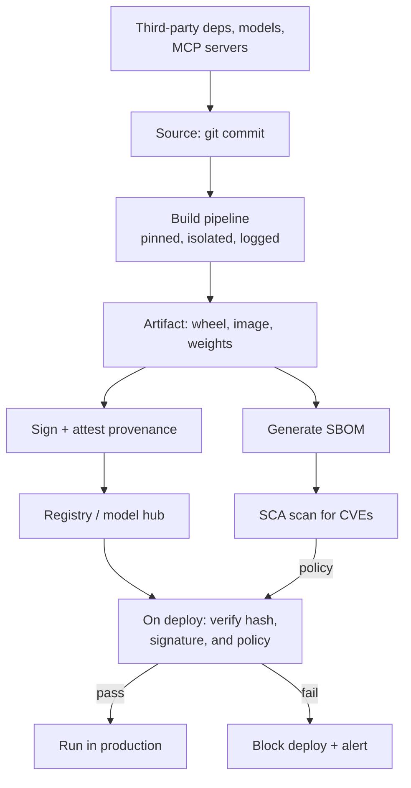

# Supply-Chain and Dependency Security

> **Interview answer (say this first).** Your system trusts everything it installs and loads: Python packages, model weights, container base images, and third-party MCP servers. Supply-chain security is about controlling that trust. You **pin** exact versions and commit the **lockfile**, verify **hashes** and **signatures**, check **provenance** (where the artifact was built and by whom), produce an **SBOM** so you know what you shipped, run **SCA** scanning for known CVEs, and watch for **typosquatting** and malicious packages. Models and MCP servers are dependencies too, with their own risks, and a **reproducible build** is what lets you prove the artifact matches the source.

## Why this exists

A modern service is mostly other people's code. A typical Python app pulls in tens or hundreds of transitive dependencies; a container image adds a whole operating system; an agent adds models and MCP servers authored by third parties. Each one is code you did not write that runs with your permissions and can read your data.

Attackers know this. The easiest way into a well-defended system is often not to break the front door but to publish a package that looks like a popular one, or to compromise a maintainer's account and ship a malicious release. The famous incidents follow the same pattern: a package update that runs a credential-stealer at install time, a dependency that quietly adds a network call, a build tool whose pipeline was tampered with.

AI systems widen the surface:

- **Model weights** are downloaded from public hubs. Some formats can execute code when loaded.
- **Third-party MCP servers** are code you did not write, granted tools that touch real systems.
- **Prompt and tool templates** are data, but they steer behaviour, so they are effectively code.
- **Notebooks and datasets** often contain pickle files that execute on load.

The problem is not "dependencies are bad". Reusing code is how software gets built. The problem is **uncontrolled** trust: installing whatever the resolver picks, with no pin, no hash, no review, and no way to answer "what is actually in production?"

> **Note:**
>
> **The one-sentence purpose.** Know exactly what you install, prove it is what you intended, and be able to trace it back to a source you decided to trust.

## Start from zero

| Word | Plain meaning |
| --- | --- |
| **Dependency** | A package or artifact your code needs to run. |
| **Transitive dependency** | A dependency of a dependency. Most of your tree is transitive. |
| **Lockfile** | A file that records the exact resolved versions (and often hashes) of every dependency. |
| **Pinning** | Requiring an exact version, such as `==1.2.3`, instead of a range. |
| **Hash** | A fingerprint of a file. If the bytes change, the hash changes. |
| **Checksum verification** | Refusing to install if the artifact's hash does not match the recorded one. |
| **Signature** | A cryptographic proof that an artifact came from a key holder. |
| **Provenance** | A signed record of where and how an artifact was built. |
| **Attestation** | A signed claim, such as "this image was built from this commit by this pipeline". |
| **SBOM** | Software Bill of Materials: a list of the components in an artifact. |
| **SCA** | Software Composition Analysis: scanning dependencies for known vulnerabilities and licences. |
| **CVE** | A public identifier for a known vulnerability. |
| **CVSS** | A score for how severe a vulnerability is. It is an input, not a decision. |
| **Typosquatting** | Publishing a package with a name almost identical to a popular one. |
| **Dependency confusion** | Tricking a build into pulling a public package that shadows an internal one. |
| **Reproducible build** | Building the same source twice and getting byte-identical output. |
| **Build integrity** | Confidence that the pipeline and inputs that produced an artifact were not tampered with. |
| **Safetensors** | A model format that stores weights as plain tensors, without running code on load. |
| **Pickle** | A Python format that can run code when loaded, so it is dangerous for untrusted data. |
| **Vendoring** | Copying a dependency's source into your repo so you control it. |

Two pairs are easy to confuse:

- **Hash vs signature** is about *what you can prove*. A hash proves the bytes match a value you already trust; a signature proves who produced them, provided you trust the signer's key.
- **Pinning vs locking** is levels of the same idea. Pinning names one direct version; a lockfile records the exact versions and hashes of the entire transitive tree. You want both.

## The core idea

Think about a restaurant kitchen. Ingredients arrive from many suppliers. A good kitchen checks that the delivery matches the order (a hash), knows which farm it came from (provenance), keeps a list of everything on the shelves (an SBOM), and has a rule about which suppliers it trusts. It does not accept an unlabelled box because it is cheaper.

Software supply chain is the same. The lockfile is the delivery manifest; hashes are the seal; the SBOM is the inventory; scanning is the food-safety check. Trust is a decision you make per source, and you want to be able to trace any dish back to its ingredients.



The chain is only as strong as its weakest verified link. Signing the artifact does nothing if the build itself pulled a package nobody checked. Pinning dependencies does nothing if the lockfile is not enforced at install time.

A trust decision is just a table. Build one per dependency class:

| Source | Example risk | Primary control | Limit of that control |
| --- | --- | --- | --- |
| Python package | Malicious update, typosquat | Pin + hash, lockfile, review new packages | Maintainer account takeover ships a bad release of a trusted name |
| Container base image | Old OS packages, tampering | Minimal pinned base, scan, sign | Upstream tag can move unless pinned by digest |
| Model weights | Malicious pickle, backdoor | Prefer safetensors, scan, pin by hash | A clean file can still hold a poisoned model |
| Third-party MCP server | Broad scopes, tool poisoning | Pin version, allowlist tools, least privilege | Server changes behaviour within an approved tool |
| Build pipeline | Injected step, leaked token | Isolated runners, least-privilege tokens, provenance | A compromised upstream build step |

Reading the "limit" column is what separates a real answer from a slogan. Every control has a boundary.

> **Warning:**
>
> **A CVE scan is not a risk decision.** A `critical` score on a library you never call may matter less than a `medium` on a path an attacker reaches. Use severity to prioritise, then check exploitability and reachability.

## How it works

1. **Declare dependencies and pin them.** Direct dependencies get exact versions where practical, and every dependency goes into a lockfile with hashes. Reviews focus on *adding* a dependency, because that is when trust changes.

2. **Resolve once, in a controlled place.** The lockfile is generated by one trusted pipeline or by a reviewed command, committed to the repo, and used everywhere. Floating resolution at deploy time is how a build pulls a version nobody saw.

3. **Verify hashes at install.** Set `--require-hashes` (pip) or the equivalent so an artifact whose bytes do not match the lockfile fails the build. A hash mismatch is an incident, not a retry.

4. **Build in an isolated, logged pipeline.** Use ephemeral runners, least-privilege tokens, and no long-lived cloud keys. The build should be reproducible: same source and inputs, same output.

5. **Produce provenance and sign the artifact.** The pipeline records which commit, which pipeline, and which inputs produced the artifact, and signs that claim. On deploy, verify the signature and that the provenance matches policy.

6. **Generate an SBOM and store it with the artifact.** SPDX or CycloneDX are the common formats. The SBOM is how you answer "are we affected?" in minutes when the next critical CVE lands.

7. **Scan continuously with SCA.** Scan the lockfile and the image on every build and on a schedule, because new CVEs are published against code you already shipped. Route findings by reachability and exposure, not only score.

8. **Watch for name confusion.** Detect typosquats by comparing new names against your trusted list, and configure internal package indices so internal names cannot be shadowed by public ones.

9. **Treat models and MCP servers as dependencies.** Pin model versions by hash, prefer safe formats, review a server's scopes and tools, allowlist its tools, and re-review when it changes.

10. **Enforce it in CI, not in a wiki.** A policy check that fails the build is real. A checklist nobody runs is not. Block deploys on unsigned artifacts, missing SBOMs, or a failed hash.

11. **Keep an inventory and a response plan.** When a vulnerability is announced, the SBOM and lockfile tell you where it is; a patched-version policy tells you how fast you must upgrade.

## The syntax you will use

**1. Pin and hash in a requirements file.** `--require-hashes` makes the hash a hard gate.

```text
# requirements.txt
requests==2.32.3 \
    --hash=sha256:70761cfe03c773ceb22aa2f671b4757976145175cdfca038c02654d061d6dcc6
urllib3==2.2.2 \
    --hash=sha256:a448b2f64d686155468037e1ace9f2d2199776e17f0a46610480d311f73e3472
```

Then install with `pip install --require-hashes -r requirements.txt`. Any artifact whose bytes differ fails.

**2. A lockfile is the full resolved tree.** Tools such as pip-tools, Poetry, uv, or npm produce it.

```text
# uv.lock / poetry.lock / package-lock.json (conceptual shape)
name    = "urllib3"
version = "2.2.2"
hash    = "sha256:a448b2f6..."
```

Commit it, review changes to it, and install from it in CI. A large unexplained lockfile diff is a review signal.

**3. Verify a downloaded artifact hash before use.**

```python
import hashlib

def sha256_hex(data: bytes) -> str:
    return hashlib.sha256(data).hexdigest()

assert sha256_hex(artifact) == pinned_hash, "artifact hash mismatch"
```

This proves the bytes match the value you trust. It does not prove who produced them; that needs a signature or provenance.

**4. Pin a container image by digest, not a mutable tag.**

```dockerfile
FROM python:3.12-slim@sha256:2b0e3f...   # immutable digest
```

A tag like `latest` can move under you. A digest cannot.

**5. Prefer safe model formats.** `safetensors` stores tensors without executing code.

```python
from safetensors.torch import load_file
weights = load_file("model.safetensors")   # no arbitrary code on load
```

Avoid loading untrusted pickles. `torch.load` with `weights_only=True` is a safer mode where supported, but format choice is the stronger control.

**6. A minimal SBOM entry (CycloneDX shape).**

```json
{
  "bomFormat": "CycloneDX",
  "specVersion": "1.5",
  "components": [
    {"type": "library", "name": "requests", "version": "2.32.3",
     "purl": "pkg:pypi/requests@2.32.3"}
  ]
}
```

Generate it in the build and attach it to the release.

**7. A CI gate that blocks on policy.**

```yaml
- name: Scan dependencies
  run: |
    pip-audit -r requirements.txt --strict
    osv-scanner --lockfile=uv.lock
- name: Verify artifact
  run: cosign verify-blob --signature app.sig --certificate-identity ... app.tar.gz
```

The build fails closed. A finding you can ignore is a finding you will ignore.

## Examples: simple to real

These examples are plain standard library and print deterministic results.

**Example 1 — find unpinned and unhashed dependencies.** A build should reject both.

```python
def check_requirements(raw_lines):
    # A requirement can span lines via a trailing backslash; join those first.
    logical, pending = [], ""
    for raw in raw_lines:
        line = raw.rstrip()
        if pending:
            line = pending + line.lstrip()
        if line.endswith("\\"):
            pending = line[:-1] + " "
            continue
        pending = ""
        logical.append(line)

    problems = []
    for line in logical:
        line = line.strip()
        if not line or line.startswith("#"):
            continue
        if "==" not in line and " @ " not in line:
            problems.append((line, "not pinned"))
        elif "--hash=" not in line:
            problems.append((line, "no hash"))
    return problems

sample = ["requests==2.32.3", "flask>=3.0"]
print("ex1 problems:", check_requirements(sample))
```

Illustrative output:

```text
ex1 problems: [('requests==2.32.3', 'no hash'), ('flask>=3.0', 'not pinned')]
```

`flask>=3.0` can resolve to a different version in two builds; `requests` is pinned but has no hash, so a swapped artifact would not be caught. The parser joins backslash continuations first, so the hashed `requirements.txt` sample earlier in this page is read as one logical line and is not falsely flagged.

**Example 2 — verify an artifact hash.** Tampering with one byte fails the check.

```python
artifact = b"model-weights-or-wheel-bytes"
pinned_hash = sha256_hex(artifact)
tampered = artifact + b"x"
print("ex2 match:", sha256_hex(artifact) == pinned_hash)
print("ex2 tampered:", sha256_hex(tampered) == pinned_hash)
```

Illustrative output:

```text
ex2 match: True
ex2 tampered: False
```

The hash is only useful if it comes from a source you trust. A hash published next to the download does not help if the download page was compromised.

**Example 3 — build a minimal SBOM.** An inventory you can query when a CVE lands.

```python
def build_sbom(components):
    return {
        "bomFormat": "CycloneDX",
        "specVersion": "1.5",
        "components": [
            {"type": "library", "name": n, "version": v, "purl": f"pkg:pypi/{n}@{v}"}
            for n, v in components
        ],
    }
```

Illustrative output:

```text
ex3 sbom: {"name": "requests", "purl": "pkg:pypi/requests@2.32.3", "type": "library", "version": "2.32.3"}
ex3 component count: 2
```

The `purl` is a standard package URL, which makes SBOMs comparable across tools and registries.

**Example 4 — flag likely typosquats.** Compare a new package name against names you already trust.

```python
def levenshtein(a, b):
    prev = list(range(len(b) + 1))
    for i, ca in enumerate(a, 1):
        cur = [i]
        for j, cb in enumerate(b, 1):
            cur.append(min(prev[j] + 1, cur[j - 1] + 1, prev[j - 1] + (ca != cb)))
        prev = cur
    return prev[-1]

TRUSTED = ["requests", "urllib3", "numpy"]

def flag_suspicious(name):
    for good in TRUSTED:
        d = levenshtein(name, good)
        if d == 0:
            return None
        if 0 < d <= 2:
            return (name, good, d)
    return None
```

Illustrative output:

```text
ex4 'reqeusts': ('reqeusts', 'requests', 2)
ex4 'request' : ('request', 'requests', 1)
ex4 exact     : None
ex4 far       : None
```

A name within one or two edits of a trusted package deserves a manual look. `numpy` versus `numpi`, or `urllib3` versus `urllib`, are the classic shape.

**Example 5 — a vulnerability policy check.** Compare an installed version against an advisory range and a severity threshold.

```python
def parse_version(v):
    return tuple(int(p) for p in v.split("."))

def vulnerable(version, floor, fixed):
    return parse_version(floor) <= parse_version(version) < parse_version(fixed)

def policy_check(packages, advisory, threshold="high"):
    rank = {"low": 1, "medium": 2, "high": 3, "critical": 4}
    findings = []
    for name, version in packages:
        if name == advisory["package"] and vulnerable(version, advisory["introduced"], advisory["fixed"]):
            if rank[advisory["severity"]] >= rank[threshold]:
                findings.append((name, version, advisory["severity"]))
    return findings
```

Illustrative output:

```text
ex5 findings: [('urllib3', '2.2.1', 'high')]
```

This is a simplified range check; real scanners handle ranges, backports, and reachability. The policy step — fail the build above a threshold — is what makes scanning matter.

**Example 6 — a reproducible build check.** The same inputs must produce the same bytes.

```python
def build_hash(files):
    h = hashlib.sha256()
    for path in sorted(files):
        h.update(path.encode())
        h.update(files[path])
    return h.hexdigest()[:16]

build_a = {"app.py": b"print(1)", "meta.json": b'{"built": "2026"}'}
build_b = {"meta.json": b'{"built": "2026"}', "app.py": b"print(1)"}
print("ex6 same:", build_hash(build_a) == build_hash(build_b))
nondeterministic = dict(build_a, meta=b'{"built": "2026-09-14T12:00:00"}')
print("ex6 reproducible:", build_hash(build_a) == build_hash(nondeterministic))
```

Illustrative output:

```text
ex6 same: True
ex6 reproducible: False
```

File order no longer changes the hash, but embedding a build timestamp does. Reproducibility means removing non-deterministic inputs: timestamps, random paths, and network fetches at build time.

## In production

- **Commit the lockfile and install from it in CI.** A lockfile not enforced at install time is documentation, not a control. Review lockfile diffs; a surprise transitive addition is the interesting part.
- **Turn on hash verification and fail on mismatch.** `--require-hashes` (or the ecosystem equivalent) turns "we pinned it" into "we verified the bytes".
- **Pin container images by digest, and keep them minimal.** Distroless or slim bases reduce the number of OS packages an attacker can use. Rebuild regularly so patches reach you.
- **Sign artifacts and verify provenance on deploy.** Signing without verification changes nothing. Make the verifying step a hard gate in the deploy pipeline.
- **Generate and store an SBOM per release.** It is the fastest way to answer "are we affected?" and it is increasingly expected by customers and regulators. Keep it alongside the artifact, not in a wiki.
- **Scan on every build and on a schedule.** New CVEs are published against code already shipped. A one-time scan at release goes stale immediately.
- **Prioritise by reachability and exposure, not score alone.** A critical in a library you never call is different from a medium on a request path an attacker controls. Record your reasoning.
- **Detect name confusion and configure package sources.** Use an internal index or a scoped registry so internal package names cannot be shadowed by a public one, and flag near-miss names for review.
- **Treat models, datasets, and MCP servers as dependencies.** Pin model versions by hash, prefer safe formats, review server scopes and tools, allowlist what runs, and re-review on change. A model can hide unwanted behaviour even in a clean file format.
- **Make the build pipeline the trust anchor.** Ephemeral runners, least-privilege tokens, no long-lived cloud keys, and logs that record what was built from what. A compromised pipeline can defeat every downstream check.
- **Have an update and response plan.** Know how fast you must patch by severity and exposure, who decides, and how you verify the fix. The plan matters more than the scanner.
- **Do not trust a hash from the same place as the artifact.** A checksum on a compromised download page proves nothing. Prefer signed provenance from a root of trust you independently decided to trust.

## Interview questions

### 1. What is supply-chain security, and why does it matter for AI systems?

**Answer.** It is controlling what you install and load: dependencies, base images, model weights, and MCP servers. It matters because you run a lot of code you did not write, with your permissions, and attackers target that path. In AI systems the surface widens to model formats that can execute code, third-party servers with real tool access, and datasets that may contain pickles.

**Follow-up: "What is the highest-value first control?"** Enforce a lockfile with hashes in CI. It is cheap and it stops a whole class of "the artifact changed under us" attacks.

**Trap.** Treating supply-chain security as only a package scanner. Scanning tells you about known problems; pinning, hashes, provenance, and least privilege change what an attacker can do.

### 2. What is the difference between pinning and locking?

**Answer.** Pinning fixes an exact version for a direct dependency, such as `requests==2.32.3`. Locking records the exact resolved versions, and usually the hashes, of the entire transitive tree. Pinning alone leaves transitive dependencies free to float. A lockfile plus hash verification is what makes a build reproducible.

**Follow-up: "Why is a floating range a problem?"** `flask>=3.0` can resolve to a new release tomorrow. A build that succeeds today can pull different code next week, including a malicious release.

**Trap.** Committing a lockfile but installing with a plain `pip install -r requirements.txt` that ignores it. The control must run where the install happens.

### 3. How do hashes and signatures differ, and what does each prove?

**Answer.** A hash proves the bytes match a value you already trust; it is an integrity check. A signature proves the artifact was produced by the holder of a signing key, provided you trust that key, so it gives authenticity as well. Provenance goes further and records *how* it was built. A hash published next to the download is weak if the download page was compromised; signed provenance from an independently trusted root is stronger.

**Follow-up: "What is an attestation?"** A signed claim, such as "this container image was built from commit X by pipeline Y". You verify the claim against policy at deploy time.

**Trap.** Signing artifacts but never verifying. Signing is only useful when a gate rejects anything unsigned or signed by the wrong identity.

### 4. What is an SBOM, and when do you actually use it?

**Answer.** A Software Bill of Materials is a machine-readable list of the components in an artifact, commonly in SPDX or CycloneDX format. You generate it at build time and store it with the release. Its real value shows up during an incident: when a critical CVE is announced, the SBOM tells you in minutes which services and versions are affected, instead of a week of archaeology.

**Follow-up: "Does an SBOM fix anything?"** No. It is visibility, not a control. It is only useful if it is accurate and if you have a process to act on it.

**Trap.** Generating an SBOM once and letting it drift from what is deployed. Generate it in the pipeline for every release.

### 5. How do you defend against typosquatting and dependency confusion?

**Answer.** For typosquatting, flag new package names that are within a small edit distance of names you already trust, and require review before adding new dependencies. For dependency confusion, configure your package manager to use an internal index or a scoped namespace for internal packages, so a public package cannot shadow an internal name, and check the index priority order.

**Follow-up: "Why is adding a dependency a security decision?"** Because it changes the trust boundary. Every new transitive tree is new code with your permissions. A short approval that asks "what does this do and who maintains it?" prevents most accidents.

**Trap.** Relying only on a denylist of known-bad packages. By the time a name is on a denylist, it may already have been installed; allowlists and review work earlier.

### 6. How do you treat model weights and third-party MCP servers as dependencies?

**Answer.** Pin a model by version and hash, prefer safe serialization such as safetensors, and scan or inspect before loading. For MCP servers, pin the version, review the tools and scopes they request, allowlist which tools may run, apply least privilege, and fingerprint the tool definitions so a change forces re-review. A model can still behave badly even with a clean file, so behaviour is checked with evaluation and monitoring, not only file inspection.

**Follow-up: "Why is pickle dangerous?"** Loading a pickle can execute arbitrary code, so an untrusted pickle is equivalent to running an untrusted program. Prefer formats that store data only.

**Trap.** Assuming a scanned, clean model is safe. A backdoor can live entirely in the weights; file hygiene does not detect it.

### 7. What is a reproducible build, and why do you want one?

**Answer.** A build is reproducible when the same source, dependencies, and configuration produce a byte-identical artifact. It lets you verify that a published artifact really came from the reviewed source, and it makes tampering detectable. It requires removing non-determinism: build timestamps, random paths, and network fetches during the build.

**Follow-up: "Do you need full reproducibility to get value?"** No. Provenance and signed attestations give much of the benefit even when byte-for-byte reproducibility is hard. Reproducibility is the strongest form, not the only useful one.

**Trap.** Believing a build is reproducible because it "usually" matches. The value comes from the check catching the exception.

### 8. A critical CVE lands in a library you use. Walk me through your response.

**Answer.** Query the SBOM and lockfile to find every affected service and version. Check whether the vulnerable code path is reachable and exposed, since that changes urgency. Identify a fixed version or a mitigation such as configuration or a compensating control. Test the upgrade, deploy through the normal pipeline, and verify the SBOM now records the fixed version. If patching is slow, decide on temporary mitigations and record the accepted risk and its expiry. Communicate to affected owners and, if required, customers.

**Follow-up: "What if no fix exists yet?"** Apply compensating controls, restrict exposure, add detection, and set a review date. Do not silently accept it.

**Trap.** Patching on score alone without checking reachability, which wastes effort and creates churn; or ignoring a medium in a hot path. Severity is an input, not the decision.

## Remember this

- **Know what you install.** Pin versions, commit the lockfile, and verify hashes at install time.
- **Hashes for integrity, signatures and provenance for authenticity.** Verification must be a hard gate, not a suggestion.
- **SBOM plus scanning gives you visibility and response speed**, but neither is a substitute for least privilege.
- **Models and MCP servers are dependencies too.** Pin them, prefer safe formats, allowlist tools, and re-review on change.
- **Trust the build pipeline or nothing else holds.** Isolated, least-privilege, logged builds are the root of supply-chain trust.
