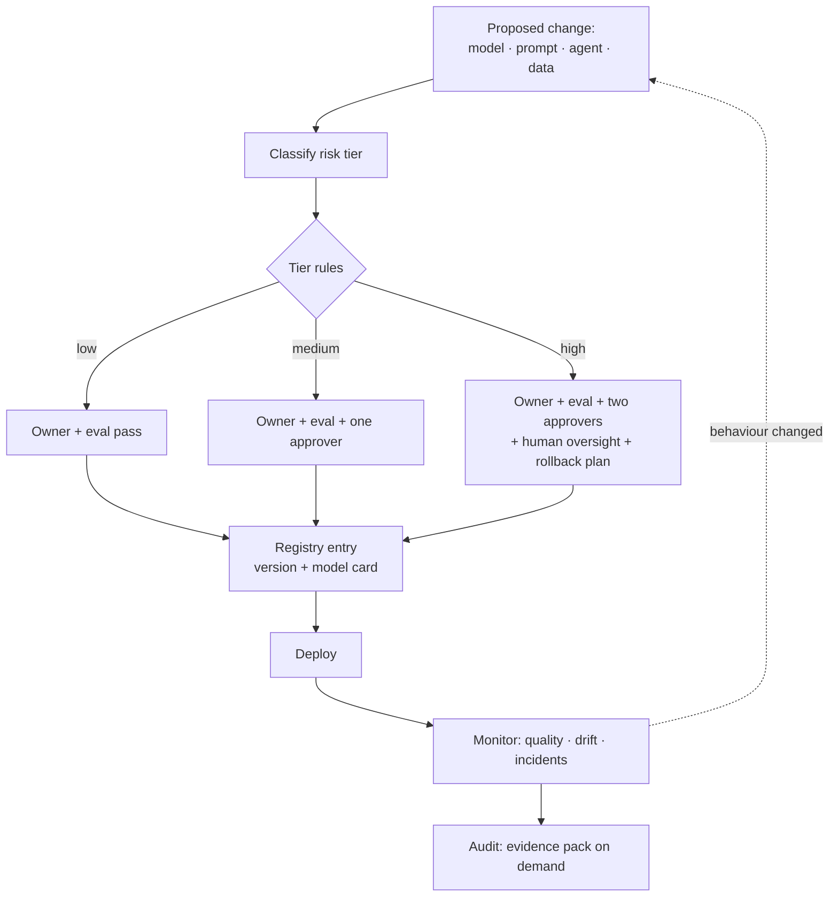

# AI Governance

> **Interview answer (say this first).** AI governance is the set of roles, policies, and evidence that keep an AI system accountable across its whole life. It covers four related things: **model governance** (which model versions run, and who approved them), **prompt governance** (prompts are reviewed, versioned, and changed like code), **agent governance** (what an agent may do and who owns it), and **data governance** (what it may learn from). The mechanism is **policy as code**: registries for models, prompts, and agents; risk classification; required approvals; and **audit evidence** you can produce on demand. It turns principles like fairness, transparency, accountability, and human oversight into concrete, enforceable process. It is not legal advice, and the compliance details belong to legal and risk owners.

## Why this exists

An AI system can be changed by a single string. Someone edits a system prompt, swaps a model version, widens an agent's tools, or swaps a fine-tune — and the behaviour of a production system changes with no code review and no trace. Two weeks later, a customer asks why answers changed, or an incident review asks who approved this, and there is no answer.

Traditional software has a change-management habit: version control, pull requests, review, release notes, rollback. AI systems often escape it because prompts look like configuration, models look like infrastructure, and agents look like a feature flag. Governance is how you bring them back under the same discipline.

Governance is also how an organisation answers to others. Customers, auditors, and regulators ask questions like: What is this system for? What data trained it? Who reviewed it? How do you detect harm? Who is accountable when it fails? Without registries, approvals, and logs, each question becomes a multi-week archaeology project. With them, it is a lookup.

The honest framing: governance does not make a model fair or safe by itself. It creates the process, ownership, and evidence that make it **possible to know** whether the system is behaving, and to change it when it is not. Controls still have to be technical.

> **Note:**
>
> **The one-sentence purpose.** Governance makes every meaningful change to an AI system owned, reviewed, recorded, and reversible — and turns stated principles into steps a pipeline can enforce.

## Start from zero

| Word | Plain meaning |
| --- | --- |
| **Governance** | The roles, rules, and records that keep a system accountable over time. |
| **Model governance** | Which models run, where they came from, and who approved them. |
| **Prompt governance** | Prompts are versioned, reviewed, tested, and changed like code. |
| **Agent governance** | What an agent may do, which tools it may use, and who owns it. |
| **Data governance** | What data may be used, for what purpose, and for how long. |
| **Registry** | A catalogue of approved models, prompts, agents, and tools with versions. |
| **Model card** | A short document describing a model's intended use, limits, and evaluation. |
| **Risk classification** | Putting a system into a tier — low, medium, high — that sets its controls. |
| **Policy as code** | Rules written so that a tool can evaluate them automatically. |
| **Approval gate** | A checkpoint that blocks a change until a named role approves it. |
| **Separation of duties** | The author of a change cannot also be its sole approver. |
| **Owner** | The named person or team accountable for a system. |
| **Reviewer** | A person who checks a change against policy and quality. |
| **Approver** | A person with authority to permit a change, often for high-risk systems. |
| **Change review** | The process of examining a proposed change before it ships. |
| **Audit evidence** | Artifacts that prove a control ran: approvals, evals, SBOMs, logs. |
| **Responsible AI** | A set of principles: fairness, transparency, accountability, human oversight. |
| **Human oversight** | A person can review, intervene in, or stop the system. |
| **Model drift** | Behaviour or accuracy changes over time as data and usage shift. |
| **Traceability** | Being able to connect a deployed behaviour back to a version and an approval. |

Four principles, made concrete:

- **Fairness** — the system should not cause unjustified different outcomes for different groups. Made concrete by measuring outcomes across groups and reviewing them.
- **Transparency** — people can know that AI is in use and how it was built. Made concrete by model cards, disclosure, and logging.
- **Accountability** — a named owner answers for the system. Made concrete by a registry owner and an approval record.
- **Human oversight** — a person can intervene. Made concrete by approval gates and a stop control.

## The core idea

Think of how hospitals govern medicines, not how they market them. A drug has an owner, a documented purpose, trials, a review board, an approved version, dosage limits, and a recall process. None of that makes the drug effective. It makes its use **deliberate, reviewed, and traceable**, and it makes harm detectable and reversible.

AI governance is that regime for models, prompts, and agents:

- a **registry** is the catalogue of approved items;
- a **model card** is the label and the leaflet;
- **risk classification** decides how much review an item needs;
- **approvals** are the review board;
- **audit evidence** is the record that the process ran.

The key insight is that governance should be enforced by the same pipeline that deploys the system, not by a committee meeting after the fact.



Every arrow is a record. The registry is the single source of truth for what is approved; the pipeline refuses to deploy anything that is not in it with the required approvals.

A risk tier is just a table. Define it once and let policy enforce it:

| Tier | Example | Minimum controls | Who approves |
| --- | --- | --- | --- |
| **Low** | Internal summarisation, no personal data | Owner, eval pass, registry entry | Team lead |
| **Medium** | Customer-facing assistant, personal data | Above, plus one independent approver, PII handling | Product + security reviewer |
| **High** | Safety-critical, rights-affecting, or regulated decisions | Above, plus two approvers, human oversight, rollback plan, monitoring | Cross-functional review board |

Reading the controls column is the work. A tier that changes nothing is a label, not governance.

> **Warning:**
>
> **Governance is not a substitute for technical controls.** A policy document cannot stop a prompt injection; an approval cannot bound a token's permissions. Governance decides and records; engineering enforces. Both are needed.

## How it works

1. **Name an owner for every model, prompt, and agent.** An unowned system is an ungoverned one. The owner is accountable for its behaviour, its documentation, and its review.

2. **Put everything in a registry.** Models, prompts, agents, tools, and datasets each get an entry with a version, an owner, a purpose, and a link to documentation. The registry is the list of what is approved to run.

3. **Classify risk.** Apply a defined rubric that looks at who is affected, whether the output influences a decision, whether personal or sensitive data is involved, and the potential for harm. The tier sets the required controls. Keep the rubric written and versioned, and take legal and risk input for the compliance aspects.

4. **Write the documentation.** A model card records intended use, limitations, training data sources, evaluation results, owner, and contact. It is written for someone who did not build the system.

5. **Version and review changes.** A prompt edit, a model swap, a tool addition, or a data-source change is a change like any other. It goes through review, tests, and approval before it reaches production.

6. **Enforce separation of duties.** The author of a change must not be its only approver. For high-risk systems, require independent approvers and a review board.

7. **Evaluate before and after.** An evaluation must pass before promotion, and monitoring runs after. A high-risk change without a passing evaluation is blocked by policy, not by memory.

8. **Encode the rules as policy as code.** The pipeline checks tier, owner, approvals, and evaluation results, and refuses to deploy when something is missing. The check is deterministic and repeatable, and it leaves a record.

9. **Define human oversight where it is required.** For high-risk actions, a person must be able to review, override, or stop the system. Record who can do this and how.

10. **Monitor for drift and incidents.** Track quality, input drift, and unexpected behaviour. Route incidents into a response process that includes the owner and, where needed, the review board.

11. **Produce audit evidence on demand.** Keep approvals, evaluation results, SBOMs, model cards, and deployment records together so an audit or an incident review is a lookup, not a reconstruction.

12. **Retire deliberately.** When a model, prompt, or agent is replaced, mark the registry entry deprecated, keep the history, and confirm nothing still calls it.

## The syntax you will use

**1. A registry entry with an owner and a version.** The registry is the source of truth for what is approved.

```yaml
# registry/agents/support-agent.yaml
kind: agent
name: support-agent
version: 3.2.1
owner: team-support
risk_tier: medium
purpose: "Answer customer support questions from the knowledge base"
model: gpt-4o-mini@2026-01-15
tools: [search_docs, create_ticket]
model_card: docs/model-cards/support-agent.md
approvals:
  required: 1
  approvers: [reviewer-jane]
```

**2. A model card.** Required fields, filled in before approval.

```markdown
# Model card: support-agent
- Intended use: customer support Q&A over approved docs
- Out of scope: legal, medical, or financial advice
- Training/fine-tune data: none (prompted base model)
- Evaluation: 92% answer correctness, 0 leakage on the canary suite
- Limitations: may miss niche policy details; no real-time data
- Owner: team-support · Contact: support-ai@example.com
```

**3. Policy as code: the deploy gate.** A deterministic check in the pipeline.

```python
REQUIRED_FOR_TIER = {
    "high": ["owner", "eval_passed", "approved_by", "human_oversight", "rollback_plan"],
    "medium": ["owner", "eval_passed", "approved_by"],
    "low": ["owner", "eval_passed"],
}

def deploy_gate(record):
    tier = record.get("risk_tier", "high")
    missing = [f for f in REQUIRED_FOR_TIER[tier] if not record.get(f)]
    return {"allowed": not missing, "missing": missing}
```

**4. Version a prompt like code.** Prompts live in the repo, reviewed and tested.

```yaml
# prompts/support-agent/3.2.1.yaml
name: support-agent
version: 3.2.1
owner: team-support
changelog: "Tighten the refusal rule for out-of-scope advice"
template: |
  You are a support assistant. Answer only from the provided documents.
  If the answer is not in the documents, say you do not know.
```

**5. Separation of duties as a rule.** The author cannot be the sole approver.

```text
rule: author not in approver_set
rule: len(approver_set) >= required_for_tier
rule: every approver holds the required review role
```

**6. Audit evidence as a pack.** One query, one artifact set.

```text
evidence/2026-09-14/support-agent-3.2.1/
  registry-entry.yaml
  model-card.md
  eval-report.json
  approvals.json
  sbom.json
  deploy-record.json
```

**7. Human oversight as an explicit, testable control.**

```yaml
oversight:
  required: true
  approver_role: support-lead
  can_pause: true
  stop_control: "feature flag support_agent_enabled -> false"
  review_cadence: weekly
```

## Examples: simple to real

These examples are plain standard library and print deterministic decisions.

**Example 1 — classify risk from system features.** The tier decides the controls.

```python
def classify(features):
    if features.get("safety_critical") or features.get("affects_rights"):
        return "high"
    if features.get("personal_data") or features.get("customer_facing"):
        return "medium"
    return "low"
```

Illustrative output:

```text
ex1: medium
ex1: high
ex1: low
```

A rubric like this is organisation-specific. The compliance interpretation of any tier belongs to legal and risk owners, not to the engineer writing the function.

**Example 2 — a policy-as-code deploy gate.** Missing a required approval blocks the deploy.

```python
REQUIRED_FOR_TIER = {
    "high": ["owner", "eval_passed", "approved_by", "human_oversight", "rollback_plan"],
    "medium": ["owner", "eval_passed", "approved_by"],
    "low": ["owner", "eval_passed"],
}

def deploy_gate(record):
    tier = record.get("risk_tier", "high")
    missing = [f for f in REQUIRED_FOR_TIER[tier] if not record.get(f)]
    return {"allowed": not missing, "missing": missing}
```

Illustrative output:

```text
ex2: {'allowed': False, 'missing': ['approved_by']}
ex2: {'allowed': True, 'missing': []}
```

The default tier is `high`, so an unclassified record gets the strictest controls. Fail closed.

**Example 3 — a model card completeness audit.** Documentation is a gate, not an afterthought.

```python
REQUIRED_CARD = ["intended_use", "limitations", "training_data", "eval_results", "owner", "contact"]

def card_audit(card):
    return [k for k in REQUIRED_CARD if not card.get(k)]
```

Illustrative output:

```text
ex3 missing: ['limitations', 'training_data', 'eval_results', 'contact']
ex3 complete: []
```

**Example 4 — change review with separation of duties.** Self-approval is blocked.

```python
def review(change, approvals):
    required = change.get("required_approvers", 2)
    author = change.get("author")
    valid = [a for a in approvals if a != author]
    return {
        "approved": len(valid) >= required,
        "valid_approvals": len(valid),
        "required": required,
        "self_approval_blocked": author in approvals,
    }
```

Illustrative output:

```text
ex4 self only: {'approved': False, 'valid_approvals': 0, 'required': 2, 'self_approval_blocked': True}
ex4 one peer: {'approved': False, 'valid_approvals': 1, 'required': 2, 'self_approval_blocked': True}
ex4 two peers: {'approved': True, 'valid_approvals': 2, 'required': 2, 'self_approval_blocked': False}
```

The author's own approval is counted as a signal but never as one of the required independent approvals.

**Example 5 — an audit evidence pack.** One check answers "can we defend this?"

```python
def evidence_pack(record):
    checks = {
        "has_owner": bool(record.get("owner")),
        "has_eval": bool(record.get("eval_results")),
        "has_approval": bool(record.get("approved_by")),
        "has_model_card": bool(record.get("model_card")),
        "has_version": bool(record.get("version")),
    }
    return {"complete": all(checks.values()), "checks": checks}
```

Illustrative output:

```text
ex5 pass: {'complete': True, 'checks': {'has_owner': True, 'has_eval': True, 'has_approval': True, 'has_model_card': True, 'has_version': True}}
ex5 fail: {'complete': False, 'checks': {'has_owner': True, 'has_eval': False, 'has_approval': False, 'has_model_card': False, 'has_version': False}}
```

If the pack is incomplete, the change is not ready to deploy, regardless of how good the model is.

**Example 6 — several governance rules in one evaluator.** Policy as code is just rules plus facts.

```python
def evaluate(rules, facts):
    results = []
    for rule in rules:
        ok = rule["check"](facts)
        results.append({"rule": rule["name"], "passed": ok})
    return {"overall": all(r["passed"] for r in results), "results": results}

rules = [
    {"name": "no-training-on-tenant-data", "check": lambda f: not f.get("trains_on_tenant_data")},
    {"name": "pii-redaction-enabled", "check": lambda f: f.get("pii_redaction") is True},
    {"name": "human-oversight-for-high-risk", "check": lambda f: f.get("risk_tier") != "high" or f.get("human_oversight") is True},
]
```

Illustrative output:

```text
ex6 pass: {'overall': True, ...}
ex6 fail: {'overall': False, ...}
```

A rule engine keeps the rules readable and testable, and it makes the reason for a block explicit instead of a mystery.

## In production

- **Give every model, prompt, and agent a named owner.** Unowned systems are the ones that surprise you. The owner is the first call during an incident and the person accountable for review.
- **Treat prompts as code.** Version them, review changes, test them, and include a changelog. A prompt edit changes behaviour as much as a code change, so it deserves the same path.
- **Classify risk with a written rubric, and take legal input on compliance.** The engineer's rubric decides internal controls; it does not decide the legal classification. Keep those two responsibilities separate and documented.
- **Default to the strictest tier when unclassified.** A missing tier should not mean "low". Fail closed, exactly as you would on an unknown tool.
- **Enforce separation of duties.** An author approving their own change is a single point of failure. Require independent approvers, especially for high-risk systems.
- **Make approval gates deterministic, in the pipeline.** A gate people can skip is a suggestion. A failing check that blocks deploy and leaves a record is governance.
- **Keep evaluation and approvals together.** An approval without an evaluation is a formality. Link the evidence so the decision is defensible.
- **Design human oversight as a real control.** Know who can review, override, and stop the system, and test that the stop control works. A stop control nobody has tried is a hope.
- **Monitor drift and behaviour, not just availability.** Quality can degrade while uptime looks perfect. Route drift and incidents to the owner and, for high-risk systems, the review board.
- **Handle the parts you cannot fully audit.** A large model's internals cannot be inspected feature by feature, so rely on evaluation, red-teaming, monitoring, and documented limitations rather than claiming full explainability.
- **Retire and deprecate deliberately.** Remove old versions from the registry path, confirm nothing calls them, and keep the history for audit.
- **Be honest about limits.** Governance creates process, ownership, and evidence. It does not guarantee fairness or safety, and no framework makes a system compliant by itself. State the guarantees you can actually make.

## Interview questions

### 1. What is AI governance, and what does it actually consist of?

**Answer.** It is the roles, rules, and records that keep an AI system accountable across its life. Concretely it covers model governance, prompt governance, agent governance, and data governance, supported by registries, risk classification, approvals, and audit evidence. The mechanism is policy as code: rules the pipeline can evaluate so the process is repeatable rather than remembered.

**Follow-up: "How is that different from compliance?"** Compliance is meeting external requirements; governance is how you run the system so you can demonstrate control. Regulation may shape governance, but governance is broader and internal.

**Trap.** Treating governance as a document. If nothing enforces or produces evidence, it is paperwork.

### 2. Why do prompts and agents need governance, not just models?

**Answer.** Because behaviour changes through prompts and tools as much as through weights. A prompt edit or a new tool can change what the system does with no review. Agents act with real permissions, so their tool set and scopes are a governance concern. Anything that changes behaviour or authority belongs under change control.

**Follow-up: "Who should own a prompt?"** The team that owns the feature, with review from whoever owns safety and security for the risk tier. Ownership must be named, not implied.

**Trap.** Assuming a prompt is "just config" and can be changed freely. It is executable behaviour.

### 3. How does risk classification work, and what does a tier change?

**Answer.** A written rubric considers who is affected, whether the output influences a consequential decision, whether personal or sensitive data is used, and the potential for harm. The tier sets the required controls: a low-risk internal tool needs an owner and a passing evaluation; a high-risk system needs independent approvers, human oversight, a rollback plan, and stronger monitoring. The classification of legal risk itself is for legal and risk owners to advise on.

**Follow-up: "What happens when a system is not classified?"** It defaults to the strictest tier. A missing classification must not silently mean "low risk".

**Trap.** Using a tier as a label with no different controls. If every tier does the same review, the classification is theatre.

### 4. What goes in a model card, and who reads it?

**Answer.** Intended use, out-of-scope uses, training or fine-tune data sources, evaluation results, known limitations, owner, and contact. It is read by reviewers before approval, by incident responders, and by anyone who has to use the system responsibly. It is written for someone who did not build the model.

**Follow-up: "What is the most neglected field?"** Limitations and out-of-scope use. Teams document what the model does and omit where it should not be used, which is exactly what a user needs.

**Trap.** Writing a model card once and never updating it when the model, prompt, or data changes.

### 5. How do you turn a principle like accountability into an enforceable process?

**Answer.** Give it a mechanism. Accountability becomes a named owner in the registry, an approval record for changes, and an incident process that pages that owner. Fairness becomes a measured outcome across groups that is reviewed before and after release. Transparency becomes disclosure plus a model card. Human oversight becomes an approval gate plus a tested stop control. A principle without a mechanism is a slogan.

**Follow-up: "Can governance guarantee fairness?"** No. It creates the process to measure, review, and correct outcomes. Whether outcomes are fair is an empirical question answered with data, not by a policy.

**Trap.** Claiming a control guarantees a property it cannot. Say what it does: it makes the property measurable and the decision accountable.

### 6. How do policy as code and approval gates work in practice?

**Answer.** Rules are written so a tool can evaluate them, and the pipeline checks them before deploy: is the owner set, did the evaluation pass, are the required approvals present and independent, is the risk tier's control set complete? If anything is missing, the deploy is blocked and the reason is recorded. The result is deterministic, repeatable, and evidencing.

**Follow-up: "Why not just have a review meeting?"** Meetings happen once and leave no machine-checkable record. Policy as code runs on every change and produces evidence every time.

**Trap.** Writing rules so complex that nobody can predict the outcome. Keep policy readable and test it like code.

### 7. What audit evidence should you be able to produce, and for whom?

**Answer.** For each release: the registry entry, the model card, evaluation results, approvals with identities and roles, the SBOM, and the deployment record. For incidents: the relevant logs, the prompt and model versions in use, and the decisions made. This is for internal incident reviews, customers who ask, and auditors or regulators with a legitimate need. Keep it collected and linked, not scattered across tools.

**Follow-up: "What makes evidence weak?"** Gaps and inconsistency: an approval with no evaluation, a deploy with no registry entry, or a version that does not match what is running. Evidence must connect end to end.

**Trap.** Keeping evidence in a wiki that drifts from reality. Evidence should be generated by the pipeline, not written by hand after the fact.

### 8. What is the role of human oversight, and how do you know it works?

**Answer.** Human oversight means a person can review the system's output, intervene, or stop it where the risk requires it. It is a real control only if the authority is named, the ability is tested, and the stop path works under load. For high-risk actions, oversight is an approval gate in the path; for others it may be regular review and a working stop control.

**Follow-up: "What is the failure mode of an approval gate?"** Approval fatigue. If everything requires a click, people approve without reading. Reserve gates for actions that are genuinely dangerous, and make the rest automatic with audit.

**Trap.** Claiming "a human reviews it" without evidence that they can, that they do, and that they can stop it. Untested oversight is a claim, not a control.

## Remember this

- **Governance is process plus evidence.** Registries, owners, risk tiers, approvals, and audit records, not a document.
- **Models, prompts, agents, and data all change behaviour**, so all four are governed, versioned, and reviewed.
- **Policy as code makes it real.** A gate in the pipeline beats a checklist, and it leaves a record.
- **Separation of duties and a default-strict tier** stop the two easiest failures: self-approval and unclassified systems.
- **Be precise about limits.** Governance makes behaviour measurable and decisions accountable; it does not by itself guarantee fairness or safety.
