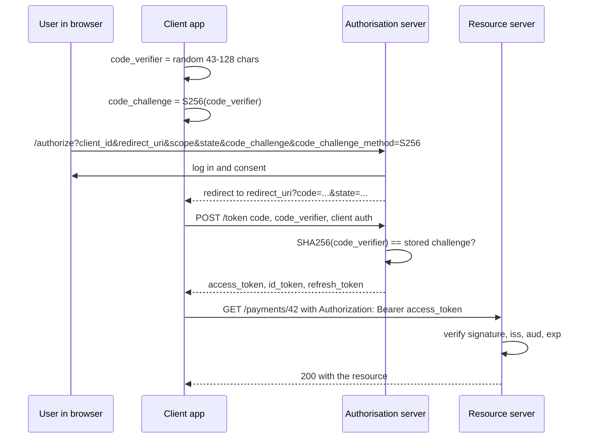
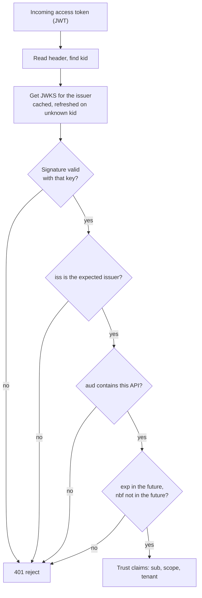

# Identity: OAuth 2.0, OIDC, mTLS, and Sessions

> **Interview answer (say this first).** Authentication proves who a caller is; authorisation decides what that caller may do. For people, use the OAuth 2.0 authorisation-code flow with PKCE, and read identity from an OpenID Connect ID token. For services, use the client-credentials flow or mutual TLS, so each workload has a cryptographic identity. Most access tokens are JWTs, and you must verify four things before trusting one: the signature against the issuer's JWKS, the issuer, the audience, and the expiry. A token is a bearer credential, so keep access tokens short-lived, keep refresh tokens server-side, and hold browser sessions in HttpOnly, Secure, SameSite cookies with CSRF protection.

## Why this exists

A payments API accepted a token that was minted for a different application. Both applications used the same authorisation server, so both tokens carried the same `iss` (issuer) and were signed by the same key. The payments API checked the signature and the expiry, but never checked `aud` (audience). An attacker who held a token for the low-trust analytics dashboard, whose audience was `analytics-ui`, replayed it to the payments API. The signature was valid, the token was fresh, and the `sub` claim named a normal user, so the service treated the attacker as that user and moved money.

That bug has a name: **token confusion**, also called a confused deputy. A service trusts a credential that was issued for a different purpose. Checking the audience is what stops it.

Two other versions of the same failure are just as common:

1. **Unverified tokens.** Code calls `jwt.decode(token, options={"verify_signature": False})`, or worse, reads the `alg` field from the token itself and uses it to choose the verification algorithm. An attacker sets `"alg": "none"` and drops the signature, or takes the server's public RSA key and signs an HS256 token with it. The verifier trusts the header and accepts a forged token.
2. **Leaky sessions.** A session cookie without `HttpOnly` is readable by any script on the page, so one cross-site scripting (XSS) bug steals the session. A cookie without `SameSite` and no CSRF token lets another site make the victim's browser send authenticated requests.

Every control later in this phase — RBAC, policy, audit, gateway scoping — assumes it knows the caller. Identity is the machinery that answers four questions:

- **Who is the caller?** A user, a service, or another machine.
- **How is that proved?** A signed token, a client certificate, or a session.
- **How is it kept true over time?** Short expiry, refresh, key rotation.
- **What may the caller do?** That is authorisation, and it builds on a trusted identity.

If the first three are wrong, the fourth is a decision about the wrong person.

## Start from zero

| Word | Plain meaning |
| --- | --- |
| **Authentication** | Proving who a caller is. |
| **Authorisation** | Deciding what that identity may do. |
| **Identity** | The set of attributes that name a caller, such as a user id or workload id. |
| **Principal** | The entity being identified: a user, a service, or a device. |
| **OAuth 2.0** | A framework for a client to get a limited-access token to an API without handling the user's password. |
| **Resource owner** | The user who owns the data and grants access. |
| **Client** | The application asking for access on the user's behalf. |
| **Authorisation server** | The service that authenticates the user or client and issues tokens. |
| **Resource server** | The API that holds the data and accepts the access token. |
| **Access token** | A credential that lets the holder call an API; usually short-lived. |
| **ID token** | An OpenID Connect token that describes the authenticated user to the client. |
| **Refresh token** | A longer-lived credential the client exchanges for a new access token. |
| **Scope** | A named permission the client requests, such as `payments:read`. |
| **OIDC** | OpenID Connect: an identity layer on top of OAuth 2.0 that adds the ID token and user info. |
| **JWT** | JSON Web Token: three base64url parts — header, payload, signature. |
| **JWT header** | Metadata: signing algorithm (`alg`) and key id (`kid`). |
| **JWT payload** | The claims, such as `sub`, `iss`, `aud`, `exp`. Readable by anyone. |
| **JWT signature** | A cryptographic signature over the first two parts. |
| **Issuer (`iss`)** | Who created the token. |
| **Audience (`aud`)** | Who the token is intended for. |
| **Expiry (`exp`)** | When the token stops being valid. |
| **Not before (`nbf`)** | When the token starts being valid. |
| **JWKS** | JSON Web Key Set: the public keys an issuer publishes so clients can verify signatures. |
| **Key rotation** | Replacing a signing key with a newer one; the old key verifies for a while. |
| **mTLS** | Mutual TLS: both client and server present certificates, so each proves its identity. |
| **Service identity** | A verifiable name for a workload, from a certificate or a workload token. |
| **Session cookie** | A small browser-stored value that identifies a server-side session. |
| **CSRF** | Cross-Site Request Forgery: another site makes the victim's browser send an authenticated request. |
| **Replay attack** | Capturing a valid credential or request and sending it again. |
| **Zero trust** | Never trust a request because of where it came from; verify every request. |

Three distinctions carry the topic.

**Authentication vs authorisation.** Authentication proves identity. Authorisation uses that identity to allow or deny an action. A perfectly valid token for the wrong role must still be denied. This page covers authentication; the [RBAC page](12-rbac-policy-enforcement-and-audit-logging.md) covers authorisation.

**OAuth 2.0 vs OIDC.** OAuth 2.0 is about delegated **access**: it issues an access token so a client can call an API. It says nothing standard about who the user is. OIDC adds an identity layer: an ID token, a standard set of user claims, and a user-info endpoint. If you need to log a user in, you need OIDC, not plain OAuth.

**Three token types that are not interchangeable.**

| Token | Who reads it | What it proves | Typical lifetime |
| --- | --- | --- | --- |
| **Access token** | The resource server (API) | The holder may call this API with these scopes | Minutes |
| **ID token** | The client application | The user authenticated recently to this client | Minutes |
| **Refresh token** | The client, kept server-side | The client may get new access tokens | Hours to days |

A frequent bug is sending an ID token to an API as if it were an access token. The audience of an ID token is the client, not the API, so a correct API rejects it. That rejection is a feature.

## The core idea

Think of a **theme park**. You buy a ticket at the entrance gate. The gate is the authorisation server. Your ticket names the park (audience), the rides it covers (scopes), and the minute it expires. Each ride operator checks the ticket themselves. They do not phone the gate on every rider. They verify the gate's stamp, which only the park can produce, using a public seal that anyone can check. A wristband for the day is a session: the operator glances at it and lets you through.

Two flows matter most. The first is **authorisation code with PKCE** (Proof Key for Code Exchange) for user-facing apps. PKCE stops an attacker who intercepts the redirect from swapping the code for tokens.



The second is **token validation**. This runs on every request at every API, and it is the check the opening failure skipped.



A JWT is **signed, not encrypted**. The header and payload are base64url text that anyone can decode. Never put a secret, a password, or personal data in a JWT payload. The signature only proves the token was minted by the key holder and was not altered; it does not hide the contents.

Validate these things on every token, every time.

| Check | What it proves | What skipping it allows |
| --- | --- | --- |
| **Signature** via JWKS | The issuer's private key signed this token | Forged tokens |
| **Algorithm (`alg`)** pinned by the verifier | The token uses an algorithm you allow | `alg: none` and HS/RS confusion forgeries |
| **Issuer (`iss`)** | The token came from the expected authorisation server | Tokens from any other issuer |
| **Audience (`aud`)** | The token was minted for this API | Cross-service replay, confused deputy |
| **Expiry (`exp`)** | The token has not expired | Stolen tokens that work forever |
| **Not before (`nbf`)** | The token is not being used too early | Premature use |
| **Key id (`kid`)** | The signature key matches a key in the JWKS | Wrong-key and rotation errors |
| **Scope** | The token grants the action being attempted | Over-privileged calls |
| **Subject and tenant (`sub`)** | Which principal and tenant | Wrong-tenant access |
| **Token type/use** | It is an access token, not an ID token | Token confusion |

Two rules tie it together. **Never trust a token you have not verified**, and **fail closed**: if verification raises, return 401. Do not fall back to treating the token as unauthenticated-but-allowed.

## How it works

1. **Choose the flow by caller.** People use the authorisation-code flow with PKCE. Confidential services with no user use the client-credentials flow. Services that need a strong cryptographic identity use mTLS or a workload identity token. Do not use the implicit flow or the resource-owner-password flow; both are deprecated by OAuth security best practice.
2. **Register the client.** The client gets a `client_id`, a secret if it can keep one, and a strict allowlist of `redirect_uri` values. An open redirect is an attack on the token itself.
3. **Start an authorisation request with PKCE.** Generate a random `code_verifier` of 43 to 128 characters, hash it with SHA-256, and base64url-encode the digest. That is the `code_challenge` with `code_challenge_method=S256`.
4. **Send the user to the authorisation endpoint** with `client_id`, `redirect_uri`, `scope`, an unguessable `state`, a `nonce`, and the `code_challenge`. The `state` protects the redirect from cross-site request forgery; the `nonce` binds the eventual ID token to this request.
5. **The user authenticates and consents.** The authorisation server returns a short-lived, single-use `code` to the allowlisted redirect URI.
6. **Exchange the code for tokens.** The client posts the `code` and the original `code_verifier` to the token endpoint, authenticating itself. The server hashes the verifier and compares it with the stored challenge. A stolen code without the verifier is useless.
7. **Validate the ID token.** Check its signature, `iss`, `aud` (which must equal the client's `client_id`), `exp`, and the `nonce`. Take the user identity from the verified ID token, never from a request parameter.
8. **Validate the access token on every API request.** Fetch the issuer's JWKS, select the key whose `kid` matches the token header, verify the signature with a pinned algorithm list, then check `iss`, `aud`, `exp`, and `nbf`. Only then read `sub` and `scope`.
9. **Cache the JWKS, but handle rotation.** Fetch keys at startup and cache them. Respect the `Cache-Control` header if present, and refetch when you see an unknown `kid`. A cached key set that never refreshes turns a routine key rotation into an outage.
10. **Keep access tokens short-lived and refresh them.** An access token lives for minutes; a refresh token lives longer. The client stores the refresh token server-side, and rotation issues a new refresh token on each use while invalidating the old one. Reuse of an old refresh token is a breach signal.
11. **Use mTLS or workload identity for service-to-service.** Each workload presents a certificate or a short-lived token bound to its service account. The server maps that cryptographic identity to a service name. A shared static API key proves nothing about which workload sent the request.
12. **Manage browser sessions with cookies, not tokens in local storage.** After login, the server creates a random session id and stores the session data server-side. The browser gets only the opaque id in a cookie marked `HttpOnly`, `Secure`, and `SameSite`.
13. **Protect state-changing requests from CSRF.** `SameSite` blocks most cross-site cookie sending. Add a per-session CSRF token that the page must echo in a header or form field for any non-idempotent request.
14. **Make replay hard.** Short expiry limits the window. A `jti` (unique token id) with a one-time store blocks exact replay. Sender-constrained tokens — mTLS-bound tokens or DPoP (Demonstrating Proof of Possession) — stop a stolen bearer token from working at all.
15. **Log the decision, not the token.** Record the subject, issuer, audience, decision, and reason. Never log the raw token or the refresh token.

> **Tip:**
>
> **The mental shortcut.** Signature, issuer, audience, expiry. In that order, on every token, before any claim is trusted. A JWT is signed, not encrypted, so treat its payload as public.

## The syntax you will use

**Decode and validate a JWT against a JWKS.** PyJWT fetches the issuer's keys and picks the right one by `kid`. The `algorithms` list is pinned by you, never taken from the token header.

```python
import jwt
from jwt import PyJWKClient

ISSUER = "https://auth.example.com/"          # trailing slash matters; match it exactly
AUDIENCE = "payments-api"
ALGORITHMS = ["RS256"]                          # pin what you accept

jwks = PyJWKClient(f"{ISSUER}.well-known/jwks.json",
                   cache_jwk_set=True, lifespan=300)

def verify_access_token(token: str) -> dict:
    signing_key = jwks.get_signing_key_from_jwt(token).key
    return jwt.decode(
        token,
        signing_key,
        algorithms=ALGORITHMS,
        audience=AUDIENCE,
        issuer=ISSUER,
        leeway=60,                              # tolerate small clock skew
        options={"require": ["exp", "iat", "iss", "aud", "sub"]},
    )
```

`get_signing_key_from_jwt` reads the unverified `kid` to choose a key; that is safe because verification still fails if the signature does not match. `jwt.decode` raises a subclass of `jwt.InvalidTokenError` on any failure: `ExpiredSignatureError`, `InvalidAudienceError`, `InvalidIssuerError`, or `InvalidSignatureError`.

**Inspect the header without trusting it.** Useful for logging which key was used, and nothing else.

```python
header = jwt.get_unverified_header(token)
print(header["kid"], header["alg"])   # decide nothing from these
```

**Assert claims yourself when you need a specific error.** Framework helpers often collapse every failure into one 401, which is fine for the client and bad for debugging.

```python
import time

def check_claims(claims: dict) -> None:
    now = int(time.time())
    if claims["iss"] != ISSUER:
        raise PermissionError("wrong issuer")
    aud = claims["aud"]
    if AUDIENCE not in (aud if isinstance(aud, list) else [aud]):
        raise PermissionError("wrong audience")
    if claims["exp"] <= now:
        raise PermissionError("token expired")
    if claims.get("nbf", 0) > now + 60:
        raise PermissionError("token not yet valid")
```

`aud` may be a single string or a list, so normalise it before checking. A 60-second allowance on `nbf` matches the `leeway` you allow on `exp`.

**A FastAPI dependency that enforces auth.** Every protected route depends on it, so there is one place to be correct.

```python
from fastapi import Depends, FastAPI, HTTPException, status
from fastapi.security import HTTPAuthorizationCredentials, HTTPBearer
import jwt

app = FastAPI()
bearer = HTTPBearer(auto_error=False)

def current_claims(
    creds: HTTPAuthorizationCredentials | None = Depends(bearer),
) -> dict:
    if creds is None:
        raise HTTPException(status.HTTP_401_UNAUTHORIZED, "missing token")
    try:
        return verify_access_token(creds.credentials)
    except jwt.InvalidTokenError as exc:
        raise HTTPException(status.HTTP_401_UNAUTHORIZED, "invalid token") from exc

@app.get("/payments/{payment_id}")
def read_payment(payment_id: str, claims: dict = Depends(current_claims)) -> dict:
    return {"payment_id": payment_id, "subject": claims["sub"],
            "scopes": claims.get("scope", "").split()}
```

Keep the raw exception out of the response and put it in the log. A client should not learn whether the signature, the audience, or the expiry failed.

**Check an mTLS client identity.** The server requires a client certificate and derives a service identity from the certificate's `subjectAltName`.

```python
import ssl

server_ctx = ssl.SSLContext(ssl.PROTOCOL_TLS_SERVER)
server_ctx.minimum_version = ssl.TLSVersion.TLSv1_2
server_ctx.verify_mode = ssl.CERT_REQUIRED            # refuse clients without a valid cert
server_ctx.load_cert_chain(certfile="server.pem", keyfile="server.key")
server_ctx.load_verify_locations(cafile="clients-ca.pem")

def service_identity(peercert: dict) -> str:
    uris = [v for (kind, v) in peercert.get("subjectAltName", ()) if kind == "URI"]
    if not uris:
        raise ValueError("client certificate has no URI SAN")
    return uris[0]                                    # e.g. spiffe://acme/ns/prod/sa/indexer
```

The URI subject alternative name (SAN), often a SPIFFE id, is the workload's name. Map it to a service in your policy engine; do not parse a common name out of the subject.

**Set a session cookie with the right flags.** The value is a random opaque id; the session data stays on the server.

```python
from fastapi import Response

def start_session(response: Response, session_id: str, csrf_token: str) -> None:
    response.set_cookie(
        "sid", session_id,
        max_age=1800,          # 30 minutes
        httponly=True,         # not readable by JavaScript
        secure=True,           # sent over HTTPS only
        samesite="lax",        # "strict" is stronger; "none" requires Secure
        path="/",
    )
    response.set_cookie("csrf", csrf_token, max_age=1800,
                        secure=True, samesite="lax", path="/")  # readable by JS: double-submit
```

A `SameSite=lax` cookie is sent on top-level navigation but not on cross-site form posts, which blocks most CSRF. For state-changing requests, also require the CSRF token in a header and compare it with the session's stored value.

## Examples: simple to real

**Example 1 — a token for the wrong audience is rejected.** This is the opening failure, caught by one claim.

```python
import time, jwt
from cryptography.hazmat.primitives.asymmetric import rsa
from jwt.algorithms import RSAAlgorithm

private_key = rsa.generate_private_key(public_exponent=65537, key_size=2048)
public_jwk = RSAAlgorithm.from_jwk(RSAAlgorithm.to_jwk(private_key.public_key()))

now = int(time.time())
analytics_token = jwt.encode(
    {"iss": "https://auth.example.com/", "aud": "analytics-ui",
     "sub": "user:ana", "iat": now, "exp": now + 300},
    private_key, algorithm="RS256", headers={"kid": "k1"},
)

try:
    jwt.decode(analytics_token, public_jwk, algorithms=["RS256"],
               audience="payments-api", issuer="https://auth.example.com/")
except jwt.InvalidAudienceError as exc:
    print("rejected:", type(exc).__name__)
```

Illustrative output:

```text
rejected: InvalidAudienceError
```

The signature is genuine and the token is fresh. It is still refused, because its `aud` is `analytics-ui`, not `payments-api`. Without that check, the payments API would be a confused deputy: it would use a token minted for one application to authorise another.

**Example 2 — an expired token is rejected, and leeway absorbs clock skew.** Expiry bounds the damage of a stolen token.

```python
expired = jwt.encode(
    {"iss": "https://auth.example.com/", "aud": "payments-api",
     "sub": "user:ana", "iat": now - 600, "exp": now - 5},
    private_key, algorithm="RS256", headers={"kid": "k1"},
)

for leeway in (0, 60):
    try:
        jwt.decode(expired, public_jwk, algorithms=["RS256"],
                   audience="payments-api", issuer="https://auth.example.com/",
                   leeway=leeway)
        print(f"leeway={leeway}: accepted")
    except jwt.ExpiredSignatureError:
        print(f"leeway={leeway}: expired")
```

Illustrative output:

```text
leeway=0: expired
leeway=60: accepted
```

Leeway handles the real problem that two machines' clocks differ. Keep it small — a minute, not an hour. A large leeway silently extends every token's life.

**Example 3 — key rotation: the old key still verifies during the overlap.** The JWKS holds both keys, and the `kid` selects one.

```python
import json, jwt
from cryptography.hazmat.primitives.asymmetric import rsa
from jwt.algorithms import RSAAlgorithm

def rsa_keypair(kid: str):
    private_key = rsa.generate_private_key(public_exponent=65537, key_size=2048)
    data = json.loads(RSAAlgorithm.to_jwk(private_key.public_key()))
    data.update(kid=kid, use="sig", alg="RS256")
    return private_key, data

old_private, old_jwk = rsa_keypair("k1")
new_private, new_jwk = rsa_keypair("k2")
jwks = {"keys": [old_jwk, new_jwk]}          # both keys published during overlap

def key_for(token: str):
    kid = jwt.get_unverified_header(token)["kid"]
    for jwk in jwks["keys"]:
        if jwk["kid"] == kid:
            return RSAAlgorithm.from_jwk(json.dumps(jwk))
    raise jwt.InvalidTokenError(f"unknown kid: {kid}")   # triggers a JWKS refetch

def mint(private_key, kid: str):
    return jwt.encode(
        {"iss": "https://auth.example.com/", "aud": "payments-api",
         "sub": "user:ana", "iat": now, "exp": now + 300},
        private_key, algorithm="RS256", headers={"kid": kid},
    )

for label, tok in (("old", mint(old_private, "k1")),
                   ("new", mint(new_private, "k2"))):
    jwt.decode(tok, key_for(tok), algorithms=["RS256"],
               audience="payments-api", issuer="https://auth.example.com/")
    print(f"{label} key token: verified")
```

Illustrative output:

```text
old key token: verified
new key token: verified
```

During rotation the issuer publishes the new key alongside the old one. Tokens signed before the switch keep verifying under `k1` until they expire; tokens signed after use `k2`. When an API sees an unknown `kid`, it must refetch the JWKS rather than reject immediately, or every rotation becomes an incident. Only remove the old key once tokens signed with it have expired.

**Example 4 — service-to-service identity with mTLS.** The certificate names the workload, and the server authorises on that name.

```python
import ssl

# Server side: require and verify the client certificate.
server_ctx = ssl.SSLContext(ssl.PROTOCOL_TLS_SERVER)
server_ctx.verify_mode = ssl.CERT_REQUIRED
server_ctx.load_cert_chain("server.pem", "server.key")
server_ctx.load_verify_locations(cafile="clients-ca.pem")

# After the handshake, read the verified peer certificate.
def peer_service(cert: dict) -> str:
    for kind, value in cert.get("subjectAltName", ()):
        if kind == "URI":
            return value          # spiffe://acme/ns/prod/sa/agent-gw
    raise PermissionError("no service identity in certificate")

allowed = {"spiffe://acme/ns/prod/sa/agent-gw",
           "spiffe://acme/ns/prod/sa/indexer"}
```

A shared API key would let any service impersonate any other. An mTLS certificate is bound to a workload identity and is much harder to copy. Workload identity tokens (for example a Kubernetes projected service-account token) give the same guarantee with short-lived JWTs validated against the cluster's JWKS.

**Example 5 — a session cookie plus a CSRF check.** The session id is opaque, and state-changing calls must echo the CSRF token.

```python
import hmac, secrets

def new_session(response) -> str:
    session_id = secrets.token_urlsafe(32)     # 256 bits of randomness
    csrf_token = secrets.token_urlsafe(32)
    start_session(response, session_id, csrf_token)   # sets the cookies from above
    store_server_side(session_id, {"csrf": csrf_token, "sub": "user:ana"})
    return session_id

def require_csrf(session: dict, sent_token: str) -> None:
    if not hmac.compare_digest(session.get("csrf", ""), sent_token):
        raise PermissionError("CSRF token mismatch")
```

`HttpOnly` keeps the session id away from JavaScript, `Secure` keeps it off plain HTTP, and `SameSite` stops other sites from sending it. The CSRF token is the second factor for state changes. Without it, a malicious page can trigger a transfer that the browser signs with the victim's cookie.

**Example 6 — a forged `alg: none` token is refused.** Pinning the algorithm list is what blocks it.

```python
forged = jwt.encode(
    {"iss": "https://auth.example.com/", "aud": "payments-api",
     "sub": "user:admin", "exp": now + 300},
    key="", algorithm="none",                # no signature at all
)

try:
    jwt.decode(forged, public_jwk, algorithms=["RS256"],
               audience="payments-api", issuer="https://auth.example.com/")
except jwt.InvalidAlgorithmError:
    print("refused: unsigned token")
```

Illustrative output:

```text
refused: unsigned token
```

If the verifier let the token's own `alg` header choose the algorithm, `none` and the HS256-with-the-public-key trick would both succeed. The `algorithms=["RS256"]` argument is the control.

## In production

- **Always verify the signature, issuer, audience, and expiry.** Those four checks are the minimum. An unverified token is an attacker-supplied claim. Never use `verify_signature: False` in a request path.
- **Never trust a token just because it decodes.** Base64url decoding is not validation. If the code path reads `sub` before verification succeeds, it is a bug.
- **Pin the accepted algorithms.** Pass an explicit list such as `["RS256"]`. Never choose the algorithm from the token's `alg` header, which enables `alg: none` and HS/RS confusion forgeries.
- **Cache the JWKS and handle rotation.** Fetch keys at startup, cache them, and refetch on an unknown `kid`. Fetching per request adds latency and a dependency on the issuer being up for every call.
- **Keep access tokens short-lived and refresh tokens server-side.** Access tokens measured in minutes limit the value of a stolen one. Refresh tokens should be rotated on use, stored hashed on the server, and never exposed to the browser.
- **Do not put secrets in a JWT.** The payload is readable by anyone who holds the token. A JWT is signed, not encrypted; use JWE or a server-side session if you truly need confidentiality.
- **Use mTLS or workload identity for machines.** A shared static API key cannot tell two services apart and cannot be revoked cleanly per workload. Certificates and workload tokens can.
- **Cookie sessions need `HttpOnly`, `Secure`, `SameSite`, and CSRF protection.** All four together. `SameSite=none` requires `Secure` and removes cross-site protection, so pair it with a CSRF token.
- **Expect clock skew and use small leeway.** A 30-to-60-second allowance on `exp` and `nbf` prevents false expiry failures between hosts. A ten-minute leeway is a policy hole, not a fix.
- **Log auth decisions, never tokens.** Record subject, issuer, audience, decision, and reason with a correlation id. The raw token and refresh token are credentials; leaking them into logs extends their life.
- **Fail closed.** If JWKS is unreachable and no cached keys exist, reject the request. Do not fall back to decoding without verification, and do not treat an unverifiable token as anonymous.
- **Treat audience as a first-class check.** Same issuer, same key, different application is still a different trust level. The audience claim is what stops cross-service replay and the confused deputy.

## Interview questions

### 1. What is the difference between OAuth 2.0 and OpenID Connect?

**Answer.** OAuth 2.0 is an authorisation framework: it lets a client obtain an access token to call an API on a user's behalf. It deliberately says nothing about who the user is. OpenID Connect is a thin identity layer on top of OAuth 2.0. It adds the ID token, a standard set of user claims, and a user-info endpoint, so a client can verify that a user authenticated and get their identity. Use OAuth for delegated access, and OIDC when you need login.

**Follow-up: "Can you use an ID token to call an API?"** No. An ID token's audience is the client application, not the API. A correct resource server rejects it, because its audience does not match. That rejection prevents token confusion.

**Trap.** Saying OIDC replaces OAuth. It builds on it. The token endpoint and the flows are OAuth; OIDC only adds identity on top.

### 2. Why does PKCE exist, and is it only for public clients?

**Answer.** PKCE stops an attacker who intercepts the authorisation code from redeeming it. The client sends a hash of a secret it generated (`code_challenge`) at the start, and reveals the secret (`code_verifier`) when exchanging the code. Without the verifier, a stolen code is useless. It was designed for public clients that cannot keep a secret, such as mobile and single-page apps, but current OAuth security best practice recommends it for confidential clients too, because it costs almost nothing and closes the code-interception window.

**Follow-up: "What is the difference between state and PKCE?"** `state` protects the redirect leg from CSRF and binds the response to the request; PKCE protects the code-exchange leg. You want both.

**Trap.** Using `code_challenge_method=plain`, which sends the verifier itself as the challenge. Use `S256` (SHA-256).

### 3. What must you verify on a JWT before trusting it?

**Answer.** Four things at minimum: the signature against the issuer's JWKS, the issuer (`iss`), the audience (`aud`), and the expiry (`exp`). Also check `nbf` if present, and pin the accepted algorithm list so the token cannot choose `alg: none` or switch to HS256. Only after all of that do you read `sub`, `scope`, and any tenant claim.

**Follow-up: "What happens if you skip the audience check?"** Any token from the same issuer signed by the same key is accepted, even one minted for a different, lower-trust application. That is the confused-deputy attack.

**Trap.** Verifying the signature but not the claims. A valid signature proves the issuer made the token; it does not prove the token was meant for you.

### 4. Compare an access token, an ID token, and a refresh token.

**Answer.** An access token is for the resource server: it authorises API calls and usually lives minutes. An ID token is for the client: it proves the user authenticated and carries identity claims, and its audience is the client. A refresh token is for the client's token store: it stays server-side, lives longer, and is exchanged for new access tokens. They are not interchangeable, and mixing them up is a common vulnerability.

**Follow-up: "Where does the refresh token live in a browser app?"** Ideally not in the browser at all. Use a backend-for-frontend that holds the refresh token server-side and keeps only a session cookie in the browser.

**Trap.** Storing any of these in `localStorage`. A single XSS reads them all; `HttpOnly` cookies are not readable by script.

### 5. How does mTLS give a service a better identity than an API key?

**Answer.** With mTLS, both sides present certificates and verify each other during the TLS handshake. The client certificate binds a public key to a workload identity, usually a SPIFFE URI in a subject alternative name. The server authorises on that verified identity. A shared API key is a bearer secret: anyone who copies it becomes the service, it cannot be tied to one workload, and rotating it means touching every caller. A certificate is per-workload, short-lived when issued by an internal CA, and revocable.

**Follow-up: "What if the workload runs in Kubernetes?"** Use a projected service-account token, which is a short-lived JWT the cluster signs. The server validates it against the cluster's JWKS and maps the subject to a service account, the same idea as mTLS without managing certificates.

**Trap.** Parsing the common name out of the certificate subject. Use the subject alternative name, and validate the certificate chain against your CA.

### 6. How do session cookies and CSRF protection work together?

**Answer.** After login the server creates an opaque session id and stores the session data server-side. The browser gets the id in a cookie marked `HttpOnly` (no script access), `Secure` (HTTPS only), and `SameSite` (not sent on most cross-site requests). `SameSite` blocks most CSRF, but not all, so state-changing requests also require a CSRF token that the page echoes in a header or form field and the server compares with the session's stored value.

**Follow-up: "What is the double-submit pattern?"** The server sets a random CSRF value in a readable cookie and asks the page to send the same value in a header. A cross-site attacker cannot read the cookie, so it cannot forge the header. Sign the value or bind it to the server-side session to avoid a cookie-injection weakness.

**Trap.** Using `SameSite=none` to make cross-site embedding work and then forgetting the CSRF token. `SameSite=none` gives back the protection you just removed.

### 7. What is a replay attack, and how do you defend against it?

**Answer.** A replay attack is capturing a valid token or request and sending it again. Because an access token is a bearer credential, possession is enough. Defences stack: keep expiry short so the window is small; give each token a unique `jti` and reject a `jti` you have already used; require a `nonce` in the request; and make the token sender-constrained with mTLS-bound tokens or DPoP, so a stolen token alone cannot be used.

**Follow-up: "Why is `jti` tracking not enough on its own?"** It needs shared state with atomic writes, and it only covers requests that reach the store. Short expiry plus sender-constrained tokens is the more robust layer.

**Trap.** Assuming TLS prevents replay. TLS protects the channel; an attacker who obtains the token can still replay it outside that channel.

### 8. How do you handle JWKS caching and key rotation without downtime?

**Answer.** Fetch the issuer's JWKS at startup and cache it. When a token presents a `kid` you do not have, refetch the key set before rejecting; that is the signal a rotation has happened. Respect the cache lifetime the issuer publishes via `Cache-Control`, and keep the old key published until tokens signed with it have expired. On the issuer side, publish the new key before signing with it, sign with it for a while, then retire the old key.

**Follow-up: "What happens if the issuer is briefly unreachable?"** Use the cached keys and fail closed only if you have no usable cached key for the presented `kid`. A cached key set lets you keep serving through a short issuer outage.

**Trap.** Hard-coding the public key or pinning one `kid`. When the issuer rotates, every service that hard-coded the key starts rejecting valid tokens.

## Remember this

- **Authentication is not authorisation.** Identity proves who; policy decides what. Never let the model or the prompt be part of that decision.
- **Choose the flow by caller:** authorisation code with PKCE for people, client credentials or mTLS for services. Then read identity from a verified token, not a request field.
- **Verify signature, issuer, audience, and expiry — in that order — before trusting any claim.** Pin the algorithm list so `alg: none` and HS/RS confusion fail.
- **A JWT is signed, not encrypted.** Its payload is readable, so never put secrets or personal data inside one.
- **Bearer tokens need short lives, server-side refresh tokens, and sender constraints.** Browsers get `HttpOnly`, `Secure`, `SameSite` session cookies plus a CSRF token.
