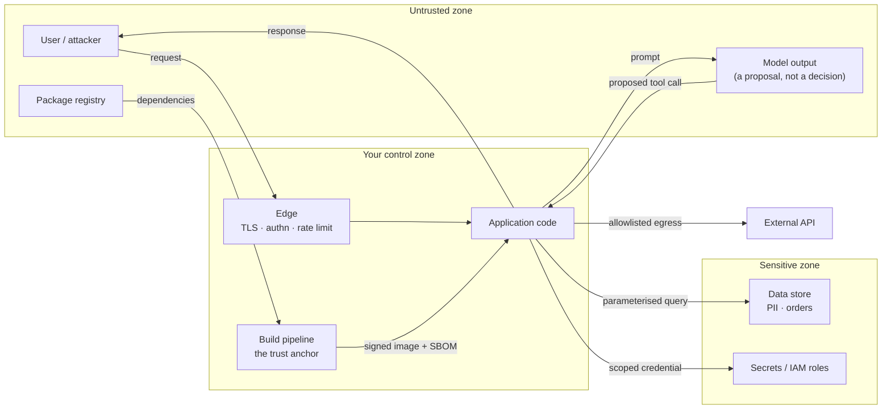

# Application Security, Threat Modelling, and Supply Chain

> **Interview answer (say this first).** Application security is controlling what crosses each trust boundary: validate input, encode output, parameterise every query, authorise every object, and restrict outbound requests. Threat modelling is the repeatable way to find those boundaries before an attacker does — draw the system, list the assets, walk STRIDE across each boundary, write concrete abuse cases, attach a control, and record the residual risk. Supply-chain security applies the same method to everything you install: scan dependencies in CI, generate an SBOM, sign the image, and verify the signature at admission. An AI system inherits every one of these controls, plus prompt injection, because the model is an untrusted component that reads attacker-influenced text.

## Why this exists

In 2019, an attacker broke into a large bank's cloud account without stealing a password. The path was an **SSRF** (server-side request forgery: making the server fetch a URL the attacker chooses) through a misconfigured web application firewall. The server was asked to fetch `http://169.254.169.254/latest/meta-data/iam/security-credentials/` — the cloud instance metadata endpoint, a link-local address only the server can reach. It returned temporary IAM role credentials in plain text. The attacker used those credentials to list and download files from object storage, exposing data on roughly one hundred million people.

Three ordinary mistakes made that possible, and all three are common:

- **No allowlist on outbound requests.** The import feature fetched any URL it was handed, including the cloud metadata address.
- **No least privilege on the instance role.** The role could read every bucket, not just the one the service needed.
- **No test for the hostile case.** The feature worked for the happy path; nobody wrote the request that pointed inward.

A second, quieter failure ships every week: a vulnerable dependency reaches production because **scanning was never wired into CI**. A critical CVE is announced, the lockfile still pins the bad version, and no pipeline step refuses the build. The scan exists as a wiki page, not as a gate.

Both failures have the same root cause. The team never drew the boundaries, so nobody asked the attacker's question: *what is the worst I can do from here?* This page teaches the repeatable method for asking that question, then connects it to an AI system.

## Start from zero

| Word | Plain meaning |
| --- | --- |
| **Injection** | Untrusted input changes the *structure* of a command instead of staying data. |
| **SQL injection** | Input becomes part of a SQL query, letting an attacker read or change the database. |
| **Command injection** | Input becomes part of a shell command, letting an attacker run programs on the host. |
| **Template injection** | Input becomes part of a template that is then evaluated as code (server-side template injection, SSTI). |
| **SSRF** | Server-side request forgery: the server is tricked into making a request to a destination the attacker chose. |
| **CSRF** | Cross-site request forgery: a victim's authenticated browser is made to send a request the user did not intend. |
| **XSS** | Cross-site scripting: attacker-supplied script runs in another user's browser. |
| **Broken access control** | A permission check that is missing, wrong, or easy to bypass. It is the most common serious web flaw. |
| **IDOR** | Insecure direct object reference: changing an id in a request to reach an object that belongs to someone else. A type of broken access control. |
| **Insecure deserialisation** | Rebuilding an object from untrusted bytes can execute code as a side effect. |
| **Input validation** | Checking that data is well-formed and in range *before* it is used. |
| **Output encoding** | Escaping data for the exact context where it is rendered, so it is treated as data and never as code. |
| **Least privilege** | Giving each identity the smallest permission that still does the job. |
| **Defence in depth** | Several independent controls, so one failure is not fatal. |
| **STRIDE** | A checklist of six threat types: Spoofing, Tampering, Repudiation, Information disclosure, Denial of service, Elevation of privilege. |
| **Trust boundary** | A line where data or control passes between parties that do not fully trust each other. |
| **Attack tree** | A tree whose root is an attacker's goal and whose branches are the ways to reach it. |
| **Abuse case** | A use case written from the attacker's side: how someone misuses the feature on purpose. |
| **Residual risk** | The risk that remains after every control is applied. It must be named and owned. |
| **SAST** | Static application security testing: scanning source code for flaws without running it. |
| **DAST** | Dynamic application security testing: probing a running application from the outside. |
| **Dependency scanning** | Checking third-party components against databases of known vulnerabilities (CVEs). |
| **SBOM** | Software Bill of Materials: a machine-readable list of the components in an artifact. |
| **Provenance** | A signed record of where and how an artifact was built. |
| **Admission control** | A policy gate that decides whether a workload may start in a cluster at all. |

Three distinctions to fix now:

- **Validation vs encoding.** Input validation checks what came in. Output encoding protects what goes out, in the context it goes to. You need both: validation cannot stop stored data that was written months ago.
- **Authentication vs authorisation.** Authentication proves *who* you are. Authorisation decides *what* you may do. Most breaches are authorisation failures, not authentication failures.
- **Denylist vs allowlist.** A denylist forbids known-bad values; a new payload walks around it. An allowlist permits known-good values; anything new fails closed. Prefer allowlists for closed sets.

## The core idea

Picture an office building with controlled doors. Visitors pass a front desk (**validation**), get a badge that opens only their floor (**authorisation**), and are recorded by the camera on the way in (**logging**). The safe is in a separate room with a separate key (**least privilege**). No single door is trusted to be perfect, so breaking one does not open the building (**defence in depth**).

A **trust boundary** is each of those doors. Data that crosses one is suspect until checked on the far side. The whole job of application security is naming the boundaries, then placing a deterministic check on each one.



Every arrow is a place to put a control. The dangerous arrows are the ones that point *toward* a more sensitive zone without a check: a user string reaching a SQL query, a user URL reaching the metadata endpoint, a package reaching the build without review.

**STRIDE** is what stops you forgetting a whole category of threat. For each boundary, ask the six questions in order. A category with no row is usually a category you forgot, not one that cannot happen.

| STRIDE category | Plain question | Example at a boundary | Control |
| --- | --- | --- | --- |
| **Spoofing** | Could someone pretend to be another identity? | A forged session cookie, or a request signed with a stolen API key. | Strong authentication, signed tokens with a short expiry, mutual TLS between services. |
| **Tampering** | Could someone change data or code in transit or at rest? | A modified request body, a poisoned record, a swapped container image. | Integrity checks, TLS, parameterised queries, signed artifacts verified on deploy. |
| **Repudiation** | Could someone deny doing it? | An admin deletes a record and no log proves who did it. | Append-only audit logs with actor, action, timestamp, and correlation id. |
| **Information disclosure** | Could data reach somewhere it should not? | An error page leaking a stack trace, or SSRF reading instance credentials. | Least privilege, egress allowlists, output encoding, no secrets in logs. |
| **Denial of service** | Could someone exhaust a resource? | A huge upload, an unbounded query, a regex that backtracks forever. | Size and rate limits, timeouts, query caps, budgets. |
| **Elevation of privilege** | Could someone turn one permission into another? | A read-only path parameter escapes the workspace and writes a file. | Authorisation per object, path canonicalisation, sandboxing, scoped credentials. |

> **Note.** STRIDE gives structure, not completeness. A threat model that only fills six boxes proves you were systematic; it does not prove you found everything. The adversarial test suite is what turns the table into evidence.

## How it works

1. **Draw the system and its trust boundaries.** Sketch the boxes (user, edge, app, workers, data, dependencies, model) and mark every line where trust changes. If you cannot say who trusts whom across a line, that line is a finding.
2. **Enumerate assets.** List the data, credentials, capabilities, and reputation you protect, and rank them. If everything is an asset, nothing is.
3. **Write abuse cases.** Take each feature and flip it: how would I misuse the import button, the search box, the admin endpoint, the agent's tools? An abuse case names the attacker's goal, not just the feature.
4. **Apply STRIDE and attack trees to each boundary.** Walk the six categories. Where a goal has several routes, branch it into an attack tree: root = "read another tenant's data"; branches = guess an id, exploit IDOR, inject SQL, find an over-broad service role.
5. **Map a deterministic control to each threat.** The control lives in code or process, never in a prompt or a comment. State the limit of the control next to it.
6. **Validate input at the earliest boundary.** Cap size, check type and encoding, and validate against a strict schema before the value is logged, cached, or used.
7. **Encode output for its context.** HTML-escape for HTML, JSON-escape for JSON, shell-quote or (better) avoid the shell. Encoding depends on where the value is rendered, so it happens at the render site.
8. **Parameterise every query.** Send user values as bound parameters, never as SQL text. The same rule applies to shell arguments and templates: keep data out of the code channel.
9. **Restrict outbound requests.** An SSRF defence is an allowlist of hosts and schemes, plus blocking link-local ranges such as `169.254.0.0/16` and cloud metadata names such as `metadata.google.internal`. Follow no redirects, or re-check every hop.
10. **Enforce authorisation on every object.** Authorisation is per object, not per route: after loading the row, check that it belongs to the caller. Return `404` rather than `403` when existence itself is sensitive.
11. **Scan dependencies and generate an SBOM in CI.** Run static analysis, dependency scanning, and an SBOM generator on every build. Fail the build on a policy breach — a finding you may ignore is a finding you will ignore.
12. **Sign artifacts and enforce at admission.** Sign the image with a key or keyless identity, then verify that signature in an admission controller so an unsigned or tampered image cannot start.
13. **Name the residual risk and its owner.** Every control has a limit. Write what remains, who accepts it, and when it will be reviewed.

## The syntax you will use

**1. Parameterised SQL — the only safe form.** The user value is bound, so it can never become SQL text.

```python
import sqlite3


def find_user(conn: sqlite3.Connection, email: str) -> tuple | None:
    # The '?' is a placeholder. sqlite3 sends the value separately from the SQL.
    return conn.execute(
        "SELECT id, email FROM users WHERE email = ?", (email,)
    ).fetchone()
```

With PostgreSQL via `psycopg`, the placeholder is `%s` and the rule is identical: `cur.execute("SELECT ... WHERE id = %s", (user_id,))`.

**2. A Pydantic input validator.** Bad input is rejected at construction, before any network call or database write.

```python
from pydantic import BaseModel, Field, field_validator
from urllib.parse import urlparse

ALLOWED_HOSTS = {"api.stripe.com", "hooks.slack.com"}


class FetchRequest(BaseModel):
    url: str = Field(max_length=2048)
    max_bytes: int = Field(default=1_000_000, ge=1, le=10_000_000)

    @field_validator("url")
    @classmethod
    def url_is_allowlisted(cls, value: str) -> str:
        parsed = urlparse(value)
        if parsed.scheme != "https" or parsed.hostname not in ALLOWED_HOSTS:
            raise ValueError(f"url not allowed: {value}")
        return value
```

`Field(ge=..., le=...)` bounds the number; `field_validator` runs on every construction, so `FetchRequest(url="http://169.254.169.254/...")` raises before the value is used.

**3. An SSRF-safe URL allowlist check.** Scheme first, then host, then (in production) the resolved IP address.

```python
from urllib.parse import urlparse

ALLOWED_HOSTS = {"api.stripe.com", "hooks.slack.com"}


def safe_fetch_url(raw: str) -> str:
    parsed = urlparse(raw)
    if parsed.scheme != "https":
        raise ValueError("only https is allowed")
    if parsed.hostname not in ALLOWED_HOSTS:
        raise ValueError(f"host not allowed: {parsed.hostname}")
    return raw
```

An allowlist beats a denylist of "bad" addresses, because a new encoding of the metadata IP is not in your list of known-bad strings.

**4. A CI step that scans dependencies and generates an SBOM.**

```yaml
      - name: Scan dependencies and fail on a known vulnerability
        run: pip-audit -r requirements.txt
      - name: Generate SBOM
        run: syft dir:. -o cyclonedx-json > sbom.cdx.json
      - name: Keep the SBOM with the release
        uses: actions/upload-artifact@v7
        with: { name: sbom, path: sbom.cdx.json }
```

`pip-audit` exits non-zero when it finds a known vulnerability, so the job fails. A list of tools used in production: **SAST** with CodeQL, Semgrep, or Bandit; **DAST** with OWASP ZAP; dependency scanning with `pip-audit`, OSV-Scanner, or Trivy; SBOMs with Syft or the CycloneDX generator.

**5. Sign and verify with Cosign.** Signing is pointless without verification at the point of use.

```bash
# Sign the immutable image digest (key-based).
cosign sign --key cosign.key ghcr.io/acme/app@sha256:abc123

# Verify before deploying. A missing or wrong signature is a hard failure.
cosign verify --key cosign.pub ghcr.io/acme/app@sha256:abc123

# Keyless alternative: the signing identity is the CI workflow itself.
cosign verify ghcr.io/acme/app@sha256:abc123 \
  --certificate-oidc-issuer https://token.actions.githubusercontent.com \
  --certificate-identity-regexp '^https://github.com/acme/app/.github/workflows/.*$'
```

CI verification is not enough. An **admission controller** — Kyverno, OPA Gatekeeper, or a cloud policy engine — must run the same verification before the pod starts, so a compromised deploy path cannot skip it.

## Examples: simple to real

Outputs below are illustrative; the shape is what matters.

**Example 1 — SQL injection, then the fix.** The bad version builds one string, so the attacker's text becomes SQL. The good version binds the value, so it cannot.

```python
import sqlite3

conn = sqlite3.connect(":memory:")
conn.execute("CREATE TABLE users (id INTEGER, email TEXT)")
conn.execute("INSERT INTO users VALUES (1, 'alice@example.com')")

email = "x' OR '1'='1"

# BAD: the input is concatenated into the SQL text.
bad = conn.execute(f"SELECT id FROM users WHERE email = '{email}'").fetchall()

# GOOD: the input is a bound parameter, always data.
good = conn.execute(
    "SELECT id FROM users WHERE email = ?", (email,)
).fetchall()
```

```text
bad  -> [(1,)]                 # the OR made the WHERE clause always true
good -> []                     # no user has that literal email
```

The bad query returns every row because the injected `OR '1'='1'` changed the query's structure. The good query treats the whole string as a value and finds nothing. The lesson is not "sanitise the string"; it is "never put data in the code channel".

**Example 2 — SSRF blocked by an allowlist, and why the metadata endpoint is the target.** The metadata service is reachable only from the instance, needs no authentication, and hands out temporary cloud credentials.

```python
from urllib.parse import urlparse

ALLOWED_HOSTS = {"api.stripe.com", "hooks.slack.com"}


def safe_fetch_url(raw: str) -> str:
    parsed = urlparse(raw)
    if parsed.scheme != "https":
        raise ValueError("only https is allowed")
    if parsed.hostname not in ALLOWED_HOSTS:
        raise ValueError(f"host not allowed: {parsed.hostname}")
    return raw


for candidate in [
    "https://api.stripe.com/v1/charges",
    "https://169.254.169.254/latest/meta-data/iam/security-credentials/",
    "http://169.254.169.254/latest/meta-data/",
]:
    try:
        print("allowed:", safe_fetch_url(candidate))
    except ValueError as exc:
        print("blocked:", exc)
```

```text
allowed: https://api.stripe.com/v1/charges
blocked: host not allowed: 169.254.169.254
blocked: only https is allowed
```

The first request is a real partner. The second is the classic credential-theft call; the host check stops it. The third is the same target over `http`; the scheme check stops it. Note the residual risk: an allowlisted host could resolve to a private address (DNS rebinding), or respond with a redirect. Production code resolves the name, rejects private and link-local ranges, and disables redirects.

**Example 3 — an IDOR test that proves one user cannot read another's object.** Broken access control is rarely a missing login; it is a missing ownership check after login.

```python
import pytest


def test_user_cannot_read_another_users_order(client):
    alice = client.login("alice@example.com")
    order = client.post("/orders", json={"item": "book"}, headers=alice)

    bob = client.login("bob@example.com")
    response = client.get(f"/orders/{order['id']}", headers=bob)

    # 404 (not 403) so the response does not confirm the order exists.
    assert response.status_code == 404
```

Both users are authenticated, so a per-route check would pass for Bob. The test changes the object id — the exact move an attacker makes — and asserts the object check fails closed. Returning `404` avoids leaking whether the id exists. Keep this test next to the feature; it is the regression guard for the most common serious flaw.

**Example 4 — three STRIDE entries with their controls.** A threat model is a small table, not an essay.

```text
Boundary: user -> application (POST /import)

Spoofing            Abuse: reuse a stolen session cookie to import as
                    another user.
                    Control: short-lived signed session token; bind it
                    to the device; re-authenticate for the action.
                    Residual: a stolen token used before it expires.

Tampering           Abuse: submit a URL that points at the cloud
                    metadata service and steal the instance role.
                    Control: https-only host allowlist; block link-local
                    ranges; no redirects; scoped instance role.
                    Residual: an allowlisted host that is compromised.

Elevation of        Abuse: read a file outside the workspace through a
privilege           path argument.
                    Control: resolve and canonicalise the path; require
                    it under the allowed root; run read-only.
                    Residual: a symlink race at the filesystem level.
```

Each row names a boundary, an abuse case, a deterministic control, and the risk that remains. The owner of each residual risk is recorded next to it.

**Example 5 — a CI pipeline that fails on a vulnerable dependency.** The gate is the whole point; a scan nobody enforces is documentation.

```yaml
name: security
on: [push, pull_request]
permissions:
  contents: read
jobs:
  scan:
    runs-on: ubuntu-latest
    steps:
      - uses: actions/checkout@v7
      - uses: actions/setup-python@v7
        with: { python-version: "3.12" }
      - run: pip install pip-audit
      - name: Fail the build on a known vulnerability
        run: pip-audit -r requirements.txt
```

`pip-audit` exits non-zero when it finds *any* known vulnerability, low or critical — it has no severity threshold of its own. To fail only above a severity, emit JSON (`pip-audit -f json`) and apply a policy step that reads the CVSS score, because a tool with no threshold quietly becomes a tool everyone ignores. When it does fail, the advisory is printed and the change cannot merge. A temporary exception is allowed only with a written reason and an expiry date, tracked in the repository — never a silent `--ignore-vuln`. Pair this with `github/codeql-action` for SAST and `actions/dependency-review-action` on pull requests.

## In production

- **Validate input, but encode output.** Validation catches what arrives now; encoding protects data already stored. Escape for the exact context — HTML, JSON, shell — at the point of rendering.
- **Parameterise every query.** Bound parameters for SQL, argument lists for `subprocess` (avoid `shell=True`), and structured data instead of templates. If data can reach the code channel, injection is possible.
- **Authorisation is per object, not per route.** Load the row, then check the caller owns it. A route guard proves the user is logged in, not that the object is theirs.
- **Allowlist egress and block cloud metadata.** Reject private and link-local ranges (`169.254.0.0/16`, `10.0.0.0/8`, `127.0.0.0/8`) and metadata names. Resolve the host, re-check on redirects, and give the workload a role that cannot read everything.
- **Never deserialise untrusted data.** Pickle, YAML `unsafe_load` (or `yaml.load` with the unsafe loader), and many Java deserialisers can execute code. Use data-only formats such as JSON or `safetensors`, and treat any opaque blob as hostile.
- **Defence in depth, not a single wall.** Assume the WAF misses, the validation has a gap, and the allowlist is misconfigured. Layer independent controls so each one still holds when the previous fails.
- **STRIDE gives structure, not completeness.** Six boxes ensure coverage of categories, not of every threat. Add abuse cases from real incidents and from your own red-team tests; the list grows with the system.
- **Name the residual risk and its owner.** Every control has a limit. A threat model that claims zero risk is not honest and will not survive a follow-up question.
- **Scan dependencies in CI and fail on policy.** A gate that blocks a high-severity finding is a control; a dashboard nobody reads is a report. Set the threshold deliberately and allow exceptions only with a reason and an expiry.
- **An SBOM makes incident response fast.** When the next critical CVE lands, query the SBOM to list affected services and versions in minutes instead of days of archaeology. It is visibility, not a fix.
- **Sign artifacts and verify at admission.** Signing changes nothing unless a gate rejects unsigned or wrong-identity images. Verify in the cluster, not only in CI, so no deploy path can skip it.
- **An AI system inherits all of this plus prompt injection.** The model is untrusted and reads attacker-influenced text, so keep every deterministic control — validation, authorisation, allowlists, scoped credentials — on the code side of the model boundary.

## Interview questions

### 1. What is application security, and where does a threat model fit?

**Answer.** Application security is controlling what crosses each trust boundary: validate input, encode output, parameterise queries, authorise every object, restrict egress, and scan and sign what you ship. A threat model is how you decide *which* controls matter and where they go. You draw the system, list the assets, walk STRIDE across each boundary, write concrete abuse cases, map each to a deterministic control, and record the residual risk and its owner.

**Follow-up: "How often do you update it?"** On every capability change. A new endpoint, dependency, or data source is a new row. A stale threat model gives false confidence.

**Trap.** Treating the threat model as a document written once for an audit. It is a living table, and the adversarial tests that back it are the real output.

### 2. Explain injection and how you prevent it.

**Answer.** Injection is when untrusted input changes the structure of a command instead of staying data. In SQL injection, a quoted string becomes part of the query. In command injection, a value becomes part of a shell command. In template injection, it becomes part of a template that is evaluated. The fix is to keep data in the data channel: bound parameters for SQL, argument lists instead of a shell string, and structured fields instead of free-form templates. Allowlists for closed sets, and structure for everything else.

**Follow-up: "Is escaping enough?"** Escaping is fragile because it depends on getting every context right. Parameterisation removes the problem instead of escaping it, so prefer it wherever the library supports it.

**Trap.** Believing input validation alone stops injection. A value can pass validation today and still be dangerous when it is later concatenated into a query. The safe form of the query is the control.

### 3. What is SSRF, and why is the cloud metadata endpoint the usual target?

**Answer.** SSRF is making the server issue a request to a destination the attacker chooses. The cloud metadata endpoint — `169.254.169.254` on many providers, or `metadata.google.internal` — is the favourite target because it is reachable only from inside the instance, requires no authentication, and returns temporary IAM credentials. With those credentials the attacker moves into the cloud account. The defence is an allowlist of hosts and schemes, blocking link-local and private ranges, disabling redirects, and giving the instance a narrow role so stolen credentials buy little.

**Follow-up: "Why not just block the metadata IP?"** New encodings, IPv6-mapped forms, and DNS names can resolve to it. Blocking one literal is a denylist; an allowlist plus network egress control is the boundary.

**Trap.** Allowing any URL and trusting the DNS resolver. A hostname can resolve to a private address (DNS rebinding), so the resolved IP must be checked too.

### 4. What are broken access control and IDOR, and how do you test for them?

**Answer.** Broken access control is a permission check that is missing, wrong, or bypassable, and it is the most common serious web flaw. IDOR is the common shape: the user changes an object id and reaches another user's object, because the code checks that they are logged in but not that the object is theirs. You fix it by checking ownership on the loaded object, and you test it by logging in as two users and asserting the second cannot read the first's object — usually expecting `404` so existence is not leaked.

**Follow-up: "Why is 404 better than 403 here?"** `403` confirms the object exists, which is information disclosure. `404` denies both the action and the knowledge.

**Trap.** Testing authorisation only on the happy path, or only at the route level. The bug lives in the object-level check, or in the one endpoint that forgot it.

### 5. Walk me through STRIDE.

**Answer.** STRIDE is a six-category checklist applied at each trust boundary. **Spoofing** — pretend to be another identity; control with strong authentication. **Tampering** — change data or code; control with integrity checks, parameterised queries, and signed artifacts. **Repudiation** — deny an action; control with append-only audit logs. **Information disclosure** — leak data; control with least privilege, egress allowlists, and output encoding. **Denial of service** — exhaust a resource; control with size and rate limits and timeouts. **Elevation of privilege** — turn one permission into another; control with per-object authorisation and scoping.

**Follow-up: "Does STRIDE find every threat?"** No. It ensures you consider every category, which stops whole-category blind spots. Completeness comes from abuse cases, incident knowledge, and adversarial testing.

**Trap.** Filling all six boxes and declaring the model complete. Coverage of categories is not coverage of threats.

### 6. How do you secure the supply chain in CI?

**Answer.** Pin dependencies and commit the lockfile with hashes, run SAST and dependency scanning on every build, and fail the build when a finding crosses your policy threshold. Generate an SBOM and attach it to the release. Build in an isolated pipeline with least-privilege tokens, sign the artifact, and verify the signature at admission so an unsigned image cannot run. Treat model weights and third-party MCP servers as dependencies too.

**Follow-up: "What do you do with a scan finding?"** Check reachability and exposure, not just the severity score, then patch, mitigate, or record an accepted risk with an owner and an expiry. Do not simply ignore it.

**Trap.** Relying on a one-time scan at release. New CVEs are published against code you already shipped, so scanning must run on every build and on a schedule.

### 7. What is an SBOM, and how does it help incident response?

**Answer.** An SBOM is a machine-readable list of the components in an artifact, usually in CycloneDX or SPDX format. Generate it at build time and store it with the release. When a critical CVE is announced, query the SBOM to find every affected service and version in minutes, then patch and verify. It is visibility, not a fix, and it is only useful if it is accurate and someone acts on it.

**Follow-up: "Does an SBOM replace scanning?"** No. Scanning tells you about known vulnerabilities now; the SBOM tells you what you shipped and lets you answer *new* questions later.

**Trap.** Treating the SBOM as a compliance artifact generated once. It must match what is actually deployed.

### 8. How do these application-security controls apply to an AI system?

**Answer.** The model is another untrusted component that reads attacker-influenced text, so the same method applies. Draw the boundaries (prompt, retrieved content, tool calls, model output, memory), walk STRIDE, and put deterministic controls at the crossing points. Parameterised queries and output encoding still stop SQL injection and XSS. Per-object authorisation still stops IDOR. Egress allowlists still stop SSRF and exfiltration. On top of that, treat retrieved documents and tool results as untrusted input, and never let a rule that lives only in a prompt count as a control.

**Follow-up: "What is genuinely new?"** Prompt injection: attacker text and your instructions share one channel, so there is no reliable way to separate them. The defence is that even a fully fooled model cannot exceed the permissions, reach, and approvals the deterministic layer grants it.

**Trap.** Assuming AI changes the fundamentals. The model adds a new attack surface, but every classic control still applies — and it is still the code, not the model, that enforces them.

## Remember this

- **Trust boundaries are the unit of work.** Name each one, place a deterministic check on it, and record the residual risk and its owner.
- **Injection is data in the code channel.** Parameterise queries, avoid shell strings, and use structured arguments.
- **Authorisation is per object.** A route guard is not an ownership check; test that user B cannot read user A's object.
- **SSRF is an allowlist problem.** Restrict schemes and hosts, block metadata and link-local ranges, and scope the instance role.
- **Scan, SBOM, sign, and verify at admission.** A gate that fails the build is the control; a dashboard nobody reads is not. STRIDE gives structure, not completeness, so re-test when the system changes.
