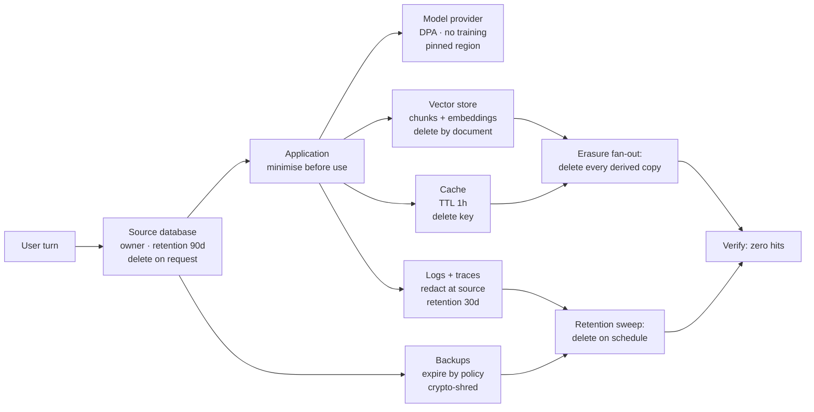

# Privacy, Retention, Deletion, and Compliance Controls

> **Interview answer (say this first).** Privacy in an AI system means collecting only the personal data a task needs, keeping each copy only as long as a stated retention window allows, and being able to delete a person's data from every place it reached — the source, the chunks, the vectors, the cache, the logs, and the backups. Deleting one database row is not deletion, because the same data is copied into embeddings, caches, traces, and backups. The engineering controls are a data map, a retention schedule per store, an erasure path that fans out to every derived copy and then verifies zero hits, region pinning, contracts with sub-processors, access reviews, and audit evidence. These are engineering controls that support legal obligations; the legal decisions themselves need legal review.

## Why this exists

A customer asks to be forgotten. An engineer runs `DELETE FROM users WHERE id = 1042`. The row disappears. The task is marked done. The customer is told the data is gone.

Then someone searches the support assistant for the customer's email. The assistant answers with the customer's address, their last order, and a summary of their complaint. The row is gone, but the system still knows them.

Where did the copy survive?

- The document loader had split the customer's file into **chunks** and stored them.
- The retriever had turned each chunk into a **vector** (an embedding) and stored that.
- The embedding's **metadata** still held the customer id.
- The assistant had **cached** the previous answer, keyed by the question, not by the customer.
- The **logs and traces** had recorded the whole request body.
- The **backup** taken the night before still held the deleted row.

Every one of those is a copy of personal data. Each has its own access control, its own retention rule, and its own deletion cost. One `DELETE` reached none of them.

This page is about handling personal data across that whole life: collect less, keep it only as long as needed, delete it everywhere, and be able to prove it. That last part — proof — is what turns a promise into a control an auditor can check.

> **Note:**
>
> **Not legal advice.** Jurisdictions, contracts, and retention periods differ. The controls here are the engineering side; your legal and privacy owners decide what the law requires. Frame answers as "here is the control and its evidence," not "this is legal."

## Start from zero

| Word | Plain meaning |
| --- | --- |
| **Personal data** | Any information about an identified or identifiable person. This is the broad legal term. |
| **PII** | Personally Identifiable Information; the everyday name for data that identifies or can be linked to a person: name, email, id, location. |
| **Special category data** | Higher-risk personal data: health, biometrics, race, religion, trade-union membership, sexual orientation. It usually needs a stronger lawful basis. |
| **Data minimisation** | Collect and send only what the stated purpose needs. Fewer fields, shorter time, less exposure. |
| **Purpose limitation** | Data collected for one purpose is not reused for an unrelated purpose without a basis. |
| **Lawful basis** | The legal reason you may process personal data, such as consent, contract, or legitimate interest. Engineering records which basis each flow uses; legal decides it. |
| **Consent** | A lawful basis where the person freely agrees to a specific processing. It must be recorded and revocable. |
| **Retention schedule** | A written rule of how long each store keeps each data class before deletion or archiving. |
| **Deletion vs erasure** | Deletion removes a record. Erasure is the stronger idea: the data can no longer be read or tied to the person, including copies. Deleting a row is not erasure. |
| **Right to erasure** | A person's right to have their personal data erased, subject to legal exceptions such as tax or fraud records. |
| **Data residency** | Keeping storage and processing inside a required country or region. |
| **Data processing agreement (DPA)** | The contract that binds a processor to your instructions, retention terms, and safeguards. |
| **Sub-processor** | A processor a processor uses, for example the cloud host behind a model provider. Sub-processors need to be listed and covered by the DPA. |
| **Pseudonymisation** | Replacing identifiers with pseudonyms so direct identification is harder. It is reversible, so the data is still personal data. |
| **Anonymisation** | Irreversibly breaking identifiability so the data is no longer personal data. Hard to achieve and easy to get wrong. |
| **Tokenisation** | Replacing a value with a token and keeping the mapping in a separate, access-controlled vault. |
| **Redaction** | Replacing a value with a placeholder such as `[EMAIL]` and discarding the value. |
| **Access review** | A periodic check that every account and service with access to personal data still needs it. |
| **Data subject access request (DSAR)** | A person's request to see, correct, or delete the data you hold about them. It has a legal deadline. |
| **Audit evidence** | Records that prove a control ran: access logs, erasure records, retention sweeps, approvals. |
| **Compliance control** | A concrete, testable measure that supports a legal or policy requirement and leaves evidence. |

Two distinctions carry the page.

**Pseudonymisation is not anonymisation.** A token you can map back is still personal data and still in scope for retention and erasure. Only irreversible de-identification counts, and it is genuinely hard.

**Deletion is not one operation.** A row can be deleted with a query. An embedding, a log line, and a backup cannot. Each needs its own plan, and the plan must cover every copy.

## The core idea

Think of personal data as **ink in a building full of paper**. You write on the intake form, then carbon-copy it to the filing room, the notes board, the recycling bin, and the off-site archive. If someone asks you to destroy their form, tearing up the intake copy leaves ink on every other sheet. You need to know where every copy is, and have a way to destroy each one.

So the first artifact is a **data map**: an honest list of every place a piece of personal data lands, with its retention and deletion obligation at each hop.



The load-bearing sentence is: **deletion must reach every derived copy.** A derived copy is anything created from the original: a chunk, an embedding, a cached answer, a log line, a trace, a backup, an analytics extract. If any derived copy still holds the data or can be tied back to the person, the deletion is incomplete.

Obligations map to controls. Read the right column as the work:

| Obligation | What it asks | Engineering control |
| --- | --- | --- |
| Lawful basis and purpose limitation | Process only for a stated reason | A purpose tag on each data flow; the gateway denies unlisted purposes |
| Data minimisation | Hold the least you need | Field allowlist per task; drop the rest at the boundary |
| Retention | Do not keep data forever | A retention schedule per store; a scheduled sweep that deletes |
| Right to erasure | Remove the person's data | A `subject_ref` on every store; erase, fan out, and verify zero hits |
| Data residency | Keep data in the right region | Region pinning; a provider-region check in the gateway |
| Sub-processor control | Only approved processors | A DPA registry; the gateway rejects unregistered providers |
| Access accountability | Only the right people can read | Access logs plus periodic access reviews |
| DSAR | Answer a person's request in time | A runbook, a deadline clock, and a record of the answer |
| Audit evidence | Prove the controls ran | An append-only audit record for each erasure, sweep, and access review |

A control without evidence is a claim. The evidence is what makes it defensible.

## How it works

1. **Map where personal data flows.** List every store and hop: source database, application memory, model provider, vector store, cache, logs, traces, backups, analytics. For each, record what data class it holds, who can read it, its retention, and how it is deleted. You cannot protect or delete what you have not found.
2. **Minimise what you collect.** Before adding a field, ask which task needs it. Send the model only the fields the task uses. Data you never collected cannot leak, cannot be subpoenaed, and does not need deleting.
3. **Tag every record with a subject reference.** Store a stable `subject_ref` (a pseudonymous id) alongside personal data so a request can find it across stores. Keep the mapping from `subject_ref` to a real identity in one controlled place.
4. **Write a retention schedule per store.** Decide how long prompts, memories, vectors, caches, logs, traces, and backups live. Put the number in configuration, not a wiki. A policy with no timer is a wish.
5. **Run a retention sweep on a schedule.** A job deletes or archives records past their window. Run it automatically, log what it removed, and alert if it stops running.
6. **Handle erasure end to end.** On request, find the subject in every store, delete or de-identify each copy, and fan out to chunks, vectors, caches, and derived indexes.
7. **Deal with copies you cannot edit.** Append-only logs and backups cannot be rewritten. Either let them expire by retention, or crypto-shred: delete the encryption key so the remaining ciphertext is unreadable.
8. **Pseudonymise where you can.** Replace identifiers with stable tokens when records must link. Keep the token key in a secret manager, and treat tokens as personal data for retention and erasure.
9. **Keep data in the right region.** Pin storage and processing to the required region, block cross-region replication, and check the provider's region before sending. Residency is an end-to-end property, not a database setting.
10. **Contract with sub-processors.** Use a DPA that sets no-training, retention, sub-processor, and region terms, then verify the technical configuration matches the contract. An unregistered provider is a blocked provider.
11. **Log access and review it.** Record who and what read personal data. Review access on a schedule and remove accounts and services that no longer need it. Access drifts; reviews catch the drift.
12. **Answer a DSAR from evidence.** Use the data map to find the person, pull the access log to show how the data was used, delete what must be deleted, and record the outcome against the deadline.
13. **Produce evidence for audits.** Keep erasure records, retention-sweep results, access-review sign-offs, and provider checks together. An audit should be a lookup, not a reconstruction.

> **Warning:**
>
> **Deleting the row is not deleting the person.** Embeddings, caches, traces, and backups outlive the request. Design erasure across every store, verify it with a test, and keep the proof.

## The syntax you will use

**An erasure function that fans out and verifies.** Every store tags records with a `subject_ref`. The function purges each store, then checks that no hit remains.

```python
from dataclasses import dataclass, field

SUBJECT_KEY = "subject_ref"

@dataclass
class DataStores:
    source: dict[str, dict] = field(default_factory=dict)   # row id -> record
    chunks: dict[str, dict] = field(default_factory=dict)    # chunk id -> record
    vectors: dict[str, dict] = field(default_factory=dict)   # vector id -> record
    cache: dict[str, dict] = field(default_factory=dict)     # cache key -> record

def _purge(store: dict[str, dict], subject_ref: str) -> int:
    doomed = [k for k, row in store.items() if row.get(SUBJECT_KEY) == subject_ref]
    for key in doomed:
        del store[key]
    return len(doomed)

def erase_subject(stores: DataStores, subject_ref: str) -> dict[str, int]:
    return {
        "source": _purge(stores.source, subject_ref),
        "chunks": _purge(stores.chunks, subject_ref),
        "vectors": _purge(stores.vectors, subject_ref),
        "cache": _purge(stores.cache, subject_ref),
    }

def verify_erased(stores: DataStores, subject_ref: str) -> bool:
    for store in (stores.source, stores.chunks, stores.vectors, stores.cache):
        if any(row.get(SUBJECT_KEY) == subject_ref for row in store.values()):
            return False
    return True
```

The `verify_erased` check is the important half. Without it, erasure is a hope. In a real system, logs and backups are not in this dictionary; they are handled by retention expiry or crypto-shredding.

**A retention sweep.** A job reads each record's creation time and store, compares it to the store's window, and drops anything past it.

```python
from datetime import datetime, timedelta, timezone

RETENTION_DAYS = {"prompt_log": 30, "trace": 7, "memory": 90, "cache": 1}

def retention_sweep(records: list[dict], now: datetime | None = None) -> list[dict]:
    now = now or datetime.now(timezone.utc)
    kept: list[dict] = []
    for rec in records:
        created = datetime.fromisoformat(rec["created_at"])
        window = RETENTION_DAYS[rec["store"]]
        if now - created >= timedelta(days=window):
            continue            # past its window: delete
        kept.append(rec)
    return kept
```

Because the numbers live in one dictionary, changing a retention period is a config change, not a code hunt.

**A redaction helper.** Redact at the boundary — before logging, before sending to a provider. Replace values with labelled placeholders and drop the original.

```python
import re

PATTERNS = {
    "EMAIL": re.compile(r"\b[\w.+-]+@[\w-]+\.[\w.-]+\b"),
    "PHONE": re.compile(r"(?<!\d)(?:\+?\d[\d -]{7,14}\d)(?!\d)"),
}

def redact(text: str) -> str:
    for label, pattern in PATTERNS.items():
        text = pattern.sub(f"[{label}]", text)
    return text
```

Redaction is a layer, not a guarantee. It misses unusual formats and can over-match ordinary numbers, so tune it against realistic data.

**A DSAR record.** One object per request holds the scope, the deadline, the findings, and links to evidence. The audit form strips the free-text response, which may itself contain personal data.

```python
from dataclasses import dataclass, field, asdict

@dataclass
class DSAR:
    request_id: str
    subject_ref: str
    received_at: str
    due_at: str
    scope: list[str]
    status: str = "open"
    findings: list[str] = field(default_factory=list)
    evidence_refs: list[str] = field(default_factory=list)
    response: str | None = None

    def to_audit(self) -> dict:
        record = asdict(self)
        record.pop("response")   # the response may hold personal data
        return record
```

The deadline is regime-specific; your legal owners set it. The engineer's job is to make the clock visible and never let a request sit unowned.

## Examples: simple to real

**Example 1 — a deletion that misses the vector store, then fixed.** The first pass purges the source and cache but forgets chunks and vectors. The verification fails, which is exactly what the check is for.

```python
stores = DataStores(
    source={"row1": {SUBJECT_KEY: "cust_1042", "note": "billing query"}},
    chunks={"c1": {SUBJECT_KEY: "cust_1042", "text": "billing query"}},
    vectors={"v1": {SUBJECT_KEY: "cust_1042", "embedding_id": "e1"}},
    cache={"q:where": {SUBJECT_KEY: "cust_1042", "answer": "your invoice"}},
)

partial = {
    "source": _purge(stores.source, "cust_1042"),
    "cache": _purge(stores.cache, "cust_1042"),
}
print("partial:", partial, "verified:", verify_erased(stores, "cust_1042"))
full = erase_subject(stores, "cust_1042")
print("full:", full, "verified:", verify_erased(stores, "cust_1042"))
```

Illustrative output:

```text
partial: {'source': 1, 'cache': 1} verified: False
full: {'source': 0, 'chunks': 1, 'vectors': 1, 'cache': 0} verified: True
```

The first pass deleted two of four copies and still looked successful in the counts. The verification step is what caught the miss. Make `verify_erased` a required assertion in the erasure test, not an optional extra.

**Example 2 — a retention sweep removes data past its window.** The sweep keeps only records inside their window and reports what it deleted.

```python
now = datetime(2026, 9, 14, tzinfo=timezone.utc)
records = [
    {"store": "prompt_log", "created_at": "2026-09-01T00:00:00+00:00"},  # 13 days: keep
    {"store": "prompt_log", "created_at": "2026-08-01T00:00:00+00:00"},  # 44 days: delete
    {"store": "trace", "created_at": "2026-09-01T00:00:00+00:00"},       # 13 days: delete
]
kept = retention_sweep(records, now=now)
print("kept:", [r["store"] + ":" + r["created_at"][:10] for r in kept])
print("deleted:", len(records) - len(kept))
```

Illustrative output:

```text
kept: ['prompt_log:2026-09-01']
deleted: 2
```

`prompt_log` keeps 30 days, so the August record goes. `trace` keeps 7 days, so even the recent one goes. The window is per store, not per system. Run this on a schedule and alert when it fails, because a sweep that silently stops is how data lives forever.

**Example 3 — pseudonymisation versus anonymisation.** A token still links back, so it is still personal data. Counts can be anonymous, but only if no small group is singled out.

```python
import hashlib, hmac

TOKEN_KEY = b"example-key-from-secret-manager"   # held in a KMS, not in code

def pseudonym(value: str) -> str:
    digest = hmac.new(TOKEN_KEY, value.encode(), hashlib.sha256).hexdigest()
    return "p_" + digest[:12]

def region_counts(rows: list[str]) -> dict[str, int]:
    counts: dict[str, int] = {}
    for region in rows:
        counts[region] = counts.get(region, 0) + 1
    return counts

print("token 1:", pseudonym("ana@example.com"))
print("token 2:", pseudonym("ana@example.com"))
print("counts :", region_counts(["eu", "eu", "us"]))
```

Illustrative output:

```text
token 1: p_4cd5fb7a04ff
token 2: p_4cd5fb7a04ff
counts : {'eu': 2, 'us': 1}
```

The token is stable, so analytics can link a person's records. That is the point, and it is also why it remains personal data: anyone with the key can test guesses and re-identify. The counts look anonymous, but a bucket of one person is not. Anonymisation fails when a rare combination still singles someone out, and whether it counts as anonymous is a legal question that needs legal review. In code: pseudonymised data stays in the erasure and retention plan; only genuinely irreversible aggregates leave it.

**Example 4 — a DSAR answered from an audit log.** The subject asks what data is held and who looked at it. The access log answers the second part, and the data map answers the first.

```python
ACCESS_LOG = [
    {"actor": "support-bot", "subject_ref": "cust_1042", "action": "read_ticket", "at": "2026-08-01T09:10:00Z"},
    {"actor": "jane", "subject_ref": "cust_1042", "action": "view_profile", "at": "2026-08-03T14:02:00Z"},
    {"actor": "analytics", "subject_ref": "cust_9999", "action": "export", "at": "2026-08-03T15:00:00Z"},
]

def accesses_for(subject_ref: str, log: list[dict]) -> list[dict]:
    return [entry for entry in log if entry["subject_ref"] == subject_ref]

hits = accesses_for("cust_1042", ACCESS_LOG)
print("accesses:", [(h["actor"], h["action"]) for h in hits])
print("evidence refs:", [h["at"] for h in hits])
```

Illustrative output:

```text
accesses: [('support-bot', 'read_ticket'), ('jane', 'view_profile')]
evidence refs: ['2026-08-01T09:10:00Z', '2026-08-03T14:02:00Z']
```

The answer to the DSAR is: these two accesses, these stores, this retention. The same log becomes the audit evidence that the request was handled and what was disclosed. Keep the response itself out of the audit record, because it may repeat personal data.

**Example 5 — a residency check rejects a provider in the wrong region.** The gateway refuses to send EU data to a provider hosted outside the EU, before the request leaves.

```python
PROVIDER_REGION = {"eu-llm": "eu-west-1", "us-llm": "us-east-1"}

def residency_ok(provider: str, data_region: str) -> bool:
    return PROVIDER_REGION[provider] == data_region

print("eu data -> eu-llm:", residency_ok("eu-llm", "eu-west-1"))
print("eu data -> us-llm:", residency_ok("us-llm", "eu-west-1"))
```

Illustrative output:

```text
eu data -> eu-llm: True
eu data -> us-llm: False
```

The check belongs at the model gateway, where every call passes, and it should fail closed on an unknown provider. Residency also breaks at replicas, backups, log aggregation, and tracing, so test those paths too. A region setting on the primary database is not residency on its own.

## In production

- **Deletion must reach source, chunks, vectors, caches, logs, and backups.** Deleting the row is one copy of several. Map every derived copy, and treat the vector store and tracing tool as first-class stores, not afterthoughts.
- **Verify deletion with a test.** After erasure, query every store and assert zero hits. A deletion you did not verify is a claim. Run the test on a synthetic subject in CI so the path cannot silently rot.
- **Backups are deleted by retention policy, not by query.** You cannot edit a backup in place. Let it expire on schedule, or crypto-shred the key so the copy is unreadable. Document which method covers backups.
- **Minimise collection first.** The cheapest data to protect and delete is data you never stored. Add a field only when a task needs it, and send providers only the fields the task uses.
- **Set retention per store, in configuration.** Prompts, caches, traces, memories, and backups have different natural lifetimes. One global period is usually wrong, and a policy with no timer is a wish.
- **Pseudonymisation is not anonymisation.** A reversible token is still personal data and stays in scope for retention and erasure. Do not let a token fool you or an auditor.
- **Keep regions straight end to end.** Pin storage and processing, block cross-region replication, and check the provider region at the gateway. Residency quietly breaks at replicas, logs, CDNs, and tracing.
- **Sub-processors need contracts and a list.** Know every processor a provider uses, confirm the DPA covers it, and reject providers that are not registered. Verify the technical configuration matches the contract.
- **Access reviews catch drift.** People change teams and services change scope. Review who can read personal data on a schedule, and remove access that no longer has a reason.
- **DSARs need a runbook and a deadline.** Assign an owner, start the clock on receipt, track the scope, and record the outcome. An untracked request is a breach waiting to happen.
- **You cannot delete what you cannot find, so map your data.** Keep the data map current as stores are added. A new vector collection or tracing vendor is a new deletion obligation.
- **Keep evidence for audits.** Store erasure records, sweep results, access reviews, and provider checks together and append-only. An audit should be a lookup, not a reconstruction.

## Interview questions

### 1. Why is deleting the database row not enough?

**Answer.** Because the same data is copied into derived stores: document chunks, vector embeddings and their metadata, caches, logs, traces, analytics extracts, and backups. Each copy has its own access and retention, and some cannot be edited in place. Erasure means the data can no longer be read or tied to the person, so it must reach every derived copy, not just the source row.

**Follow-up: "How do you find every copy?"** Maintain a data map, tag records with a `subject_ref` at ingest, and test erasure with a synthetic subject across every store. If you cannot find a copy, you cannot delete it.

**Trap.** Declaring the request done after the primary database delete, while embeddings and traces still hold the content.

### 2. What is a retention schedule and why is one global period wrong?

**Answer.** A retention schedule is a written per-store rule for how long each data class is kept before deletion or archiving. Different stores have different natural lifetimes: traces might need days, caches hours, memories months, and audit records a year. A single global period either deletes evidence you need or keeps sensitive data far too long. Put the numbers in configuration and enforce them with a scheduled sweep.

**Follow-up: "What happens if the sweep stops running?"** Data lives forever and the policy becomes false. Monitor the sweep, alert on failure, and include its last run time in audit evidence.

**Trap.** Writing retention in a wiki with no timer. A policy nothing enforces is a wish.

### 3. How do you actually erase data from backups and append-only logs?

**Answer.** You usually cannot edit them in place. Two workable options: let them expire under the retention schedule, or crypto-shred by deleting the encryption key so the ciphertext becomes unreadable. Record which method covers which store, and make sure a restored backup cannot revive data you promised to erase. Append-only logs may also be redacted at write time so personal data never enters them.

**Follow-up: "How does crypto-shredding interact with backups?"** It is the reason crypto-shredding works: the key is not in the backup, so deleting it removes readability from every encrypted copy at once. Rotate and destroy keys deliberately.

**Trap.** Assuming the backup vendor deletes on request. Confirm the retention window and the deletion path in the contract, and verify it.

### 4. Explain the difference between pseudonymisation and anonymisation.

**Answer.** Pseudonymisation replaces identifiers with pseudonyms but keeps a way to re-link, so the data is still personal data and still in scope. Anonymisation irreversibly breaks identifiability so the data is no longer personal data. The difference matters legally: only anonymised data leaves the retention and erasure obligations. Anonymisation is hard because rare combinations, small groups, and auxiliary data can still single someone out.

**Follow-up: "Is a keyed hash anonymisation?"** No. Anyone with the key can test guesses, so it is pseudonymisation. Keep the key separate and treat the tokens as personal data.

**Trap.** Calling a reversible token "anonymous" to avoid obligations. That is a compliance failure dressed as a data-engineering decision.

### 5. What is a DSAR and how do you handle one?

**Answer.** A DSAR is a request from a person to see, correct, or delete the data you hold about them, and it carries a legal deadline. Handle it with a runbook: assign an owner on receipt, start the clock, use the data map to find the data, pull the access log to show how it was used, erase or correct what the request requires, and record the outcome and evidence. Legal owners decide the deadline and any exceptions.

**Follow-up: "How do you find the person across stores?"** A stable `subject_ref` tagged at ingest, plus an inventory of stores. Without both, the request becomes archaeology.

**Trap.** Treating a DSAR as a one-off email. Untracked requests miss deadlines and cannot be evidenced.

### 6. How do you enforce data residency in an AI system?

**Answer.** Pin storage and processing to the required region, block cross-region replication, and check the model provider's region at the gateway before sending. Residency breaks at replicas, backups, log aggregation, CDNs, and third-party tracing, so verify each path with config and network tests. Fail closed on an unknown provider or region.

**Follow-up: "What about failover?"** Cross-region failover moves data, which may break residency. You need a residency-aware failover plan, or you accept the transfer with the required safeguards.

**Trap.** Setting the primary database region and assuming everything follows. Residency is end-to-end, not a database setting.

### 7. What should you check in a provider contract, and how do you prove it holds?

**Answer.** That your data is not used to train models, how long it is retained and whether zero retention is available, the sub-processor list, the processing region, breach-notification terms, and whether the terms cover the specific service you use. Then verify the technical configuration matches: region pinning, no-training settings, retention off, and sub-processors registered in the gateway. A contract term without a technical check is unverified.

**Follow-up: "Is a no-training guarantee enough for special category data?"** Not always. It addresses one risk. You may also need zero retention, a specific region, or a self-hosted model so the data never leaves your control. Legal owners decide.

**Trap.** Assuming a consumer tier has the enterprise terms. Retention and training defaults often differ.

### 8. What evidence do you keep to prove privacy controls work?

**Answer.** Erasure records with the stores touched and the verification result, retention-sweep runs with counts and timestamps, access-review sign-offs, provider and region checks, and DSAR records with the outcome and deadline. Keep them append-only and free of the personal data itself. Evidence is what turns a control into something an auditor or incident review can check.

**Follow-up: "What makes evidence weak?"** Gaps and manual editing. An erasure with no verification, a sweep with no last-run time, or a record that contradicts the retention policy. Evidence should be generated by the system, not written by hand afterwards.

**Trap.** Proving deletion with a screenshot of a query. It shows intent, not that every derived copy is gone.

## Remember this

- **Deletion must reach every derived copy** — source, chunks, vectors, caches, logs, traces, and backups — and you must verify zero hits.
- **Retention is per store and enforced by a timer.** A policy with no scheduled sweep is a wish, and a sweep that stops silently keeps data forever.
- **Pseudonymised data is still personal data.** Only irreversible anonymisation leaves the retention and erasure obligations, and it is hard to achieve.
- **You cannot delete what you cannot find.** Keep the data map current and tag records with a `subject_ref` so a request reaches every store.
- **Controls need evidence.** Erasure records, sweep results, access reviews, and DSAR outcomes are the proof; keep them append-only and review jurisdiction-specific rules with legal.
