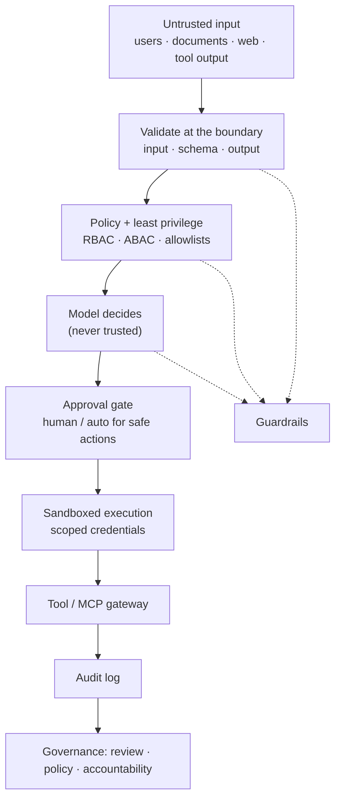

# Phase 9 — AI Security and Governance

AI systems introduce a new class of security problem: the thing that decides what to do is also the thing that can be tricked by the data it reads. A prompt is code, retrieved documents are untrusted input, and a tool call is a real action with real permissions. Security here is not a bolt-on; it is the design of what the model is allowed to see, decide, and do.

This phase builds the threat model first, then the controls: validation at the boundaries, sandboxing, least privilege, allowlists, approvals, policy, audit, privacy, encryption, and governance. The recurring theme is that the model is never trusted — only the deterministic code around it is.

## What you will be able to do

By the end of this phase you should be able to:

- Build an AI threat model and map attacks to controls.
- Reason about prompt injection, indirect injection, and jailbreaking, and mitigate them in layers.
- Understand poisoning (context, memory, tool, MCP) and data exfiltration and secret leakage.
- Contain excessive agency, privilege escalation, impersonation, and unauthorized tool execution.
- Handle malicious documents and web content safely.
- Validate input, output, and schemas, and sandbox untrusted execution.
- Apply least privilege, scoped credentials, allowlists, denylists, and approval gates.
- Enforce RBAC and policy, and produce audit logs you can defend.
- Protect data privacy and PII, and encrypt data at rest and in transit.
- Manage secrets and isolate tenants.
- Secure model and MCP gateways, and harden the supply chain and dependencies.
- Run AI, model, prompt, and agent governance, and apply responsible-AI concepts.

## Security layers

The control is never a single filter. Injection cannot be reliably detected, so the defence is that even a fully compromised model still cannot exceed the permissions, reach, or approvals that the deterministic layer grants it.

## Topic order

1. [AI threat models](01-ai-threat-models.md) — attackers, assets, and the attack surface.
2. [Prompt injection and jailbreaking](02-prompt-injection-and-jailbreaking.md) — direct, indirect, and why there is no complete fix.
3. [Poisoning: context, memory, tool, and MCP](03-poisoning-context-memory-tool-mcp.md) — corrupting what the model trusts.
4. [Data exfiltration and secret leakage](04-data-exfiltration-and-secret-leakage.md) — getting data out.
5. [Excessive agency and privilege escalation](05-excessive-agency-and-privilege-escalation.md) — too much power, and impersonation.
6. [Malicious documents and web content](06-malicious-documents-and-web-content.md) — untrusted content by design.
7. [Input, output, and schema validation](07-input-output-and-schema-validation.md) — validate everything that crosses a boundary.
8. [Sandboxing](08-sandboxing.md) — containing code and tools.
9. [Least privilege and scoped credentials](09-least-privilege-and-scoped-credentials.md) — the smallest key that works.
10. [Tool allowlists and denylists](10-tool-allowlists-and-denylists.md) — what may run at all.
11. [Approval gates and human approvals](11-approval-gates-and-human-approvals.md) — a person in the path of danger.
12. [RBAC, policy enforcement, and audit logging](12-rbac-policy-enforcement-and-audit-logging.md) — who may do what, and the proof.
13. [Data privacy and PII handling](13-data-privacy-and-pii-handling.md) — personal data in prompts and logs.
14. [Encryption at rest and in transit](14-encryption-at-rest-and-in-transit.md) — protecting data on disk and on the wire.
15. [Secret management](15-secret-management.md) — keys, rotation, and blast radius.
16. [Tenant isolation](16-tenant-isolation.md) — one tenant cannot reach another.
17. [Secure model and MCP gateways](17-secure-model-and-mcp-gateways.md) — the chokepoints that enforce policy.
18. [Supply-chain and dependency security](18-supply-chain-and-dependency-security.md) — trusting what you install.
19. [AI governance](19-ai-governance.md) — model, prompt, agent governance and responsible AI.

> **How to study this phase.** For every capability, ask the attacker's question: "If I controlled the input, the document, the tool, or the model output, what is the worst I could do?" Then check that a deterministic control — not the model's judgement — bounds the answer.
