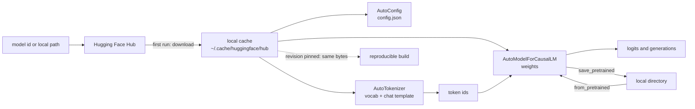

# Hugging Face Transformers

> **Interview answer (say this first).** The `transformers` library is the standard Python interface to open pretrained models. You name a model — either a Hub id such as `meta-llama/Llama-3.1-8B-Instruct` or a local folder — and load three matching objects: an `AutoTokenizer` for text to token ids, an `AutoConfig` for the architecture settings, and an `AutoModel...` for the weights. The first load downloads the files into a local cache; every later load reads from disk. Exactly the same `from_pretrained` call works for a Hub id or a local path, which is why the library is the default base layer for fine-tuning, evaluation, and self-hosted serving. For serving many concurrent requests you usually move up to vLLM or TGI, but those load these same weights and tokenizers underneath.

## Why this exists

Before this library, running an open model meant finding the paper, re-implementing the architecture, downloading raw checkpoints, mapping layer names by hand, and writing your own tokenizer. Every model was a small research project. `transformers` turned that into three function calls with a consistent interface.

That consistency is the real product. The same code loads BERT, Llama, Mistral, Qwen, and hundreds of others. The class name changes (`AutoModelForCausalLM` versus `AutoModelForSequenceClassification`) but the shape of the code does not. Once you learn the pattern you can swap models by changing one string.

Three problems it solves, and they are worth separating:

1. **Distribution.** Weights are large and there are many versions. The Hub plus a local cache gives you versioned download, deduplication, and offline reuse.
2. **Architecture drift.** New models appear constantly. `AutoConfig` reads a small JSON file that describes the model, so the library can build the right network without you editing code.
3. **Tokenizer alignment.** A model is only correct with the exact tokenizer and chat format it was trained on. The library bundles them together and warns when they disagree.

For an agentic system this layer matters because agents spend tokens. Estimating context size, enforcing budgets, and formatting tool calls all need the model's own tokenizer. Guessing with a character count is a common source of production bugs.

## Start from zero

| Word | Plain meaning |
| --- | --- |
| **Hugging Face Hub** | The website and API that hosts model files, configs, and tokenizers. Identified by `owner/name`. |
| **Checkpoint** | The saved weights of a trained model, usually split into several files. |
| **`transformers`** | The Python library that builds the model and runs it on PyTorch or TensorFlow. |
| **`AutoConfig`** | Reads `config.json` and builds the settings object for the architecture. |
| **`AutoTokenizer`** | Converts text to token ids and back, using the model's own vocabulary and rules. |
| **`AutoModel`** | The base network returning hidden states. Task classes like `AutoModelForCausalLM` add a head. |
| **`from_pretrained`** | The class method that resolves a Hub id or local path and loads weights. |
| **Hub id** | A string like `mistralai/Mistral-7B-Instruct-v0.3`, resolved remotely or from cache. |
| **Local path** | A directory on disk containing `config.json`, tokenizer files, and weights. |
| **Cache** | The local copy of downloaded files. Default root is `~/.cache/huggingface/hub`. |
| **Revision** | A branch, tag, or commit hash. Pinning it makes a load reproducible. |
| **`dtype`** | The number format used for the weights, such as `float16` or `bfloat16`. |
| **`device_map`** | A recipe telling `accelerate` where to put each layer, such as one GPU or many. |
| **`attn_implementation`** | Which attention kernel to use: `eager`, `sdpa`, or `flash_attention_2`. |
| **SafeTensors** | A weights file format that stores raw tensors with no executable code. |
| **Pickle (`.bin`)** | The older weight format. Loading it can execute arbitrary code. |
| **Fast tokenizer** | Rust-backed tokenizer that returns offsets, spans, and is thread-safe. |
| **Slow tokenizer** | Pure-Python tokenizer. Kept for compatibility and for a few models. |
| **Padding** | Adding filler tokens so every sequence in a batch has the same length. |
| **Truncation** | Cutting a sequence that is longer than the allowed maximum. |
| **Chat template** | The exact string format a chat model expects, including role markers and tool syntax. |

Two contrasts to hold onto:

- **Hub id versus local path.** They are interchangeable at load time. Using the id is convenient; pinning to local files is reproducible and works offline.
- **The library versus a serving engine.** `transformers` is a great loader and a fine single-request runner. It is not a high-throughput server. vLLM, TGI, and SGLang are the serving layer on top.

## The core idea

Think of a model as a shipped piece of flat-pack furniture. The **Hub** is the warehouse. `config.json` is the instruction sheet that says which parts exist and how they fit. The **tokenizer** is the labelled bag of screws, matched to this exact model. `AutoModel` is the act of assembling the parts into a usable object.

The key insight is that you never assemble by hand. `from_pretrained` reads the instruction sheet, fetches the matching parts, and builds the network. Swap the instruction sheet and you get different furniture from the same call.



Every load goes through the same resolution order, and that order explains most "it works on my machine" bugs:

| You pass | First lookup | Fallback | Offline behaviour |
| --- | --- | --- | --- |
| `"meta-llama/Llama-3.1-8B"` | Local cache | Hub download | Fails unless cached, or blocked by `local_files_only=True` |
| `"/models/llama-3.1-8b"` | That directory | None | Always works if the files exist |
| `"bert-base-uncased"` + `revision="a1b2c3"` | Cache entry for that commit | Hub download of that commit | Fails unless cached |
| Any id + `cache_dir="/data/hf"` | That cache root | Hub download | Fails unless cached |

The second thing to hold is the split between **architecture** and **weights**. `config.json` is small and describes the shape. The weights are huge and fill that shape. That separation is why `AutoConfig.from_pretrained` is cheap, why you can inspect a model before downloading 140 GB, and why a config that does not match its weights fails loudly at load.

## How it works

1. **Resolve the identifier.** If the string is not an existing local path, it is resolved as a Hub repo id (with or without an owner/namespace). If it is an existing directory, it is treated as local.
2. **Fetch or reuse the files.** The loader checks the cache for the requested revision. On a miss it downloads `config.json`, tokenizer files, and weight shards, then records what it downloaded so the next run is offline.
3. **Build the config.** `AutoConfig` reads `config.json` for hidden size, number of layers, number of heads, vocabulary size, and the model type. This decides the architecture class.
4. **Build the tokenizer.** It reads the vocabulary and merge or unigram rules. A fast tokenizer loads a Rust-backed implementation and also exposes character offsets.
5. **Instantiate the model.** The chosen class allocates tensors with the requested `dtype` and then copies the checkpoint weights into them. `low_cpu_mem_usage=True` streams shards into place instead of loading everything into host RAM first.
6. **Place the layers.** With `device_map="auto"`, `accelerate` decides which layers go on which device, including offloading to CPU or disk when the model does not fit.
7. **Pick the attention kernel.** `attn_implementation` selects `eager` for a portable fallback, `sdpa` for PyTorch's built-in scaled dot-product attention, or `flash_attention_2` for the fastest fused kernel when the dtype and hardware allow it.
8. **Run.** For text generation, call `model.generate(...)` with the encoded input. For training, wrap the model in a `Trainer` or a plain PyTorch loop.
9. **Save.** `save_pretrained` writes `config.json`, tokenizer files, and SafeTensors shards. That directory is now a Hub id you can point at locally.
10. **Load again offline.** `from_pretrained` on the saved directory with `local_files_only=True` gives you a fully offline, reproducible model.

Steps 5 through 7 are where an interview answer usually earns credit, because they are where memory and speed are decided.

> **Note:**
>
> **The cache is a content-addressed store, not a folder per model.** `blobs/` holds the file contents under hash-based names, `snapshots/<commit>/` holds symlinks into `blobs/` for each revision, and `refs/` holds small pointers that map a branch or tag name to a commit. Downloading the same file twice costs nothing, and two model versions that share a tokenizer share the file on disk. That is efficient, but it also means "delete the cache to free space" can remove a file another cached model still points at. Use `hf cache delete` rather than deleting directories by hand.

## The syntax you will use

**Load config, tokenizer, and model.** This is the pattern to memorise.

```python
from transformers import AutoConfig, AutoTokenizer, AutoModelForCausalLM

model_id = "meta-llama/Llama-3.1-8B-Instruct"

config = AutoConfig.from_pretrained(model_id)          # cheap: reads config.json
tokenizer = AutoTokenizer.from_pretrained(model_id)    # vocab + chat template
model = AutoModelForCausalLM.from_pretrained(model_id) # downloads the weights
```

`AutoConfig` is metadata; `AutoModelForCausalLM` is the multi-gigabyte part.

**Choose the number format and placement.** The defaults are safe but not optimal.

```python
import torch
from transformers import AutoModelForCausalLM

model = AutoModelForCausalLM.from_pretrained(
    model_id,
    dtype=torch.bfloat16,          # newer name; torch_dtype still accepted
    device_map="auto",             # spread across available GPUs
    attn_implementation="sdpa",    # eager | sdpa | flash_attention_2
    low_cpu_mem_usage=True,        # stream shards instead of loading all to RAM
)
```

`dtype` halves the memory versus the fp32 default; `device_map` decides whether it fits at all.

**Pin a revision for reproducibility.** A tag or commit id freezes exactly what you run.

```python
model = AutoModelForCausalLM.from_pretrained(model_id, revision="refs/pr/12")
# or a commit hash, which never moves:
model = AutoModelForCausalLM.from_pretrained(model_id, revision="e9f5a1c0...")
```

Branches move; commit hashes do not. Pin in production.

**Save locally and load offline.** A saved directory behaves like any other model id.

```python
model.save_pretrained("./serving/llama-3.1-8b")
tokenizer.save_pretrained("./serving/llama-3.1-8b")

model = AutoModelForCausalLM.from_pretrained(
    "./serving/llama-3.1-8b",
    local_files_only=True,    # never touch the network
)
```

This is how you build a container image with the weights baked in.

**Tokenize with padding and truncation.** Batches need equal lengths and a hard cap.

```python
batch = tokenizer(
    ["short text", "a much longer piece of text"],
    padding="max_length",      # pad every sequence up to max_length
    truncation=True,           # cut anything beyond max_length
    max_length=512,
    return_tensors="pt",       # PyTorch tensors
)
# batch["input_ids"].shape        -> (2, 512)
# batch["attention_mask"].shape   -> (2, 512); 0 marks padding, 1 marks real tokens
```

Pad on the right for training-compatible batches, and mask the padding so it is ignored.

**Count tokens before you send a request.** Use the model's own tokenizer, not a character estimate.

```python
n_tokens = len(tokenizer(prompt).input_ids)
if n_tokens + max_new_tokens > model.config.max_position_embeddings:
    ...  # trim the prompt or reject the request
```

The context limit covers prompt plus completion.

**Apply a chat template.** Chat models expect role markers, and the template encodes them.

```python
messages = [
    {"role": "system", "content": "You are a concise assistant."},
    {"role": "user", "content": "What is a KV cache?"},
]
prompt = tokenizer.apply_chat_template(
    messages,
    tokenize=False,                # return the string to inspect it
    add_generation_prompt=True,    # append the marker that starts the assistant turn
)
ids = tokenizer(prompt, return_tensors="pt").to(model.device)
```

`tokenize=False` first is how you debug a wrong prompt format.

**Load a quantized model.** A 4-bit flag makes a large model fit on one GPU.

```python
from transformers import BitsAndBytesConfig

bnb = BitsAndBytesConfig(
    load_in_4bit=True,
    bnb_4bit_quant_type="nf4",
    bnb_4bit_compute_dtype=torch.bfloat16,
)
model = AutoModelForCausalLM.from_pretrained(model_id, quantization_config=bnb, device_map="auto")
```

This is a documented integration with `bitsandbytes`, not a `transformers` feature on its own.

**Download without loading.** Useful for warming a cache or prebuilding an image.

```python
from huggingface_hub import snapshot_download

path = snapshot_download(
    repo_id=model_id,
    revision="main",
    allow_patterns=["*.json", "*.safetensors", "tokenizer*"],
)
```

`allow_patterns` avoids pulling formats you will never use, such as `.bin` or `.gguf`.

## Examples: simple to real

**Example 1 — tokenizer only, no model.** Token counting is cheap and needs no GPU.

```python
from transformers import AutoTokenizer

tok = AutoTokenizer.from_pretrained("mistralai/Mistral-7B-Instruct-v0.3")
ids = tok("Context windows are expensive.").input_ids
print(len(ids), tok.convert_ids_to_tokens(ids))
# illustrative: about 6-8 tokens depending on the vocabulary
```

The point is not the exact count. It is that the count is the model's, not an estimate.

**Example 2 — inspect before you download 140 GB.** Config first, weights later.

```python
from transformers import AutoConfig

cfg = AutoConfig.from_pretrained("meta-llama/Llama-3.1-70B-Instruct")
print(cfg.hidden_size, cfg.num_hidden_layers, cfg.num_attention_heads,
      cfg.num_key_value_heads, cfg.max_position_embeddings)
# illustrative: 8192 80 64 8 131072
```

`num_key_value_heads` smaller than `num_attention_heads` means grouped-query attention, which is the single biggest lever on KV cache size. Reading the config tells you the memory story before a byte is downloaded.

**Example 3 — save then reload offline.** Round-tripping to disk is how you build an image.

```python
from transformers import AutoModelForCausalLM, AutoTokenizer

model = AutoModelForCausalLM.from_pretrained(model_id, dtype="bfloat16")
tok = AutoTokenizer.from_pretrained(model_id)
model.save_pretrained("/opt/models/tiny"); tok.save_pretrained("/opt/models/tiny")

same = AutoModelForCausalLM.from_pretrained("/opt/models/tiny", local_files_only=True)
```

If this load needs the network, your "baked-in weights" are not actually baked in.

**Example 4 — padding waste in a batch.** Padding is simple but it burns compute.

```text
sequences of length  [10, 20, 30, 40]  pad to 40
real tokens = 100, allocated slots = 4 x 40 = 160, waste = 37.5%

sequences of length  [5, 5, 5, 200]    pad to 200
real tokens = 215, allocated slots = 4 x 200 = 800, waste = 73.1%
```

One long request in a batch inflates everyone's cost. This is the exact problem continuous batching solves, covered in a later chapter.

**Example 5 — a chat template with a tool.** Tool-calling format is part of the model, not your prompt style.

```python
messages = [
    {"role": "system", "content": "You can call tools."},
    {"role": "user", "content": "What is the weather in Paris?"},
]
prompt = tokenizer.apply_chat_template(
    messages,
    tools=[{
        "type": "function",
        "function": {
            "name": "get_weather",
            "parameters": {
                "type": "object",
                "properties": {"city": {"type": "string"}},
                "required": ["city"],
            },
        },
    }],
    add_generation_prompt=True,
    tokenize=False,
)
# illustrative: the template injects the tool schema in the format the model was trained on
```

If you hand-roll this string, tool calls break in ways that look like model failures but are formatting bugs.

**Example 6 — safe load versus pickle.** A checkpoint is code-adjacent data.

```python
# Preferred: SafeTensors requested explicitly, fails if only pickle exists.
model = AutoModelForCausalLM.from_pretrained(model_id, use_safetensors=True)

# Risky: older .bin files use pickle and can execute code on load.
model = AutoModelForCausalLM.from_pretrained(model_id, use_safetensors=False)

# Untrusted repo asking for custom code: this runs code from the repo author.
model = AutoModelForCausalLM.from_pretrained(model_id, trust_remote_code=True)
```

`trust_remote_code=True` is a supply-chain decision, not a convenience flag. Treat it like running a stranger's install script.

**Example 7 — a memory estimate you can do in your head.** Weights are `parameters x bytes`.

```text
7B  model: fp16 = 7e9 x 2 B = 14 GB   int8 = 7 GB   int4 = 3.5 GB
70B model: fp16 = 140 GB              int8 = 70 GB  int4 = 35 GB
```

A 70B model does not fit on one 80 GB GPU in fp16. That single line is why quantization and model parallelism exist.

## In production

- **Pin a revision, not a branch.** `main` moves. A commit hash or a copied local directory is the only reproducible option.
- **Bake weights into the image for stable deployments.** Downloading 14 GB at pod start turns a fast rollout into a slow, flaky one. Warm the cache or copy it in.
- **Treat model files as code.** Prefer SafeTensors, which cannot execute code on load, over pickle-based `.bin` files. `trust_remote_code=True` runs code shipped by the repo owner, so review and pin it. Use `allow_patterns` so you do not download both weight formats.
- **A config mismatch fails at load, not at runtime.** If you hand-edit `config.json`, expect shape errors. Keep config and weights from the same revision.
- **`device_map="auto"` can offload to CPU or disk.** That makes the model "fit" but run very slowly. Check the reported device map instead of assuming GPU.
- **`dtype` changes memory and speed, not just precision.** bf16 is usually the right default on modern GPUs. fp32 doubles memory for little quality gain at inference.
- **Fast tokenizers are not always identical to slow ones.** For a few models the implementations differ in edge cases. Validate on your own data if the tokenizer is central to your pipeline.
- **Chat templates change between model versions.** A template that worked for `v0.2` can be wrong for `v0.3`. Never hard-code role strings; read the template from the tokenizer.
- **Padding mask matters.** Forgetting `attention_mask` lets the model attend to filler tokens and quietly degrades outputs.
- **Tokenizer files are part of the artifact.** Saving the model without the tokenizer gives you a checkpoint you cannot safely reuse. Save both.
- **Agentic-AI relevance.** Agents build prompts from system text, history, retrieved chunks, and tool schemas. Counting all of that with the real tokenizer before dispatch prevents truncation bugs. A dropped system prompt or tool schema makes an agent misbehave in ways that look like a reasoning failure but are a budget failure.
- **Use the library to prepare, a server to serve.** Loading weights with `transformers` is standard; running hundreds of concurrent streams is a job for vLLM, TGI, or SGLang.

## Interview questions

### 1. What do `AutoModel`, `AutoTokenizer`, and `AutoConfig` each do?

**Answer.** `AutoConfig` reads `config.json` and produces the architecture settings — layer count, hidden size, attention heads, vocabulary size. `AutoTokenizer` loads the vocabulary and rules and converts text to token ids and back, including the chat template. `AutoModel` and its task-specific variants instantiate the network and load the weights. `AutoModelForCausalLM` is the base network plus a language-modeling head. They must come from the same model so the config, vocabulary, and weights line up.

**Follow-up: "Why is there an `Auto` prefix?"** It lets the same code work across architectures. The config declares the model type and the factory picks the right class, so you swap models by changing one string instead of editing code.

**Trap.** Thinking `AutoConfig` downloads the weights. It reads a small JSON file, which is why you can inspect a 70B model's shape without downloading 140 GB.

### 2. What happens on the first `from_pretrained` versus later ones?

**Answer.** On the first call the library resolves the repo, checks the local cache for that revision, downloads any missing files into the cache, and records what it fetched. Later calls with the same id and revision find the files locally and skip the network entirely. With `local_files_only=True` you forbid network access so a cache miss fails instead of downloading.

**Follow-up: "How would you run fully offline in a container?"** Copy the cache or a `save_pretrained` directory into the image, then load from that path with `local_files_only=True`. That makes startup deterministic and removes a network dependency from your readiness path.

**Trap.** Assuming a cached model is cached forever. Cache eviction, a different user's home directory, or a changed `cache_dir` all produce a surprise download at the worst time.

### 3. Hub id versus a local directory — what is the difference?

**Answer.** Functionally nothing at load time; `from_pretrained` accepts either. The Hub id resolves through the cache and can pull updates, which is convenient but not reproducible. A local directory is a frozen snapshot that works offline and pins exactly the bytes you tested. Production images usually use the local directory, and development uses the Hub id.

**Follow-up: "How do you get a local directory from a Hub model?"** `save_pretrained` writes the weights, config, and tokenizer into a folder. `snapshot_download` from `huggingface_hub` can also fetch a raw snapshot without loading the model.

**Trap.** Passing a path that does not exist and assuming a clear error. Some code paths treat an unknown string as a Hub id and try to download it, so a typo looks like a network failure.

### 4. What is the difference between a fast and a slow tokenizer?

**Answer.** A fast tokenizer is backed by the Rust `tokenizers` library, is much faster, is thread-safe, and returns character offsets that map tokens back to spans in the original text. A slow tokenizer is the older pure-Python implementation. Fast is the default when available; slow exists for compatibility and for models without a fast implementation.

**Follow-up: "Why do the offsets matter?"** They let you highlight, redact, or attribute text by token, which is needed for PII redaction and for linking a citation to the exact source span. Without offsets you would re-search the string and risk ambiguity.

**Trap.** Assuming fast and slow are always bit-identical. For a few models the implementations differ in edge cases, so if tokenization is central to correctness, validate on your data.

### 5. How do padding and truncation work, and what goes wrong?

**Answer.** Padding adds filler tokens so every sequence in a batch has the same length, with an `attention_mask` marking which positions are real. Truncation cuts sequences longer than `max_length`. Padding keeps batches rectangular but wastes compute on filler, and truncation silently drops content.

**Follow-up: "Why is padding wasteful?"** In a static batch every sequence is padded to the longest one, so a single long request inflates the cost of all the others. Continuous batching avoids this by filling the batch iteration by iteration instead of sequence by sequence.

**Trap.** Sending padding to the model without an attention mask. The model then attends to filler tokens and quality drops without any error being raised.

### 6. What is a chat template and why not just format the prompt yourself?

**Answer.** A chat template is the exact string format the model was trained on: role markers, separators, and special tokens. It lives with the tokenizer and is applied with `apply_chat_template`. Hand-formatting breaks when the model version changes its markers, and you cannot know the right format from the outside.

**Follow-up: "Why does this matter for tools?"** Tool and function schemas are injected by the template in a specific structure. If the format is wrong, the model may fail to emit a valid tool call even though it understood the request. It looks like a reasoning bug but is a template bug.

**Trap.** Building the prompt string with `f"User: {text}\nAssistant:"`. It works by luck on models that happen to use that convention and fails silently on the rest.

### 7. What is the difference between SafeTensors and pickle-based weights?

**Answer.** SafeTensors stores raw tensors plus a small header describing shapes and dtypes. It contains no executable code, so loading cannot run anything. The older `.bin` format is a Python pickle, and unpickling can execute arbitrary code. Modern models ship SafeTensors, and `use_safetensors=True` makes the loader require it.

**Follow-up: "What about `trust_remote_code=True`?"** That is separate and also a code-execution risk: it downloads and runs Python from the repo, which may be necessary for exotic architectures but should be reviewed and pinned to a commit.

**Trap.** Treating model download as a plain data fetch. A model id and its optional remote code are software supply-chain inputs and deserve the same scrutiny as a dependency.

### 8. Why would you use `transformers` in development but vLLM in production?

**Answer.** `transformers` is the reference loader and a fine single-request runner, but it was not designed for many concurrent streams. A serving engine adds continuous batching, a paged KV cache, and optimized CUDA kernels, which raise throughput per GPU substantially. Both load the same weights and tokenizers, so the transition is mostly an interface change, not a model change.

**Follow-up: "What do you keep from `transformers` in production?"** The tokenizer and chat template. Even when the engine does the generation, you still use the model's own tokenizer to count tokens, apply the template, and validate outputs.

**Trap.** Assuming serving-engine output is bit-identical to `transformers`. Batching and quantization change numerics slightly. Validate quality after switching, and test prompts rather than trusting exact-token equality.

## Remember this

- **Three loaders, one model:** `AutoConfig` (shape), `AutoTokenizer` (text), `AutoModelForCausalLM` (weights). Use the same id for all three.
- **Hub id and local path are interchangeable.** Hub is convenient; local plus `local_files_only=True` is reproducible and offline.
- **`dtype` and `device_map` decide whether the model fits.** 7B fp16 is 14 GB; 70B fp16 is 140 GB. `device_map` may offload to CPU, which is slow.
- **The tokenizer is part of the model.** Count tokens and apply the chat template with the model's own tokenizer, never with string guesses.
- **SafeTensors is safe by construction; pickle and `trust_remote_code` execute code.** Pin revisions and treat model files as supply-chain artifacts.
