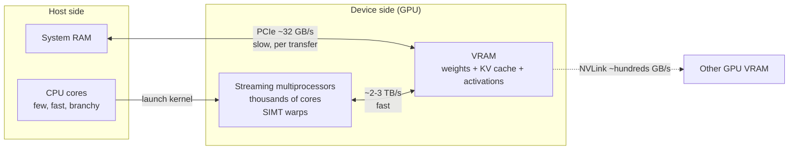

# GPU Fundamentals and CUDA

> **Interview answer (say this first).** A GPU is a throughput machine. It has thousands of small cores that run the same instruction across many data elements at once, and it has very high memory bandwidth so it can feed those cores. That maps perfectly onto the matrix multiplications that dominate a neural network. **CUDA** is NVIDIA's programming model for it: you write a kernel that runs on many threads grouped into blocks, and the runtime schedules them across the streaming multiprocessors. The catch is that the GPU's memory is separate from the CPU's, so data crosses PCIe or NVLink with real cost. For LLM inference, generation is usually **memory-bandwidth-bound**, not compute-bound, which is why a GPU can show high memory use and low compute utilization at the same time.

## Why this exists

A neural network is mostly matrix multiplication. Multiply a weight matrix by an input vector, then by another, millions of times. On a CPU you schedule a handful of powerful cores that each execute instructions in sequence. For a large matrix, each element of the output is a small independent multiply-and-add, so the CPU spends most of its time waiting and shuffling rather than computing.

A GPU inverts the design. Instead of a few fast cores, it uses thousands of simple ones and gives them instructions that apply to many elements at once. The same multiply that a CPU does one element at a time, a GPU does for 128 or 256 elements in the same clock. The result is enormous throughput on the exact operation deep learning needs.

Two hardware facts drive every serving decision:

1. **Massive parallelism.** Thousands of arithmetic units, so large matrix work is limited by memory, not by arithmetic.
2. **Separate memory.** GPU memory (VRAM) is fast but small, and getting data there from the CPU costs a transfer over a comparatively slow bus.

Together they explain a counterintuitive observation: a GPU running an LLM can be almost fully "busy" on memory while its compute units sit mostly idle. If you do not understand that, you will misread `nvidia-smi` and try to fix the wrong thing.

## Start from zero

| Word | Plain meaning |
| --- | --- |
| **GPU** | A processor with thousands of small cores built for parallel arithmetic. |
| **CPU** | A processor with a few powerful cores built for sequential and branchy work. |
| **VRAM** | Video RAM — the GPU's own memory, separate from the system's main memory. |
| **Host** | The CPU side of the system, including system RAM. |
| **Device** | The GPU side. "Device memory" means VRAM. |
| **Kernel** | A function that runs on the GPU across many threads at once. |
| **Thread** | One lane of GPU execution; thousands run the same kernel. |
| **Block** | A group of threads that share fast on-chip memory and can synchronise. |
| **Grid** | The collection of blocks launched by one kernel. |
| **Warp** | 32 threads that execute together in lockstep on NVIDIA hardware. |
| **SIMT** | Single Instruction, Multiple Threads — one instruction applied across a warp. |
| **Streaming multiprocessor (SM)** | The GPU's core building block; it runs warps and holds shared memory. |
| **CUDA** | NVIDIA's parallel programming model and toolkit for its GPUs. |
| **Tensor core** | Specialised hardware that does small matrix multiplies very fast. |
| **PCIe** | The bus connecting host and device. Gen4 x16 moves roughly 32 GB/s each way. |
| **NVLink** | A much faster GPU-to-GPU interconnect, hundreds of GB/s, used for multi-GPU. |
| **Memory bandwidth** | How fast data can be read from VRAM, in GB/s. |
| **FLOPS** | Floating-point operations per second, a compute-rate measure. |
| **Compute-bound** | Limited by arithmetic throughput; the units are the bottleneck. |
| **Memory-bound** | Limited by how fast data arrives; bandwidth is the bottleneck. |
| **Arithmetic intensity** | FLOPs performed per byte read. High means compute-bound, low means memory-bound. |
| **Ridge point** | The arithmetic intensity where a machine flips from memory-bound to compute-bound. |
| **FP32 / FP16 / BF16 / FP8** | Number formats of 4, 2, 2, and 1 byte, trading range and precision. |
| **Utilization** | How much of a resource (compute or memory) is actually in use. |
| **Occupancy** | How many warps are resident on an SM, which helps hide memory latency. |

Two contrasts to hold onto:

- **CPU versus GPU.** CPU: few fast cores, big cache, good at branches, low throughput per dollar on matrix math. GPU: many small cores, small cache per core, good at dense parallel math, high throughput per dollar.
- **Compute-bound versus memory-bound.** Prefill is usually compute-bound; single-request decode is memory-bound. They need different optimizations, which is why batching helps decode so much.

## The core idea

Picture a warehouse. The **CPU** is a few skilled workers who can each do complicated jobs and change plans mid-task. The **GPU** is a thousand workers who each do one simple thing very fast, but only if you line up identical tasks for all of them.

The warehouse **shelves** are VRAM. The **loading dock** is PCIe or NVLink, and trucks are slow compared with how fast the workers move. So the goal is: get the data in once, keep it on the shelves, and give the workers a huge pile of identical tasks so they never stand idle.



The bandwidth difference is the whole story. Accessing VRAM is roughly a hundred times faster than pulling data across PCIe. That is why you move a model to the GPU once and keep it there, and why a "GPU is only 20% utilized" report often means the model is waiting on memory, not on arithmetic.

Here is the comparison that matters in every architecture interview:

| Property | CPU | GPU |
| --- | --- | --- |
| Cores | 4–64 powerful, out-of-order | Thousands of simple, in-order |
| Best at | Branching, latency, sequential logic | Dense parallel arithmetic |
| Memory | System DRAM, large, ~50–100 GB/s | VRAM, smaller, ~300 GB/s to ~3 TB/s |
| Cache | Large per core | Small, shared per SM |
| Model parallelism | Few tasks at once | Thousands of lanes at once |
| Typical LLM use | Tokenization, orchestration, small models | Training and high-throughput inference |
| Failure mode | Too slow for large matmuls | Idle cores while waiting on memory |

The second core idea is where the time actually goes. The time to move data is `bytes / bandwidth`. The time to compute is `FLOPs / peak_flops`. Whichever is larger dominates.

```text
weights_bytes     = parameters x bytes_per_parameter
weights per token = the whole model is read once per decode step  (batch 1)
tokens/s ceiling  = memory_bandwidth / weights_bytes
```

That last line is the single most useful approximation in serving. It explains why quantization speeds up generation: fewer bytes per parameter means more tokens per second, even if the arithmetic is unchanged. We verify it numerically later in this chapter.

## How it works

1. **The host prepares data.** The CPU tokenizes the prompt, builds tensors, and copies them into VRAM over PCIe. This transfer is the first cost.
2. **The host launches a kernel.** A CUDA kernel specifies how many threads to run and how they are grouped. The launch itself is cheap; the work is not.
3. **The GPU schedules warps onto SMs.** Threads are bundled into warps of 32, and warps are assigned to streaming multiprocessors. Many warps per SM hide memory latency by switching.
4. **Threads execute in SIMT.** All threads in a warp run the same instruction on different data. If they diverge — take different branches — the paths run one after another, which wastes lanes.
5. **Tensor cores do the heavy math.** Matrix multiplies are dispatched to tensor cores, which perform small fused matrix operations far faster than ordinary cores.
6. **Memory is read in a hierarchy.** Registers are fastest, then shared memory per SM, then L2 cache, then VRAM. Good kernels reuse data from the faster tiers.
7. **Results go back to VRAM.** Intermediate activations and the KV cache live in VRAM during the forward pass.
8. **The host reads out the answer.** Generated token ids are copied back over PCIe, which is small and cheap compared with the model weights.
9. **Ownership and freeing are explicit.** PyTorch caches allocations, so VRAM can look full even after tensors are deleted. The cache is reused, not leaked.
10. **Utilization is measured, not assumed.** A near-full VRAM bar tells you about memory, not about whether the compute units are busy.

For LLM inference, steps 3 and 6 are where the bottleneck lives. Decode reads the entire model's weights from VRAM for every single token, so it is dominated by step 6 bandwidth. Prefill does large matmuls where the arithmetic can be reused across many tokens, so it is closer to step 5 and can be compute-bound.

> **Note:**
>
> **Why decode is memory-bound, in one line.** Arithmetic intensity is FLOPs divided by bytes. A dense matrix-times-vector reads every weight once and does about two FLOPs per weight, so intensity is near **1 FLOP/byte**. A modern GPU's ridge point is well over **100 FLOP/byte**. Decode sits far to the left of the ridge, so it is memory-bound by a wide margin. Prefill multiplies a weight matrix by many token vectors at once, reusing each weight many times, so its intensity rises with the batch and it can cross into compute-bound territory.

## The syntax you will use

**Check what hardware you have.** The device name, capability, and memory are the first facts to confirm.

```python
import torch

print(torch.cuda.is_available())
print(torch.cuda.get_device_name(0))          # illustrative: "NVIDIA A100-SXM4-80GB"
props = torch.cuda.get_device_properties(0)
print(props.total_memory / 1024**3, "GiB")    # illustrative: 79.3
print(props.major, props.minor)               # compute capability, e.g. 8.0 for A100
```

Compute capability decides which kernels and precisions are available, such as FP8 on newer chips.

**Move data to the device.** The `.to()` call is where the PCIe transfer happens.

```python
device = "cuda" if torch.cuda.is_available() else "cpu"
tensor = torch.randn(1024, 1024)
tensor = tensor.to(device)          # host -> device over PCIe
# ... compute on GPU ...
back = tensor.to("cpu")             # device -> host
```

Move once and keep it there. Repeated tiny transfers are a classic performance bug.

**Measure elapsed time correctly.** GPU work is asynchronous, so you must synchronise.

```python
import time, torch

start = torch.cuda.Event(enable_timing=True)
end = torch.cuda.Event(enable_timing=True)

start.record()
output = model.generate(**inputs, max_new_tokens=64)
end.record()
torch.cuda.synchronize()             # wait for GPU work to finish
print(start.elapsed_time(end), "ms")
```

Without `synchronize()`, you time the launch, not the work.

**Measure memory.** `memory_allocated` is what tensors hold; `memory_reserved` includes PyTorch's cache.

```python
print(torch.cuda.memory_allocated() / 1024**3, "GiB allocated")
print(torch.cuda.memory_reserved() / 1024**3, "GiB reserved by the caching allocator")
torch.cuda.reset_peak_memory_stats()
# ... run ...
print(torch.cuda.max_memory_allocated() / 1024**3, "GiB peak")
```

Peak, not current, is what determines whether a configuration fits.

**Ask the GPU about itself from the shell.** `nvidia-smi` is the standard tool.

```text
nvidia-smi                          # memory use, utilization, processes
nvidia-smi --query-gpu=memory.used,memory.total,utilization.gpu \
           --format=csv            # scriptable
nvidia-smi -l 1                     # refresh every second while reproducing
watch -n 1 nvidia-smi               # simple live view
```

Low `utilization.gpu` with high memory use usually means memory-bound work, not an idle GPU.

**Pick a precision.** Each format trades range, precision, and bytes.

```python
import torch
for dtype, name, bytes_per in [
    (torch.float32, "FP32", 4),
    (torch.float16, "FP16", 2),
    (torch.bfloat16, "BF16", 2),
]:
    print(name, bytes_per)

model = model.to(torch.bfloat16)     # common default for inference on modern GPUs
```

BF16 keeps FP32's exponent range with fewer mantissa bits, which is usually safer than FP16 for large models.

**Force a deterministic baseline.** Useful when comparing kernels or precisions.

```python
torch.backends.cuda.matmul.allow_tf32 = False    # full FP32 matmuls
torch.backends.cudnn.allow_tf32 = False
torch.manual_seed(0)
```

TF32 is a 19-bit format used internally on Ampere and later; it is fast but changes numerics.

**Estimate a footprint before you launch.** Pure arithmetic, no GPU needed.

```python
def weights_gib(params_billions, bytes_per_param):
    return params_billions * 1e9 * bytes_per_param / 1024**3

print(round(weights_gib(7, 2), 2))    # 13.04 GiB  (7B in fp16)
print(round(weights_gib(70, 2), 2))   # 130.39 GiB (70B in fp16)
print(round(weights_gib(70, 0.5), 2)) # 32.60 GiB  (70B in int4)
```

Do this before the OOM, not after.

## Examples: simple to real

**Example 1 — model weights by precision.** Everything else is a rounding error next to this.

```python
def gib(params_billions, bytes_per):
    return params_billions * 1e9 * bytes_per / 1024**3

for label, p in [("7B", 7), ("13B", 13), ("70B", 70)]:
    row = {b: round(gib(p, v), 1) for b, v in
           [("fp32", 4), ("fp16", 2), ("int8", 1), ("int4", 0.5)]}
    print(label, row)

# 7B  {'fp32': 26.1, 'fp16': 13.0, 'int8': 6.5, 'int4': 3.3}
# 13B {'fp32': 48.4, 'fp16': 24.2, 'int8': 12.1, 'int4': 6.1}
# 70B {'fp32': 260.8, 'fp16': 130.4, 'int8': 65.2, 'int4': 32.6}
```

GiB, not GB: 7B in fp16 is 13.0 GiB but 14.0 GB in decimal. Capacity planning in GiB avoids surprises.

**Example 2 — decode speed is bandwidth divided by model size.** Vendor-published peak bandwidth gives a ceiling, not a promise.

```text
Bandwidths (vendor peak, GB/s): A100 80GB 2039 | H100 SXM 3350 | RTX 4090 1008 | L4 ~300
Model bytes: 7B fp16 = 14 GB | 7B int4 = 3.5 GB | 70B fp16 = 140 GB

tokens/s ceiling = bandwidth / model_bytes          (batch 1, this is an upper bound)

A100: 7B fp16  2039/14   = ~146 tok/s
      7B int4  2039/3.5  = ~583 tok/s
      70B fp16 2039/140  = ~15 tok/s
H100: 7B fp16  3350/14   = ~239 tok/s
L4:   7B fp16  300/14    = ~21 tok/s
```

Real deployments achieve a fraction of these numbers because of kernel overhead, attention, and imperfect overlap. But the ratio is reliable: **quantizing from fp16 to int4 roughly quadruples the memory-bound ceiling**, and a 70B model is about ten times slower per token than a 7B model on the same chip.

**Example 3 — compute-bound versus memory-bound.** Arithmetic intensity decides which limit applies.

```text
Decode, batch 1: reads 14 GB, does ~2 FLOPs per parameter
  intensity ~= 2 / 2 bytes = 1 FLOP/byte

A100 FP16 tensor peak ~312 TFLOPS, bandwidth ~2039 GB/s
  ridge point = 312e12 / 2039e9 ~= 153 FLOP/byte
H100 FP16 tensor peak ~989 TFLOPS, bandwidth ~3350 GB/s
  ridge point = 989e12 / 3350e9 ~= 295 FLOP/byte
```

At intensity 1 the machine is far below the ridge, so it is memory-bound. Prefill processes many tokens per weight, raising intensity toward and past the ridge, so it becomes compute-bound. (Peak figures are vendor-published; treat them as ceilings.)

**Example 4 — the transfer tax.** Moving a model over PCIe is not free.

```text
PCIe Gen4 x16 ~= 32 GB/s each direction (approximate)

7B fp16   14 GB / 32 GB/s = 0.44 s
7B fp32   28 GB / 32 GB/s = 0.88 s
70B fp16 140 GB / 32 GB/s = 4.38 s
7B int4  3.5 GB / 32 GB/s = 0.11 s
```

Loading a 70B model from host memory takes about four seconds of pure transfer, before any computation. During decode, a CPU-offloaded layer pays this cost per token, which is why offloading makes a model run but run slowly.

**Example 5 — a full VRAM budget.** Weights are only one line item.

```text
70B fp16 on 3 x 80 GiB GPUs:
  weights          130.4 GiB
  KV cache         32 seq x 8k tokens x 320 KiB/token = 80 GiB
  activations + framework overhead    ~6 GiB
  TOTAL            ~216 GiB   -> needs 3 x 80 GiB, tight

70B int4 on 2 x 80 GiB GPUs:
  weights           32.6 GiB
  KV cache          80 GiB
  overhead           6 GiB
  TOTAL            ~119 GiB   -> fits in 2 x 80 GiB with room
```

Reducing weights from fp16 to int4 does not just shrink the model; it frees VRAM for more concurrent KV cache, which raises throughput.

**Example 6 — why low utilization is normal.** Decode keeps memory busy and compute mostly waiting.

```text
A 7B fp16 model at batch 1 on an A100:
  achievable ~100 tok/s (illustrative estimate, below the ~146 tok/s ceiling)
  each token reads ~14 GB from VRAM
  VRAM bandwidth used ~= 100 x 14 GB = 1400 GB/s of ~2039 GB/s  -> memory busy
  compute used          ~= 100 x 14 GFLOP = 1.4 TFLOP of 312 TFLOP -> compute ~0.5%
```

A GPU showing low compute utilization while streaming tokens is healthy. The fix for low throughput is batching, which raises arithmetic intensity by reusing each weight across many sequences. That is the bridge to the batching chapter.

**Example 7 — precision choice changes both memory and speed.** Match the format to the hardware.

```text
FP32  4 bytes/param  widest range, most precision, slowest, 2x the memory of fp16
FP16  2 bytes/param  1 sign + 5 exponent + 10 mantissa; narrow dynamic range vs BF16, can overflow on large activations
BF16  2 bytes/param  FP32-like range, less mantissa; the usual modern default
FP8   1 byte/param   available on newer tensor cores; needs scaling; increasingly used
INT8  1 byte/param   integer; strong for weights and KV cache
INT4  0.5 bytes/param more compression, more quality risk
```

FP8 and INT4 require calibration or scaling to keep accuracy; they are not drop-in replacements for the way BF16 mostly is.

## In production

- **Weight memory is the first constraint, not the last.** Add KV cache, activations, and framework overhead before concluding a model fits. Leave headroom; fragmentation and peaks bite.
- **Generation is usually memory-bound.** The practical ceiling is bandwidth divided by model bytes. Quantization helps generation mostly by reading fewer bytes, not by doing less math.
- **Low `utilization.gpu` is often correct.** On single-request decode it can be a few percent. Do not treat it as a bug; treat it as a signal to batch.
- **Batching raises intensity and throughput, at some latency cost.** It is the main lever for decode. Larger batches reuse each loaded weight more times.
- **PCIe transfers are a tax.** Keep weights resident, avoid per-request host round trips, and treat CPU offload as a last resort, not a feature.
- **Precision is a quality trade, not a checkbox.** BF16 is a safe default; FP8 and INT4 need validation. Always compare outputs on your own evaluation set after changing precision.
- **VRAM can look full without leaking.** PyTorch caches freed blocks. Use `torch.cuda.memory_reserved()` and the peak stats before concluding you have a leak.
- **OOM often comes from the spike, not the steady state.** Long prefill activations and a growing KV cache cause peaks. Measure `max_memory_allocated`.
- **Multi-GPU has a communication cost.** Tensor parallelism moves activations across NVLink every layer; the slower the link, the more it hurts. Prefer NVLink over PCIe for sharded models.
- **Thermal and power limits are real.** A sustained workload on a throttled GPU runs below its peak numbers. Benchmarks on a cold card overstate production performance.
- **Vendor peak numbers are ceilings.** Real kernels achieve a fraction, and attention, sampling, and Python overhead all subtract. Capacity-plan with measured throughput on your workload.
- **Agentic-AI relevance.** Agent loops issue many short model calls. Each call pays prefill and scheduling overhead, so utilization stays low. Batching across concurrent agents and caching shared system prompts are the cheapest wins, and they are only visible if you understand the memory-bound decode path.

## Interview questions

### 1. Why are GPUs faster than CPUs for neural networks?

**Answer.** Neural networks are dominated by dense matrix multiplication, where each output element is an independent multiply-and-add. A GPU has thousands of small cores that execute the same instruction across many data elements at once, so it finishes in one clock what a CPU does element by element. GPUs also have very high memory bandwidth, which feeds those cores. A CPU has fewer, more powerful cores tuned for sequential and branchy code, which is the wrong shape for dense linear algebra.

**Follow-up: "Would you run everything on a GPU?"** No. Tokenization, orchestration, small models, and branchy logic are often fine or better on a CPU. GPUs pay off when there is enough parallel arithmetic to keep them busy.

**Trap.** Saying a GPU core is "faster" than a CPU core. Per core it is usually slower. The win is the count of cores and the memory bandwidth, not single-thread speed.

### 2. What is CUDA, and what is the programming model?

**Answer.** CUDA is NVIDIA's parallel programming model and toolkit. You write a kernel that runs across many threads; threads are grouped into blocks, and blocks form a grid. Hardware bundles threads into warps of 32 that execute in lockstep, and schedules warps onto streaming multiprocessors. Threads in a block share fast on-chip memory and can synchronise, while blocks are largely independent. Libraries such as cuBLAS (dense linear algebra) and cuDNN (deep-learning primitives such as convolution and attention), and frameworks such as PyTorch, build on this.

**Follow-up: "What is warp divergence?"** When threads in a warp take different branches, the hardware runs each path separately, so some lanes idle. It is a common performance cliff in branchy kernels.

**Trap.** Thinking you must write CUDA to use a GPU. In practice you use PyTorch, which dispatches to CUDA kernels. Understanding the model helps you reason about performance and pick the right kernel settings.

### 3. What is the difference between host and device memory?

**Answer.** Host memory is system RAM attached to the CPU. Device memory is VRAM attached to the GPU. They are separate address spaces, and data crosses between them over PCIe, roughly 32 GB/s on Gen4 x16, or over NVLink for GPU-to-GPU traffic at hundreds of GB/s. GPU kernels can only directly read device memory, so tensors must be moved there first.

**Follow-up: "Why is the transfer cost important for inference?"** If part of a model lives in host memory, every token must pull those weights across PCIe. A 70B fp16 model is 140 GB, about 4.4 seconds of pure transfer, so offloading makes a model fit but makes generation very slow.

**Trap.** Assuming "the GPU has 80 GB" means you can use 80 GB. Total memory is shared with the display, framework overhead, fragmentation, and other processes.

### 4. What does it mean to be compute-bound versus memory-bound?

**Answer.** Compute-bound means the arithmetic units are the bottleneck: the work has enough data reuse that the machine spends its time multiplying. Memory-bound means data delivery is the bottleneck: the units finish faster than the data arrives. It is decided by arithmetic intensity, FLOPs per byte read, compared with the hardware's ridge point, its peak FLOPs divided by bandwidth.

**Follow-up: "Where does LLM inference sit?"** Prefill is usually compute-bound because many tokens reuse each weight. Batch-one decode is memory-bound because every weight is read once per token for only about two FLOPs. Batching raises decode's intensity and pushes it toward compute-bound.

**Trap.** Assuming a low utilization number means the GPU is idle or misconfigured. Memory-bound work correctly shows high memory use and low compute use.

### 5. How do you budget VRAM for serving a model?

**Answer.** Add four things: weights, which are parameters times bytes per parameter; the KV cache, which is the token count times the per-token cache size times the number of concurrent sequences; temporary activations, which spike during long prefill; and framework overhead such as the CUDA context, cuBLAS workspaces, and allocator fragmentation. Sum them with headroom for peaks, because the failure happens at the maximum, not the average.

**Follow-up: "How do you fit a model that is too big?"** Quantize the weights, quantize the KV cache, use tensor or pipeline parallelism to split across GPUs, cap the sequence length or concurrency, and only as a last resort offload layers to CPU.

**Trap.** Sizing only for weights. A 70B int4 model is 35 GB of weights but can need more than that in KV cache at high concurrency, so it can fail on a GPU that seemed to have room.

### 6. How do FP32, FP16, BF16, and FP8 differ?

**Answer.** They use 4, 2, 2, and 1 byte per number. FP32 has the widest range and precision and is the training baseline. FP16 and BF16 halve memory; BF16 keeps FP32's exponent range with fewer mantissa bits, so it rarely overflows, while FP16 can overflow on large values. FP8 is a newer 1-byte format that needs scaling factors and is used on hardware with FP8 tensor cores. Lower precision saves memory and bandwidth and often speeds up compute on tensor cores.

**Follow-up: "Why is BF16 usually preferred over FP16 for large models?"** Range matters more than mantissa for deep networks. BF16's larger exponent avoids overflow without loss scaling, so it is more robust even though it has fewer significant digits.

**Trap.** Treating precision as free speed. Accuracy can degrade, and FP8 or INT4 requires calibration and validation on your own workload, not just a flag change.

### 7. Why is GPU utilization often low during LLM serving?

**Answer.** Single-request decode is memory-bound, so the GPU spends most of its time reading weights from VRAM and the compute units wait. Utilization also dips during prefill disaggregation (running prefill and decode on separate workers so one does not block the other), sampling, Python orchestration, and queue gaps. Seeing low compute utilization alongside high memory use is normal and expected for decode.

**Follow-up: "How do you raise it?"** Batch requests so each loaded weight serves many sequences, use continuous batching to keep the batch full, quantize to read fewer bytes, and cache shared prefixes. Those raise arithmetic intensity and throughput without changing the model.

**Trap.** Chasing utilization as a goal in itself. What matters is tokens per second and cost per request at acceptable latency. A high utilization number from busy-waiting is not useful work.

### 8. When is CPU inference the right choice over a GPU?

**Answer.** For small models, low request volume, latency-tolerant batch jobs, or environments without GPUs. CPUs are cheaper per hour and easier to run, and a small model on a CPU can meet an SLO that does not justify a GPU. CPU is also right for tokenization, orchestration, and embedding small inputs. For large models or high concurrency, the CPU is simply too slow on the matrix math.

**Follow-up: "What makes CPU inference tolerable?"** Quantized formats designed for CPU, such as GGUF with 4-bit weights, plus memory-bandwidth-aware runtimes. It is still memory-bandwidth-limited, so smaller models help most.

**Trap.** Assuming GPU always beats CPU. For a low-traffic internal tool, a CPU may be cheaper and fast enough, and the operational simplicity is worth more than the raw speed.

## Remember this

- **GPUs win on parallelism and bandwidth, not single-core speed.** Thousands of small cores plus fast VRAM suit dense matrix math.
- **CUDA's model is kernels over threads, blocks, and grids, executed as 32-thread warps on SMs.** Frameworks like PyTorch dispatch to it for you.
- **Host and device memory are separate, and PCIe is slow.** Move data once and keep weights resident; CPU offload costs bandwidth per token.
- **Decode is memory-bound: `tokens/s ~= bandwidth / model_bytes`.** Prefill is more compute-bound. Quantization helps decode by reading fewer bytes.
- **Budget VRAM as weights + KV cache + activations + overhead, headroom included.** 7B fp16 is ~14 GB; 70B fp16 is ~140 GB; int4 divides weights by four.
