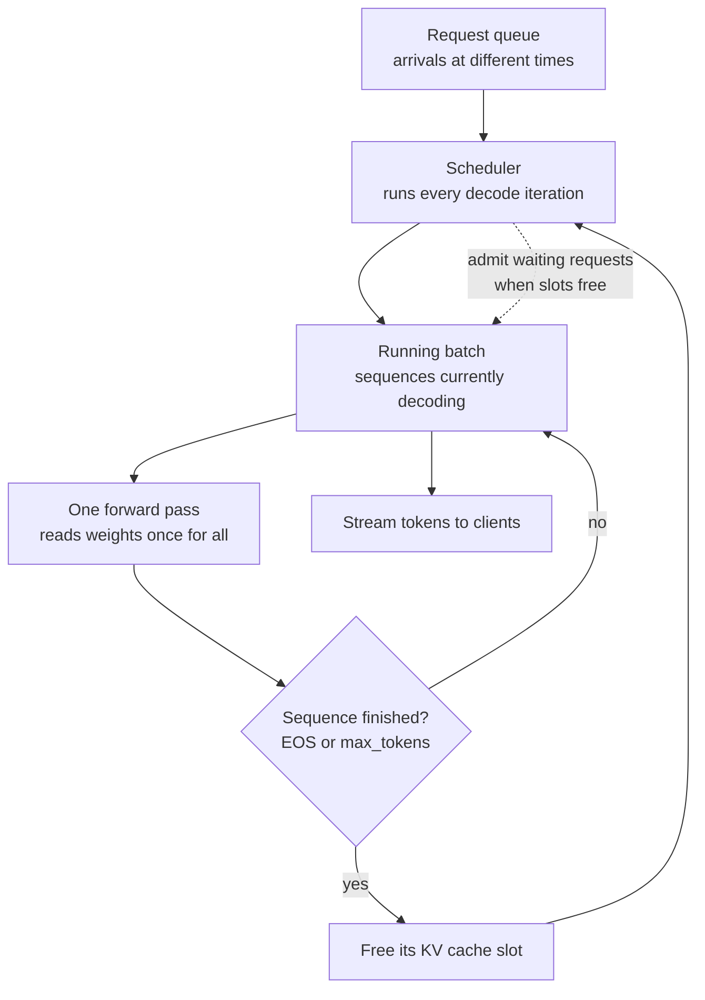
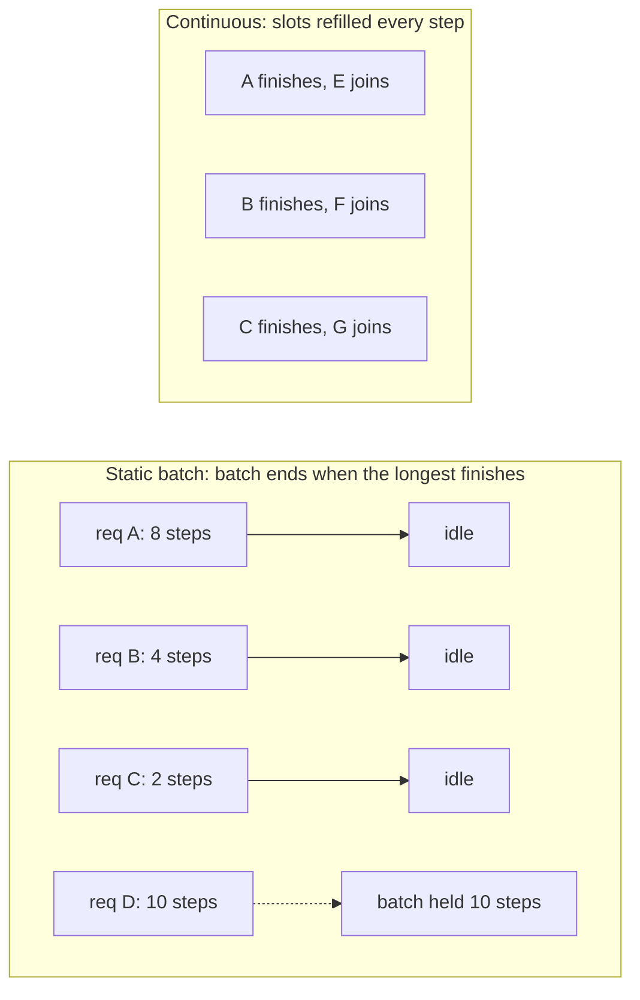

# Inference Batching and the KV Cache

> **Interview answer (say this first).** Generation happens in two phases. **Prefill** processes the whole prompt in one parallel pass and stores keys and values for every token in the **KV cache**. **Decode** then produces one token at a time, reading that cache instead of recomputing the prefix. Batching serves several requests together in one forward pass, which raises GPU utilization and throughput because the expensive part of decode — reading the model weights — is amortized across the batch. The problem with naive static batching is that every sequence is padded to the longest one and the whole batch waits for the slowest member. **Continuous batching** fixes both by scheduling at the level of a single decode iteration: finished sequences leave immediately and waiting requests join mid-flight. That is the single biggest throughput win in modern serving.

## Why this exists

A model generating text does one token per forward pass. For each pass it reads every weight from VRAM. On a 7B fp16 model that is about 14 GB read to produce one token, so the GPU is memory-bandwidth-bound and the arithmetic units mostly wait.

That waste is the opportunity. If one forward pass can serve several sequences at once, the same weight read produces several tokens, and throughput rises sharply with very little extra time. Batching is therefore not an optimization detail; it is the main reason serving is affordable.

But batching has a shape problem. Requests arrive at different times, with different prompt lengths and different output lengths. A naive batch takes the requests it has and runs them together, padded to the longest. The first sequence to finish still occupies a batch slot doing nothing. Meanwhile newly arrived requests wait for the whole batch to complete. Latency suffers and the GPU is underused.

Continuous batching solves this by changing the unit of scheduling from "a batch" to "one iteration". Every step, the scheduler checks which sequences are finished, removes them, and admits waiting requests into the freed slots. The batch stays full, padding waste drops, and short requests do not wait behind long ones.

The KV cache is the other half of the story. It is what makes decode cheap, and it is also what makes batching expensive in memory. Every sequence in a batch carries its own cache, so concurrency is limited by VRAM. Throughput and latency both flow from these two mechanisms.

## Start from zero

| Word | Plain meaning |
| --- | --- |
| **Prefill** | The first pass: the whole prompt is processed in parallel and the KV cache is filled. |
| **Decode** | The generation loop: one token per step, reading the KV cache. |
| **KV cache** | Stored keys and values for tokens already processed, reused instead of recomputed. |
| **Attention** | Each token compares its query with all keys and mixes in the matching values. |
| **Autoregressive** | Generating one token, appending it, and using it to generate the next. |
| **Batch** | A set of sequences processed together in one forward pass. |
| **Batch size** | How many sequences are in the batch. Also used for tokens per forward pass. |
| **Static batching** | Fixed group of requests padded to equal length and run to completion together. |
| **Dynamic batching** | Collect requests for a short time window, then run them as one batch. |
| **Continuous batching** | Iteration-level scheduling: sequences join and leave between decode steps. |
| **Iteration-level batching** | Another name for continuous batching; the batch is rebuilt every step. |
| **Padding** | Filler tokens added so sequences in a static batch have equal length. |
| **Padding waste** | The fraction of computed tokens that are filler and produce nothing useful. |
| **Throughput** | Tokens generated per second across all requests, the efficiency measure. |
| **Latency** | How long one request takes, the user-facing measure. |
| **TTFT** | Time To First Token: prefill plus queueing, what the user feels as "thinking". |
| **TPOT** | Time Per Output Token, the average gap between streamed tokens. |
| **ITL** | Inter-Token Latency; the same idea, usually measured per gap. |
| **Queue time** | Time a request waits before its first forward pass. |
| **Goodput** | Throughput counting only requests that met their latency target. |
| **SLO** | Service Level Objective: the latency or availability target you promise. |
| **Scheduler** | The component deciding which requests run in the next iteration. |
| **PagedAttention** | Storing the cache in fixed-size blocks to reduce fragmentation and waste. |
| **Prefix caching** | Reusing the cached keys and values for a shared prompt prefix. |

Two contrasts to hold onto:

- **Prefill versus decode.** Prefill is parallel and often compute-bound; decode is sequential and memory-bandwidth-bound. Batching helps both, but for different reasons.
- **Throughput versus latency.** Batching raises throughput by keeping the GPU busy, but a bigger batch makes every individual request a little slower. You cannot maximize both at once; you pick a point on the curve.

## The core idea

Picture a bus. A taxi takes one passenger directly and fast, but it burns a full tank of fuel per trip. A bus waits for passengers, then moves many at once for roughly the same fuel. Throughput per liter of fuel is far higher on the bus, but each passenger waits longer to leave.

That is batching. The "fuel" is the GPU reading model weights. Static batching is a bus with fixed seats that will not leave until every seat's passenger has reached their stop — one passenger going far delays everyone. Continuous batching is a bus that drops people off and picks up new ones at every stop, so seats never stay empty.



The timeline is where the difference is obvious. Static batching wastes the whole tail; continuous batching fills it:



The KV cache is the second mental model: a **notepad per sequence**. Every sequence has its own pad, and the pad grows by one entry per token, per layer. The batch size does not change the pad's size per sequence, but it multiplies how many pads exist. That is the direct link between concurrency and VRAM.

```text
KV bytes per token = 2 x n_layers x n_kv_heads x head_dim x bytes_per_number
                     ^
              K and V, one each per layer
```

The `2` is for the separate key and value tensors. Multiply by tokens and by batch size to get the batch's cache. Everything about concurrency follows from that line.

## How it works

1. **A request arrives and is queued.** It carries a prompt and generation parameters. It waits for the scheduler.
2. **Prefill runs.** The prompt tokens are processed in one parallel pass. The linear projections scale linearly with prompt length, but attention is quadratic in prompt length, and the pass fills the KV cache for all prompt tokens.
3. **The first token is emitted.** Prefill time plus queue time is the request's TTFT.
4. **Decode steps begin.** Each step computes one new token using the last token's query against the cached keys and values.
5. **Keys and values are appended.** After each step, the new token's K and V join the sequence's cache.
6. **The batch is a set of sequences.** In a static batch it is fixed. In continuous batching it is rebuilt every iteration.
7. **The scheduler swaps sequences.** Finished sequences leave and free their cache; waiting requests are admitted and prefilled. This is the iteration-level decision that defines continuous batching.
8. **Padding aligns shapes.** In a static batch, all sequences are padded to the longest in the batch. Padding tokens consume compute and cache space but generate nothing.
9. **The loop ends per sequence.** Each sequence stops on an end-of-sequence token or its own `max_tokens`, independently of the others.
10. **Metrics are collected.** TTFT, inter-token latency, throughput, and queue time are recorded separately, because they have different causes.

Steps 6 and 7 are the heart of the chapter. A static batch's cost is `max_length x batch_size`; a continuous batch's cost is closer to `sum(actual_lengths)`, which is why padding waste drops and tail latency improves.

> **Note:**
>
> **Why continuous batching is such a large win.** With static batching, a batch is only as good as its worst member. If one of eight sequences generates four times as many tokens as the others, the GPU keeps working on seven dead slots for three quarters of the batch's life. Continuous batching refills those slots on the very next iteration. The saving is not a constant factor from a better kernel; it comes from not doing wasted work at all. It is also why continuous batching pairs naturally with paged KV cache: sequences must be able to start and stop without pre-allocating a full-length buffer.

## The syntax you will use

**Compute the KV cache size.** Memorise this formula; it recurs in every capacity discussion.

```python
def kv_bytes_per_token(n_layers, n_kv_heads, head_dim, bytes_per=2):
    return 2 * n_layers * n_kv_heads * head_dim * bytes_per

kv_bytes_per_token(32, 8, 128)     # 131072  -> 128 KiB/token, Llama 3 8B GQA
kv_bytes_per_token(80, 8, 128)     # 327680  -> 320 KiB/token, Llama 3 70B
kv_bytes_per_token(32, 32, 128)    # 524288  -> 512 KiB/token, Llama 2 7B MHA
```

`2` is K and V, `bytes_per=2` is fp16. Use the **KV head** count, not the query head count.

**Scale to a whole batch.** Concurrency multiplies the cache directly.

```python
def gib(n): return n / 1024**3

per_token = kv_bytes_per_token(32, 8, 128)     # 8B GQA
for batch, ctx in [(1, 8192), (8, 8192), (32, 8192), (32, 2048)]:
    total = per_token * ctx * batch
    print(f"batch={batch:3d} ctx={ctx:5d}: {gib(total):6.2f} GiB")
# batch=  1 ctx= 8192:   1.00 GiB
# batch=  8 ctx= 8192:   8.00 GiB
# batch= 32 ctx= 8192:  32.00 GiB
# batch= 32 ctx= 2048:   8.00 GiB
```

Cache memory scales linearly with both sequence length and concurrency, so halving the context cap doubles how many sequences fit.

**Measure padding waste.** Compare allocated slots with useful tokens.

```python
def waste(lengths):
    real = sum(lengths)
    slots = max(lengths) * len(lengths)
    return real, slots, round(100 * (slots - real) / slots, 1)

print(waste([10, 20, 30, 40]))   # (100, 160, 37.5)
print(waste([5, 5, 5, 200]))     # (215, 800, 73.1)
print(waste([10, 10, 10, 10]))   # (40, 40, 0.0)
```

Uneven lengths are what make static batching expensive. Identical lengths waste nothing.

**Reason about a decode step's shape.** The cached tensors grow by one entry per step.

```text
# per layer, per sequence:
#   K cache shape (n_kv_heads, cached_tokens, head_dim)
#   V cache shape (n_kv_heads, cached_tokens, head_dim)
# each decode step appends 1 to the cached_tokens dimension
# batched serving stacks sequences along a batch dimension
```

**Configure a serving engine.** The knobs expose the throughput, latency, and memory trade directly.

```python
# vLLM-style configuration (conceptual; server flags differ)
# gpu_memory_utilization=0.90   # share of GPU for weights + KV cache
# max_model_len=8192            # cap sequence length per request
# max_num_seqs=64               # cap concurrent sequences in the batch
# enable_prefix_caching=True    # reuse shared prompt prefixes
# enable_chunked_prefill=True   # split long prefill so decode is not starved
```

Lower `max_model_len` or higher `max_num_seqs` changes the latency/throughput balance.

**Compute TTFT and TPOT end to end.** These two numbers define the user experience.

```python
prefill_tokens, prefill_rate = 1000, 4000      # tokens, tokens/s (illustrative)
output_tokens, tpot = 200, 0.030               # tokens, seconds/token (illustrative)

ttft = prefill_tokens / prefill_rate           # 0.25 s
total = ttft + output_tokens * tpot            # 0.25 + 6.0 = 6.25 s
per_request_tps = 1 / tpot                     # ~33 tokens/s per stream
```

TTFT and TPOT are reported separately because they are fixed by different phases.

**Observe a live server.** Continuous batching shows up as running and waiting counts.

```text
# illustrative Prometheus-style metric names from serving engines
vllm:num_requests_running      # sequences in the current batch
vllm:num_requests_waiting      # queued requests
vllm:time_to_first_token_seconds
vllm:time_per_output_token_seconds
vllm:gpu_cache_usage_perc      # how much KV cache is in use
```

A growing waiting queue with a full running batch is the signature of a saturated GPU.

## Examples: simple to real

**Example 1 — the cache is why decode is cheap.** Without it, every step recomputes the prefix.

```text
Generate N tokens:
  with a KV cache:    N forward passes
  without a cache:    N forward passes over growing prefixes
                      (1 + 2 + ... + N = N(N+1)/2 token-position computations)

N = 100:   100 vs 5,050      (about 50x more work)
N = 1000:  1,000 vs 500,500  (about 500x more work)
N = 8192:  8,192 vs 33,558,528 (about 4096x more work)
```

The cache trades VRAM for speed. Without it, generation cost grows quadratically in the number of tokens produced.

**Example 2 — cache per token for common models.** The formula in action.

```text
Llama 2 7B  (MHA, 32 layers, 32 KV heads, head_dim 128, fp16): 512 KiB/token
Llama 3 8B  (GQA, 32 layers,  8 KV heads, head_dim 128, fp16): 128 KiB/token
Llama 3 70B (GQA, 80 layers,  8 KV heads, head_dim 128, fp16): 320 KiB/token
MQA example (32 layers, 1 KV head, head_dim 128, fp16):         16 KiB/token
```

Grouped-query attention cuts the cache by the group factor, which is why it is standard in modern open models.

**Example 3 — batching multiplies the cache.** Memory is the limit on concurrency.

| Batch | 2,048 tokens | 8,192 tokens | 32,768 tokens |
| --- | --- | --- | --- |
| 1 | 0.25 GiB | 1.0 GiB | 4.0 GiB |
| 8 | 2.0 GiB | 8.0 GiB | 32.0 GiB |
| 32 | 8.0 GiB | 32.0 GiB | 128.0 GiB |
| 128 | 32.0 GiB | 128.0 GiB | 512.0 GiB |

(8B GQA at 128 KiB/token.) Batch 128 at 8k needs 128 GiB of cache, so it cannot fit on one 80 GB GPU regardless of weights. Concurrency is bounded by VRAM, not by ambition.

**Example 4 — padding waste grows with unevenness.** Static batching pays for the longest member.

```text
lengths [10, 20, 30, 40]  -> 100 useful of 160 slots  = 37.5% waste
lengths [8, 9, 10, 11]    ->  38 useful of  44 slots  = 13.6% waste
lengths [5, 5, 5, 200]    -> 215 useful of 800 slots  = 73.1% waste
lengths [10, 10, 10, 10]  ->  40 useful of  40 slots  =  0.0% waste
```

One long request in a static batch inflates everyone's cost. Real traffic is uneven, so waste of 20–50% is common, and much worse when a single outlier appears.

**Example 5 — continuous batching removes the tail.** A small illustrative batch makes the mechanism concrete.

```text
Four requests with output lengths [8, 4, 2, 10]

Static batching: the batch runs for max(length) = 10 steps with 4 slots
  -> 10 x 4 = 40 slot-steps, of which only 24 produce useful tokens

Continuous batching: slots refill as sequences finish
  -> about 24 slot-steps of real work

Illustrative saving: (40 - 24) / 40 = 40% fewer slot-steps on this toy batch
```

The gain depends on length variance, but the direction is always the same: the more uneven the outputs, the more static batching wastes.

**Example 6 — bigger batch, better throughput, worse per-request latency.** Illustrative timings show the trade.

```text
batch  step time   total tok/s   per-request gap
  1      80 ms        12.5         80 ms
  2      95 ms        21.1         48 ms
  4     120 ms        33.3         30 ms
  8     170 ms        47.1         21 ms
 16     260 ms        61.5         16 ms
```

Total throughput rises steeply at first, then flattens as the GPU saturates. Per-request latency also rises, because each sequence waits its turn within the step. There is a knee where extra batch adds little throughput but real latency. Find it with measurement, not guesswork.

**Example 7 — TTFT and TPOT tell different stories.** Long prompts hurt the first number; long outputs hurt the total.

```text
prompt=  500, output=100: prefill 0.13s + decode 3.00s = 3.13s  (TTFT 0.13s)
prompt= 4000, output=100: prefill 1.00s + decode 3.00s = 4.00s  (TTFT 1.00s)
prompt=16000, output=100: prefill 4.00s + decode 3.00s = 7.00s  (TTFT 4.00s)
```

(Assuming 4,000 prefill tokens/s and 30 ms per output token, both illustrative.) A long prompt makes the user wait before the first word; a long answer extends the total. Optimize the one your users actually feel.

## In production

- **The KV cache is the concurrency limit.** Compute it before choosing batch size, context cap, or GPU count. Weights set the floor; the cache sets the ceiling on how many users fit.
- **Static batching wastes the tail.** The batch runs as long as its slowest member. Any variance in output length is wasted compute, and variance is the norm.
- **Continuous batching is the default choice for LLM serving.** It keeps slots full across iterations, which raises throughput and reduces tail latency at the same time. PagedAttention makes it practical by removing the need to pre-allocate full-length cache.
- **Bigger batch trades latency for throughput.** Find the knee by measurement. Over-batching hurts TTFT and inter-token latency with little throughput gain.
- **Padding waste is real compute.** Track the ratio of useful tokens to computed tokens. Uneven traffic makes it worse, and long prompts amplify it.
- **Chunked prefill prevents head-of-line blocking.** A long prefill can occupy the whole batch and stall every decoding sequence. Splitting it into chunks interleaves prefill with decode.
- **Prefix caching pays for repeated prompts.** Agents reuse a large system prompt and tool schema on every call. Caching that prefix eliminates repeated prefill work, which cuts TTFT and cost.
- **Report TTFT and TPOT separately.** A single "latency" number hides which phase is the problem. Queue time is a third number worth tracking on its own.
- **Memory fragmentation destroys effective capacity.** Variable-length cache allocations fragment VRAM. Paged block allocation is the standard fix, and it is why a well-tuned server fits more sequences than a naive calculation suggests.
- **Watch the waiting queue, not just GPU utilization.** A full running batch with a growing queue means the GPU is the bottleneck and you need more capacity or a smaller model. An empty queue with low throughput means the bottleneck is elsewhere.
- **Long generations hold cache for a long time.** A request that streams 4,000 tokens occupies its cache for the whole duration. Cap `max_tokens` to bound that occupancy.
- **Agentic-AI relevance.** Agents make many short calls that share a long prefix. Without prefix caching and continuous batching, each call pays full prefill and the GPU sits idle between calls. With them, concurrent agent runs share the machine efficiently — and the shared system prompt is billed once, not per call.

## Interview questions

### 1. What is the KV cache and why is it needed?

**Answer.** Each token produces a key and a value at every attention layer. The KV cache stores those for all earlier tokens so they are not recomputed. During decode, the new token's query attends to the cached keys and reads the cached values. Without a cache, generating token `t` would require a full forward pass over the entire prefix, so total work would grow quadratically with the answer length. The cache trades memory for speed and makes each decode step linear in the number of cached tokens.

**Follow-up: "What does it cost?"** Memory proportional to layers, KV heads, head dimension, tokens, and bytes per number, multiplied by the number of concurrent sequences. It competes with weights for VRAM.

**Trap.** Calling the KV cache "the model's memory". It is a per-request scratchpad for attention, discarded when the request ends. It is not training state and not long-term memory.

### 2. Write the KV cache memory formula and explain each term.

**Answer.** `2 x n_layers x n_kv_heads x head_dim x n_tokens x bytes_per_number`. The `2` is the separate key and value tensors. `n_kv_heads` is the number of key/value heads, which equals the query heads for multi-head attention but is smaller for grouped-query and multi-query attention. `head_dim` is the features per head. `bytes_per_number` is 2 for fp16. For Llama 3 8B that is `2 x 32 x 8 x 128 x 2 = 131,072` bytes, or 128 KiB per token.

**Follow-up: "How do you add batch size?"** Multiply the whole expression by the number of concurrent sequences. That is why concurrency and context length trade against each other on a fixed GPU.

**Trap.** Using the query head count for a GQA model. Groups of query heads share KV heads, so using the larger number overestimates the cache by the group factor.

### 3. What is the difference between prefill and decode?

**Answer.** Prefill processes all prompt tokens in one parallel pass, fills the cache, and produces the first token. It is compute-heavy and often compute-bound, and it dominates TTFT. Decode generates one token per step, reading the cache and appending to it. It is memory-bandwidth-bound and dominates inter-token latency.

**Follow-up: "How do they interact in a batch?"** A long prefill can monopolize a batch and stall decoding sequences. Chunked prefill splits it so decode keeps running, which protects inter-token latency for everyone else.

**Trap.** Thinking one optimization fixes both. Prefill likes big matrices and high compute use; decode likes high bandwidth and large batches. Different levers for different phases.

### 4. What is continuous batching and why is it better than static batching?

**Answer.** Continuous, or iteration-level, batching rebuilds the running batch on every decode step. Sequences that finish are removed immediately, and waiting requests are admitted into the freed slots, including prefill if there is room. Static batching fixes the group up front and runs it to completion, padding every sequence to the longest one. Continuous batching avoids both the padding waste and the idle tail, so it delivers higher throughput and lower tail latency.

**Follow-up: "What does it require from the cache?"** Sequences must be able to start and stop without a pre-allocated full-length buffer, so it pairs with paged block allocation. It also needs a scheduler that can make admission decisions every iteration.

**Trap.** Confusing continuous batching with just using a larger batch. A larger static batch does not fix the tail; it can make it worse, because more sequences are held to the slowest one's pace.

### 5. How does batching affect latency and throughput?

**Answer.** Batching raises throughput because one read of the model weights serves many sequences, so the GPU spends less time underused. It also raises per-request latency, because each sequence shares the step's time and waits for admission. The relationship flattens: early increases in batch size add a lot of throughput, later ones add little but cost real latency.

**Follow-up: "How do you choose a batch size?"** From the SLO. Find the largest batch that still meets your TTFT and inter-token targets under peak load. Measure on your traffic, because prompt and output length distributions decide where the knee sits.

**Trap.** Setting a huge `max_num_seqs` and assuming it always fills. VRAM limits slots, and a batch only helps if enough requests are actually waiting.

### 6. What is padding waste and how do you reduce it?

**Answer.** Static batching pads every sequence to the longest in the batch, and padded tokens consume compute and cache space while producing nothing. Waste grows with length variance. Reduce it with continuous batching, which avoids fixed groups; with sequence bucketing by length, which groups similar lengths; and with packed sequences, which concatenate short examples with attention masking.

**Follow-up: "Why not just batch one request at a time?"** No padding waste, but terrible throughput, because each decode step reads all the weights for a single token. Padding waste is usually the smaller cost.

**Trap.** Ignoring padding because it "does not affect correctness". It silently multiplies your GPU bill and can dominate when one long request shares a batch with many short ones.

### 7. Explain TTFT, TPOT, and how they differ from total latency.

**Answer.** TTFT is time to first token: queue time plus prefill, what the user perceives as thinking before output starts. TPOT, also called inter-token latency, is the average gap between subsequent tokens, set by decode speed. Total latency is roughly TTFT plus output tokens times TPOT. They respond to different levers: TTFT to prompt length, queueing, and prefill throughput; TPOT to batch size, memory bandwidth, and model size.

**Follow-up: "Which one matters more?"** It depends on the product. Chat feels best with low TTFT and steady streaming, so TTFT and jitter dominate. Batch summarization cares about total time and cost, so throughput dominates.

**Trap.** Reporting a single average latency. A fast average can hide a slow tail, and a slow TTFT with fast TPOT feels very different from the reverse. Report percentiles.

### 8. How does batching interact with the KV cache?

**Answer.** Each sequence in the batch keeps its own KV cache, so batch memory is per-sequence cache times the number of sequences. That makes VRAM the hard limit on batch size: at 128 KiB per token, 32 sequences at 8k tokens need 32 GiB just for cache. Continuous batching also needs cache allocations to be dynamic, since sequences join and leave mid-flight; paged block allocation is what makes that efficient.

**Follow-up: "How do you raise concurrency without more GPUs?"** Shorten the context cap, quantize the KV cache to int8 or int4, use a model with fewer KV heads such as GQA, and enable prefix caching so shared prefixes are stored once.

**Trap.** Sizing the batch from model weights alone. On long-context workloads the cache, not the weights, is what runs out first.

## Remember this

- **Prefill fills the KV cache; decode reads it.** Prefill sets TTFT, decode sets inter-token latency.
- **KV memory:** `2 x layers x KV heads x head_dim x tokens x bytes`, times batch size. Llama 3 8B is 128 KiB per token.
- **Batching raises throughput by amortizing the weight read, and raises latency by sharing the step.** Pick the batch from the SLO.
- **Static batching wastes the tail and pads to the longest sequence.** Continuous, iteration-level batching refills slots every step and is the big win.
- **Concurrency is limited by KV cache memory, not by model weights.** Shorter context caps, quantized caches, and prefix caching are the levers.
