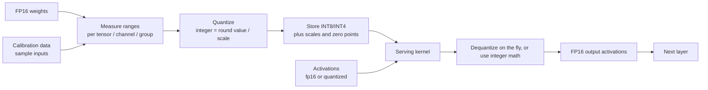

# Quantization for Serving

> **Interview answer (say this first).** Quantization stores model numbers in fewer bits, usually by mapping a floating-point range onto a small integer range with a **scale** and sometimes a **zero point**. The main benefit for serving is not faster arithmetic; it is **less memory and less memory bandwidth**. Generation is memory-bandwidth-bound, so reading int8 or int4 weights instead of fp16 weights raises tokens per second roughly in proportion. INT8 is usually close to lossless; INT4 saves more memory but needs group-wise scales and careful validation. You can quantize weights, activations, or the KV cache, and each has a different accuracy cost. The decision is a trade between VRAM, throughput, and quality, and for some workloads quantization is not worth the complexity.

## Why this exists

Serving an LLM is limited by two numbers: how much VRAM the model needs, and how fast the GPU can read it. Both scale with the number of bytes per parameter.

A 70B model in fp16 is 140 GB of weights. That does not fit on one 80 GB GPU, so you either buy multiple GPUs or shrink the weights. A 7B model fits, but every generated token still reads 14 GB, which caps generation at roughly bandwidth divided by 14 GB. Quantizing to int4 cuts those numbers by four.

The critical intuition is that **generation is memory-bound, not compute-bound**. At batch one, each weight is read once and used for about two floating-point operations. The GPU finishes the math long before the next byte arrives. So reducing the bytes read is a near-direct speedup, even though the arithmetic itself does not get faster and may even get slightly slower per operation.

Quantization also frees VRAM for the KV cache, which directly raises how many concurrent requests fit. A model that ran at low concurrency in fp16 may serve several times more sequences at int4, because the memory saved on weights becomes cache slots.

The cost is accuracy. Mapping a continuous range onto a small set of integers loses information. With good scales the loss is small, especially for int8. With aggressive int4 and bad scale choices it is visible, and it often shows up first as degraded tool calling or formatting rather than obviously wrong prose.

## Start from zero

| Word | Plain meaning |
| --- | --- |
| **Quantization** | Representing numbers with fewer bits than the original format. |
| **Dequantization** | Converting a stored integer back to an approximate float for computation. |
| **Scale** | The multiplier that maps integers to the original floating-point range. |
| **Zero point** | The integer that represents the value zero, needed for asymmetric ranges. |
| **Symmetric** | The quantized range is centered on zero, so no zero point is needed. |
| **Asymmetric** | The range can be any interval, so a zero point is stored. |
| **Per-tensor** | One scale for the whole tensor. Simplest and least accurate. |
| **Per-channel** | One scale per output channel or row. Much better, still cheap. |
| **Per-group** | One scale per small block, often 64 or 128 weights. Standard for int4. |
| **Calibration** | Running sample data through the model to measure value ranges. |
| **Weights-only quantization** | Only the weights are compressed; activations stay in fp16. |
| **Weight + activation quantization** | Both are compressed, enabling integer math end to end. |
| **KV cache quantization** | Storing cached keys and values at lower precision to save memory. |
| **W8A8 / W4A16** | Naming for weight and activation bit widths, e.g. 4-bit weights, 16-bit activations. |
| **Mixed precision** | Using different precisions for different parts of the model or layers. |
| **Rounding** | Choosing the nearest representable integer; the source of most error. |
| **Clipping** | Limiting values to a range, trading outliers for better resolution elsewhere. |
| **Outlier** | A value far outside the typical range, which distorts a shared scale. |
| **GPTQ** | A post-training weight-quantization method using calibration data. |
| **AWQ** | Activation-aware weight quantization that protects important channels. |
| **GGUF** | A file format and runtime family for quantized models, common on CPUs. |
| **Bitsandbytes** | A library offering 8-bit and 4-bit loading with minimal code changes. |
| **Group size** | How many weights share one scale; smaller groups cost metadata but quantize better. |
| **Quantization error** | The difference between the dequantized value and the original. |

Two contrasts to hold onto:

- **Memory saved versus compute saved.** Weight quantization always saves memory and bandwidth. It only speeds up compute if the hardware has integer or narrow-float tensor cores, and even then the gain may be small if the workload is memory-bound.
- **Weights versus activations.** Quantizing weights is easy and nearly free in quality. Quantizing activations is harder because activations contain outliers, and int4 activations usually hurt noticeably.

## The core idea

Picture photographing a scene with a limited number of grey levels. If you use 256 levels spread across the whole brightness range, dark details become blocks. If you measure the actual range in each small region of the image and scale locally, you keep far more usable detail with the same 256 levels. That local scaling is exactly per-channel or per-group quantization.

The second mental model is a **conversion rate**. The scale is the exchange rate between floats and integers: `integer = round(float / scale)`, and `float ~= integer * scale`. A bad rate loses precision where values are small; a good one adapts to the range actually present.



And the memory impact is simple arithmetic, which is why it is the first thing to present in an interview:

```text
model bytes = parameters x bits_per_parameter / 8

7B  at 16 bits = 7e9 x 2 = 14.0 GB
7B  at  8 bits = 7e9 x 1 =  7.0 GB
7B  at  4 bits = 7e9 x 0.5 = 3.5 GB
70B at 16 bits = 140 GB
70B at  4 bits =  35 GB
```

The third model is the one people miss: quantization changes the **shape of the problem**. A model that needed three GPUs may fit on one. That is not just a cost saving; it removes a whole class of distributed-systems complexity.

| Scheme | Range | Needs zero point | Typical use | Accuracy |
| --- | --- | --- | --- | --- |
| Symmetric int8, per-tensor | `[-a, a]` | No | Simple weight quantization | Good |
| Symmetric int8, per-channel | `[-a, a]` per row | No | Standard weight quantization | Very good |
| Asymmetric uint8, per-channel | `[min, max]` | Yes | Activations, some weights | Very good |
| Symmetric int4, per-group (64/128) | `[-a, a]` per group | No | Weight-only int4 | Good with calibration |
| Asymmetric int4, per-group | `[min, max]` per group | Yes | Aggressive weight quantization | Variable |
| FP8 (E4M3/E5M2) | Floating range | No | Newer GPUs, weights and activations | Very good |

Symmetric means the range is centered on zero, so no zero point is stored. Asymmetric can use the full integer range for any interval but must store and apply a zero point. FP8 (E4M3/E5M2) is a 1-byte float in two layouts: E4M3 uses 4 exponent and 3 mantissa bits (more precision), and E5M2 uses 5 exponent and 2 mantissa bits (more range).

## How it works

1. **Choose what to quantize.** Weights first, because they are large and stable. Activations only if the hardware and accuracy budget allow. KV cache separately if memory is tight.
2. **Collect ranges.** For weights, use the actual tensor values. For activations, run calibration data through the model and record the ranges that occur.
3. **Pick the granularity.** Per-tensor is simplest; per-channel is the usual weight baseline; per-group is standard for int4 because it isolates outliers.
4. **Compute scales.** For symmetric signed quantization: `scale = max_abs / (2^(bits-1) - 1)`. For asymmetric: `scale = (max - min) / (2^bits - 1)` and `zero_point = round(-min / scale)`.
5. **Quantize.** `q = clamp(round(value / scale) + zero_point, qmin, qmax)`. Rounding is where the irreversible loss happens.
6. **Store the metadata.** Scales and zero points are stored alongside the integers. Group-wise int4 adds a little overhead per group.
7. **Serve.** Kernels either dequantize to fp16 before the matmul, or use integer tensor-core paths. Weight-only int4 dequantizes on the fly inside the kernel.
8. **Validate.** Compare outputs against the fp16 baseline on your own tasks, not just perplexity (how well the model predicts held-out text — a standard but blunt accuracy metric). Watch for degraded instruction following and formatting.
9. **Tune if needed.** Keep sensitive layers in higher precision, shrink the group size, or move from int4 back to int8.
10. **Re-measure VRAM and throughput.** Quantization changes the memory budget, so the optimal batch size and context cap change too.

Steps 4 and 5 are the whole mechanism; steps 8 and 9 are where production actually succeeds or fails.

> **Note:**
>
> **Why int4 usually needs groups.** Weights contain outliers: a few values are much larger than the rest. With one scale per tensor, that outlier stretches the range and every small value gets a coarse step. Per-group scales give each small block of 64 or 128 weights its own range, so outliers only damage their own group. That is why essentially all good int4 weight quantization is group-wise, and why int4 at group size 128 is the usual default.

## The syntax you will use

**Compute a memory footprint.** Pure arithmetic, and the most reusable line in the chapter.

```python
def model_gb(params, bits):
    return params * bits / 8 / 1e9

print(round(model_gb(7e9, 16), 1))    # 14.0 GB
print(round(model_gb(7e9, 8), 1))     # 7.0 GB
print(round(model_gb(7e9, 4), 1))     # 3.5 GB
print(round(model_gb(70e9, 4), 1))    # 35.0 GB
```

Bits are exact; the difference between GB and GiB is what makes the same model look 7% larger.

**Symmetric int8 quantization.** `qmax = 127` for signed 8-bit.

```python
def symmetric_scale(max_abs, bits=8):
    qmax = 2 ** (bits - 1) - 1
    return max_abs / qmax

def quantize_symmetric(values, scale):
    return [round(v / scale) for v in values]

def dequantize_symmetric(qvalues, scale):
    return [q * scale for q in qvalues]
```

The `2^(bits-1) - 1` accounts for the sign bit: `[0, 127]` plus negatives.

**Asymmetric uint8 quantization.** `qmax = 255` and a zero point.

```python
def asymmetric_params(values, bits=8):
    qmin, qmax = 0, 2**bits - 1
    lo, hi = min(values), max(values)
    scale = (hi - lo) / qmax
    zero_point = round(-lo / scale)
    return scale, zero_point, qmin, qmax

def quantize_asymmetric(values, scale, zero_point, qmin=0, qmax=255):
    return [min(qmax, max(qmin, round(v / scale) + zero_point)) for v in values]

def dequantize_asymmetric(qvalues, scale, zero_point):
    return [(q - zero_point) * scale for q in qvalues]
```

Asymmetric fits a narrow, one-sided range such as a ReLU output much better than symmetric.

**Group-wise int4 scales.** The group size controls the metadata overhead.

```python
# Defaults model asymmetric int4: a per-group scale *and* a zero point.
# Symmetric int4 stores no zero point; pass zero_bits=0 for that case.
def effective_bits(weight_bits=4, scale_bits=16, zero_bits=16, group_size=64):
    metadata = (scale_bits + zero_bits) / group_size
    return weight_bits + metadata

print(effective_bits())                             # 4.50 bits/weight, asymmetric, group 64
print(effective_bits(zero_bits=0))                  # 4.25 bits/weight, symmetric, group 64
print(effective_bits(zero_bits=0, group_size=128))  # 4.13 bits/weight, symmetric, group 128
print(round(7e9 * 4.5 / 8 / 1e9, 2))                # 3.94 GB for a 7B model
```

A smaller group quantizes better but stores more scale values. The defaults above model asymmetric int4 (scale plus zero point); symmetric int4 omits the zero point and needs only about 4.25 bits per weight at group size 64.

**Load a quantized model with minimal code changes.** Illustrative library form.

```python
from transformers import AutoModelForCausalLM, BitsAndBytesConfig
import torch

bnb = BitsAndBytesConfig(
    load_in_4bit=True,
    bnb_4bit_quant_type="nf4",
    bnb_4bit_compute_dtype=torch.bfloat16,
)
model = AutoModelForCausalLM.from_pretrained(model_id, quantization_config=bnb, device_map="auto")
```

`load_in_8bit=True` is the simpler, safer option when quality is the priority.

**Estimate the generation speedup.** Fewer bytes read per token.

```python
bandwidth = 2039  # GB/s, A100 80GB vendor peak (illustrative ceiling)
for name, size_gb in [("fp16", 14.0), ("int8", 7.0), ("int4", 3.5)]:
    print(name, round(bandwidth / size_gb), "tok/s ceiling")
# fp16 146 tok/s | int8 291 tok/s | int4 583 tok/s
```

These are ceilings, not promises. Real throughput is lower and depends on kernels and batch size.

**Quantize the KV cache to raise concurrency.** The same scale idea applies to cached keys and values.

```text
70B GQA cache per token:  fp16 = 320 KiB
                          int8 = 160 KiB
                          int4 =  80 KiB
```

Halving the cache precision doubles how many long sequences fit, often with a small quality cost.

**Keep sensitive layers in higher precision.** Mixed precision protects the parts that matter.

```python
# Illustrative concept, not a real API call:
# quantize most linear layers to int4 but leave the first and last layers
# and the attention output projection in bf16, where outliers concentrate.
```

Many quantization pipelines skip specific modules by name for exactly this reason.

## Examples: simple to real

**Example 1 — footprint of a 7B model at every precision.** The table to memorize.

| Precision | Bits | 7B (GB) | 7B (GiB) | 70B (GB) | 70B (GiB) |
| --- | --- | --- | --- | --- | --- |
| FP32 | 32 | 28.0 | 26.1 | 280.0 | 260.8 |
| FP16 / BF16 | 16 | 14.0 | 13.0 | 140.0 | 130.4 |
| INT8 / FP8 | 8 | 7.0 | 6.5 | 70.0 | 65.2 |
| INT4 | 4 | 3.5 | 3.3 | 35.0 | 32.6 |

The whole point in one line: **70B int4 is 35 GB, so it fits on a single 80 GB GPU where fp16 needs two.**

**Example 2 — symmetric int8 step by step.** Small numbers make the mechanism clear.

```text
values   = [-3.2, 1.15, -0.4, 2.0]
max_abs  = 3.2
qmax     = 127
scale    = 3.2 / 127 = 0.025197

q        = [-127, 46, -16, 79]
dequant  = [-3.200, 1.159, -0.403, 1.991]
error    = [0.000, 0.009, 0.003, 0.009]
```

Maximum error is about one scale step, `0.025`. With 127 levels across a 3.2 range, that is expected.

**Example 3 — asymmetric uint8 handles a one-sided range.** The zero point shifts the window.

```text
values      = [-3.2, 1.15, -0.4, 2.0]
scale       = (2.0 - (-3.2)) / 255 = 0.020392
zero_point  = round(3.2 / 0.020392) = 157

q           = [0, 213, 137, 255]
dequant     = [-3.202, 1.142, -0.408, 1.998]
```

The full 256 levels cover the actual range, which helps when values cluster away from zero.

**Example 4 — per-channel beats per-tensor on uneven data.** Two channels with very different magnitudes.

```text
channel A = [0.1, 0.2, 0.15, 0.05]   (small values)
channel B = [10.0, 9.0, 11.0, 9.5]   (large values)

per-tensor int8 total absolute error:  0.175
per-channel int8 total absolute error: 0.076
ratio: 2.3x better with per-channel scales
```

One large channel stretches the shared scale and crushes the small channel. Per-channel scales fix that for almost no cost.

**Example 5 — int4 metadata is not free.** Scales and zero points add overhead.

```text
int4 group-wise, group size 64, fp16 scale and zero point per group:
  effective bits per weight = 4 + (16 + 16) / 64 = 4.5 bits
  7B model = 7e9 x 4.5 / 8 = 3.94 GB   (not 3.5 GB)

group size 128:
  effective bits = 4 + 32 / 128 = 4.25 bits
  7B model = 3.72 GB
```

Group size 64 is more accurate; group size 128 is smaller. Both are far below fp16.

**Example 6 — quantization raises concurrency too.** Saved weight memory becomes KV cache.

```text
70B on 2 x 80 GiB (160 GiB total), 8k context, 32 sequences:

fp16 weights 130.4 GiB + KV 80 GiB  = 210.4 GiB  -> does NOT fit
int8 weights  65.2 GiB + KV 80 GiB  = 145.2 GiB  -> fits tightly
int4 weights  32.6 GiB + KV 80 GiB  = 112.6 GiB  -> fits with room for more sequences
```

Quantization here is not only about speed; it is what makes the deployment shape possible at all.

**Example 7 — the decode speedup follows bandwidth.** Fewer bytes per parameter, more tokens per second.

```text
A100 80GB, vendor peak ~2039 GB/s, 7B model:

fp16 14.0 GB -> ~146 tok/s ceiling
int8  7.0 GB -> ~291 tok/s ceiling
int4  3.5 GB -> ~583 tok/s ceiling
```

Real numbers are lower, but the ratio holds. This is why weight-only int4 speeds up generation even when the math stays in fp16.

## In production

- **Quantize for memory and bandwidth first.** The speedup in generation comes from reading fewer bytes, not from faster arithmetic. Be precise about that when asked.
- **INT8 is close to free in quality; INT4 needs validation.** Eight-bit weights rarely hurt much. Four-bit weights can, especially on reasoning, tool calls, and structured output, so always test on your own tasks.
- **Use per-channel or per-group scales.** Per-tensor int4 is where quality collapses. Groups of 64 or 128 are the standard compromise.
- **Do not forget metadata.** Scales and zero points mean real int4 is about 4.25–4.5 bits per weight, not 4. Size images and VRAM with the overhead included.
- **Quantize the KV cache separately.** Weights and cache have different sensitivities. Cache quantization is a strong lever on concurrency, and it can be tested independently.
- **Quality failures show up as format and tool errors.** Degraded instruction following, broken JSON, or a sudden refusal to call tools are common first symptoms. Build evaluations that catch them, not just perplexity.
- **Calibration data matters.** A quantized model calibrated on general text can behave worse on your domain, especially code or a narrow vocabulary. Calibrate on representative data.
- **Mixed precision is the escape hatch.** Keep attention output projections or the first and last layers in higher precision when you see quality loss.
- **Measure the peak, not the average.** Quantized weights are smaller, but activations during long prefill may not shrink, and the cache still grows. The peak is what OOMs.
- **Quantization is not universally faster.** On some hardware the dequantization overhead can outweigh the bandwidth saving, especially at large batch sizes where the workload is compute-bound. Benchmark at your real batch size.
- **When not to quantize:** when the model already fits with room to spare, when quality is the hard constraint, when your batch is large enough that you are compute-bound, when the hardware lacks good narrow kernels, or when the engineering and validation cost exceeds the savings. For a single small model on one adequate GPU, staying in bf16 is often the right call.
- **Agentic-AI relevance.** Agents depend on reliable structured output and tool calls, which are exactly the behaviors that aggressive quantization damages first. Prefer int8 or bf16 for the model that drives tool use, and reserve int4 for bulk generation where a human or a validator catches mistakes.

## Interview questions

### 1. Why do we quantize models for serving?

**Answer.** To reduce memory and memory bandwidth. Weights shrink in proportion to the bit width, so a 70B fp16 model at 140 GB becomes 70 GB at int8 and 35 GB at int4. Since generation is memory-bandwidth-bound at low batch, reading fewer bytes per parameter raises tokens per second. The saved memory also becomes KV cache, which raises concurrency. It is primarily a memory and bandwidth win, not a compute win.

**Follow-up: "Does it make the math faster?"** Only if the hardware has integer or FP8 tensor cores and the workload is compute-bound. Even then the gain is often modest. The reliable win is the reduced data movement.

**Trap.** Claiming quantization always speeds up inference. At large batch sizes the workload is compute-bound, and dequantization overhead can make it no faster or even slower.

### 2. Explain symmetric versus asymmetric quantization.

**Answer.** Symmetric quantization centers the integer range on zero, so it needs only a scale: `q = round(x / scale)` with `scale = max_abs / (2^(bits-1) - 1)`. Asymmetric quantization fits an arbitrary interval `[min, max]` and stores a zero point: `scale = (max - min) / (2^bits - 1)` and `q = round(x / scale) + zero_point`. Symmetric is simpler and matches weight distributions that are roughly centered. Asymmetric uses the full integer range for one-sided distributions.

**Follow-up: "Which would you use for activations?"** Asymmetric, or a per-channel scheme, because activation distributions after nonlinearities are often one-sided and contain outliers.

**Trap.** Forgetting the zero point at dequantization. You must subtract it: `x ~= (q - zero_point) * scale`. Omitting it shifts the whole tensor.

### 3. Compare per-tensor, per-channel, and per-group scales.

**Answer.** Per-tensor uses one scale for the whole tensor. It is simplest but a single large value stretches the range and coarsens everything else. Per-channel uses one scale per output channel or row, which handles channels with different magnitudes. Per-group uses one scale per small block, often 64 or 128 weights, which isolates outliers. More granularity means better accuracy and slightly more metadata and kernel complexity.

**Follow-up: "Why is per-group standard for int4?"** At four bits there are only 16 levels, so a single outlier across a tensor would destroy resolution everywhere. Small groups contain the damage and keep small values usable.

**Trap.** Assuming per-channel always beats per-tensor in practice. It usually does, but kernel support and memory layout can make it slower, so measure rather than assume.

### 4. What is the difference between quantizing weights, activations, and the KV cache?

**Answer.** Weights are static and well-behaved, so weight quantization is easy and often nearly lossless at 8 bits. Activations are produced at runtime, contain outliers, and change with input, so activation quantization is harder and usually needs calibration or per-channel schemes. The KV cache is written and read continuously during generation and grows with context; quantizing it saves the memory that limits concurrency, and its accuracy cost is separate from weights.

**Follow-up: "Which gives the biggest serving win?"** It depends on the bottleneck. Weight quantization raises decode throughput and lets a larger model fit. KV cache quantization raises concurrency on long-context workloads. Often you want both.

**Trap.** Treating "quantization" as one decision. Weights, activations, and cache are three different choices with three different quality and complexity profiles.

### 5. How much accuracy do you lose, and how do you check?

**Answer.** Int8 weights are usually within noise of fp16 on most tasks. Int4 can be close to lossless with good group-wise methods, but the risk is real and task-dependent. Check with your own evaluation suite on the behaviors you care about, including instruction following, structured output like JSON, and tool calling, not just perplexity. Compare against the fp16 baseline on identical prompts.

**Follow-up: "What if quality drops?"** Increase the precision of sensitive layers, shrink the group size, calibrate on domain data, or fall back to int8. Mixed precision is often enough.

**Trap.** Trusting a single perplexity number. Perplexity can look fine while structured output and tool use have degraded, which is exactly what breaks an agent.

### 6. What is calibration and why is it needed?

**Answer.** Calibration runs a small set of representative inputs through the model and records the ranges of weights and activations, or the statistics needed to choose scales. It matters most for activation quantization and for post-training methods like GPTQ and AWQ, which use calibration to decide how to minimize error. Without representative data, the chosen ranges can be wrong for your domain.

**Follow-up: "How much data is enough?"** Usually a small sample, on the order of a few hundred sequences, is enough for stable estimates. More important is that the data looks like production traffic.

**Trap.** Calibrating on generic English when you serve code or another language. The ranges differ, and quality can drop in ways that only appear on customer inputs.

### 7. Compute the memory of a 70B model in fp16 and int4.

**Answer.** Use `parameters x bits / 8`. FP16 is 16 bits, so `70e9 x 2 = 140 GB` (about 130.4 GiB). Int4 is 4 bits, so `70e9 x 0.5 = 35 GB` (about 32.6 GiB), plus scale metadata, which with group-wise int4 adds roughly 6% and lands near 37 GB (about 34.6 GiB). That is the difference between needing two 80 GB GPUs and fitting on one.

**Follow-up: "Why is 140 GB not exactly 160 GB worth of two GPUs?"** Because real deployments reserve memory for the KV cache, activations, and framework overhead. Two 80 GB cards give 160 GB total, but the usable budget is less, so fp16 is often infeasible without more GPUs or parallelism.

**Trap.** Using decimal GB and GiB interchangeably. The 7% difference is enough to turn a plan that fits into an out-of-memory at startup.

### 8. When is quantization not worth it?

**Answer.** When the model already fits comfortably, when quality is the binding constraint, when the workload is compute-bound at large batch so bandwidth savings do not help, when the hardware lacks good narrow-precision kernels, or when the validation and maintenance cost exceeds the benefit. For a small model on an adequate GPU, bf16 is often simpler and safe. It is also rarely worth aggressive int4 for a model whose job is structured tool calling.

**Follow-up: "How do you decide?"** Start from the binding constraint. If VRAM is short, quantize weights or the cache. If throughput is short and the workload is memory-bound, quantize weights. If quality is short, do not.

**Trap.** Quantizing because it is fashionable. Every quantization step adds a validation burden and a new failure mode; only take it when it moves the constraint you actually have.

## Remember this

- **Quantization saves memory and bandwidth first.** Generation is memory-bound, so `tokens/s ~= bandwidth / model_bytes` and fewer bytes mean more tokens.
- **INT8 is usually safe; INT4 needs groups and validation.** Per-tensor int4 destroys quality; per-group with 64–128 weights is the standard.
- **`model bytes = parameters x bits / 8`.** 7B is 14 GB at fp16 and 3.5 GB at int4; 70B is 140 GB at fp16 and 35 GB at int4.
- **Weights, activations, and the KV cache are separate decisions.** Quantizing the cache raises concurrency; quantizing weights raises throughput and shrinks the footprint.
- **Know when to stop.** If the model fits and quality is the constraint, bf16 is the right answer, especially for tool-calling agents.
