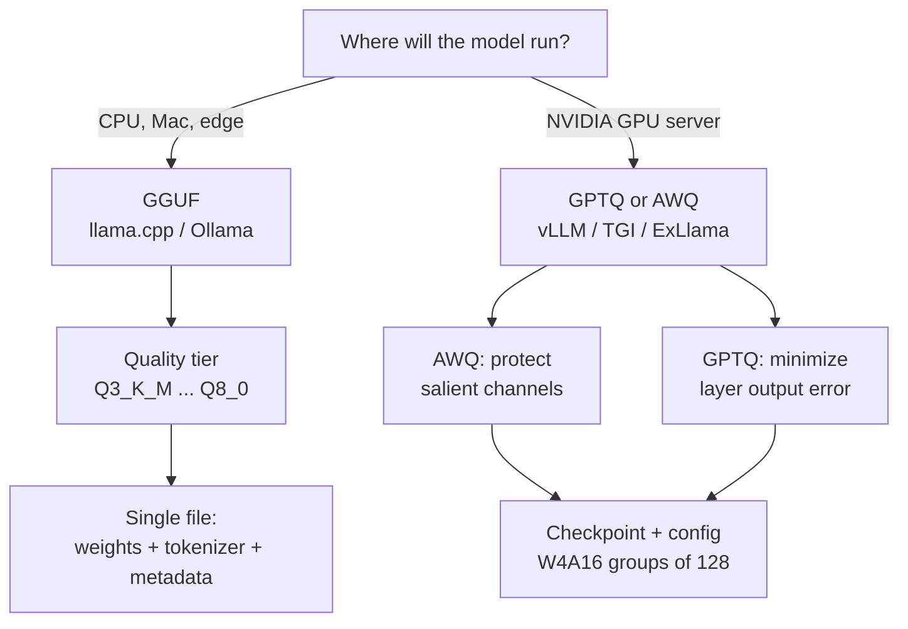

# Quantization Formats: GGUF, GPTQ, AWQ

> **Interview answer (say this first).** GGUF is a **file format** from `llama.cpp` that packs quantized weights, metadata, and tokenizer into one file for CPU, Mac, and edge inference. GPTQ and AWQ are **quantization methods** that produce 4-bit weights for GPU inference. GPTQ minimizes layer-by-layer output error using calibration data and second-order information; AWQ observes activations and protects the weight channels that matter most. They are not interchangeable: the format and the runtime must match your deployment target. "4-bit" is also not one number — the real size depends on the scale and block overhead, so a "4-bit" model is usually 4.1 to 4.5 bits per weight.

## Why this exists

You trained or downloaded a model, and now it has to run somewhere. A 7B model is about 14 GB in FP16 and about 3.5 GB at 4 bits. That gap decides whether the model fits on a laptop, a single 24 GB GPU, or a whole node. Quantization is how you buy that fit.

But "quantize it" is not one decision. There are three separate things people blur together:

- A **file format**: how weights, tokenizer, and metadata are stored on disk. GGUF is one.
- A **quantization method**: the algorithm that chooses the numbers. GPTQ and AWQ are two.
- A **runtime**: the engine that loads and runs it. `llama.cpp`, vLLM, TGI, ExLlamaV2, Ollama.

Pick the wrong combination and the model simply will not load. A GGUF file will not run in a GPTQ loader. An AWQ checkpoint needs kernels that support AWQ. The format is a contract between the model file and the engine.

There is a second, subtler issue. Two models both labelled "4-bit" can differ in size by 20% and in quality by more, because the label hides the overhead: scale values, zero points, group size, and mixed-precision layers. If you plan memory from the label alone, you will under-provision and OOM under load.

That matters for agents more than for chat. An agent may carry a large system prompt, a tool schema, and a long history, so the KV cache can rival the weights. A format that saves 10 GB on weights but forces you to shrink the context window changes what the agent can do, not just how fast it runs. Quantization is a capability decision as much as a cost decision.

> **Note:**
>
> **The one-sentence purpose.** GGUF, GPTQ, and AWQ are three answers to "which compressed model should I ship?" GGUF targets CPU and Apple silicon, while GPTQ and AWQ target NVIDIA GPUs — and the exact bit width is always a bit more than the headline number.

## Start from zero

| Word | Plain meaning |
| --- | --- |
| **Quantization** | Storing weights in fewer bits, usually 8 or 4, instead of 16. |
| **Post-training quantization (PTQ)** | Quantizing a finished model without retraining. GPTQ, AWQ, and the GGUF quantization tiers are PTQ. |
| **Weight-only quantization** | Only weights are stored low-bit; activations stay 16-bit at compute time. GPTQ and AWQ do this. |
| **Calibration data** | A small sample of real inputs used to choose scales. Often 128 to 512 sequences. |
| **Group / block** | A small run of weights that shares one scale. Common sizes are 32, 64, 128. |
| **Scale** | The real-world size of one integer step. Stored as fp16 with each group. |
| **Zero point** | The integer that means real zero, used when the range is not centred. |
| **Quantization error** | The difference between the stored approximate weight and the original. |
| **GGUF** | A single-file model format used by `llama.cpp`. Contains weights, tokenizer, and metadata. |
| **k-quant** | A GGUF family, such as `Q4_K_M`, that uses larger super-blocks and mixed precision. |
| **GPTQ** | A PTQ method that quantizes layer by layer and minimizes output error using second-order information. |
| **AWQ** | Activation-aware Weight Quantization: it protects the weight channels that multiply large activations. |
| **Salient weight** | A weight channel that strongly affects the output, usually because its activations are large. |
| **Checkpoint** | The saved weights plus a config describing how they were quantized. |
| **Runtime / engine** | The program that loads the checkpoint and runs inference, such as vLLM or `llama.cpp`. |
| **Effective bits** | Real bits per weight after scale and group overhead. Always more than the headline number. |
| **W4A16** | 4-bit weights, 16-bit activations. The usual GPU serving scheme. |
| **Mixed precision** | Keeping some layers or tensors at higher precision than others. |

Three contrasts interviewers expect you to keep straight:

- **Format vs method vs runtime.** GGUF is a format. GPTQ and AWQ are methods. vLLM, TGI, and `llama.cpp` are runtimes. A method produces a checkpoint; a runtime consumes it.
- **GPU vs CPU.** GPTQ and AWQ assume GPU kernels. GGUF is designed for CPUs and Apple silicon, and can also run on GPU.
- **Nominal vs effective bits.** "4-bit" is the weight width; group scales add overhead, so plan with effective bits.

One more term worth separating: **PTQ vs QAT**. Post-training quantization (GPTQ, AWQ, GGUF tiers) compresses a finished model with no retraining. Quantization-aware training (QAT) simulates low precision during training so the model adapts. PTQ is what you will meet in serving; QAT appears when 4-bit PTQ is not accurate enough.

## The core idea

Think about shipping a piano. You can put it in a specialized crate built for pianos (GGUF), or you can take it apart and rebuild it with two different engineering methods (GPTQ, AWQ). The crate is about *how it travels and who can unpack it*. The methods are about *how you compress the parts*. A delivery company that only accepts one kind of crate is like a runtime that only loads one format.

The second mental model is the **ruler with scales**. One scale for a whole matrix (per-tensor) is like one ruler for a room that has both a pencil and a door. A scale per row or per small group is like a set of rulers, one for each object. Finer groups mean better accuracy and a little more overhead. GPTQ and AWQ both use groups, usually 128 weights, and differ mainly in *how they choose the numbers*.



How the three compare at a glance:

| | GGUF | GPTQ | AWQ |
| --- | --- | --- | --- |
| **What it is** | File format | Quantization method | Quantization method |
| **Main target** | CPU, Mac, edge | GPU serving | GPU serving |
| **Typical runtime** | `llama.cpp`, Ollama | vLLM, TGI, ExLlamaV2 | vLLM, TGI, FastChat |
| **Bit widths** | 2 to 8, many tiers | usually 4, sometimes 3/8 | usually 4 |
| **Uses calibration data** | For k-quants, optionally | Yes, required | Yes, required |
| **Key idea** | Portable self-contained file | Error-minimizing weight choice | Activation-aware protection |
| **Weights + activations** | Weights low-bit, compute mixed | W4A16 | W4A16 |

> **Note:**
>
> **A method can be stored in more than one container.** GPTQ weights are usually saved as standard safetensors plus a `quantization_config`, but some tooling can also write a GPTQ-quantized model into GGUF. So "GPTQ" describes how the numbers were chosen; the file on disk may still be `.safetensors` or `.gguf`. Read the extension and the config, not just the model-card label.

## How it works

**Part 1 — GGUF.**

1. **Package everything into one file.** GGUF stores the tensors, the tokenizer, the chat template, and metadata like context length in a single container with a versioned header. That portability is why it spread across local tools.
2. **Choose a quantization tier.** `llama.cpp` ships families such as `Q2_K`, `Q3_K_S/M/L`, `Q4_K_S/M`, `Q5_K_M`, `Q6_K`, and `Q8_0`, plus legacy `Q4_0`. Bigger numbers mean more bits and better quality.
3. **Understand the suffix.** `S`, `M`, and `L` mean small, medium, and large *mixing*: how many sensitive tensors are kept at higher precision. `_K` types use larger super-blocks and quantized scales, which is more accurate than `Q4_0` at a similar size.
4. **Store weights in blocks with a scale.** A block of 32 weights shares one fp16 scale in `Q4_0`, so it uses `4 + 16/32 = 4.5` bits per weight.
5. **Let the runtime pick compute precision.** `llama.cpp` dequantizes blocks to run matrix multiplication, and on GPU it can offload layers. CPU inference is memory-bandwidth-bound, so fewer bytes per weight is faster.

**Part 2 — GPTQ.**

6. **Collect calibration inputs.** Run a small set of real text through the model layer by layer and record activations.
7. **Quantize one layer at a time.** For each linear layer, choose 4-bit weights that minimize the difference between the layer's real output and its quantized output, not just the weight error.
8. **Use second-order information.** GPTQ uses an approximate Hessian (from the calibration activations) to decide which weights can absorb the error of others. This is why it beats naive rounding.
9. **Quantize in groups.** Weights are stored in groups of 128 with an fp16 scale, giving about `4 + 16/128 = 4.125` effective bits.
10. **Save as a checkpoint with a config.** The result is standard safetensors plus a `quantization_config`; the runtime reads it and selects the right kernels.

**Part 3 — AWQ.**

11. **Observe activations, not just weights.** AWQ runs calibration data and measures how large the activations are at each input channel.
12. **Find the salient channels.** A weight channel multiplied by large activations contributes more to the output, so errors there hurt more.
13. **Scale those channels up before quantizing.** Multiplying a salient channel by a factor `s > 1` reduces its relative quantization error; the matching activation is divided by `s` at inference, so the maths is unchanged.
14. **Keep the rest simple.** AWQ protects a small fraction of channels and leaves the rest to normal per-group quantization. This tends to preserve general quality, including after instruction tuning.
15. **Serve on GPU.** The checkpoint carries a config that vLLM or TGI reads; AWQ kernels run it as W4A16.

**Part 4 — choosing.**

16. **Match the format to the target.** CPU, Mac, or edge means GGUF. A CUDA GPU server with an OpenAI-compatible stack means GPTQ or AWQ.
17. **Prefer AWQ when quality is the concern, GPTQ when support is the concern.** GPTQ has the widest kernel coverage; AWQ is often a little better on instruction-tuned models. The only honest answer is to measure both on your task.
18. **Plan memory with effective bits, not the label.** Multiply parameters by effective bits, then add the KV cache and activations.

The three approaches share one idea: quantization is a lossy compression, and the job is to put the inevitable error somewhere that barely reaches the output. GPTQ does that by minimizing output error directly. AWQ does it by spending precision where activations are large. GGUF does it by offering a ladder of sizes so you can trade a little more memory for a lot more quality. In all three, the group size and the precision of the scales are the knobs that decide how fine the grid is.

## The syntax you will use

**Quantize to GGUF with `llama.cpp`.** The converter makes an fp16 GGUF, then the quantizer compresses it.

```bash
# convert a Hugging Face model to GGUF
python convert_hf_to_gguf.py ./model --outfile model-f16.gguf --outtype f16

# quantize to a 4-bit k-quant tier
./llama-quantize model-f16.gguf model-Q4_K_M.gguf Q4_K_M
```

`Q4_K_M` is the common quality-per-byte default; `Q8_0` is nearly lossless and much larger.

**Serve GGUF over an OpenAI-compatible API.** `llama.cpp` ships `llama-server`.

```bash
./llama-server -m model-Q4_K_M.gguf --host 0.0.0.0 --port 8080 -c 8192 -ngl 99
```

`-ngl 99` offloads as many layers as possible to the GPU; on CPU it stays at 0.

**Run GGUF through Ollama.** Ollama wraps `llama.cpp` and manages downloads.

```bash
ollama run llama3.1:8b          # pulls a quantized GGUF; tags can pin a tier
```

Ollama handles the GGUF tier, manages the download, and exposes an OpenAI-compatible endpoint.

**Quantize with GPTQ or AWQ using standard tooling.** Library names are real; the calls are illustrative and vary by version.

```python
# GPTQ (auto-gptq / GPTQModel style)
from auto_gptq import AutoGPTQForCausalLM, BaseQuantizeConfig
config = BaseQuantizeConfig(bits=4, group_size=128, desc_act=False)

# AWQ (autoawq style)
from awq import AutoAWQForCausalLM
quant_config = {"zero_point": True, "q_group_size": 128, "w_bit": 4, "version": "GEMM"}
```

`bits=4, group_size=128` is the standard W4A16 recipe for both.

**Serve an AWQ or GPTQ checkpoint in vLLM.** The runtime reads the config from the model directory.

```bash
vllm serve ./model-awq-4bit --quantization awq --max-model-len 8192
vllm serve ./model-gptq-4bit --quantization gptq --max-model-len 8192
```

The `--quantization` flag must match the method that made the checkpoint.

**Inspect what a checkpoint says about itself.** The config records the method and the group size, which is what a runtime needs.

```python
from transformers import AutoConfig
cfg = AutoConfig.from_pretrained("./model-awq-4bit")
cfg.quantization_config
# {'quant_method': 'awq', 'bits': 4, 'group_size': 128, ...} (illustrative shape)
```

If the config is missing or does not match the weights, the runtime will either refuse to load or silently fall back to slower unquantized paths.

**Estimate memory with effective bits.** This is the arithmetic that prevents a surprise OOM.

```python
def model_gb(params_billion, bits_per_weight):
    return params_billion * 1e9 * bits_per_weight / 8 / 1e9

model_gb(7, 16)            # 14.00 GB in FP16
model_gb(7, 4)             #  3.50 GB nominal 4-bit
model_gb(7, 4 + 16/128)    #  3.61 GB GPTQ/AWQ, group 128
model_gb(7, 4 + 16/32)     #  3.94 GB Q4_0, block 32
```

The same model labelled "4-bit" is anything from 3.5 to 4 GB once overhead is counted.

## Examples: simple to real

**Example 1 — memory for a 7B model.** Parameters times bytes per weight, verified arithmetic.

```text
7B weights:  FP16 14.00 GB | INT8 7.00 GB | 4-bit nominal 3.50 GB
             GPTQ/AWQ 4.125-bit 3.61 GB | Q4_0 4.5-bit 3.94 GB
```

Quantization gets a 7B model onto a 24 GB GPU alongside a large cache, and a 4-bit 7B onto many laptops.

**Example 2 — "4-bit" is really 4.1 to 4.5 bits.** Scale overhead per group, verified.

```text
4-bit + group 128, fp16 scale: 4 + 16/128 = 4.125 bits/weight -> 3.61 GB
4-bit + group  64, fp16 scale: 4 + 16/64  = 4.250 bits/weight -> 3.72 GB
Q4_0 block 32,    fp16 scale: 4 + 16/32  = 4.500 bits/weight -> 3.94 GB
Q8_0 block 32,    fp16 scale: 8 + 16/32  = 8.500 bits/weight -> 7.44 GB
```

Smaller groups cost a little memory and buy accuracy. The headline number is the weight width, never the total.

**Example 3 — per-tensor vs per-group error with uneven magnitudes.** An illustrative example: four groups of 32 weights with maximum absolute values `0.05`, `0.5`, `5.0`, and `0.2`, quantized to 4 bits.

```text
per-tensor scale: 0.71428            (set by the 5.0 group)
group scales: [0.00714, 0.07143, 0.71428, 0.02857]

group 0 (max 0.05): per-tensor err 0.05000 | per-group err 0.00320
group 1 (max 0.50): per-tensor err 0.34025 | per-group err 0.03368
group 3 (max 0.20): per-tensor err 0.19999 | per-group err 0.01347
overall max err:    per-tensor 0.34025 | per-group 0.31995
```

The small groups are quantized about 15x more accurately with their own scales. This is why GPTQ and AWQ use groups of 128 rather than one scale per matrix.

**Example 4 — why activation awareness matters.** An illustrative simulation: one weight row `[0.10, 0.22, ..., 0.85]` where channel 0 sees activation 10.0 and the others see 1.0. Output error is the weight error times the activation size.

```text
no scaling:       output error 0.36571
scale channel 0 by 4 (AWQ style): output error 0.24071
channel-0 weight error drops from 0.02143 to 0.00893
```

The same weight error costs ten times more where activations are large, so AWQ spends its precision there.

**Example 5 — GGUF quality tiers, ordered by size and quality.** Approximate effective widths; K-quants mix block sizes.

| Tier | Rough effective bits | Use |
| --- | --- | --- |
| `Q2_K` | ~2.6 | Last resort; quality drops visibly |
| `Q3_K_M` | ~3.9 | Tight memory, acceptable for small models |
| `Q4_K_M` | ~4.5 | The common CPU default |
| `Q5_K_M` | ~5.5 | Better quality, still practical |
| `Q6_K` | ~6.6 | Near-lossless for most tasks |
| `Q8_0` | 8.5 | Reference quality, ~2x the size of Q4 |

Pick the smallest tier that passes your eval; do not assume the default is best for your task.

**Example 6 — choosing by deployment target.**

```text
Laptop / Mac / edge, no GPU:     GGUF  Q4_K_M via llama.cpp or Ollama
Single NVIDIA GPU, max quality:  AWQ or GPTQ 4-bit, groups of 128, via vLLM
Multi-GPU, tensor parallel:      GPTQ or AWQ in vLLM (format must load on every rank)
Latency-critical consumer GPU:   ExLlamaV2 / EXL2 (GPTQ-like, tuned kernels)
Need near-lossless:              FP8/INT8, or Q8_0 just to save some memory
```

## In production

- **Match the checkpoint to the runtime before anything else.** A GGUF file cannot be loaded by a GPTQ loader. Confirm the engine supports the method, the bit width, and the model architecture.
- **Plan with effective bits, not the headline.** Group scales add 3.125% to 12.5% over nominal at group 128 and block 32 (an extra 16 scale bits per 128 or 32 weights). Add the KV cache and activations on top.
- **Calibrate on data that looks like production.** Scales chosen from Wikipedia may be wrong for code, JSON, or tool-call traffic. Calibration quality shows up as quality drift.
- **Keep the first and last layers in higher precision when quality is tight.** They are more sensitive, and some pipelines exclude them from low-bit quantization.
- **Measure on your own evaluation set.** A model can match a benchmark and still regress on your task. Never ship a quantized model on vibes.
- **Sweet spot is 4-bit weights.** Below that, quality degrades quickly on hard reasoning. 3-bit and 2-bit exist but need careful tests.
- **Quantized models are often faster, not just smaller.** Decode is memory-bandwidth-bound, so moving fewer bytes per weight raises tokens per second.
- **Check hardware support.** Some accelerators have fast INT8 and no fast INT4, so a 4-bit model can be slower than 8-bit despite using less memory.
- **AWQ and GPTQ are close; benchmark both.** GPTQ usually has broader kernel support, and AWQ often preserves instruction-following a little better. Differences are model-specific.
- **GGUF tier choice changes quality, not just size.** `Q4_K_M` is a good default, but `Q3` can break structured output and tool calls that `Q5_K_M` keeps.
- **Watch the tokenizer and chat template.** They live inside the GGUF; a mismatched template silently changes the prompt and therefore the answers.
- **KV-cache quantization is separate.** You can combine 4-bit weights with an 8-bit cache. Cache quantization is more sensitive, so test it independently.

## Interview questions

### 1. What is GGUF, and when would you use it?

**Answer.** GGUF is a single-file model format from `llama.cpp`. It stores quantized weights, the tokenizer, metadata, and the chat template in one versioned container. It is designed for CPU, Apple silicon, and edge inference, with families like `Q4_K_M` that trade quality for size. You use it when the target has no NVIDIA GPU or when you want a portable file that one runtime can load directly.

**Follow-up: "Can GGUF run on a GPU?"** Yes. `llama.cpp` can offload layers to CUDA or Metal with `-ngl`, but GGUF's design centre is CPU and Mac inference, not datacentre GPU throughput.

**Trap.** Calling GGUF a quantization method. It is a format; the quality tiers are the quantization, and the format can even hold unquantized fp16 weights.

### 2. What is GPTQ?

**Answer.** GPTQ is a post-training method that quantizes weights layer by layer. It runs calibration data, then chooses 4-bit weights that minimize the difference between the layer's original output and its quantized output. It uses approximate second-order information from the activations to decide how error should be spread. The result is a W4A16 checkpoint, usually with group size 128, served on GPUs.

**Follow-up: "Why is it better than rounding?"** Naive rounding minimizes each weight's error in isolation. GPTQ minimizes the error that reaches the output, and it can trade a little error in one weight to cancel error in another.

**Trap.** Saying GPTQ quantizes activations. It quantizes weights; activations stay at 16 bits. Activation quantization is a different and harder problem.

### 3. What is AWQ, and how does it differ from GPTQ?

**Answer.** AWQ is Activation-aware Weight Quantization. It measures activation magnitudes on calibration data, identifies the weight channels multiplied by large activations, and scales those channels up before quantizing so their relative error shrinks. GPTQ instead performs an error-minimizing reconstruction layer by layer. Both produce 4-bit W4A16 GPU checkpoints; AWQ's bet is that protecting a few salient channels preserves quality.

**Follow-up: "Does scaling change the model?"** No. The weight channel is scaled by `s` and the corresponding activation is divided by `s`, so the product is unchanged. Only the quantization error changes.

**Trap.** Thinking AWQ protects weights with the largest values. It protects weights whose *activations* are largest; those are not always the largest weights.

### 4. Are a format, a method, and a runtime the same thing?

**Answer.** No, and interviewers listen for the distinction. GGUF is a file format. GPTQ and AWQ are quantization methods that produce checkpoints. vLLM, TGI, ExLlamaV2, and `llama.cpp` are runtimes that load and execute checkpoints. A method writes a file; a format describes the file; a runtime reads it.

**Follow-up: "Give a mismatched pair."** A GPTQ checkpoint cannot be loaded by `llama.cpp`, which expects GGUF; and a GGUF file cannot be passed to vLLM's `--quantization gptq`.

**Trap.** Saying "GGUF is a quantization like AWQ". GGUF is a container that can hold several quantization types.

### 5. What does "4-bit" actually mean across these formats?

**Answer.** It means 4 bits for each weight, but not 4 bits total. Scales add overhead: GPTQ and AWQ use a group of 128 with an fp16 scale, giving 4.125 effective bits, while GGUF `Q4_0` uses a 32-block with an fp16 scale, giving 4.5. K-quants mix block sizes and precisions, so `Q4_K_M` sits a little above 4.5. Always plan memory from effective bits.

**Follow-up: "How big is the difference?"** For a 7B model, 3.50 GB nominal versus 3.61 GB for GPTQ/AWQ and 3.94 GB for `Q4_0`. That is about 13% more than the label suggests.

**Trap.** Estimating memory as `params × 4 / 8`. That under-counts scales and is exactly how deployments OOM.

### 6. How do you choose a quantization format for a deployment target?

**Answer.** Start with the hardware. CPU, Mac, or edge means GGUF, usually `Q4_K_M` or `Q5_K_M`. An NVIDIA GPU server means GPTQ or AWQ in vLLM or TGI. Then consider the engine's kernel support and whether you need tensor parallelism. Finally, benchmark the candidates on your own eval set, because quality differences at the same bit width are model- and task-specific.

**Follow-up: "AWQ or GPTQ?"** GPTQ has the widest support; AWQ often holds instruction-following a bit better. There is no universal winner — run both if quality matters.

**Trap.** Choosing by the smallest file. A slightly larger tier that passes your eval is better than a tiny one that fails it.

### 7. What is quantization error, and what controls it?

**Answer.** It is the gap between the stored approximate weight and the original, caused by rounding onto a small integer grid. It is bounded by half a scale step. You control it with finer groups (per-channel or groups of 128 instead of per-tensor), better scale choice from calibration, and methods like GPTQ and AWQ that choose values to minimize output error. The error that matters is weighted by activation magnitude.

**Follow-up: "Why can error in a large group be so bad?"** One scale covers the whole group. If one weight is huge, the step is large and every small weight rounds coarsely — sometimes to zero. Groups and better scale choice fix that.

**Trap.** Assuming error is uniform. It is largest where scales are set by outliers and where activations are large.

### 8. What tooling do you use to produce and serve these formats?

**Answer.** For GGUF: `convert_hf_to_gguf.py` and `llama-quantize` from `llama.cpp`, served by `llama-server`, `ollama`, or LM Studio. For GPTQ: `auto-gptq` or `GPTQModel`. For AWQ: `autoawq` or `llm-compressor`. For serving: vLLM and TGI load AWQ and GPTQ checkpoints with a `--quantization` flag. The tool produces a checkpoint plus a config the runtime reads.

**Follow-up: "What do you check after quantizing?"** That the runtime loads it, that memory matches the effective-bit estimate, and that task-level evals still pass — especially structured output and tool calls.

**Trap.** Assuming the library version does not matter. Quantization formats and kernel support evolve; a checkpoint made by one version may not load in another.

## Remember this

- **GGUF is a format; GPTQ and AWQ are methods; vLLM, TGI, and `llama.cpp` are runtimes.** Keep the three separate.
- **CPU, Mac, and edge point to GGUF. NVIDIA GPU serving points to GPTQ or AWQ.**
- **GPTQ minimizes layer output error with calibration; AWQ protects the channels that see large activations.**
- **Headline bits is not total bits.** Group scales make a "4-bit" model about 4.1 to 4.5 effective bits.
- **Measure on your own evals.** Format and bit-width choices are quality decisions, not just memory decisions.
