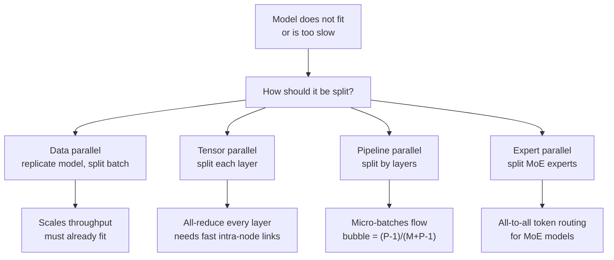
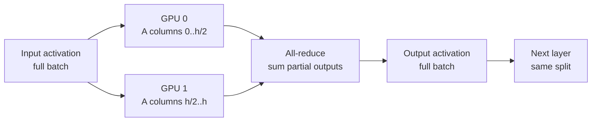

# Model Parallelism

> **Interview answer (say this first).** Model parallelism splits one model across several GPUs when it does not fit on one, or when one GPU is too slow. Data parallelism replicates the whole model and splits the batch. Tensor parallelism splits each layer's weight matrices and combines partial results with an all-reduce per layer, so it needs fast intra-node links such as NVLink. Pipeline parallelism splits the model by layers into stages and streams micro-batches through them, with a startup/drain idle time called the bubble. Expert parallelism splits mixture-of-experts layers. The limit is always communication: tensor parallelism is latency-bound on collectives, and pipeline parallelism is idle-time-bound on the bubble. Large systems combine all three as 3D parallelism.

## Why this exists

Every serving plan starts with a memory question: does the model fit? A 70B model is about 140 GB in FP16. A common 80 GB GPU has only 80 GB, so it does not fit, full stop. Even a model that fits may be too slow, because a single GPU has finite compute and finite memory bandwidth.

There are only two ways out. Use less memory per GPU (quantization, offload) or use more GPUs. Quantization has a floor and a quality cost. At some point you must split the model itself across devices. That is model parallelism.

The catch is that splitting a model creates communication. Each GPU now holds only part of the answer, so the parts must be combined. If the fabric between GPUs is fast, splitting wins. If it is slow, the model spends its time waiting on the network and runs slower than on one GPU. This is why the entire design of parallel strategies is a map of *which split needs how much communication*.

Put numbers on it and the shape of the problem appears. A single transformer layer with a hidden size of 4,096, a 4,096-token batch, and fp16 activations carries about 33.6 MB of activation data. Splitting that layer across eight GPUs and combining the results is roughly 58.7 MB of all-reduce traffic *per layer* on `NVLink`-class bandwidth and far less pleasant on PCIe. Multiply by 32 layers and you are moving gigabytes per forward pass. Communication, not math, becomes the constraint.

> **Note:**
>
> **The one-sentence purpose.** Model parallelism is how you run a model that is too big or too slow for one GPU, and its cost is communication. Tensor parallelism splits inside layers and pays collectives; pipeline parallelism splits between layers and pays idle bubbles.

## Start from zero

| Word | Plain meaning |
| --- | --- |
| **GPU** | A processor with its own memory, used for the matrix maths in a model. |
| **VRAM** | The GPU's memory. Weights, activations, and the KV cache all live here. |
| **Shard** | A piece of the model stored on one GPU. |
| **Parallelism** | Running parts of the work on several devices at the same time. |
| **Data parallelism (DP)** | Copy the whole model to each GPU and split the batch across copies. |
| **Tensor parallelism (TP)** | Split each layer's weight matrices across GPUs. |
| **Pipeline parallelism (PP)** | Split the model's layers into stages across GPUs. |
| **Expert parallelism (EP)** | Split mixture-of-experts layers so each GPU holds some experts. |
| **All-reduce** | A collective where every GPU contributes a value and every GPU receives the combined result. |
| **All-gather** | A collective that collects shards from all GPUs into one full tensor. |
| **All-to-all** | A collective where every GPU sends a different piece to every other GPU. Used by MoE routing. |
| **Collective** | A communication operation that involves several GPUs at once. |
| **Ring all-reduce** | An all-reduce implemented as a ring of send/receive steps, volume `2(N-1)/N` times the tensor. |
| **Micro-batch** | A small slice of the batch used to keep pipeline stages busy. |
| **Pipeline bubble** | Idle time at the start and end while the pipeline fills and drains. |
| **Stage** | One group of contiguous layers assigned to a GPU in pipeline parallelism. |
| **Intra-node fabric** | The fast links inside one machine, such as NVLink or PCIe. |
| **Inter-node fabric** | The network between machines, such as InfiniBand or Ethernet. |
| **NVLink** | NVIDIA's high-bandwidth GPU-to-GPU link, much faster than PCIe. |
| **MoE** | Mixture of Experts: a layer with several expert sub-networks, only some used per token. |
| **3D parallelism** | Combining data, tensor, and pipeline parallelism in one deployment. |
| **FSDP / ZeRO** | Sharding training state (weights, gradients, optimizer) across GPUs. A training technique. |

Two contrasts that interviewers probe:

- **DP vs model parallelism.** DP copies the model and splits the *data*; it does not help a model fit. TP, PP, and EP split the *model* and are what let a large model fit at all.
- **Communication volume vs communication latency.** TP moves a lot of data often (per layer) and cares about bandwidth and latency. PP moves little data (stage boundaries) but pays idle time for the bubble.

## The core idea

Think of a kitchen making a large banquet. **Data parallelism** is opening several identical kitchens and sending each one a different table's order. **Tensor parallelism** is one kitchen where every cook works on every dish together, passing ingredients back and forth constantly. **Pipeline parallelism** is an assembly line: one station chops, the next cooks, the next plates, and dishes move down the line.

The tensor-parallel kitchen needs its cooks standing shoulder to shoulder, close enough to pass ingredients instantly. That is the intra-node fabric. Move them to different buildings and the passing time dominates. The pipeline kitchen tolerates distance because only finished stations pass a dish along, but the line takes time to fill and drain — the bubble.



Here is how one transformer layer is split by tensor parallelism. Each block is split inside the layer, and an all-reduce stitches the partial results together before the next layer.



Data, tensor, and pipeline parallelism differ in what they split and what they cost:

| Strategy | Splits | Memory effect | Main cost | Typical link |
| --- | --- | --- | --- | --- |
| **Data (DP)** | The batch | None per GPU | Replicas and load balancing | None between replicas |
| **Tensor (TP)** | Each layer's weights | Weights divided by N | All-reduce per layer | NVLink, intra-node |
| **Pipeline (PP)** | The layer stack | Layers divided by P | Bubble idle time | Inter-node is fine |
| **Expert (EP)** | MoE experts | Experts divided by N | All-to-all routing | Fast network |

## How it works

**Part 1 — decide whether you need it.**

1. **Compute the memory budget.** Weights plus KV cache plus activations plus framework overhead must fit in VRAM. Use effective bits for quantized weights.
2. **Check the latency budget.** If the model fits but cannot hit your tokens-per-second target, parallelism can add compute, not just memory.
3. **Prefer the cheapest split first.** Data parallelism is simplest and needs no collectives at inference. If one GPU holds the model, add DP replicas and load-balance.

**Part 2 — tensor parallelism.**

4. **Split the weight matrices within a layer.** A common scheme splits the first matrix by columns and the second by rows (Megatron-style), so each GPU computes a partial output.
5. **Run the local matrix multiplies.** Each GPU works on the same input but its own weight shard. Compute per GPU drops roughly as `1/N`.
6. **All-reduce to combine.** Each GPU sends its partial output and receives the sum. This happens once per transformer layer, sometimes twice.
7. **Keep the shards on one node.** The all-reduce is small in latency terms but frequent. Put TP ranks on the same machine over NVLink; crossing PCIe or the network often erases the gain.

**Part 3 — pipeline parallelism.**

8. **Split the model into stages by layer.** Layers 0–7 on GPU 0, 8–15 on GPU 1, and so on. Each stage holds only its layers' weights.
9. **Split the batch into micro-batches.** A large batch is divided into `M` smaller ones that flow through the stages one after another.
10. **Overlap stages.** While stage 1 processes micro-batch `i`, stage 0 can process micro-batch `i+1`. This is how the line stays busy.
11. **Accept the bubble.** The pipeline must fill and drain, so the first and last stages sit idle for part of the time. With `P` stages and `M` micro-batches, the total is `M + P - 1` steps and the bubble fraction is `(P-1) / (M + P - 1)`.
12. **Use 1F1B scheduling.** One-forward-one-backward keeps each stage busy with one forward and one backward micro-batch at a time, which bounds memory and smooths the schedule. In inference, the same idea interleaves forwards only.
13. **Send only at stage boundaries.** Stages exchange activations and gradients point to point, so pipeline parallelism tolerates slower inter-node links than tensor parallelism.

**Part 4 — expert parallelism.**

14. **Place different experts on different GPUs.** A mixture-of-experts layer has many expert sub-networks; EP puts some on each device.
15. **Route tokens with all-to-all.** A router sends each token to the GPU holding its chosen expert, then results return. This is a large, latency-sensitive collective, so EP needs a fast network.
16. **Remember the load-balance problem.** If traffic concentrates on a few experts, some GPUs idle while others are overloaded. Auxiliary losses and capacity factors manage this in training.

**Part 5 — combine them.**

17. **Pick a factor for each axis.** Total GPUs equal `DP × TP × PP` (and EP changes the layout further). Each factor is bounded by what communication each axis can tolerate.
18. **Keep TP inside the node, PP across nodes.** This is the standard rule of thumb: TP wants the fastest fabric, PP tolerates the slowest. DP is replicas with no cross-talk.
19. **Plan for the bubble and the collectives.** Pipeline bubble sets efficiency; TP all-reduce sets the floor on layer time. Both are capacity-planning inputs, not afterthoughts.

## The syntax you will use

**Serve with tensor parallelism in vLLM.** This is the most common single-node split.

```bash
# split each layer across 4 GPUs on one node
vllm serve meta-llama/Llama-3.1-70B-Instruct --tensor-parallel-size 4
```

`--tensor-parallel-size` sets the TP degree; every rank must load its weight shard.

**Combine tensor and pipeline parallelism across nodes.** vLLM supports both flags; the product must equal the GPU count.

```bash
# 2 pipeline stages x 4 tensor ranks = 8 GPUs
vllm serve meta-llama/Llama-3.1-405B-Instruct \
  --tensor-parallel-size 4 --pipeline-parallel-size 2
```

Put TP within a node and PP across nodes to respect the fabric hierarchy.

**Inspect the fabric.** Know whether you have NVLink before you choose a TP degree.

```bash
nvidia-smi topo -m          # shows NVLink / PCIe / SYS links between GPUs
nvidia-smi -L               # lists GPUs and NVLink presence
```

If GPUs are connected through `SYS` or `PHB` instead of `NV#`, tensor parallelism will be slow.

**Describe a parallel layout as data.** This is the arithmetic that turns a cluster into a plan. `total = DP × TP × PP`.

```python
def gpus(dp, tp, pp):
    return dp * tp * pp

gpus(2, 4, 2)   # 16 GPUs: 2 replicas, each split 4-way tensor, 2 pipeline stages
gpus(8, 2, 2)   # 32 GPUs
```

The factors are not free: each is a different communication trade-off.

**Compute the pipeline bubble.** This is the standard pipeline-scheduling formula.

```python
def bubble_fraction(stages, micro_batches):
    return (stages - 1) / (micro_batches + stages - 1)

bubble_fraction(4, 8)    # 0.2727  -> 27.3% idle
bubble_fraction(4, 32)   # 0.0857  ->  8.6% idle
```

More micro-batches shrink the bubble, but smaller micro-batches hurt GPU utilisation.

**Estimate all-reduce volume.** Ring all-reduce moves `2(N-1)/N` times the tensor size.

```python
def ring_allreduce_bytes(n_gpus, tensor_bytes):
    return 2 * (n_gpus - 1) / n_gpus * tensor_bytes

# one layer, batch 1, 4096 tokens, hidden 4096, fp16
activ = 1 * 4096 * 4096 * 2
ring_allreduce_bytes(8, activ)      # 58.7 MB per layer
```

Multiply by the number of layers to see total per-forward-pass communication.

## Examples: simple to real

**Example 1 — the fit problem.** Model size at different precisions, verified arithmetic.

```text
70B weights: FP16 140.0 GB | INT8 70.0 GB | 4-bit nominal 35.0 GB
80 GB GPU with 10 GB overhead: 70 GB left
  -> FP16 70B does NOT fit on one GPU
  -> INT8 70B barely fits with almost no room for KV cache
  -> 4-bit 70B fits, but you may still want 2-4 GPUs for speed and context
```

Parallelism enters when the model does not fit, or when one GPU cannot serve the context you need.

**Example 2 — tensor parallelism splits compute, but adds collectives.** Verified volume and illustrative timings. One layer, batch 1, 4,096 tokens, hidden 4,096, fp16.

```text
TP=2: per-layer all-reduce 33.6 MB
TP=4: per-layer all-reduce 50.3 MB
TP=8: per-layer all-reduce 58.7 MB
32 layers at TP=8 -> 1.88 GB of all-reduce traffic per forward pass
```

At `NVLink`-class bandwidth the per-layer all-reduce is tens of microseconds; over PCIe or a slower network it can exceed the layer's compute time. These hardware figures are illustrative, not measured benchmarks.

**Example 3 — pipeline bubble math.** Verified values of `(P-1)/(M+P-1)`.

| Stages P | Micro-batches M | Bubble |
| --- | --- | --- |
| 2 | 8 | 11.1% |
| 4 | 8 | 27.3% |
| 4 | 32 | 8.6% |
| 8 | 32 | 17.9% |

More stages mean a bigger bubble for the same number of micro-batches. Pipeline parallelism needs enough micro-batches to stay efficient.

**Example 4 — the pipeline schedule, drawn out.** Four stages, four micro-batches, one time step per cell. Dots are the bubble.

```text
stage 0  M M M M . . .
stage 1  . M M M M . .
stage 2  . . M M M M .
stage 3  . . . M M M M
bubble slots: 3 of 7 = 42.9% idle
```

The bubble is largest when micro-batches are few. Feeding the line with smaller micro-batches is the fix, up to the point where each GPU is under-utilised.

**Example 5 — communication can dominate tensor parallelism.** Verified compute-versus-communication comparison for one 4096x4096 linear layer (4,096 tokens, fp16), using illustrative hardware.

```text
per-layer activation: 33.6 MB, all-reduce volume at TP=8: 58.7 MB
compute time at 300 TFLOP/s:  TP=2 229us | TP=4 114us | TP=8 57us
all-reduce at 450 GB/s:       TP=2  75us | TP=4 112us | TP=8 131us
comm/compute ratio:           TP=2 0.33 | TP=4 0.98 | TP=8 2.28
```

Past a point, adding tensor ranks makes the layer *slower*, because communication grows while compute shrinks. The optimum depends on the fabric and the batch size.

**Example 6 — 3D parallelism combines the axes.** Verified layout arithmetic.

```text
DP=2, TP=4, PP=2 -> 16 GPUs
  - 2 data replicas for throughput
  - each replica tensor-split 4 ways inside a node
  - 2 pipeline stages across nodes
```

This is the standard shape at scale: TP within the node, PP across nodes, DP for throughput.

## In production

- **Quantize before you parallelise.** If 4-bit makes the model fit on one GPU, you avoid all the communication cost. Parallelism is the expensive tool.
- **Tensor parallelism is intra-node only.** Put TP ranks on NVLink. If `nvidia-smi topo -m` shows PCIe or SYS links, expect poor scaling.
- **Prefer fewer TP ranks and more replicas when the model fits.** Two 4-way replicas often beat one 8-way split, because replicas add throughput without collectives.
- **Pipeline parallelism is for cross-node scale.** It tolerates slower links but costs bubble idle time. Increase micro-batches to shrink the bubble.
- **Watch the bubble at small batch sizes.** At low load there are few micro-batches, so the bubble dominates and pipeline efficiency collapses.
- **All-to-all is the expert-parallelism bottleneck.** MoE routing is latency-sensitive and load-imbalanced; monitor per-GPU utilisation, not just average.
- **Batch size changes the calculus.** Larger batches make compute per GPU grow relative to communication, so TP scales better at high batch and worse at batch 1.
- **Sequence length matters too.** Long contexts make activations larger, so all-reduce volume grows and TP becomes more expensive.
- **Checkpoint compatibility.** Quantized checkpoints and parallel layouts must match; a model sharded for one world size may need re-sharding for another.
- **Measure with the real workload.** Throughput at batch 1, batch 32, and long context are different regimes. One benchmark number hides the trade.
- **Do not forget the KV cache.** For long-context serving, cache memory may be the reason you parallelise, and it shards differently from weights.
- **Failures multiply with GPU count.** More ranks mean more chances of a straggler or a broken link; a single slow GPU slows the whole collective.

## Interview questions

### 1. Why would a model not fit or be too slow on one GPU?

**Answer.** Memory and speed are separate limits. A 70B FP16 model needs about 140 GB of weights, more than the 80 GB of a top GPU, before any KV cache or activations. Even when it fits, one GPU has finite compute and memory bandwidth, so tokens per second can miss your target. Model parallelism addresses both by spreading the model and its work across GPUs.

**Follow-up: "What comes first, quantization or parallelism?"** Quantization. It is cheaper and needs no communication. Parallelise only when quantization cannot close the gap or you need more compute for latency.

**Trap.** Assuming a model that fits is fast enough. Fitting is necessary, not sufficient; a single GPU can hold a model and still serve it too slowly.

### 2. What are data, tensor, and pipeline parallelism?

**Answer.** Data parallelism replicates the whole model on each GPU and splits the batch, adding throughput without helping fit. Tensor parallelism splits each layer's weight matrices across GPUs and combines partial results with an all-reduce per layer, so it needs fast links. Pipeline parallelism splits the layer stack into stages and streams micro-batches, adding idle bubble time. Expert parallelism splits mixture-of-experts layers and routes tokens with all-to-all.

**Follow-up: "Which one lets a huge model fit?"** TP, PP, and EP, because they split the model. DP only replicates it.

**Trap.** Saying tensor parallelism is just splitting the batch. It splits the weights inside every layer, which is why it needs a collective at every layer.

### 3. How does tensor parallelism work?

**Answer.** Each layer's weight matrices are split across GPUs. A common scheme splits the first matrix by columns and the second by rows so each GPU computes a partial output. The partial outputs are summed with an all-reduce, and the full activation passes to the next layer, which repeats the split. Compute per GPU falls roughly with the number of ranks, at the cost of an all-reduce per layer.

**Follow-up: "Why all-reduce and not all-gather?"** The split matrices each produce a partial sum of the same output, so the operation is a sum across ranks, which is an all-reduce. All-gather concatenates distinct shards, which suits other splits.

**Trap.** Forgetting that the collective repeats every layer. One all-reduce is cheap; 32 to 80 of them per token are what set the floor on latency.

### 4. How does pipeline parallelism work, and what is the bubble?

**Answer.** The model's layers are divided into `P` stages, one per GPU, and the batch is divided into `M` micro-batches. Micro-batches flow through the stages, overlapping so each stage stays busy. The pipeline must fill at the start and drain at the end, so some stages idle. That idle time is the bubble, and its fraction is `(P-1)/(M+P-1)`.

**Follow-up: "How do you reduce the bubble?"** Increase the number of micro-batches, use interleaved or 1F1B scheduling, and keep stages balanced. The floor is set by the number of stages.

**Trap.** Thinking the bubble is fixed. It shrinks as micro-batches grow, but very small micro-batches hurt per-GPU utilisation, so there is an optimum.

### 5. Why does tensor parallelism need fast intra-node links?

**Answer.** TP performs an all-reduce at every layer, so latency and bandwidth both matter across many small collectives. NVLink inside a node is far faster than PCIe or a network, so the communication can hide behind compute. Cross the network and the all-reduce time can exceed the layer's compute time, making the split slower than a single GPU.

**Follow-up: "What is the ring volume?"** Roughly `2(N-1)/N` times the tensor size for a ring all-reduce, which approaches twice the tensor size as ranks grow.

**Trap.** Assuming more tensor ranks always help. Compute per rank shrinks, but communication grows, so beyond some point throughput falls.

### 6. What is expert parallelism?

**Answer.** Mixture-of-experts layers contain many expert sub-networks, and only a few run per token. Expert parallelism places different experts on different GPUs and routes each token to the GPU holding its expert using all-to-all communication. It lets MoE models with enormous parameter counts fit and run, but it is sensitive to network latency and to imbalanced routing that leaves some GPUs idle.

**Follow-up: "Why is load balancing hard?"** The router may send most tokens to a few popular experts. Training uses auxiliary losses and capacity limits to keep the load even; serving monitors per-GPU utilisation.

**Trap.** Confusing parameter count with compute. An MoE model can have hundreds of billions of parameters but activate only a small fraction per token, so its compute is far smaller than its size suggests.

### 7. When is each form of parallelism required?

**Answer.** Data parallelism is for throughput when the model already fits on one GPU. Tensor parallelism is needed when the model or its activations do not fit, or when you need more compute for latency, and you have fast intra-node links. Pipeline parallelism is for models too large even for a tensor-parallel group, or to span multiple nodes. Expert parallelism is specific to MoE models. In practice you combine them.

**Follow-up: "How do you choose the degree?"** Bounded by fit and by communication. Put TP only where the fabric is fast, use PP to cross nodes, and add DP replicas for throughput.

**Trap.** Using model parallelism to solve a throughput problem that replicas would solve more cheaply.

### 8. What is 3D parallelism, and how do you choose the split?

**Answer.** 3D parallelism combines data, tensor, and pipeline parallelism so total GPUs equal `DP × TP × PP`. The usual rule is TP inside a node over the fastest links, PP across nodes because it tolerates slower links, and DP for throughput. The exact factors come from the model size, the node's GPU count and fabric, the batch size, and the latency target.

**Follow-up: "What about training?"** Training adds sharded optimizer state and gradients, which FSDP or ZeRO handle. Inference does not need optimizer state, so the split is simpler and focuses on weights, KV cache, and latency.

**Trap.** Treating the factors as independent. Changing TP changes also the communication pattern and the pipeline stage boundaries.

## Remember this

- **Model parallelism is about fit and speed; its price is communication.**
- **DP splits the batch and does not help fit. TP splits layers and pays an all-reduce per layer. PP splits layers into stages and pays the bubble.**
- **Tensor parallelism belongs on NVLink inside a node. Pipeline parallelism can cross nodes.**
- **Pipeline bubble is `(P-1)/(M+P-1)`; more micro-batches shrink it.**
- **Large systems combine the axes as `DP × TP × PP`, with TP intra-node and PP inter-node.**
