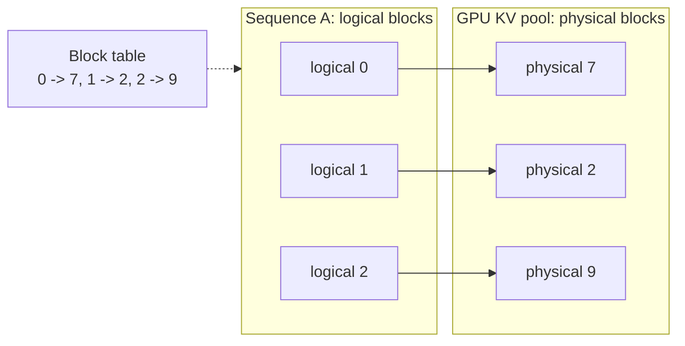

# vLLM and PagedAttention

> **Interview answer (say this first).** Naive serving wastes GPU memory because each request reserves one contiguous chunk of KV cache sized to the maximum sequence length, even if it stops early. That causes internal fragmentation, external fragmentation, and over-reservation. PagedAttention borrows virtual-memory paging: it stores the KV cache in small fixed-size blocks allocated on demand and maps logical blocks to physical blocks through a block table, so waste drops to at most one partly filled block per sequence. On top of that, vLLM uses continuous batching to refill finished slots every step and prefix caching to share blocks for repeated prompt prefixes. The result is much higher throughput, at the cost of more memory-planning knobs and a GPU-only focus.

## Why this exists

Decode is memory-bandwidth-bound. To generate each token, the GPU reads the model weights and the whole KV cache for the sequence. The weights are fixed; the KV cache grows with every request. How many sequences you can keep in memory at once is therefore the main lever on throughput and cost.

The naive way to serve is to give each request one contiguous region of KV cache. The server does not know how long the answer will be, so it reserves space for the worst case, `max_model_len` tokens. A request that produces 100 tokens may have reserved room for 8,192. That reserved-but-unused memory cannot hold another request. The GPU looks full while most of the cache is empty.

The original PagedAttention paper described the result plainly: existing systems wasted roughly 60% to 80% of KV cache memory because of fragmentation and over-reservation. That is not a small inefficiency. It directly cuts the number of concurrent requests, and on a fixed GPU, concurrency is throughput.

There are three separate wastes:

- **Internal fragmentation**: the gap between reserved length and actual length.
- **External fragmentation**: small unusable gaps left between sequences after some finish.
- **Over-reservation**: reserving the maximum because the true length is unknown.

Getting this right is what separates a server that handles a handful of conversations from one that handles hundreds on the same hardware. It matters even more for agents, which often share a long system prompt and tool schema, because then the cache can be reused instead of recomputed.

> **Note:**
>
> **The one-sentence purpose.** vLLM's PagedAttention pages the KV cache into small blocks so memory is used almost fully, and continuous batching keeps every step busy — together they raise serving throughput by making memory, not compute, the thing you optimise.

## Start from zero

| Word | Plain meaning |
| --- | --- |
| **vLLM** | A high-throughput LLM serving engine that introduced PagedAttention. |
| **KV cache** | Stored keys and values for past tokens, reused at each decode step. |
| **Prefill** | The first pass over the prompt. Parallel and compute-bound. |
| **Decode** | Generating one token at a time. Memory-bandwidth-bound. |
| **Sequence** | One request's tokens, growing as it generates. |
| **Block** | A fixed-size run of KV cache, usually 16 tokens, the unit of paging. |
| **Block table** | A per-sequence mapping from logical block index to physical block. |
| **Physical block** | An actual block in the GPU's KV cache pool. |
| **Logical block** | A block position in the sequence's own contiguous view. |
| **PagedAttention** | Attention that reads the KV cache through a block table instead of one contiguous buffer. |
| **Fragmentation** | Memory that is free in total but unusable because it is split into wrong-sized gaps. |
| **Internal fragmentation** | Wasted space inside an allocation, such as the unused tail of a reserved block. |
| **External fragmentation** | Small free gaps between allocations that are too small to reuse. |
| **Over-reservation** | Allocating for the maximum length when the real length is unknown. |
| **Continuous batching** | Admitting and retiring sequences every decode step instead of per batch. |
| **Static batching** | Building one batch and waiting for its longest sequence before the next. |
| **Iteration-level scheduling** | Deciding the batch composition at each decode step. |
| **Prefix caching** | Reusing physical blocks whose tokens match a prefix seen before. |
| **Copy-on-write** | Sharing a block until one sequence needs to change it, then copying. |
| **Preemption** | Evicting a sequence's blocks under memory pressure, then recomputing or swapping. |
| **Swap** | Moving evicted KV blocks to CPU memory, then loading them back. |
| **Recompute** | Rebuilding an evicted prefix by rerunning prefill. |
| **TTFT** | Time to first token, dominated by prefill and queueing. |
| **TPOT / ITL** | Time per output token, dominated by decode. |
| **Throughput** | Total tokens per second across all requests. |

Two contrasts to keep straight:

- **Internal vs external fragmentation.** Internal is unused space inside a reserved block. External is gaps between reserved regions. Paging fixes both by making every allocation one fixed block.
- **Throughput vs latency.** Batching raises total throughput and also raises each request's per-token latency. vLLM's default posture is throughput.

## The core idea

Operating systems solved this exact problem decades ago. A program wants one big contiguous block of memory; physical RAM is fragmented. The fix is virtual memory: the program sees contiguous **logical pages**, and the OS maps them to whatever **physical frames** are free. The program never needs the physical memory to be contiguous.

PagedAttention does that for the KV cache. A sequence sees logical blocks; the GPU holds a pool of physical blocks; a per-sequence **block table** maps one to the other. When a new block of 16 tokens is needed, the server hands out any free physical block. There is no need for contiguity, so external fragmentation essentially disappears. Waste is at most the unused tail of the last block, under 16 tokens.



Because blocks are referenced by index, two sequences can point at the same physical block when their prefixes match. That is the basis of prefix sharing: a long system prompt is stored once and reused by every request, with copy-on-write when a sequence diverges.

How the two designs compare:

| | Contiguous reservation | PagedAttention |
| --- | --- | --- |
| **Allocation** | One block sized to max length | Fixed-size blocks on demand |
| **External fragmentation** | Yes | Essentially none |
| **Internal waste** | Up to max length minus actual | Under one block per sequence |
| **Sharing prefixes** | Copy | Point at the same block |
| **Growth** | Reallocate or reserve | Allocate another block |
| **Best at** | Short, uniform sequences | Many varied concurrent sequences |

> **Note:**
>
> **Paging is invisible to the model.** The attention kernel still sees one ordered sequence of keys and values. The block table only changes where those values physically live. That is why PagedAttention drops into an existing model without changing the mathematics or retraining anything.

## How it works

**Part 1 — paging the cache.**

1. **Split the KV cache into fixed-size blocks.** A block holds a set number of tokens, commonly 16. The block is the unit of allocation and of reference.
2. **Keep a pool of physical blocks per model.** The server reserves most free GPU memory for this pool at startup, based on `gpu_memory_utilization`.
3. **Give each sequence a block table.** The table maps the sequence's logical block index to a physical block. The sequence grows by appending a new logical block.
4. **Allocate a physical block on demand.** When a sequence fills its last block, the scheduler hands it any free block. No contiguous region is needed.
5. **Run attention through the table.** The kernel gathers keys and values from the physical blocks listed in the block table, so paging is invisible to the maths.
6. **Free blocks when a sequence ends.** Released blocks return to the pool for other requests, which removes external fragmentation.

**Part 2 — sharing and caching.**

7. **Hash blocks for reuse.** A block is identified by the tokens it contains and the blocks before it. If an identical prefix was served before, its blocks already exist.
8. **Share matching prefix blocks.** A new sequence points at the same physical blocks instead of copying them, and the server increments a reference count.
9. **Copy on write when paths diverge.** The moment one sequence needs to write into a shared block, it copies the block first, so the other sequences are unaffected.
10. **Cash in on repeated prefixes.** A shared system prompt, few-shot examples, or a fixed tool schema are computed once and reused across thousands of requests.

**Part 3 — scheduling.**

11. **Run prefill and decode together.** The scheduler batches prefills from new requests with decodes from running sequences, balancing compute-heavy and memory-heavy work.
12. **Use continuous batching.** At every decode step, finished sequences are removed and waiting requests are admitted. The batch composition changes each step.
13. **Choose a scheduling policy.** vLLM defaults to first-come-first-served with chunked prefill and can use priority scheduling for higher-value requests.
14. **Handle memory pressure with preemption.** If the block pool runs low, the scheduler evicts some sequences' blocks and later swaps them to CPU or recomputes their prefix. Preemption costs latency and tokens.

**Part 4 — the result.**

15. **Memory efficiency becomes the throughput lever.** With little waste, more sequences fit, so each decode step processes a larger batch and generates more tokens per second.
16. **Prefix caching removes repeated prefill.** On prefix-heavy agent traffic, this cuts both TTFT and compute.
17. **Plan the pool, not just the weights.** Set `gpu_memory_utilization`, `max_model_len`, and `max_num_seqs` so the pool is large enough and the worst case still fits.

The pieces reinforce each other. Paging gives you a pool of reusable blocks. Continuous batching keeps the batch full step by step, so the pool is actually used. Prefix caching turns shared prefixes into free capacity. Remove any one and the others lose much of their value.

## The syntax you will use

**Serve a model with vLLM.** The OpenAI-compatible server is the usual production entry point.

```bash
vllm serve meta-llama/Llama-3.1-8B-Instruct \
  --max-model-len 8192 \
  --gpu-memory-utilization 0.90 \
  --max-num-seqs 64
```

`gpu_memory_utilization` sets the fraction of GPU memory vLLM claims for weights plus cache.

**Turn on prefix caching.** It is the highest-value flag for agent workloads with a shared prompt.

```bash
vllm serve meta-llama/Llama-3.1-8B-Instruct --enable-prefix-caching
```

Identical prompt prefixes reuse their KV blocks instead of being prefilled again.

**Choose a block size.** Smaller blocks waste less at the tail; larger blocks have less table overhead.

```bash
vllm serve meta-llama/Llama-3.1-8B-Instruct --block-size 16
```

16 tokens is the common default; some kernels prefer 32.

**Use the offline batch API.** For scoring or bulk generation, the Python LLM class schedules many prompts together.

```python
from vllm import LLM, SamplingParams

llm = LLM(model="meta-llama/Llama-3.1-8B-Instruct", max_model_len=8192)
params = SamplingParams(temperature=0.2, max_tokens=256)
outputs = llm.generate(["Explain PagedAttention in one sentence."], params)
```

The same engine powers the server and the offline path.

**Call the server with any OpenAI client.** vLLM exposes the standard chat-completions API.

```python
from openai import OpenAI

client = OpenAI(base_url="http://localhost:8000/v1", api_key="not-needed")
resp = client.chat.completions.create(
    model="meta-llama/Llama-3.1-8B-Instruct",
    messages=[{"role": "user", "content": "Hello"}],
)
```

The same code points at OpenAI, vLLM, TGI, or `llama.cpp` by changing `base_url`.

**Plan the KV block pool.** Block bytes and capacity follow from the cache-size formula.

```python
def block_bytes(block_size, n_layers, n_kv_heads, head_dim, dtype_bytes=2):
    return block_size * 2 * n_layers * n_kv_heads * head_dim * dtype_bytes

block_bytes(16, 32, 8, 128)   # 2,097,152 bytes = 2.0 MiB per 16-token block
block_bytes(16, 32, 32, 128)  # 8,388,608 bytes = 8.0 MiB per 16-token block
```

Divide the free pool by block size to get the number of blocks, then the number of tokens.

## Examples: simple to real

**Example 1 — the KV block size.** Verified arithmetic from the cache formula.

```text
Llama 2 7B  (32 layers, 32 KV heads, head_dim 128): 512 KiB/token
  16-token block = 8.0 MiB
Llama 3 8B  (32 layers,  8 KV heads, head_dim 128): 128 KiB/token
  16-token block = 2.0 MiB
```

A block is the smallest unit vLLM hands out, so an unfinished block is the only waste.

**Example 2 — naive reservation versus paging.** Verified waste when the server reserves 4,096 tokens.

```text
naive waste = (4,096 - actual) / 4,096             (fraction of the reservation)
paged reservation = ceil(actual / 16) * 16          (block size 16)
paged waste = (reservation - actual) / reservation  -> 0 at any multiple-of-16 length
the paged column below is the worst-case tail waste as a fraction of actual length

actual length 128:  naive waste 96.9% | paged worst-case tail waste <=15 tokens = 11.7% of length
actual length 512:  naive waste 87.5% | paged worst-case tail waste <=15 tokens =  2.9% of length
actual length 2048: naive waste 50.0% | paged worst-case tail waste <=15 tokens =  0.7% of length
```

The two columns use different denominators: naive waste is a share of the 4,096-token reservation, while the paged figure is the unused tail as a share of actual length. On the reservation basis the paged waste is 0 for these lengths, because each is a multiple of 16. The shorter the answers, the worse the contiguous scheme looks.

**Example 3 — how paging raises capacity.** Verified block counts for Llama 2 7B with 58 GiB free for cache.

```text
one 16-token block = 8 MiB
58 GiB / 8 MiB = 7,424 blocks = 118,784 token slots
at 512 tokens per sequence -> about 232 concurrent sequences
```

With contiguous reservations for 4,096 tokens each, the same memory would hold far fewer real sequences.

**Example 4 — prefix caching removes repeated prefill.** Verified token-work for 1,000 requests sharing a 1,000-token prefix.

```text
no prefix cache: 1,000 x 1,000 = 1,000,000 token-prefills
with prefix cache:            1,000 token-prefills for the first request
saved:                        999,000 token-prefills
```

For agents with a fixed system prompt and tool schema, this is often the single largest optimization.

**Example 5 — continuous batching versus static batching.** Four sequences with lengths `100, 100, 100, 1000`, one token per step.

```text
static batch: runs 1,000 steps waiting for the longest sequence
  slot-steps used = 1,300 of 4,000 -> 67.5% of slots idle
continuous: the three short sequences finish at step 100
  their slots are refilled immediately with new requests
```

Static batching wastes slots whenever sequence lengths vary, which is almost always.

**Example 6 — batching trades latency for throughput.** An illustrative simulation, not a benchmark: each decode step costs `20 + 1.5 x (batch-1)` ms.

```text
batch  1: step  20.0 ms, per-token 20.00 ms,  50.0 tokens/s
batch  8: step  30.5 ms, per-token  3.81 ms, 262.3 tokens/s
batch 32: step  66.5 ms, per-token  2.08 ms, 481.2 tokens/s
```

Every token arrives a little later, but many more tokens arrive each second. That is the core serving trade-off.

## In production

- **Tune `gpu_memory_utilization` against your KV needs.** Too low leaves memory idle; too high leaves no room for the peak and causes preemption under load.
- **Cap `max_model_len` honestly.** It sets the worst-case sequence size and therefore how many sequences fit. A 128k cap on a workload that uses 8k wastes huge capacity.
- **Cap `max_num_seqs` to protect tail latency.** More concurrent sequences raise throughput but can starve individual requests.
- **Enable prefix caching for shared prompts.** Agent systems repeat system prompts and tool schemas; caching them cuts TTFT and compute at once.
- **Expect preemption under pressure.** When blocks run out, vLLM swaps or recomputes sequences, which adds latency and tokens. Watch for recomputation in metrics.
- **Block size changes the trade.** Smaller blocks waste less at the tail; larger blocks reduce table overhead and can suit certain kernels.
- **Long context lowers concurrency.** The cache grows per token, so fewer sequences fit. This is the same math as any KV cache.
- **vLLM does not make a model fit.** If the weights plus a minimal cache exceed VRAM, you need quantization or tensor parallelism.
- **Startup and warmup matter.** Loading weights and compiling kernels takes time; the first request is slower. Keep the process warm and pre-warm common prefixes.
- **Chunked prefill protects decode latency.** A huge prompt can otherwise block every decode in the batch; chunked prefill interleaves it in pieces.
- **Prefix caching interacts with eviction.** Cache hits are only likely if the shared prefix stays resident; heavy eviction removes the benefit.
- **Measure TTFT and TPOT separately.** Throughput dashboards hide per-request latency, and users feel latency.

## Interview questions

### 1. Why does naive serving waste KV cache memory?

**Answer.** A naive server gives each sequence one contiguous region sized for the maximum sequence length, because the real length is unknown. On top of that, finished sequences leave gaps. The result is internal fragmentation, external fragmentation, and over-reservation. The PagedAttention paper put the waste at roughly 60% to 80% of cache memory, which directly reduces how many requests a GPU can serve.

**Follow-up: "Why not just predict the answer length?"** Predictions are wrong often enough that you either over-reserve and waste or under-reserve and fail. Paging avoids the guess entirely.

**Trap.** Thinking fragmentation is a minor accounting detail. The KV cache is often the largest consumer of GPU memory during serving, so wasting it cuts throughput proportionally.

### 2. What is PagedAttention?

**Answer.** It applies virtual-memory paging to the KV cache. The cache is split into small fixed-size blocks, and each sequence has a block table mapping logical blocks to physical blocks anywhere in the pool. Blocks are allocated on demand, so growth needs no contiguity and waste is under one block per sequence. Attention reads keys and values through the block table, so paging is transparent.

**Follow-up: "Where does one block of waste come from?"** The last block of an active sequence is partly filled. At most 15 unused tokens remain with a block size of 16.

**Trap.** Saying it is only about fragmentation. Paging also enables block-level sharing and copy-on-write, which is what makes prefix caching possible.

### 3. What is continuous batching, and how does it differ from static batching?

**Answer.** Static batching builds a batch and runs it until the longest sequence finishes, so short sequences hold slots idle. Continuous batching, also called iteration-level scheduling, decides the batch at every decode step: finished sequences leave and waiting requests join immediately. This keeps the batch full and raises throughput, at the cost of a more complex scheduler.

**Follow-up: "What does it do to latency?"** It usually improves short requests, because they no longer wait behind a long one, while admitting more work can raise per-token latency under heavy load.

**Trap.** Confusing it with dynamic batching. Dynamic batching groups requests that arrive close together; continuous batching changes the running batch every step.

### 4. What is prefix caching and when does it pay off?

**Answer.** It stores the KV blocks for a prompt prefix and reuses them when another request has the same prefix. Because blocks are content-addressed, identical system prompts, few-shot examples, or tool schemas are prefilled once. It pays off whenever many requests share a long prefix, which is exactly the agent pattern. The saving is proportional to the shared length times the number of requests.

**Follow-up: "What breaks prefix caching?"** Non-deterministic prompt construction, per-request text early in the prompt, or heavy block eviction all destroy reuse.

**Trap.** Assuming it always helps. If every prompt is unique from the first token, there is nothing to share and the hashing is pure overhead.

### 5. How do throughput and latency behave in vLLM?

**Answer.** Batching is the main throughput lever: a larger batch keeps the memory-bandwidth-bound decode step busy and raises tokens per second per GPU. The cost is that each request shares the step, so per-token latency rises with batch size. vLLM is tuned for throughput and lets you cap `max_num_seqs` and `max_model_len` to protect latency when a workload needs it.

**Follow-up: "How do you serve latency-sensitive traffic on vLLM?"** Lower the concurrency caps, use priority scheduling for important requests, enable chunked prefill so long prompts do not block decodes, and keep separate deployments for different latency classes.

**Trap.** Quoting one tokens-per-second figure as if it were fixed. Throughput depends heavily on sequence lengths, batch size, and whether prefills are mixed in.

### 6. What is vLLM good for, and what are its limits?

**Answer.** It is strong at high-throughput GPU serving of many concurrent requests, especially with shared prefixes and tensor parallelism across GPUs on a node. Its limits are that it needs careful memory planning (`gpu_memory_utilization`, `max_model_len`, `max_num_seqs`), long context reduces concurrency, very large models still need quantization or parallelism, and it is primarily a GPU engine. It also does not remove the compute cost of a long prompt; it only avoids repeating it.

**Follow-up: "What happens when memory runs out?"** The scheduler preempts sequences, swapping them to CPU or recomputing their prefix. Both cost latency, and recomputation spends tokens again.

**Trap.** Treating vLLM as a magic speedup. It optimises memory use and scheduling; the model still does the same arithmetic.

### 7. How do you plan memory for a vLLM deployment?

**Answer.** Estimate the weights from effective bits, subtract them and overhead from the GPU, and give the rest to the KV block pool. Then compute blocks as `pool_bytes / block_bytes`. The number of concurrent sequences is roughly the token capacity divided by the average sequence length. Set `gpu_memory_utilization` to claim the right share, and cap `max_model_len` and `max_num_seqs` so the worst case fits.

**Follow-up: "How do you size `max_model_len`?"** From the real workload. It sets the worst-case per-sequence footprint, so an over-large value silently destroys concurrency.

**Trap.** Leaving the pool too small. A high `gpu_memory_utilization` without enough context headroom causes preemption exactly when traffic peaks.

### 8. How does PagedAttention enable prefix sharing across requests?

**Answer.** Because the cache is addressed through a block table, two sequences can point at the same physical blocks. When a new request's prefix matches blocks already in the pool, vLLM links those blocks and increments a reference count instead of copying them. When one sequence writes into a shared block, copy-on-write gives it a private copy. This is what makes caching a shared system prompt cheap and safe.

**Follow-up: "What has to be true for a block to be shared?"** The full prefix up to that block must match, and the block must not be evicted. The block hash includes the token contents and the position.

**Trap.** Assuming sharing only applies at the whole-prompt level. It works block by block, so a shared prefix of any length can be reused.

## Remember this

- **Naive serving reserves the maximum and wastes 60% to 80% of KV memory.**
- **PagedAttention pages the cache into fixed blocks with a block table, so waste is under one block per sequence.**
- **Block-level sharing plus copy-on-write is what makes prefix caching possible.**
- **Continuous batching refills slots every step; static batching idles until its longest sequence ends.**
- **Batching raises throughput and per-token latency. vLLM defaults to throughput; cap `max_num_seqs` to protect latency.**
