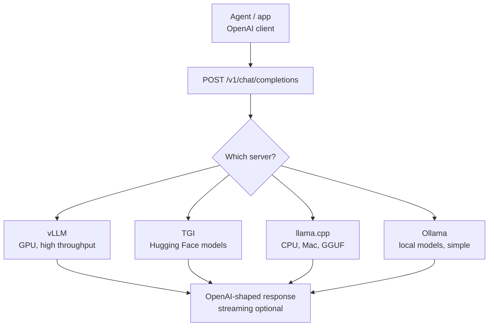
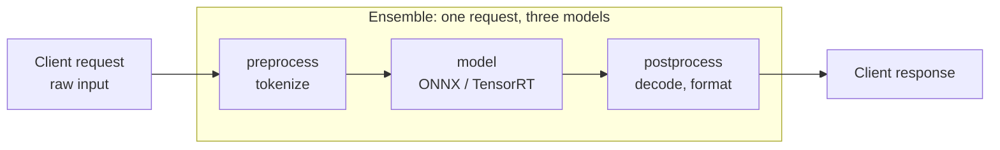

# OpenAI-Compatible Servers and Triton

> **Interview answer (say this first).** The OpenAI HTTP API has become the de facto standard for model serving. It defines `/v1/chat/completions`, streaming over server-sent events, and tool calls, and almost every open server implements it: vLLM, TGI, `llama.cpp`, and Ollama. That matters because agent frameworks and client libraries already speak it, so you can point `base_url` at a self-hosted server and change nothing else. Triton Inference Server is a different kind of tool: a general, model-agnostic inference server from NVIDIA that runs many frameworks through backends, supports ensembles and dynamic batching, and scales via instance groups. Use an LLM-aware model server for chat models, and Triton when you need many heterogeneous models, pre/post-processing DAGs, or strict production control.

## Why this exists

Every AI application needs to call a model. If every provider had a different HTTP shape, every application would need a different client, and switching models would be a rewrite. Instead, the industry converged on the OpenAI API as a common contract. One request format works against OpenAI, Azure OpenAI, vLLM, TGI, `llama.cpp`, Ollama, and many more.

That convergence is a portability win. An agent built with the OpenAI Agents SDK or most open frameworks can be pointed at a local vLLM server by changing one environment variable. Tool calling, streaming, and structured output all keep working, because the server implements the same schema. The API became the socket that any model can be plugged into.

But the OpenAI API is not the whole story. It is great at chat. It is not a general model-serving platform. Real systems often run embeddings, rerankers, classifiers, vision models, and custom pre/post-processing alongside the chat model. Those are not chat completions. Triton Inference Server exists for that world: one server, many models, many frameworks, and fine control over batching and concurrency.

So there are two layers to learn. First, the LLM-facing contract that makes agents portable. Second, the general serving infrastructure that runs everything else. Most teams need both, and they should not be confused with each other.

> **Note:**
>
> **The one-sentence purpose.** The OpenAI API is the standard plug for chat models, and OpenAI-compatible servers let you swap the model without changing client code. Triton is the industrial power strip behind it: model-agnostic, multi-framework, and built for careful batching and multi-model serving.

## Start from zero

| Word | Plain meaning |
| --- | --- |
| **Endpoint** | A URL path that accepts a request, such as `/v1/chat/completions`. |
| **OpenAI-compatible API** | A server that implements OpenAI's request and response shapes. |
| **Chat completions** | The endpoint that takes a message list and returns an assistant message. |
| **Completions** | The older text-in, text-out endpoint. Still used by some tools. |
| **Embeddings** | The endpoint that turns text into a vector. |
| **Messages** | The list of `system`, `user`, `assistant`, and `tool` turns sent to the model. |
| **`base_url`** | The client setting that points at your server instead of OpenAI. |
| **Server-sent events (SSE)** | A streaming HTTP format the server uses to push tokens as they are produced. |
| **`data: [DONE]`** | The sentinel line that marks the end of an SSE stream. |
| **Tool call** | A structured request from the model to run a function, returned in the response. |
| **`finish_reason`** | Why generation stopped: `stop`, `length`, or `tool_calls`. |
| **Model server** | An LLM-aware server: vLLM, TGI, `llama.cpp` server, Ollama. |
| **Inference server** | A general server for many model types: Triton, TorchServe, KServe. |
| **Triton Inference Server** | NVIDIA's model-agnostic server with backends, ensembles, and batching. |
| **Model repository** | The directory layout Triton reads: one folder per model, versions inside. |
| **Version folder** | A numbered directory such as `1/` holding one version of a model's files. |
| **`config.pbtxt`** | The per-model config file that declares inputs, outputs, batching, and instances. |
| **Backend** | The runtime Triton uses for a model: TensorRT, ONNX Runtime, PyTorch, Python, TensorRT-LLM. |
| **Ensemble** | A graph of models that Triton runs in order, passing outputs to inputs. |
| **DAG** | A directed acyclic graph: a pipeline with no loops. Ensembles are DAGs. |
| **Dynamic batching** | Triton groups requests that arrive close together into one batch, server-side. |
| **Max queue delay** | How long Triton waits to fill a batch before running it. |
| **Instance group** | How many copies of a model run, and on GPU or CPU. |
| **Concurrency** | Requests handled at the same time. More instances mean more concurrency. |
| **TensorRT-LLM backend** | Triton's backend for optimized large language models. |

Two contrasts that matter:

- **Model server vs inference server.** A model server understands tokens, KV cache, sampling, and streaming for LLMs. An inference server understands models as generic tensors in and tensors out. LLM features are often layered on top.
- **Batching by the server vs batching by the caller.** A model server does continuous batching for you. Triton does dynamic batching for general models, but the caller may still need to send tensors in the right shape.

## The core idea

Think about electrical power. The **OpenAI API is a standard power socket**. Any appliance with the right plug works: a laptop, a lamp, a phone charger. You do not rewire the building to change the appliance. An OpenAI-compatible server is a socket that any OpenAI-shaped client can use.

**Triton is the power strip behind the wall.** It accepts many appliances with different plugs (backends), can chain them together (ensembles), distributes load across outlets (instance groups), and groups small loads into one circuit (dynamic batching). It is the infrastructure layer, not the appliance.



Triton's picture is different. It is a pipeline of models matching a declared schedule:



How a model server and a general inference server compare:

| | Model server (vLLM, TGI, Ollama) | Inference server (Triton) |
| --- | --- | --- |
| **Primary job** | Serve LLMs | Serve many model types |
| **API** | OpenAI-compatible | HTTP/gRPC tensor API plus LLM backends |
| **Batching** | Continuous batching, built in | Dynamic batching, configured |
| **Tokenization** | Handled for you | You build it, often as a model |
| **Streaming** | Built in | Depends on the backend |
| **Multi-model** | One or few models per process | Many models and versions |
| **Ensembles** | No | Yes, first-class DAGs |
| **Best for** | Chat and agent traffic | Mixed fleets, strict SLAs, pre/post pipelines |

## How it works

**Part 1 — the OpenAI-compatible contract.**

1. **Clients send a chat payload.** `model`, `messages`, `temperature`, `max_tokens`, optional `tools` and `stream`. This is the same body every OpenAI client builds.
2. **The server handles tokenization and chat templating.** It applies the model's chat template to the messages, tokenizes, and runs prefill and decode.
3. **The response matches the OpenAI shape.** `choices` with a message and `finish_reason`, plus a `usage` block with token counts.
4. **Streaming uses SSE.** With `stream: true`, the server emits `data:` lines of JSON deltas and ends with `data: [DONE]`.
5. **Tool calls are structured.** The model returns `tool_calls` in the message and `finish_reason: "tool_calls"`; the client runs the function and sends a `tool` role message back.
6. **Portability comes from the contract.** Any client that speaks this shape works with any server that implements it, by changing only `base_url` and the model name.

**Part 2 — the servers.**

7. **vLLM** is the throughput choice on NVIDIA GPUs, with PagedAttention, continuous batching, prefix caching, and tensor parallelism.
8. **TGI** is Hugging Face's serving stack, with OpenAI-compatible routes, token streaming, and quantization support.
9. **`llama.cpp` server** serves GGUF models on CPU, Mac, and edge hardware, and exposes an OpenAI-compatible endpoint.
10. **Ollama** wraps `llama.cpp` with model management and a simple local API, aimed at developers and desktops.
11. **Others** include LM Studio, SGLang, TensorRT-LLM's server, and llama-cpp-python. Each implements a subset of the OpenAI API and adds its own extensions.

**Part 3 — Triton's model repository.**

12. **Lay out a directory per model.** Each model has a name, a numbered version folder, and a `config.pbtxt`. Triton watches the repository and loads new versions.
13. **Declare inputs and outputs.** `config.pbtxt` names each tensor, its data type, and its dimensions so Triton can validate and batch requests.
14. **Choose a backend.** The backend decides how the model runs: `onnxruntime`, `pytorch`, `tensorrt`, `python`, `tensorflow`, or `tensorrtllm`. The `python` backend runs custom code and is how many teams add tokenization.

**Part 4 — Triton's serving features.**

15. **Dynamic batching groups requests.** The server waits up to `max_queue_delay_microseconds` to collect requests up to `max_batch_size` or a `preferred_batch_size`, then runs them as one batch.
16. **Instance groups control concurrency.** `instance_group` sets how many copies of the model run and on GPU or CPU. Two instances on one GPU overlap one instance's compute with another's memory transfers.
17. **Ensembles chain models.** An `ensemble_scheduling` block declares steps and maps one model's output to the next model's input. Triton runs the DAG in one request.
18. **Triton exposes metrics and health.** It reports queue time, batch size, and inference time per model, which is how you tune batching and instances.

**Part 5 — choosing.**

19. **Use a model server for chat and agent traffic.** It already handles tokenization, KV cache, continuous batching, sampling, and streaming.
20. **Use Triton for heterogeneous fleets and pipelines.** Many model types, explicit versions, ensembles, and strict control over batching and placement.
21. **They can coexist.** Put vLLM behind Triton's TensorRT-LLM backend path, or run vLLM and Triton as separate services and route between them.

## The syntax you will use

**Call an OpenAI-compatible server with `curl`.** The same body works against any compliant server.

```bash
curl http://localhost:8000/v1/chat/completions \
  -H "Content-Type: application/json" \
  -H "Authorization: Bearer not-needed" \
  -d '{
    "model": "meta-llama/Llama-3.1-8B-Instruct",
    "messages": [{"role": "user", "content": "Hello"}],
    "temperature": 0.2,
    "max_tokens": 100
  }'
```

Point the URL at vLLM, TGI, `llama.cpp`, or Ollama and the body is unchanged.

**Switch providers by changing `base_url`.** This is the portability payoff.

```python
from openai import OpenAI

# OpenAI
openai_client = OpenAI(api_key="sk-...")

# a local vLLM server, same client code
local_client = OpenAI(base_url="http://localhost:8000/v1", api_key="not-needed")
```

Agent frameworks built on this client need only an environment change to use a self-hosted model.

**Stream tokens with SSE.** Each chunk carries a delta; the stream ends with a sentinel.

```text
data: {"choices":[{"index":0,"delta":{"role":"assistant","content":""},"finish_reason":null}]}

data: {"choices":[{"index":0,"delta":{"content":"Paged"},"finish_reason":null}]}

data: {"choices":[{"index":0,"delta":{"content":"Attention"},"finish_reason":null}]}

data: {"choices":[{"index":0,"delta":{},"finish_reason":"stop"}]}

data: [DONE]
```

The `data: ...` lines are server-sent events; `finish_reason` sits inside each choice object, and `data: [DONE]` marks the end.

**Send a tool schema, receive a tool call.** This is how agents act.

```python
tools = [{
    "type": "function",
    "function": {
        "name": "get_weather",
        "description": "Get the weather for a city",
        "parameters": {
            "type": "object",
            "properties": {"city": {"type": "string"}},
            "required": ["city"],
        },
    },
}]
# the model replies with finish_reason="tool_calls" and a tool_calls array
```

The client executes the function and sends the result back as a `tool` message.

**Serve with vLLM, TGI, and Ollama.** Each exposes an OpenAI-style endpoint.

```bash
vllm serve meta-llama/Llama-3.1-8B-Instruct --port 8000

# Hugging Face TGI (Docker form)
docker run --gpus all -p 8080:80 ghcr.io/huggingface/text-generation-inference:latest \
  --model-id meta-llama/Llama-3.1-8B-Instruct

# Ollama, then call its OpenAI-compatible endpoint
ollama serve
```

Every one of these answers the chat-completions shape.

**Describe a Triton model.** The `config.pbtxt` declares the contract.

```text
name: "text_classifier"
backend: "onnxruntime"
max_batch_size: 32

input [{ name: "input_ids"  data_type: TYPE_INT32  dims: [-1] }]
output [{ name: "logits"    data_type: TYPE_FP32   dims: [-1, 2] }]

dynamic_batching {
  preferred_batch_size: [8, 16]
  max_queue_delay_microseconds: 100
}

instance_group [{ kind: KIND_GPU  count: 2 }]
```

This says: batch up to 32 requests, prefer batches of 8 or 16, wait up to 100 microseconds, and run two GPU instances.

**Declare an ensemble.** Steps map outputs to inputs to form a DAG. This is a fragment: the full `config.pbtxt` also needs `platform: "ensemble"` and top-level `input`/`output` declarations that match the first and last steps.

```text
# fragment: the full config.pbtxt also carries platform and the ensemble's inputs/outputs
platform: "ensemble"

input  [{ name: "raw_text"  data_type: TYPE_STRING  dims: [-1] }]
output [{ name: "logits"    data_type: TYPE_FP32    dims: [-1, 2] }]

ensemble_scheduling {
  step [
    { model_name: "preprocess"  model_version: -1
      input_map  { key: "raw_text"  value: "RAW_TEXT" }
      output_map { key: "input_ids" value: "INPUT_IDS" } },
    { model_name: "text_classifier"  model_version: -1
      input_map  { key: "input_ids" value: "INPUT_IDS" }
      output_map { key: "logits"    value: "LOGITS" } }
  ]
}
```

Triton runs these steps in one request and returns the final output. Note that the DAG above shows three models (`preprocess`, `model`, `postprocess`) while this fragment lists two steps; a matching config would add the `postprocess` step.

## Examples: simple to real

**Example 1 — one client, many servers.** The verified payoff of the standard contract.

```text
client = OpenAI(base_url=...)
  base_url=http://openai                 -> hosted model
  base_url=http://localhost:8000/v1      -> vLLM
  base_url=http://localhost:8080/v1      -> TGI
  base_url=http://localhost:11434/v1     -> Ollama
# no other code changes
```

This is why agent frameworks standardise on the OpenAI client shape.

**Example 2 — a streamed response is a sequence of deltas.** The client concatenates content, and `finish_reason` tells it why generation stopped.

```text
chunk 1: delta.content ""        role assistant
chunk 2: delta.content "Paged"
chunk 3: delta.content "Attention"
last:    finish_reason "stop"
sentinel: data: [DONE]
```

Streaming improves perceived latency. It does not reduce the number of tokens generated.

**Example 3 — Triton's model repository layout.** Triton discovers models by directory.

```text
model_repository/
  text_classifier/
    config.pbtxt
    1/
      model.onnx
    2/
      model.onnx
  preprocess/
    config.pbtxt
    1/
      model.py
```

Version `2` can be loaded while `1` still serves; `model_version: -1` in an ensemble means "latest".

**Example 4 — dynamic batching.** An illustrative trace: eight requests arrive at times `0, 0, 10, 15, 20, 25, 200, 205` ms, with `max_batch_size=4` and a 30 ms queue delay. The times below are arrival/dispatch times, not run times.

```text
batch at 0 ms:   requests 0, 0, 10, 15   (dispatch times of the first 4 arrivals)
batch at 20 ms:  requests 20, 25          (next dispatch window)
batch at 200 ms: requests 200, 205
3 batches, average batch size 8 / 3 = 2.67
```

Dynamic batching trades a small wait for much better accelerator utilisation. The wait is the `max_queue_delay`; each batch's execution time is separate and not shown here.

**Example 5 — instance groups multiply concurrency.** Verified instance counts from VRAM.

```text
VRAM 16 GB, model 4 GB, overhead 2 GB -> 3 instances
VRAM 80 GB, model 16 GB, overhead 8 GB -> 4 instances
VRAM 80 GB, model 70 GB, overhead 10 GB -> 1 instance
```

Multiple instances of the same model on one GPU overlap compute and memory work, raising throughput on small models.

**Example 6 — when to use which server.**

```text
One chat/agent model, want fast setup:        vLLM or TGI
Local laptop or Mac, no GPU:                  llama.cpp or Ollama
Many model types, versions, and pipelines:    Triton
Heavy pre/post-processing around the model:   Triton ensemble
Strict per-model batching and instance control: Triton
```

The two layers are complementary, not competing.

## In production

- **Pin the API version, not the vendor.** Build clients against the OpenAI shape so switching servers is a `base_url` change, and keep provider-specific extensions out of shared code.
- **Do not assume full compatibility.** Servers implement subsets and add quirks. Test streaming, tool calls, `finish_reason`, and error codes against each server you use.
- **Handle `data: [DONE]` and partial chunks.** Networks can split SSE frames; parse line by line and treat the sentinel as the only reliable end.
- **Validate tool calls before executing.** A tool call is model output, so validate arguments against the schema and apply the same permissions you would to any external input.
- **Set timeouts and cap `max_tokens`.** A stream that never ends holds a connection and a slot. Bound both server-side and client-side.
- **Use dynamic batching deliberately.** The queue delay trades latency for throughput. Set `preferred_batch_size` to shapes your kernels handle well.
- **Size instance groups from VRAM.** Leave headroom for activations and, for LLM backends, the KV cache. More instances are not free.
- **Version models explicitly in Triton.** Use numbered folders and pin ensemble steps rather than relying on `-1` everywhere, so a new version does not silently change a pipeline.
- **Keep tokenization consistent.** In Triton, the tokenizer is often a separate Python-backend model. A mismatch between training and serving tokenization quietly changes outputs.
- **Watch Triton metrics per model.** Queue time, batch size, and compute time reveal whether you are batching well or CPU-bound in preprocessing.
- **Separate LLM traffic from general traffic.** Run the chat model on a model server and put the rest behind Triton, rather than forcing everything through one tool.
- **Load-test the real mix.** A server tuned for single short chats behaves differently under long prompts, tool calls, and streaming concurrency.

## Interview questions

### 1. What is the OpenAI-compatible API, and why does it matter?

**Answer.** It is the HTTP contract popularised by OpenAI: a chat-completions endpoint taking a message list and returning choices, plus streaming and tool calls. It matters because it became the de facto standard for LLM serving. Almost every open server implements it, so client code and agent frameworks can point at a self-hosted model by changing `base_url`. It turns model choice into configuration instead of a rewrite.

**Follow-up: "Is it truly portable?"** Mostly. Servers implement subsets and add extensions, so you must test streaming, tools, and error shapes per server. The core contract is stable, the edges are not.

**Trap.** Assuming "OpenAI-compatible" means identical. Compatibility usually covers chat completions and streaming, not every OpenAI feature.

### 2. What does a chat-completions request and response look like?

**Answer.** The request carries `model`, `messages` with roles (`system`, `user`, `assistant`, `tool`), and sampling controls such as `temperature` and `max_tokens`. The response has `choices`, each with a `message` and a `finish_reason` (`stop`, `length`, or `tool_calls`), plus a `usage` block with prompt and completion token counts. The same shape returns whether the server is OpenAI, vLLM, TGI, or Ollama.

**Follow-up: "Why does `finish_reason` matter?"** It tells your code why generation stopped. `length` means you truncated, which often explains a broken JSON or a cut-off answer.

**Trap.** Ignoring `usage`. It is how you meter cost and detect prompt bloat, and many self-hosted servers also report it.

### 3. How does streaming work in this API?

**Answer.** With `stream: true`, the server responds with `text/event-stream` and emits `data:` lines. Each line is a JSON chunk with a delta containing the new content. The stream ends with `data: [DONE]`. The client parses chunks incrementally and reconstructs the message. Streaming lowers perceived latency because the first token appears immediately, but it does not reduce total tokens or cost.

**Follow-up: "How do tool calls stream?"** The tool-call arguments arrive incrementally as deltas and must be concatenated before you parse the JSON. This is a common source of bugs.

**Trap.** Treating each chunk as a complete JSON object. It is a delta; you must accumulate content and tool arguments.

### 4. Which servers expose an OpenAI-compatible API?

**Answer.** vLLM, Hugging Face TGI, `llama.cpp`'s server, Ollama, LM Studio, SGLang, and several others. They differ in hardware target and strength: vLLM and TGI are GPU throughput engines; `llama.cpp` and Ollama target CPU, Mac, and edge; SGLang focuses on structured and high-throughput workloads. All expose chat completions, and most stream and support tools.

**Follow-up: "How do you choose between them?"** By hardware and workload. GPU datacentre traffic points to vLLM or TGI; laptops and local agents point to Ollama or `llama.cpp`.

**Trap.** Forgetting that the served model must match your tokenizer and chat template. A server that loads the weights but the wrong template produces subtly wrong answers.

### 5. What is Triton Inference Server?

**Answer.** Triton is NVIDIA's model-agnostic inference server. It reads a model repository, where each model has version folders and a `config.pbtxt`, and runs them through a backend such as ONNX Runtime, PyTorch, TensorRT, or Python. It supports dynamic batching, instance groups, ensembles, and both HTTP and gRPC APIs. It is built to serve many models of many types with production control, not just LLMs.

**Follow-up: "Can Triton serve LLMs?"** Yes, including through its TensorRT-LLM backend, but for a single chat model a purpose-built model server is usually simpler and gives OpenAI-compatible streaming and tools out of the box.

**Trap.** Treating Triton as an LLM server. Its primary abstraction is a model with tensor inputs and outputs, not a chat conversation.

### 6. How does Triton handle batching and concurrency?

**Answer.** Dynamic batching collects requests that arrive close together and runs them as one batch, bounded by `max_batch_size` and delayed by `max_queue_delay_microseconds`. The `preferred_batch_size` list steers toward shapes the kernels like. Concurrency comes from `instance_group`, which sets how many copies of the model run and on GPU or CPU; multiple instances on one GPU overlap work. Together they trade a small latency cost for much better accelerator utilisation.

**Follow-up: "What is the danger of a long queue delay?"** Requests wait for company. Under low load, the delay is pure added latency; under high load it is well spent. Tune it against measured traffic.

**Trap.** Setting `max_batch_size` lower than the shapes your kernel needs, or higher than memory allows. Both cause retries or out-of-memory.

### 7. What are ensembles in Triton, and why use them?

**Answer.** An ensemble is a declared DAG of models. The `ensemble_scheduling` block lists steps, and `input_map` and `output_map` connect one model's output to the next model's input. Triton runs the whole graph within a single request, so the client sends raw input and gets the final output. Ensembles move preprocessing and postprocessing server-side and avoid round trips between them.

**Follow-up: "Where do tokenizers fit?"** Usually as a Python-backend model inside the ensemble, so the client sends text and gets logits or formatted output.

**Trap.** Forgetting that ensemble steps must match exactly. A mismatched tensor name or shape fails the whole pipeline at load time or at request time.

### 8. When do you use a model server versus a general inference server?

**Answer.** Use a model server such as vLLM, TGI, or Ollama for LLM chat and agent traffic: it handles tokenization, KV cache, continuous batching, sampling, streaming, and the OpenAI API for you. Use Triton when you serve many heterogeneous models, need explicit versions, want ensembles and pre/post-processing in one request, or need fine control over batching and instance placement. They can run side by side.

**Follow-up: "What if I need OpenAI streaming and an ensemble?"** Keep the LLM on vLLM and put the surrounding models on Triton, or use Triton's TensorRT-LLM backend and add streaming yourself. Most teams split the two.

**Trap.** Forcing an LLM into a generic tensor server and reimplementing KV caching, continuous batching, and streaming. That is exactly the work a model server already does.

## Remember this

- **The OpenAI API is the standard socket for chat models.** Changing `base_url` is what makes models portable.
- **vLLM, TGI, `llama.cpp`, and Ollama all expose it**, differing by hardware target and strength.
- **Streaming is SSE deltas ending in `data: [DONE]`; tool calls arrive incrementally and must be assembled.**
- **Triton is a general inference server:** model repository, `config.pbtxt`, backends, ensembles, dynamic batching, instance groups.
- **Use a model server for LLMs and Triton for heterogeneous models and pipelines; they are complementary.**
