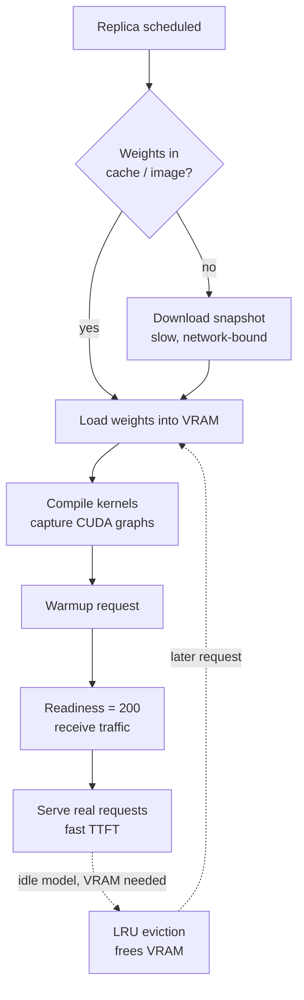

# Model Caching and Warmup

> **Interview answer (say this first).** Model caching stores the model files so a server never downloads them twice, and warmup runs real requests so the weights are in VRAM and the kernels are compiled before live traffic arrives. A cold start has three costs: fetching the weights, loading them into GPU memory, and compiling or capturing CUDA kernels. Cache weights on a shared volume or bake them into the image, and mark a replica ready only after a warmup request succeeds. Keeping many models resident is a VRAM trade-off, so you evict with an LRU policy. For autoscaling, every cold start is paid capacity: measure its cost, not just the steady-state request cost.

## Why this exists

A model server looks instant when it is warm and looks broken when it is cold. The pod starts in a second, the health check passes, the load balancer sends it traffic — and then the first real request takes tens of seconds and times out. The container is healthy; the model is not ready.

Three separate clocks run during a cold start:

1. **Download.** Pulling many gigabytes of weights from a model hub or object store. On a slow link this dominates everything.
2. **Load.** Reading the weights into GPU memory, building the compute graph, and allocating the KV cache. I/O and allocation bound this.
3. **Compile.** Many GPU kernels are specialized per shape and are compiled the first time a shape is seen. Frameworks also capture CUDA graphs to cut launch overhead. A model that has loaded but not compiled is still slow.

Caching attacks the first clock. Warmup attacks the second and third. They are different problems with different fixes, and interviewers like to check that you know which is which.

The same issue appears in agentic AI. An agent that must call a 70B model may hit a replica that is still loading. An autoscaler that adds replicas during a traffic spike sends burst traffic to replicas that cannot serve yet, so the spike looks like an outage. And a fleet that keeps twenty models resident "just in case" pays for VRAM it rarely uses. Caching, warmup, residency, and eviction are the controls.

> **Note:** A passing liveness or health check is not the same as being warm. Liveness asks "is the process alive?" Readiness should ask "can it serve a real request now?" If your readiness probe returns 200 before warmup finishes, you have a cold-start outage waiting for a scale-up.

## Start from zero

| Word | Plain meaning |
| --- | --- |
| **Model weights** | The learned numbers that are the model; usually many gigabytes. |
| **Hub cache** | A local directory that stores downloaded model files, such as the Hugging Face cache. |
| **Cache directory** | The folder the cache lives in; set by an environment variable or API argument. |
| **Model repository** | A named model on a hub, for example `meta-llama/Meta-Llama-3-8B-Instruct`. |
| **Snapshot** | The pinned set of files for one model revision, stored in the cache. |
| **Cold start** | Starting a server that has no model loaded yet. |
| **Warm start** | Starting from already-cached and already-loaded state. |
| **Warmup** | Sending real requests at startup so caches, kernels, and graphs are ready. |
| **Weight load** | Copying weights from disk into GPU memory. |
| **VRAM** | GPU memory; weights, KV cache, and activations compete for it. |
| **KV cache** | Per-request key/value storage for attention; grows with context length. |
| **Kernel** | A small GPU program that runs one operation. |
| **Kernel compilation** | Building a kernel the first time a given input shape is seen. |
| **CUDA graph** | A recorded sequence of GPU work replayed to cut per-step launch overhead. |
| **TTFT** | Time to first token; what a streaming user actually feels. |
| **First-token latency** | Another name for TTFT; highest right after a cold start. |
| **Residency** | A model stays loaded in VRAM instead of being loaded on demand. |
| **On-demand load** | Loading a model only when a request for it arrives. |
| **Eviction** | Removing a loaded model to make room for another. |
| **LRU** | Least Recently Used: evict the model nobody has used for the longest time. |
| **Readiness probe** | A check that decides whether a replica may receive traffic. |
| **Liveness probe** | A check that decides whether the process must be restarted. |
| **Scale-to-zero** | Scaling replicas down to none when idle, accepting a cold start later. |
| **Init container** | A container that runs to completion before the main container starts. |
| **Image-baked weights** | Model files copied into the container image, so no download happens at start. |
| **Page cache** | The operating system's file cache, which makes a second read faster. |
| **Pre-pull** | Fetching an image or weights ahead of time so start is fast. |

Two distinctions to keep straight:

- **Cache vs residency.** Caching keeps files on disk. Residency keeps the loaded model in VRAM. Caching makes reload fast; residency avoids reload entirely.
- **Liveness vs readiness.** Liveness restarts a stuck process. Readiness gates traffic. Only readiness should wait for warmup.

## The core idea

Think of a restaurant kitchen. The pantry is the **hub cache**: a place ingredients are stored so nobody drives to the market per order. The prepped counter is **residency**: ingredients already chopped and within reach. **Warmup** is the chef turning on the burners, heating the pans, and cooking one test dish before the doors open. A kitchen can be open and staffed (liveness 200) while the stove is still cold (not ready).

The cold path and the warm path:



The residency trade-off, on one screen:

| Strategy | Start latency | VRAM use | Cost | Best for |
| --- | --- | --- | --- | --- |
| **On-demand load** | High (cold every switch) | Low | Low idle | Many rare models |
| **Keep all resident** | None | Highest | High idle | Few hot models |
| **LRU residency** | Medium on miss | Bounded | Balanced | Multi-model hosts |
| **Dedicated per model** | Low | Whole GPU each | Highest | Latency-critical, isolated tenants |

There is no free option. You are choosing where to pay: at start time, in VRAM, or in money.

## How it works

1. **Resolve the cache directory once.** Set a single location such as `HF_HOME`, mount a volume there, and make every process read the same path. A cache that differs per replica is not a cache.
2. **Fetch the weights before the server starts.** Use an init container, a startup step, or an image build. Do not let the web server download weights while it is also holding a health-check port.
3. **Pin the revision.** Download a specific commit or tag, not a floating `main`. A moved model file changes behavior and can silently invalidate warm caches.
4. **Bake weights into the image only when it pays.** Image-baked weights remove the download at start, but they enlarge the image, slow image pulls, and couple the model to the app release. Use a registry with a local mirror, or a read-only shared volume, when the fleet is large.
5. **Load the model into VRAM.** Allocate weights, then the KV cache. Watch `--gpu-memory-utilization` (vLLM) so the KV cache is not starved by a larger batch.
6. **Compile and capture.** Run a request that exercises representative shapes so JIT kernels and CUDA graph capture happen during startup, not during the first user request. vLLM does this in its own warmup; `--enforce-eager` skips graph capture and starts faster but serves slower.
7. **Warm up with a real request.** A tiny generation with a short prompt and `max_tokens=1` is enough to touch the whole path: tokenizer, model forward pass, sampler, scheduler. Warm the shapes you expect, including the long-context path if you serve long contexts.
8. **Gate readiness on warmup.** The `/ready` endpoint returns 503 until warmup completes, then 200. Set `failureThreshold` so a slow load is not mistaken for a crash.
9. **Keep hot models resident.** For the top few models, hold them loaded and skip the reload. This is a plain memory-for-latency trade.
10. **Evict cold models with LRU under a VRAM budget.** When the budget is full, remove the least recently used model before loading a new one. Record every eviction as a metric, because evictions are cold starts.
11. **Separate the process cache from the GPU cache.** The disk cache survives a restart; VRAM does not. A replica that restarts still pays the load and compile even with a warm disk cache.
12. **Measure the cold path.** Track load seconds, compile seconds, cold-start count, and warmup failures per model and per version. A cold start you do not measure is a latency spike you cannot explain.

## The syntax you will use

**The cache is controlled by environment variables.** The Hugging Face libraries read these; point them at a mounted volume.

```python
import os
os.environ["HF_HOME"] = "/models/hf"          # base cache directory
os.environ["HF_HUB_CACHE"] = "/models/hf/hub" # where snapshots live
os.environ["HF_HUB_OFFLINE"] = "1"            # fail instead of reaching the network
os.environ["TRANSFORMERS_OFFLINE"] = "1"      # same idea for Transformers
```

`TRANSFORMERS_CACHE` is the older name and is superseded by `HF_HUB_CACHE`; prefer the newer variables.

**Download a pinned snapshot into the cache.** This is the fetch step, run once per node or in an init container.

```python
from huggingface_hub import snapshot_download

path = snapshot_download(
    "meta-llama/Meta-Llama-3-8B-Instruct",
    revision="main",                 # use a commit hash in production
    cache_dir="/models/hf/hub",
)
print(path)                          # local directory holding the weights
```

**Load from cache and forbid the network.** `local_files_only=True` makes a missing cache a clear error instead of a slow download.

```python
from transformers import AutoModelForCausalLM, AutoTokenizer

tok = AutoTokenizer.from_pretrained("meta-llama/Meta-Llama-3-8B-Instruct",
                                    cache_dir="/models/hf/hub")
model = AutoModelForCausalLM.from_pretrained(
    "meta-llama/Meta-Llama-3-8B-Instruct",
    cache_dir="/models/hf/hub",
    local_files_only=True,           # never reach the hub at serve time
    device_map="cuda",
)
```

**Bake the weights into the image when the fleet is large.** This trades image size for a start with no download.

```dockerfile
FROM nvidia/cuda:12.4.1-runtime-ubuntu22.04

ENV HF_HOME=/models/hf
# weights are copied at build time; the running container needs no network
COPY ./weights /models/hf/hub
```

**Warmup is a real request behind a readiness flag.** The flag flips only when the request succeeds.

```python
READY = False

def warmup(client, model: str):
    global READY
    for _ in range(3):                       # repeat to touch compile and graph capture
        client.chat.completions.create(
            model=model,
            messages=[{"role": "user", "content": "warmup"}],
            max_tokens=1,
        )
    READY = True
```

**Kubernetes keeps traffic away until the model is warm.** The startup probe covers a slow load; the readiness probe is the gate.

```yaml
readinessProbe:
  httpGet: {path: /ready, port: 8000}
  periodSeconds: 5
  failureThreshold: 60      # up to 5 minutes to load and warm
startupProbe:
  httpGet: {path: /ready, port: 8000}
  periodSeconds: 10
  failureThreshold: 60      # startup probe suspends liveness/readiness; exceeding it kills the container
```

**Residency with LRU eviction is a small bounded structure.** This is a model host with a VRAM budget.

```python
from collections import OrderedDict

class ResidentModels:
    def __init__(self, capacity_gb, size_of):
        self.capacity_gb = capacity_gb
        self.size_of = size_of            # callable: model -> VRAM in GB
        self.used_gb = 0.0
        self.order = OrderedDict()        # model -> size, LRU first

    def acquire(self, model):
        if model in self.order:
            self.order.move_to_end(model)
            return "hit"
        size = self.size_of(model)
        if size > self.capacity_gb:
            raise ValueError(f"{model} needs {size} GB, budget is {self.capacity_gb} GB")
        while self.used_gb + size > self.capacity_gb and self.order:
            victim, v = self.order.popitem(last=False)   # evict least recently used
            self.used_gb -= v
            # record the eviction: emit a metric here in real code
        self.order[model] = size
        self.used_gb += size
        return "cold"
```

**Point vLLM at the cache and let it warm itself.** Pass the model id with `--download-dir`; vLLM resolves the pinned snapshot inside the cache.

```bash
vllm serve meta-llama/Meta-Llama-3-8B-Instruct \
  --download-dir /models/hf/hub \
  --gpu-memory-utilization 0.90 \
  --max-model-len 8192
```

`--download-dir` points vLLM at the same cache the fetch step wrote, so it loads the pinned snapshot without reaching the network. Note that the repo folder under the cache (`.../models--meta-llama--Meta-Llama-3-8B-Instruct`) is not itself loadable; the weights live under its `snapshots/<sha>/` directory. `--enforce-eager` disables CUDA graph capture for a faster start and slower serving.

## Examples: simple to real

**Example 1 — the first request pays, the rest do not.** Simulating the cold path with a fake clock shows load and compile landing on request one.

```text
cold first request:  11.00 s   (8 s load + 3 s compile + tokens)
warm second request:  0.00 s
warm third request:   0.00 s
model load count:     1
```

The point is not the exact seconds; it is that the cost is paid once and attributed to whoever arrives first.

**Example 2 — a warmup gate turns a 503 into honest readiness.** Before warmup the probe refuses traffic; after warmup it accepts, and the load time is visible.

```text
before warmup: HTTP 503   elapsed 0.00 s
after warmup:  HTTP 200   elapsed 11.02 s
```

Without the gate, the load balancer would have sent a user request into those same eleven seconds.

**Example 3 — cold-start cost scales with how often you scale.** Each cold start burns load plus warmup GPU-seconds. Multiply by your own GPU price per second; the seconds are the durable figure.

```text
scale to zero, 1 cold start per hour:   11 GPU-seconds
10 cold starts per hour:               110 GPU-seconds
60 cold starts per hour:               660 GPU-seconds
```

At one restart per hour, scale-to-zero is nearly free. At sixty, you are paying eleven minutes of GPU time each hour just to reload, and users still wait.

**Example 4 — multi-model hosts need LRU eviction.** With a 56 GB budget, small and medium fit; loading the large model evicts the least recently used one.

```text
acquire small  -> cold  used= 6  resident=[small]            evicted=[]
acquire medium -> cold  used=22  resident=[small, medium]    evicted=[]
acquire small  -> hit   used=22  resident=[medium, small]    evicted=[]   # small moves to MRU
acquire large  -> cold  used=46  resident=[small, large]     evicted=[medium]
acquire medium -> cold  used=56  resident=[large, medium]    evicted=[small]
```

Note that the repeated `small` became most-recently-used, so it survived the next eviction. That is exactly why the access order matters.

**Example 5 — a health check that does not count as warm.** A process can answer `/health` while the model is absent. Here the probe is green but the first generation fails because nothing was loaded.

```text
liveness  /live   -> 200   (process is up)
readiness /ready  -> 200   (someone forgot to check the model)
first generate    -> error: model not loaded
```

The fix is not a better health endpoint. The fix is to make readiness depend on a completed warmup request.

**Example 6 — cache hit versus cache miss at the disk layer.** A second replica on the same node and volume reads weights from the OS page cache, so it skips the network but still pays VRAM load and compile.

```text
replica A: cache miss -> download 40 GB -> load -> compile -> ready
replica B: cache hit  -> read page cache -> load -> compile -> ready
# B removes the download clock, not the load or compile clocks
```

This is why a shared cache volume helps a rolling update but does not make cold starts free.

## In production

- **Separate the three clocks.** Measure download, load, and compile time independently. They have different fixes: network, disk and allocation, and warmup shapes.
- **Gate readiness on warmup, and make the probe cheap.** The probe should read a flag, not run a generation. Warmup runs once; the probe runs every few seconds.
- **Set `failureThreshold` for the real load time.** A 10-second probe timeout will restart a server that is legitimately loading a large model for two minutes.
- **Use a startup probe for slow boots.** Kubernetes start-up probes suspend liveness checks, which stops a slow load from being killed mid-flight.
- **Pin model revisions.** A floating tag means one replica can load different weights than another. Pin the commit and record it in metrics so a quality regression is traceable.
- **Prefer a shared cache volume over per-pod downloads.** On one node, the page cache serves the second read. Across nodes, a read-only shared filesystem or a registry mirror avoids a download storm when many replicas start together.
- **Bake weights only when the trade is right.** Image size grows, pulls slow down, and every model update becomes an image release. A cache volume decouples model updates from app releases.
- **Bound residency explicitly.** An unbounded "keep everything loaded" policy becomes an out-of-memory kill. A VRAM budget plus LRU is a policy you can reason about.
- **Eviction is a cold start, so treat it as a cost.** Emit a metric on eviction and check whether it correlates with request latency. Thrashing between two models is usually a sizing mistake.
- **Do not scale to zero interactive models without a plan.** Scale-to-zero is great for batch and rare models. For user-facing chat, the cold start is visible; keep one warm replica or a small always-on pool.
- **Warm the shapes you actually serve.** Compiling only the short-prompt path leaves the long-context path to compile on a user request. Warm both ends of your context range.
- **Restarting a pod does not clear the disk cache but does clear VRAM.** Plan the reload and compile cost into any restart or rescheduling.

> **Tip:** For autoscaling, the useful number is the **cold-start budget**: cold starts per hour multiplied by load-plus-warmup seconds. Compare it with the idle GPU-seconds you save by scaling down. Scale-to-zero wins when the fleet is idle for long stretches; it loses when traffic arrives in short, frequent bursts.

## Interview questions

### 1. Why is a cold start slow, and where does the time go?

**Answer.** Three clocks. Download pulls the weight files from a hub or object store and is network-bound. Load copies them into GPU memory and builds the runtime state, including the KV cache and compute graph. Compile builds the GPU kernels for the shapes it sees and often captures CUDA graphs. Download is removed by caching, load and compile are removed by keeping the model resident or by warming it before traffic.

**Follow-up: "Which clock is easiest to fix?"** Download. A cache directory or a baked image removes it almost entirely. Compile is the one teams forget, because the model looks loaded before it is fast.

**Trap.** Saying "the model takes 20 seconds to start" as if it were one thing. Split it into download, load, and compile; otherwise you cannot choose the right fix.

### 2. How do you cache model weights, and what can go wrong?

**Answer.** Point the model library at a shared cache directory through an environment variable such as `HF_HOME`, download a pinned revision, and mount that directory as a volume or bake it into the image. The risks are a per-replica cache that defeats sharing, an unpinned revision that changes weights silently, a cache that grows without bound, and a cache that is writable by untrusted jobs. Prefer a read-only shared volume and version the content.

**Follow-up: "Cache volume or baked image?"** A volume decouples model updates from application releases and is easy to update; a baked image is fully self-contained but couples both and enlarges the image. Large fleets often do both: bake for speed, volume for agility.

**Trap.** Forgetting that two replicas can race to download the same snapshot. Use a lock or a pre-pull step so a scale-up does not multiply network traffic.

### 3. What exactly is warmup, and why is a health check not enough?

**Answer.** Warmup sends real requests through the full path before the replica receives user traffic: tokenizer, model forward pass, sampler, and scheduler. It forces kernel compilation and CUDA graph capture and allocates the KV cache. A health check only proves the process answers HTTP. If readiness does not depend on a successful warmup request, traffic arrives while the model is still cold.

**Follow-up: "How many warmup requests?"** Enough to touch the shapes you serve, often a handful: one short, one representative, and one long-context if that path matters. Measure the time and log it.

**Trap.** Warming up with a fake or tiny request that does not exercise the real model path. A probe that skips the model proves nothing.

### 4. When do you keep models resident, and when do you load on demand?

**Answer.** Keep a model resident when it is hot, latency-sensitive, and fits the VRAM budget. Load on demand when a model is rare, when many models share a small GPU, or for batch work where a load cost is acceptable. In between, use LRU residency under a fixed budget: hot models stay, cold ones are evicted, and you trade VRAM against reload latency.

**Follow-up: "How do you pick the budget?"** Measure the working set: the models that serve most traffic in a window. Size VRAM for those plus KV cache headroom, and accept reloads for the tail.

**Trap.** Making residency unlimited. No eviction policy means the node runs out of VRAM and the kernel kills a process, which is worse than one measured eviction.

### 5. How does a cold start change your autoscaling design?

**Answer.** It makes scale-up slower than the load increase. New replicas cannot help until they are loaded and warm, so during a sharp spike they arrive too late; the existing replicas absorb the burst and users see latency. You compensate with headroom: keep a warm floor, scale on a leading signal such as queue depth, pre-warm nodes, and treat the cold-start budget as a real cost.

**Follow-up: "What is a leading signal?"** Queue depth or pending-request count rises before latency does. Scaling on it buys the time the cold start needs. CPU utilization is a lagging signal for GPU inference.

**Trap.** Assuming a new replica is useful the moment the pod is Running. Until warmup completes it is a cost with no capacity.

### 6. What is the cold-start budget, and how do you compute it?

**Answer.** It is the GPU capacity spent on starts rather than on serving: cold starts per hour multiplied by load-plus-warmup seconds. If you restart sixty times an hour and each start takes eleven seconds, you spend 660 GPU-seconds per hour reloading. Compare that with the idle seconds saved by scaling down; scale-to-zero is only a win when idle time is large and starts are rare.

**Follow-up: "How do you reduce the budget?"** Cache the weights, keep a warm floor, increase the cooldown and stabilization window so the scaler does not flap, and reuse nodes with a warm cache.

**Trap.** Counting only the money and not the latency. A cold start that costs little GPU time can still break a user-facing SLO.

### 7. How do you handle a host that serves many models?

**Answer.** Give the host a VRAM budget and an LRU policy, and route each request to a node that already has the model loaded when possible. Track hits, misses, and evictions per model. For very large fleets, split models across pools so a popular model gets a dedicated warm pool and the long tail shares an on-demand pool.

**Follow-up: "What if two models are each needed at high volume?"** Give each its own pool or GPU. LRU thrashing between two hot models means the working set does not fit, and the answer is more VRAM, not a cleverer cache.

**Trap.** Assuming a shared host with many resident models has the same TTFT as a dedicated one. KV cache and compute are shared, so residency buys load time but not isolation.

### 8. How do you test that warmup and caching actually work?

**Answer.** Start a cold replica, time the first request with and without warmup, and assert the readiness endpoint returns 503 during load. Delete the local cache and confirm the download happens and is then reused on a second replica. Restart a pod with a warm disk cache and confirm only load and compile are paid. Run the test in CI on a small model so it is cheap and repeatable.

**Follow-up: "What regression does this catch?"** A code change that moves model loading into the request path, or a readiness probe that starts passing before warmup. Both are silent latency regressions until traffic spikes.

**Trap.** Testing only the warm path. The failure mode lives entirely in the cold path, so a warm-only test never exercises it.

## Remember this

- **Caching fixes the download; warmup fixes load and compile.** They are different clocks with different fixes.
- **Gate readiness on a completed warmup request, not on a passing health check.**
- **Keep hot models resident and evict cold ones with LRU under a VRAM budget.**
- **A new replica is not useful until it is warm; scale on a leading signal and keep a warm floor.**
- **Measure the cold-start budget: cold starts per hour times load-plus-warmup seconds.**
