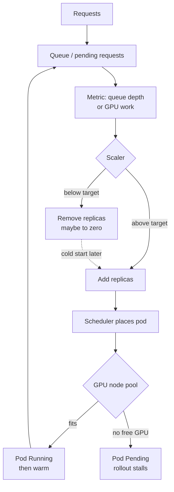

# Model Autoscaling and GPU Scheduling

> **Interview answer (say this first).** Inference autoscaling should follow the work, not the CPU: scale on queue depth, pending requests, or GPU saturation, because a GPU can be fully busy while CPU stays low and a CPU-based scaler reacts far too late. Scale-to-zero saves idle GPU time but pays a cold start, so keep it for batch and rare models and keep a warm floor for interactive chat. On Kubernetes, a GPU is an extended resource: one whole GPU per pod by default, with MIG or time-slicing to share a card. Node pools with taints and tolerations keep model servers on GPU nodes, and bin-packing versus spreading decides how much of each GPU you actually use. Rolling updates need spare GPU capacity, because old and new model pods cannot share the same card.

## Why this exists

A CPU service scales well on CPU. An inference service does not. A GPU serving a large model can sit at full utilization while the host CPU is nearly idle, because the expensive work happens on the accelerator. If you autoscale on CPU, the replicas only multiply after latency has already collapsed. The signal you want is the one that rises before users feel pain: requests waiting in the queue.

There is a second reason this topic is hard: **GPUs are a scarce, indivisible resource**. A CPU can be shared in small slices. A whole NVIDIA GPU in Kubernetes is normally scheduled as one unit per pod, and a pod that needs one GPU cannot fit into half of one. That changes scheduling, bin-packing, and rolling updates in ways that have no CPU analogue.

The failure modes are predictable:

- The scaler adds pods on CPU, but they are too late and the queue keeps growing.
- The scaler scales to zero to save money, and every first request after idle waits through a model load.
- New model pods stay `Pending` forever because no node has a free GPU, so a rolling update stalls.
- One node runs a single small model and wastes 90% of a GPU, while another node is out of GPU memory.
- A traffic spike fills the queue because new replicas cannot warm up fast enough to help.

Autoscaling decides **how many** replicas. Scheduling decides **where** they run. You need both to keep a serving fleet fast and economical.

> **Note:** For GPU inference, CPU utilization is a lagging, misleading signal. Scale on queue depth or a GPU work metric, and treat cold start as a delay the scaler must anticipate rather than react to.

## Start from zero

| Word | Plain meaning |
| --- | --- |
| **Replica** | One running copy of the model server. |
| **Autoscaling** | Adding or removing replicas in response to demand. |
| **HPA** | Horizontal Pod Autoscaler; Kubernetes' built-in replica scaler. |
| **KEDA** | An event-driven scaler that can drive HPA from queues and metrics. |
| **Queue depth** | Requests accepted but not yet being served. |
| **Pending requests** | The same idea as queue depth, seen at the server. |
| **Metric** | A measured number a scaler watches, such as queue depth. |
| **Target value** | The metric value the scaler aims to hold per replica. |
| **Scale-to-zero** | Scaling replicas down to none when idle. |
| **Cold start** | The delay to load and warm a model before it can serve. |
| **Warm floor** | The minimum replicas you keep warm to avoid user-visible cold starts. |
| **Cooldown** | A wait before scaling down again, to avoid flapping. |
| **Stabilization window** | A window over which the scaler looks at past recommendations. |
| **GPU utilization** | How busy the GPU's compute units are. |
| **Saturation** | A resource at or near its limit. |
| **Node pool** | A group of nodes with the same hardware and labels. |
| **GPU node** | A node that has one or more GPUs. |
| **Device plugin** | The agent that advertises GPUs to Kubernetes as schedulable resources. |
| **Extended resource** | A schedulable resource such as `nvidia.com/gpu`, always an integer. |
| **Taint** | A mark on a node that repels pods that do not tolerate it. |
| **Toleration** | A pod's permission to run on a tainted node. |
| **Node selector** | A simple rule that pins a pod to labelled nodes. |
| **Affinity / anti-affinity** | Richer rules for attracting or repelling pods and nodes. |
| **MIG** | Multi-Instance GPU: partitions one physical GPU into isolated slices. |
| **Time-slicing** | Sharing one GPU by switching between pods over time. |
| **Bin-packing** | Filling a few nodes fully instead of spreading across many. |
| **Fragmentation** | Leftover capacity too small to fit the next workload. |
| **Headroom** | Spare capacity kept ready for bursts and failures. |
| **SLO** | Service Level Objective; the latency or availability target you promise. |
| **Rolling update** | Replacing old pods with new ones gradually. |
| **maxSurge / maxUnavailable** | How many extra pods may exist, and how many may be missing, during a rollout. |
| **PDB** | PodDisruptionBudget; a floor on available pods during voluntary disruption. |
| **Pending pod** | A pod the scheduler cannot place yet. |

Two distinctions to hold apart:

- **Scaling signal vs scaling policy.** The signal is what you measure (queue depth). The policy is how you react (target per replica, cooldown, min and max). A good signal with a twitchy policy still flaps.
- **Scheduling vs autoscaling.** Autoscaling creates pods. Scheduling places them. A cluster that cannot place a pod will not benefit from creating more of them.

## The core idea

Picture a car park with a handful of very large spaces. Each space fits exactly one bus, and a bus is a model replica. When cars arrive, you cannot squeeze them into the leftover corners of a space — the space is either occupied by a bus or empty. Adding spaces takes time to build. This is GPU scheduling: large, indivisible units, and leftover room you often cannot use.

Autoscaling is the attendant deciding how many buses to run. The right signal is the **line of waiting passengers** (queue depth), not how hard the drivers are working (CPU). And when you send a bus to the depot to save money, starting it again is slow.

The scaling control loop and the scheduling decision:



How the common signals compare:

| Signal | Rises early? | Available how? | Good for | Risk |
| --- | --- | --- | --- | --- |
| **CPU** | Late, often never | Built in | CPU-bound pre/post work | Misses GPU saturation |
| **GPU utilization** | Early | GPU exporter metric | Compute-bound serving | Noisy at short windows |
| **Queue depth** | Earliest | Server metric | Interactive serving | Needs a real metric pipeline |
| **Pending requests** | Earliest | Server metric | Same as queue depth | Cold start still delays help |
| **Custom business metric** | Varies | Adapter or KEDA | Tokens/s, cost/min | More moving parts |

For most model servers, scale on queue depth with GPU utilization as a guardrail.

## How it works

1. **Measure the right signal.** Export queue depth (requests waiting) from the server. vLLM exposes Prometheus metrics such as `vllm:num_requests_waiting` and `vllm:kv_cache_usage_perc`. Pick the metric that rises first for your workload.
2. **Set a target per replica.** Decide how many waiting requests one replica should absorb. Scale so that queue depth divided by replicas stays near that target. Too low and you over-provision; too high and latency climbs.
3. **Add headroom to the replica count.** Use a safety factor, often 20 to 30 percent, so burst traffic does not immediately saturate every replica.
4. **Cap the replica bounds.** `minReplicas` protects latency; `maxReplicas` protects budget and the rest of the cluster. Never leave either unbounded.
5. **Tune scale-down, not just scale-up.** A cooldown and a stabilization window stop the scaler from flapping when traffic is bursty. Scaling up fast and down slowly is the usual asymmetry.
6. **Decide the floor.** Zero for batch and rare models, one or more for interactive models. The floor is an SLO decision, not only a cost decision.
7. **Advertise GPUs to Kubernetes.** The NVIDIA device plugin registers each GPU as `nvidia.com/gpu`; a pod requests it as an integer. The scheduler treats it as an extended resource and requires the full amount.
8. **Choose whole-GPU or shared.** Whole-GPU gives isolation and predictable memory. MIG partitions a supported card into isolated slices with dedicated memory. Time-slicing multiplexes one GPU across pods with no memory isolation.
9. **Keep model servers on GPU nodes.** Label GPU node pools and use a node selector or affinity, plus tolerations for the GPU taint. This stops CPU workloads from occupying GPU nodes.
10. **Decide pack or spread.** Bin-packing (MostAllocated) fills nodes and frees whole nodes, which is better for scarce GPUs. Spreading (LeastAllocated, the default) improves resilience. Choose per pool.
11. **Plan for fragmentation.** Whole-GPU pods waste leftover memory. MIG slices or smaller models improve density, but add complexity. Track how much GPU memory is allocated versus used.
12. **Make rolling updates fit.** New model pods need a GPU before old pods release one. Set `maxSurge` only if spare GPUs exist; otherwise use `maxUnavailable` and accept a temporary capacity dip. Pair it with a PodDisruptionBudget.
13. **Watch the schedulable headroom.** If every GPU is allocated, a node failure or a rollout has nowhere to go. Keep spare GPU capacity for the SLO you promise.
14. **Close the loop with latency.** Scaling metrics describe load; latency and error rate describe outcomes. Alert when the queue grows while replicas are already at max.

## The syntax you will use

**KEDA drives scale from a real queue metric.** This is the common way to scale vLLM on pending requests.

```yaml
apiVersion: keda.sh/v1alpha1
kind: ScaledObject
metadata:
  name: vllm-queue
spec:
  scaleTargetRef:
    name: vllm-deployment
  minReplicaCount: 0          # keep 1+ for interactive models
  maxReplicaCount: 8
  cooldownPeriod: 300         # seconds before scaling down again
  triggers:
    - type: prometheus
      metadata:
        serverAddress: http://prometheus.monitoring.svc:9090
        query: sum(vllm:num_requests_waiting)
        threshold: "5"        # target waiting requests per replica
```

`threshold` is the per-replica target. KEDA feeds the computed replica count to an HPA.

**A pod pins itself to GPU nodes.** The toleration matches the taint the GPU pool carries.

```yaml
spec:
  template:
    spec:
      nodeSelector:
        accelerator: nvidia-a100     # label on the GPU node pool
      tolerations:
        - key: nvidia.com/gpu
          operator: Exists
          effect: NoSchedule
      containers:
        - name: vllm
          image: vllm/vllm-openai:latest
          resources:
            limits:
              nvidia.com/gpu: "1"    # extended resources: requests must equal limits
```

A whole GPU is requested as `1`. You cannot request `0.5` of a standard `nvidia.com/gpu`; MIG resource names are how you ask for a slice.

**Time-slicing shares one GPU across pods.** The device plugin replicates a single card for scheduling.

```yaml
apiVersion: v1
kind: ConfigMap
metadata:
  name: nvidia-device-plugin-config
data:
  config.yaml: |
    version: v1
    sharing:
      timeSlicing:
        resources:
          - name: nvidia.com/gpu
            replicas: 4          # advertise the GPU four times
```

Time-slicing improves utilization but gives no memory isolation: a pod that over-allocates VRAM can affect its neighbours. Use it for small or bursty models, not for large ones.

**MIG exposes hardware-isolated slices.** On supported GPUs, each slice has its own memory and compute.

```yaml
resources:
  limits:
    nvidia.com/mig-1g.5gb: "1"   # one compute slice with dedicated memory
```

MIG gives isolation closer to a whole GPU at a fraction of the card. Not every GPU supports every profile, so pin the profile in the node pool.

**A rolling update needs a strategy that fits the GPU supply.** `maxSurge: 1` needs one spare GPU.

```yaml
spec:
  strategy:
    type: RollingUpdate
    rollingUpdate:
      maxSurge: 1          # needs a free GPU, or new pods stay Pending
      maxUnavailable: 1    # allows a capacity dip instead of stalling
```

Pair this with a PodDisruptionBudget so voluntary disruptions keep a floor of ready replicas.

**Autoscaling math is a few lines of Python.** Required concurrency comes from Little's law: arrival rate times latency.

```python
import math

def in_flight(arrival_rps, latency_s):
    return arrival_rps * latency_s          # average concurrent requests

def replicas_needed(arrival_rps, latency_s, per_replica_concurrency, headroom=0.25):
    required = in_flight(arrival_rps, latency_s) / per_replica_concurrency
    return math.ceil(required * (1 + headroom))
```

**Metric-driven scaling moves replicas in proportion to the metric.** This is what HPA and KEDA compute internally.

```python
def scaled_replicas(current, current_metric, target_metric, min_r=0, max_r=50):
    if target_metric <= 0:
        return current
    want = math.ceil(current * current_metric / target_metric)
    return max(min_r, min(max_r, want))
```

If the queue is twice the target, the scaler wants twice the replicas.

## Examples: simple to real

**Example 1 — Little's law sizes the fleet.** At 20 requests per second with 1.5 seconds of latency, 30 requests are in flight. At 8 concurrent requests per replica and 25 percent headroom, you need 5 replicas.

```text
20 rps x 1.5 s = 30.0 requests in flight
 5 rps ->  2 replicas
20 rps ->  5 replicas
50 rps -> 12 replicas
```

This is the capacity plan before any autoscaler exists. Autoscaling only moves around this number.

**Example 2 — the scaler scales by the metric ratio.** Doubling the metric roughly doubles the desired replicas, and the bounds clamp the result.

```text
GPU util 0.9 vs target 0.6, 2 replicas -> 3
GPU util 0.2 vs target 0.6, 4 replicas -> 2
queue 120 vs target 20, 3 replicas     -> 18
```

The last line is why you cap `maxReplicas`: a queue spike asks for 18 replicas, and the cluster may not have 18 GPUs.

**Example 3 — scale-to-zero wins only when idle time is long.** Scaling down saves idle GPU-seconds; scaling up spends cold-start GPU-seconds. Assume the replica is at zero and each request arrives alone, so each pays one load plus its service time: roughly 30 s to load and warm plus 8 s of service, i.e. 38 GPU-seconds per cold request. In GPU-seconds per hour:

```text
1 request/hour:   always-on 3600 vs on-demand 38
60 requests/hour: always-on 3600 vs on-demand 2280
600 requests/hour:always-on 3600 vs on-demand 22800
```

In practice one scale-up serves a whole burst, so real cold starts are fewer than requests. The figure is a worst case that shows the shape: at one request per hour, scale-to-zero saves almost the whole GPU-hour; at ten requests per minute, keeping one replica warm costs far less. Multiply by your own GPU price per second for money; the ratio is the durable result.

**Example 4 — bin-packing leaves fragmentation.** Five models with 25, 25, 30, 30, and 20 GB into 80 GB GPUs. First-fit decreasing packs two bins and leaves 30 GB unusable by a whole-GPU pod.

```text
bin1 used=80 free= 0 items=[m30a, m30b, m20a]
bin2 used=50 free=30 items=[m25a, m25b]
total bins=2  fragmentation=30 GB
```

Spreading the same models across three nodes would use more GPUs but leave more resilience. Neither is wrong; the pool policy decides.

**Example 5 — taints keep CPU workloads off GPU nodes.** Without the taint, a cheap batch job can occupy the node, and a model pod stays Pending even though the cluster has a GPU somewhere.

```text
GPU node tainted nvidia.com/gpu=present:NoSchedule
  model pod with toleration  -> scheduled
  plain CPU pod without it   -> not scheduled on this node
```

The taint is what makes the GPU pool a pool instead of an accident.

**Example 6 — a rolling update stalls without spare capacity.** With every GPU allocated and `maxSurge: 1`, the new pod cannot be placed, so the rollout waits.

```text
strategy maxSurge=1, maxUnavailable=0, all GPUs in use
  new ReplicaSet -> 1 pod Pending (no GPU available)
  rollout progress: blocked
fix: add a spare GPU, or set maxUnavailable=1 and accept a capacity dip
```

This is the GPU-specific trap that does not exist for CPU services.

## In production

- **Scale on queue depth or GPU work, never CPU alone.** A busy GPU can coexist with an idle CPU, so CPU scaling adds replicas too late.
- **Add headroom in the replica count.** Autoscaling reacts to demand; headroom absorbs the burst that arrives before new replicas are warm.
- **Keep a warm floor for interactive traffic.** Scale-to-zero is a cost feature that becomes a latency bug when a user hits a cold replica.
- **Tune down-scaling harder than up-scaling.** Fast up, slow down, with cooldown and stabilization windows. Flapping costs cold starts and money.
- **Bound min and max replicas deliberately.** `maxReplicas` is a cluster-safety control, not only a cost control; a queue spike can otherwise ask for more GPUs than exist.
- **Separate GPU node pools by accelerator and size.** Mixed pools cause scheduling failures and unpredictable performance. Label and taint each pool.
- **Choose pack or spread consciously.** Packing conserves scarce GPUs; spreading preserves availability. Default spreading is often wrong for expensive accelerators.
- **Treat whole-GPU requests as indivisible.** A pod requesting `nvidia.com/gpu: 1` cannot share. Use MIG for isolation at a fraction, time-slicing for density without isolation.
- **Watch allocation versus utilization.** A GPU can be allocated and idle. Track utilization per GPU, not just the count of scheduled pods.
- **Plan the rollout for GPU scarcity.** `maxSurge` needs a free GPU; without it, use `maxUnavailable` and a PDB, and tell users about the temporary capacity dip.
- **Keep schedulable headroom for failure.** If every GPU is allocated, one node loss leaves pods Pending. Size for the SLO, not for 100 percent allocation.
- **Alert on the queue, not only on the count.** A growing queue at `maxReplicas` means the fleet is out of capacity, which no replica-count metric will show.

> **Tip:** Autoscaling and cold start are two views of one problem. The scaler decides to add capacity; the cold start decides how soon that capacity helps. If load rises faster than a model can warm, only headroom and a leading metric will save the SLO.

## Interview questions

### 1. Why is CPU utilization a bad autoscaling signal for inference?

**Answer.** The expensive work runs on the GPU, so the CPU can be mostly idle while the GPU is saturated and latency is climbing. By the time CPU rises, the queue has already formed and users are waiting. Scale on a signal closer to the work: queue depth, pending requests, or GPU utilization. These rise before latency does, which gives the scaler time to add a replica that must still warm up.

**Follow-up: "What if preprocessing is CPU-heavy?"** Then CPU matters for that stage, but the model server should still scale on its own queue. Use separate autoscaling for the CPU stage and the GPU stage.

**Trap.** Copying a web-service HPA that targets 70 percent CPU. It works for a stateless CPU API and fails for a GPU model server.

### 2. How do you size an inference fleet before you have an autoscaler?

**Answer.** With Little's law: average concurrent requests equal arrival rate times latency. Divide by how many concurrent requests one replica can hold to get the base replica count, then add headroom, often 20 to 30 percent. Measure the per-replica concurrency from a load test, not from a guess. The autoscaler then moves around that baseline.

**Follow-up: "What changes per-replica concurrency?"** Batch size, quantization, context length, and GPU memory for the KV cache. Long contexts mean fewer concurrent requests per replica.

**Trap.** Sizing from tokens per second alone without latency. Throughput and concurrency are different numbers, and users feel latency.

### 3. When is scale-to-zero a good idea, and when is it a mistake?

**Answer.** It is good for batch jobs, scheduled work, and rare models where the cold start is hidden or acceptable. It is a mistake for interactive, latency-sensitive traffic, because the first request after idle pays the full load and warmup and may breach the SLO. If you must scale to zero, keep a fast cache, a small warm floor, or a queue that holds requests until a replica is ready.

**Follow-up: "How do you decide with numbers?"** Compare idle GPU-seconds saved with cold-start GPU-seconds spent. If starts are frequent and idle periods are short, keep a warm replica. If the model is idle for hours and used rarely, scale to zero.

**Trap.** Scaling to zero on a shared model gateway and assuming the request will just wait a little. Without admission control, the cold-start latency lands on a user or times out.

### 4. Explain whole-GPU, MIG, and time-slicing at a high level.

**Answer.** Whole-GPU means one pod owns one card, scheduled as `nvidia.com/gpu: 1`. It gives full memory and compute isolation and is the simplest to reason about. MIG partitions a supported GPU into hardware-isolated slices, each with dedicated memory and compute, so several pods share a card with isolation. Time-slicing has the device plugin advertise one GPU several times, and the driver switches between pods; it raises utilization but gives no memory isolation.

**Follow-up: "Which is right for a large model?"** Whole-GPU or MIG with enough memory. Time-slicing is for small models or bursty workloads, because a neighbour can consume the VRAM you expected.

**Trap.** Assuming time-slicing gives each pod a guaranteed share. It shares the same memory and compute; the isolation is scheduling, not hardware.

### 5. How do taints, tolerations, and node pools work together?

**Answer.** A node pool is a set of nodes with the same hardware, labelled and usually tainted. The taint repels pods that do not tolerate it; model server pods carry the matching toleration and a node selector or affinity for the pool label. That reserves the expensive GPUs for the workloads that need them and stops CPU pods from taking the space. Different accelerator types get different pools so scheduling is predictable.

**Follow-up: "What happens without the taint?"** Any pod can land on the GPU node, including cheap batch work. The GPU sits unused while model pods stay Pending with nowhere to go.

**Trap.** Using only a node selector without a taint. A selector attracts your pod but does not repel others, so the node can still fill with unrelated work.

### 6. What is bin-packing, and how does fragmentation hurt?

**Answer.** Bin-packing places workloads to fill nodes completely rather than spreading them, which conserves scarce GPUs. Fragmentation is the leftover capacity that no whole-GPU pod can use: a node with 30 GB free cannot host a pod that needs a whole 80 GB card, even though it looks partly free. You reduce it with MIG slices, smaller models, or better packing, and you measure it as allocated versus used GPU memory.

**Follow-up: "Why not always pack?"** Packing reduces resilience. A packed node failure moves many workloads at once, and there may be no room elsewhere. Use packing for scarce accelerator pools, with enough spare capacity for one failure.

**Trap.** Reading "GPU allocated" as "GPU used." An allocated GPU can be idle, and utilization is the number that reflects real work.

### 7. Why are rolling updates harder for model servers?

**Answer.** A new model pod needs a full GPU before the old pod releases one, so a surge rollout requires spare GPU capacity. Without it, new pods stay Pending and the rollout stalls. With `maxUnavailable`, you can free a GPU by stopping an old pod first, but you accept a temporary capacity dip. The rollout also has to wait for each new replica to load and warm before it is ready, so it is slower than a CPU rollout.

**Follow-up: "How do you avoid a capacity dip?"** Keep one spare GPU per pool, or pre-provision a surge node, and warm new replicas before draining old ones. Pair the strategy with a PodDisruptionBudget.

**Trap.** Setting `maxSurge: 1` on a fully allocated GPU cluster and expecting the rollout to finish. It will sit Pending indefinitely.

### 8. How do autoscaling and GPU scheduling interact during a traffic spike?

**Answer.** The scaler sees the queue and adds replicas, but each new pod must be scheduled onto a free GPU, then load and warm its model. If GPUs are scarce or fragmented, pods stay Pending, so the added replicas never serve and the queue keeps growing. The fixes are spare schedulable headroom, a leading metric, a warm floor, and packing policies that keep a GPU available for surge.

**Follow-up: "What is the last line of defence?"** Load shedding and admission control. If the fleet is at max and the queue is still growing, reject or degrade work rather than letting latency grow without bound.

**Trap.** Believing that "the autoscaler will handle it." An autoscaler can only create pods; it cannot create GPUs or make a cold model warm.

## Remember this

- **Scale on queue depth or GPU work, not CPU.** A busy GPU hides behind an idle CPU.
- **Scale-to-zero trades idle GPU time for cold-start latency; keep a warm floor for users.**
- **A GPU is an indivisible extended resource; MIG isolates, time-slicing only multiplexes.**
- **Node pools plus taints and tolerations keep model servers on GPU nodes.**
- **Rolling updates need spare GPU capacity, and fragmentation wastes the GPUs you already own.**
