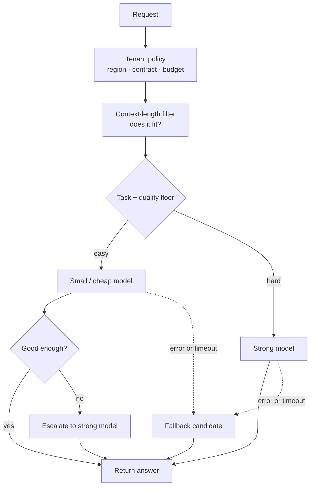

# Model Routing

> **Interview answer (say this first).** Model routing chooses which model serves a request. The axes are task, cost, latency, tenant, and context length: classify goes to a small cheap model, hard reasoning goes to a strong one, long prompts go to whatever fits the context window, and a tenant's contract can filter the catalog. A common pattern is small-model-first: try the cheap model, check the answer, and escalate to a larger model only when confidence is low. Routing also owns fallback to another model or provider, A/B and canary splits, per-model caching, and per-model observability. You can put it in a gateway so it is central and auditable, or in the application when the decision needs deep product context — but pick one owner and keep the decision explainable.

## Why this exists

One model rarely fits every request. A prompt asking "is this email spam?" does not need the same model as one planning a multi-step refund. Using the strongest model for everything is simple and expensive. Using the weakest for everything is cheap and wrong. Routing is how you match work to the cheapest model that clears the quality bar.

Routing also carries availability and safety:

- When a provider has an outage, routing moves traffic to another model or provider.
- When several models fit a tenant's contract and region, routing filters the catalog before choosing.
- When a prompt is longer than a model's context window, routing must exclude that model before the call, not fail after it.
- When you want to compare a new model against the incumbent, routing splits traffic and records which side served each request.

In an agentic system this matters even more. An agent makes many model calls per task: plan, retrieve, summarize, decide, write. Most of those are easy. Sending every step to the largest model multiplies cost, and sending every step to the smallest model multiplies retries and failures. The router is what makes a multi-step agent affordable and reliable.

> **Note:** Routing is a policy decision, not a hard-coded chain. If choosing a model is an `if` buried in application code, you cannot audit it, cache it consistently, or change it without a release. Keep the policy in versioned config and record which route fired.

## Start from zero

| Word | Plain meaning |
| --- | --- |
| **Router** | The component that picks a model for a request. |
| **Routing policy** | The rule that maps a request to a model. |
| **Model catalog** | The list of models you may call, with their properties. |
| **Task** | The labelled kind of work: classify, summarize, reason, write. |
| **Candidate** | A model that is allowed and able to serve this request. |
| **Context window** | The maximum tokens a model can accept in one call. |
| **Context length** | The size of the prompt you are actually sending. |
| **Quality floor** | The minimum quality a model must reach to be considered. |
| **Cost per token** | The price of input and output tokens, usually per million. |
| **TTFT** | Time to first token; the streaming latency a user feels. |
| **Cascade** | Trying a small model first and escalating when needed. |
| **Escalation** | Sending a request (or a retry) to a larger model. |
| **Verifier** | A check that decides whether the small model's answer is good enough. |
| **Confidence** | A score for how sure the model or verifier is. |
| **Small-model-first** | Another name for the cascade. |
| **Fallback** | Trying the next candidate when the chosen one fails. |
| **Failover** | Moving traffic off a failed model or provider. |
| **Canary** | Sending a small percentage of traffic to a new model. |
| **A/B test** | Splitting traffic between two models and comparing outcomes. |
| **Shadow** | Sending a copy of traffic to a new model without using its answer. |
| **Sticky routing** | Keeping one session on the same model for consistency. |
| **Tenant** | The customer or team whose rules constrain routing. |
| **Residency** | A rule that data and models must stay in a region. |
| **Cache key** | The identity of a cached response; it includes the model. |
| **Hit rate** | The share of requests answered from cache. |
| **Gateway** | A shared service that fronts many models. |
| **Observability** | Metrics, logs, and traces that show what each model did. |

Two distinctions to hold apart:

- **Routing vs load balancing.** Routing picks the *kind* of model (small, strong, long-context). Load balancing picks *which instance* of that model serves the request. Both happen, in that order.
- **Cascade vs fallback.** A cascade escalates because the *answer was not good enough*, and it costs an extra call by design. A fallback switches because the call *failed*, and it is an error path.

## The core idea

Think of a hospital triage desk. A nurse sees every patient first and decides how much care is needed. A scraped knee goes home with a bandage; chest pain goes straight to a specialist. If the nurse is unsure, the patient is escalated. This is small-model-first routing with a verifier, and it is the pattern interviewers most want to hear.

The decision path for one request:



The routing axes, on one screen:

| Axis | Question | Example rule | Main risk |
| --- | --- | --- | --- |
| **Task** | What kind of work is this? | classify -> small, reason -> large | Mislabeling sends hard work to a weak model |
| **Cost** | Cheapest model above the floor? | cost first, then quality | Quality drift if the floor is not measured |
| **Latency** | Fastest healthy candidate? | prefer local or small for streaming | Cheapest path is not always fastest |
| **Tenant** | What is the contract? | EU-only, plan tier, budget cap | Catalog sprawl and ops cost |
| **Context length** | Does the prompt fit? | exclude small models over 8k tokens | A late failure instead of a clean route |

A routing decision should be **explainable and recorded**. Every response should carry the chosen model, the route, and the reason. When cost or quality moves, that one field tells you whether the traffic mix, the config, or the model itself changed.

## How it works

1. **Build a model catalog.** For each model record its provider, context window, cost, measured quality per task, region, and health. Routing is impossible without these facts.
2. **Filter by tenant and region first.** Remove models the tenant is not allowed to use and models in the wrong region. This happens before any cost or quality sort, so a forbidden model can never be chosen as a fallback.
3. **Filter by context length.** Drop models whose context window is smaller than the prompt. Do it before the call, so an over-long prompt is rejected cleanly instead of failing at the provider.
4. **Apply the quality floor.** Keep only models that meet the minimum measured quality for this task. A cost route without a quality floor is just a way to get worse answers more cheaply.
5. **Rank the survivors by the chosen objective.** Cost, latency, or quality, depending on the request class. Keep the rest in order as fallbacks.
6. **Try the primary.** Record the attempt, its latency, its token usage, and its cost.
7. **Verify when cascading.** Run a cheap verifier: a confidence score, a schema check, a rule check, or a small classifier. If the answer passes, return it. If it fails, escalate.
8. **Escalate on low confidence.** Send the same request to the next, stronger model, carrying the small model's draft when that helps. Record the escalation so you can measure how often it happens.
9. **Fall back on failure.** On a timeout, a rate limit, or a provider error, try the next candidate in the ranked list. Fall back only on retryable errors; a malformed request fails everywhere.
10. **Split traffic for experiments.** Route a stable percentage to a canary model by hashing a request or session id, so the same user stays on the same side and comparisons are fair.
11. **Cache per model.** Include the model, its version, the parameters, and the tenant in the cache key. A cached answer from the small model must never be served as if the large model produced it.
12. **Observe per model.** Track latency, TTFT, tokens, cost, error rate, escalation rate, cache hit rate, and quality signals for each model and route. Aggregate numbers hide a bad model behind a good one.

## The syntax you will use

**A route table is config, not code.** This is the shape of a real policy document.

```yaml
task_routes:
  classify:
    primary: local-small
    fallback: [hosted-mid]
  reason:
    primary: hosted-mid
    require_min_context: 32768
    fallback: [hosted-large]
tenants:
  eu-resident:
    allowed_models: [local-small, hosted-mid]   # residency filter
quality_floors:
  classify: 0.70
  reason: 0.85
```

Editing this file changes routing without a code release.

**The router is a pure function over the catalog.** Filter, then rank, and raise a clear error when nothing fits.

```python
# cost is USD per 1M tokens; quality is a measured score in [0, 1]
CATALOG = {
    "local-small":  {"ctx": 8192,  "cost": 0.10, "quality": 0.72},
    "hosted-mid":   {"ctx": 32768, "cost": 1.00, "quality": 0.86},
    "hosted-large": {"ctx": 200000,"cost": 8.00, "quality": 0.94},
}
TENANT_ALLOWED = {
    "acme":        set(CATALOG),
    "eu-resident": {"local-small", "hosted-mid"},   # residency filter
}
QUALITY_FLOORS = {"classify": 0.70, "reason": 0.85}

def route(task, context_tokens, tenant, quality_floor=None):
    floor = QUALITY_FLOORS.get(task) if quality_floor is None else quality_floor
    allowed = TENANT_ALLOWED.get(tenant, set(CATALOG))
    candidates = [m for m in CATALOG
                  if m in allowed and CATALOG[m]["ctx"] >= context_tokens]
    if not candidates:
        raise ValueError(f"no model fits {context_tokens} tokens for {tenant}")
    if floor is not None:
        ok = [m for m in candidates if CATALOG[m]["quality"] >= floor]
        if not ok:
            raise ValueError(
                f"no model meets quality floor {floor} for {task}")
        candidates = ok
    return min(candidates, key=lambda m: CATALOG[m]["cost"])
```

The function is deterministic and testable, which is exactly what a router should be.

**A cascade tries cheap first and escalates.** The verifier is the decision point.

```python
def cascade(confidence, small_cost, large_cost, threshold=0.7):
    spent = small_cost
    if confidence >= threshold:
        return "small", spent
    spent += large_cost                 # pay for the escalation
    return "large", spent
```

**Fallback is iteration with a typed error.** Try the ranked candidates until one succeeds.

```python
class ProviderError(Exception):
    pass

def call_chain(chain, call):
    errors = []
    for name in chain:
        try:
            return name, call(name), errors
        except ProviderError as exc:
            errors.append(f"{name}: {exc}")
    raise ProviderError("all models failed: " + "; ".join(errors))
```

**Canary and A/B use a stable hash.** The same key lands in the same bucket, so users do not flip between variants.

```python
import hashlib

def bucket(key, buckets=100):
    return int(hashlib.sha256(key.encode()).hexdigest()[:8], 16) % buckets

def variant(request_id, canary_pct=10):
    return "canary" if bucket(request_id) < canary_pct else "stable"
```

Hashing the session id keeps a conversation on one model, which matters when answers must be consistent.

**The cache key includes the model.** This is the rule that prevents cross-model mix-ups.

```python
import json

def cache_key(model, version, params, prompt, tenant):
    material = "|".join([
        model,
        version,
        json.dumps(params, sort_keys=True),   # stable across dict ordering
        tenant,
        prompt,
    ])
    return hashlib.sha256(material.encode()).hexdigest()[:12]
```

**The response records the decision.** Observability starts with a field that says what happened.

```json
{
  "model": "hosted-mid",
  "route": "reason:quality_floor=0.85",
  "fallback_used": false,
  "escalated": false,
  "cache": "miss",
  "usage": {"prompt_tokens": 5200, "completion_tokens": 180},
  "latency_ms": 940,
  "cost_usd": 0.00538
}
```

**LiteLLM expresses fallbacks in config.** A real gateway can hold the policy for you.

```python
from litellm import completion
# a gateway holds model_list and fallbacks in config; inline is a local shortcut
resp = completion(model="hosted-mid", messages=messages,
                  fallbacks=["hosted-large"])
```

## Examples: simple to real

**Example 1 — task and context length pick the model.** Easy work goes small; long work goes to a model with a big enough window.

```text
classify 500 tokens, acme       -> local-small
reason   4,000 tokens, acme     -> hosted-mid
reason   50,000 tokens, acme    -> hosted-large
```

Note that the 50k request had no small candidate at all: the context filter removed it before cost was considered.

**Example 2 — tenant policy filters the catalog, and an impossible request is rejected.** An EU-resident tenant may not use a US-only endpoint, so a request that only that endpoint could serve fails cleanly.

```text
reason 50,000 tokens, eu-resident -> rejected: no model fits 50000 tokens for eu-resident
```

A clear rejection at routing time is far better than a provider error after a slow call.

**Example 3 — the cascade escalates only when confidence is low.** With a threshold of 0.7:

```text
conf=0.95 -> small cost=0.10   (always_large = 8.00)
conf=0.80 -> small cost=0.10
conf=0.60 -> large cost=8.10
conf=0.30 -> large cost=8.10
```

Break-even on cost alone: the cascade beats always-large when the escalation rate is below `1 - small_cost / large_cost`, here 98.75 percent. In practice you set the threshold from measured quality, not cost alone.

**Example 4 — fallback keeps the request alive.** The primary is down, so the next healthy candidate serves it.

```text
fallback chosen: hosted-mid   tried: ['local-small: unavailable']
```

If every candidate fails, the caller gets one typed error instead of a stack trace.

**Example 5 — a canary split is stable and proportionate.** Hashing one request id per request lands about the expected share in each bucket.

```text
canary count in 10,000 requests: 978   (target 10%)
same request is sticky: True
```

Because the bucket is stable, repeated calls from one session do not flip between variants.

**Example 6 — the cache is keyed by model.** The same prompt has different answers from different models, so it must have different keys.

```text
key local-small,  v1, {'temperature': 0}, "hello", acme  = 722af238ac7f
key hosted-large, v1, {'temperature': 0}, "hello", acme  = 000b342f5c9c
keys differ: True
```

Sharing a cache across models would serve a small model's answer as a large model's.

## In production

- **Make the decision explainable and record it.** Emit the chosen model, route, and reason on every response. When cost or quality moves, that field is the first thing you read.
- **Filter before you rank.** Tenant, region, and context filters come first. If you rank first and filter later, a forbidden or too-small model can leak in as a fallback.
- **Never route by the model name the caller typed.** Map intent to an allowed catalog, or tenants will pick the most expensive model.
- **Put a quality floor on every cost route.** The cheapest model is only correct if it clears the bar for that task. Measure the bar with offline evals and online signals.
- **Measure before you cascade.** A cascade costs an extra call on every escalation. Know your escalation rate and the quality you gain; otherwise you have added latency and complexity for nothing.
- **Keep the verifier cheap.** If verifying the small model costs as much as the large model, the cascade loses its point. Use confidence scores, schema checks, and rules, and reserve model-based judges for the cases that need them.
- **Fall back only on retryable errors, and keep the fallback warm.** Timeouts, rate limits, and provider errors are worth another candidate; a validation error will fail everywhere. Exercise the backup regularly, or it will be cold and rate-limited when you need it.
- **Hash for stickiness, and respect session boundaries.** Canary by session means each session sees one model. It makes comparisons fair and avoids a user seeing two different writing styles in one conversation.
- **Include the model and version in every cache key.** Model version, parameters, tools, and tenant all change the answer.
- **Observe per model and per route, not only in aggregate.** A failing model can hide behind overall averages. Alert on per-model error rate, p95 latency, escalation rate, and cache hit rate.
- **Version the routing config and roll it back fast.** A bad route change is an outage. Treat it like a deploy, with a review and a one-step rollback.
- **Decide where routing lives, and keep one owner.** A shared gateway gives central policy, audit, and caching. Application routing gives deep context about the task. Splitting the decision across both without a clear owner creates drift and double-counted budgets.

> **Tip:** For agents, route per step, not per conversation. Planning and verification may need a strong model; extraction, classification, and formatting usually do not. The cheapest large saving in an agent is often the boring middle steps.

## Interview questions

### 1. What are the main axes for routing a request to a model?

**Answer.** Task, cost, latency, tenant, and context length. Task selects a quality tier, cost picks the cheapest model above a floor, latency prefers the fastest healthy candidate, tenant filters by contract and region, and context length removes models whose window is too small. In practice you filter by tenant and context first, then rank the survivors by cost, latency, or quality.

**Follow-up: "Which axis do candidates disagree about?"** Cost and latency often trade off: a local model may be cheap but slow, or fast but weak. Measure per model rather than assuming.

**Trap.** Routing only by task labels. A mislabelled hard request goes to the weak model, and the router has no fallback because it never considered the context or the quality floor.

### 2. Explain small-model-first routing and when it is worth it.

**Answer.** Send the request to a small, cheap model, check the answer with a cheap verifier, and escalate to a larger model only when the verifier is not satisfied. It is worth it when most requests are easy, the verifier is much cheaper than the large model, and the quality of escalated answers matches always-large. If escalation is common or the verifier is expensive, the savings disappear.

**Follow-up: "Why does the break-even matter?"** The cascade pays the small cost on every request plus the large cost on escalations. It beats always-large when the escalation rate is below `1 - small_cost / large_cost`. With a small model at 0.10 and a large at 8.00, that threshold is `1 - 0.10/8.00 = 0.9875`, about 98.75 percent.

**Trap.** Cascading without measuring quality. If the small model fails silently and the verifier misses it, you save money by shipping worse answers.

### 3. What is a verifier, and how do you keep it cheap?

**Answer.** A verifier decides whether the small model's answer is good enough to return. Cheap verifiers include a model confidence score, a schema or format check, a rules check, a retrieval match, or a tiny classifier trained for the task. A model-based judge is the most accurate and the most expensive, so use it sparingly. The verifier must cost far less than the large model, or the cascade has no purpose.

**Follow-up: "What if there is no confidence score?"** Use structural checks: valid JSON, required fields, no refusal, citations that resolve. Escalate on any failure. This catches most bad small-model answers cheaply.

**Trap.** Treating the small model's own stated confidence as ground truth. Models are often confidently wrong, so calibrate the score against real outcomes.

### 4. How does fallback differ from a cascade?

**Answer.** A cascade is a deliberate quality strategy: the small model answers, the verifier rejects, and the request escalates by design. A fallback is an error path: the chosen model times out or errors, so the router tries another candidate. A cascade usually costs an extra call on escalation; a well-tuned fallback costs nothing until something fails. Both use a ranked candidate list, but for different reasons.

**Follow-up: "Should fallback be on every error?"** No. Fall back on retryable classes such as timeouts, rate limits, and provider 5xx. A malformed request or a policy denial will fail on every model, so retrying just adds cost and latency.

**Trap.** Confusing a fallback with a retry of the same model. Retrying the same dead endpoint adds load; falling back to a different model or provider preserves availability.

### 5. How do you run an A/B or canary test at the routing layer?

**Answer.** Split traffic by a stable hash of a session or request id, so the same user stays on one side. Send a small percentage to the canary model and keep the rest on the incumbent. Record the chosen variant on every request, and compare quality, cost, latency, and error rate per variant. Start small, watch guardrails, and keep an instant rollback. A shadow run, where you send a copy of traffic to the new model without using its answer, is a safe first step.

**Follow-up: "Why hash the session rather than randomize each request?"** Consistency. If a user sees two different models in one conversation, quality comparisons are confounded and the experience is jarring.

**Trap.** Comparing raw averages without controlling for traffic mix. A canary that happens to serve easier requests looks better than it is, so compare per task or per tenant.

### 6. Why must the cache key include the model?

**Answer.** The same prompt produces different answers from different models, and often different token costs. If the cache key omits the model, a response generated by the small model can be served to a request routed to the large model. Include the model, its version, the parameters, and the tenant, because every one of those changes the answer or the privacy boundary.

**Follow-up: "What about semantic caching?"** It needs a high similarity threshold, a per-tenant boundary, and a way to invalidate. It saves money but risks returning an answer that is close but not right, so measure it and keep it off by default.

**Trap.** Keying on the prompt text alone. Temperature, tools, system prompt, and model version all change the output.

### 7. Where should routing live: a gateway or the application?

**Answer.** A shared gateway gives one place for policy, credentials, caching, fallback, metering, and audit, and it makes changes config rather than deploys. Application routing sees product context the gateway cannot: which agent step this is, how hard the task is, and what business rules apply. Many systems do both: the application passes intent and constraints, and the gateway owns the catalog, fallback, and observability. The important thing is one owner per decision.

**Follow-up: "What goes wrong when both route?"** The two policies drift, budgets are double-counted, and no single place explains why a model was chosen. Keep the split explicit: application sets intent, gateway selects within it.

**Trap.** Letting the application hold provider credentials and fallback logic. Credentials spread, failover becomes inconsistent, and cost accounting fragments.

### 8. What do you observe per model, and why not only in aggregate?

**Answer.** Per model and per route, track request count, error rate, p50 and p95 latency, TTFT, input and output tokens, cost, escalation rate, cache hit rate, and a quality signal such as a judge score or a task success rate. Aggregate numbers hide a failing or expensive model behind healthy traffic. Per-model metrics tell you which route to change, which model to retire, and whether a canary is winning.

**Follow-up: "How do you catch routing drift?"** Alert on the distribution of chosen models over time. A config change or a new tenant can shift traffic to an expensive model silently; the route field and the distribution reveal it.

**Trap.** Logging only the model the caller requested. Log the model that actually served the request, plus whether fallback or escalation happened.

## Remember this

- **Filter first (tenant, region, context), then rank by cost, latency, or quality.**
- **Small-model-first plus a cheap verifier and escalation is the pattern to know; measure the escalation rate.**
- **Fallback is for failures, escalation is for low confidence.** Different paths, different costs.
- **Canary and A/B split by a stable hash, and always record which variant served the request.**
- **Include the model and version in the cache key, and observe every model separately.**
