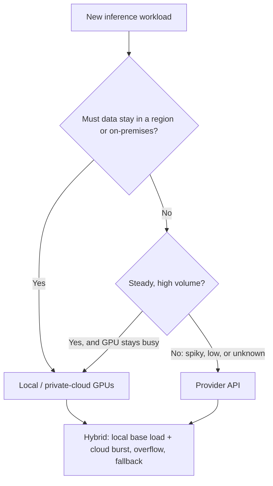

# Local, Cloud, and Hybrid Models

> **Interview answer (say this first).** "Local" means you run the model on GPUs you own or rent yourself; "cloud" means you call a provider's model over an API. Local wins on data control, offline operation, predictable high-volume cost, and sometimes latency. Cloud wins on zero capital cost, instant access to the newest and largest models, elasticity for spiky traffic, and no operational burden. Most real systems are **hybrid**: local for steady, sensitive, or high-volume traffic, cloud for burst, overflow, and fallback. The decision is not "which is better" — it is which constraints (residency, volume, latency, model quality, team size) dominate, and the honest answer is usually a per-workload split, backed by a breakeven calculation and a routing layer.

## Why this exists

Every AI system eventually asks the same question: where does the model actually run? For a prototype the answer is trivial — call an API. For a production system that serves millions of requests, stores regulated data, or must work when a network link goes down, the answer becomes a design decision with direct consequences for cost, latency, compliance, and reliability.

The two options pull in opposite directions. Running your own GPUs means you pay upfront for hardware, then pay again in power, cooling, and engineering time — whether or not traffic shows up. Calling a provider means you pay only for what you use, but you pay a markup for someone else's hardware and you send your data across a network to a place you do not control.

Neither is universally correct. A startup with a spiky product should not buy GPUs. A bank with a fixed nightly batch and a residency rule should not send customer records to a third party. A team that needs the newest frontier model has no local option at all, because open weights for that model may not exist. A team with a well-understood workload and steady demand may find that owning is several times cheaper per token.

This chapter gives you the vocabulary and a decision framework, so you can defend a choice with numbers instead of taste.

> **Note:**
>
> **The one-sentence purpose.** Decide where inference runs by comparing data rules, volume, latency, model availability, and operations — then split the traffic, don't pick one side.

## Start from zero

| Word | Plain meaning |
| --- | --- |
| **Inference** | Running a trained model to produce an answer. |
| **Local inference** | Running the model on hardware you operate: your own GPUs or reserved instances. |
| **Cloud / hosted inference** | Calling a provider's model over an API; you never touch a GPU. |
| **On-premises** | Hardware physically in your own data center. |
| **Private cloud** | Cloud GPUs that only your account can use, in a region you choose. |
| **Capex** | Capital expenditure: money spent upfront, for example buying a GPU node. |
| **Opex** | Operating expenditure: ongoing costs, for example power, cooling, and SaaS. |
| **Total cost of ownership (TCO)** | Capex plus opex plus the people cost of running the thing. |
| **VRAM** | Video RAM: the GPU memory that holds model weights and the KV cache. |
| **Utilization** | The fraction of time (or capacity) the GPU is actually doing useful work. |
| **Idle time** | GPU time you paid for but did not use. The main hidden cost of ownership. |
| **Throughput** | Tokens generated per second, usually across all concurrent requests. |
| **Latency** | Time from request to response; in streaming, time to first token matters most. |
| **Time to first token (TTFT)** | How long the user waits before text starts to appear. |
| **Elasticity** | The ability to add or remove capacity in seconds as demand changes. |
| **Burst** | A short, large spike in traffic, for example a product launch or a nightly job. |
| **Fallback** | A backup path used when the primary path fails. |
| **Overflow** | Sending traffic that local capacity cannot handle to the cloud. |
| **Data residency** | A legal requirement that data stays inside a country or region. |
| **Data sovereignty** | Broader control over data, including who can access it and under which laws. |
| **Egress** | Data leaving a network or cloud region, often billed per gigabyte. |
| **Data processing agreement (DPA)** | A contract that constrains what a provider may do with your data. |
| **Routing** | Choosing which backend (local or cloud) handles each request. |
| **Right-sizing** | Picking hardware that matches the workload instead of overbuying. |
| **Warm pool** | Already-running instances kept ready so requests do not hit a cold start. |
| **Spot / preemptible instance** | Cheap cloud GPU capacity that can be taken away with little notice. |

Two distinctions matter from the start:

- **Where the model runs vs where the data goes.** A self-hosted model in a cloud region is "local" in control terms but still in someone's data center. A rented bare-metal GPU is local in network terms but also rented. Be precise about which property you mean.
- **The marginal cost of a token is not the price of a token.** On a provider you pay per token. On your own GPU the cost per token depends on how full the GPU is; idle capacity makes each token expensive.

## The core idea

Think about getting around a city. You can own a car or take taxis. Owning is cheaper per trip once you drive enough, and it is always available at 3 a.m. But you pay for insurance, parking, and maintenance even on days you stay home, and you cannot instantly switch to a sports car when you want one. Taxis cost more per trip but have zero fixed cost, appear in seconds, and you never change the oil. A commuter with a fixed route should probably own; a tourist with three trips a month should not. Most households do both: a car for the daily commute, a taxi to the airport.

That is exactly the local-vs-cloud question, and exactly why the answer is usually hybrid.

Here is the shape of the decision:



The six axes that decide it:

| Axis | Favors local | Favors cloud |
| --- | --- | --- |
| **Data control** | Regulated data, residency rules, no third party in the path | Ordinary data, a DPA is acceptable |
| **Cost** | Steady high volume, high utilization, predictable load | Low or spiky volume, no upfront budget |
| **Latency** | Sub-10 ms network, offline or edge, no cross-region hop | Provider region is close, latency is good enough |
| **Models** | Open weights are good enough and you can tune them | You need the newest or largest frontier model |
| **Ops** | You have a platform team and want full control | You have a small team and want no hardware work |
| **Elasticity** | You can absorb the peak with spare capacity | You need to grow 10x for an hour and shrink back |

A short comparison of the two pure options:

| Property | Local (own or reserve GPUs) | Cloud provider API |
| --- | --- | --- |
| Upfront cost | High (capex or reservation) | None |
| Cost per token | Falls as utilization rises | Fixed, set by the provider |
| Scaling | Slow: buy, rack, warm | Instant, within quota |
| Newest models | Only what is open-weight | Usually first |
| Data location | Fully under your control | Provider's region, per contract |
| Failure domain | Your rack, your power, your bugs | Provider's outages, your fallbacks |
| Engineering load | High: drivers, serving, upgrades | Low: an SDK and an API key |
| Ceiling on quality | Whatever open weights can do | The best available model |

> **Note:**
>
> **The breakeven insight.** For a GPU you own, the cost per token is roughly `monthly cost / (tokens per second x seconds per month x utilization)`. Because utilization is in the denominator, an idle GPU is brutally expensive and a busy one is cheap. The whole local-vs-cloud argument is usually an argument about utilization.

## How it works

1. **Classify the workload before choosing hardware.** Is traffic steady or spiky? Is the data regulated? How much output-token volume per month? What model quality is required? Write the answers down; the decision follows from them.
2. **Estimate monthly token demand.** Take requests per second, average input and output tokens, and multiply out. Both cost models need this number.
3. **Compute the cloud cost.** `tokens / 1e6 x price per million tokens`, summed over input and output. This is easy and needs no capital.
4. **Compute the local TCO.** `(capex / life in months) + monthly opex`, including power, cooling, and a share of the platform team's salary. Do not forget the people.
5. **Estimate achievable utilization.** Real systems rarely exceed 50–70% for long. If your demand cannot keep the GPU above the breakeven utilization, local loses.
6. **Find the breakeven volume.** The token volume at which local monthly cost equals cloud monthly cost — equivalently, the volume at which the local cost per token equals the cloud price per token. Below it, cloud is cheaper; above it, local is.
7. **Check the non-cost gates.** Residency, offline requirement, model availability, and latency may override the arithmetic entirely.
8. **Design the hybrid split.** Local handles the base load and sensitive traffic; cloud handles overflow, burst, and fallback. Route with a priority rule: sensitive traffic pinned local, normal traffic local-first, overflow to cloud when local queue time crosses a threshold.
9. **Make routing observable.** Track queue depth, TTFT, error rate, and cost per backend. The split should move automatically as conditions change.
10. **Plan for the failure of each side.** Local node dies: fail over to cloud. Cloud provider degrades: serve from local, degraded. Provider rate-limits you: queue or shed. Every path needs a defined behavior.
11. **Revisit quarterly.** GPU prices, provider prices, model quality, and your own volume all move. A decision that was right last year may be wrong now.

The subtle steps are 4, 5, and 8. Most bad local decisions ignore the people cost and overestimate utilization. Most bad cloud decisions ignore the per-token markup at scale.

### The hybrid patterns

- **Local-first, cloud overflow.** Keep local capacity sized to the median load, and send the peak to cloud. You pay cloud prices only for the burst.
- **Cloud-first, local fallback.** Use cloud for normal traffic and keep a small local node for outages and emergencies. Cheaper floor, weaker guarantee.
- **Sensitive local, general cloud.** Pin regulated or high-value traffic to local GPUs and send everything else to a provider. This is the most common regulated-industry pattern.
- **Train local, serve cloud (or the reverse).** Fine-tuning may need data control while serving does not, or vice versa. The two stages do not have to match.
- **Edge plus center.** A small local model handles simple, low-latency cases; a cloud model handles hard cases. Latency and cost both improve if the small model is good enough.

## The syntax you will use

**Calling a provider API.** This is the cloud path: no GPU, pay per token, model name selects the backend.

```python
from openai import OpenAI

client = OpenAI()  # reads OPENAI_API_KEY from the environment
resp = client.chat.completions.create(
    model="gpt-4o-mini",
    messages=[{"role": "user", "content": "Summarize this ticket."}],
)
```

**Serving locally behind the same interface.** A local server speaks the same HTTP shape, so the client code barely changes.

```bash
# vLLM exposes an OpenAI-compatible server
vllm serve meta-llama/Llama-3.1-8B-Instruct \
  --host 0.0.0.0 --port 8000 \
  --max-model-len 8192
```

**Pointing one client at either backend.** `base_url` is the only difference; an environment variable makes the switch deploy-time.

```python
import os
from openai import OpenAI

client = OpenAI(
    base_url=os.environ["MODEL_BASE_URL"],  # local: http://gpu-node:8000/v1
    api_key=os.environ.get("MODEL_API_KEY", "not-needed-locally"),
)
```

**A local-first router with cloud fallback.** The router decides per request from a policy, not from code scattered everywhere.

```python
def choose_backend(sensitive: bool, local_queue_s: float, threshold_s: float = 2.0) -> str:
    if sensitive:
        return "local"                 # data must not leave
    if local_queue_s > threshold_s:
        return "cloud"                 # local is congested; overflow
    return "local"                     # default: cheaper when utilized
```

**A GPU node pool in Kubernetes.** Local serving is a deployment that requests a GPU resource and tolerates a node.

```yaml
spec:
  template:
    spec:
      nodeSelector:
        cloud.google.com/gke-accelerator: nvidia-l4
      containers:
        - name: vllm
          resources:
            limits:
              nvidia.com/gpu: "1"
```

**Choosing a region for residency.** The provider's region is part of the compliance story; make it explicit and auditable.

```python
client = OpenAI(base_url="https://eu.example-provider.com/v1")  # data stays in the EU region
```

**Adding a fallback that does not hide failures.** Fail over to a cheaper model only when the primary fails, and record that you did.

```python
try:
    return call_cloud(prompt)
except (TimeoutError, ConnectionError):
    metrics.increment("cloud_fallback_used")
    return call_local(prompt)
```

| Decision | Typical knob | Effect |
| --- | --- | --- |
| Where traffic goes | routing policy | cost, latency, residency |
| How much local | node count / reserved capacity | base load covered, idle risk |
| How much overflow | queue threshold, concurrency cap | burst tolerance |
| Which region | `base_url` / region setting | residency compliance |
| What is pinned | sensitive-tenant flag | data control |

## Examples: simple to real

All examples are pure Python. Every number is an **illustrative example input**, not a real vendor price or benchmark. Substitute your own quotes.

**Example 1 — monthly local cost and the breakeven volume.** We assume one GPU node and compare it to a per-token price.

```python
CAPEX = 40_000.0          # illustrative: one GPU node
LIFE_MONTHS = 36
MONTHLY_OPEX = 800.0      # power, cooling, ops share
PRICE_PER_MTOK = 5.0      # illustrative cloud price, $ per 1M tokens
THROUGHPUT_TOK_S = 1500.0 # illustrative sustained output tokens/sec

monthly_local = CAPEX / LIFE_MONTHS + MONTHLY_OPEX
breakeven_tokens = monthly_local / PRICE_PER_MTOK * 1e6
capacity_100 = THROUGHPUT_TOK_S * 30 * 24 * 3600

print(round(monthly_local, 2))          # 1911.11
print(round(breakeven_tokens / 1e6, 1)) # 382.2   million tokens/month
print(round(capacity_100 / 1e9, 2))     # 3.89    billion tokens/month
```

The node costs about **$1,911 per month** all-in. At an illustrative $5 per million tokens, you need to serve about **382 million tokens per month** just to break even. That is only about 10% of the node's **nameplate capacity** — its maximum possible monthly output if it ran flat out at 100% utilization — which is the encouraging part: a GPU that is even lightly busy can beat per-token pricing.

**Example 2 — utilization decides everything.** The same node, four different utilizations:

```python
def cost_per_mtok(util):
    tokens = capacity_100 * util
    return monthly_local / (tokens / 1e6)

for u in (0.80, 0.50, 0.20, 0.05):
    print(f"util {u:.2f} -> ${cost_per_mtok(u):.2f} per M tokens")
```

```text
util 0.80 -> $0.61 per M tokens
util 0.50 -> $0.98 per M tokens
util 0.20 -> $2.46 per M tokens
util 0.05 -> $9.83 per M tokens
```

At 5% utilization the GPU is nearly twice as expensive as the illustrative cloud price. **Idle capacity is the hidden cost of ownership**, and it is why "we'll buy GPUs and figure out utilization later" so often becomes a budget surprise.

**Example 3 — hybrid split beats either pure option.** Local serves the base load; cloud absorbs the overflow.

```python
demand = 1.5e9
local_served = 1.0e9
overflow = demand - local_served
cloud_overflow_cost = overflow / 1e6 * PRICE_PER_MTOK
hybrid_total = monthly_local + cloud_overflow_cost
all_cloud = demand / 1e6 * PRICE_PER_MTOK

print(round(overflow / 1e6, 1))              # 500.0
print(round(cloud_overflow_cost, 2))         # 2500.00
print(round(hybrid_total, 2))                # 4411.11
print(round(all_cloud, 2))                   # 7500.00
print(round(all_cloud - hybrid_total, 2))    # 3088.89
```

At 1.5 billion tokens per month the hybrid saves about **$3,089 per month** versus all-cloud, while the local node still has headroom. This is the classic hybrid argument: size local for the base, buy the peak from someone else.

**Example 4 — egress is small; residency is the real issue.** Send 1 KB? No — send context. Here 1M requests each carry 8 KB of prompt.

```python
REQUESTS = 1_000_000
PROMPT_BYTES = 8 * 1024
OUTPUT_TOKENS = 500
EGRESS_PER_GB = 0.09       # illustrative
egress_gb = REQUESTS * PROMPT_BYTES / 1e9
egress_cost = egress_gb * EGRESS_PER_GB
compute_cost = REQUESTS * OUTPUT_TOKENS / 1e6 * PRICE_PER_MTOK

print(round(egress_gb, 2))                          # 8.19 GB
print(round(egress_cost, 2))                        # 0.74
print(round(compute_cost, 2))                       # 2500.0
print(round(egress_cost / compute_cost * 100, 4))   # 0.0295 %
```

Egress is about **0.03%** of compute here. So do not choose local only to save on transfer bills. You choose local for **data residency, contractual control, and offline operation** — the cost argument is secondary at this volume. (Bulk data movement, such as shipping a large training corpus, is a different story.)

**Example 5 — the crossover moves with growth.** A startup starts small and grows 10% per month. When does owning beat renting?

```python
start, growth = 200e6, 0.10
cloud_cum = local_cum = 0.0
crossover = None
for m in range(1, 49):
    demand_m = start * (1 + growth) ** (m - 1)
    cloud_cum += demand_m / 1e6 * PRICE_PER_MTOK
    local_cum += monthly_local
    if crossover is None and cloud_cum >= local_cum:
        crossover = m

print(crossover)                                              # 14
print(round(start * (1 + growth) ** (crossover - 1) / 1e6, 1))  # 690.5
```

Cumulative cloud spend overtakes cumulative local spend in **month 14**, when monthly demand reaches about **690 million tokens**. Before that, renting is cheaper because the hardware would sit idle. This is the calculation to bring to an interview: not "local is cheaper" but "local is cheaper past this volume, and we grow past it in this many months."

**Example 6 — latency is a network story too.** For a multi-turn agent, every model call adds a round trip. Local removes most of that.

```python
CLOUD_RTT_MS, LOCAL_RTT_MS, TURNS = 30.0, 1.0, 10
cloud_net = TURNS * CLOUD_RTT_MS
local_net = TURNS * LOCAL_RTT_MS

print(cloud_net)                # 300.0
print(local_net)                # 10.0
print(cloud_net - local_net)    # 290.0
```

A 10-turn agent pays about **290 ms** extra just in network round trips to a cloud region, before any compute. That matters when each turn is short. It matters far less when each turn generates hundreds of tokens, because generation time dominates. **Measure the whole request, not the network hop.** For an offline or air-gapped deployment, local is not a speed choice at all — it is the only option.

## In production

- **Calculate, then decide; do not decide by vibe.** Bring the monthly token volume, the utilization estimate, and the TCO. "Local is cheaper" without utilization is a guess.
- **People cost is real capex.** Drivers, CUDA versions, serving engines, security patches, and on-call for GPU nodes are ongoing opex. A small team usually underestimates this by a lot.
- **Utilization is the number that kills local projects.** Below the breakeven utilization, per-token cost exceeds cloud. Consolidate workloads onto fewer, busier GPUs before buying more.
- **Residency is a hard gate; egress usually is not.** If data cannot leave a region, cloud is disqualified or restricted to a compliant region under a DPA. Per-request egress is noise by comparison, though bulk data movement can still surprise you.
- **Newest models are a cloud advantage you cannot self-host.** If the task needs a frontier model, local open weights are not a substitute, regardless of cost.
- **Design overflow before you need it.** Local capacity sized to the peak is mostly idle; capacity sized to the median needs a cloud path for the peak. Define the threshold that triggers overflow.
- **Pin sensitive traffic; do not rely on emergent routing.** A bug in a cost-based router must never send regulated data to a provider. Pin it in configuration and test the pin.
- **Cold starts apply to local too.** A GPU node that scales to zero takes minutes to load weights. Keep a warm pool for latency-sensitive paths (chapter 9).
- **Spot capacity is cheap and can vanish.** Good for batch and offline work, dangerous for interactive serving unless you have a warm fallback and checkpointing.
- **Provider quotas and rate limits are a capacity ceiling.** Your "elastic" cloud path has a limit. Know it, and have a queue or shed policy for when you hit it.
- **Watch total cost and keep the choice reversible.** Networking, storage, and observability are on both bills; an OpenAI-compatible interface and model-agnostic prompts let you move a workload with a config change, not a rewrite.
- **Re-run the numbers each quarter.** Prices, model quality, and your demand all change. A stale decision quietly becomes the wrong one.

## Interview questions

### 1. When would you run a model locally instead of calling an API?

**Answer.** When one of four gates says so: data control (residency, regulated data, no third party), cost at high steady volume (utilization above breakeven), latency or offline requirements (edge, air-gapped, sub-10 ms network), or a need to control the model fully (custom fine-tune, pinned version, no provider deprecation). If none of those apply, cloud is usually the right default because it has no fixed cost and no operational burden.

**Follow-up: "How do you know cost favors local?"** Compute monthly TCO, estimate a realistic utilization, and compare cost per million tokens to the provider price. If your demand cannot keep the GPU above the breakeven utilization, local loses no matter how good the hardware is.

**Trap.** Answering "local is cheaper" unconditionally. At low utilization a GPU you own costs far more per token than an API, because you pay for it while it is idle.

### 2. What is the breakeven calculation?

**Answer.** Two numbers. Local monthly cost is `(capex / life in months) + monthly opex`, including power, cooling, and a share of engineering. Cost per million tokens is that monthly cost divided by the tokens you actually serve. Breakeven is the volume where local cost per token equals the cloud price: `breakeven tokens = monthly local cost / price per million x 1e6`. With illustrative inputs, a $40k node over 36 months plus $800/month breaks even at about 382M tokens per month.

**Follow-up: "What is usually left out?"** People. Drivers, upgrades, security, and on-call are real recurring costs that do not appear on the hardware invoice.

**Trap.** Assuming 100% utilization. Real fleets often run at 30–60%, which changes the answer by a factor of two or more.

### 3. What is hybrid inference and why is it the common answer?

**Answer.** Hybrid means using both: local GPUs for steady, sensitive, or high-volume traffic, and a provider API for burst, overflow, and fallback. It captures the advantages of both — low marginal cost on the base load, elasticity for the peak, and full control where the data demands it. A routing layer decides per request, usually by a policy rather than a single cost score.

**Follow-up: "How do you decide where a request goes?"** Pin regulated traffic to local, send normal traffic local-first, and overflow to cloud when the local queue time or utilization crosses a threshold. Record which path served each request.

**Trap.** Describing hybrid as "just add a fallback." The interesting parts are the routing policy and the automatic thresholds, not the existence of two backends.

### 4. What are the hidden costs of owning GPUs?

**Answer.** Idle time is the biggest: you pay for power, cooling, and depreciation whether or not requests arrive. Then there is staff time for drivers, serving engines, upgrades, and incidents; capacity mismatch, where you buy for the peak and waste it at the median; depreciation and refresh cycles as newer, faster GPUs appear; and the opportunity cost of capital tied up in hardware. The hardware invoice is only the beginning.

**Follow-up: "How do you mitigate idle time?"** Consolidate workloads onto fewer GPUs, add batch work to fill troughs, use the local node for evaluations and fine-tuning when it is otherwise idle, and overflow only the peak.

**Trap.** Counting only capex. A node that costs $40k but needs half an engineer and 60% idle time is much more expensive per token than the sticker suggests.

### 5. How do data residency and egress affect the choice?

**Answer.** Residency is a hard gate: if the rules say data cannot leave a region or must stay on-premises, the provider must offer a compliant region under a DPA or it is disqualified. Egress, by contrast, is usually a small per-request cost — in the illustrative example above it was about 0.03% of compute — so it rarely decides anything on its own. The real driver is control: who can access the data, under which laws, and with what audit trail.

**Follow-up: "What about using a provider in a compliant region?"** That is often acceptable and is still "local" from a residency standpoint, though not from a control standpoint. Be explicit about which property you need.

**Trap.** Choosing local purely to save on transfer costs. Per-request egress is noise compared to compute; bulk data movement is the exception.

### 6. How does latency differ between local and cloud?

**Answer.** Local removes network round trips, which matters for short, high-frequency calls and for multi-turn agents: ten turns against a 30 ms region can cost about 290 ms of pure network time. Cloud adds provider queueing and network jitter. But for long generations, token generation time dominates and the network difference becomes small. And for offline or air-gapped deployments, local is the only option. So latency favors local for short, chatty, interactive paths, and it is a wash for long batch generations.

**Follow-up: "What latency metric matters most?"** Time to first token for interactive use, because that is when the user decides whether the system feels responsive. Total time matters for completed outputs and batch jobs.

**Trap.** Comparing only model compute and ignoring the network entirely. The loop count in an agent amplifies every round trip.

### 7. How do you handle a cloud provider outage or rate limit?

**Answer.** Treat the cloud path as a dependency with a failure mode. Have a local fallback model that can serve degraded traffic, or a queue that holds work until the provider recovers. Propagate deadlines so requests fail fast instead of hanging, cap concurrent calls, honor `Retry-After` on 429, and use a circuit breaker so you stop hammering a failing endpoint (chapters 14 and 16 of phase 6). Record fallback usage so you can see it in metrics, not in support tickets.

**Follow-up: "Is the fallback model allowed to be worse?"** Yes, if you decide that in advance. A degraded but working answer usually beats an error, as long as the degradation is visible and safe.

**Trap.** Falling back to a local model for sensitive traffic and then caching or logging the result somewhere the cloud path would not. Fallbacks must respect the same data rules as the primary.

### 8. How would you present this decision in an interview?

**Answer.** Structure it. State the constraints first (residency, latency, volume, model quality), then the two cost models, then the breakeven, then the chosen split, then the operational plan. Name the numbers you would measure rather than asserting them, and say they are illustrative until you have quotes. Finish with the failure modes of each side and how routing handles them.

**Follow-up: "What if the interviewer changes the volume by 10x?"** Recompute. Higher volume pushes the breakeven earlier and strengthens the local case; lower or spikier volume pushes toward cloud plus overflow. The framework should survive the change even if the answer flips.

**Trap.** Giving a single recommendation with no numbers and no failure plan. The interviewer is testing whether you can reason under constraints, not whether you memorized "local good" or "cloud good".

## Remember this

- **Local wins on control, offline, and cost at high utilization; cloud wins on capex, elasticity, newest models, and ops.** Most systems are hybrid.
- **Utilization is the decisive cost variable.** Idle GPUs make local expensive; busy GPUs make it cheap.
- **Breakeven = monthly local TCO / cloud price per token.** Include power, cooling, and people, not just hardware.
- **Residency is a hard gate; egress is usually a rounding error.** Do not confuse the two.
- **Route per request, design overflow and fallback before you need them, and re-run the numbers every quarter.**
