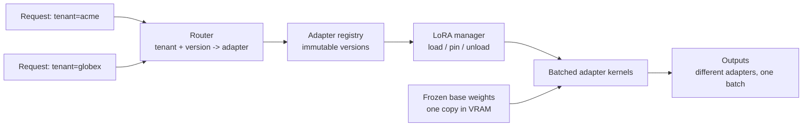

# LoRA and Adapter Serving

> **Interview answer (say this first).** A fine-tune does not have to be a full copy of the model. LoRA stores the change as a small adapter, often a few megabytes, on top of a frozen base model. In serving this becomes a huge win: load the base model once into VRAM and swap in different adapters per request, so one GPU can serve many customer- or task-specific fine-tunes. Multi-LoRA engines (vLLM, S-LoRA-style systems) batch requests that use different adapters together. Adapters can be pinned and versioned per tenant. The two deployment shapes are **merged** (fold the adapter into the base and serve an ordinary full model, simplest and fastest) and **on-the-fly** (keep the base shared and apply adapters at request time, most flexible). The real constraints are not adapter size in bytes — those are tiny — but batching efficiency when many adapters are in flight, adapter loading latency, and version routing.

## Why this exists

A team fine-tunes one model for support replies and gets a great result. Then legal wants one, and sales wants one, and then every enterprise customer wants their own tone and terminology. With full fine-tuning, each of those is a complete copy of the weights: several gigabytes each. Loading them all at once does not fit on a GPU, and even storing them is wasteful because they differ by less than one percent of their parameters.

LoRA (chapter 14 of phase 2) exists exactly for this. It freezes the base model and trains a small low-rank update `B @ A` for chosen weight matrices. The result is an adapter file that is orders of magnitude smaller than the base. The base model is shared; only the small delta changes.

Serving many variants cheaply is the natural next step. If the base is shared and the delta is tiny, then one GPU can hold one base and many adapters, and each request can declare which adapter it wants. This is **multi-LoRA serving**, and it turns "one fine-tune per cluster" into "one fine-tune per request."

There is a second, quieter benefit: **upgrades**. When the base model improves, every adapter can benefit without retraining them all into new full checkpoints. And rollback is easy, because an adapter is a small, versioned artifact.

The catch is that adapters are cheap in memory but not free in throughput. Requests using different adapters cannot always share a batch efficiently, and loading an adapter per request is slow. The engineering is in the batching and the routing, not in the bytes.

> **Note:**
>
> **The one-sentence purpose.** Serve one base model plus many small adapters, swap them per request, and accept a batching cost in exchange for not shipping a full model per fine-tune.

## Start from zero

| Word | Plain meaning |
| --- | --- |
| **Base model** | The pretrained model the adapters attach to. Frozen and shared. |
| **Adapter** | The small trained delta (LoRA weights) applied on top of the base. Usually a few MB. |
| **LoRA** | Low-Rank Adaptation: the adapter is a low-rank update `B @ A`. |
| **Rank (`r`)** | How many numbers describe each update. Bigger rank, bigger adapter, more capacity. |
| **Adapter file** | Typically `adapter_model.safetensors` plus `adapter_config.json`. |
| **Multi-LoRA serving** | Serving many adapters over one base model, selected per request. |
| **Hot swap** | Loading or switching an adapter while the server keeps running. |
| **Merged model** | The adapter folded into the base weights, producing a normal full model. |
| **On-the-fly adapter** | The adapter stays separate and is applied during the forward pass. |
| **Adapter registry** | A store of adapter artifacts with names, versions, and metadata. |
| **Routing** | Mapping a request (often by tenant or task) to the adapter it should use. |
| **Tenant** | One customer or isolated group of users in a shared system. |
| **Version pinning** | Fixing a tenant to a specific adapter version instead of "latest". |
| **Batched adapter kernel** | A GPU kernel that applies several different adapters in one batch. |
| **S-LoRA** | A research system for serving thousands of concurrent LoRA adapters using paged memory. |
| **Punica** | A related approach that batches requests with different adapters efficiently. |
| **Confounding** | Mixing requests unexpectedly across adapters; prevented by correct routing. |
| **Adapter leak** | A bug where tenant A's request is served by tenant B's adapter. Serious. |
| **Quantized base** | A base stored in 4 or 8 bits to save memory, with adapters on top. |
| **Warm adapter** | An adapter already loaded in VRAM, ready with no load delay. |
| **Cold adapter** | An adapter not yet loaded; the first request pays a load cost. |

Two distinctions matter from the start:

- **Adapter size vs adapter cost.** A 1 MB adapter is almost free in memory *as weights*. Its cost is in batching and switching — a throughput cost — plus a smaller per-adapter runtime memory reservation the engine keeps for buffers and kernel slots. So the adapter is not a cost in adapter weights, but it is not free in throughput or resident memory either.
- **Merging is a one-way door for that artifact.** Once merged, there is no separate adapter to remove or swap. Keep the unmerged adapter as the source of truth.

## The core idea

Imagine a single piano in a concert hall and a shelf of sheet-music books. The piano is expensive and there is one of it. Each performer brings a different small book. The piano does not change; the book changes what is played. You do not buy a new piano for every concert.

Multi-LoRA serving is that piano. The base weights sit in VRAM once, and each request carries a small adapter that changes how the base behaves. The router is the librarian who hands out the right book.



The key serving property is that requests with different adapters can still share the expensive part: the base model's forward pass. The adapter only adds a small low-rank term to chosen layers, and modern engines can apply several adapters inside one batch. That is what makes "thousands of fine-tunes on one GPU" possible.

The trade-off in one table:

| | Merged model | On-the-fly adapter |
| --- | --- | --- |
| Artifact | one full model per fine-tune | one base + small adapters |
| VRAM for N variants | N full models (or swap) | one base + N adapters |
| Latency | baseline | small extra per token |
| Switch cost | load a new model (slow) | swap or select (fast) |
| Batching | one model per batch | several adapters per batch |
| Rollback | redeploy a model | point the route at the old version |
| Tooling | any server | needs adapter-aware engine |
| Best when | one hot variant, max speed | many variants, hot-swap, tenancy |

> **Note:**
>
> **The counter-intuitive part.** Adapter weights are tiny, so memory is rarely the limit. The limit is **batching**: the more adapters in flight at once, the harder it is to fill each batch, and throughput falls. Optimize for adapter locality, not adapter size.

## How it works

1. **Train or obtain adapters.** Use PEFT to train a LoRA adapter against a specific base model and revision. Record the base name, revision, and tokenizer next to the adapter (chapter 14 of phase 2).
2. **Publish adapters to a registry.** Store each adapter as an immutable, versioned artifact, for example `support-v3`, `legal-v1`. Never overwrite a version in place.
3. **Load the base model once.** The server starts with the frozen base in VRAM. This is the expensive, shared thing.
4. **Enable multi-LoRA in the engine.** Tell the server how many adapters may be active in a batch and the maximum rank to reserve kernels for.
5. **Register adapters.** Either list them at startup or load them dynamically over an HTTP endpoint while the server runs.
6. **Route each request to an adapter.** The router maps tenant, task, or an explicit field to an adapter name and version. Default to the base model when no adapter matches.
7. **Apply the adapter in the forward pass.** For a target layer, the output is `x @ W.T + scale * x @ (B @ A).T`. The base `W` is untouched.
8. **Batch across adapters.** The engine groups in-flight requests so that requests using different adapters still share the base computation. This is where S-LoRA-style paged adapters and batched kernels matter.
9. **Manage adapter lifecycle.** Pin frequently used adapters in VRAM ("warm"), evict cold ones, and bound how many are resident at once.
10. **Version and roll back.** Promotion and rollback are registry operations plus a routing change, not a model redeploy. Verify on a canary tenant first.
11. **Audit the routing decision.** Log which adapter and version served each request. This is how you debug a wrong tone or, worse, a cross-tenant leak.
12. **Decide merge vs on-the-fly per variant.** Merge the hot, stable variant for speed; keep everything experimental or multi-tenant on the shared base.

The subtle steps are 8, 9, and 11. Most multi-LoRA incidents are a routing mistake or an eviction storm, not a math problem.

### Where the cost actually is

- **Adapter weights in memory:** small. A rank-16 adapter on the four attention projections of a 4096-wide model is about 1 MB in bf16.
- **Runtime overhead per loaded adapter:** larger than the weights, because the engine reserves buffers and kernel slots. This is why engines cap the number of resident adapters.
- **Batching fragmentation:** the real cost. If 96 concurrent requests are spread over 32 adapters, the average group is 3 requests, so the GPU is underfed.
- **Load latency:** a cold adapter must be read from disk and copied to VRAM. Do it outside the request path where possible.
- **Merge cost:** merging is a one-time linear algebra step and produces a full-size model, so the storage cost is the full model again.

## The syntax you will use

**Start a server with named adapters.** vLLM takes the base model plus one or more LoRA modules, each with a name and a path.

```bash
vllm serve meta-llama/Llama-3.1-8B-Instruct \
  --enable-lora \
  --max-loras 8 --max-lora-rank 32 \
  --lora-modules support=/adapters/support-v3 \
                   legal=/adapters/legal-v1
```

`--max-loras` bounds how many adapters can appear in one batch; `--max-lora-rank` reserves kernel capacity for the largest adapter.

**Request a specific adapter.** The adapter name is used as the model name, so the same endpoint serves every variant.

```python
resp = client.chat.completions.create(
    model="support",                 # selects the support LoRA adapter
    messages=[{"role": "user", "content": "How do I reset my router?"}],
)
```

**Load and unload adapters at runtime.** No restart, so new fine-tunes go live by publication plus one HTTP call.

```python
requests.post(f"{base}/v1/load_lora_adapter",
              json={"lora_name": "support-v4", "lora_path": "/adapters/support-v4"})
requests.post(f"{base}/v1/unload_lora_adapter",
              json={"lora_name": "support-v3"})
```

**Load an adapter with PEFT for a single-model server.** This is the simple path when you only need one adapter.

```python
from peft import PeftModel

model = PeftModel.from_pretrained(base_model, "adapters/support-v3")
model = model.merge_and_unload()      # optional: fold for zero adapter overhead
```

**Merge for the hot path.** After merging, the model is ordinary again and needs no adapter-aware engine.

```python
from peft import PeftModel

peft_model = PeftModel.from_pretrained(base_model, "adapters/legal-v1")
merged = peft_model.merge_and_unload()
merged.save_pretrained("models/legal-v1-merged")   # a full-size artifact
```

**Route by tenant and version.** The registry is data, not code, so promotion and rollback are config changes.

```python
ADAPTER_ROUTES = {
    ("acme", "prod"):   ("support-v3", "/adapters/support-v3"),
    ("globex", "prod"): ("legal-v1",   "/adapters/legal-v1"),
}

def route(tenant: str, env: str, base: str = "base") -> str:
    entry = ADAPTER_ROUTES.get((tenant, env))
    return entry[0] if entry else base      # base model when no adapter matches
```

| Setting | Typical values | Effect |
| --- | --- | --- |
| `--enable-lora` | flag | turns on adapter support |
| `--max-loras` | 1–32 | adapters that can share one batch |
| `--max-lora-rank` | 8–64 | reserves kernels for the largest adapter |
| `--lora-modules` | name=path pairs | adapters available at startup |
| load/unload endpoints | HTTP | hot-swap without restart |

## Examples: simple to real

All examples are pure Python. Every number is an **illustrative example input**, not a benchmark or a real price. Substitute your own measurements.

**Example 1 — adapter size by rank.** For a 4096-wide model, each target module contributes `r x (d_in + d_out)` parameters. With four attention projections (`q`, `k`, `v`, `o`):

```python
D, MODULES = 4096, 4     # q, k, v, o

def adapter_params(r):
    return MODULES * 2 * r * D

for r in (8, 16, 32, 64):
    p = adapter_params(r)
    print(f"r={r:3d}  params {p:>9,}  bf16 MB {p * 2 / 1e6:.2f}")
```

```text
r=  8  params   262,144  bf16 MB 0.52
r= 16  params   524,288  bf16 MB 1.05
r= 32  params 1,048,576  bf16 MB 2.10
r= 64  params 2,097,152  bf16 MB 4.19
```

A rank-16 adapter is about **1 MB**. Against a 16 GB base in bf16, that is roughly **0.0065%** of the model. This is why the artifact ships cheaply and why a hundred variants is a storage non-problem.

**Example 2 — how many adapters fit in a memory budget.** The weights are tiny; the engine's per-adapter overhead is what matters.

```python
GPU_GB, BASE_GB, KV_GB = 80.0, 16.0, 40.0
OVERHEAD_MB_PER_ADAPTER = 50.0      # illustrative runtime overhead

free_gb = GPU_GB - BASE_GB - KV_GB
max_adapters = free_gb * 1000 / OVERHEAD_MB_PER_ADAPTER

print(round(free_gb, 1))            # 24.0
print(int(max_adapters))            # 480
```

An 80 GB GPU holding a 16 GB base and a 40 GB KV cache leaves about **24 GB**, which at an illustrative 50 MB of overhead per adapter is room for hundreds. So set the resident-adapter limit by the engine's batch configuration (`--max-loras`) and by how much adapter diversity your traffic actually has — not by VRAM.

**Example 3 — adapter diversity shrinks your batches.** Batching is where the throughput cost appears. With 96 concurrent requests:

```python
CONCURRENT = 96
for adapters in (1, 2, 4, 8, 32):
    print(f"adapters {adapters:2d}  avg group {CONCURRENT / adapters:5.1f}")
```

```text
adapters  1  avg group  96.0
adapters  2  avg group  48.0
adapters  4  avg group  24.0
adapters  8  avg group  12.0
adapters 32  avg group   3.0
```

Thirty-two adapters turn one large batch into thirty-two tiny ones. Modern engines mitigate this with batched adapter kernels that still process several adapters together, but the effect is real: **more variants means lower throughput per GPU** unless you consolidate traffic.

**Example 4 — load per request vs loading once.** A cold adapter load is a fixed cost. Paying it per request is catastrophic.

```python
LOAD_MS = 200.0
COMPUTE_MS = 20.0

def rps(mode, requests):
    if mode == "per_request":
        return 1000.0 / LOAD_MS
    return requests * 1000.0 / (LOAD_MS + COMPUTE_MS * requests)

print(rps("per_request", 1))        # 5.0
print(round(rps("grouped", 100), 2))  # 45.45
```

Loading the adapter on every request caps you at about **5 requests/sec**. Loading once and amortizing over a group of 100 reaches about **45 requests/sec** in this illustrative model. Pin hot adapters and load cold ones ahead of first use.

**Example 5 — merged copies versus a shared base.** This is the storage and memory argument in one line.

```python
N, BASE_GB, ADAPTER_MB = 50, 16.0, 1.05

merged_gb = N * BASE_GB
shared_gb = BASE_GB + N * ADAPTER_MB / 1000

print(merged_gb)                 # 800.0
print(round(shared_gb, 3))       # 16.052
```

Fifty merged fine-tunes are **800 GB**; one base plus fifty adapters is about **16.05 GB**. Even accounting for the adapters' runtime overhead, the shared-base model is roughly **50x** smaller — nearly two orders of magnitude.

**Example 6 — routing with a safe fallback.** Routing is ordinary code, and it must fail closed, not open, when an adapter is missing.

```python
ADAPTER_ROUTES = {
    ("acme", "prod"): ("support-v3", 0.9),
    ("globex", "prod"): ("legal-v1", 1.0),
}

def route(tenant, env, base=("base", 1.0)):
    return ADAPTER_ROUTES.get((tenant, env), base)

print(route("acme", "prod"))        # ('support-v3', 0.9)
print(route("initech", "prod"))     # ('base', 1.0)
```

An unknown tenant gets the base model, not someone else's adapter. For sensitive tenants you may prefer to fail the request instead of silently degrading — decide that per tier and test it.

## In production

- **Adapters are cheap; adapter diversity is expensive.** The constraint is batch fragmentation, not bytes. Measure throughput as the number of distinct live adapters grows.
- **Keep the unmerged adapter as the artifact of record.** Merged weights are derived build outputs. If you merge your only copy, you cannot swap, roll back, or continue training.
- **Version adapters immutably.** `support-v3` should mean the same bytes forever. Publish `support-v4` instead of overwriting. This makes rollback a one-line route change.
- **Record the base model revision with the adapter.** An adapter trained on one base checkpoint can behave badly or fail to load on another. Store base name, revision, and tokenizer alongside it.
- **Route by tenant, fail closed, and test the routing.** A cross-tenant adapter leak is a security incident (chapter 16 of phase 9). Log the resolved adapter and version per request, and unit-test that "tenant acme resolves to support-v3".
- **Warm the adapters that matter.** Keep hot variants resident and load cold ones asynchronously. A cold load inside a user request adds visible latency.
- **Cap resident adapters deliberately.** Engines expose a max-loras setting. Set it from your traffic profile and test the throughput curve; do not assume more is better.
- **Do not load a separate full model per tenant.** That is the pattern adapters exist to replace. If a variant truly diverges in architecture or tokenizer, it needs its own base and its own deployment.
- **Expect rank and target-module differences across adapters.** The engine reserves capacity for the largest, so a rank-64 adapter can reduce how many others fit in a batch. Standardize rank where you can.
- **Merge for max speed on the hot path when the variant is stable.** Merged models have no adapter overhead and work with any server. Keep the flexible path for everything under active change.
- **Quantized bases and adapters interact.** A 4-bit base plus adapters is a common memory win, but confirm that your engine supports the combination and re-measure quality (chapter 4).
- **Adapters still need evaluation.** A new adapter version is a new model version. Gate promotion on the same offline and online checks (phase 8) before it serves real traffic.

## Interview questions

### 1. Why serve many fine-tuned models with LoRA adapters instead of separate full models?

**Answer.** Because the variants differ by a fraction of a percent of their parameters. A full model per fine-tune means a multi-gigabyte artifact and a full GPU allocation per variant, so a handful of variants exhausts memory and storage. A LoRA adapter is typically one to a few megabytes and attaches to a shared base. One base plus many adapters fits far more variants on the same hardware, makes rollback a route change, and lets a base-model upgrade benefit every variant at once.

**Follow-up: "What is the cost of this approach?"** Batching efficiency and a small per-token overhead. Requests using different adapters are harder to batch together, so throughput per GPU falls as adapter diversity rises.

**Trap.** Saying adapters are free. The adapter weights are tiny, but the engine reserves runtime memory per resident adapter and pays a batching penalty.

### 2. What is multi-LoRA serving and how does it work?

**Answer.** It is serving many adapters over one base model, selected per request. The base weights live in VRAM once. Each request names an adapter, and the engine applies that adapter's low-rank update during the forward pass. Modern engines use batched adapter kernels and paged adapter memory so requests with different adapters can still share the expensive base computation — S-LoRA and Punica are well-known examples of the technique.

**Follow-up: "How does the request say which adapter to use?"** Usually by setting the model name to the adapter's registered name on an OpenAI-compatible endpoint, or by passing an explicit adapter object in the Python API.

**Trap.** Assuming every adapter must be loaded at startup. Runtime load and unload endpoints exist precisely so new fine-tunes go live without a restart.

### 3. Merged versus on-the-fly adapters — when do you choose each?

**Answer.** Merge when a variant is stable, hot, and latency-sensitive: the result is an ordinary model with no adapter overhead that works on any server. Keep adapters on the fly when you have many variants, need hot-swapping or fast rollback, or want multi-tenancy on one base. A common production mix is a merged model for the top one or two variants on the hot path, and shared-base adapters for everything experimental or long-tail.

**Follow-up: "Is merging lossy?"** Only in floating-point rounding. The math is `W + scale * (B @ A)`, and the difference from applying the adapter separately is float precision, not approximation.

**Trap.** Merging your only copy of an adapter. Keep the unmerged adapter as the source artifact and treat merged weights as a build output.

### 4. What is the real bottleneck in multi-tenant adapter serving?

**Answer.** Batching, not memory. If concurrent requests are spread across many adapters, each group is small and the GPU is underfed. With 96 concurrent requests over 32 adapters, the average group is three requests, so throughput per GPU drops sharply. Mitigations are batched adapter kernels that process several adapters together, consolidating tenants onto shared adapters where possible, and capping how much diversity you actually serve from one deployment.

**Follow-up: "How would you measure it?"** Sweep the number of distinct live adapters at fixed request rate and plot throughput and latency. The curve shows you where diversity starts to hurt.

**Trap.** Optimizing adapter file size. Bytes are not the constraint; concurrent adapter diversity is.

### 5. How do you version and roll back an adapter safely?

**Answer.** Treat adapters like immutable container images. Each version has a unique name and content, a recorded base-model revision, and evaluation results. Promotion moves a tenant's route from one version to the next; rollback moves it back. Neither touches the running server's weights. You can also load the new adapter alongside the old one, canary it on a small tenant, and shift traffic without downtime.

**Follow-up: "What metadata travels with an adapter?"** Base model name and revision, tokenizer, rank and target modules, training data version, and evaluation scores. Without the base revision, the adapter may not reproduce.

**Trap.** Overwriting a version tag. If `support-v3` changes underneath you, no rollback is possible and A/B results become meaningless.

### 6. How do you route requests to the right adapter in a multi-tenant system?

**Answer.** Keep routing as data, keyed by tenant and environment, mapping to an adapter name and version. Resolve it in one place, log the resolved adapter per request, and use the base model or an explicit failure when no route exists. For sensitive tenants, fail closed rather than silently falling back, because serving the wrong tenant's adapter is a data-isolation incident.

**Follow-up: "What goes wrong in practice?"** Stale routes after a tenant rename, a default that leaks another tenant's adapter, and cache keys that omit the adapter so one tenant's response is served to another. Include the adapter version in any cache key.

**Trap.** Leaving adapter selection to the client. A client should not be able to name an arbitrary adapter; the router decides from identity and policy.

### 7. Should you deploy a fine-tuned model as full weights or as an adapter?

**Answer.** It depends on the deployment shape. Full weights are simplest to operate: any server can load them, there is no adapter runtime, and latency has no extra term. Adapters win when you have many variants, need shared infrastructure, or want hot-swap and cheap rollback. The decision is about how many variants you must serve and how often they change, not about quality — the model is mathematically the same either way.

**Follow-up: "What if only one variant ever exists?"** Merge it and serve full weights. Multi-LoRA is complexity you do not need for a single model.

**Trap.** Assuming adapter deployment is always cheaper operationally. It adds a registry, routing, and an adapter-aware engine; that is worth it for many variants and overkill for one.

### 8. Connect adapter serving to agentic AI systems.

**Answer.** Agents often need several specializations at once: one model for planning, another for tool-call formatting, another for a customer's domain vocabulary. Adapter serving lets an agent platform host all of those on one base and select per step, so a planning call uses the planner adapter and a tool-formatting call uses the formatter adapter without loading separate models. It also makes per-tenant agents affordable, because each tenant's behavior is a small adapter rather than a dedicated deployment. The caveats are the same as any routing: version pinning, logging, and cache keys that include the adapter.

**Follow-up: "What is the risk in an agent loop?"** A loop makes many model calls, so batching and routing overheads multiply across steps. Measure end-to-end latency per agent run, not per call.

**Trap.** Assuming the agent can safely switch adapters mid-run without pinning a version. If the route changes while a run is in flight, the agent's behavior changes underneath it. Pin the adapter version for the duration of a run.

## Remember this

- **One base, many adapters.** LoRA turns "a model per fine-tune" into "a small file per fine-tune" on shared hardware.
- **Memory is not the bottleneck; batching is.** Adapter diversity fragments batches and lowers throughput per GPU.
- **Merge for speed and stability, keep adapters for flexibility and tenancy.** The math is identical; only operations differ.
- **Version adapters immutably and route by tenant, failing closed for sensitive data.** Log the resolved adapter and version per request.
- **Adapters are still models.** Gate every new version on evaluation before promoting it, and pin the version for the duration of an agent run.
