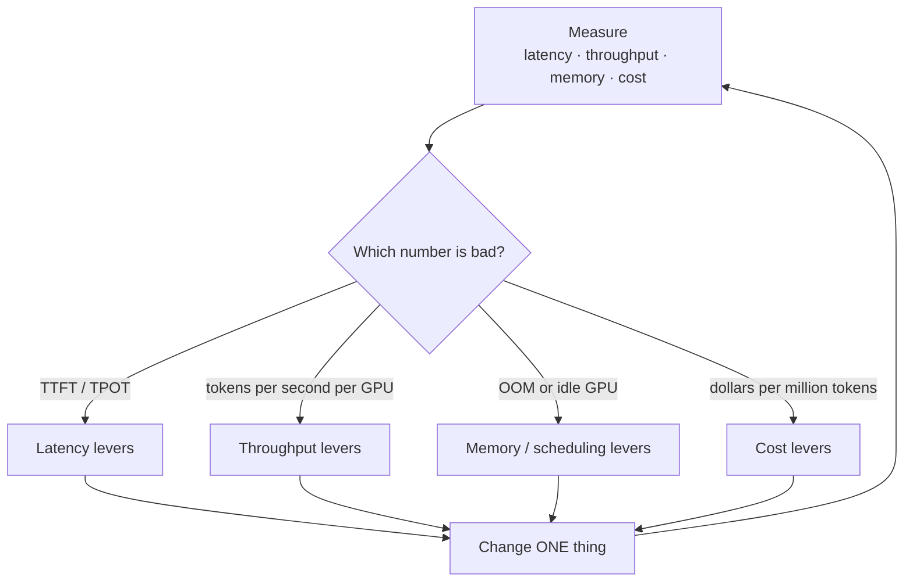

# Serving Optimization

> **Interview answer (say this first).** Serving optimization is a loop: **measure**, find the single bottleneck, change **one thing**, and measure again. There are four numbers to optimize — latency, throughput, memory/GPU utilization, and cost — and they trade against each other, so you must know which one is your actual problem before you touch anything. For latency, work on time to first token (prompt processing, prefix caching) and time per output token (speculative decoding, smaller or quantized models). For throughput, use continuous batching, larger batches, and parallelism across GPUs. For memory, quantize, cap the KV cache, and tune the scheduler. For cost, right-size, use spot or elastic capacity, route cheap-first, and cache aggressively. Changing two things at once destroys your ability to attribute the gain, which is why the disciplined order matters more than any single trick.

## Why this exists

A model server that works is not the same as a model server that is good. A naive deployment can be ten times more expensive per token, or four times slower, than a well-tuned one on identical hardware. The difference is almost never a clever algorithm; it is measurement and a series of small, deliberate changes.

Optimization is also where teams get lost. They read that batching improves throughput, so they raise the batch size — and latency gets worse for interactive users. They read that quantization saves memory, so they quantize — and quality drops on their hardest cases. They read that speculative decoding speeds up generation, add a draft model, and find the whole thing slower because the acceptance rate was low. Each of these is a real lever pulled in the wrong direction, because the team did not first ask "which of the four numbers is actually bad?"

This chapter gives you the four-objective framework, the standard levers for each, and the discipline to apply them one at a time. It ties together the earlier chapters in this phase: batching (chapter 3), quantization (chapters 4 and 5), parallelism (chapter 6), vLLM (chapter 7), autoscaling (chapter 10), and routing (chapter 11).

> **Note:**
>
> **The one-sentence purpose.** Measure first, identify the one bottleneck, change one thing, and confirm the change moved the number you cared about without wrecking the other three.

## Start from zero

| Word | Plain meaning |
| --- | --- |
| **TTFT** | Time to first token: how long until the first output token appears. |
| **TPOT** | Time per output token: average time between tokens after the first. Also called inter-token latency. |
| **End-to-end latency** | Total time for a request: queue plus TTFT plus all remaining tokens. |
| **Latency percentiles** | p50 (median), p95, p99. The tail is what users complain about. |
| **Throughput** | Tokens produced per second, usually summed across all concurrent requests. |
| **Goodput** | Throughput that meets the latency target. Fast tokens that arrive too late do not count. |
| **Batch size** | How many requests the GPU processes together in one forward pass. |
| **Static batching** | A fixed group of requests processed together; all wait for the slowest. |
| **Continuous batching** | Requests enter and leave the batch as they finish, keeping the GPU busy. |
| **Prefill** | Processing the prompt before generating. Compute-heavy; drives TTFT. |
| **Decode** | Generating output tokens one at a time. Memory-bandwidth-heavy; drives TPOT. |
| **Prefix caching** | Reusing the KV cache for a shared prompt prefix across requests. |
| **Speculative decoding** | A small draft model proposes tokens; the big model verifies several at once. |
| **Acceptance rate** | How often the draft model's proposals are accepted. |
| **KV cache** | Stored attention keys and values for tokens already processed. Grows with context. |
| **Quantization** | Storing weights (and sometimes the cache) in fewer bits: 8-bit, 4-bit. |
| **GPU utilization** | How busy the GPU is. Low utilization means you are paying for idle silicon. |
| **Tensor parallelism** | Splitting one model's layers across several GPUs. |
| **Saturation** | The point where adding load stops raising throughput and only raises latency. |
| **Queueing delay** | Time a request waits before the GPU starts on it. |
| **Right-sizing** | Matching instance size and count to the workload instead of overbuying. |
| **Spot / preemptible** | Cheap capacity that can be reclaimed, good for tolerant workloads. |
| **Cheap-first routing** | Send each request to the cheapest model that can handle it. |
| **Cache hit rate** | The fraction of requests served from a cache instead of the model. |

Two distinctions matter from the start:

- **Latency and throughput pull in opposite directions.** Bigger batches raise throughput and raise per-request latency. You must pick which one the workload needs.
- **Prefill and decode are different workloads.** TTFT is a compute problem; TPOT is a memory-bandwidth problem. Fixing one does not fix the other.

## The core idea

Think of a doctor diagnosing a patient. A bad doctor prescribes something on the first symptom and hopes. A good doctor measures vitals, finds the one abnormal number, treats that, and re-measures. Prescribing three drugs at once is not thoroughness; it is a way to never learn what worked.

Serving optimization is that discipline. The "vitals" are four numbers, and almost every change helps one and hurts another.



What each family of levers actually moves:

| Lever | Latency | Throughput | Memory | Cost |
| --- | --- | --- | --- | --- |
| Larger batch size | worse | better | worse | better |
| Continuous batching | about the same | much better | same | much better |
| Prefix caching | better (TTFT) | better | slightly worse | better |
| Speculative decoding | better | mixed | worse | mixed |
| Smaller / quantized model | better | better | better | better (if quality holds) |
| Tensor parallelism | mixed | better | spread out | worse (more GPUs) |
| KV cache cap | worse at long context | better | better | better |
| Right-sizing | same | same | same | better |
| Spot capacity | same | same | same | much better (riskier) |
| Cheap-first routing | better | better | same | much better in dollars |
| Response caching | much better | much better | same | much better |

Two facts make this table usable:

- **Quantization and smaller models are the closest thing to a free lunch** — they help latency, throughput, memory, and cost at once. The price is quality, and it must be measured on your own evaluation set.
- **Batch size is the classic trade.** It improves throughput and cost while hurting latency. If your users are interactive, this is the knob to be careful with.

> **Note:**
>
> **The first question is never "what should I optimize?"** It is "what is the target, and what is the current number?" Without a target — say, p95 TTFT under 500 ms at 20 requests per second — you cannot tell whether a change helped.

## How it works

1. **Write down the target.** For example: p95 TTFT under 500 ms, p95 end-to-end under 5 seconds, 3,000 output tokens per second per GPU, and under $2 per million tokens. Numbers force honesty.
2. **Measure the baseline under realistic load.** Not one request in a notebook. Use a load generator with a realistic mix of prompt lengths, output lengths, and arrival times.
3. **Break latency into its parts.** Queue time, prefill (TTFT), and decode (`(output_tokens - 1) x TPOT`). This tells you which lever can possibly help.
4. **Identify the bottleneck.** If TTFT dominates, work on prefill and caching. If TPOT dominates, work on decode and the model. If the GPU is idle, work on batching and scheduling. If utilization is high and latency is bad, you are saturated.
5. **Check for saturation first.** When utilization is near 100%, adding load only increases queueing. The fix is capacity or efficiency, not more retries or bigger timeouts.
6. **Change one thing.** Raise `max_num_seqs`, enable prefix caching, quantize, add a draft model — one at a time. Re-run the same benchmark.
7. **Confirm the target number moved, and check the others.** A change that triples throughput but doubles p99 latency may not be a win.
8. **Look for the cheapest structural win before hardware.** Response caching, prompt-prefix reuse, and cheap-first routing often beat any kernel-level tuning, because they remove work instead of doing it faster.
9. **Right-size and use elastic capacity.** Match instance type and count to measured usage. Use spot or preemptible capacity for batch and tolerant work, with checkpointing and a warm fallback.
10. **Re-baseline after every change and after every model or engine upgrade.** Optimizations decay; a new engine version may already include what you hand-tuned.
11. **Automate the measurement.** A benchmark command and a dashboard beat a one-off experiment. Optimization without continuous measurement regresses silently.

The subtle steps are 3, 5, and 8. Most teams skip the latency decomposition, miss that they are saturated, and reach for a complex fix when a cache would have removed the workload entirely.

### The four objectives and their standard levers

**Latency.**

- **Prefix caching:** reuse the KV cache for a shared system prompt. If 1,000 tokens are identical across requests, processing them once instead of per request is a large TTFT win.
- **Speculative decoding:** a small draft model proposes several tokens; the target model verifies them in one forward pass. Expected accepted tokens per step is `(1 - alpha^(k+1)) / (1 - alpha)` for acceptance rate `alpha` and `k` draft tokens. The step also costs `1 + k*c` target-equivalent forwards, where `c` is the draft cost as a fraction of a target token, so the expected speedup is `E[speedup] = (1 - alpha^(k+1)) / ((1 - alpha)(1 + k*c))`. With `alpha = 0.7`, `k = 4`, and `c = 0.1` (a draft token costs 10% of a target token), the illustrative speedup is about **2.0x** — it would be about 2.8x only if the draft were free. With `alpha = 0.5` and `k = 8`, it falls to about **1.1x** — more draft tokens can hurt when acceptance is low, because you still pay for every proposal.
- **Smaller or quantized models:** fewer bytes to move per token, so decode is faster. Measure quality.
- **Chunked prefill:** split a long prompt into pieces so a huge prompt does not block decode for other requests.

**Throughput.**

- **Continuous batching:** new requests join as soon as there is room and finished ones leave immediately. This is the single biggest throughput lever in modern engines.
- **Larger batch size:** more requests per forward pass. Helps throughput, hurts latency.
- **Tensor parallelism:** split the model across GPUs so more compute is available, at the cost of more hardware and communication.
- **Data parallelism:** separate replicas behind a load balancer, simplest way to scale.

**Memory and GPU utilization.**

- **Quantization:** 8-bit or 4-bit weights cut the model's footprint and often speed up bandwidth-bound decode.
- **KV cache limits:** cap context length and concurrent sequences so the GPU does not run out of memory or swap.
- **Scheduler tuning:** `max_num_seqs` and `max_model_len` control the memory-latency-throughput balance directly.

**Cost.**

- **Right-sizing:** use the smallest instance that meets the target. Utilization is the cost driver.
- **Spot and elastic capacity:** pay less for interruptible work, scale down when traffic is low.
- **Cheap-first routing:** send each request to the cheapest model that passes a quality gate; escalate only when needed.
- **Caching:** identical or near-identical requests skip the model entirely.
- **Batching and quantization** also reduce cost, because cost is throughput and memory in disguise.

## The syntax you will use

**Serve with the memory and scheduler knobs set.** vLLM exposes the main levers as flags.

```bash
vllm serve meta-llama/Llama-3.1-8B-Instruct \
  --max-model-len 8192 \
  --gpu-memory-utilization 0.90 \
  --max-num-seqs 64 \
  --enable-prefix-caching
```

`--max-num-seqs` trades memory and latency for throughput; `--gpu-memory-utilization` sets how much VRAM the engine may use, leaving room for the KV cache.

**Add speculative decoding.** A small draft model proposes tokens that the target model verifies in a batch.

```bash
vllm serve meta-llama/Llama-3.1-70B-Instruct \
  --speculative-model meta-llama/Llama-3.2-1B-Instruct \
  --num-speculative-tokens 5
```

The win depends entirely on the draft model's acceptance rate on your traffic. Measure it before committing.

**Quantize the weights.** Fewer bytes per weight means less memory and usually faster decode.

```bash
vllm serve TheBloke/Llama-2-7B-AWQ --quantization awq --max-model-len 4096
```

**Scale across GPUs.** Tensor parallelism splits one model; data parallelism runs replicas.

```bash
vllm serve meta-llama/Llama-3.1-70B-Instruct --tensor-parallel-size 4
```

**Benchmark with a real load shape.** Measure the system, not one request.

```bash
vllm bench serve \
  --model meta-llama/Llama-3.1-8B-Instruct \
  --num-prompts 1000 \
  --request-rate 20 \
  --max-concurrency 32
```

**Measure TTFT on the client side too.** Streaming is how you observe time to first token as the user feels it.

```python
stream = client.chat.completions.create(
    model="local-model", messages=msgs, stream=True,
)
first = next(stream)            # timestamp here is TTFT
```

**Route cheap-first.** Send the request to the cheapest model that has a chance of passing, and escalate on a quality signal.

```python
def choose_model(complexity: str) -> str:
    if complexity == "simple":
        return "small-cheap"
    if complexity == "medium":
        return "mid"
    return "large-strong"
```

| Knob | Range | What it buys | What it costs |
| --- | --- | --- | --- |
| `--max-num-seqs` | 8–256 | throughput | memory, latency |
| `--max-model-len` | 2k–128k | longer context | KV memory, latency |
| `--gpu-memory-utilization` | 0.7–0.95 | bigger KV cache | less headroom |
| `--enable-prefix-caching` | on/off | faster TTFT on shared prefixes | some memory |
| `--quantization` | fp8/int8/awq/gptq | memory and decode speed | quality |
| `--tensor-parallel-size` | 1–8 | more compute | more GPUs, comms |

## Examples: simple to real

All examples are pure Python. Every number is an **illustrative example input**, not a benchmark result or a real price. Substitute your own measurements.

**Example 1 — decompose latency before optimizing.** Total time is queue plus TTFT plus the remaining output tokens.

```python
def total_ms(ttft, tpot, out):
    return ttft + (out - 1) * tpot

for out in (20, 300, 2000):
    p50 = total_ms(120, 30, out)
    p95 = total_ms(400, 60, out)
    print(f"out={out:5d}  p50 {p50:8.0f} ms   p95 {p95:8.0f} ms")
```

```text
out=   20  p50      690 ms   p95     1540 ms
out=  300  p50     9090 ms   p95    18340 ms
out= 2000  p50    60090 ms   p95   120340 ms
```

For short outputs, TTFT is a large share of the total, so caching the prompt prefix helps. For long outputs, TPOT dominates completely — a 2,000-token answer is about 99.8% decode at p50 and 99.7% at p95. **You cannot fix the second case with a TTFT optimization.** This decomposition is the first thing to do.

**Example 2 — Little's law tells you the batch you need.** Concurrency equals arrival rate times latency.

```python
ARRIVAL_RPS = 20.0
for latency in (1.0, 5.0, 20.0):
    print(f"latency {latency:5.1f}s -> {ARRIVAL_RPS * latency:6.1f} concurrent")
```

```text
latency   1.0s ->   20.0 concurrent
latency   5.0s ->  100.0 concurrent
latency  20.0s ->  400.0 concurrent
```

At 20 requests per second and a 5-second response, you need about **100 requests in flight**. If your `max_num_seqs` is 32, requests queue and latency grows beyond the target. Concurrency is not a tuning preference; it is arithmetic from your latency and arrival rate.

**Example 3 — continuous batching keeps the GPU busy.** With static batching, every request in a group waits for the longest output. Simulating a workload with varied lengths:

```python
lengths = [10, 20, 30, 40, 50, 60, 70, 80, 90, 100, 110, 120,
           130, 140, 150, 160, 170, 180, 190, 200, 210, 220, 230, 240]
B = 8
work = sum(lengths)

static_slots = 0
for i in range(0, len(lengths), B):
    static_slots += B * max(lengths[i:i + B])
static_util = work / static_slots

slots = [0] * B
for L in sorted(lengths, reverse=True):
    slots[slots.index(min(slots))] += L
cont_util = work / (max(slots) * B)

print(round(static_util, 3))            # 0.781
print(round(cont_util, 3))              # 0.915
print(round(cont_util / static_util, 3))  # 1.171
```

Static batching leaves the GPU slots about **78%** utilized; continuous batching reaches about **92%**, a **1.17x** gain on this workload. With a wider spread of output lengths the gap is much larger. That is why continuous batching is the default in modern engines, not an optimization you add later.

**Example 4 — prefix caching removes repeated prefill.** A shared system prompt of 1,000 tokens, 200 unique prompt tokens, 10,000 requests.

```python
P, U, N = 1000, 200, 10_000
without = N * (P + U)
with_cache = P + N * U

print(without)                                    # 12,000,000
print(with_cache)                                 # 2,001,000
print(round((1 - with_cache / without) * 100, 2)) # 83.33
```

Caching the shared prefix cuts prefill tokens by about **83%**, which directly reduces TTFT and frees compute for decode. Prefix caching is one of the highest-leverage wins in agent systems, where every step repeats a long system prompt and a growing scratchpad.

**Example 5 — quantization and the KV cache set your memory budget.** An 8B model in bf16, 32 layers, 8 KV heads, head dimension 128.

```python
def kv_gib_per_seq(layers, kv_heads, head_dim, bytes_per, ctx):
    per_tok = 2 * layers * kv_heads * head_dim * bytes_per
    return per_tok * ctx / 2**30

for name, b in (("fp16", 2), ("int8", 1), ("int4", 0.5)):
    print(f"8B weights {name:5s} {8e9 * b / 1e9:6.2f} GB")
print(round(kv_gib_per_seq(32, 8, 128, 2, 8192), 2))    # 1.0
print(round(kv_gib_per_seq(32, 8, 128, 2, 32768), 2))   # 4.0
```

```text
8B weights fp16   16.00 GB
8B weights int8    8.00 GB
8B weights int4    4.00 GB
KV GiB/seq 8k ctx          1.0
KV GiB/seq 32k ctx         4.0
```

(Note the units: the weights are shown in decimal GB (10^9 bytes) while the KV cache is in binary GiB (2^30 bytes), so the two columns are close but not directly interchangeable.) An int4 model frees **12 GB** versus bf16 — but each concurrent 32k-context sequence needs **4 GiB** of KV cache. At 32k context, the cache, not the weights, is what limits how many sequences fit. This is why `--max-model-len` and `--max-num-seqs` matter so much: they bound the cache, and the cache bounds concurrency.

**Example 6 — cheap-first routing moves the cost number.** Route the easy majority to a small model and escalate only the hard cases.

```python
STRONG, CHEAP = 15.0, 1.0    # illustrative $ per 1M tokens
for share in (0.0, 0.5, 0.8, 0.95):
    blended = share * CHEAP + (1 - share) * STRONG
    print(f"cheap share {share:.2f} -> ${blended:5.2f} per M tokens")
```

```text
cheap share 0.00 -> $15.00 per M tokens
cheap share 0.50 -> $ 8.00 per M tokens
cheap share 0.80 -> $ 3.80 per M tokens
cheap share 0.95 -> $ 1.70 per M tokens
```

Routing 80% of traffic to the cheap model cuts the blended price by about **75%**. The catch is the quality gate: you must measure that the cheap model is good enough for the requests you send it, or the savings become errors. Cost optimization is often a routing and caching problem long before it is a GPU problem.

## In production

- **Never optimize without a target and a baseline, and change one thing at a time.** "Make it faster" is not a target; "p95 TTFT under 500 ms at 20 rps" is. Two simultaneous changes make attribution impossible.
- **Decompose latency and check for saturation first.** Queue, prefill, and decode have different levers, and at high utilization the fix is capacity or fewer requests, not a bigger timeout.
- **Continuous batching is table stakes.** If your server does not do it, that is the first throughput fix, and it costs little latency.
- **Batch size is the latency-throughput dial.** Raise it for throughput and cost; lower it when interactive latency is the constraint. Do not raise it blindly.
- **Prefix caching is the best agent optimization.** Agent loops repeat long system prompts and conversation history every step; caching the prefix cuts TTFT and compute on every call.
- **Speculative decoding must be validated on your traffic.** A 2x gain at 90% acceptance can become a slowdown at 50%. Measure acceptance rate, not just the flag.
- **Quantization helps everything except quality.** It reduces memory, latency, and cost at once. Gate it on evaluation, because the loss concentrates on hard cases.
- **The KV cache is usually the real memory limit.** Weights are fixed; the cache grows with context and concurrency. Cap it deliberately.
- **Right-size before adding GPUs.** A 20%-utilized 80 GB GPU is worse than a well-filled 24 GB one for a small model.
- **Use spot capacity only for tolerant work.** Batch and offline jobs yes; interactive serving only with checkpointing and a warm fallback.
- **Cache at the edges.** Response caching and semantic caching remove work entirely and are often a larger win than any engine tuning.
- **Automate the benchmark and dashboard it.** Optimizations regress; without continuous measurement you will not notice until the bill or the latency graph does.

## Interview questions

### 1. How do you approach optimizing a model server?

**Answer.** Measure, find the one bottleneck, change one thing, re-measure. Start by writing the target — for example p95 TTFT under 500 ms at a given request rate — and capturing a baseline under realistic load. Decompose latency into queue, prefill, and decode to see which is dominant. Identify whether the problem is latency, throughput, memory, or cost, apply the matching lever, and verify that the target moved without wrecking the others. Optimization is a loop, not a list of tricks.

**Follow-up: "Why one change at a time?"** Attribution. If throughput rises after two changes, you do not know which helped, which hurt, or whether they cancel. It also makes the change safe to revert.

**Trap.** Applying every known optimization at once and declaring victory. You cannot reproduce the result, and some of the changes are probably harming the metric you actually care about.

### 2. What is the difference between TTFT and TPOT, and why does it matter?

**Answer.** TTFT is the time to the first token; it is driven by queueing and prompt prefill. TPOT is the average gap between later tokens; it is driven by decode speed, which is memory-bandwidth-bound. For short outputs, TTFT dominates the user's perceived latency. For long outputs, TPOT dominates, because `total = TTFT + (output_tokens - 1) x TPOT`. That means a prompt-caching fix helps short answers and does almost nothing for a 2,000-token answer.

**Follow-up: "Which do you optimize for a chatbot?"** TTFT, because responsiveness is judged in the first fraction of a second. For a long report generator, optimize TPOT instead.

**Trap.** Reporting one "average latency" number. It hides the split and points you at the wrong lever.

### 3. How does batching affect the four objectives?

**Answer.** Static batching groups requests and makes them all wait for the longest, hurting latency and wasting slots. Continuous batching lets requests join and leave as they finish, which raises throughput a lot at roughly the same latency, so it is a near-free win and should be the default. Increasing the batch size further raises throughput and reduces cost per token, but increases per-request latency and memory, so it is the main trade-off dial.

**Follow-up: "How do you pick a batch size?"** Start from the latency target, use Little's law to find the concurrency that target allows, and set the scheduler limit from there. Then benchmark to confirm.

**Trap.** Assuming bigger batches are always better. They are better for throughput and worse for the interactive latency users feel.

### 4. When does speculative decoding help, and when does it hurt?

**Answer.** It helps when the draft model's acceptance rate is high and the draft is cheap. Expected accepted tokens per verification step is `(1 - alpha^(k+1)) / (1 - alpha)`. But you also pay for every proposed token, so the honest model divides the accepted tokens by the step's cost `1 + k*c`, where `c` is the draft cost as a fraction of a target token: `E[speedup] = (1 - alpha^(k+1)) / ((1 - alpha)(1 + k*c))`. With an acceptance rate of 0.7 and 4 draft tokens, that is about 2.77 accepted tokens per step; at a draft cost of 10% of the target (`c = 0.1`) the illustrative speedup is about **2.0x**, and it would be about 2.8x only if the draft were free. At an acceptance rate of 0.5 with 8 draft tokens the speedup falls to about **1.1x**, and a higher draft cost can make it a net loss.

**Follow-up: "Why can more draft tokens be worse?"** You pay for every proposed token, but only accepted ones save a target forward pass. Past a point, the extra proposals cost more than they save.

**Trap.** Reading a headline speedup and enabling speculative decoding without measuring acceptance on your own data and draft model.

### 5. How do you reduce cost per million tokens?

**Answer.** In order of leverage: remove work (response and semantic caching), route cheap-first with a quality gate, use the smallest model that passes evaluation, quantize, batch well, right-size instances, and use spot or elastic capacity for tolerant workloads. Cost is mostly throughput and utilization in disguise, so batching and quantization help cost too. The biggest wins usually come from not calling the expensive model, not from making the expensive model slightly faster.

**Follow-up: "What is the risk of cheap-first routing?"** Quality regressions on the cases the cheap model cannot handle. You need a reliable quality signal or a conservative rule, and you must monitor escalations and errors.

**Trap.** Optimizing the GPU before optimizing the request mix. A cache hit is infinitely cheaper than a faster kernel.

### 6. What is the KV cache and why does it limit serving?

**Answer.** The KV cache stores the attention keys and values for tokens already processed, so the model does not recompute the whole prompt for each new token. Its size grows with context length and with the number of concurrent sequences, and it can dwarf the weights: an 8B model in bf16 is 16 GB, while 32k-context sessions can need several gigabytes each. Because the cache is dynamic and growable, it is often what triggers out-of-memory errors, and capping context length and concurrency is how you control it. PagedAttention in vLLM manages it in fixed pages to reduce fragmentation.

**Follow-up: "How does prefix caching relate?"** It reuses the cache for a shared prefix, so the system prompt is not recomputed per request. That cuts prefill cost and TTFT.

**Trap.** Sizing only the weights when planning GPU memory. The cache and activations are part of the budget.

### 7. How do you know whether you are latency-bound or throughput-bound?

**Answer.** Look at GPU utilization and the latency decomposition. If utilization is well below capacity and TTFT or TPOT is high, you are likely unbatched or otherwise inefficient — fix batching and scheduling. If utilization is near 100% and queue time is growing, you are throughput-bound and saturated; the fixes are more capacity or fewer, cheaper requests, not a bigger timeout. If throughput is fine but p99 latency is bad, you have a tail problem, often queueing or a few very long generations.

**Follow-up: "What is goodput?"** Throughput that still meets the latency target. It is the honest capacity number, because tokens that arrive too slowly do not serve the user.

**Trap.** Reporting average throughput with no latency bound. You can always raise throughput by ignoring the latency users experience.

### 8. How does serving optimization change for agentic AI workloads?

**Answer.** Agent workloads are many short, repetitive model calls with long shared prefixes, so prefix caching and response caching are the biggest wins, and per-call fixed overheads multiply. The conversation history and tool results grow the context, so KV cache pressure and context trimming matter. Batching is harder because latency between steps is user-visible, so you optimize for TTFT rather than raw throughput. Cost optimization becomes routing: send easy steps to a small model and only escalate hard steps. And because a single agent run can make dozens of calls, a small per-call improvement compounds into a large end-to-end one.

**Follow-up: "What would you measure?"** End-to-end agent run latency and cost, not per-call averages, plus cache hit rate and the escalation rate to the strong model.

**Trap.** Tuning for maximum batch throughput on an interactive agent loop. That raises throughput and makes every step feel sluggish.

## Remember this

- **Measure, find the one bottleneck, change one thing, re-measure.** The loop beats any single trick.
- **TTFT comes from prefill and queueing; TPOT comes from decode.** Decompose latency before choosing a lever.
- **Continuous batching is a near-free throughput win; batch size is the latency-throughput dial.** Be deliberate about which you need.
- **Quantization helps latency, throughput, memory, and cost together — at a quality cost you must measure.**
- **The cheapest request is the one you do not run.** Caching and cheap-first routing often beat any GPU tuning.
