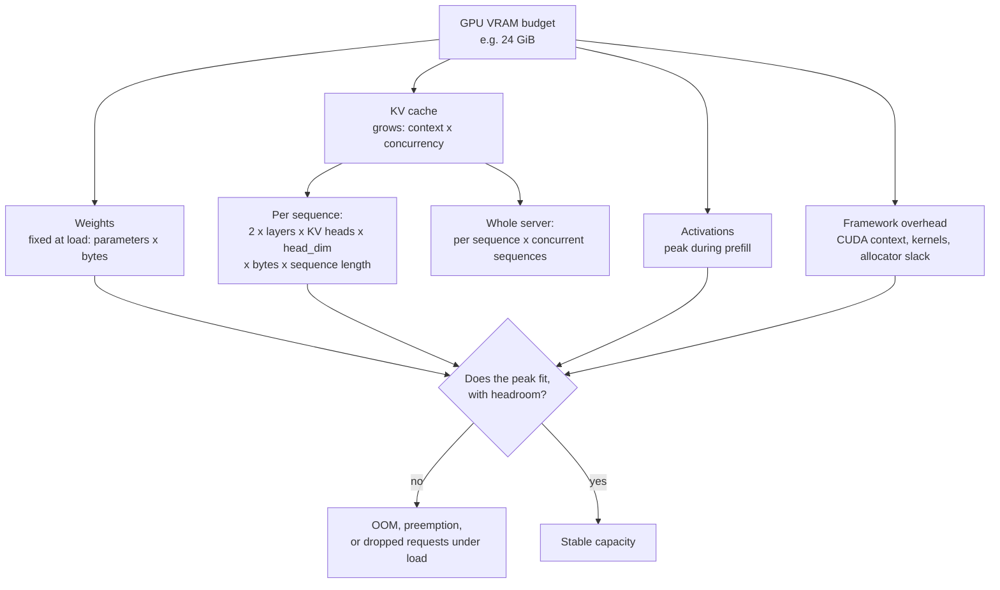

# Serving Capacity, Memory, and Benchmarking

> **Interview answer (say this first).** Serving capacity is a memory budget first and a latency problem second. The GPU holds weights, the KV cache, activations, and framework overhead, and only the weights are fixed: the KV cache grows with context length times concurrency, so the peak load decides whether you fit. Predict the bytes before you deploy, then benchmark with the real prompt-length distribution, not one toy request. Batching raises throughput and raises per-request latency, so there is a knee where extra concurrency buys almost no throughput but real latency. A single-request test proves nothing, and the arithmetic only helps if you leave headroom for fragmentation and spikes.

## Why this exists

A team ports a Llama 3 8B model to a single 24 GiB GPU. The model weights are about 14.9 GiB in fp16, so they load. A developer sends one prompt, sees a fast answer, and calls it done.

Then real traffic arrives. The workload has a p95 prompt of 3,000 tokens and outputs of up to 2,000, so a long sequence is about 5,000 tokens. At 128 KiB of KV cache per token for this model, one long sequence holds about 0.61 GiB. Forty of them run at once:

```text
40 sequences x 5,000 tokens x 128 KiB/token = 24.4 GiB of KV cache
```

That is more than the entire 24 GiB card, before the 14.9 GiB of weights are counted. The server runs out of GPU memory at 3 a.m. and starts refusing or dropping requests. The single-request test passed because one short request needed only a few dozen MiB of cache.

Nothing about the failure was mysterious. The arithmetic was available before the first request. Nobody did it, and nobody benchmarked at realistic load. This chapter is the arithmetic and the benchmark that prevent that night.

## Start from zero

| Word | Plain meaning |
| --- | --- |
| **Parameters** | The model's learned numbers. Counted in billions: 7B means seven billion. |
| **Precision** | How many bits one parameter uses. This fixes the bytes per parameter. |
| **Bytes per parameter** | FP32 = 4, FP16/BF16 = 2, INT8 = 1, INT4 = 0.5. |
| **Weights memory** | Bytes to hold every parameter once: parameters times bytes per parameter. |
| **Activation memory** | Temporary values produced during a forward pass; peaks during prefill. |
| **KV cache** | Stored attention keys and values for tokens already processed, reused at each decode step. |
| **Context length** | How many tokens one sequence can hold, prompt plus generated. |
| **Batch size** | How many sequences the GPU processes together in one forward pass. |
| **Concurrency** | How many requests are in flight at the same moment, running or waiting. |
| **Prefill** | The first pass: the whole prompt is processed in parallel. Compute-heavy. |
| **Decode** | The generation loop: one token per step. Memory-bandwidth-heavy. |
| **Time to first token (TTFT)** | Wait plus prefill until the first output token appears. |
| **Inter-token latency (ITL)** | The gap between later tokens; also called time per output token. |
| **Tokens per second** | A rate. Per request it is `1 / ITL`; for the server it is summed across requests. |
| **Throughput** | Total tokens produced per second by the whole server. |
| **Latency percentiles** | p50 is the median; p95 and p99 describe the slow tail users complain about. |
| **Admission control** | Deliberately queueing or rejecting work the server cannot serve, to protect what it can. |
| **Input-length distribution** | The mix of prompt lengths real traffic sends, not one average number. |
| **GPU utilisation** | How busy the compute units or the memory bandwidth are, read from monitoring. |
| **Memory fragmentation** | Free bytes that cannot be used because they are split into wrong-sized pieces. |
| **Headroom** | Memory and capacity you deliberately leave unused for spikes and overhead. |

Two contrasts to hold onto:

- **Weights are fixed; the KV cache is not.** Weights are decided at load time. The cache is decided by traffic, and it is usually the thing that runs out.
- **Bytes and bytes per second are different.** Memory tells you whether you fit. Bandwidth tells you how fast tokens come out. Both come from the same parameter count.

## The core idea

Picture packing a suitcase with four compartments. The **weights** are the clothes every trip needs, and they never change. The **KV cache** is the shopping you buy along the way — it grows with every token and every concurrent traveller. **Activations** are the temporary mess on the hotel bed while you unpack. **Framework overhead** is the suitcase's own weight: the CUDA context, kernel code, and allocator slack. The bag has one fixed size, so a bigger shopping pile means fewer travellers.

That is the GPU memory budget. You plan it for the peak, not the average, because the peak is what crashes.



The KV cache formula is the line to memorise:

```text
KV bytes = 2 x n_layers x n_kv_heads x head_dim x bytes_per_number
           x sequence_length x concurrent_sequences

              ^
       K and V, one each per layer
```

Each term is a fact you can look up in the model config:

| Term | Meaning | Example (Llama 3 8B) |
| --- | --- | --- |
| `2` | Separate key and value tensors | 2 |
| `n_layers` | Transformer blocks | 32 |
| `n_kv_heads` | Key/value heads (smaller under GQA) | 8 |
| `head_dim` | Features per head | 128 |
| `bytes_per_number` | Precision of the cache | 2 (fp16) |
| `sequence_length` | Prompt plus generated tokens | 4,096 |
| `concurrent_sequences` | Sequences held at once | 32 |

Worked through for this model:

```text
per token  = 2 x 32 x 8 x 128 x 2       = 131,072 bytes = 128 KiB
per sequence at 4,096 tokens            = 128 KiB x 4,096 = 0.5 GiB
the whole server at 32 sequences        = 0.5 GiB x 32    = 16 GiB
```

Notice the last line: the cache alone at modest concurrency is larger than many models' weights. Use the **KV head** count, not the query head count; for grouped-query attention (GQA) the KV heads are fewer.

The second core idea is the trade-off. As batch size grows, the GPU reads the weights once for more sequences, so throughput rises. But every sequence shares the step, so per-request latency also rises. The gain flattens while the cost keeps climbing. That bend is the **knee**.

| Batch size | Step time | Per-request tokens/s | Aggregate tokens/s | Change in aggregate |
| --- | --- | --- | --- | --- |
| 1 | 25 ms | 40 | 40 | — |
| 4 | 35 ms | 29 | 114 | +186% |
| 16 | 80 ms | 13 | 200 | +75% |
| 32 | 140 ms | 7 | 229 | +15% |
| 64 | 260 ms | 4 | 246 | +7% |
| 128 | 520 ms | 2 | 246 | +0% |

(Illustrative numbers, not a benchmark.) From 32 to 64 the server gains 7% throughput while per-request token rate nearly halves (7.1 → 3.8 tokens/s), and ITL rises about 86%. From 64 to 128 it gains nothing. The knee is where you should stop.

> **Note:**
>
> **Capacity is a peak question, not an average one.** A server sized for mean concurrency falls over at the daily peak. Size for the p95 or p99 of concurrent load, then leave headroom, because spikes and fragmentation do not announce themselves.

## How it works

1. **Count the parameters and pick a precision.** Read the model size in billions from the model card, then multiply by bytes per parameter: FP32 = 4, FP16/BF16 = 2, INT8 = 1, INT4 = 0.5. This gives the weight floor.
2. **Convert to the right unit.** Vendors quote memory in decimal GB (10^9 bytes) and GPUs in binary GiB (2^30 bytes). The gap is about 7%, which is enough to turn a plan that fits into an OOM. Pick one unit and stay in it.
3. **Compute the KV cache per token.** Use `2 x n_layers x n_kv_heads x head_dim x bytes_per_number`. For Llama 3 8B in fp16 that is 128 KiB per token. Take the head counts from the model config, not from memory.
4. **Multiply by sequence length.** `per token x context cap`. This is the worst-case footprint of one request. A large `max_model_len` silently multiplies every later number.
5. **Multiply by concurrency.** `per sequence x concurrent sequences`. This is what grows with traffic and what usually causes the OOM.
6. **Add activations and overhead.** Reserve memory for peak prefill activations, the CUDA context, kernel code, and allocator slack. A safe working figure on a modern card is 1–2 GiB, plus more for very long prefills.
7. **Choose the maximum batch and concurrency that fit.** Subtract weights, overhead, and your headroom from total VRAM. Divide the remainder by the per-sequence cache. That quotient is your ceiling, not a target.
8. **Set admission control to enforce it.** Cap concurrent sequences in the server (`max_num_seqs` in vLLM) and queue or reject the excess. A server that accepts work it cannot hold does not degrade gracefully; it fails.
9. **Measure prefill and decode separately.** Record TTFT for prefill plus queueing, and ITL for decode. A single latency number hides which phase is the problem.
10. **Find the throughput/latency knee.** Sweep concurrency upward, plot aggregate tokens per second and p95 latency, and stop where throughput flattens but latency still climbs.
11. **Benchmark with a representative input-length distribution.** Replay real prompt and output lengths, or sample from the production percentiles. One 200-token prompt measures a workload nobody has.
12. **Leave headroom and re-check after every change.** Fragmentation, a longer prompt, or a new model version can consume the margin. Keep 10–20% of VRAM free so a spike is a queue, not a crash.

Steps 3 to 7 are the whole capacity calculation. Steps 9 to 12 are how you prove it against reality instead of trusting it.

## The syntax you will use

**Weights memory and KV cache for a model and precision.** This is the reusable core of every capacity estimate.

```python
BYTES_PER_PARAM = {"fp32": 4, "fp16": 2, "bf16": 2, "int8": 1, "int4": 0.5}

def weights_gib(parameters: float, precision: str) -> float:
    return parameters * BYTES_PER_PARAM[precision] / 1024**3

def kv_gib(n_layers: int, n_kv_heads: int, head_dim: int, precision: str,
           seq_len: int, concurrency: int) -> float:
    per_token = 2 * n_layers * n_kv_heads * head_dim * BYTES_PER_PARAM[precision]
    return per_token * seq_len * concurrency / 1024**3

print(round(weights_gib(7e9, "fp16"), 2))       # 13.04 GiB
print(round(weights_gib(7e9, "int4"), 2))       # 3.26 GiB
print(round(kv_gib(32, 8, 128, "fp16", 8192, 32), 2))   # 32.0 GiB
print(round(kv_gib(32, 8, 128, "int8", 8192, 32), 2))   # 16.0 GiB
```

The `2` is K and V. Passing `"int8"` for the cache precision halves the result, which is exactly why cache quantisation raises concurrency.

**Batch size from a memory budget.** Subtract what is fixed, divide by what each sequence costs, and floor it.

```python
def max_concurrency(gpu_gib: float, weights_gib: float,
                    kv_gib_per_seq: float, overhead_gib: float,
                    headroom_gib: float = 0.0) -> int:
    free = gpu_gib - weights_gib - overhead_gib - headroom_gib
    if free <= 0 or kv_gib_per_seq <= 0:
        return 0
    return int(free // kv_gib_per_seq)

total, overhead = 24.0, 1.5
per_seq = kv_gib(32, 32, 128, "fp16", 4096, 1)      # 2.0 GiB, MHA model
for precision in ("fp16", "int8", "int4"):
    w = weights_gib(7e9, precision)
    print(precision, round(w, 2), max_concurrency(total, w, per_seq, overhead))

# fp16 13.04 4
# int8  6.52 7
# int4  3.26 9
```

The result is a ceiling to configure, not a promise: fragmentation and activations can still take the margin.

**A benchmark harness that records the numbers that matter.** It times each streamed token, so TTFT and ITL fall out of the same loop.

```python
import time

def percentile(values: list[float], p: float) -> float:
    if not values:
        return 0.0
    ordered = sorted(values)
    position = (len(ordered) - 1) * p
    lower = int(position)
    upper = min(lower + 1, len(ordered) - 1)
    weight = position - lower
    return ordered[lower] + (ordered[upper] - ordered[lower]) * weight

def benchmark(stream, prompts, memory_reader=None) -> dict:
    ttfts: list[float] = []
    itls: list[float] = []
    total_tokens = 0
    start = time.perf_counter()

    for prompt in prompts:
        t0 = time.perf_counter()
        first_at = None
        last_at = None
        for _token in stream(prompt):
            now = time.perf_counter()
            if first_at is None:
                first_at = now
                ttfts.append(first_at - t0)
            elif last_at is not None:
                itls.append(now - last_at)
            last_at = now
            total_tokens += 1

    elapsed = time.perf_counter() - start
    return {
        "ttft_p50_ms": percentile(ttfts, 0.50) * 1000,
        "ttft_p95_ms": percentile(ttfts, 0.95) * 1000,
        "itl_p50_ms": percentile(itls, 0.50) * 1000,
        "itl_p95_ms": percentile(itls, 0.95) * 1000,
        "tokens_per_s": total_tokens / elapsed,
        "peak_memory_gib": memory_reader() if memory_reader else None,
    }
```

Feed `stream` a real streaming client. `stream(prompt)` must yield tokens as they arrive, so the timestamp of the first yield is TTFT and the gaps between later yields are ITL. Report p50 and p95, never only the mean.

**Reading GPU memory.** With PyTorch, the peak allocation is one call. Without it, `nvidia-smi` works.

```python
def gpu_memory_gib() -> float:
    import torch
    return torch.cuda.max_memory_allocated() / 1024**3
```

```python
import subprocess

def gpu_memory_gib() -> float:
    out = subprocess.run(
        ["nvidia-smi", "--query-gpu=memory.used", "--format=csv,noheader,nounits"],
        capture_output=True, text=True, check=True,
    )
    return int(out.stdout.splitlines()[0]) / 1024
```

`max_memory_allocated` reports the peak, which is what OOMs. `memory.used` from `nvidia-smi` includes the framework overhead, so it is usually the larger and more honest number.

## Examples: simple to real

**Example 1 — weights memory for a 7B model at each precision.** The fixed floor of the budget.

| Precision | Bytes/parameter | 7B weights (GB) | 7B weights (GiB) |
| --- | --- | --- | --- |
| FP32 | 4 | 28.0 | 26.1 |
| FP16 / BF16 | 2 | 14.0 | 13.0 |
| INT8 | 1 | 7.0 | 6.5 |
| INT4 | 0.5 | 3.5 | 3.3 |

FP16 needs 14.0 GB, and INT4 needs 3.5 GB. Going from fp16 to int4 saves 10.5 GB of weights, which can become KV cache for more concurrent requests. Note the unit gap: 14.0 GB is 13.0 GiB, about 7% less. Use the same unit throughout or your capacity plan drifts.

**Example 2 — KV cache grows with context and concurrency.** Using Llama 3 8B at 128 KiB per token.

| Concurrent sequences | 2,048 tokens | 4,096 tokens | 8,192 tokens | 32,768 tokens |
| --- | --- | --- | --- | --- |
| 1 | 0.25 GiB | 0.5 GiB | 1.0 GiB | 4.0 GiB |
| 8 | 2.0 GiB | 4.0 GiB | 8.0 GiB | 32.0 GiB |
| 32 | 8.0 GiB | 16.0 GiB | 32.0 GiB | 128.0 GiB |
| 128 | 32.0 GiB | 64.0 GiB | 128.0 GiB | 512.0 GiB |

The cache scales linearly in both directions, so halving the context cap doubles how many sequences fit. At 128 concurrent sequences and 32,768-token context, the cache alone is 512 GiB, which no single GPU has. Concurrency and context length are the two dials that decide capacity.

**Example 3 — maximum concurrency on a 24 GB GPU.** A 7B multi-head-attention model (32 layers, 32 KV heads, head_dim 128) gives 512 KiB per token, or 2.0 GiB per 4,096-token sequence. Reserve 1.5 GiB for overhead.

| Precision | Weights (GiB) | Free for KV (GiB) | Sequences that fit |
| --- | --- | --- | --- |
| FP16 | 13.0 | 24 − 13.0 − 1.5 = 9.5 | 4 |
| INT8 | 6.52 | 24 − 6.52 − 1.5 = 15.98 | 7 |
| INT4 | 3.3 | 24 − 3.3 − 1.5 = 19.2 | 9 |

Quantising weights from fp16 to int4 more than doubles the sequence count, from 4 to 9. But even at int4 the cache dominates: 9 sequences at 2.0 GiB each is 18 GiB of a 24 GiB card. The bigger lever is attention shape. The same 7B model with GQA (8 KV heads instead of 32) uses 0.5 GiB per sequence, so fp16 weights would fit about 18 sequences. Weight precision helps; cache shape helps more.

**Example 4 — the throughput/latency knee.** Sweeping concurrency on one server and recording both numbers.

| Concurrency | TTFT p50 (ms) | ITL p50 (ms) | Per-request tokens/s | Aggregate tokens/s |
| --- | --- | --- | --- | --- |
| 1 | 120 | 25 | 40 | 40 |
| 2 | 130 | 28 | 36 | 71 |
| 4 | 150 | 35 | 29 | 114 |
| 8 | 180 | 50 | 20 | 160 |
| 16 | 240 | 80 | 13 | 200 |
| 32 | 360 | 140 | 7 | 229 |
| 64 | 600 | 260 | 4 | 246 |
| 128 | 1,100 | 520 | 2 | 246 |

(Illustrative numbers.) Throughput rises steeply to concurrency 16, then flattens. Between 32 and 64 the server gains 7% throughput and ITL rises about 86%. At 128 nothing improves. If your users are interactive, the knee is the largest concurrency that still meets the p95 TTFT and ITL targets. If the workload is batch, push past the knee and accept the latency.

**Example 5 — predicted memory versus measured.** An 8B fp16 model, 32 concurrent sequences at 4,096 tokens.

| Component | Predicted (GiB) | Note |
| --- | --- | --- |
| Weights | 14.9 | 8e9 parameters x 2 bytes |
| KV cache | 16.0 | 32 x 4,096 x 128 KiB |
| Activations (peak prefill) | 2.0 | temporary buffers during long prompts |
| Framework overhead | 1.5 | CUDA context, kernels, allocator slack |
| **Predicted total** | **34.4** | |
| **Measured peak** | **36.8** | about 7% above prediction |

The 2.4 GiB gap is not a mistake. The Python caching allocator holds freed blocks in case they are reused, temporary prefill buffers spike beyond the steady state, and the CUDA context has its own footprint. Fragmentation within the allocator does the rest. That is why the engine's `gpu_memory_utilization` knob exists and why you size against measured peak, not predicted arithmetic. A plan that fits with 0 GiB spare does not fit.

## In production

- **Predict memory before deploying, not after the first incident.** Compute weights, KV cache at peak concurrency, activations, and overhead. If the total exceeds VRAM minus headroom, change the plan, not the on-call rota.
- **Benchmark with the real input-length distribution.** Sample prompts and output lengths from production percentiles. One toy request measures one point on the curve and hides the tail that fills the cache.
- **TTFT and ITL matter differently by workload.** Interactive chat lives or dies on TTFT and steady ITL. Batch summarisation cares about total time and cost, where throughput dominates. State which you optimise.
- **Throughput and latency trade off, so name your target.** Batching raises one and worsens the other. A target like "p95 TTFT under 500 ms at 20 requests/s" makes the choice explicit and testable.
- **Quantisation saves memory at a quality cost, so measure it.** INT4 frees VRAM for cache and raises decode speed, but it can degrade structured output and tool calls first. Keep an evaluation that catches those failures.
- **Fragmentation causes OOM even when the arithmetic fits.** Variable-length KV allocations leave unusable gaps. Paged allocation helps, but it does not remove the need for headroom.
- **Leave headroom for spikes.** Reserve 10–20% of VRAM and some engine concurrency. A spike should lengthen the queue, not crash the server.
- **Admission control rejects work you cannot serve.** Cap concurrent sequences and queue the excess. Accepting everything is how a busy hour becomes an outage.
- **Concurrency is not the same as batch size.** Concurrency counts requests in flight, including queued ones; batch size is what runs in one forward pass. A queue of 100 with a batch of 32 means 68 requests are waiting.
- **A single-request test proves nothing about capacity.** One request uses almost no cache and never queues. It proves the model loads, not that the server survives the peak.
- **Watch GPU utilisation, not only latency.** High utilisation with a growing queue means you are saturated and need capacity or efficiency. Low utilisation with bad latency means the bottleneck is elsewhere, often batching or scheduling.
- **Re-predict after every change.** A new model, a longer `max_model_len`, a quantised cache, or a framework upgrade shifts the budget. Capacity plans age.

## Interview questions

### 1. How do you predict whether a model will fit on a given GPU?

**Answer.** Add four things and compare with usable VRAM. Weights are `parameters x bytes per parameter`. The KV cache is `2 x layers x KV heads x head_dim x bytes x sequence length x concurrency`. Add peak activations and framework overhead, then keep 10–20% headroom. If the total exceeds the card, quantise, shorten the context cap, reduce concurrency, or add GPUs.

**Follow-up: "Which component do you compute first?"** Weights, because they are fixed and they set the floor. Then the cache at peak concurrency, because it sets the ceiling.

**Trap.** Forgetting that GPU memory is usually labelled in GiB while model sizes are quoted in decimal GB. The 7% gap is enough to break a plan that fits on paper.

### 2. Write the KV cache formula and compute it for one model.

**Answer.** `KV bytes = 2 x n_layers x n_kv_heads x head_dim x bytes_per_number x sequence_length x concurrent_sequences`. The `2` is the separate key and value tensors. For Llama 3 8B — 32 layers, 8 KV heads, head_dim 128, fp16 — that is `2 x 32 x 8 x 128 x 2 = 131,072` bytes, or 128 KiB per token. At 8,192 tokens times 32 concurrent sequences, that is 32 GiB of cache.

**Follow-up: "How would you halve it?"** Quantise the cache to int8, which halves bytes per number, or shorten the context cap, or use a model with fewer KV heads. Each doubles capacity in a different way.

**Trap.** Using the query head count for a GQA model. Query heads share KV heads, so the query count overestimates the cache by the group factor — often four times.

### 3. What is the difference between TTFT and ITL, and which do you optimise?

**Answer.** TTFT is time to first token: queue time plus prefill, what the user feels as thinking. ITL is the gap between later tokens, set by decode speed. Total latency is roughly TTFT plus output tokens times ITL. Interactive chat optimises TTFT and steady ITL. Long batch generation optimises throughput and total time, tolerating slower tokens.

**Follow-up: "What makes ITL worse?"** A larger batch, because every sequence shares the step, and a memory-bandwidth-bound decode. It is also sensitive to very long sequences in the same batch.

**Trap.** Reporting one average latency. A fast mean can hide a slow tail, and a slow TTFT with fast ITL feels different from the reverse. Always report percentiles.

### 4. Why does a single-request test prove nothing about capacity?

**Answer.** One request holds one small KV cache and never experiences queueing, so it exercises almost none of the memory or scheduling that a real server needs. Capacity is about the peak: many concurrent sequences, long prompts, and fragmentation. A single-request smoke test proves the model loads and returns tokens. It says nothing about whether the server survives forty simultaneous long requests.

**Follow-up: "What test would you run instead?"** A load test at expected peak concurrency, using the production prompt-length distribution, watching p95 TTFT, p95 ITL, throughput, and peak memory together.

**Trap.** Treating a successful single request as a capacity result. It is a correctness check, not a capacity check.

### 5. How do you find the throughput/latency knee?

**Answer.** Sweep concurrency upward — 1, 2, 4, 8, 16, 32, 64, 128 — and record aggregate tokens per second and p95 TTFT and ITL at each step. Throughput rises steeply, then flattens. The knee is where an extra doubling of concurrency buys little throughput but adds real latency. Measure it; do not guess, because the knee depends on model, hardware, and the length mix.

**Follow-up: "What do you do if the knee is below your required throughput?"** Add capacity, quantise, shorten the context cap, or use prefix caching. Pushing past the knee does not create throughput that the hardware cannot deliver.

**Trap.** Assuming the largest batch is best. Past the knee, larger batches add latency and memory with no throughput gain.

### 6. What makes a benchmark meaningful?

**Answer.** A representative input-length distribution, steady arrival of requests, measured percentiles rather than means, and memory recorded alongside latency. It should run long enough to reach a steady state and be repeatable with the same load shape. A benchmark of one short prompt tells you almost nothing about a system that must handle a p95 of 3,000 tokens.

**Follow-up: "How do you get the distribution?"** Sample from production logs or use recorded traces. If you have no traffic yet, model the prompt and output lengths explicitly with a range and probabilities, and say so.

**Trap.** Reporting peak throughput with no latency bound. You can always raise throughput by ignoring the latency users experience; without an SLO, the number is meaningless.

### 7. Why can a server OOM even when the arithmetic says it fits?

**Answer.** The prediction covers steady-state usage. Reality adds fragmentation from variable-length KV allocations, temporary buffers that spike during prefill, allocator behaviour that retains freed blocks, and the CUDA context. Measured peak commonly runs several percent above prediction. That is why you leave headroom and why paged allocation exists.

**Follow-up: "How much headroom is enough?"** Commonly 10–20% of VRAM plus a concurrency margin. It should cover the largest prompt you will admit, not the average.

**Trap.** Sizing to exactly 100% of VRAM. A plan with zero spare is a plan to OOM at the first spike.

### 8. What is admission control and why is it needed?

**Answer.** Admission control is deciding which work the server accepts, queues, or rejects when it is at capacity. It caps concurrent sequences and bounds the queue so the server protects requests already running. Without it, a burst fills memory, causes OOM or preemption, and degrades every request. It converts an overload into a predictable wait or a clear rejection.

**Follow-up: "How does it relate to concurrency and batch size?"** Concurrency counts in-flight requests; batch size is what runs per forward pass. Admission control caps the in-flight count so the scheduler never has more cache allocated than the GPU can hold.

**Trap.** Confusing queueing with failure. A request waiting in an admitted queue is better than a request that took the server down; the SLO should state the maximum acceptable wait.

## Remember this

- **Capacity is a memory budget:** weights are fixed, the KV cache grows with context times concurrency, and activations and overhead take the rest. Plan the peak, not the average.
- **KV bytes = `2 x layers x KV heads x head_dim x bytes x sequence length x concurrency`.** For Llama 3 8B that is 128 KiB per token.
- **Bytes per parameter:** FP32 = 4, FP16/BF16 = 2, INT8 = 1, INT4 = 0.5. Weights = parameters times bytes, then convert GB and GiB carefully.
- **Throughput rises with batch until a knee, then only latency grows.** Find the knee by measurement, and state which number your workload values.
- **A single-request test proves nothing.** Benchmark with real prompt-length distributions, record p50 and p95, watch GPU memory and utilisation, and leave headroom for spikes and fragmentation.
