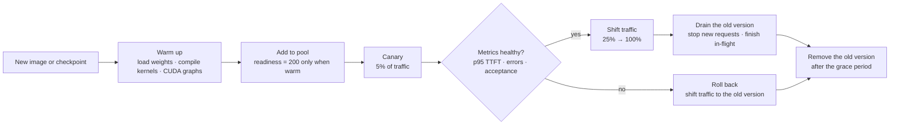

# Advanced Inference, Profiling, and Safe Rollouts

> **Interview answer (say this first).** Profile first to find the one bottleneck — compute, memory bandwidth, or the interconnect — then pull the lever that fits: continuous batching for throughput, prefix caching for shared prompts, speculative decoding for latency, quantisation for memory, or parallelism for a model that does not fit. Deploy the change with warmup, a canary, traffic shifting, a drain of the old replica, and a one-command rollback, so a model update is a controlled test rather than an outage.

## Why this exists

A team updates a model and rolls it out with no warmup and no draining. The new container image ships a newer checkpoint (a saved set of trained weights). The deployment replaces the old pods (the Kubernetes containers running the server) one by one. Three things go wrong at the same time:

1. Each new pod passes its readiness check (the probe that decides whether the load balancer sends it traffic) in about a second, so the load balancer starts sending it real traffic immediately. But the weights are still loading into VRAM and the kernels are still compiling. The first requests sit in a cold server and time out at 30 seconds.
2. The old pods are terminated the moment the new ones are "ready". Kubernetes sends `SIGTERM` (the standard termination signal), the process exits at once, and every request still generating is dropped. Users see truncated answers and connection resets.
3. There is no canary. One hundred per cent of traffic moved to a build that nobody had ever served with, and the only signal was the error-rate graph climbing.

The failure is not the new model. The failure is the deployment. The old version is gone before the new one is proven, and no request was ever drained. This chapter is about the two halves of avoiding that: the performance levers you apply before you ship, and the release sequence that keeps serving while you ship.

> **Note:**
>
> **The one-sentence purpose.** Profile to find the bottleneck, fix one thing, then deploy the change with warmup, a canary, draining, and a tested rollback — so a model update is a controlled experiment, not an outage.

## Start from zero

Assume no prior knowledge of GPU serving internals. Each word below is defined where it first matters.

| Word | Plain meaning |
| --- | --- |
| **Prefix caching** | Reusing the attention keys and values of a prompt prefix (such as a shared system prompt) across requests, so it is processed once instead of per request. |
| **Speculative decoding** | A small draft model proposes several tokens; the large target model verifies them all in one forward pass and keeps the ones it agrees with. |
| **Continuous batching** | A scheduler that lets requests join and leave the running batch at every decode step, instead of grouping requests and waiting for the slowest. |
| **PagedAttention** | vLLM's method of storing the KV cache in fixed-size blocks (pages) with a lookup table, like operating-system virtual memory, which cuts fragmentation and allows sharing. |
| **Tensor parallelism (TP)** | Splitting each layer's weight matrices across several GPUs and combining partial results with a collective. |
| **Pipeline parallelism (PP)** | Splitting the model's layers into stages on different GPUs and streaming micro-batches through them. |
| **Data parallelism (DP)** | Replicating the whole model on several GPUs and splitting the incoming requests between the copies. |
| **NVLink** | NVIDIA's high-bandwidth GPU-to-GPU link inside one machine, hundreds of GB/s. |
| **PCIe** | The standard bus between CPU and GPU and across some GPU pairs, about 32 GB/s per direction on Gen4 x16. |
| **InfiniBand** | A high-speed network between machines, tens of GB/s per port, used when a model spans nodes. |
| **NCCL** | NVIDIA Collective Communications Library: the software that implements multi-GPU collectives over NVLink, PCIe, and InfiniBand. |
| **Collective operation** | A communication call that involves several GPUs at once, such as all-reduce, all-gather, or all-to-all. |
| **Warmup** | Running real requests at start-up so weights are loaded and kernels and CUDA graphs are built before user traffic arrives. |
| **Draining** | Stopping acceptance of new requests and letting in-flight requests finish before the process exits. |
| **Graceful shutdown** | Handling the termination signal by draining, then exiting cleanly, instead of being killed mid-request. |
| **Rollout** | The process of replacing the running version with a new one across a fleet. |
| **Canary** | Sending a small share of traffic to the new version first, then increasing it while watching metrics. |
| **Blue-green** | Running two complete environments and switching all traffic from one to the other at once. |
| **Rollback** | Returning to the previous version, ideally by deploying the previous immutable image digest. |
| **Kernel** | A small program that runs on the GPU across many threads at once. |
| **CUDA graph** | A recorded sequence of GPU work replayed with a single launch, which removes per-step CPU launch overhead. |
| **Profiling** | Measuring where time and memory actually go. Tools include Nsight Systems, Nsight Compute, and `torch.profiler`. |
| **Bottleneck** | The single slowest resource that limits the whole system. Speeding up anything else changes nothing. |
| **GPU utilisation** | The fraction of a sampling window during which GPU kernels were executing. It is not the same as memory throughput or compute efficiency. |
| **Memory bandwidth** | How fast data moves between VRAM and the compute units, in GB/s. |
| **Interconnect-bound** | Limited by the speed of the link between devices, not by compute or local memory. |

Three distinctions to hold onto:

- **Latency versus throughput.** A change can improve one and worsen the other. Batching raises throughput and usually raises per-request latency.
- **A fast kernel versus a fast system.** A kernel can be optimal while the system idles in the queue, the scheduler, or the interconnect.
- **A healthy process versus a ready server.** A process can answer an HTTP health check while the model is still loading and cold.

## The core idea

Think of a factory that is falling behind. You do not walk in and buy a faster machine. You watch the line, find the one station where work piles up, and fix that station. Then you watch again, because the pile-up has moved downstream. That is profiling: the bottleneck moves as you fix it.

Two things sit on top of that discipline. First, a small set of levers, each of which moves a different number at a different price. Second, a release sequence that proves the change is safe before it takes all the traffic.

What each lever actually buys and costs:

| Lever | What it improves | What it costs |
| --- | --- | --- |
| **Continuous batching** | Throughput and cost per token: requests join and leave the batch each step. | Higher per-request latency at large batches; more KV-cache memory. |
| **Prefix caching** | TTFT, throughput, and cost: shared prompt tokens are prefilled once. | VRAM for the cached blocks; pays off only when prefixes actually repeat. |
| **Speculative decoding** | Inter-token latency at low batch: a draft model proposes, the target verifies. | Extra VRAM and a draft model; gains collapse when acceptance is low; can hurt at high batch. |
| **Quantisation** | Memory, decode speed, and cost: fewer bytes per weight and sometimes per cache entry. | Quality risk; needs calibration and evaluation on your data. |
| **Parallelism (TP / PP / DP)** | Capacity and latency for a model larger than one GPU. | More GPUs; TP pays an all-reduce per layer and needs fast interconnect; PP pays idle bubble time. |

The interconnect is what decides whether parallelism is a win or a loss:

| Link | Where it runs | Approximate bandwidth | Typical use |
| --- | --- | --- | --- |
| **NVLink** | GPU to GPU inside one node | Hundreds of GB/s | Tensor parallelism, fast collectives |
| **PCIe Gen4/5** | Host to GPU, and GPU to GPU across a PCIe switch | ~32–64 GB/s per direction | Host transfers; too slow for aggressive TP |
| **InfiniBand** | Between machines | Tens of GB/s per port | Pipeline and data parallelism across nodes; NCCL over the network |

A safe rollout follows the same shape every time: prove the new version can serve, let it serve a little, watch real numbers, then let it serve everything and remove the old version only after it is idle.



The order matters. Warming before traffic prevents the cold-start timeout. The canary limits the blast radius. Draining prevents dropped requests, and keeping the old version until the new one is healthy is what makes rollback a one-command operation instead of a rebuild.

## How it works

1. **Profile first, and name the bottleneck in one of three categories.** Is the limit compute (the arithmetic units are busy), memory bandwidth (data cannot arrive fast enough), or the interconnect (the link between GPUs is the slow part)? You cannot pick a lever until you know which one. Measure before you change anything, and write down the baseline.
2. **Read the right signal.** `nvidia-smi utilization.gpu` is time-based and often misleading during decode; it can read low while memory bandwidth is saturated. For a real answer, use `torch.profiler` for operator time and memory, and Nsight Compute for per-kernel counters such as DRAM throughput and tensor-pipe activity.
3. **Apply prefix caching when prompts share a prefix.** Agent loops and chat systems repeat a long system prompt and growing conversation history on every call. With prefix caching, the KV cache for that shared prefix is computed once and reused, which cuts prefill cost and time to first token. In vLLM this uses hashed KV-cache blocks; in SGLang the same idea is called RadixAttention. It only pays when the prefix is byte-identical and reused.
4. **Use speculative decoding when inter-token latency is the target and the batch is small.** A small draft model generates `k` candidate tokens cheaply. The target model then scores all `k + 1` positions in one forward pass, accepts the longest correct prefix, and corrects the first disagreement with its own token. It preserves the target model's output distribution, so quality is unchanged, but it costs a draft model and extra VRAM. The win depends entirely on the acceptance rate.
5. **Choose a parallelism strategy when the model is larger than one GPU.** Prefer data parallelism (replicas) when the model already fits, because it adds throughput with no collectives. Use tensor parallelism to split each layer across GPUs on the same node over NVLink. Use pipeline parallelism to split the layer stack across nodes, accepting idle bubble time. Combine them as `DP × TP × PP`.
6. **Warm the model before it takes any traffic.** Load the weights, build the KV cache, compile the kernels it will actually use, and capture CUDA graphs. Then run one real request through the whole path. Only when that succeeds should the readiness endpoint return 200.
7. **Canary the new version.** Send a small, fixed share of traffic to the new replica and hold it there. Compare p95 TTFT, inter-token latency, error rate, quality metrics, and GPU memory against the old version. Do not ramp because time passed; ramp because the numbers passed.
8. **Drain and shut down gracefully on `SIGTERM`.** Stop accepting new requests, finish the ones in flight, flush metrics, then exit. On Kubernetes, a `preStop` sleep gives the load balancer time to stop sending new connections after the pod is removed from the endpoints list, and `terminationGracePeriodSeconds` must be longer than preStop plus drain.
9. **Roll back on a regression, immediately and automatically.** Because the previous image digest is immutable and still in the registry, rollback is a pointer change. Automate it on a metric threshold so no human has to decide at 3 a.m. Keep the old version running until the new one is healthy.

The subtle steps are 1 and 2. Most teams skip profiling, reach for speculative decoding or tensor parallelism, and then cannot explain why throughput did not move. A lever pulled against the wrong bottleneck is wasted work.

### What a memory-bandwidth bottleneck looks like

Decode at batch one reads every weight from VRAM to produce a single token. That is a bandwidth operation, not a compute operation.

```text
A 7B fp16 model reads about 14 GB per token.
A100 80 GB peak bandwidth ~2039 GB/s.
Ceiling at batch 1 = 2039 / 14 ≈ 145 tokens/s.
Compute used at that rate = ~0.7% of peak tensor throughput (2.04 TFLOP/s against 312 TFLOPS dense FP16).
```

So the GPU is "busy" on memory and nearly idle on compute. If a profiler shows DRAM throughput near peak while tensor-pipe activity is very low, the fix is to batch more sequences, quantise to read fewer bytes, or cache a shared prefix — not to rewrite the attention kernel.

## The syntax you will use

**A vLLM server with prefix caching, a draft model, and tensor parallelism.** Flags are the levers. Enable one at a time so you can attribute the gain; the block below shows the full set for reference.

```bash
vllm serve meta-llama/Llama-3.1-70B-Instruct \
  --enable-prefix-caching \
  --speculative-model meta-llama/Llama-3.2-1B-Instruct \
  --num-speculative-tokens 5 \
  --tensor-parallel-size 4 \
  --max-num-seqs 64 \
  --max-model-len 16384
```

`--enable-prefix-caching` turns on reuse of shared KV-cache blocks (recent vLLM versions also accept `--no-enable-prefix-caching` to disable it where it is on by default). `--speculative-model` names the draft model and `--num-speculative-tokens` sets `k`. `--tensor-parallel-size` must equal the number of GPUs in the group, and the group *should* sit on NVLink; over PCIe the per-layer all-reduce can dominate (see Example 3). SGLang uses different names: prefix caching is on by default via RadixAttention (disable with `--disable-radix-cache`) and speculative decoding uses `--speculative-algorithm EAGLE --speculative-draft-model-path <path>`.

**Measure TTFT and inter-token latency from the client.** The server's own metrics miss network and queueing delays that the user feels.

```python
import time
from openai import OpenAI

client = OpenAI(base_url="http://localhost:8000/v1", api_key="EMPTY")

start = time.perf_counter()
stream = client.chat.completions.create(
    model="meta-llama/Llama-3.1-8B-Instruct",
    messages=[{"role": "user", "content": "Explain paged attention."}],
    max_tokens=256,
    stream=True,
)

ttft = None
last = None
itls = []
for chunk in stream:
    now = time.perf_counter()
    if chunk.choices and chunk.choices[0].delta.content:
        if ttft is None:
            ttft = now - start          # time to first token
        if last is not None:
            itls.append((now - last) * 1000)   # inter-token latency, ms
        last = now

print(f"TTFT {ttft * 1000:.0f} ms  mean ITL {sum(itls) / len(itls):.1f} ms")
```

TTFT tells you about prefill, queueing, and prefix caching. Mean ITL tells you about decode, quantisation, and speculative decoding. Watch p95, not just the mean.

**Profile with the standard tools.** Use `torch.profiler` for operator-level time and memory, Nsight Systems for the CPU–GPU timeline, and Nsight Compute for per-kernel counters.

```python
import torch
from torch.profiler import profile, ProfilerActivity

with profile(activities=[ProfilerActivity.CPU, ProfilerActivity.CUDA]) as prof:
    with torch.no_grad():
        model.generate(**inputs, max_new_tokens=64)

print(prof.key_averages().table(sort_by="cuda_time_total", row_limit=10))
```

```bash
nsys profile --stats=true python bench_serve.py     # CPU/GPU timeline, gaps
ncu --set full -k regex:attention python bench.py   # per-kernel counters
```

On the timeline, a gap between kernels means the GPU is waiting on the CPU or the network. In Nsight Compute, `dram__throughput.avg.pct_of_peak_sustained_elapsed` near 100% with low tensor-pipe activity means memory-bound.

**A Kubernetes readiness gate plus a `preStop` drain.** Readiness keeps traffic away until warm; the sleep lets endpoint removal propagate before the process stops accepting.

```yaml
spec:
  terminationGracePeriodSeconds: 90      # must exceed preStop + drain time
  containers:
    - name: vllm
      readinessProbe:
        httpGet: {path: /health, port: 8000}
        periodSeconds: 5
        failureThreshold: 60             # allow a slow load before marking unready
      lifecycle:
        preStop:
          exec:
            # let load balancers stop sending new connections first
            command: ["/bin/sh", "-c", "sleep 15"]
```

Readiness returns 200 only after a warmup request succeeds. The `sleep 15` in `preStop` runs before `SIGTERM`, so in-flight clients are not cut off the instant the pod is removed from the endpoints list.

**A canary rollout with Argo Rollouts.** The controller holds the new version at 5%, then promotes step by step.

```bash
# start the canary at the new immutable image
kubectl argo rollouts set image inference-server \
  inference-server=registry.example.com/acme/llm-server:2.1.0 -n serving

kubectl argo rollouts status inference-server -n serving     # watch the analysis
kubectl argo rollouts promote inference-server -n serving    # 5% -> 25% -> 100%
kubectl argo rollouts abort inference-server -n serving      # shift traffic back now
kubectl argo rollouts undo inference-server -n serving       # full rollback to previous
```

`abort` stops the rollout and returns traffic to the stable version. `undo` rolls back to the previous revision. If an `AnalysisTemplate` watches p95 latency or error rate, the controller aborts automatically.

## Examples: simple to real

Every number below is an illustrative example, not a benchmark.

**Example 1 — prefix caching removes repeated prefill.** A 1,500-token system prompt is shared by every request. Each request adds 150 unique tokens. There are 5,000 requests.

```python
P, U, N = 1500, 150, 5000      # shared prefix, unique tokens, requests
without = N * (P + U)          # every request prefills the whole prompt
with_cache = P + N * U         # the prefix is prefilled once

print(without)                                         # 8,250,000
print(with_cache)                                      # 751,500
print(round((1 - with_cache / without) * 100, 2))      # 90.89

for rate in (2000,):           # illustrative prefill rate: tokens/second
    print(round(without / rate, 1), "s vs", round(with_cache / rate, 1), "s")
    # 4125.0 s vs 375.75 s
```

Reusing the prefix removes about **91%** of the prefill work. At an illustrative 2,000 prefill tokens per second, that is roughly 69 minutes of GPU prefill time reduced to about 6 minutes across the run. This is the single highest-leverage change for agent workloads, where every step repeats a long system prompt and a scratchpad. The catch: the prefix must be exactly identical — one changed token early in the prompt invalidates the cache from that point on.

**Example 2 — speculative decoding helps only when the acceptance rate is high.** The expected accepted tokens per step is `(1 - alpha^(k+1)) / (1 - alpha)`. Because every proposed token costs something, the honest speedup divides by `1 + k*c`, where `c` is the draft cost as a fraction of a target token.

```python
def speedup(alpha, k, c=0.1):
    accepted = (1 - alpha ** (k + 1)) / (1 - alpha)
    return accepted, accepted / (1 + k * c)

for alpha, k in [(0.9, 5), (0.8, 4), (0.5, 4), (0.3, 4)]:
    acc, sp = speedup(alpha, k)
    print(f"alpha={alpha} k={k} -> accepted={acc:.2f} speedup={sp:.2f} "
          f"ITL 30ms -> {30 / sp:.1f}ms")
```

```text
alpha=0.9 k=5 -> accepted=4.69 speedup=3.12 ITL 30ms ->  9.6ms
alpha=0.8 k=4 -> accepted=3.36 speedup=2.40 ITL 30ms -> 12.5ms
alpha=0.5 k=4 -> accepted=1.94 speedup=1.38 ITL 30ms -> 21.7ms
alpha=0.3 k=4 -> accepted=1.43 speedup=1.02 ITL 30ms -> 29.5ms
```

At 90% acceptance the inter-token gap falls from 30 ms to under 10 ms. At 30% acceptance the whole mechanism is roughly break-even, and you have paid for a draft model and extra VRAM for nothing. Acceptance depends on the draft model and on your data, so measure it; do not trust a headline. Speculative decoding also tends to hurt at high batch sizes, where the GPU is already saturated with useful parallel work.

**Example 3 — tensor parallelism splits a model that does not fit, but the interconnect decides whether it wins.** A 70B fp16 model is about 140 GB of weights; an 80 GB GPU cannot hold it. Split it four ways with tensor parallelism.

```text
One layer, 4096 tokens, hidden size 4096, fp16:
  activation data                   33.6 MB
  ring all-reduce volume at TP=4    50.3 MB per layer   (2 x (N-1)/N x tensor)

Illustrative timings:
  compute per GPU (300 TFLOP/s)     ~114 us
  all-reduce over NVLink (450 GB/s) ~112 us   -> hides behind compute
  all-reduce over PCIe (25 GB/s)   ~2013 us   -> 18x the compute time
```

Over 80 layers, the PCIe case adds roughly 161 ms of pure communication per forward pass, so the split model is far slower than a single GPU would have been if it had fitted. The lesson is not "TP is good" or "TP is bad". It is that tensor parallelism belongs on NVLink inside a node; across PCIe or a network, prefer pipeline parallelism or quantise until the model fits. These hardware figures are illustrative, not measured benchmarks.

**Example 4 — a safe rollout with warmup, canary, drain, and rollback.** The table is the plan; each row is a gate, not a step on a clock.

| Stage | Traffic to new | Gate before moving on | If the gate fails |
| --- | --- | --- | --- |
| Warmup | 0% | One real request succeeds; readiness returns 200 | Keep the replica out of the pool; page the owner |
| Canary | 5% | p95 TTFT, error rate, and acceptance within the baseline | `abort`: shift 5% back to the old version |
| Ramp | 25% → 100% | Same metrics hold at each step | `abort` and investigate before retrying |
| Drain old | 100% new | Old replicas have zero in-flight requests | Wait; do not kill early |
| Remove old | 100% new | Grace period elapsed, no errors | `undo` to the previous revision |

The important row is the last one. The old version stays alive and routable until the new version has been healthy under full traffic, because that is what makes `undo` a ten-second operation. Draining means the old replicas stop accepting new requests but finish the ones already generating, so no user sees a truncated answer. And every gate compares a real metric — not a pod status.

**Example 5 — profiling shows a memory-bandwidth bottleneck.** A single-request decode benchmark reports low latency per token but the team wants more throughput, so they reach for a faster attention kernel. Profiling says otherwise.

```text
torch.profiler, sorted by CUDA time:
  aten::linear (matrix-vector)     62% of GPU time
  flash attention                   14%
  sampling                           9%
  other                              15%

Nsight Compute on the linear kernel:
  dram__throughput.avg.pct_of_peak_sustained_elapsed   91%   <- memory saturated
  sm__pipe_tensor_cycles_active.avg.pct_of_peak_sustained_elapsed  6%  <- compute idle
```

The linear layers are memory-bound. A faster attention kernel improves 14% of the timeline and nothing else. The correct fixes are the ones that move fewer bytes or do more work per byte: quantise the weights, raise the batch size so each loaded weight serves many sequences, or reuse a shared prefix so fewer tokens are processed at all. Profiling turned a vague "make it faster" into one specific, testable change.

## In production

- **Profile before you optimise, and name the bottleneck in one of three categories.** Compute, memory bandwidth, or interconnect. A lever pulled against the wrong limit moves nothing and adds complexity.
- **The bottleneck moves as you fix it.** Decode is bandwidth-bound; batch it and you drift toward compute-bound; add tensor parallelism and you can become interconnect-bound. Re-profile after every change.
- **Prefix caching needs shared prefixes to pay off.** If every request has a different prompt, the cache never hits and you have only spent VRAM. It is a huge win for agent loops and chat; it is near-useless for one-off, unique prompts.
- **Speculative decoding gains depend on the acceptance rate.** Track acceptance per draft model and per traffic mix, and disable it when acceptance drops. It also tends to hurt at high batch, where the GPU already has parallel work.
- **Parallelism trades latency for capacity and needs fast interconnect.** Tensor parallelism adds an all-reduce per layer; on PCIe rather than NVLink it can be slower than one GPU. Quantise before you parallelise.
- **Always warm up before serving.** Load weights, compile kernels, capture CUDA graphs, and run a real request. Gate readiness on that request. A health check that does not touch the model proves nothing.
- **Drain before shutdown or you drop in-flight requests.** Stop accepting, finish what is running, and give `terminationGracePeriodSeconds` room for `preStop` plus drain. A generation can take tens of seconds; a default 30-second grace period can be too short.
- **Canary with real metrics and automatic rollback.** Watch p95 TTFT, inter-token latency, error rate, quality, and GPU memory. A canary with no analysis is just a slower full rollout.
- **Keep the old version until the new one is healthy.** That is what makes rollback a pointer change rather than a rebuild. Deploy by immutable image digest so the old target always exists.
- **NVLink versus PCIe changes the design.** Check `nvidia-smi topo -m` before choosing a tensor-parallel degree. If the GPUs are connected through `SYS` or `PHB`, expect communication to dominate.
- **Watch memory bandwidth, not just SM utilisation.** High `utilization.gpu` from a memory-bound decode is not efficiency; low compute utilisation with a fast token rate is healthy. Measure DRAM throughput and tokens per second, not a single percentage.
- **A rollout is a test, not a hope.** Write the hypothesis ("the new checkpoint improves quality at equal p95 latency"), define the metric that proves it, and let the controller abort when the metric fails.

## Interview questions

### 1. How do you decide what to optimise first?

**Answer.** Profile, then classify the bottleneck as compute, memory bandwidth, or interconnect. Measure the baseline under realistic load, decompose latency into queue, prefill, and decode, and look at what the profiler says the GPU is actually doing. Only then pick a lever. Change one thing, re-measure, and expect the bottleneck to move.

**Follow-up: "What if `nvidia-smi` shows low GPU utilisation?"** Low utilisation with a fast token rate usually means memory-bound decode, which is normal. Low utilisation with a slow token rate means the GPU is starved — by the CPU, the scheduler, the queue, or small batches — and batching is the fix.

**Trap.** Reaching for the most sophisticated optimisation first. Speculative decoding or tensor parallelism applied to a queueing problem makes the system more complex and no faster.

### 2. What is prefix caching and when does it pay off?

**Answer.** Prefix caching stores the attention keys and values for a shared prompt prefix and reuses them across requests, so the prefix is prefilled once instead of per request. In vLLM it is implemented with hashed KV-cache blocks; SGLang calls it RadixAttention. It cuts time to first token and frees compute for decode. It pays off only when the prefix is byte-identical and reused, which is exactly the case in chat and agent loops.

**Follow-up: "Why byte-identical?"** The cache is keyed on the token sequence, so any change early in the prompt invalidates everything after it. Reordering a system prompt or inserting a timestamp at the top of it destroys the hit rate.

**Trap.** Enabling it and assuming a gain. If prompts are unique, the hit rate is zero and you have only consumed VRAM.

### 3. How does speculative decoding work, and when does it hurt?

**Answer.** A small draft model proposes `k` tokens cheaply. The target model then scores all `k + 1` positions in one forward pass, accepts the longest correct prefix, and replaces the first disagreement with its own token. This preserves the target model's distribution. The expected accepted tokens per step is `(1 - alpha^(k+1)) / (1 - alpha)` for acceptance rate `alpha`, and the honest speedup divides by `1 + k*c` for draft cost `c`. At 90% acceptance it is a large inter-token latency win; at 30% it is roughly break-even, and you have paid for a draft model and extra memory.

**Follow-up: "Where does the extra memory go?"** The draft model's weights plus the extra KV cache and verification buffers. At high concurrency that competes with the main model's KV cache and can reduce the number of sequences that fit.

**Trap.** Enabling it from a headline benchmark without measuring acceptance on your own data. Most published numbers come from a draft model tuned to the same traffic.

### 4. How do you choose a parallelism strategy, and why does the interconnect matter?

**Answer.** If the model fits on one GPU, use data parallelism (replicas) for throughput; it needs no collectives. If it does not fit, split it. Tensor parallelism splits each layer and pays an all-reduce per layer, so it needs NVLink inside a node. Pipeline parallelism splits the layer stack and tolerates slower links but pays bubble idle time. In practice you combine them as `DP × TP × PP`, keeping TP intra-node and PP across nodes.

**Follow-up: "What if the GPUs are only connected by PCIe?"** Avoid aggressive tensor parallelism. Quantise to shrink the model, use fewer TP ranks, or use pipeline parallelism instead, because the per-layer all-reduce may exceed the layer's compute time.

**Trap.** Treating more GPUs as automatically faster. Communication grows as compute per GPU shrinks, so past some point adding tensor ranks makes each layer slower.

### 5. Why warm up a model, and how is that different from a readiness probe?

**Answer.** Warmup loads the weights, builds the KV cache, compiles the kernels for the shapes you serve, and captures CUDA graphs, then runs a real request through the full path. A readiness probe is just the gate that exposes the result: it returns 503 until warmup succeeds, then 200. Without warmup, readiness can be green while the first user request pays seconds of loading and compiling and times out.

**Follow-up: "What should warmup exercise?"** The shapes you actually serve: a short prompt, a representative one, and a long-context one if that path matters. Warming only the short path leaves long-context compilation to a user.

**Trap.** Warming up with a tiny fake request that never touches the model. The probe passes and the cold path is still there.

### 6. How do you drain and shut down a model server without dropping requests?

**Answer.** On termination, stop accepting new requests, finish the ones in flight, flush metrics, then exit. In Kubernetes, a `preStop` hook sleeps briefly so endpoint removal propagates to load balancers before the process stops accepting, and `terminationGracePeriodSeconds` must exceed `preStop` plus the longest drain. A long generation can take tens of seconds, so the default grace period is often too short.

**Follow-up: "Why not just kill the pod?"** Long-lived streaming generations are cut mid-sentence, and clients see connection resets. Draining turns a hard failure into a graceful one.

**Trap.** Assuming readiness removal is instant. Endpoint updates are asynchronous, so a pod can still receive traffic for a moment after it is marked Terminating; the `preStop` sleep covers that window.

### 7. Compare canary and blue-green for a model update.

**Answer.** Blue-green runs two complete environments and switches all traffic at once, so rollback is instant but you pay double the infrastructure and the switch is risky for a stateful or warmup-heavy model. Canary sends a small share to the new version, watches real metrics, and ramps up; cost is low and the blast radius is small, but it needs traffic splitting and good observability. For model serving, canary is usually better because a fresh replica must warm up anyway and the metrics — latency, quality, acceptance — tell you when it is safe.

**Follow-up: "How do you roll back?"** Shift the traffic weight back to the stable version, or redeploy the previous immutable image digest. With Argo Rollouts, `abort` returns traffic immediately and `undo` reverts the revision.

**Trap.** Calling a canary "5% of pods". Canary is about traffic share, not replica count; without traffic splitting you cannot control the blast radius.

### 8. How do you profile an inference server, and what does a memory-bandwidth bottleneck look like?

**Answer.** Start with `torch.profiler` for operator-level CUDA time and memory, use Nsight Systems for the CPU–GPU timeline and gaps, and Nsight Compute for per-kernel counters. A memory-bandwidth bottleneck looks like high DRAM throughput (near the peak sustained percentage) with low tensor-pipe activity: the linear or matrix-vector kernels dominate the timeline, and the compute units are idle while waiting for weights. The fixes are quantisation, larger batch size, and prefix caching — things that reduce bytes read or increase work per byte.

**Follow-up: "What does an interconnect bottleneck look like?"** Long communication gaps around collectives, with per-layer all-reduce time comparable to or larger than layer compute. The fix is a faster fabric (NVLink), fewer tensor ranks, or a different parallelism strategy.

**Trap.** Trusting `utilization.gpu` as a proxy for efficiency. It measures whether any kernel ran during the sample window, not whether the GPU did useful work or was bound by memory.

## Remember this

- **Profile, classify the bottleneck, change one thing, re-measure.** The bottleneck is compute, memory bandwidth, or interconnect — and it moves as you fix it.
- **Prefix caching for shared prompts, speculative decoding for low-batch latency, quantisation for memory, parallelism for fit.** Each has a price and a precondition.
- **Warm before traffic, gate readiness on a real request.** A green health check is not a warm model.
- **Canary, then drain, then remove — and keep the old version until the new one is healthy.** Rollback must be a one-command pointer change.
- **A rollout is a test.** Define the metric that proves the change, watch it during the canary, and let it trigger the rollback automatically.
