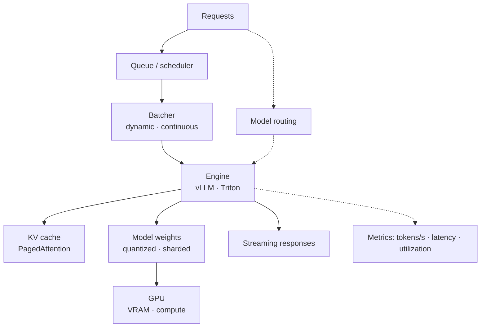

# Phase 10 — Model Serving and AI Infrastructure

Everything up to now assumed a model call. This phase is about the machine underneath that call: what a GPU actually is, how a model fits in memory, how batching changes throughput, how quantization shrinks the weights, how vLLM serves many requests at once, and how you decide between running locally, in the cloud, or both.

Serving is where AI systems meet physics. Latency, throughput, VRAM, and cost are bounded by hardware and by queueing, not by clever prompts. Understanding this layer is what lets you argue about a number — tokens per second, cost per million tokens, or the batch size that fits in 80 GB — instead of guessing.

## What you will be able to do

By the end of this phase you should be able to:

- Load and serve models with Hugging Face Transformers and its tokenizers.
- Explain GPU fundamentals, CUDA, VRAM budgets, utilization, and CPU vs GPU inference.
- Reason about the KV cache and batch inference, including dynamic and continuous batching.
- Choose a quantization approach (INT8, INT4, GGUF, GPTQ, AWQ) and predict its memory and quality trade-offs.
- Explain model parallelism (tensor and pipeline) and when it is required.
- Describe how vLLM and PagedAttention deliver high-throughput serving.
- Run or consume OpenAI-compatible model servers and Triton, and handle caching, warmup, autoscaling, and GPU scheduling.
- Route between models and choose between local, cloud, and hybrid infrastructure.
- Serve LoRA adapters and fine-tuned models.
- Optimize for cost, throughput, latency, and GPU utilization.

## The serving stack

Every lever in this phase moves one of four numbers: **latency** (how long one request waits), **throughput** (how many tokens per second per GPU), **memory** (what fits in VRAM), and **cost** (dollars per million tokens). The rest is mechanism.

## Topic order

1. [Hugging Face Transformers](01-hugging-face-transformers.md) — downloading, loading, and tokenizers.
2. [GPU fundamentals and CUDA](02-gpu-fundamentals-and-cuda.md) — memory, compute, and utilization.
3. [Inference batching and the KV cache](03-inference-batching-and-kv-cache.md) — dynamic and continuous batching.
4. [Quantization for serving](04-quantization-for-serving.md) — INT8 and INT4.
5. [Quantization formats: GGUF, GPTQ, AWQ](05-quantization-formats-gguf-gptq-awq.md) — runtime formats and trade-offs.
6. [Model parallelism](06-model-parallelism.md) — tensor and pipeline parallelism.
7. [vLLM and PagedAttention](07-vllm-and-pagedattention.md) — high-throughput serving.
8. [OpenAI-compatible servers and Triton](08-openai-compatible-servers-and-triton.md) — standard serving interfaces.
9. [Model caching and warmup](09-model-caching-and-warmup.md) — cold starts and reuse.
10. [Model autoscaling and GPU scheduling](10-model-autoscaling-and-gpu-scheduling.md) — scaling and placement.
11. [Model routing](11-model-routing.md) — sending work to the right model.
12. [Local, cloud, and hybrid models](12-local-cloud-and-hybrid-models.md) — where inference runs.
13. [LoRA and adapter serving](13-lora-and-adapter-serving.md) — many fine-tunes, one base.
14. [Serving optimization](14-serving-optimization.md) — cost, throughput, latency, utilization.

> **How to study this phase.** For each idea, ask which of the four numbers it changes and at what cost to the other three. Almost every serving decision is a trade between latency, throughput, memory, and dollars — and the right answer depends on which one your workload is short on.
