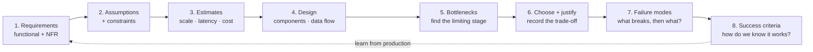

# System-Design Methodology

> **Interview answer (say this first).** AI system design follows the same loop as any backend design — **requirements, estimates, design, trade-offs, failure modes** — but three things move. First, the system is **non-deterministic**, so "correct" is a distribution, not a boolean. Second, every call has a **cost and a latency** attached, so the budget is part of the design. Third, **evaluation is a first-class requirement**, not a test you write later. So I start by separating functional requirements (what it must do) from non-functional requirements (how well, how fast, how cheap, how private), state my assumptions out loud, put rough numbers on scale, sketch components, find the bottleneck, pick with a reason, and name what happens when each part fails.

## Why this exists

Most design interviews do not fail because the candidate cannot draw boxes. They fail because the candidate draws boxes **before agreeing on the problem**.

Watch the failure pattern. The interviewer says "design a support assistant." The candidate immediately says "I would use RAG with a vector database and GPT-4." Ten minutes later the interviewer asks how many users, what latency is acceptable, whether the data may leave the region, and what accuracy is good enough. The candidate does not know. Every later decision is now a guess dressed as a design.

A methodology exists to prevent that. It forces the cheap questions first — the ones that are free to answer and expensive to assume — and the expensive decisions last, once you have constraints to decide against.

Classical backend design already has this discipline. AI adds sharp edges:

- The output is **non-deterministic**. The same input can produce different answers. You cannot assert equality; you must measure quality over a set.
- Every model call has a **price**. A design that is technically correct can be unaffordable at scale.
- There is often a **model or judge in the loop**. That adds a second, slower, less reliable dependency on the critical path.
- **Evaluation is a requirement**, not an afterthought. If you cannot say how you will know the system works, you cannot say it works.

> **The one-sentence rule.** Agree on the question, put a number on the constraints, and only then choose the technology — because in AI every choice is a trade among quality, latency, cost, and privacy.

## Start from zero

| Word | Plain meaning |
| --- | --- |
| **Functional requirement** | Something the system must *do*: "answer support questions", "cite the source". |
| **Non-functional requirement (NFR)** | A quality the system must *have while doing it*: latency, cost, availability, privacy, quality bar. |
| **Constraint** | A limit you cannot change: region, budget, existing systems, regulation, team size. |
| **Assumption** | Something you believe but have not verified. Write it down and name the risk if it is wrong. |
| **p95** | The 95th-percentile latency: 95% of requests complete within this value. |
| **Success criterion** | A testable statement that says the design worked. "p95 under 3 s and 98% answered without a human." |
| **Back-of-the-envelope estimate** | A rough number, usually within an order of magnitude, used to test whether a design is feasible. |
| **Latency budget** | The total time you allow a request, split across the stages that consume it. |
| **Throughput** | How much work the system finishes per unit time, for example requests per second. |
| **Bottleneck** | The one stage that limits the whole system. Fixing anything else does not help. |
| **Trade-off** | Gaining one property by giving up another, such as quality for cost. |
| **ADR** | Architecture Decision Record: a short note recording a decision and its reason. |
| **Failure mode** | A specific way the system can fail: provider down, retrieval empty, model loops, cost spike. |
| **Blast radius** | Everything affected when one component fails. |
| **Evaluation harness** | The repeatable test set and scoring that tells you whether quality changed. |
| **Golden set** | A small, curated set of inputs with known-good answers, used as the quality regression test. |
| **Non-determinism** | The same input can give different outputs, because sampling and context vary. |
| **Judge in the loop** | A model used to score or gate another model's output, adding latency and a failure point. |

## The core idea

Designing a system is like **planning a road trip**. You do not start by choosing a car. You start by asking: where to, how many people, how much luggage, what is the budget, and must we arrive before dark? Only then do you pick the car, the route, and the fuel stops. A sports car is the wrong answer if the requirement is seven seats and a trailer.

An AI system design is that trip:

- **Destination** — the functional requirement: what the answer must accomplish.
- **Rules of the road** — the constraints: region, regulation, existing systems.
- **Time and money budget** — the NFRs: latency, cost, availability, quality.
- **Vehicle** — the technology: model, RAG, fine-tune, agent, workflow.
- **Fuel stops** — caching, fallbacks, retries, and the failure plan.

The method turns that into a repeatable loop.



The loop never really closes. Production teaches you that your recall assumption was wrong, or the cost per call doubled, and you go around again.

### Functional vs non-functional, side by side

Interviewers listen for this split, because it shows you separate **what** from **how well**.

| | Functional | Non-functional |
| --- | --- | --- |
| Answers | What must it do? | How well must it do it? |
| Examples | Answer questions; cite sources; create a ticket | p95 latency; cost per call; uptime; region; quality bar |
| Typical wording | "The system shall ..." | "p95 under 3 s", "under $0.01 per answer" |
| How you test it | It works or it does not | A number against a target over a window |
| Who cares most | The user and product | Operations, finance, security, compliance |
| Failure style | Feature missing | System works but is unusable or unaffordable |

### How AI design differs from classical backend design

| Dimension | Classical backend | AI system |
| --- | --- | --- |
| **Output** | Deterministic: same input, same output | Non-deterministic: a distribution of outputs |
| **Correctness** | Correct or bug | A quality score, measured over a set |
| **Unit cost** | Nearly flat: CPU and network | Per-call token cost that scales with usage |
| **Critical path** | Your services | Your services plus a third-party model |
| **Failure** | Errors and timeouts | Errors, timeouts, *and confidently wrong answers* |
| **Evaluation** | Unit tests and integration tests | Golden sets, judges, human review, regression gates |
| **Change risk** | Code change | Code, prompt, model version, retrieval data, or judge change |
| **Scaling lever** | Add replicas | Replicas plus batching, caching, routing, and smaller models |

> **Why evaluation is a requirement.** In classical design, "it works" means tests pass. In AI design, "it works" means a measured quality bar is met on a set you trust — and that measurement must exist *before* you can honestly claim success.

## How it works

Follow one design from first question to defended decision.

1. **Clarify the requirements.** Ask who the user is, what job they are doing, and what a good answer looks like. Separate functional (what it does) from non-functional (latency, cost, availability, privacy, quality). Write the out-of-scope list; it is as important as the in-scope list.
2. **State assumptions explicitly.** Every unknown becomes a labelled assumption: "documents are clean text", "provider p95 stays under one second". Attach a confidence and the impact if wrong. High-impact, low-confidence assumptions are the first thing to test.
3. **List the constraints.** Region, budget ceiling, regulation, existing systems, the team's skills, and the deadline. Constraints are not negotiable in the design; assumptions are.
4. **Estimate scale.** Users, requests per day, peak-to-average ratio, document volume, token sizes. Rough is fine. The goal is to know whether the problem is 10 requests per second or 10,000.
5. **Sketch the components.** Draw the request path: client, gateway, orchestrator, retrieval, model, tools, data stores, evaluation. Do not optimize yet; get the boxes and arrows on the page.
6. **Find the bottleneck.** Walk the path and ask which stage limits throughput or blows the latency budget. Usually it is the model call, retrieval, or a fan-out. Say it out loud.
7. **Choose and justify.** Pick a model, a retrieval strategy, a routing policy. Name what you gave up. "We chose the mid model for cost; for example, the large model was 20% better quality but four times the price, and the quality bar was already met."
8. **Plan for failure.** For every component, say what happens if it is slow, dead, or wrong: cache, fallback, degrade, queue, or reject. Decide the blast radius.
9. **Define success criteria and evaluation.** Write the testable targets and the golden set that measures them. Decide the gate that blocks a deploy.
10. **Record the decisions.** An ADR per non-obvious choice keeps Future You honest. Revisit when a trigger fires: quality drops, cost rises, requirements change, or a better model appears.

Notice the order. Cheap questions first, expensive decisions last. A design that starts with "we will fine-tune" has skipped the steps that would have shown a prompt and retrieval were enough.

### The design doc, in eight sections

Interviewers grade whether your design follows from the constraints. Give them that structure on paper.

| Section | The question it answers |
| --- | --- |
| Problem | What are we building and for whom? |
| Requirements | Functional and non-functional, with numbers. |
| Assumptions | What we believe, how confident, and what breaks if wrong. |
| Constraints | Hard limits we cannot change. |
| Estimates | Scale, latency, cost, storage — order of magnitude. |
| Design | Components, data flow, and the chosen approach. |
| Trade-offs | What we gave up and why it was acceptable. |
| Failure and success | How it fails and how we know it works. |

## The syntax you will use

These are real production forms. In an interview you write them on the whiteboard; in a repo they live in `docs/`.

**A requirements one-pager, numbers included.** The NFRs are what make a design arguable.

```markdown
# Support Assistant — Requirements

## Functional
- Answer employee questions from the HR knowledge base.
- Cite the source document for every factual claim.
- Escalate to a human when confidence is low.

## Non-functional (numbers, not adjectives)
- Latency: p95 first token < 1.5 s; p95 full answer < 3 s.
- Cost: < $0.01 per answered question at 50k questions/day.
- Availability: 99.9% monthly for the answer endpoint.
- Privacy: documents and prompts never leave the EU region.
- Quality: >= 98% answered without a human on the golden set.
```

If a requirement has no number, it cannot be tested, and it will be renegotiated in production.

**An assumption register.** Each row is a belief with a risk and a test.

```yaml
assumptions:
  - text: "retrieval recall is high enough"
    confidence: 0.6
    impact: 5          # 1-5
    test: "build a 100-question golden set, measure recall@10"
  - text: "provider p95 stays under 1 s"
    confidence: 0.8
    impact: 3
    test: "load test with 3x peak for one hour"
  - text: "users accept a 3 s answer"
    confidence: 0.7
    impact: 4
    test: "usability test with 10 support agents"
```

Rank by `(1 - confidence) * impact`. Test the top of the list first; that is where the design dies.

**A non-functional requirements table with a target and a measure.** Vague NFRs are the most common interview miss.

```yaml
nfrs:
  - name: latency
    target: "p95 < 3000 ms"
    measure: "server-side span from request to final token"
  - name: cost
    target: "< $0.01 per answered question"
    measure: "monthly model spend / answered questions"
  - name: quality
    target: ">= 0.98 answered without a human"
    measure: "golden set, run on every prompt or model change"
  - name: privacy
    target: "EU data residency"
    measure: "no prompt or document egress to non-EU regions"
```

Every NFR has a **target** and a **measure**. Without the measure, the target is a slogan.

**A component sketch with ownership.** Keep it to the boxes you can defend.

```text
client -> api-gateway -> orchestrator -> retrieval (vector + keyword)
                                     -> model-gateway -> provider
                                     -> tools (ticketing, search)
                                     -> answer-cache (Redis)
orchestrator -> trace + eval-log (data plane)
ingest pipeline -> parse -> chunk -> embed -> vector store
```

Say which box owns which concern. "The gateway owns auth, quotas, and routing" is architecture; a list of tools is not.

**An ADR: one decision, one reason, one consequence.**

```markdown
# ADR-004: Use retrieval-augmented prompting, not fine-tuning, for v1

## Context
Answers must reflect the live HR policy, which changes monthly.

## Decision
Retrieve the top-k passages at query time and put them in the prompt.

## Consequences
+ Policy updates are visible immediately; no retraining loop.
+ Citations come for free from retrieved passages.
- Adds retrieval latency and an embedding pipeline to operate.
- Quality depends on retrieval recall, which we must measure.

## Revisit if
Retrieval recall stays below 0.8 after tuning, or latency cannot meet the budget.
```

The "revisit if" line is what separates a decision from a guess.

**A readiness gate as code.** The cheapest design review is a checklist a script can enforce.

```python
REQUIRED = [
    "users", "workload", "latency_budget", "cost_budget",
    "availability_target", "data_sensitivity", "quality_bar", "out_of_scope",
]

def readiness(doc: dict[str, str]) -> list[str]:
    """Return the missing sections. Empty list means the design may proceed."""
    return [s for s in REQUIRED if not doc.get(s)]
```

Run this before the design review. An empty result is permission to design; anything else is a question you have not asked.

## Examples: simple to real

**Example 1 — separate functional from non-functional.** The first exercise in any design is a two-column sort.

```python
REQUIREMENTS = [
    ("answer support questions from the knowledge base", "functional"),
    ("p95 first token under 1.5 s", "non-functional"),
    ("cost under $0.01 per answered question", "non-functional"),
    ("cite the source document", "functional"),
    ("run in the EU region only", "non-functional"),
    ("98% answered without a human", "non-functional"),
]

def by_kind(kind: str) -> list[str]:
    return [text for text, k in REQUIREMENTS if k == kind]

print("functional    :", by_kind("functional"))
print("non-functional:", by_kind("non-functional"))
# functional    : ['answer support questions from the knowledge base',
#                  'cite the source document']
# non-functional: ['p95 first token under 1.5 s',
#                  'cost under $0.01 per answered question',
#                  'run in the EU region only',
#                  '98% answered without a human']
```

Notice that four of six requirements are non-functional. Most of the design difficulty lives there.

**Example 2 — a readiness gate catches the half-specified design.** Missing sections are missing decisions.

```python
REQUIRED = ["users", "workload", "latency_budget", "cost_budget",
            "availability_target", "data_sensitivity", "quality_bar", "out_of_scope"]

def readiness(doc: dict[str, str]) -> list[str]:
    return [s for s in REQUIRED if not doc.get(s)]

ready = {
    "users": "support agents", "workload": "50k questions/day",
    "latency_budget": "p95 < 3 s", "cost_budget": "$5k/month",
    "availability_target": "99.9%", "data_sensitivity": "internal only",
    "quality_bar": "98% no human", "out_of_scope": "refunds and legal advice",
}
partial = {k: v for k, v in ready.items() if k in ("users", "workload", "latency_budget")}

print("ready   ->", readiness(ready))     # ready   -> []
print("partial ->", readiness(partial))
# partial -> ['cost_budget', 'availability_target', 'data_sensitivity',
#             'quality_bar', 'out_of_scope']
```

The partial design is not ready to design against. Those five gaps will become rework.

**Example 3 — rank assumptions by risk, then test the top.** `(1 - confidence) * impact` finds where the design is most likely to break.

```python
ASSUMPTIONS = [
    {"text": "retrieval recall is high enough", "confidence": 0.6, "impact": 5},
    {"text": "provider p95 stays under 1 s",     "confidence": 0.8, "impact": 3},
    {"text": "users accept a 3 s answer",        "confidence": 0.7, "impact": 4},
    {"text": "documents are clean text",         "confidence": 0.5, "impact": 4},
]

def ranked(assumptions: list[dict]) -> list[tuple[str, float]]:
    rows = [(a["text"], round((1 - a["confidence"]) * a["impact"], 2))
            for a in assumptions]
    return sorted(rows, key=lambda r: r[1], reverse=True)

for text, risk in ranked(ASSUMPTIONS):
    print(f"risk={risk:4.2f}  {text}")
# risk=2.00  retrieval recall is high enough
# risk=2.00  documents are clean text
# risk=1.20  users accept a 3 s answer
# risk=0.60  provider p95 stays under 1 s
```

Two assumptions tie at the top. Both are about data quality, and both are testable in a day. Test those before writing production code.

**Example 4 — score the design against weighted NFRs.** When two designs both pass the gates, weights make the trade-off explicit.

```python
WEIGHTS = {"latency": 0.3, "cost": 0.25, "quality": 0.35, "privacy": 0.1}
SCORES  = {"latency": 0.8, "cost": 0.6, "quality": 0.9, "privacy": 1.0}

def nfr_score(scores: dict[str, float], weights: dict[str, float]) -> float:
    """Weighted average of NFR scores, each already in [0, 1]."""
    total_w = sum(weights.values())
    return sum(scores[k] * weights[k] for k in weights) / total_w

print(round(nfr_score(SCORES, WEIGHTS), 4))   # 0.805
```

Change the weights and the winner can change. The point is not the number; it is that you can **show your reasoning** and let the interviewer challenge a weight.

**Example 5 — the AI-first-class gap check.** These five items are easy to forget and expensive to add later.

```python
AI_PILLARS = ["evaluation", "non_determinism", "cost_guard", "judge_in_loop", "golden_set"]

def gaps(design: dict[str, bool]) -> list[str]:
    """Return the AI concerns this design does not yet address."""
    return [p for p in AI_PILLARS if p not in design]

partial = {"evaluation": True, "cost_guard": True}
print(gaps(partial))   # ['non_determinism', 'judge_in_loop', 'golden_set']
print(gaps({p: True for p in AI_PILLARS}))   # []
```

A design that cannot name its golden set, its cost guard, and how it handles non-determinism is not finished.

## In production

- **Write the out-of-scope list first.** It prevents scope creep and shows the interviewer you can say no. "Legal advice is out of scope; we escalate it."
- **Numbers beat adjectives.** "Fast" is not a requirement. "p95 under 3 s" is. Convert every quality word into a target and a measure.
- **State assumptions, do not hide them.** An unstated assumption is a future incident. A stated one is a test you can run.
- **Estimate before you design.** An order-of-magnitude calculation kills impossible designs in minutes and saves weeks.
- **One bottleneck at a time.** Fix the limiting stage, re-measure, then find the next. Optimizing a non-bottleneck is invisible work.
- **Record the trade-off, not just the choice.** "We chose X" is forgettable. "We chose X over Y because Z, and would revisit if W" is architecture.
- **Treat evaluation as a requirement.** A golden set and a quality gate belong in the design doc, next to latency and cost.
- **Design for non-determinism.** Version prompts, models, and retrieval data together, so a quality change is traceable to a cause.
- **Put a cost ceiling in the design.** Token budgets and routing are architectural decisions, not finance's problem.
- **Name the failure mode for every component.** Slow, dead, or wrong — decide the response in advance.
- **Keep the loop open.** Real systems change. Revisit the design when quality drops, cost rises, or a new model changes the math.
- **Match the process to the stakes.** A one-week prototype needs a paragraph; a payment agent needs a full design doc and an ADR trail.

## Interview questions

### 1. Walk me through how you approach any AI system design.

**Answer.** I follow a fixed loop. First I clarify requirements and split them into functional and non-functional, with numbers. Then I state assumptions and constraints. I estimate scale, latency, and cost roughly. I sketch the components and find the bottleneck. I choose an approach and justify the trade-off. Then I plan failure modes and define success criteria and evaluation. Finally I record the decisions in ADRs. Cheap questions first, expensive decisions last.

**Follow-up: "How do you keep the interview moving?"** I time-box each phase and say what I am doing. "Give me one minute for requirements, then I will estimate and design." Structure signals seniority more than depth on any one box.

**Trap.** Jumping to a technology before agreeing on the problem. Naming a model in the first sentence tells the interviewer you skipped requirements.

### 2. What is the difference between functional and non-functional requirements, and why does it matter for AI?

**Answer.** Functional requirements say what the system does — answer questions, cite sources. Non-functional requirements say how well it does it — latency, cost, availability, privacy, quality. In AI, the non-functional side is where the design difficulty lives, because there is real tension between them: a bigger model improves quality but raises cost and latency, and a region restriction can remove the best model entirely.

**Follow-up: "Give an example of a trade you would be forced to make."** EU data residency may exclude a provider, so quality drops. I would document that trade explicitly and, if the quality bar is still met, accept it.

**Trap.** Treating quality as functional. Quality is non-functional: it is a number measured over a set, not a feature that exists or not.

### 3. How is AI system design different from classical backend design?

**Answer.** Four ways. Output is non-deterministic, so you measure a distribution, not a boolean. Every call has a per-token cost, so the budget is part of the design. There is often a model or judge in the loop, which adds a slow third-party dependency on the critical path. And evaluation is a first-class requirement — a golden set and a quality gate must exist before you can claim the system works.

**Follow-up: "Which of those most often causes trouble?"** Cost and evaluation. Teams under-estimate token spend at scale and under-invest in the test set that would catch a quality regression.

**Trap.** Saying "it is just backend plus an API call." The non-determinism and the per-call cost change the design, not just the implementation.

### 4. Why state assumptions out loud, and how do you rank them?

**Answer.** Assumptions are the beliefs the design rests on. Unstated, they become surprises. I write each with a confidence and an impact, then rank by `(1 - confidence) * impact`. The top of the list is where the design is most likely to fail, so it is what I test first. An assumption that cannot be tested is not an assumption; it is a risk to escalate.

**Follow-up: "What is a classic AI assumption people get wrong?"** That retrieval will return relevant passages. Recall is usually worse than expected, and it caps answer quality no matter how good the model is.

**Trap.** Ranking by impact alone. A high-impact assumption you are confident about is less urgent than a medium-impact one you are guessing on.

### 5. How do you find the bottleneck in an AI design?

**Answer.** I trace the request path and ask which stage limits throughput or eats the latency budget. Usually it is the model call, retrieval, or a fan-out that must all succeed. I put rough numbers on each stage and look for the one that dominates. Then I fix that stage and re-measure, because the bottleneck moves.

**Follow-up: "What if the bottleneck is the model provider?"** Then the lever is not inside my system. I add caching, route easy requests to a smaller model, stream tokens to hide latency, and add fallbacks so a slow provider degrades instead of failing.

**Trap.** Optimizing everything at once. Without finding the bottleneck, effort is spread thin and the limiting stage stays limiting.

### 6. When is a design "done enough" to ship?

**Answer.** When every functional requirement has a matching design element, every NFR has a target and a measure, the top assumptions are tested, the bottleneck is known, each component has a failure plan, and a golden set gates the deploy. If any of those is missing, the design is a prototype, and I say so.

**Follow-up: "How does that change for a prototype?"** The loop shrinks but does not vanish. I still write the requirements and the success criterion, just in a paragraph rather than a document. I never skip the evaluation gate; I just make it smaller.

**Trap.** Confusing "the code runs" with "the design is done." A working demo with no quality measurement is a hypothesis, not a system.

### 7. How do you decide what is out of scope?

**Answer.** I ask what the system must *not* be trusted to do, and what would be dangerous or expensive if it guessed wrong. Refunds, legal advice, and irreversible actions usually go out of scope or behind a human approval. Writing the out-of-scope list protects users and keeps the design honest.

**Follow-up: "What if the interviewer wants everything in scope?"** I prioritise: v1 does the safe, high-volume task well; everything else is a later phase with its own requirements and gates. Scope is a schedule decision, not a quality one.

**Trap.** Leaving out-of-scope implicit. When it is unwritten, everyone imagines a different system and the design review argues about the wrong thing.

### 8. How do you know when to revisit a design decision?

**Answer.** I attach revisit triggers to each significant decision when I make it. Typical triggers: quality falls below the bar on the golden set, cost exceeds the ceiling, latency regresses, requirements change (new region, new data), or a new model changes the quality-to-cost ratio. When a trigger fires, I re-run the loop for that decision and record the new ADR.

**Follow-up: "How do you avoid churning on every new model release?"** I only revisit when a trigger fires and the change is material — for example, a cheaper model that still clears the quality bar. Otherwise I note it and move on.

**Trap.** Treating decisions as permanent. An architecture without revisit conditions becomes legacy the day it is written.

## Remember this

- **Requirements first, technology last.** Separate functional from non-functional, and give every NFR a target and a measure.
- **State assumptions with confidence and impact.** Test the highest `(1 - confidence) * impact` item first.
- **Estimate before you design.** Rough numbers kill impossible designs in minutes.
- **In AI, non-determinism, cost per call, and evaluation are first-class.** A golden set and a cost guard belong in the design doc.
- **Every decision needs a reason and a revisit trigger.** That is what makes it architecture rather than opinion.
