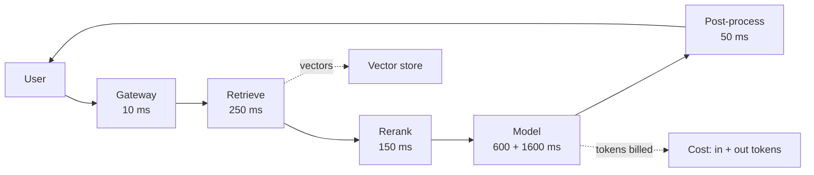

# Estimation: Capacity, Latency, Throughput, Cost, Storage

> **Interview answer (say this first).** Before I design anything, I put rough numbers on four things: **how much work** (QPS and peak), **how much waiting** (latency budget and percentiles), **how much machine** (throughput per worker and headroom), and **how much money** (tokens, cache hit rate, storage). I use back-of-the-envelope arithmetic, not benchmarks. The goal is not precision; it is to know whether the problem is 10 requests per second or 10,000, whether the bill is hundreds or hundreds of thousands, and which number would change the design. Then I state every input as an explicit, illustrative assumption so the interviewer can challenge it.

> **A note on numbers.** Every price, latency, dimension, and token size in this chapter is an **illustrative input**, chosen to make the arithmetic easy to follow. None of them is a vendor price or a published benchmark. Swap in your own measured numbers; the method is the point.

## Why this exists

A design that cannot be sized is a story, not an architecture.

Interviewers ask "how many?" for a reason. It is the fastest way to tell whether you have built something real before. Two candidates can draw the same diagram; only one can say how many workers it needs, where the latency goes, and what it costs per request.

Estimation also changes decisions. If the budget is `$0.001` per request you cannot call a large model on every request. If the latency budget is 500 ms you cannot do three sequential model calls. If you need 50,000 embeddings per second you cannot embed synchronously on the write path. The number comes first; the design follows.

And it protects you from the most expensive AI mistake: shipping something that works on ten requests and is unaffordable on ten million.

Four questions to answer before design:

1. **How much work?** Requests per day, average QPS, peak QPS.
2. **How much waiting?** End-to-end latency budget, split by stage, at a stated percentile.
3. **How much machine?** Throughput per worker or GPU, and the headroom you reserve.
4. **How much money?** Tokens in and out, cache hit rate, storage for documents, vectors, and logs.

> **The one-sentence rule.** Estimate the order of magnitude first, because the number decides the architecture — and label every input as an assumption, because a wrong input hides behind confident arithmetic.

## Start from zero

| Word | Plain meaning |
| --- | --- |
| **QPS** | Queries per second: how many requests arrive each second, on average. |
| **Peak factor** | How many times the average load the busiest moment is. Often 3x to 10x. |
| **Concurrency** | How many requests are in flight at the same instant. |
| **Little's law** | `concurrency = arrival rate x time in system`. The core capacity equation. |
| **Latency** | How long one request takes, end to end, in milliseconds. |
| **p50 / p95 / p99** | Percentiles. p95 means 95% of requests are at least this fast. Tail matters. |
| **Latency budget** | The total time allowed, split across the stages that consume it. |
| **TTFT** | Time to first token. The wait before streaming starts; what users feel first. |
| **Throughput** | Work completed per unit time, such as requests per second per worker. |
| **Utilization** | Fraction of capacity in use. High utilization makes queues explode. |
| **Headroom** | Spare capacity kept for peaks and failure. Provision above the peak. |
| **Token** | The unit models read and write. Roughly 0.75 of an English word. |
| **Context** | All tokens the model reads on one call: prompt plus retrieved text plus history. |
| **Cache hit rate** | Fraction of input tokens served from a prefix cache instead of re-sent to the model; output tokens are still billed. |
| **Answer cache hit rate** | Fraction of requests served a stored full answer, avoiding both input and output tokens. |
| **Embedding** | A fixed-length vector of numbers that represents text meaning. |
| **Dimension** | How many numbers are in one embedding vector. |
| **Vector store** | A database that finds nearest embeddings quickly. |
| **Index overhead** | A multiplier on raw vector storage that yields the total vector-store size — vectors plus index. |
| **Back-of-the-envelope** | A rough calculation, good to an order of magnitude. |

## The core idea

Think of a highway. The question "can it handle the traffic?" needs three numbers: how many cars per hour arrive, how fast each car moves, and how many cars can be on the road at once. Missing any one, the answer is a guess.

An AI request path is that highway, and the model call is the toll booth: it is the slowest point and the one everyone must pass.



Every box costs time; the model box also costs money. Estimation is just accounting for both, along this path.

Three equations carry most of the weight:

| Equation | What it tells you |
| --- | --- |
| `QPS = requests_per_day / 86,400` | Average arrival rate from a daily volume. |
| `peak_QPS = average_QPS x peak_factor` | The load you must actually survive. |
| `concurrency = peak_QPS x latency_seconds` | Requests in flight, via Little's law. |
| `throughput_per_worker = concurrency_per_worker / latency_seconds` | How much one worker delivers. |
| `provisioned = peak / target_utilization` | Capacity to buy, with headroom. |
| `cost = in_tokens x in_price + out_tokens x out_price` | Per-request model cost. |
| `effective_in_price = (1 - hit) x price + hit x cached_price` | Input cost with caching. |

> **Why Little's law matters in an interview.** It links three numbers people estimate separately — arrival rate, latency, and concurrency — so you can derive the third from any two. It is the single most useful capacity tool.

### Average is a lie; the peak is the requirement

```text
average QPS: 23     peak QPS: 116     (5x peak factor, illustrative)
provision for average -> outages every busy hour
provision for peak    -> works, plus headroom for failure
```

### One number is a product of many

```text
end-to-end p95  =  auth + route + retrieve + rerank + ttft + generate + post + network
```

Percentiles do **not** add. The p95 of a sum is worse than the sum of p95s. A safe method is to budget each stage and leave a margin, then measure the real end-to-end percentile.

## How it works

Follow one estimation pass, from a daily volume to a capacity plan.

1. **Get the demand.** Start with a business number you can defend: users, questions per day, or documents to ingest. Convert it to an average rate.
2. **Apply a peak factor.** Traffic is not flat. Multiply the average by an illustrative peak factor to get peak QPS. If you do not know it, use a range and say so.
3. **Set a latency budget.** From the requirement, take the end-to-end p95 target in milliseconds. Split it across stages, leaving a margin. This is your timing contract.
4. **Compute concurrency.** Use Little's law: `concurrency = peak_QPS x latency_seconds`. This is how many requests must be in flight at once.
5. **Derive throughput per worker.** A worker that handles `C` concurrent requests with `S` seconds each delivers `C / S` requests per second. Convert concurrency into a fleet size.
6. **Add headroom and redundancy.** Provision above peak using a target utilization, then add N+1 so one failure does not lose capacity.
7. **Estimate storage.** Documents, chunks, embeddings, and logs each have their own volume. Size them separately; embeddings usually dominate.
8. **Estimate tokens and cost.** Input and output tokens per request, times requests, times an illustrative price. Apply the prefix cache hit rate to the input tokens; a separate answer cache avoids output tokens too but needs its own hit rate.
9. **Sanity-check.** Compare cost per request to the business value. Compare latency to the requirement. If a number is off by 10x, re-check the input before redesigning.
10. **Record the inputs.** Write every assumption next to its number. When reality differs, you know which input was wrong.

The output is a short table of numbers and a list of assumptions — not a benchmark report. Precision here is false comfort; orders of magnitude are the goal.

## The syntax you will use

These are production forms. In a design review you write them on a slide; in a repo they live as config and code.

**A capacity model as declarative config.** Keep the inputs in one place so you can re-run the math.

```yaml
capacity:
  requests_per_day: 2000000        # illustrative
  peak_factor: 5                   # illustrative
  end_to_end_latency_s: 4          # illustrative
  concurrency_per_worker: 8        # illustrative
  target_utilization: 0.7          # illustrative headroom target
  replicas_min: 3
  replicas_max: 200
```

The config is the input to the arithmetic. Change one number and the whole plan moves.

**A latency budget config per stage.** This is the timing contract.

```yaml
latency_budget_ms:
  total: 3000
  auth: 20
  route: 10
  retrieve: 250
  rerank: 150
  prompt_build: 20
  time_to_first_token: 600
  generate: 1600
  post_process: 50
  network_overhead: 100
  # margin = total - sum(stages) = 200
```

When a stage regresses, this table tells you whether it broke the contract and by how much.

**Autoscaling on the metric that matters.** For AI, queue depth or in-flight requests beats raw CPU.

```yaml
metrics:
  - type: Pods
    pods:
      metric: {name: llm_requests_in_flight}
      target: {type: AverageValue, averageValue: "8"}   # per worker
behavior:
  scaleUp:  {stabilizationWindowSeconds: 30}
  scaleDown: {stabilizationWindowSeconds: 300}          # avoid thrash
```

Here `Pods` is the Kubernetes autoscaling type that scales the replica (pod) count on a custom metric. Scale on the work waiting, not the CPU, because a worker waiting on a model is busy but idle-looking.

**A Prometheus recording rule for the real percentile.** Measure p95; do not assume it.

```promql
# end-to-end p95 latency over 5 minutes
histogram_quantile(
  0.95,
  sum by (le) (rate(request_duration_seconds_bucket[5m]))
)
```

The histogram is the source of truth. Compare it to the budget; alert on the burn rate (how fast you consume your error budget), not a fixed threshold.

**The core arithmetic as pure Python.** Small functions you can run in the interview.

```python
import math

def qps(requests_per_day: int, peak_factor: float = 1.0) -> float:
    """Average and peak queries per second from a daily volume."""
    return requests_per_day / 86_400 * peak_factor

def concurrency(peak_qps: float, latency_s: float) -> float:
    """Little's law: requests in flight = arrival rate x time in system."""
    return peak_qps * latency_s

def workers(concurrency: float, per_worker: int) -> int:
    """Replicas needed to hold that concurrency, rounded up."""
    return math.ceil(concurrency / per_worker)
```

These three functions drive every fleet-size estimate in this chapter.

**A cost model you can tune.** Separate input from output, then apply caching.

```python
def cost_per_request(in_tokens: int, out_tokens: int,
                     in_price: float, out_price: float,
                     cache_hit: float = 0.0, cached_in_price: float = 0.0) -> float:
    """USD per request. cache_hit is the input-side (prefix) cache rate. Prices per 1M tokens."""
    eff_in = (1 - cache_hit) * in_price + cache_hit * cached_in_price
    return in_tokens / 1e6 * eff_in + out_tokens / 1e6 * out_price
```

The model is only as good as the prices you feed it, so version the prices alongside the code.

## Examples: simple to real

**Example 1 — from daily volume to a worker fleet.** This is the backbone calculation of every capacity estimate.

```python
import math

REQUESTS_PER_DAY = 2_000_000      # illustrative
PEAK_FACTOR = 5.0                 # illustrative
END_TO_END_S = 4.0                # illustrative
PER_WORKER = 8                    # illustrative concurrent requests per worker

avg_qps = REQUESTS_PER_DAY / 86_400
peak_qps = avg_qps * PEAK_FACTOR
in_flight = peak_qps * END_TO_END_S            # Little's law
fleet = math.ceil(in_flight / PER_WORKER)

print(f"avg_qps  = {avg_qps:.2f}")      # avg_qps  = 23.15
print(f"peak_qps = {peak_qps:.2f}")     # peak_qps = 115.74
print(f"in_flight= {in_flight:.1f}")    # in_flight= 463.0
print(f"fleet    = {fleet}")            # fleet    = 58
```

Two million requests a day sounds like a lot until you divide by 86,400. The peak is what sizes the fleet: about 463 requests in flight, needing roughly 58 workers.

**Example 2 — add headroom and N+1.** A fleet sized exactly to peak fails on the first bad day.

```python
import math

peak_qps = 115.74                # from Example 1
per_worker_rps = 8 / 4.0         # 8 concurrent, 4 s each (same basis as Example 1)
provisioned_qps = peak_qps / 0.7 # 70% target utilization
fleet_headroom = math.ceil(provisioned_qps / per_worker_rps)

print(f"per_worker_rps   = {per_worker_rps:.3f}")       # 2.000
print(f"provisioned_qps  = {provisioned_qps:.2f}")      # 165.34
print(f"fleet_headroom   = {fleet_headroom}")           # 83
print(f"with N+1         = {fleet_headroom + 1}")       # 84
```

Reserving 30% headroom turns 58 workers into 83, and N+1 makes 84. The extra twenty-six are cheaper than an outage. Note `per_worker_rps` depends on the latency you assumed (4 s, the same basis as Example 1), not on the peak.

**Example 3 — check the latency budget adds up.** Percentages hide shortfalls; milliseconds expose them.

```python
STAGES = [("auth", 20), ("route", 10), ("retrieve", 250), ("rerank", 150),
          ("prompt-build", 20), ("ttft", 600), ("generate", 1600),
          ("post", 50), ("network", 100)]
BUDGET_MS = 3000

used = sum(ms for _, ms in STAGES)
margin = BUDGET_MS - used

print(f"used   = {used} ms")                   # used   = 2800 ms
print(f"margin = {margin} ms ({margin / BUDGET_MS:.1%})")  # margin = 200 ms (6.7%)
```

A 200 ms margin on a 3,000 ms budget is thin. In an interview, say so: "the model call is 73% of the budget, so that is where I would optimize first."

**Example 4 — why p95 of a chain is worse than p95 of a stage.** Five serial stages each meeting p95 means the chain is only at its p95 about 77% of the time.

```python
CHAIN_STAGES = 5      # illustrative number of serial critical stages
P = 0.95

all_under_p95 = P ** CHAIN_STAGES
per_stage_needed = P ** (1 / CHAIN_STAGES)

print(f"P(all 5 <= each stage p95) = {all_under_p95:.4f}")   # 0.7738
print(f"per-stage quantile needed  = {per_stage_needed:.5f}") # 0.98979
```

To hit p95 end to end across five stages, each stage must be near its **p99**. This is why fan-outs and long chains destroy tail latency, and why parallel retrieval beats serial calls.

**Example 5 — storage for documents, embeddings, and logs.** Vectors usually dominate, so size them explicitly.

```python
import math

DOCS = 500_000                    # illustrative documents
TOKENS_PER_DOC = 2_000            # illustrative
BYTES_PER_TOKEN = 4               # illustrative raw text
CHUNK_TOKENS, CHUNK_OVERLAP = 512, 64
EMB_DIM = 1024                    # illustrative embedding dimension
INDEX_OVERHEAD = 1.5              # illustrative total vector-store multiplier (vectors + index)
META_BYTES = 500                  # illustrative metadata per chunk
LOGS_PER_DAY = 2_000_000          # illustrative
LOG_BYTES = 3_000                 # illustrative bytes per request
RETENTION_DAYS = 30
REPLICAS = 2

raw_gb = DOCS * TOKENS_PER_DOC * BYTES_PER_TOKEN / 1e9
stride = CHUNK_TOKENS - CHUNK_OVERLAP
chunks = DOCS * math.ceil(TOKENS_PER_DOC / stride)
vector_gb = chunks * EMB_DIM * 4 / 1e9              # 4 bytes per float32
vector_index_gb = vector_gb * INDEX_OVERHEAD        # vectors + index
meta_gb = chunks * META_BYTES / 1e9
total_gb = raw_gb + vector_index_gb + meta_gb
logs_gb = LOGS_PER_DAY * LOG_BYTES / 1e9 * RETENTION_DAYS

print(f"chunks     = {chunks:,}")           # chunks     = 2,500,000
print(f"raw_gb     = {raw_gb:.2f}")         # raw_gb     = 4.00
print(f"vector_gb  = {vector_gb:.2f}")      # vector_gb  = 10.24
print(f"vec_idx_gb = {vector_index_gb:.2f}")# vec_idx_gb = 15.36
print(f"meta_gb    = {meta_gb:.2f}")        # meta_gb    = 1.25
print(f"total_gb   = {total_gb:.2f}")       # total_gb   = 20.61
print(f"x{REPLICAS} replicas = {total_gb * REPLICAS:.2f}")  # x2 replicas = 41.22
print(f"logs {RETENTION_DAYS}d   = {logs_gb:.2f} GB")        # logs 30d   = 180.00 GB
```

Half a million documents become 2.5 million chunks, and the vectors with their index are about 15 GB — nearly four times the raw text. Logs add 6 GB per day. Say these numbers out loud; they justify cache, retention, and tiering decisions.

**Example 6 — token cost with a prefix cache hit rate.** Caching input tokens is usually the single biggest cost lever.

```python
IN_PRICE, CACHED_IN_PRICE, OUT_PRICE = 0.60, 0.15, 2.40   # illustrative per 1M
IN_TOKENS, OUT_TOKENS = 3_000, 400                          # illustrative
REQS, CACHE_HIT, DAYS = 2_000_000, 0.70, 30

in_m = REQS * IN_TOKENS / 1e6
out_m = REQS * OUT_TOKENS / 1e6
no_cache = in_m * IN_PRICE + out_m * OUT_PRICE
eff_in = (1 - CACHE_HIT) * IN_PRICE + CACHE_HIT * CACHED_IN_PRICE
with_cache = in_m * eff_in + out_m * OUT_PRICE

print(f"input_M_tokens  = {in_m:,.0f}")        # 6,000
print(f"output_M_tokens = {out_m:,.0f}")       # 800
print(f"no_cache/day    = ${no_cache:,.2f}")   # $5,520.00
print(f"eff_in_price    = ${eff_in:.4f}")      # $0.2850
print(f"with_cache/day  = ${with_cache:,.2f}") # $3,630.00
print(f"savings         = {1 - with_cache / no_cache:.1%}")  # 34.2%
print(f"30-day cache bill = ${with_cache * DAYS:,.0f}")      # $108,900
```

A 70% prefix cache hit rate cuts the input cost by more than half and the total bill by 34%. At this volume the un-cached month is `$165,600`; the cached month is `$108,900`. Caching the input prefix is an architecture decision worth six figures. (An answer cache would also avoid output tokens, but it needs its own hit rate and stricter staleness controls.)

**Cascade routing at the same volume.** Route easy requests to a cheap model, escalate only the hard ones.

```python
IN_M, OUT_M = 6_000.0, 800.0        # millions of tokens/day, from Example 6
IN_PRICE, OUT_PRICE = 0.60, 2.40    # illustrative per 1M
REQS = 2_000_000                    # illustrative requests/day
CHEAP_IN, CHEAP_OUT = 0.10, 0.40    # illustrative per 1M
ESCALATION = 0.20                   # illustrative fraction escalated

expensive = IN_M * IN_PRICE + OUT_M * OUT_PRICE
cheap_only = IN_M * CHEAP_IN + OUT_M * CHEAP_OUT
blended = ESCALATION * (cheap_only + expensive) + (1 - ESCALATION) * cheap_only

print(f"cheap_only/day   = ${cheap_only:,.2f}")    # $920.00
print(f"blended/day      = ${blended:,.2f}")       # $2,024.00
print(f"all_expensive/day= ${expensive:,.2f}")     # $5,520.00
print(f"cost per request = ${blended / REQS:.6f}") # $0.001012
```

Sending every request to the cheap model costs `$920` a day; escalating one in five costs `$2,024`; sending everything to the large model costs `$5,520`. The routing policy, not the model, is the biggest lever.

## In production

- **Provision for peak, not average.** A 5x peak factor is common; some workloads are 10x. Sizing to average guarantees regular outages.
- **Keep 30-40% headroom (60-70% target utilization).** Queueing latency explodes as utilization approaches 100%. The last 20% of capacity costs far more than it saves.
- **Percentiles do not add.** Budget stage by stage, leave a margin, and measure the real end-to-end p95 with a histogram. Never sum p95s and call it the total.
- **The model call is usually the bottleneck.** It is the slowest and most expensive stage. Cache it, stream it, or route it to something smaller.
- **Caching input improves both cost and latency.** A high prefix or answer hit rate is the cheapest win available, but watch correctness and tenant isolation.
- **Estimate output tokens, not just input.** Output is often priced several times higher and dominates the bill for long answers.
- **Vectors and indexes surprise people.** The vector store (vectors plus index) can be larger than the raw text it represents, and replicas multiply everything. Plan for it.
- **Logs grow without bound by default.** Set retention and sampling deliberately, or your observability bill becomes the story.
- **Headroom is not free but outages are worse.** State the cost of each extra replica against the cost of the availability target.
- **Re-estimate after launch.** Real token sizes, real cache hit rates, and real peak factors replace your guesses. The first month of data is worth more than any benchmark.
- **Watch unit economics.** Cost per answered question, per document, or per task. A design is only viable if that number fits the value delivered.
- **Label every input.** "Illustrative, to be measured" keeps the design honest and invites the interviewer to correct a number instead of the whole design.

## Interview questions

### 1. How do you estimate the capacity of an AI service?

**Answer.** I start from a demand number — requests per day — convert it to an average QPS, then multiply by a peak factor. Using Little's law, `concurrency = peak_QPS x latency_seconds`, I get requests in flight. Dividing by concurrency per worker gives the fleet, and I add headroom and N+1. Then I estimate tokens, storage, and cost separately and check the bottleneck.

**Follow-up: "Why not just count users?"** Users are not load. What matters is requests per second, how long each holds a slot, and the peak-to-average ratio. A million users who ask one question a day is a small system.

**Trap.** Multiplying average QPS by a made-up cost without applying a peak factor. The fleet is sized by peak; the bill is sized by total volume. They are different numbers.

### 2. What is Little's law, and why is it useful here?

**Answer.** `L = λW`: the number of items in a system equals the arrival rate times the time each spends there. For us, `concurrency = QPS x latency_seconds`. It connects three quantities people usually estimate separately, so from any two you get the third. It also shows that reducing latency directly reduces the concurrency, and therefore the fleet, you need.

**Follow-up: "What breaks it?"** It assumes a stable system with steady arrivals and no drops. Bursty traffic, timeouts, and rejected requests break the simple form, so I treat it as a floor and add headroom.

**Trap.** Forgetting to convert milliseconds to seconds. Mixing units is the most common estimation error in an interview.

### 3. How do you build a latency budget?

**Answer.** Start from the end-to-end target at a stated percentile, usually p95. Split it across the stages on the critical path — gateway, retrieval, rerank, time to first token, generation, post-processing, network — and leave a margin. Then measure the real end-to-end percentile, because percentiles do not add. The budget is a contract: a regression in any stage either consumes margin or must be fixed.

**Follow-up: "Why is the end-to-end p95 worse than every stage's p95?"** Because a request must clear every stage. With five independent stages at p95, the chain is under its own p95 only about 77% of the time. To hit p95 end to end, each stage needs to be closer to its p99.

**Trap.** Summing stage p95s and calling it the end-to-end p95. It understates the tail. Budget, measure, and iterate.

### 4. How do you estimate throughput per GPU or per worker?

**Answer.** I use concurrency divided by latency. A worker handling `C` requests at once with `S` seconds each delivers `C / S` requests per second. For GPUs, batching raises effective concurrency, so the number comes from measurement rather than a formula. I size the fleet from peak QPS divided by that per-unit throughput, then add headroom.

**Follow-up: "How does batching change it?"** Batching serves several requests per model pass, so throughput rises, but each individual request waits for the batch. It is a trade of latency for throughput, and it is why serving systems have a batching window.

**Trap.** Quoting a per-GPU number as if it were universal. It depends on the model, the hardware, the batching, and the sequence lengths. Use your own measurement or say it is illustrative.

### 5. How do you estimate token cost with caching?

**Answer.** I multiply input and output tokens per request by requests per day to get monthly token volumes, then apply prices per million tokens. For caching, the effective input price is `(1 - hit_rate) x normal_price + hit_rate x cached_price`. I keep input and output separate because output is usually priced higher, and I state that all prices are illustrative.

**Follow-up: "What hit rate is realistic?"** It depends on the workload. A shared system prompt and repeated questions can hit often; unique long documents will not. I would pilot, measure, and then commit rather than assume a number.

**Trap.** Applying the cache hit rate to output tokens. Caching saves recomputation of the input prefix, not the generated answer, unless you also cache full answers.

### 6. How do you estimate storage for a RAG system?

**Answer.** Four parts. Raw text is documents times tokens per document times bytes per token. Chunking multiplies the count by tokens per chunk and overlap. Embeddings are chunks times dimension times bytes per float, plus an index overhead. Logs are requests per day times bytes per record times retention. Then multiply durable data by the replica count. Vectors and the index usually dominate.

**Follow-up: "What is easy to forget?"** Index overhead, replicas, and metadata. Also the embedding model's dimension: doubling dimensions doubles vector storage for the same chunk count.

**Trap.** Sizing only the raw documents. The embedding index is frequently larger than the text it represents.

### 7. What headroom do you keep, and why?

**Answer.** I target roughly 60-70% utilization at peak, which is 30-40% headroom, plus N+1 for one-unit failure. Queueing theory says latency rises sharply as utilization approaches 100%, so the last slice of capacity is the most expensive in user experience. Headroom also absorbs the peak factor mis-estimate that every new system has.

**Follow-up: "Does headroom change for batch workloads?"** Yes. Batch work can run at higher utilization because latency does not matter; the extra capacity only delays throughput. Interactive paths need the headroom.

**Trap.** Running at 95% utilization to save money. The outage that follows costs more than the replicas you skipped.

### 8. What inputs would make you change the whole design?

**Answer.** A high peak factor pushes me to queues and autoscaling. A tight latency budget rules out multiple serial model calls and pushes me to caching and smaller models. A low cost-per-request ceiling rules out a large model on every call and pushes me to routing. A residency constraint removes providers and changes the quality ceiling. I name these triggers up front so the design follows the numbers.

**Follow-up: "What if you do not know the numbers?"** I give a range, pick the middle, and say what I would measure first. An explicit range with a test plan is far stronger than false precision.

**Trap.** Designing for a guessed number and never revisiting it. Estimation is an input to design, not a permanent fact; the first month of real data should update it.

## Remember this

- **Peak, not average, sizes the system.** Apply a peak factor before anything else.
- **Little's law links it all:** `concurrency = QPS x latency_seconds`. Convert units carefully.
- **Percentiles do not add.** Budget stage by stage, leave a margin, and measure end to end.
- **Cost is a design input.** Estimate input and output tokens, apply the prefix cache hit rate, and know the cost per request.
- **Label every number as illustrative.** The method is the deliverable; the inputs are assumptions to replace with measurements.
