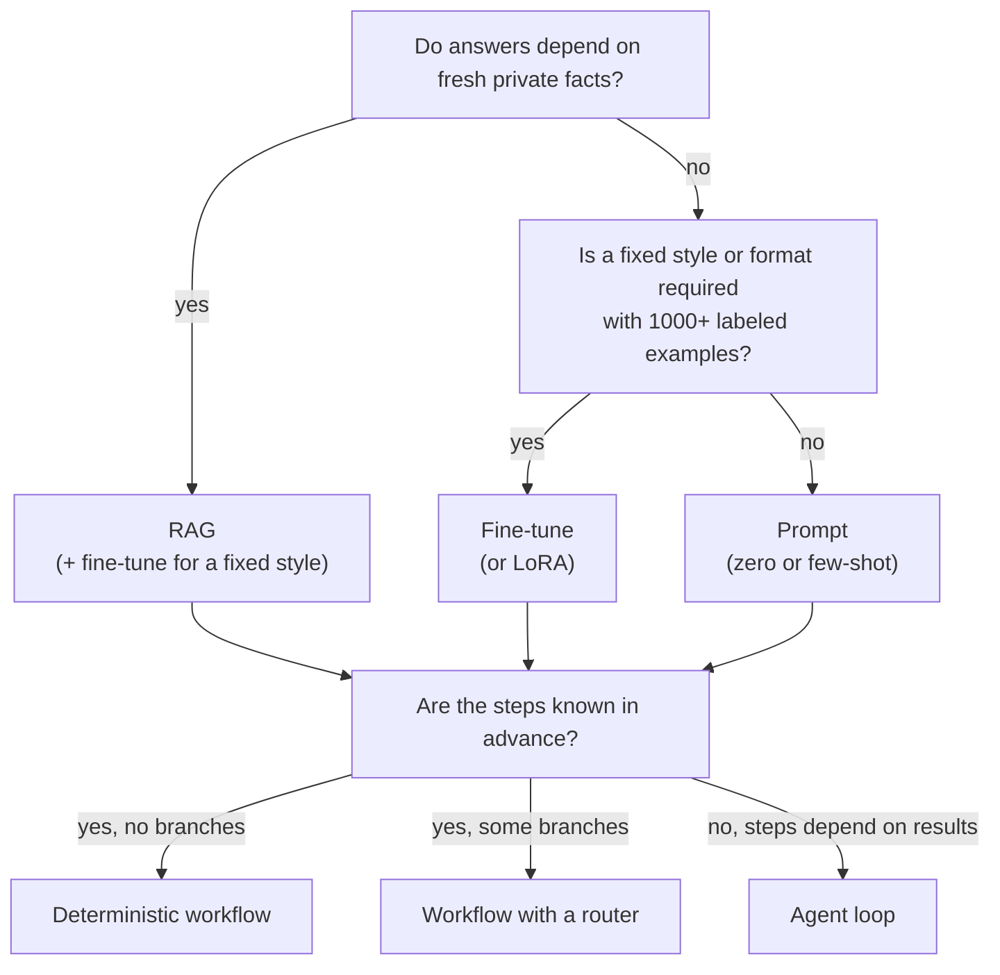

# Choosing the Approach

> **Interview answer (say this first).** There is no best model, no best retrieval strategy, and no best agent framework — only the cheapest and simplest thing that clears the quality bar. So I decide in this order: first, **what the task actually needs** (fresh facts, a fixed style, known steps); second, **the constraint** (quality bar, latency ceiling, cost ceiling, context size, residency); third, **the simplest approach that satisfies it** — prompt first, then retrieval, then fine-tuning, and a deterministic workflow before an agent. I write the choice down with the reason, and I attach a trigger that would make me revisit it.

## Why this exists

Every AI project faces the same forks, and the expensive mistake is always the same: **choosing the fanciest option first**.

A team fine-tunes a model before checking whether a better prompt would do. Another builds a multi-agent swarm to run a five-step process that never changes. A third buys an expensive managed platform for a workload a small hosted model handles at a tenth the price. The technology is impressive; the choice was never justified.

The forks are real and unavoidable:

- **Which model?** Quality, latency, cost, and context length pull in different directions.
- **Build or buy?** Control and marginal cost versus time to market and operating burden.
- **RAG, fine-tune, or prompt?** Fresh facts, fixed style, or just a well-written instruction.
- **Agent vs deterministic workflow?** Dynamic reasoning, or a known sequence of steps.

There is no universal winner in any of these. There is only the choice that fits **this** task, **this** quality bar, **this** budget, and **this** team. The skill an interviewer is testing is whether you can make that fit explicit and defend it.

> **The one-sentence rule.** Start with the simplest thing that could possibly clear the quality bar, prove it with a measurement, and only add complexity when the measurement says you must.

## Start from zero

| Word | Plain meaning |
| --- | --- |
| **Prompting** | Sending instructions and examples to a model and using the reply. No training. |
| **Few-shot** | Putting a handful of worked examples in the prompt to show the pattern. |
| **RAG** | Retrieval-Augmented Generation: fetch relevant passages, put them in the prompt. |
| **Fine-tuning** | Further training a model on your examples so its behaviour changes. |
| **LoRA / PEFT** | Cheap fine-tuning that trains a small set of extra weights instead of the whole model. |
| **Distillation** | Training a smaller model to imitate a larger one, to cut cost and latency. |
| **Model selection** | Choosing a model by quality, latency, cost, and context for a task. |
| **Context window** | The maximum tokens a model can read and write in one call. |
| **Build vs buy** | Making it yourself versus paying a vendor; a control-versus-speed trade. |
| **Total cost of ownership (TCO)** | The full cost: licences, integration, infrastructure, and the people to run it. |
| **Vendor lock-in** | The cost of leaving a provider once you depend on its unique features. |
| **Deterministic workflow** | A fixed sequence of steps with known branches. Same path every time. |
| **Agent** | A model that decides its own next step at runtime, choosing tools and loops. |
| **Router** | Logic that sends a request to one of several paths or models. |
| **Cascade** | Try the cheap model first; escalate to a bigger one only when needed. |
| **Decision table** | A grid mapping conditions to the recommended choice. |
| **Decision tree** | A flowchart of yes/no questions leading to a choice. |
| **Spike** | A short, time-boxed experiment to answer one technical question. |
| **Sunset trigger** | A condition that says this approach is no longer the right one. |

## The core idea

Choosing an approach is like choosing a vehicle for a delivery. A bicycle is best for a letter across town. A van is best for furniture. A freight train is best for ten thousand tonnes. Nobody asks "what is the best vehicle?" They ask what is being delivered, how fast, and at what cost. The same discipline applies to models and architectures.

Two tools make the choice repeatable: a **decision table** for the common cases, and a **decision tree** for the order of questions.



The tree is deliberately ordered cheapest-first. Each "no" keeps you on the simple branch. Only a genuine "yes" justifies the added machinery.

### A decision table for the common forks

| Question | Choose A when | Choose B when |
| --- | --- | --- |
| **Model size** | Quality bar already met, cost/latency tight | Quality bar not met by smaller; budget allows |
| **Build vs buy** | Very high volume, unique needs, expertise in-house | Time to market, low volume, undifferentiated need |
| **RAG vs fine-tune** | Facts change; need citations; no labels | Fixed style/format; 1000+ labelled examples; no fresh facts |
| **Prompt vs fine-tune** | Task describable; few examples; changing requirements | Style hard to describe; many examples; stable task |
| **Workflow vs agent** | Steps and branches known | Path depends on intermediate results |
| **Hosted vs self-hosted** | Low volume; want no ops; cutting edge quality | High steady volume; strict residency; cost dominates |
| **One model vs cascade** | Uniform difficulty, simple ops | Mixed difficulty, cost matters, quality gate is cheap |

### Why "quality bar" beats "best model"

| Framing | What it leads to |
| --- | --- |
| "Use the best model" | Highest cost and latency on every request, including easy ones |
| "Clear the quality bar at the lowest cost" | Small model by default, bigger model only where needed |
| "Optimize latency first" | Small or cached model; stream; precompute |
| "Never fail" | Human fallback and escalation, not a bigger model |

The bar is the requirement; the model is an implementation detail. Set the bar with a measurement, then shop.

## How it works

Follow one decision from task description to a defended choice.

1. **Describe the task in one sentence.** If you cannot, the requirements are not clear enough to choose an approach.
2. **Identify the data need.** Does the answer depend on facts that change, or on a stable pattern? Fresh private facts point to RAG. A stable style points to prompting or fine-tuning. When both are true, retrieve the facts and fine-tune the form.
3. **Write the quality bar with a measure.** "98% answered without a human on the golden set" or "extraction F1 (the harmonic mean of precision and recall) above 0.95". Without a number, you cannot compare options.
4. **List the constraints.** Latency ceiling, cost ceiling, context length, residency, and existing systems. These eliminate options fast.
5. **Start from the simplest candidate.** Prompt first. It is the cheapest to build and to change.
6. **Add retrieval if facts are needed.** RAG beats fine-tuning when knowledge changes, because updating data is easier than retraining. Fresh facts always mean retrieval, even when you also fine-tune.
7. **Add fine-tuning only if style or format cannot be prompted.** Fine-tuning teaches behaviour; it does not reliably teach fresh facts. Retrieval and fine-tuning combine: retrieve for the facts, fine-tune for the form.
8. **Choose a control structure.** If the steps and branches are known, use a deterministic workflow. Use an agent only when the path depends on intermediate results.
9. **Pick a model by weighted score under constraints.** Filter by quality, context, cost, and latency, then rank by weighted criteria.
10. **Verify with a spike and a measurement.** Run a small golden set against the candidates. Let the data break the tie.
11. **Record the decision and the sunset trigger.** Write the ADR, and name what would make you change your mind.
12. **Revisit when a trigger fires.** Quality drops, cost rises, requirements change, or a new model changes the math.

Notice that steps 5 through 8 are ordered by cost of change. Prompting is a text edit; fine-tuning is a pipeline; an agent is an operating commitment.

## The syntax you will use

These are production forms. The shape is stable across stacks; the names change.

**A decision record with a sunset trigger.** Every non-obvious choice gets one.

```markdown
# ADR-007: Mid model with a prompt, not fine-tuning, for ticket classification

## Decision
Use the mid model with a few-shot prompt over a fixed label set.

## Why
- Labels are a closed set of 12; a prompt describes them in 40 lines.
- Training data is only ~300 examples, below the fine-tuning threshold.
- Latency budget is 900 ms; the mid model meets it.

## Trade-off
- Pay per call instead of a fixed training cost.
- Prompt is longer, so input tokens are higher.

## Sunset trigger
Revisit if labelled examples exceed 2,000 and quality plateaus,
or if per-call cost exceeds the budget at peak volume.
```

The sunset trigger is the part most people skip and later regret.

**A model selection policy as config.** Constraints first, then weights.

```yaml
model_selection:
  task: ticket-classification
  constraints:
    min_quality: 0.85          # illustrative
    max_context_tokens: 128000
    max_latency_ms: 1500
    max_cost_per_1k: 0.010     # illustrative USD
    residency: eu
  weights:                     # relative importance, sum to 1
    quality: 0.5
    cost: 0.3
    latency: 0.2
```

The constraints filter; the weights rank. Keeping them separate makes the decision explainable.

**A routing policy for a cascade.** Cheap first, escalate on a cheap quality signal.

```yaml
routes:
  - name: classify-easy
    model: small
    when: "classifier_confidence >= 0.8"
  - name: classify-hard
    model: mid
    when: "classifier_confidence < 0.8"
  - name: classify-fallback
    model: large
    when: "mid_failed"
```

A cascade only pays off if the quality signal is cheaper than the model you avoid calling.

**A feature flag to stage the change.** Ship the new approach behind a flag and compare.

```yaml
flags:
  approach:
    default: prompt-small
    variants:
      prompt-small: 90      # percent of traffic
      prompt-mid: 10
    metric: answer_quality
    guardrail: cost_per_request
```

Flags turn a risky choice into a measurable experiment with a rollback.

**The decision logic as pure Python.** Encode the tree so the choice is reviewable.

```python
def choose_technique(task: dict) -> str:
    """Cheapest technique that meets the task's needs."""
    if task["needs_fresh_private_facts"]:
        if task["stable_style"] and task["labeled_examples"] >= 1000:
            return "RAG + fine-tune"   # retrieve the facts, shape the style
        return "RAG"
    if task["stable_style"] and task["labeled_examples"] >= 1000:
        return "fine-tune"
    if task["labels_available"]:
        return "prompt + few-shot"
    return "prompt (zero-shot)"
```

Writing the tree as code forces every branch to be explicit — which is exactly what an interviewer wants to hear.

## Examples: simple to real

**Example 1 — RAG, fine-tune, or prompt?** The first fork is about whether the answer needs fresh facts or a fixed behaviour.

```python
def choose_technique(task: dict) -> str:
    if task["needs_fresh_private_facts"]:
        if task["stable_style"] and task["labeled_examples"] >= 1000:
            return "RAG + fine-tune"
        return "RAG"
    if task["stable_style"] and task["labeled_examples"] >= 1000:
        return "fine-tune"
    if task["labels_available"]:
        return "prompt + few-shot"
    return "prompt (zero-shot)"

tasks = {
    "support":  {"needs_fresh_private_facts": True,  "stable_style": False,
                 "labeled_examples": 0,    "labels_available": False},
    "brand":    {"needs_fresh_private_facts": True,  "stable_style": True,
                 "labeled_examples": 5000, "labels_available": True},
    "tone":     {"needs_fresh_private_facts": False, "stable_style": True,
                 "labeled_examples": 5000, "labels_available": True},
    "extract":  {"needs_fresh_private_facts": False, "stable_style": False,
                 "labeled_examples": 0,    "labels_available": True},
    "simple":   {"needs_fresh_private_facts": False, "stable_style": False,
                 "labeled_examples": 0,    "labels_available": False},
}
for name, t in tasks.items():
    print(f"{name:8s} -> {choose_technique(t)}")
# support  -> RAG
# brand    -> RAG + fine-tune
# tone     -> fine-tune
# extract  -> prompt + few-shot
# simple   -> prompt (zero-shot)
```

Support needs fresh policy facts, so RAG. Brand needs fresh facts *and* a fixed voice with plenty of labels, so it retrieves for the facts and fine-tunes for the form. Tone is a stable style with plenty of labels and no fresh facts, so fine-tuning alone is justified. Extraction has a few examples but no fresh facts, so few-shot. Simple gets a plain prompt.

**Example 2 — agent or workflow?** Use an agent only when the path is not known in advance.

```python
def choose_control(steps_known: bool, branches_known: bool) -> str:
    if steps_known and branches_known:
        return "deterministic workflow"
    if steps_known and not branches_known:
        return "workflow with a router"
    return "agent"

print(choose_control(True, True))    # deterministic workflow
print(choose_control(True, False))   # workflow with a router
print(choose_control(False, False))  # agent
```

"If the steps are known, a workflow is cheaper, faster, and testable. An agent earns its place only when the next step depends on what the last step found." A workflow can call a tool as a known step, so needing tools does not by itself select an agent; only an unknown path does.

**Example 3 — model selection under constraints, then weights.** Constraints remove candidates; weights rank the survivors.

```python
MODELS = {
    "small": {"quality": 0.72, "latency_ms": 400,  "cost_per_1k": 0.0020, "context": 32_000},
    "mid":   {"quality": 0.86, "latency_ms": 900,  "cost_per_1k": 0.0060, "context": 128_000},
    "large": {"quality": 0.94, "latency_ms": 2200, "cost_per_1k": 0.0200, "context": 200_000},
}

def minmax(values, higher_is_better=True):
    lo, hi = min(values), max(values)
    if hi == lo:
        return [1.0] * len(values)
    return ([(v - lo) / (hi - lo) for v in values] if higher_is_better
            else [(hi - v) / (hi - lo) for v in values])

names = list(MODELS)
q = minmax([MODELS[n]["quality"] for n in names], True)
c = minmax([MODELS[n]["cost_per_1k"] for n in names], False)
l = minmax([MODELS[n]["latency_ms"] for n in names], False)
norm = {n: {"quality": q[i], "cost": c[i], "latency": l[i]} for i, n in enumerate(names)}

def select(weights):
    scored = {n: round(sum(norm[n][k] * weights[k] for k in weights), 3) for n in names}
    return max(scored, key=scored.get), scored

print(select({"quality": 0.8, "cost": 0.1, "latency": 0.1}))
# ('large', {'small': 0.2, 'mid': 0.659, 'large': 0.8})
print(select({"quality": 0.2, "cost": 0.6, "latency": 0.2}))
# ('small', {'small': 0.8, 'mid': 0.738, 'large': 0.2})
print(select({"quality": 0.4, "cost": 0.3, "latency": 0.3}))
# ('mid', {'small': 0.6, 'mid': 0.705, 'large': 0.4})
```

The same three models give three different answers as the weights change. That is the point: the weights encode the requirements, and the interviewer can challenge them.

**Example 4 — cost per successful task, not cost per call.** Naive cost ranking picks the wrong model once failures have a cost.

```python
FAILURE_COST = 0.50     # illustrative cost of a human escalation
PROFILES = {
    "small": {"cost": 0.0020, "success": 0.70},
    "mid":   {"cost": 0.0060, "success": 0.86},
    "large": {"cost": 0.0200, "success": 0.94},
}

def naive(p):    return p["cost"] / p["success"]
def adjusted(p): return (p["cost"] + (1 - p["success"]) * FAILURE_COST) / p["success"]

for name, p in PROFILES.items():
    print(f"{name:5s} naive=${naive(p):.5f} adjusted=${adjusted(p):.5f}")
# small naive=$0.00286 adjusted=$0.21714
# mid   naive=$0.00698 adjusted=$0.08837
# large naive=$0.02128 adjusted=$0.05319

print("naive winner   :", min(PROFILES, key=lambda n: naive(PROFILES[n])))
print("adjusted winner:", min(PROFILES, key=lambda n: adjusted(PROFILES[n])))
# naive winner   : small
# adjusted winner: large
```

By cost per call, the small model wins. Once a failed answer costs a human 50 cents, the large model is four times cheaper per **successful** task. This is why "cheapest model" is the wrong question and "cheapest successful outcome" is the right one.

**Example 5 — build or buy, with a break-even.** Fixed cost versus marginal cost decides it.

```python
BUY_PER_REQ = 0.006      # illustrative USD per request
BUILD_FIXED = 8_000.0    # illustrative USD per month
BUILD_VAR = 0.001        # illustrative USD per request

break_even = BUILD_FIXED / (BUY_PER_REQ - BUILD_VAR)
print(f"break-even = {break_even:,.0f} requests/month")   # 1,600,000

for reqs in (500_000, 1_600_000, 5_000_000):
    buy = reqs * BUY_PER_REQ
    build = BUILD_FIXED + reqs * BUILD_VAR
    print(f"{reqs:>9,} -> buy ${buy:,.0f}  build ${build:,.0f}  => "
          f"{'buy' if buy < build else 'build'}")
#   500,000 -> buy $3,000  build $8,500  => buy
# 1,600,000 -> buy $9,600  build $9,600  => build
# 5,000,000 -> buy $30,000  build $13,000  => build
```

Below 1.6 million requests a month, buying wins. Above it, self-hosting wins on marginal cost. The break-even, not the sticker price, is the argument — and it ignores integration and staffing costs, which push the break-even higher.

**Example 6 — attach a sunset trigger.** A choice without a revisit condition becomes legacy.

```python
def revisit(trigger: dict) -> str:
    if trigger["quality"] < trigger["quality_floor"]:
        return "revisit: quality below floor"
    if trigger["cost"] > trigger["cost_ceiling"]:
        return "revisit: cost over ceiling"
    if trigger["new_model"]:
        return "revisit: a new model may dominate"
    if trigger["requirements_changed"]:
        return "revisit: requirements changed"
    return "keep: no trigger fired"

print(revisit({"quality": 0.97, "quality_floor": 0.95, "cost": 0.004,
               "cost_ceiling": 0.01, "new_model": False, "requirements_changed": False}))
# keep: no trigger fired
print(revisit({"quality": 0.97, "quality_floor": 0.95, "cost": 0.02,
               "cost_ceiling": 0.01, "new_model": False, "requirements_changed": False}))
# revisit: cost over ceiling
```

A trigger turns "we chose this" into "we chose this until X". That is the difference between a decision and a habit.

## In production

- **Prompt first, always.** It is the cheapest to build, change, and reason about. Most tasks never need more.
- **Use RAG for facts, fine-tuning for form.** Retrieval updates knowledge; fine-tuning shapes behaviour. Confusing them wastes months.
- **A closed label set rarely needs fine-tuning.** If you can describe the labels in a prompt, you probably do not need to train.
- **Prefer workflows to agents when steps are known.** Workflows are faster, cheaper, and testable. Agents add non-determinism you must then evaluate.
- **Optimize cost per successful task.** A cheap model that fails often is not cheap once a human cleans up after it.
- **Set the quality bar before shopping for a model.** Without it, "best model" silently becomes the default.
- **Watch the context length, not just the price.** A cheap model that cannot hold your context is not a candidate.
- **Keep a portability layer.** Do not let provider-specific features leak through your code; the cost of leaving should be a swap, not a rewrite.
- **Spike before committing.** A two-day test on a golden set beats a two-week architecture debate.
- **Stage the change behind a flag.** Compare the new approach on live traffic with a guardrail on cost.
- **Write the trade-off down.** "We chose the mid model for cost" is reusable; "we chose it" is folklore.
- **Expect to revisit.** Models change quarterly. A decision is a snapshot, not a vow.

## Interview questions

### 1. How do you choose a model for a task?

**Answer.** I set the quality bar and the constraints first — minimum quality, maximum latency, maximum cost, required context, residency. Those filter the candidates. Then I rank the survivors by weighted criteria that reflect the requirement, with quality usually heaviest unless latency or cost is the binding constraint. Finally I verify with a small golden set rather than trusting descriptions.

**Follow-up: "What if two models tie?"** I break the tie with the cheaper or more portable one, and note the other as the fallback. Ties are good news; take the simpler option.

**Trap.** Choosing by reputation or by benchmark leaderboard. Benchmarks rarely match your task, your prompts, or your latency budget.

### 2. When would you use RAG versus fine-tuning?

**Answer.** RAG when answers depend on facts that change or need citations — the knowledge lives in a store you can update without retraining. Fine-tuning when the task is a stable style or format that is hard to describe but easy to demonstrate with many labelled examples. They combine: fine-tune for form, retrieve for facts. I start with RAG because it is faster to change and easier to audit.

**Follow-up: "Can fine-tuning teach new facts?"** Poorly and unreliably. It can memorise some facts, but it cannot cite them and it cannot be updated cheaply. For facts, retrieve.

**Trap.** Fine-tuning to fix a retrieval problem. If recall is poor, no amount of training fixes the missing context.

### 3. When is an agent the right choice over a deterministic workflow?

**Answer.** When the next step genuinely depends on what the previous step returned and you cannot enumerate the branches in advance. If the steps and branches are known, a workflow is cheaper, faster, easier to test, and easier to reason about. Most "agent" problems are workflows with a router in disguise.

**Follow-up: "What do you give up with an agent?"** Predictability. You must add evaluation, guardrails, loop detection, and cost controls because the path is chosen at runtime. That is real engineering cost.

**Trap.** Reaching for multi-agent because it sounds sophisticated. More agents mean more failure modes, not automatically better results.

### 4. How do you decide build versus buy?

**Answer.** I compare total cost of ownership, not sticker price. Buy when the need is undifferentiated, volume is low, and time to market matters. Build when volume is high enough that marginal cost dominates, the need is unique, and you have the expertise to operate it. I compute a break-even volume and name the integration and staffing costs that the simple model ignores.

**Follow-up: "What about lock-in?"** I keep a portability layer for prompts, routing, and evaluation, so switching providers is a swap rather than a rewrite. Lock-in is a cost, so I price it into the decision.

**Trap.** Comparing only licence fees. Integration, operations, and the people to run it usually dwarf the licence.

### 5. The models on the market change every few months. How do you avoid churning?

**Answer.** I attach sunset triggers to each decision and only revisit when a trigger fires or a change is material. A new model that is cheaper and still clears the quality bar is material; a marginal leaderboard move is not. I keep the evaluation harness ready so a candidate can be tested in an afternoon.

**Follow-up: "How do you test a candidate quickly?"** Run the existing golden set through it with the same prompts, and compare quality, latency, and cost. If it wins on all three or trades acceptably, run a canary.

**Trap.** Re-architecting on every release. Stability has value; revisit on evidence, not novelty.

### 6. How do you choose between a single model and a cascade?

**Answer.** A cascade wins when request difficulty is mixed and there is a cheap, reliable signal for when to escalate. Easy requests go to a small model, hard ones to a large one, so the average cost drops while quality holds. If difficulty is uniform or the signal is unreliable, a single model is simpler and often cheaper once you count the misroutes.

**Follow-up: "What makes a good escalation signal?"** Something cheap and calibrated — a classifier confidence, a validation failure, or a rule. If the signal costs as much as the model, the cascade has no point.

**Trap.** Forgetting that escalated requests pay twice. The blend only wins if the escalation rate is low enough.

### 7. What is the risk of starting too complex?

**Answer.** Complexity you cannot measure is complexity you cannot remove. An agent, a fine-tune, and a multi-provider setup all add failure modes, cost, and debugging time. Starting simple gives you a baseline to measure against, so you can prove whether added complexity helps. Most tasks clear their bar with a prompt and retrieval.

**Follow-up: "When is starting simple the wrong move?"** When a hard constraint rules it out — strict residency, a very high steady volume, or a quality bar no prompt can reach. Then you start at the level the constraint demands.

**Trap.** Treating "start simple" as "never scale up". It is a sequencing rule, not a ceiling.

### 8. How do you justify a choice to a skeptical reviewer?

**Answer.** With the requirement, the constraints, the candidates, and the measurement. I show the quality bar, the models that passed the constraints, their measured quality, latency, and cost on the golden set, and the trade-off I accepted. If the reviewer disagrees, they can challenge an input or a weight rather than the whole design, which is a productive conversation.

**Follow-up: "What if the measurement is inconclusive?"** I say so and propose the spike that would settle it, rather than asserting a preference. Naming uncertainty is stronger than a confident guess.

**Trap.** Justifying with adjectives — "it is more robust, more scalable". Those are not reasons; they are hopes. Use numbers and named failure modes.

## Remember this

- **Simplest that clears the bar.** Prompt first, then retrieval, then fine-tuning, then agents.
- **RAG for facts, fine-tuning for form.** Knowledge updates in a store; behaviour lives in the weights.
- **Workflows before agents.** Use an agent only when the path is unknown at design time.
- **Optimize cost per successful task**, not cost per call; failures have a price.
- **Every choice needs a sunset trigger.** A decision without a revisit condition becomes legacy.
