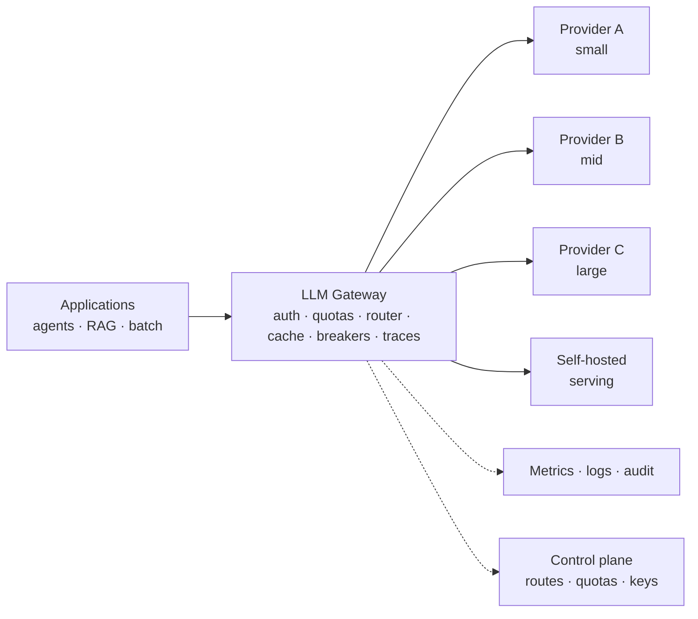

# LLM Gateway and Model-Routing Architecture

> **Interview answer (say this first).** An LLM gateway is the **single chokepoint** between your applications and every model provider. It owns provider credentials, routing, fallback, caching, retries, quotas, and observability, so no agent ever holds a provider key or hard-codes a model endpoint. Routing picks a model by cost, latency, task, tenant, or context length, and a **cascade** sends easy requests to a cheap model and escalates the hard ones. Because everything passes through one place, the gateway is also the natural home for circuit breakers, retries with backoff, tenant isolation, and a single trace of every token you spend.

## Why this exists

The first version of every AI system calls the provider directly. The key sits in an environment variable. The model name is a string in the code. It works, and it is a trap.

The trap springs slowly. A second team copies the call and picks a different model. A third team hard-codes a key and forgets to rotate it. A provider has an outage and nobody has a fallback because fallback logic lives in one developer's head. Finance asks which team spent $40,000 on tokens last month, and the honest answer is that nobody can tell. A prompt injection exfiltrates an API key that was never scoped. A single tenant's runaway agent consumes the shared quota and takes everyone down.

None of these are model problems. They are **architecture** problems: there is no single place that owns access, policy, and visibility.

The gateway exists to be that place. Every request goes through one door, and the door owns the things that must be consistent across teams:

- **Credentials** — held once, never in application code.
- **Routing** — the mapping from a logical model to a provider endpoint.
- **Fallback and retries** — one policy, applied everywhere.
- **Caching** — one cache, with correct tenant scoping.
- **Quotas and rate limits** — enforced at the point of spend.
- **Observability** — one trace, one cost record, per request.

> **The one-sentence rule.** One door for every model call: if a policy must hold for all traffic, it belongs in the gateway, not in each agent.

## Start from zero

| Word | Plain meaning |
| --- | --- |
| **Gateway** | A single service all model calls pass through, owning policy and routing. |
| **Chokepoint** | A single mandatory path; everything that must be consistent lives here. |
| **Provider abstraction** | A common interface so code says "chat", not "call vendor X". |
| **Logical model** | A name your app uses, like `chat-standard`, mapped by the gateway to a real model. |
| **Routing** | Choosing which provider or model handles a request. |
| **Cascade** | Try a cheap model first; escalate to a bigger one under a condition. |
| **Fallback** | A backup provider or model when the primary fails. |
| **Circuit breaker** | A switch that stops calling a failing dependency for a while. |
| **Half-open** | The breaker's test state: allow a probe to see if the dependency recovered. |
| **Retry with backoff** | Retrying after a growing delay; jitter randomises the delay. |
| **Quota** | A budget limit, often tokens or dollars, per tenant or per period. |
| **Rate limit** | A cap on requests per unit time, to protect capacity and fairness. |
| **Cache key** | The identity of a cached result: tenant, model, prompt, and parameters. |
| **Semantic cache** | A cache that matches on meaning, not exact text, using embeddings. |
| **Tenant** | One customer or team whose data and spend must be isolated. |
| **Control plane** | Configuration: routes, quotas, keys, model mappings. |
| **Data plane** | The request path itself: the gateway processing live traffic. |
| **Observability** | Traces, metrics, and logs that explain what happened and what it cost. |
| **Canary** | Releasing a change to a small slice of traffic before the full rollout. |
| **Span** | One traced operation with timing and attributes, in a distributed trace. |
| **Thundering herd** | Many clients retrying at once, turning a blip into an outage. |

## The core idea

Think of an airport. There is **one security checkpoint** every passenger passes through. The checkpoint owns identity, the rules, and the record of who went where. Passengers do not walk onto the tarmac directly, and airlines do not run their own private checkpoints.

The gateway is that checkpoint for model traffic:

- **One door** — every application calls the gateway, never a provider directly.
- **Identity and rules** — the gateway authenticates the caller and applies quotas and policy.
- **Routing desk** — it sends each request to the right airline (provider) for the job.
- **Flight log** — it records every request, its route, its latency, and its cost.



Read the arrows as policy. Applications never reach a provider. The gateway decides, caches, retries, and records. The control plane supplies routes and limits as data, so changing a model mapping is a config change, not a redeploy.

### Routing strategies, compared

| Strategy | Chooses by | Best when | Risk |
| --- | --- | --- | --- |
| **Cost** | Cheapest that meets the bar | High volume, mixed difficulty | Silent quality drop if the bar is wrong |
| **Latency** | Fastest candidate | Interactive UI, tight budget | Higher cost; small models may fail |
| **Task** | Task type or label | Distinct workloads with distinct needs | Needs a reliable classifier |
| **Tenant** | Tenant tier or contract | Enterprise isolation and SLAs | Complexity; tier sprawl |
| **Context length** | Smallest model that fits the tokens | Long documents | Context limit errors if misjudged |
| **Quality** | Best available | Accuracy-critical steps | Most expensive; slowest |
| **Cascade** | Cheap first, escalate on signal | Mixed difficulty, cheap gate | Escalated requests pay twice |

> **Why routing is an architecture decision, not a config detail.** The routing policy determines your quality, your latency, and your bill. It is where the requirement meets the model, so it deserves a test and an ADR, not a hard-coded `if`.

## How it works

Follow one request through the gateway, from authentication to a recorded cost.

1. **Authenticate the caller.** The gateway verifies the API key or token and resolves the tenant. No downstream service ever sees a provider credential.
2. **Apply rate limits and quotas.** Check requests per minute and remaining token or dollar budget for this tenant. Reject early if the limit is exceeded — cheap rejection beats expensive failure.
3. **Resolve the logical model.** The app asks for `chat-standard`; the gateway maps that name to a concrete provider model through the control plane.
4. **Check the cache.** Build the cache key from tenant, logical model, normalised prompt, and parameters. A hit returns immediately and costs nothing.
5. **Apply routing policy.** Filter candidates by the request's constraints — context length, region, minimum quality, deadline — then rank by the strategy: cost, latency, task, or tenant.
6. **Pick a healthy provider.** Consult the circuit breakers. A provider in the open state is skipped; a half-open provider may receive a single probe.
7. **Call the provider with a timeout.** Every call has a deadline. A call with no timeout holds a slot forever and turns latency into an outage.
8. **On failure, retry or fall back.** Retry idempotent calls with backoff and jitter. If retries are exhausted, move to the next provider in the fallback chain. Never retry a non-idempotent side effect blindly.
9. **Record the outcome.** One span captures tenant, logical model, real model, tokens in and out, latency, cache status, route, and cost. This is the record finance and debugging both need.
10. **Update the breakers.** Success closes a half-open breaker; repeated failure opens a closed one. Health is learned from traffic, not assumed.

Notice that the gateway is stateless where it can be: request handling holds no per-request state; quota counters live in a shared store; and breaker state is kept locally for the hot path and synced periodically to that same shared store. That lets you run several gateway replicas behind a load balancer.

### Where caching sits

Caching belongs in the gateway because the key must include the tenant, and because everyone benefits from one shared ceiling.

| Cache layer | What it stores | Typical key | Risk |
| --- | --- | --- | --- |
| **Exact response** | Full model answer | tenant + model + prompt + params | Stale answers; must version prompts |
| **Prompt prefix** | Reused input tokens | tenant + system prompt + tools | Small leakage if key is wrong |
| **Semantic** | Answers by meaning | tenant + embedding of the question | Wrong match returns a wrong answer |
| **Retrieval** | Retrieved passages | tenant + query + index version | Stale index or leaked documents |

The rule: **the tenant is always in the key.** A cache that ignores tenancy is a data breach waiting to happen.

## The syntax you will use

These are production forms. The exact names vary; the shape is standard.

**A gateway route config: logical name to concrete models.** Apps depend on logical names, not vendors.

```yaml
routes:
  - logical: chat-standard
    strategy: cost                 # cheapest that meets the request constraints
    candidates:
      - model: provider-a/mid
        quality: 0.86
        cost_per_1k: 0.0060
        latency_ms: 900
        context: 128000
        regions: [eu]
      - model: provider-b/mid
        quality: 0.84
        cost_per_1k: 0.0050
        latency_ms: 800
        context: 64000
        regions: [eu]
    fallback: [provider-c/mid]
    timeout_ms: 2000
    retries: {max: 2, backoff_ms: 200, jitter: true}
```

The app asks for `chat-standard`; operations can change the candidates without touching application code.

**A provider abstraction: one interface, many vendors.** This is what keeps switching cheap.

```python
from typing import Protocol

class ModelProvider(Protocol):
    name: str
    def complete(self, model: str, messages: list[dict],
                 timeout_s: float) -> dict: ...

class ProviderA:
    name = "provider-a"
    def complete(self, model, messages, timeout_s):
        """Call the vendor SDK and normalise the response shape."""
        ...

# the gateway holds providers, not the business logic
PROVIDERS: dict[str, ModelProvider] = {"provider-a": ProviderA()}
```

Every provider returns the same normalised shape, so routing and caching do not care who answered.

**A circuit-breaker config per provider.** Failure handling is config, not scattered code.

```yaml
circuit_breaker:
  provider-a:
    failure_threshold: 5      # consecutive failures to open
    cooldown_s: 30            # time before a half-open probe
    probe_requests: 1         # requests allowed while half-open
    timeout_ms: 2000
```

One bad provider stops receiving traffic for a cooldown, then gets a single probe. Recovery is automatic.

**A cache policy with tenant scoping.** Correctness depends on the key.

```yaml
cache:
  exact:
    enabled: true
    ttl_s: 3600
    key: [tenant, logical_model, prompt_hash, params_hash]
  prefix:
    enabled: true
    min_prefix_tokens: 512
  semantic:
    enabled: false            # opt-in: wrong matches return wrong answers
    threshold: 0.97
```

Turn on the safe layers first. Semantic caching is powerful and dangerous; enable it with a high threshold and a clear metric.

**A quota policy per tenant.** Enforced before the spend, not after the invoice.

```yaml
tenants:
  - id: acme
    rate_limit: {requests_per_minute: 600}
    quota: {tokens_per_month: 200000000, usd_per_month: 500}
    max_context_tokens: 128000
    allowed_models: [chat-standard, chat-long]
    region: eu
```

Quotas are the fairness mechanism. Without them, one tenant's runaway agent is everyone's incident.

**The routing decision as pure Python.** Make the policy explicit and testable.

```python
def route(req: dict, routes: list[dict]) -> dict | None:
    """Filter by hard constraints, then pick by strategy."""
    ok = [r for r in routes
          if r["quality"] >= req["min_quality"]
          and r["context"] >= req["tokens"]
          and r["latency_ms"] <= req["deadline_ms"]
          and r["region"] in req["allowed_regions"]
          and r["name"] not in req["unhealthy"]]
    if not ok:
        return None
    if req["strategy"] == "cost":
        return min(ok, key=lambda r: r["cost_per_1k"])
    if req["strategy"] == "latency":
        return min(ok, key=lambda r: r["latency_ms"])
    return max(ok, key=lambda r: r["quality"])
```

Constraints are hard filters; the strategy only ranks what survives. That ordering prevents routing a request to a model that cannot serve it.

## Examples: simple to real

**Example 1 — filter first, rank second.** The candidates differ in quality, cost, latency, context, and region.

```python
# route() is defined in "The syntax you will use" above
ROUTES = [
    {"name": "small-a", "quality": 0.70, "cost_per_1k": 0.001, "latency_ms": 350,  "context": 32_000,  "region": "eu"},
    {"name": "mid-a",   "quality": 0.86, "cost_per_1k": 0.006, "latency_ms": 900,  "context": 128_000, "region": "eu"},
    {"name": "large-a", "quality": 0.95, "cost_per_1k": 0.020, "latency_ms": 2200, "context": 200_000, "region": "us"},
    {"name": "mid-b",   "quality": 0.84, "cost_per_1k": 0.005, "latency_ms": 800,  "context": 64_000,  "region": "eu"},
]

base = {"tokens": 4_000, "min_quality": 0.80, "deadline_ms": 1500,
        "allowed_regions": {"eu"}, "unhealthy": set()}

print(route({**base, "strategy": "cost"}, ROUTES)["name"])     # mid-b
print(route({**base, "strategy": "latency"}, ROUTES)["name"])  # mid-b
print(route({**base, "strategy": "quality"}, ROUTES)["name"])  # mid-a
print(route({**base, "tokens": 100_000, "strategy": "cost"}, ROUTES)["name"])  # mid-a
print(route({**base, "strategy": "cost", "unhealthy": {"mid-a"}}, ROUTES)["name"])  # mid-b
print(route({**base, "min_quality": 0.99}, ROUTES))            # None
```

Cost and latency both choose `mid-b`; quality chooses `mid-a`. With a 100k-token context only `mid-a` fits, and if `mid-a` is unhealthy the router falls to `mid-b`. A quality bar of 0.99 returns `None`, which forces a deliberate fallback path rather than a silent quality failure.

**Example 2 — cascade with a quality gate.** Cheap first, escalate when the gate is not cleared.

```python
# base and ROUTES are from Example 1
def cascade(req: dict, routes: list[dict], gate: float) -> str | None:
    """Cheapest candidate that clears every hard constraint and the gate."""
    ok = [r for r in routes
          if r["quality"] >= req["min_quality"]
          and r["context"] >= req["tokens"]
          and r["latency_ms"] <= req["deadline_ms"]
          and r["region"] in req["allowed_regions"]
          and r["name"] not in req["unhealthy"]]
    for r in sorted(ok, key=lambda r: r["cost_per_1k"]):
        if r["quality"] >= gate:
            return r["name"]
    return None   # nothing qualifies: degrade or use the fallback chain

print(cascade(base, ROUTES, 0.65))   # mid-b
print(cascade(base, ROUTES, 0.85))   # mid-a
print(cascade(base, ROUTES, 0.90))   # None -> degrade honestly
```

A cascade must obey the same hard constraints as `route`, then apply the gate on top. With a 0.65 gate the cheapest qualifying model is `mid-b` (quality 0.84). Raise the gate to 0.85 and it escalates to `mid-a` (quality 0.86). At 0.90 no candidate clears both the request's constraints and the gate, so `cascade` returns `None` and the gateway must degrade deliberately or use its fallback chain. `small-a` never competes because its quality (0.70) is below the 0.80 minimum; `large-a` is excluded despite its 0.95 quality because it is in the `us` region and exceeds the 1500 ms deadline. The gate trades cost for quality — but only among the models the hard constraints allow.

**Example 3 — a circuit breaker, state by state.** The breaker learns which providers are healthy.

```python
class Breaker:
    def __init__(self, threshold=3, cooldown=2):
        self.state, self.failures = "closed", 0
        self.threshold, self.cooldown, self.tick, self.opened_at = threshold, cooldown, 0, -1

    def call(self, ok: bool) -> str:
        if self.state == "open":
            if self.tick - self.opened_at >= self.cooldown:
                self.state = "half-open"
            else:
                return "reject (open)"
        if self.state == "half-open":
            self.state = "closed" if ok else "open"
            if not ok:
                self.opened_at = self.tick
            self.failures = 0 if ok else self.failures + 1
            return f"probe -> {self.state}"
        if ok:
            self.failures = 0
            return "pass"
        self.failures += 1
        if self.failures >= self.threshold:
            self.state, self.opened_at = "open", self.tick
        return "fail"

b = Breaker()
for i, ok in enumerate([False, False, False, True, True, True, True]):
    b.tick = i
    print(f"t={i} ok={ok!s:5s} -> {b.call(ok):14s} state={b.state}")
# t=0 ok=False -> fail           state=closed
# t=1 ok=False -> fail           state=closed
# t=2 ok=False -> fail           state=open
# t=3 ok=True  -> reject (open)  state=open
# t=4 ok=True  -> probe -> closed state=closed
# t=5 ok=True  -> pass           state=closed
# t=6 ok=True  -> pass           state=closed
```

Three failures open the breaker. Requests are rejected immediately rather than hanging. After the cooldown one probe is allowed, and a success closes the breaker. This is how one bad provider stops hurting the whole fleet.

**Example 4 — a fallback chain.** When the primary is down, the next provider takes over without a redeploy.

```python
def fallback(primary: str, chain: list[str], unhealthy: set[str]) -> str | None:
    for name in [primary] + chain:
        if name not in unhealthy:
            return name
    return None

print(fallback("mid-a", ["large-a", "mid-b"], set()))                    # mid-a
print(fallback("mid-a", ["large-a", "mid-b"], {"mid-a"}))                # large-a
print(fallback("mid-a", ["large-a", "mid-b"], {"mid-a", "large-a"}))     # mid-b
print(fallback("mid-a", ["large-a", "mid-b"], {"mid-a", "large-a", "mid-b"}))  # None
```

When every provider is unhealthy the answer is `None`, and the gateway must **degrade deliberately**: return a cached answer, queue the work, or tell the user. Selling a silent failure as a fallback is worse than admitting the outage.

**Example 5 — cache keys must include the tenant.** This is the most common and most dangerous gateway bug.

```python
import hashlib

def cache_key(tenant: str, model: str, prompt: str, params: str) -> str:
    raw = f"{tenant}|{model}|{prompt}|{params}".encode()
    return hashlib.sha256(raw).hexdigest()[:12]

k1 = cache_key("acme", "mid-a", "what is our refund policy", "temp=0")
k2 = cache_key("acme", "mid-a", "what is our refund policy", "temp=0")
k3 = cache_key("globex", "mid-a", "what is our refund policy", "temp=0")

print(k1 == k2, k1)   # True 84005f2e1f16
print(k1 != k3, k3)   # True 22dddf67a0c0
```

Same tenant and prompt give the same key, so the cache hits. A different tenant gives a different key, so Acme never sees Globex's answer. Drop the tenant from the key and you have built a cross-tenant data leak with excellent hit rates.

**Example 6 — a quota check before the spend.** Reject early, not after the invoice.

```python
def allow(spent: int, budget: int, estimated: int) -> str:
    remaining = budget - spent
    if estimated > remaining:
        return f"deny (need {estimated}, have {remaining})"
    return f"allow (remaining after = {remaining - estimated})"

print(allow(80, 100, 5))   # allow (remaining after = 15)
print(allow(99, 100, 5))   # deny (need 5, have 1)
```

The gateway estimates the cost of the call before making it. A tenant near its ceiling is stopped at the boundary, not discovered at month end. Combined with rate limits, this is what keeps one tenant from consuming shared capacity.

## In production

- **One door only.** Any code path that calls a provider directly is a credential leak, an unaccounted cost, and a blind spot. Enforce it at the network level.
- **Never let applications hold provider keys.** The gateway brokers credentials and scopes them per provider and region.
- **Put the tenant in every cache key.** A cache miss costs money; a cross-tenant hit costs trust. Prefer missing to leaking.
- **Every call needs a timeout.** A provider that hangs holds a slot and cascades into an outage. Set deadlines at the gateway, not in each caller.
- **Retry only idempotent calls, with backoff and jitter.** Blind retries amplify an outage and duplicate side effects.
- **Trip the breaker on consecutive failures.** Reject fast, probe occasionally, recover automatically. Do not let a dead provider absorb your capacity.
- **Have a real fallback, or degrade honestly.** Cached answer, queued work, or a clear error. A fake fallback is worse than none.
- **Enforce quotas where the tokens are consumed.** Token and dollar budgets belong at the gateway, checked before each call.
- **Keep the hot path fast.** The gateway is on every request. Keep it stateless, cache aggressively, and avoid synchronous calls to slow control-plane services.
- **Make routes config, not code.** Changing a model mapping should be a reviewed config change, with a canary, not a deploy of every application.
- **Record cost and tokens per span.** One trace linking tenant, route, model, tokens, latency, and cache status is the difference between a diagnosis and a guess.
- **Watch for tenant imbalance.** One noisy tenant can dominate shared capacity. Rate limits and per-tenant quotas are fairness, and fairness is a design input.

## Interview questions

### 1. What is an LLM gateway, and why have one?

**Answer.** A gateway is a single service every model call passes through. It centralises provider credentials, routing, fallback, retries, caching, quotas, and observability, so applications never hold keys or hard-code endpoints. The benefit is consistency: a policy written once applies to all traffic, and one trace explains what any request did and what it cost.

**Follow-up: "Why not a client library everyone imports?"** A library gives you code reuse but not enforcement. It cannot guarantee that every service is updated, holds credentials safely, or shares a quota. A gateway enforces at the boundary.

**Trap.** Building a gateway that only proxies. If it does not own routing, quotas, caching, and observability, it is an extra hop with no payoff.

### 2. What routing strategies do you use, and when?

**Answer.** Cost routing picks the cheapest model that clears the quality bar, for high volume with mixed difficulty. Latency routing picks the fastest, for interactive paths. Task routing sends different workloads to different models. Tenant routing applies tiers and SLAs. Context routing picks the smallest model that fits the tokens. Quality routing picks the best for accuracy-critical steps. Cascades combine them: the cheap model first, escalation under a signal.

**Follow-up: "How do you decide the order?"** Hard constraints first — context, region, minimum quality, deadline — because routing to a model that cannot serve the request is a bug, not a trade-off. Then rank the survivors by the strategy.

**Trap.** Routing purely on cost without a quality gate. The bill falls and the quality falls with it, usually without anyone noticing until customers complain.

### 3. How do you handle a provider outage?

**Answer.** Layered defence. A circuit breaker opens after consecutive failures and stops sending traffic, so the dead provider does not absorb capacity. A fallback chain sends new requests to the next healthy provider. Retries with backoff and jitter handle transient errors. If everything is unhealthy, the gateway degrades deliberately — cached answer, queued work, or a clear error.

**Follow-up: "What is the risk of fallback?"** Fallback models may have different quality, cost, and behaviour. I test the fallback path, not just the primary, and I alert when fallback is active so the drop in quality is visible.

**Trap.** Assuming a fallback exists because it is configured. Untested fallbacks fail exactly when they are needed.

### 4. Where should caching live, and what must the key contain?

**Answer.** In the gateway, because one cache benefits all callers and because tenancy must be enforced centrally. The key must include the tenant, the logical model, the normalised prompt, and the parameters. Without the tenant you risk a cross-tenant data leak; without the model or parameters you return the wrong answer for a different request.

**Follow-up: "How do you handle staleness?"** Version the prompt and index, set a TTL, and invalidate on change. A cached answer from an old prompt version is a quality bug disguised as a performance win.

**Trap.** Enabling semantic caching by default. A near-match returns a confidently wrong answer, and the failure is hard to trace.

### 5. How do you enforce budgets and fairness across tenants?

**Answer.** Per-tenant rate limits and quotas at the gateway. Rate limits cap requests per minute; quotas cap tokens or dollars per period. The gateway estimates the cost of a call before making it and rejects when the remaining budget is insufficient. Combined with tenant-aware routing and isolation, this keeps one tenant from consuming shared capacity.

**Follow-up: "What do you do at the limit?"** Reject with a clear error, or downgrade to a cheaper model if the tenant allows it. What you must not do is silently keep spending.

**Trap.** Accounting after the fact. A monthly report is not a control; by the time it runs, the money is gone.

### 6. How does the gateway help observability?

**Answer.** It is the one place that sees every call, so it can emit one span per request with tenant, logical model, real model and version, tokens in and out, cache status, latency, route taken, and cost. That single record answers the questions that otherwise require joining logs across many services: what happened, which model answered, and what it cost.

**Follow-up: "What do you alert on?"** Error rate and p95 latency per provider, breaker state changes, cache hit rate, fallback activation, and spend versus budget. Spend alerts catch runaway agents before the invoice.

**Trap.** Logging prompts and responses without a privacy plan. Observability must respect data sensitivity; redact or hash what you do not need.

### 7. What are the failure modes of a gateway itself?

**Answer.** It is a shared chokepoint, so its failure is large: if it is down, nothing reaches a model. It must be replicated and stateless where possible, with breakers and counters in a shared store. Other modes: a cache bug leaking across tenants, a slow control-plane lookup on the hot path, thundering-herd retries, and configuration errors that route everything to one provider.

**Follow-up: "How do you make it highly available?"** Multiple replicas behind a load balancer, no sticky sessions, health checks, local circuit-breaker state with periodic sync, and a tested fallback for the gateway's own control-plane dependency.

**Trap.** Making the gateway stateful per instance. Then scaling it out breaks routing decisions, because no two replicas agree.

### 8. When would you not use a gateway?

**Answer.** Very rarely, and only temporarily. A single developer prototyping offline may call a provider directly, but that is a temporary exception with a plan to move behind the gateway. Any system with more than one caller, real users, or real money needs a gateway, because the moment there are two callers the policies already diverge.

**Follow-up: "What about latency overhead?"** A well-built gateway adds a small, roughly constant hop. Compare that to the cost of unaccounted spend, leaked keys, and manual failover. The overhead is the price of control and is usually worth it.

**Trap.** Skipping the gateway to save latency, then rebuilding it after the first credential leak or the first unaffordable invoice.

## Remember this

- **One door for every model call.** Credentials, routing, quotas, caching, and observability live in the gateway, not in each agent.
- **Filter by constraints, then rank by strategy.** Never route to a model that cannot serve the request.
- **The tenant is always in the cache key.** A miss costs money; a cross-tenant hit costs trust.
- **Break, fall back, degrade — in that order.** Trip the breaker, use the fallback chain, and if all else fails, degrade honestly rather than silently.
- **Enforce budgets before the spend.** Quotas and rate limits at the gateway are how one tenant stops being everyone's incident.
