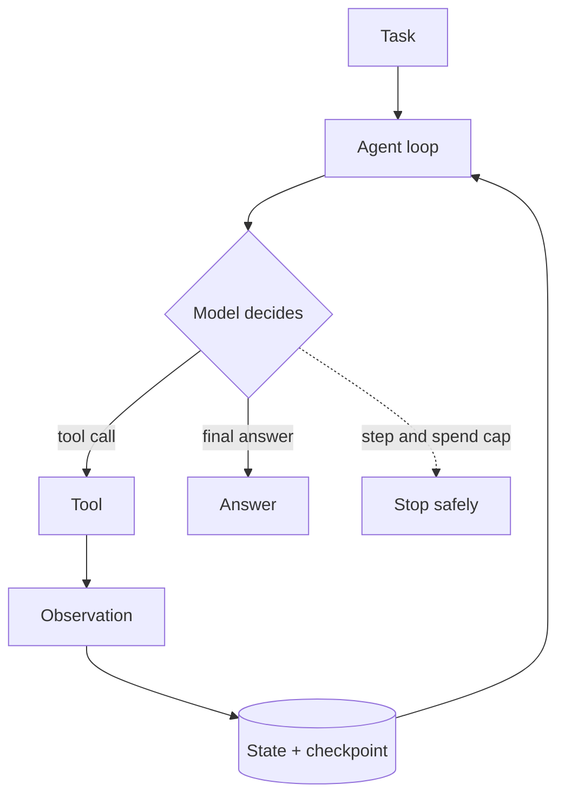
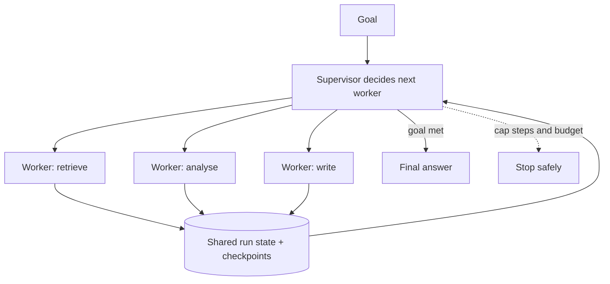

# Agent Orchestration and Multi-Agent Architecture

> **Interview answer (say this first).** An agent is a loop: it reads state, asks a model for the next action, runs a tool, records the observation, and repeats until it answers or hits a limit. That loop needs three things to survive production — explicit state, a checkpoint after every step, and a hard cap on steps and spend. Start with exactly one agent. Move to multiple agents only for a measured reason: a task really spans domains, independent work can run in parallel, each worker must see a small clean context, or you need a check the author did not perform. The common shapes are supervisor/worker (a manager delegates repeatedly), planner-executor (plan first, run steps, replan on failure), router (classify once and dispatch), and critic (review and send back). Every extra agent buys reliability with more tokens, more latency, and a new class of coordination failures — deadlocks, lost handoffs, and shared-state races — so keep the control flow deterministic and make only the genuinely uncertain step agentic.

> **Note:**
>
> **Verified.** Every runnable example on this page was executed offline in plain Python (Python 3.14). No model calls were made. Where a line represents model output, it is labelled **illustrative**.

## Why this exists

The instinct is to build one powerful agent with every tool and a long prompt. It works in a demo and fails in production for predictable reasons:

- **Tool selection collapses.** Accuracy drops as the tool list grows. With twenty tools, the model picks the wrong one often enough to matter.
- **Context is polluted.** A failed search, an old draft, and a user aside all stay in the window and steer later decisions.
- **No parallelism.** One loop is sequential. Independent work waits in line.
- **No separation of concerns.** The prompt that plans, fetches, writes, and reviews cannot be tuned without breaking something else.
- **No independent check.** The agent that wrote the answer grades it, and it is biased toward its own work.
- **No isolation.** A worker that can see everything can be confused by everything.
- **No cost ceiling.** A loop with no cap spends without limit when the goal is unreachable.
- **Debugging is guesswork.** When the run fails you have one blob of text, not named stages.

Orchestration splits the work so each piece is smaller, testable, and replaceable. The cost is coordination: more agents mean more prompts, more tokens, more latency, and more ways for the handoff to break.

> **Note:**
>
> **The one-sentence purpose.** Orchestration is how you divide a task among agents to gain specialisation, parallelism, or independent review — and it is only worth the overhead when you can measure the gain.

## Start from zero

| Word | Plain meaning |
| --- | --- |
| **Agent** | A model plus tools plus a loop, working toward a goal. |
| **Agent loop** | Read state, decide, act, observe, repeat until done or capped. |
| **Tool** | A function the agent can call: search, database query, send email. |
| **State** | The data describing the run now: messages, plan, step count, results. |
| **Checkpoint** | A saved copy of state after a step, so the run can resume. |
| **Turn / step** | One iteration of the loop: one decision plus its effect. |
| **Single agent** | One loop with all the tools and instructions. The default. |
| **Orchestrator** | The component, code or agent, that sequences the others. |
| **Supervisor** | An agent that delegates to workers and collects results, in a loop. |
| **Worker** | A specialised agent that does one narrow job with its own tools. |
| **Planner-executor** | Produce a full plan first, then run the steps; replan on failure. |
| **Router** | Classify the request once, then dispatch to one path. |
| **Critic** | Review a draft and return specific feedback for revision. |
| **Evaluator** | Judge an output against a rubric and return pass or fail. |
| **Handoff** | Move control to another agent, which then finishes the task. |
| **Agent-as-tool** | Call another agent for a bounded job; the caller keeps control. |
| **Fan-out / fan-in** | Start many workers in parallel, then wait for all and merge. |
| **Shared memory** | State every agent in the run can read and write. |
| **Private memory** | State only one agent sees, scoped to its own context. |
| **Context isolation** | Giving each agent only the information it needs. |
| **Topology** | The shape of the system: chain, star, tree, graph. |
| **Deadlock** | Agents waiting on each other, or repeating work, with no progress. |
| **Handoff loss** | Information dropped when control moves between agents. |
| **Deterministic step** | Code with fixed branches, used where the path must never vary. |
| **Agentic step** | A step whose next action is chosen by a model. |
| **ReAct** | A reasoning-plus-acting loop: thought, tool call, and observation interleaved until the model can answer. |
| **Golden-trace test** | Runs one representative input end to end and asserts the recorded stage sequence matches an approved trace. |

Three distinctions do most of the work:

- **Router vs supervisor.** A router decides **once**, then gets out of the way. A supervisor stays in the loop, deciding repeatedly.
- **Handoff vs agent-as-tool.** A handoff **replaces** the active agent. Agent-as-tool **keeps** the caller in charge and borrows the result.
- **Shared vs private memory.** Shared state is the run's source of truth; private state is one worker's scratch space. Mixing them causes races and context leaks.

## The core idea

Think of a company instead of a single freelancer.

- A **single agent** is one very good generalist. Cheapest to start, best for small tasks, and the right default.
- A **router** is the front desk. It reads the request and sends it to billing, technical, or sales. One decision.
- A **planner** is the architect. It writes the plan before anyone builds.
- A **supervisor** is a project manager. It keeps a task list, assigns items to specialists, collects results, and decides when the job is done.
- **Workers** are specialists. Each has a narrow brief and only the tools it needs.
- A **critic** is a code reviewer. It does not only reject; it explains what to change, and the author revises.

The smallest useful thing is a single agent with a loop, state, tools, and a checkpoint:



A supervisor adds a layer that keeps deciding, so it is a loop around workers:



Choosing the smallest pattern that works is the whole skill:

| Pattern | Problem it solves | Control | Typical cost |
| --- | --- | --- | --- |
| Single agent | One domain, fits in one context | One loop | 1x |
| ReAct | Needs tools in a loop | Loop | 1x, many turns |
| Plan-and-execute | Long task, steps knowable | Plan then run | 1 plan + N steps |
| Router | Many request types, one request each | One decision | 1 classify + 1 agent |
| Supervisor + workers | Broad task, many skills | Ongoing loop | 1 supervisor + N workers |
| Evaluator / critic | Output quality matters | Generate then check | 2x or more |

## How it works

1. **Start with a single agent.** Give it the tools and instructions for the task. Measure success rate, cost, and latency. This is the baseline every orchestration idea must beat.
2. **The loop reads state and decides.** Each iteration produces a thought, an action (usually a tool call), and an observation. State is explicit data, not hidden variables.
3. **Checkpoint after every step.** Persist the run's state so a crash, a deploy, or a rebalance can resume rather than restart. The checkpoint is also the audit trail.
4. **Cap the loop.** A maximum step count and a maximum spend. Without a cap, an unreachable goal becomes unbounded cost.
5. **A router classifies once.** It outputs one label, and code dispatches to the matching agent. Log the decision, because a silent misroute still produces a polite wrong answer.
6. **A planner writes a step list.** The plan is visible, approvable, and retryable per step. On failure the planner revises, with a bounded number of replans.
7. **A supervisor delegates in a loop.** It tracks remaining work, picks a worker, calls it, records the result, and repeats until the goal is met or a cap fires.
8. **Workers are narrow.** Each worker gets a small context and only its own tools. This is the main benefit: a worker cannot be confused by tools it does not have, and its mistakes stay local.
9. **Shared memory holds the run truth.** Workers read and write a shared state (goal, results, counters). Private memory holds scratch that no other agent needs. Passing the whole conversation to every worker throws isolation away.
10. **A critic judges and improves.** It returns a structured verdict plus reasons, the generator revises, and the loop repeats until the score passes or a round cap fires. The rubric must be explicit.
11. **Handoffs move control; agent-as-tool borrows it.** Use a handoff when the specialist should finish the task. Use agent-as-tool when the caller must combine the result with other work.
12. **Detect no-progress.** If a supervisor keeps choosing the same worker with the same output, the run is stuck. Compare the (worker, output) pair against what the run has already seen and stop.
13. **Keep deterministic code in charge.** Routing tables, validation, aggregation, budget checks, and the final approval are code. Only the uncertain decision is a model call.
14. **Test the topology end to end.** A perfect worker in a broken chain still produces a broken run. Add a golden-trace test per route.

## The syntax you will use

**State and checkpoint as data.** Making the run explicit is what allows resuming and tracing.

```python
from dataclasses import dataclass, field

@dataclass
class Step:
    thought: str
    tool: str | None = None        # None means "answer now"
    args: str = ""
    observation: str | None = None

@dataclass
class AgentState:
    run_id: str
    steps: int = 0
    messages: list = field(default_factory=list)
    checkpoint: dict = field(default_factory=dict)
```

Every step reads `AgentState` and writes back to it; `checkpoint` is the serialisable snapshot you persist.

**The single-agent loop with a cap.** The policy stands in for the model; the tools are ordinary functions.

```python
def single_agent(policy, tools, state, max_steps=6):
    trace = []
    for _ in range(max_steps):
        step = policy(state)
        if step.tool is None:                 # no action means the run is done
            trace.append(step)
            state.checkpoint = {"steps": state.steps, "done": True}
            return trace, "answered"
        state.steps += 1
        if step.tool not in tools:            # unknown tool is caught, not fatal
            step.observation = f"ERROR unknown tool {step.tool}"
        else:
            step.observation = tools[step.tool](step.args)
        trace.append(step)
        state.checkpoint = {"steps": state.steps, "done": False}
    return trace, "max_steps"                 # the cap always exists
```

**Choose the topology in code, not by vibe.** The decision function makes the reasoning reviewable.

```python
def orchestration_choice(s: dict) -> str:
    if s["multi_domain"] or s["cross_domain_task"] or s["parallel_steps"] > 1:
        return "supervisor + workers"          # several skills or independent work
    if s["request_types"] > 1:
        return "router"                        # many request types, one path each
    if s["needs_review"]:
        return "single-agent + critic"         # quality gate on one domain
    if s["single_domain"] and s["steps_known"]:
        return "plan-and-execute"              # knowable shape, visible plan
    return "single-agent"                      # the default
```

**A supervisor with a cap and no-progress detection.**

```python
def supervise(goal, choose_worker, workers, max_steps=6):
    results, seen = [], set()
    for _ in range(max_steps):
        name = choose_worker(goal, results)
        if name is None:
            return results, "done"
        output = workers[name](goal)
        if (name, output) in seen:             # same worker, same output: stuck
            return results, "no_progress"
        seen.add((name, output))
        results.append((name, output))
    return results, "max_steps"
```

**Handoff versus agent-as-tool.** Two lines of code express the difference in who owns the rest of the run.

```python
def handoff(worker_fn, task):
    return {"owner": "worker", "result": worker_fn(task)}   # control moved

def agent_as_tool(caller_log, worker_fn, subtask):
    caller_log.append(("borrowed", worker_fn(subtask)))     # caller keeps control
    return {"owner": "caller", "log": caller_log}
```

**Shared versus private state.** Only what a worker needs crosses the boundary.

```python
def worker_view(shared_state: dict, private_state: dict) -> dict:
    # the worker sees the goal and its own scratch, never the other workers' scratch
    return {"user_goal": shared_state["user_goal"], **private_state}
```

**Parallel workers with per-worker failure handling.**

```python
import asyncio

async def run_workers(workers, task):
    outcomes = await asyncio.gather(*(w(task) for w in workers), return_exceptions=True)
    return [r for r in outcomes if not isinstance(r, Exception)]   # keep the good ones
```

## Examples: simple to real

**Example 1 — a single-agent loop that terminates and checkpoints.**

A scripted policy and two tools. Verified output:

```text
status: answered
tools: [('lookup', 'order order-42 total=120'),
        ('refund', 'refund queued for order-42'),
        (None, None)]
checkpoint: {'steps': 2, 'done': True}
```

The third step has no tool, so the loop ends. The checkpoint records exactly where the run stopped, which is what a resume reads.

**Example 2 — choosing the topology from signals.**

Five tasks, five decisions. Verified:

```text
['single-agent', 'plan-and-execute', 'router', 'supervisor + workers', 'single-agent + critic']
```

The order matters: a broad or parallel task goes multi-agent first, then request-type variety goes to a router, then a review need adds a critic, then a knowable single-domain task becomes plan-and-execute, and everything else stays single.

**Example 3 — a supervisor that is capped and detects no progress.**

The happy path finishes, and a stuck supervisor is caught instead of looping forever. Verified:

```text
done:  ([('retriever', 'docs for quarterly report'),
         ('analyzer', 'analysis of quarterly report')], 'done')
stuck: ([('retriever', 'docs for loop')], 'no_progress')
```

`no_progress` fires because the supervisor chose the same worker and got the same output a second time. Without that check, the cap would eventually stop it, but after paying for useless turns.

**Example 4 — handoff transfers control; agent-as-tool does not.**

Verified:

```text
handoff: {'owner': 'worker', 'result': 'draft for report'}
as-tool: {'owner': 'caller', 'log': [('planned', 'report'),
                                     ('borrowed', 'draft for report')]}
```

After the handoff the worker owns the run. With agent-as-tool the caller still holds its plan and simply added the borrowed draft. Using a handoff and then expecting the caller to post-process is a classic bug.

**Example 5 — orchestration is not free.**

Using an illustrative price of `$3` per million input tokens and `$15` per million output tokens, with these per-agent token counts:

| Agent | Input tokens | Output tokens |
| --- | --- | --- |
| Single agent (baseline) | 2,000 | 500 |
| Supervisor | 600 | 120 |
| Worker (each of 3) | 1,400 | 300 |

```text
supervisor:  $0.0036   (600 in, 120 out)
workers:     $0.0261   (3 x 1,400 in, 300 out)
total:       $0.0297
single:      $0.0135
ratio:       2.20x
```

Latency moves the other way when the work is independent. For three steps of `0.8s`, `0.6s`, and `0.5s`:

```text
sequential: 1.9s
parallel:   max(0.8, 0.6, 0.5) = 0.8s
saved:      1.1s
```

Parallelism helps only independent steps. Dependent steps must stay sequential, whatever the whiteboard shows.

**Example 6 — shared versus private memory.**

Verified, with the shared and private keys separated:

```text
{'shared_keys': ['run_id', 'user_goal'],
 'private_keys': ['draft', 'scratch'],
 'context_tokens': 3}
```

The worker sees the goal and its own scratch. It does not receive the other workers' drafts, which is what keeps its context small and its decision clean.

## In production

- **Default to one agent.** Every additional agent adds a prompt, a context, and an interface to test. Split only when a metric — success rate, latency, review quality — justifies it.
- **Isolate worker context.** The main benefit of workers is that each sees less. Passing the full conversation to every worker throws that benefit away and multiplies cost.
- **Always cap the loop and the spend.** Supervisors and critics need a maximum number of steps and rounds. An uncapped supervisor is unbounded spend.
- **Detect no progress explicitly.** Compare each new (worker, output) against the run's history. A repeated pair means the run is stuck; stop it before the cap burns tokens.
- **Make routing observable.** Log the route, the confidence if you have one, and the fallback. A silent misroute is the most expensive orchestration bug because the answer still looks plausible.
- **Define ownership at every handoff.** When control moves, state ownership must move with it. Two agents that both believe they own the next action produce duplicated side effects.
- **Run parallel workers only over idempotent tools.** Two workers may retry the same effect. Give each operation a stable key and deduplicate at the tool layer.
- **Handle partial failure in fan-out.** Decide up front whether one failed worker fails the run or the others proceed. Make that policy explicit in code.
- **Give the critic a rubric, a round cap, and a clean pair of eyes.** A vague critic produces vague feedback and can oscillate, so a rubric plus `max_rounds` makes it a bounded improvement loop. An evaluator also tends to approve work that resembles its own, so where it matters use a different model or a deterministic check.
- **Keep shared state authoritative.** Workers write results back to one run state; they do not keep private copies of the goal that drift from it. Use optimistic versioning if two workers can update the same field.
- **Correlate traces across agents.** Give the whole orchestration one run id and attach it to every sub-call, or you cannot reconstruct a failure.
- **Test each route end to end.** Unit-test workers, then add a golden-trace test per route. A change that fixes billing can silently break technical.

## Interview questions

### 1. When do you move from a single agent to multiple agents?

**Answer.** When you can name the reason and measure the gain. The valid reasons are domain specialisation (one prompt cannot hold all the instructions), context isolation (workers must not see each other's noise), parallelism (independent work must run at once), and independent review (you need a check the generator did not perform). If none applies, a single agent with better tools and a tighter prompt is simpler and usually better.

**Follow-up: "What is the first thing you try before splitting?"** Improve the tool descriptions, remove unused tools, and tighten the instructions. Bad tool selection is often a description problem, not a reason to add an agent.

**Trap.** Splitting agents to fix a prompt bug. You now have two prompts with the same bug and a new interface that can also fail.

### 2. What is the single-agent loop made of, and what makes it production-ready?

**Answer.** It is a loop over state: read state, decide the next action, run the tool, record the observation, repeat. Production readiness is four additions: state is explicit and serialisable, a checkpoint is written after every step, the loop has a step and spend cap, and the tools have stable idempotency keys. Without those, a restart loses the run and a retry duplicates side effects.

**Follow-up: "Where do you store the checkpoint?"** Outside the process — Redis for speed, Postgres or object storage for durability — keyed by run id, so any worker can resume.

**Trap.** Keeping state in local variables. It works in a notebook and fails on the first deploy, restart, or second worker.

### 3. Router versus supervisor — what is the difference?

**Answer.** A router makes one classification and dispatches; it is not involved after that. A supervisor stays in control and makes repeated delegation decisions until the task is done. Routers are cheap, fast, and ideal for distinct request types. Supervisors handle broad tasks that need several skills and an ongoing plan. A supervisor can contain a router as its first step.

**Follow-up: "When is a router enough?"** When each request belongs to exactly one specialist and the specialist can finish alone. If the task needs several specialists or a result must be assembled from several workers, you need a supervisor or a pipeline.

**Trap.** Building a supervisor when a router suffices. The extra loop adds cost and a failure mode for no benefit.

### 4. What is the difference between a handoff and an agent-as-tool?

**Answer.** A handoff transfers control: the new agent replaces the old one and owns the rest of the run. Agent-as-tool calls another agent for a bounded job and returns its output to the caller, which keeps control. Use a handoff when the specialist should finish the task; use agent-as-tool when the caller must combine the result with other work.

**Follow-up: "What happens to context in each?"** A handoff can carry the conversation to the new agent, so use an input filter to limit it. Agent-as-tool gives the sub-agent only the input the caller passes, which is better isolation by default.

**Trap.** Using a handoff and then expecting the original agent to post-process the result. After a handoff, control has moved.

### 5. How do you prevent deadlocks and loops in a multi-agent system?

**Answer.** Cap every loop, and detect no-progress rather than relying on the cap alone. Record each (worker, output) pair the run produces; if the same pair appears again, the supervisor is repeating work and the run should stop with a clear status. For mutually waiting agents, add a global deadline and a timeout on every delegate call, and never let one agent hold a lock while waiting on another.

**Follow-up: "What is the difference between a productive repeat and a deadlock?"** A productive repeat produces new information, so the (worker, output) pair differs. A deadlock reproduces the same state. Compare state, not just worker names.

**Trap.** Setting `max_steps` and calling it safety. The cap bounds cost but still lets the run waste every step before it fires.

### 6. How do you decide what goes in shared versus private memory?

**Answer.** Shared memory holds the run's source of truth: the goal, the plan, step count, and the final results each worker must contribute. Private memory holds scratch that no other agent needs: intermediate reasoning, a draft, a working set. A worker receives the shared goal plus its own private scratch, and writes results back to shared state. This keeps contexts small and prevents one worker's noise from steering another.

**Follow-up: "What breaks if you share everything?"** Context grows, cost rises, and workers start reacting to each other's unfinished work. You also create write conflicts on fields two workers update at once.

**Trap.** Treating the full conversation as shared state. It defeats context isolation, which was the reason to split in the first place.

### 7. How do you control the cost and latency of orchestration?

**Answer.** Measure both per run. Reduce agents, because each adds its own system prompt and history. Isolate context so workers do not receive the whole conversation. Run independent workers in parallel and keep dependent ones sequential. Cap turns, rounds, and total spend. Cache retrieval and repeated tool calls. Choose a smaller model for routing and evaluation, and reserve the strongest model for the hard reasoning step.

**Follow-up: "When is a multi-agent system cheaper than a single agent?"** When context isolation lets each worker use a much smaller prompt, or when a cheap router avoids an expensive generalist. Rarely, but real.

**Trap.** Assuming parallelism always lowers latency. It lowers wall-clock time only for independent steps, and it raises peak cost because all workers run at once.

### 8. How do you combine a deterministic workflow with agentic steps?

**Answer.** Make the workflow the skeleton and the agent the muscle. Code owns the sequence, the routing table, validation, budget checks, retries, and the final approval. The model owns only the step that genuinely needs judgement, such as classification, drafting, or extraction. The model's output is validated as structured data before it is allowed to influence control flow, and the control flow stays testable.

**Follow-up: "Why not let the model control the whole workflow?"** Because control flow should be reproducible. A model-chosen branch is hard to reason about, and an invalid branch can skip a safety check. Deterministic code is cheap, fast, and debuggable.

**Trap.** Putting the agent in charge and the code in a supporting role. Then the model's failure modes become the system's failure modes, including skipping the checks you wrote.

## Remember this

- **Start single-agent.** Add an agent only for specialisation, isolation, parallelism, or independent review, and prove the gain with a metric.
- **A single agent is state plus a loop plus checkpoints plus a cap.** Those four are what make it production-ready.
- **A router decides once; a supervisor decides repeatedly.** Do not build a supervisor when a router suffices.
- **Handoff transfers control; agent-as-tool borrows a result.** Ownership must follow control.
- **Cap every loop and detect no progress.** A cap bounds cost; no-progress detection saves it.
