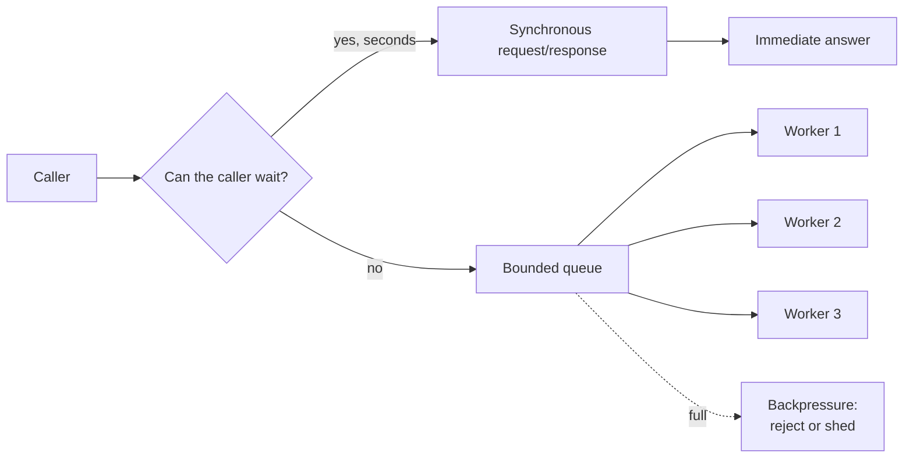
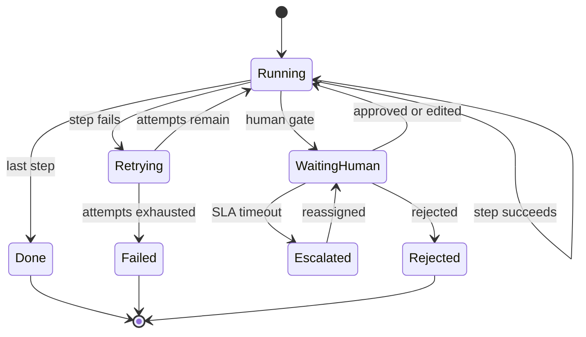

# Event-Driven and Workflow Architecture

> **Interview answer (say this first).** Synchronous request/response is for work the caller must wait for and that finishes in seconds. Everything else should be asynchronous. A queue gives you buffering and competing workers; a topic gives you fan-out to independent subscribers. When the work is long, multi-step, or must survive restarts, use a durable workflow engine: it stores each step's result, retries failed steps with a policy, runs timers, and can pause for days waiting on a human. The two rules that make this safe are **backpressure** — a bounded queue and explicit rejection or shedding — and **idempotency** — a stable idempotency key so a redelivered message or a retried step produces the effect exactly once. Choose sync for a fast answer, plain queues for independent fire-and-forget jobs, and a workflow engine when you need ordered steps, retries, timers, or human waits.

> **Note:**
>
> **Verified.** Every runnable example on this page was executed offline in plain Python (Python 3.14). No broker, model, or network was used. Where a line represents model output, it is labelled **illustrative**.

## Why this exists

Start with what a synchronous call costs you.

An inference endpoint calls a model, then a retrieval service, then a database, then a tool. The caller waits for all of them:

```text
caller -> retrieve -> model -> tool
        (all must be up now; caller blocked for the whole chain)
```

Every added step adds latency and a new way to fail in the caller's face. If the model takes 45 seconds, the HTTP connection may time out even though the work will finish. If an approval is needed, the request cannot be held open for hours.

Asynchronous work flips the direction:

```text
caller -> [ enqueue job ] -> returns immediately
                    |
                    v
            worker pool -> model -> tool -> (state persisted)
```

The caller gets an acknowledgement. The work proceeds at its own pace, retries on failure, and survives a restart. The costs are real: eventual completion instead of an immediate answer, duplicate delivery you must deduplicate, and a system you must observe because no stack trace ties the steps together.

Some work is not a single job at all. It is a sequence with decisions, retries, timers, and a person in the middle:

```text
ingest document -> extract -> (human review) -> publish -> notify -> wait 7 days -> archive
```

That sequence needs a **durable workflow**: each step's result is stored, the run can resume after a crash, and a timer can park it for a week. A plain queue holds a message; a workflow engine holds a process.

> **Note:**
>
> **The one-sentence purpose.** Move work that the caller should not wait for onto a durable, retryable, observable path — and make every effect idempotent so redelivery cannot double it.

## Start from zero

| Word | Plain meaning |
| --- | --- |
| **Synchronous** | The caller waits for the answer before continuing. |
| **Asynchronous** | The caller gets an acknowledgement and the work finishes later. |
| **Event** | A past-tense fact: `DocumentIngested`, `RunFinished`. |
| **Command** | A request to do something: `SummariseDocument`. Can be rejected. |
| **Message** | Any payload through a broker; an event or a command. |
| **Producer** | The component that emits messages. |
| **Consumer / worker** | The component that processes messages. |
| **Queue** | A channel where each message goes to one consumer. Buffers load. |
| **Topic** | A channel that fans out: each subscriber gets a copy. |
| **Fan-out** | Delivering one message to many independent subscribers. |
| **Competing consumers** | Several workers on one queue, splitting the messages. |
| **Dead-letter queue (DLQ)** | Where a message goes after too many failed attempts. |
| **Backpressure** | Slowing or rejecting input when the system is at capacity. |
| **Bounded queue** | A queue with a fixed maximum size, so memory cannot grow forever. |
| **Shedding** | Deliberately dropping low-value work when overloaded. |
| **Workflow** | A multi-step process with state, order, and rules. |
| **Durable workflow** | A workflow whose state survives crashes and can resume. |
| **Step / activity** | One unit of work inside a workflow. |
| **Retry policy** | How many times and how fast a failed step is tried again. |
| **Backoff** | Waiting longer between retries, usually doubling. |
| **Jitter** | A small random offset added to backoff so retries do not sync up. |
| **Timer** | A durable wait: "continue in seven days", stored, not a sleeping thread. |
| **Human wait** | A step that pauses until a person approves, rejects, or edits. |
| **Idempotency** | Doing the same operation twice has the same effect as doing it once. |
| **Idempotency key** | A stable id from the request used to deduplicate repeated attempts. |
| **Exactly-once effect** | The user-visible result happens once, even with retries. |
| **At-least-once delivery** | The broker may deliver a message more than once. |
| **Compensation** | An action that undoes a prior step when a later step fails. |
| **Saga** | A long transaction split into steps, each with a compensating action. |
| **Transactional outbox** | Write the business change and the outgoing event in one database transaction; a relay publishes the event later, so a crash cannot lose or duplicate it. |
| **Correlation ID** | An id that ties all messages and logs of one run together. |

Two distinctions prevent most confusion:

- **A queue is not a topic.** A queue delivers each message to one worker (competing consumers). A topic delivers a copy to every subscriber (fan-out). Many brokers support both; be explicit about which you need.
- **A job is not a workflow.** A job is one unit of work with a retry policy. A workflow is an ordered set of steps with state, timers, and decisions. If you are chaining jobs in a database column and re-enqueuing, you are building a workflow engine the hard way.

## The core idea

Think about a restaurant.

A **synchronous call** is ordering at the counter and standing there until the food is ready. Simple, but you block the queue and you cannot leave.

A **queue** is a ticket rail. The cashier clips an order to the rail and serves the next customer. Cooks pull tickets as they are free. If the kitchen is busy, tickets wait on the rail instead of customers waiting at the counter. The rail has a maximum length: when it is full, the cashier must slow down or turn orders away. That is backpressure.

A **durable workflow** is a catering order with a schedule. It has stages, it remembers that the starter is done, it waits for the client to confirm the menu, it sets a reminder for next week, and if the kitchen closes it resumes tomorrow from the last completed stage.



The three transports differ in who waits and what is remembered:

| Transport | Caller waits? | Survives restart? | Retries | Timers / human waits | Best for |
| --- | --- | --- | --- | --- | --- |
| Sync request/response | Yes | No | Caller retries | No | Fast answers, interactive UI |
| Queue + worker | No | Partly (message persisted) | Broker + worker | No | Independent background jobs |
| Durable workflow | No | Yes, per step | Per step, with policy | Yes | Long, ordered, multi-step work |

A durable workflow is a state machine, and drawing it makes the failure paths obvious:



Every arrow that is not "step succeeds" is a failure path you must design, not discover in production.

## How it works

1. **Decide if the caller can wait.** If the work finishes in a few seconds and the answer is needed now, use a synchronous call with a timeout. Otherwise go asynchronous.
2. **Wrap the request in a message envelope.** A stable `message_id`, a type, a version, a timestamp, a correlation id, and the payload. This envelope is what makes retries and tracing possible.
3. **Publish to a queue or topic.** A queue for work that one worker should handle; a topic when several independent consumers need the fact.
4. **Persist before acknowledging.** The broker must durably store the message before the caller is told it was accepted, or a crash loses the work.
5. **Consume with competing workers.** Several workers pull from one queue to scale. Each message goes to one worker, so the work is spread.
6. **Apply backpressure at the edge.** A bounded queue has a maximum size. When it is full, reject with a clear "try later" or shed low-priority work. Never let an unbounded queue absorb the load until memory dies.
7. **Make the effect idempotent.** Compute a stable idempotency key from tenant, operation, and natural key. Write the effect and the key in the same transaction, or check-then-write in a durable store. A redelivery then changes nothing.
8. **Retry with bounded backoff and jitter.** Retry a transient failure a few times, waiting longer each time. Cap the delay. Add jitter so many workers do not retry in lockstep.
9. **Route poison messages to a DLQ.** After the attempts are exhausted, send the message aside with its error. One bad message must not block the queue forever.
10. **For multi-step work, persist each step.** A durable workflow stores the output of every completed step and the index of the next step. A crash resumes at the next step instead of restarting the run.
11. **Park timers and human waits in state.** A wait of seven days is a stored wake-up time, not a sleeping thread. A human wait persists the run and releases the worker.
12. **Compensate on failure where there is no rollback.** If step three cannot be undone, define a compensating action for the earlier steps and run them in reverse. This is a saga.
13. **Correlate everything.** One correlation id flows through the original request, every message, every retry, and every log line. Without it, asynchronous debugging is guesswork.
14. **Observe queue depth, age, and DLQ size.** Throughput alone hides trouble. Track how long the oldest message has waited and how many messages are sitting in the DLQ.

## The syntax you will use

**A message envelope.** Standardise this shape so retries and tracing work everywhere.

```json
{
  "message_id": "5c1a9e",
  "type": "document.ingested",
  "version": 2,
  "occurred_at": "2026-09-14T09:00:00Z",
  "correlation_id": "req-88",
  "tenant_id": "acme",
  "payload": {"document_id": "doc-12", "source": "upload"}
}
```

`message_id` supports deduplication, `correlation_id` supports tracing, and `version` supports evolution.

**A stable idempotency key.** Derive it from the inputs, not from a random value or the current time.

```python
import hashlib, json

def idempotency_key(tenant: str, operation: str, natural_key: str) -> str:
    raw = json.dumps({"tenant": tenant, "op": operation, "key": natural_key},
                     sort_keys=True, separators=(",", ":"))
    return hashlib.sha256(raw.encode()).hexdigest()
```

Same inputs always produce the same key, and a different tenant gets a different key.

**Deduplicate the effect.** Check the key before doing the work.

```python
class IdempotentExecutor:
    def __init__(self):
        self._done = {}

    def run(self, key, effect):
        if key in self._done:
            return self._done[key], "duplicate_ignored"
        result = effect()
        self._done[key] = result          # in production: same transaction as the effect
        return result, "executed"
```

The in-memory dict stands in for a durable store; the shape is the same.

**Bounded retry with backoff.** Cap both the attempts and the delay, and return the delays so the run is observable.

```python
def retry(fn, attempts=4, base=0.5, cap=8.0, sleep=lambda s: None):
    delays = []
    for attempt in range(attempts):
        try:
            return fn(attempt), "ok", delays
        except Exception:
            if attempt == attempts - 1:
                return None, "exhausted", delays
            delay = min(cap, base * (2 ** attempt))    # with attempts=4: 0.5, 1, 2
            delays.append(delay)
            sleep(delay)
    return None, "exhausted", delays
```

Add jitter (`delay * random.uniform(0.8, 1.2)`) so a fleet of workers does not retry together.

**A durable workflow step machine.** Store the step index and outputs so a resume continues instead of restarting.

```python
from dataclasses import dataclass, field

@dataclass
class WorkflowState:
    workflow_id: str
    step_index: int = 0
    attempts: int = 0
    retries: int = 0
    status: str = "running"
    outputs: dict = field(default_factory=dict)
    waiting_on: str | None = None

def advance(state, steps, decisions=None):
    decisions = decisions or {}
    while state.step_index < len(steps):
        step = steps[state.step_index]
        if step["kind"] == "human":
            name = step["name"]
            if name not in decisions:             # no decision yet: park, release the worker
                state.status, state.waiting_on = "waiting_human", name
                return state
            state.outputs[name] = decisions[name]  # record the human decision
            state.waiting_on = None
            state.status = "running"
            state.attempts = 0
            state.step_index += 1
            continue
        try:
            result = step["run"]()
        except Exception:
            state.attempts += 1
            state.retries += 1
            if state.attempts >= step["max_attempts"]:
                state.status = "failed"           # poison: send to DLQ or alert
                return state
            continue                              # retry the same step
        state.outputs[step["name"]] = result
        state.attempts = 0
        state.step_index += 1
    state.status = "done"
    return state
```

**Backpressure at the queue edge.** Reject when full rather than growing without bound.

```python
def offer(queue, item, capacity):
    if len(queue) >= capacity:
        return "rejected"        # caller retries later, or the work is shed
    queue.append(item)
    return "accepted"
```

**Choose the transport from the requirement.**

```python
def choose_transport(req: dict) -> str:
    if req["duration_s"] < 5 and req["caller_waits"]:
        return "sync request/response"
    if req["has_human_wait"] or req["needs_timers"] or req["duration_s"] >= 300:
        return "durable workflow"
    return "queue + worker"
```

## Examples: simple to real

**Example 1 — a stable idempotency key.**

The same inputs give the same key; a different tenant gives a different key. Verified:

```text
stable:        True
tenant_scoped: True
key:           1fb2b582776505be...
```

This is the foundation of exactly-once effects. A random key would let a retry through as a new operation.

**Example 2 — exactly-once effects on top of at-least-once delivery.**

The effect runs once, and the redelivery is ignored. Verified:

```text
('charged 1', 'executed') ('charged 1', 'duplicate_ignored')
effects executed: 1
```

The counter proves the charge happened once. In production the dedup record and the effect are written in one transaction.

**Example 3 — retry with backoff.**

A function that fails twice and succeeds on the third attempt. Verified:

```text
result: ok-on-3 | status: ok | delays: [0.5, 1.0]
```

The delays double and the call eventually succeeds. Without the cap, a struggling dependency would see ever-longer waits.

**Example 4 — a durable workflow with a retry and a human wait.**

The first step fails once, retries quietly, then the run parks at the approval gate. Verified:

```text
waiting_human approve_refund retries: 1
outputs: {'create_invoice': 'invoice-77'}
```

When the reviewer records a decision, the same `advance` call runs again with a `decisions` map; the run resumes from the checkpoint and finishes:

```text
done {'create_invoice': 'invoice-77',
      'approve_refund': 'approved',
      'notify_customer': 'emailed'}
```

The failed first attempt never restarted the workflow, because the completed step was already stored. Without the decision channel the parked run could never pass the human gate, so the `done` state would be unreachable.

**Example 5 — backpressure with a bounded queue.**

Five jobs arrive, the queue holds three, two are rejected. Verified:

```text
['accepted', 'accepted', 'accepted', 'rejected', 'rejected']
queue: ['job-0', 'job-1', 'job-2']
```

Rejection is a feature: it protects the workers and tells the caller to retry. An unbounded queue would accept all five and eventually fall over.

**Example 6 — sync, queue, or workflow.**

Four requirements, three transports. Verified:

```text
['sync request/response', 'queue + worker', 'durable workflow', 'durable workflow']
```

A one-second lookup the caller waits for stays synchronous. A 30-second background job is a queue. A human wait or a day-long timer is a workflow.

## In production

- **Every async effect needs an idempotency key.** Redelivery is normal, not exceptional. Compute the key from stable inputs and persist it with the effect, ideally in one transaction.
- **Bound every queue.** An unbounded queue is a memory leak with extra steps and a long delay before the crash. Set a maximum, and decide what happens when it is full.
- **Choose rejection or shedding deliberately.** Rejection with a retry hint keeps all work but slows callers. Shedding drops low-value work to protect high-value work. Both are valid; picking neither is not.
- **Retry only transient failures, and add jitter.** A validation error or a malformed payload will never succeed, so classify errors and send permanent failures straight to the DLQ. For transient failures, jitter the backoff, because without it a fleet that failed together retries together and hammers the recovering dependency in waves.
- **A timer is state, not a thread.** Persist the wake-up time. Sleeping workers pin memory and die on deploy.
- **Human waits must persist the run.** A held HTTP connection cannot wait hours. Store the pending decision, notify the reviewer, and resume from the checkpoint.
- **Design compensation for irreversible steps.** Sending an email cannot be rolled back. Record the send and define a compensating follow-up, or gate the send behind approval.
- **A poison message needs a DLQ.** One unprocessable message will block an ordered partition forever. After bounded attempts, park it with the error and alert.
- **Ordering is per key, not global.** If two steps must stay ordered, key them by run id so they land on the same partition. Do not assume global order.
- **Track queue age, not just depth.** Ten messages that have waited an hour are worse than a thousand that arrived a second ago. Alert on the age of the oldest message.
- **Correlate the whole run.** One correlation id across the request, messages, retries, and logs. Asynchronous systems are undebuggable without it.
- **Do not use a workflow engine for a single fast call.** The engine adds state, latency, and operational surface. A synchronous call with a timeout is simpler and more debuggable.

## Interview questions

### 1. When do you use synchronous request/response versus asynchronous work?

**Answer.** Use synchronous when the caller genuinely needs the answer now and the work finishes in seconds. Use asynchronous when the work is slow, when more than one consumer cares about the result, when the work must survive a restart, or when the caller can proceed without waiting. The decision hinges on whether the caller can continue without the result and whether the work outlives a single request.

**Follow-up: "What is the cost of going asynchronous?"** Eventual completion, duplicate delivery you must deduplicate, harder debugging, and more infrastructure to operate. You trade a call you can reason about for a flow you must observe.

**Trap.** Going asynchronous for a fast operation that the user is watching. You add latency and complexity and still have to poll for the answer.

### 2. Queue versus topic — what is the difference?

**Answer.** A queue delivers each message to exactly one worker, so workers compete and the work is split. A topic delivers a copy to every subscriber, so independent services each see everything. Use a queue to scale processing of one kind of work; use a topic when several independent consumers need the same fact.

**Follow-up: "How do you get both?"** Fan out a topic to several queues, each with its own workers. The topic provides breadth of subscribers; each queue provides scale within a subscriber.

**Trap.** Assuming a single consumer group receives every message. Within one queue or group each message goes to one member; separate subscriptions are what give fan-out.

### 3. What makes a workflow durable?

**Answer.** Durability comes from persisting state after every step. The engine stores the output of each completed step and the index of the next one, so a crash resumes at the next step rather than restarting. Timers and human waits are stored as wake-up conditions, not as sleeping threads, so a run can pause for days and survive a deploy.

**Follow-up: "What is the difference between a durable workflow and a queue with retries?"** A queue retries one message. A workflow tracks an ordered sequence, passes data between steps, and enforces the order, the timers, and the failure handling across the whole process.

**Trap.** Implementing durability with a database column and requeue logic. That is a hand-rolled workflow engine, and it will grow the missing features one incident at a time.

### 4. How do you achieve exactly-once effects?

**Answer.** You do not get exactly-once delivery; brokers are at least once. You get exactly-once **effects** with idempotency. Derive a stable idempotency key from the request, record it durably, and make the write check-and-apply atomic. A redelivered message finds the key and does nothing. Where two systems must both change, use a transactional outbox (write your change and the outgoing event in one local transaction, then relay the event) or a saga rather than trusting a consumer flag.

**Follow-up: "Where do you store the key?"** In the same durable store as the effect, in the same transaction where possible. A cache key works for a bounded window but is not a durable guarantee.

**Trap.** Believing a broker setting or a single "processed" flag gives exactly-once across your database. Atomicity across systems needs the outbox or a saga.

### 5. What is backpressure and why does it matter for AI systems?

**Answer.** Backpressure is the system telling upstream to slow down or stop when it is at capacity. In AI systems inference is expensive and slow, so a burst of requests can exhaust GPUs, memory, or token budget. A bounded queue plus explicit rejection or shedding keeps latency predictable and prevents a collapse. Without it, an unbounded queue delays the failure and then makes it much worse.

**Follow-up: "Reject or shed?"** Reject when all work matters and callers can retry. Shed when some work is low priority and protecting the high-value path matters more. Label the work so the choice is policy, not guesswork.

**Trap.** Setting a queue timeout and calling it backpressure. A timeout drops work after the fact; backpressure applies the limit before the work enters.

### 6. How do you handle a poison message?

**Answer.** Bound the attempts, then move the message to a dead-letter queue with the error and the payload. Alert on DLQ size. A poison message is one that can never succeed — a malformed payload, a validation failure — so retrying forever only blocks the queue. Distinguish permanent failures from transient ones and route the permanent ones immediately.

**Follow-up: "How do you recover a DLQ message?"** Fix the cause, then replay the DLQ with the same idempotency keys, so re-processing is safe. Replay in a controlled job, not by pointing the consumer back at the DLQ live.

**Trap.** Retrying everything with the same policy. Permanent failures waste attempts and delay real work while the queue backs up.

### 7. When do you need a workflow engine instead of plain queues?

**Answer.** When the work is an ordered sequence with state passed between steps, retries with a policy, timers, or human waits. If you find yourself storing a step index in a database and re-enqueuing to the next queue, or scheduling a "wake up in seven days" job by hand, you need a workflow engine. For independent fire-and-forget jobs, plain queues are simpler and cheaper.

**Follow-up: "What does the engine give you for free?"** Durable per-step state, deterministic replay, retry policies, timers, and a visible run history. You still own idempotency, because the engine retries steps.

**Trap.** Adopting a workflow engine for one fast call. You pay the state and operational cost for no benefit.

### 8. How do you observe and debug an asynchronous AI pipeline?

**Answer.** Attach one correlation id to the original request and propagate it through every message, retry, and log line. Emit structured events for each step with the run id, step name, status, latency, and cost. Track queue depth, the age of the oldest message, retry counts, and DLQ size. Then you can reconstruct the timeline of any run and see where it stalled or looped.

**Follow-up: "What is the hardest failure to see?"** A step that silently does nothing, or a duplicate that is ignored — both look like success. Counter the effects and alert when the expected count does not arrive.

**Trap.** Logging only at the edges of the pipeline. By the time you notice the outer failure, the inner state is gone.

## Remember this

- **Sync for seconds, queue for independent jobs, a workflow engine for ordered steps with timers or human waits.**
- **Bound every queue, and decide rejection versus shedding before the incident.**
- **At-least-once delivery is the reality; exactly-once effects come from stable idempotency keys.**
- **A durable workflow persists after every step, so a crash resumes instead of restarting.**
- **One correlation id through request, messages, retries, and logs — or you cannot debug an async run.**
