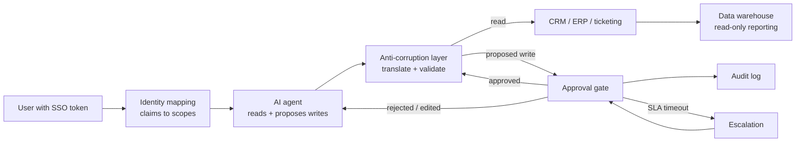
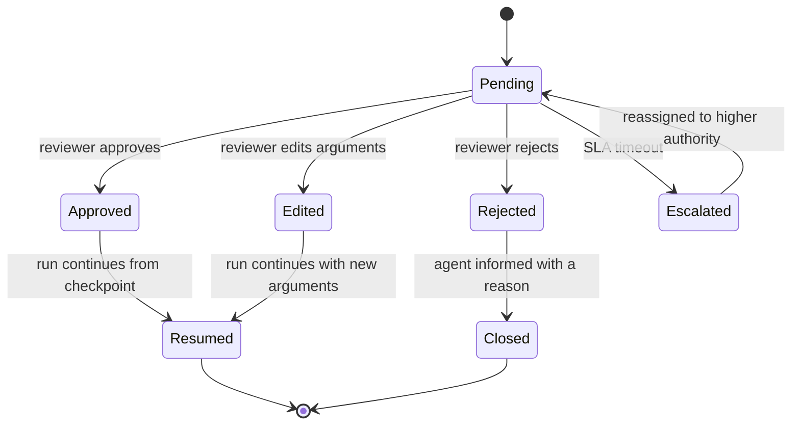

# Enterprise Integration and Human-in-the-Loop

> **Interview answer (say this first).** An AI system rarely owns the truth. It reads and writes systems that already exist — CRM, ticketing, ERP, identity, the data warehouse — so the architecture question is how to talk to them without breaking them. Prefer a documented API for reads and writes, events when other systems need to react, and file drops only when that is genuinely the only interface. Map the enterprise identity to your permissions at the boundary using SSO claims; never invent your own user store if SSO already exists. For consequential actions, put a human in the loop: the agent pauses, persists state, a reviewer approves, rejects, or edits in a review UI, and the run resumes from its checkpoint. Escalate on an SLA timeout, and write an audit record for every decision. Guard the write-back with an anti-corruption layer that translates the vendor's model into yours, an allowlist of writable fields, and a stable idempotency key so a retry cannot double-apply.

> **Note:**
>
> **Verified.** Every runnable example on this page was executed offline in plain Python (Python 3.14). No CRM, identity provider, or network was contacted. Where a line represents model output, it is labelled **illustrative**.

## Why this exists

The demo has its own database and its own users. The enterprise has neither.

When the AI system reaches production it meets systems that were there first and will outlive it:

- **The CRM** holds the customer and forbids deleting records; a bad write can corrupt the account history.
- **The ticketing system** is where work is tracked; an agent that creates duplicates floods the support queue.
- **The ERP** owns orders, invoices, and inventory; a wrong write moves real money and real stock.
- **Identity** is owned by SSO; users expect one login, and access is governed by groups, not by your app.
- **The data warehouse** is the reporting source of truth; it is read-mostly and refreshed on a schedule.

Each has a different interface — a REST API, a webhook, a nightly file drop, a database view — and a different contract. The integration layer is where AI systems most often fail, not because the model is wrong, but because a well-formed action hit a system that did not expect it.

Human-in-the-loop (HITL) exists for the same reason. Model judgment is probabilistic, and some actions cannot be undone: sending an email, issuing a refund, deleting a record, posting to the ledger. A person supplies the final, accountable decision at exactly those points.

> **Note:**
>
> **The one-sentence purpose.** Read and write the enterprise through a translating boundary, use the enterprise's identity, and pause for a person before any action that cannot be cleanly undone.

## Start from zero

| Word | Plain meaning |
| --- | --- |
| **System of record** | The authoritative owner of a piece of data: CRM, ERP, ticketing. |
| **System of engagement** | A system where people work with the data: support console, chat. |
| **Integration** | Connecting your system to an existing one to exchange data. |
| **API** | A documented request/response interface, usually REST or gRPC. |
| **Webhook** | The system calls your URL when something happens. |
| **Event** | A past-tense fact published by a source system. |
| **File drop** | A scheduled file exchange over SFTP or object storage. |
| **ETL / ELT** | Moving and reshaping data between systems, usually for analytics. |
| **Anti-corruption layer (ACL)** | A translation layer that keeps a vendor's model from leaking into yours. |
| **Canonical model** | Your internal, stable representation of a business object. |
| **Identity provider (IdP)** | The system that authenticates users: Okta, Entra ID, Google. |
| **SSO** | Single sign-on: one login shared across systems. |
| **SAML / OIDC** | The two common SSO protocols; OIDC issues JWTs with claims. |
| **Claim** | An assertion about a user in a token: email, groups, roles. |
| **Permission mapping** | Turning IdP groups or roles into your app's permissions. |
| **Scope** | A named permission, such as `ticket:write` or `refund:approve`. |
| **Least privilege** | Granting the smallest permission that still does the job. |
| **Human-in-the-loop (HITL)** | A person participates at defined points, usually approving an action. |
| **Approval queue** | The list of pending decisions waiting for a reviewer. |
| **Review UI** | The screen where a person sees the proposed action and decides. |
| **Interrupt** | A planned pause that saves state and returns control to the caller. |
| **Resume** | Continuing the run from its checkpoint after a decision. |
| **Escalation** | Sending a pending decision to a higher authority, often on timeout. |
| **SLA timer** | A deadline by which a decision should be made. |
| **Audit trail** | A durable record of who decided what, when, and with which arguments. |
| **Blast radius** | How much a wrong action can affect: one record or the whole database. |
| **Idempotency key** | A stable id that lets a retried write be recognised and ignored. |
| **Optimistic concurrency** | Writing with an expected version so a stale write is rejected. |
| **Reconciliation** | Comparing two systems and resolving the differences. |
| **Outbox pattern** | Write your change and the outgoing message in one local transaction; a relay publishes it, so a crash cannot lose or double the effect. |
| **Circuit breaker** | Stop calling a failing dependency for a cooling-off period, so retries cannot pile up into a storm. |

Three distinctions shape the whole design:

- **API vs event vs file drop.** An API is for a request you need answered now. An event is for telling others a fact happened. A file drop is for bulk, scheduled, or legacy exchange. Use the interface the other system actually supports, and pick the one with the strongest contract for the data's value.
- **Read vs write risk.** Reads are cheap and reversible; writes are expensive and sometimes irreversible. Design them with different care, different permissions, and different approval rules.
- **Identity vs authorization.** SSO tells you **who** the user is. Your app still decides **what** they may do. Never treat "authenticated by SSO" as "allowed to act".

## The core idea

Think of an embassy in a foreign country.

Your AI system is the embassy. The enterprise systems are the host country. You do not rewrite the host country's laws to match yours; you run an embassy that speaks both languages. The **anti-corruption layer** is the translation desk: it takes the host's forms, translates them into your internal paperwork, and rejects anything malformed. Your internal model stays clean even as the host's model changes.

The **identity desk** checks the visitor's passport (the SSO token) and issues an internal badge with only the rooms that visitor may enter (scopes). The passport proves who they are; the badge decides where they go.

The **approval desk** is where a visa application waits. A consular officer reviews the case, approves, rejects, or asks for changes. If no one acts before the deadline, it escalates to a supervisor. Every decision is stamped in a log.



The approval gate is a state machine, and drawing it makes the timeout and escalation paths explicit:



Choosing how to integrate is a small decision table:

| Interface | Direction | Latency | Coupling | Best for |
| --- | --- | --- | --- | --- |
| REST API | Request/response | Milliseconds to seconds | Runtime dependency | Reads, single-record writes |
| Event / webhook | Push | Seconds, eventual | Schema dependency | Reacting to changes, fan-out |
| File drop | Batch | Minutes to hours | Schedule dependency | Bulk sync, legacy systems |
| Data warehouse | Read-only | Hours | Schema dependency | Reporting, analytics, features |

## How it works

1. **Inventory the systems and their interfaces.** For each, record what it owns, whether it exposes an API, event, or file, and whether writes are allowed.
2. **Define a canonical internal model.** Your business objects — a ticket, a customer, an order — get one stable shape inside your system. Vendors change; your model does not.
3. **Build the anti-corruption layer.** One module per external system translates to and from the canonical model, validates required fields, and rejects unknown shapes with a clear error.
4. **Use SSO for identity.** Accept the IdP token (OIDC JWT or SAML assertion), verify its signature, and read the claims. Do not build a second user store.
5. **Map claims to scopes.** A pure function turns IdP groups or roles into your app's scopes. Unknown roles map to no scope; the default is deny.
6. **Enforce scopes at the action boundary.** The agent's tools check the scope, not just the chat. The model never holds more permission than the human who started the run.
7. **Read through the ACL.** Cache where safe, and record the source version so you can detect drift later.
8. **Propose writes; do not apply them directly.** The agent produces a proposed change with its arguments and its idempotency key.
9. **Gate irreversible or high-blast-radius writes.** Route them to an approval queue, persist the run, and release the worker. Low-risk, reversible writes may proceed, per policy.
10. **Show the reviewer enough to decide.** Display the action, the exact arguments, the evidence the agent used, and the expected effect. A yes/no with no context is not a review.
11. **Escalate on the SLA timer.** If no decision arrives, escalate to a higher authority and record it. Never leave a pending decision waiting forever.
12. **Write back with an idempotency key and a version check.** Apply the change once, reject stale writes, and record the external id so a later retry finds the same record.
13. **Audit every decision and every write.** Who decided, when, against which arguments, and what the external system returned.
14. **Reconcile on a schedule.** Compare your records with the system of record and report drift. Integration always degrades; reconciliation catches it.

## The syntax you will use

**Map SSO claims to scopes.** Authorization is your decision, not the IdP's.

```python
ROLE_TO_SCOPES = {
    "support_agent": {"ticket:read", "ticket:write", "crm:read"},
    "support_lead": {"ticket:read", "ticket:write", "crm:read", "refund:approve"},
    "auditor": {"ticket:read", "invoice:read", "audit:read"},
}

def resolve_scopes(claim_roles):
    scopes = set()
    for role in claim_roles:
        scopes |= ROLE_TO_SCOPES.get(role, set())   # unknown role grants nothing
    return scopes
```

**An anti-corruption layer.** Translate the vendor's model into your canonical one and validate at the boundary.

```python
from dataclasses import dataclass

@dataclass
class InternalTicket:
    id: str
    subject: str
    priority: int
    customer_id: str

PRIORITY = {"low": 3, "normal": 2, "high": 1, "urgent": 0}

def from_crm(payload: dict) -> InternalTicket:
    return InternalTicket(
        id=f"ticket-{payload['id']}",
        subject=payload["subject"].strip(),
        priority=PRIORITY[payload["priority"].lower()],   # validate, do not guess
        customer_id=payload["account"]["id"],
    )
```

**Idempotent write-back with optimistic concurrency.**

```python
class SystemOfRecord:
    def __init__(self):
        self.records = {}
        self.applied_keys = set()

    def upsert(self, record_id, patch, idempotency_key, expected_version=None):
        if idempotency_key in self.applied_keys:
            return "duplicate_ignored"                 # a retry cannot double-apply
        current = self.records.get(record_id, {})
        if expected_version is not None and current.get("version", 0) != expected_version:
            return "conflict"                          # someone changed it first
        self.records[record_id] = {**current, **patch,
                                   "version": current.get("version", 0) + 1}
        self.applied_keys.add(idempotency_key)
        return "applied"
```

**The approval decision function with escalation.** One function decides wait, resume, or escalate, and it audits.

```python
def next_decision(pending, now, sla_s, state):
    if pending["decision"] is not None:
        if not pending.get("resume_audited"):     # audit the human decision exactly once
            state["audit"].append({"id": pending["id"], "actor": pending["decided_by"],
                                   "decision": pending["decision"], "at": now})
            pending["resume_audited"] = True
        return "resume"
    if now - pending["created_at"] >= sla_s:
        if not pending.get("escalated"):          # escalate and audit exactly once
            pending["escalated"] = True
            state["queue"].append(pending["id"])
            state["audit"].append({"id": pending["id"], "actor": "system",
                                   "decision": "escalated", "at": now})
        return "escalate"
    return "wait"
```

**An allowlist for writable fields.** The agent may only change fields you have explicitly approved.

```python
WRITABLE_FIELDS = {"status", "priority", "assignee", "resolution"}

def safe_write_back(patch: dict, writable=WRITABLE_FIELDS):
    rejected = sorted(set(patch) - writable)
    accepted = {k: patch[k] for k in patch if k in writable}
    return accepted, rejected
```

**Reconcile two systems on a schedule.**

```python
def reconcile(local_ids: set, remote_ids: set) -> dict:
    return {
        "to_create": sorted(remote_ids - local_ids),
        "to_update": sorted(local_ids & remote_ids),
        "to_review_local_only": sorted(local_ids - remote_ids),   # policy decides: delete, archive, or keep
    }
```

## Examples: simple to real

**Example 1 — mapping an SSO role to application scopes.**

An agent acting for a support agent gets read and write on tickets; a lead additionally gets refund approval; an unknown role gets nothing. Verified:

```text
agent:   ['crm:read', 'ticket:read', 'ticket:write']
lead:    ['crm:read', 'refund:approve', 'ticket:read', 'ticket:write']
unknown: []
```

The empty list for an unknown role is the important line. Authentication succeeded, but authorization defaults to deny.

**Example 2 — an anti-corruption layer that normalises a vendor payload.**

Verified:

```text
InternalTicket(id='ticket-991', subject='Cannot log in',
               priority=1, customer_id='cust-7')
```

The vendor sent `"  Cannot log in  "`, an integer id, and a nested account object. Your canonical model gets a trimmed subject, an internal id, a numeric priority, and a flat customer id. The vendor's shape never leaks inward.

**Example 3 — idempotent write-back with a version check.**

The first write applies, the retry is ignored, and a stale write is rejected. Verified:

```text
first:  applied
retry:  duplicate_ignored
stale:  conflict
record: {'status': 'resolved', 'version': 1}
```

The retry used the same idempotency key, so the effect happened once. The stale write carried an outdated version, so it was refused instead of overwriting a newer change.

**Example 4 — an approval that waits, escalates, and audits.**

Verified:

```text
wait:           wait
escalate:       escalate
escalate again: escalate
audit rows:     1
queue entries:  1
resume:         resume
```

At time 130 the SLA of 60 seconds was not yet reached, so the decision waited. At time 200 it was overdue, so it escalated and was audited. Polling again after the SLA still returns `escalate`, but adds no second escalation and no second audit row, because `pending["escalated"]` is already set. A recorded decision then resumes the run, and it too is audited once.

**Example 5 — a field allowlist stops a dangerous write.**

The agent tried to change `salary` on a ticket. Verified:

```text
accepted: {'status': 'resolved', 'resolution': 'fixed'}
rejected: ['salary']
```

The allowlist is the last line of defence. Even a well-formed model proposal cannot touch a field outside the contract.

**Example 6 — reconciling your records with the system of record.**

Verified:

```text
{'to_create': ['d'],
 'to_update': ['b', 'c'],
 'to_review_local_only': ['a']}
```

Three actions fall out of one comparison: create what the enterprise has and you do not, update what both have, and review what only you have. The local-only key is deliberately action-neutral — policy decides whether those records are deleted, archived, or kept — because a name like `to_delete` invites data loss. Reconciliation turns silent drift into a work list.

## In production

- **Integrate through a translating boundary.** Every external system gets one module that owns its translation and validation. Vendor fields never leak into the core domain.
- **Do not create a second identity store.** Use SSO and map claims to scopes. Unknown roles grant nothing, because authorization defaults to deny.
- **Check the scope at the tool, not just at login.** A logged-in user is not automatically allowed to take every action the agent can propose.
- **Separate read risk from write risk, and gate the write by blast radius.** Reads are cheap and reversible; writes are not. Require a human decision for irreversible actions such as sends, payments, deletions, and ledger postings, while reversible single-record edits may proceed per policy.
- **Persist the run and show the reviewer enough to decide.** A pending approval must survive a deploy, so store the pending decision and resume from the checkpoint. Display the action, the exact arguments, the evidence the agent used, and the expected effect — a yes/no with no context is not a review.
- **Escalate on an SLA, with a safe default.** Define the timeout and the escalation path. On timeout without an answer, the safe default is usually reject or hold.
- **Make every write idempotent.** Use a stable key derived from tenant, operation, and natural key, and record the external id so a retry targets the same record.
- **Use optimistic concurrency.** Send the version you read. Reject stale writes rather than overwriting a change made by a person in the console.
- **Allowlist writable fields.** A model can produce a valid JSON body for a field it should never touch. The allowlist is enforced in code.
- **Audit decisions and writes durably.** Who, what, when, which arguments, and the external response. This is both a compliance requirement and your best debugging tool.
- **Plan for API limits and outages.** Enterprise APIs rate-limit and have maintenance windows. Queue writes, retry with backoff, and surface a clear "system unavailable" state.
- **Reconcile on a schedule.** Compare your records with the system of record and report drift. Do not assume a successful API call means the two systems agree.

## Interview questions

### 1. APIs versus events versus file drops — how do you choose?

**Answer.** An API is for a request you need answered now, usually a read or a single-record write. An event is for telling other systems a fact happened, so they can react independently. A file drop is for bulk, scheduled, or legacy exchange where no better interface exists. Choose the interface the other system actually supports, and prefer the one with the strongest contract and best observability for the value of the data.

**Follow-up: "When is a file drop still the right answer?"** For large nightly extracts, for systems with no API, and when the business already runs on the file's schedule. It is a batch contract, so latency and error handling are measured in runs, not requests.

**Trap.** Using polling against an API when the source already publishes events. You add load, delay, and missed-change bugs.

### 2. How do you integrate identity and permissions?

**Answer.** Authenticate with the enterprise IdP over SSO and verify the token. Read the user's claims and map groups or roles to your application's scopes with a pure function. Enforce those scopes at the action boundary so the agent cannot exceed the permissions of the person who started the run. Do not build your own user store; it drifts from the enterprise and becomes a security liability.

**Follow-up: "What is the default for an unknown role?"** Deny. Authentication proves identity; it does not grant authorization.

**Trap.** Treating a valid SSO token as full access. The token says who the user is, not what they may do.

### 3. What is an anti-corruption layer and why do you need one?

**Answer.** It is a translation boundary between your domain and an external system. It converts the vendor's payloads into your canonical model, validates them, and converts your writes back into the vendor's shape. It exists so the vendor's model, quirks, and changes do not leak into your core logic. When the vendor renames a field, you change one adapter instead of the whole codebase.

**Follow-up: "Where does validation live?"** At the boundary, on the way in. A malformed vendor payload should fail clearly at the ACL, not surface as a strange error deep in your agent.

**Trap.** Letting vendor field names into your prompts, tools, and database schema. You have coupled your whole system to a contract you do not control.

### 4. When does an agent action require human approval?

**Answer.** When the action is irreversible, expensive, sensitive, or has a large blast radius. Sending an email, issuing a payment, deleting records, and posting to a ledger all qualify. A single reversible field change on one record usually does not. The rule should be explicit and encoded, not left to the model's judgement, because the model cannot be the judge of its own risk.

**Follow-up: "Who decides the threshold?"** The business and risk owners, encoded as policy. The agent proposes; policy routes the proposal to approval or applies it.

**Trap.** Asking the model whether the action is risky. It will often say no, because it cannot see the consequences.

### 5. How does a human-in-the-loop run pause and resume?

**Answer.** The agent reaches a gated step and produces a proposed action with its arguments. The system persists the run state and the pending decision, then releases the worker. A review UI shows the proposal and evidence to a reviewer, who approves, rejects, or edits it. The decision is recorded, and a worker resumes the run from its checkpoint with the decision. Nothing holds an open connection while waiting.

**Follow-up: "What happens if no one responds?"** An SLA timer fires and escalates to a higher authority, or applies a safe default such as hold or reject. Never wait forever.

**Trap.** Holding the request open while polling for a decision. Long waits must be durable state, not a blocked thread.

### 6. How do you write back safely to a system of record?

**Answer.** Propose the change, validate it against an allowlist of writable fields, and apply it with an idempotency key and an expected version. The idempotency key makes a retry safe; the version check rejects a write that would overwrite a newer change made by a person. Record the external id and the response so later runs and reconciliation can find the record.

**Follow-up: "What if the external call succeeds but your system crashes before recording it?"** That is the classic gap. Use the outbox pattern: write the intent and the idempotency key in your database, then have a relay apply it externally and mark it done. The retry carries the same key, so the effect stays single.

**Trap.** Blindly overwriting the external record with the agent's full object. You will erase fields the agent never read and clobber human edits.

### 7. What do you put in the audit record?

**Answer.** The actor (human or system), the action, the exact arguments, the evidence or source, the timestamp, the decision, and the external system's response including its id. For an escalation, record who it escalated to and why. The audit record must be durable and append-only, and it should be queryable by run id and by record id.

**Follow-up: "Why include the arguments and not just the action name?"** Because "refund approved" is useless if the amount or the order was wrong. The arguments are what make the record reviewable and the incident investigable.

**Trap.** Logging only successful writes. Rejections and escalations are exactly the events you need when someone asks why an action did not happen.

### 8. How do you keep an AI integration from flooding an enterprise system?

**Answer.** Queue and rate-limit writes to the enterprise's published limits, retry with bounded backoff, and deduplicate with idempotency keys so retries do not multiply. Batch where the API supports it. Cache reads where staleness is acceptable, and reconcile on a schedule instead of polling constantly. Track your error rate against the external system, because an AI agent can generate far more write volume than a human ever did.

**Follow-up: "What is the failure mode you watch for most?"** A retry storm. A dependency slows, retries multiply, and the enterprise API blocks you. Bounded retries, jitter, and a circuit breaker (stop calling the dependency for a cooling-off period) are the guard.

**Trap.** Letting an agent loop create one external write per turn. Cap the loop and deduplicate by key, or the integration becomes a load test.

## Remember this

- **Use the enterprise's identity via SSO, map claims to scopes, and deny unknown roles.**
- **Translate at the boundary with an anti-corruption layer; never let vendor fields leak inward.**
- **Gate irreversible or high-blast-radius actions behind a persisted human approval, with an SLA and escalation.**
- **Write back with an idempotency key, an expected version, and a field allowlist.**
- **Audit who decided what, with which arguments, and what the external system returned.**
