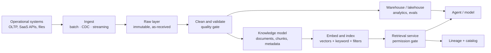

# Data and Knowledge Architecture

> **Interview answer (say this first).** Separate two things people constantly mix: operational data is the record of what happened — orders, tickets, balances — and it lives in relational or transactional systems that are the source of truth. Knowledge data is what the model reads to answer — documents, chunks, embeddings, and their metadata — and it lives in a retrieval layer. In between sits analytical data in a warehouse or lake, used for reporting and evaluation. The architecture is the path from a raw source to retrievable, permissioned knowledge: ingest, land raw, clean and validate, model and split by purpose, build the knowledge layer with access-control metadata and version stamps, index it, and serve it with filters applied *before* the search, not after. The four questions that govern everything are freshness (how stale may an answer be?), ownership (who is accountable for this dataset?), lineage (where did this value come from?), and quality (is it complete, unique, timely, and valid?). And because knowledge is derived from private data, PII handling, retention, and access control are part of the knowledge model, not a later clean-up.

> **Note: Verified.** Every runnable example on this page was executed offline in plain Python (Python 3.14). No model calls were made, and every number shown is computed from the formula on the page rather than quoted from a vendor. The YAML and JSON snippets were parsed with a standard parser.

## Why this exists

Earlier phases taught the pieces of retrieval: parsing, chunking, embeddings, indexing. That is the machinery. The architecture question is different and harder:

- **Which store holds the truth?** If the warehouse, the vector store, and the operational database disagree, which one wins? Without an answer, every bug becomes an argument.
- **Can the model see what the user may not?** A retrieval layer built without permission metadata will happily surface another tenant's document in a similarity search.
- **How fresh is fresh enough?** A nightly job and a streaming pipeline produce very different products, and the choice is a product decision, not an engineering detail.
- **Where did this number come from?** When an answer is wrong or a compliance auditor asks, you need lineage from the answer back to the source row and the version that produced it.
- **How long may we keep this?** Prompts and documents can contain personal data. Retention and deletion are part of the design, and "we forgot" is not a defence.

Here is what that looks like in practice:

- A vector index was rebuilt with a new embedding model, but the query path still used the old one, so every search returned plausible but wrong neighbours.
- A support agent answered with a document from a different customer, because the chunk store had a tenant column that retrieval did not filter on.
- The analytics dashboard and the knowledge base gave different leave balances, because one read the warehouse and the other read a snapshot from three weeks ago.
- A user exercised their right to deletion, but their text lived on in embeddings and logs with no way to find it.
- A table changed a column name upstream and the ingestion job silently loaded nulls for a week.

The lesson: **data architecture is the set of decisions about truth, freshness, ownership, and access.** Get those wrong and no amount of model quality saves you.

> **The one-sentence purpose.** Data architecture decides which store is the source of truth, how fresh knowledge is, who owns it, and who is allowed to retrieve it — before a single query runs.

## Start from zero

Assume you have never designed a data platform. Here are the words this page keeps using.

| Word | Plain meaning |
| --- | --- |
| **Operational data** | The live record of transactions: orders, tickets, balances, sessions. |
| **Analytical data** | Copies shaped for reporting: aggregates, history, wide tables. |
| **Knowledge data** | Text, chunks, and embeddings the model reads to answer questions. |
| **OLTP** | Online transaction processing. A database built for many small reads and writes. |
| **OLAP** | Online analytical processing. A store built for large scans and aggregations. |
| **Source of truth** | The one system whose word wins when two systems disagree. |
| **Data lake** | Cheap storage for raw files of any shape, usually object storage. |
| **Data warehouse** | A structured store for analytics, with schema and SQL. |
| **Lakehouse** | A lake with warehouse-like tables and transactions layered on top. |
| **ETL / ELT** | Extract, transform, load. ETL transforms before loading; ELT loads raw first and transforms after. |
| **CDC** | Change data capture. Streaming each insert, update, and delete from a database. |
| **Batch ingestion** | Loading data on a schedule, like nightly. |
| **Streaming ingestion** | Loading each event as it happens, in seconds. |
| **Object store** | Durable blob storage such as S3, GCS, or Azure Blob. |
| **Relational store** | A SQL database with tables, rows, and constraints. |
| **Vector store** | A store that answers nearest-neighbour queries over embeddings. |
| **Document store** | A store for JSON-like documents, queried by field. |
| **Search index** | An inverted index for keyword search, often paired with vectors. |
| **Chunk** | A short passage of a document, sized to embed and to fit a prompt. |
| **Embedding** | A vector of numbers representing meaning. |
| **Namespace** | A logical partition inside a store, often one per tenant. |
| **Metadata** | Fields attached to a chunk: source, tenant, section, date, ACL. |
| **ACL** | Access control list. The identities allowed to read a resource. |
| **RBAC / ABAC** | Role-based / attribute-based access control. Permission by role, or by attributes. |
| **Row-level security** | A database rule that hides rows the caller may not see, inside the query. |
| **Lineage** | The path a value took from source to output. |
| **Provenance** | Where a piece of knowledge came from and how it was produced. |
| **Catalog** | The inventory of datasets, with owners, schema, and descriptions. |
| **Data contract** | An agreed schema and quality promise between producer and consumer. |
| **Freshness / lag** | How old the newest data is. Lag is the delay between event and availability. |
| **Quality** | Whether data is complete, unique, timely, valid, and consistent. |
| **Retention** | How long data is kept before deletion. |
| **TTL** | Time to live. An automatic expiry after a set period. |
| **PII** | Personally identifiable information: names, emails, identifiers. |
| **Pseudonymisation** | Replacing identifiers with a stable token, reversible with a key. |
| **Tokenisation** | Replacing a value with a token that maps back in a vault. |
| **Tombstone** | A marker that a record was deleted, so the deletion propagates. |
| **Upsert** | Insert or update by key, so re-running an ingestion is safe. |
| **Re-index** | Rebuilding the retrieval index after a model or chunking change. |

Three distinctions matter most:

- **Operational vs analytical vs knowledge.** Operational data runs the business and is the source of truth. Analytical data explains the business and can be rebuilt. Knowledge data feeds the model and is derived. Rebuildable data must never be the source of truth.
- **Store vs index.** The store is durable and authoritative for a record; the index is a fast derived view. You can always rebuild the index; you cannot rebuild the source of truth.
- **Permission as data vs permission as code.** If access rules live only in application code, every new path can forget them. If the rule is an attribute on the record and a filter in the query, it travels with the data.

## The core idea

Think of a **library with a strict front desk**.

The **stacks** hold the knowledge — documents, chunks, and their embeddings. The **catalog** records what exists, where it came from, and who owns it. The **front desk** checks your badge before it sends anyone into the stacks; it never fetches first and checks later. The **acquisitions desk** is the ingestion pipeline: it receives new material, checks it in, and files it. And the **archive** decides what to keep and when to shred. The mental model is an assembly line from raw source to retrievable knowledge, with three gates: a **quality gate**, a **permission gate**, and a **freshness gate**.



The same cleaned data feeds two consumers with different needs. Analytics wants history and aggregation. The knowledge layer wants text, permission metadata, and freshness. Splitting them at the clean layer is what keeps the model from reading a reporting table and the reports from reading raw documents. Now the comparison interviewers ask for — which store for which job:

| Store | Best for | Holds the truth? | Rebuildable? |
| --- | --- | --- | --- |
| **Relational (OLTP)** | Transactions, constraints, joins | Yes, for operational facts | No |
| **Warehouse / lakehouse** | Aggregations, history, BI, eval sets | No, derived | Yes, from sources |
| **Object store (raw lake)** | Immutable originals, cheap retention | Only as the archive of record | No, it is the copy |
| **Document store** | Semi-structured records, flexible schema | Sometimes, for app-owned data | Usually |
| **Vector store** | Semantic search over chunks | No, always derived | Yes, from documents |
| **Search index** | Keyword and hybrid retrieval | No, derived | Yes, from documents |
| **Graph store** | Entities and relationships | No, derived | Yes, from records |

The rule to memorise: **the source of truth is the system that owns the write.** Everything else is a derived view, however fast it is. Freshness is a design dial, not an accident. The four common settings, with their trade-offs:

| Mode | Typical lag | Cost | Good for |
| --- | --- | --- | --- |
| **Nightly batch** | Hours | Low | Policies, handbooks, slow-moving knowledge |
| **Hourly incremental** | Minutes to an hour | Low to medium | Catalogs, tickets, product docs |
| **Streaming (CDC or events)** | Seconds | Medium to high | Prices, balances, live status |
| **Read-through / live lookup** | Millisecond call | High per query | Facts that must never be stale |

> **The mental model in one line.** Raw source to retrievable knowledge is an assembly line with three gates — quality, permission, and freshness — and the permission gate must sit before the fetch, not after.

## How it works

Follow one document from source to answer, and the data model along the way.

1. **Inventory the sources and name an owner.** For each source, record who owns it, who may read it, how often it changes, and whether it is authoritative. An unowned dataset becomes nobody's problem until it breaks.
2. **Choose the ingestion mode per source.** Batch for slow knowledge, CDC for transactional tables, and event streams for real-time facts. Match the mode to the freshness requirement, not to fashion.
3. **Land raw data immutably.** Write the original bytes to an object store with an ingestion timestamp and source id. The raw layer is the replay point: if a transform is wrong, you rebuild from here.
4. **Clean, validate, and gate quality.** Normalise formats, deduplicate, check required fields, and reject or quarantine bad records. Encode the checks as tests so a schema change fails loudly instead of loading nulls.
5. **Define contracts and a schema.** Publish the expected fields and types, and version the schema. A contract turns a silent upstream change into a broken build.
6. **Split by purpose.** Send transactional facts back to the operational store if they belong there; send shaped, aggregated history to the warehouse; send text and metadata to the knowledge model. One clean feed, three consumers.
7. **Build the knowledge record.** For each document, produce chunks plus metadata: source id, title, section, page, created and modified time, tenant, ACL or ACL tags, PII class, and a content hash.
8. **Embed and index.** Embed each chunk with a versioned model, store the vector with its text and metadata, and build the ANN (approximate nearest-neighbour) and keyword indexes. Record the embedding model and chunk config as part of the index version.
9. **Record lineage and provenance.** For every derived record, store the source id and the transform version. That is what lets you answer "where did this come from?" and re-derive after a fix.
10. **Enforce access before search.** Apply tenant, role, and ACL filters inside the query so the search only ranks chunks the caller may see. Post-filtering loses results and leaks.
11. **Manage freshness and invalidation.** Track a watermark per source (the high-water mark of the latest source position already ingested), compute lag, and define how deletes and updates propagate. A changed document must tombstone its old chunks, not just add new ones.
12. **Apply retention and PII policy.** Classify fields, redact or pseudonymise at ingest, set TTLs, and make deletion reach every derived copy: chunks, embeddings, caches, and logs.
13. **Version and re-index deliberately.** A change to parser, chunker, embedding model, or ACL model means a new index version and a controlled cutover, with the old version kept for rollback.
14. **Catalog and govern.** List every dataset with owner, schema, quality score, freshness, and classification. Governance is only real when the catalog is the map people actually use.

The path in one line: **source → raw → clean → model → knowledge → index → permissioned retrieval**, with lineage recorded at every arrow.

## The syntax you will use

These are real production forms. Read them once; later chapters explain each.

**A knowledge record as JSON.** Every chunk carries the fields that make it retrievable, citable, and safe.

```json
{
  "chunk_id": "policy-handbook:v3:sec-4.2:0007",
  "document_id": "policy-handbook",
  "document_version": 3,
  "text": "Employees get 20 days of annual leave. Up to 5 days may carry over.",
  "source_uri": "s3://hr-docs/policy-handbook-v3.pdf",
  "source_modified_at": "2026-08-14T09:30:00Z",
  "ingested_at": "2026-08-14T09:31:12Z",
  "tenant_id": "acme",
  "acl_tags": ["hr", "all-staff"],
  "pii_class": "none",
  "embedding_model": "text-embedding-3-small@2026-05",
  "content_hash": "sha256:1f2c9b...",
  "lineage": { "parser": "pdf-parser@2.1", "chunker": "recursive@3" }
}
```

`tenant_id`, `acl_tags`, `document_version`, and `embedding_model` are the four fields that prevent the most common production incidents.

**A chunks table with row-level security.** The permission filter lives in the database, so no caller can forget it.

```sql
CREATE TABLE chunks (
  chunk_id        TEXT PRIMARY KEY,
  document_id     TEXT NOT NULL,
  document_version INT NOT NULL,
  tenant_id       TEXT NOT NULL,
  acl_tags        TEXT[] NOT NULL,
  text            TEXT NOT NULL,
  embedding       VECTOR(1536),
  source_modified_at TIMESTAMPTZ,
  embedding_model TEXT NOT NULL
);

ALTER TABLE chunks ENABLE ROW LEVEL SECURITY;

CREATE POLICY tenant_isolation ON chunks
  USING (tenant_id = current_setting('app.tenant_id')
         AND acl_tags && current_setting('app.roles')::text[]);
```

`&&` is array overlap: the row is visible when the caller's roles intersect the chunk's ACL tags.

**A permissioned retrieval query.** Filters run before ranking, and the tenant is part of the query, never added in application code.

```sql
SELECT chunk_id, text, 1 - (embedding <=> :qvec) AS similarity
FROM chunks
WHERE tenant_id = :tenant
  AND acl_tags && :roles
  AND embedding_model = :embedding_model
ORDER BY embedding <=> :qvec
LIMIT 20;
```

The `embedding_model = :embedding_model` predicate pins the index version: it refuses to compare a query vector against chunks embedded with a different model, which would otherwise return plausible but wrong neighbours.

**A data contract in YAML.** The producer promises fields and quality; the consumer can fail fast.

```yaml
# contracts/tickets.v2.yaml
dataset: support_tickets
version: 2
owner: support-platform
freshness:
  mode: streaming
  max_lag_seconds: 60
quality:
  required: [ticket_id, tenant_id, created_at, status]
  uniqueness: [ticket_id]
  valid_values:
    status: [open, pending, resolved, closed]
schema:
  ticket_id: { type: string }
  tenant_id: { type: string }
  created_at: { type: timestamp }
  body: { type: text, pii: maybe }
```

A contract is the difference between a schema change that pages someone and one that loads nulls silently for a week.

**Freshness as a checkable number.** Lag is a first-class metric, not a feeling.

```python
from datetime import datetime, timezone

def lag_seconds(source_modified_at: str, ingested_at: str) -> float:
    fmt = "%Y-%m-%dT%H:%M:%SZ"
    a = datetime.strptime(source_modified_at, fmt).replace(tzinfo=timezone.utc)
    b = datetime.strptime(ingested_at, fmt).replace(tzinfo=timezone.utc)
    return (b - a).total_seconds()

print(lag_seconds("2026-08-14T09:30:00Z", "2026-08-14T09:31:12Z"))   # 72.0
```

At 72 seconds, this document meets a one-minute target? No — it misses it. One number settles a meeting.

**A content hash for idempotent ingestion.** Hash the bytes so an unchanged document is skipped, not re-embedded.

```python
import hashlib

def content_hash(text: str) -> str:
    return "sha256:" + hashlib.sha256(text.encode()).hexdigest()

print(content_hash("Employees get 20 days of annual leave.")[:20])   # sha256:4320679c01ead
```

Because the id is derived from the content, re-running ingestion is safe and costs nothing for unchanged documents.

## Examples: simple to real

**Example 1 — chunk and vector storage for a real corpus.** Start with volume, because it decides every other choice.

```python
import math

def chunk_count(tokens, size=512, overlap=64):
    if tokens <= size:
        return 1
    return math.ceil((tokens - overlap) / (size - overlap))

per_doc = chunk_count(8000)          # 18 chunks for an 8k-token document
docs = 100_000
total = docs * per_doc               # 1,800,000 chunks
print("chunks:", total)
print("float32 GB:", round(total * 1536 * 4 / 1e9, 2))   # 11.06
print("float16 GB:", round(total * 1536 * 2 / 1e9, 2))   # 5.53
print("raw text GB:", round(total * 512 * 4 / 1e9, 2))   # 3.69
```

At 100,000 documents the vectors alone are about 5.5 GB in half precision, and the text adds 3.7 GB more. **Half precision roughly halves the vector bill**; the text and index overhead do not shrink with it, so budget all three.

**Example 2 — ingestion throughput for a backfill.** Throughput sets the batch window and the worker count.

```python
import math

docs = 10_000_000
chunks_per_doc = 20
total = docs * chunks_per_doc          # 200,000,000 chunks
window_seconds = 24 * 3600
rate = total / window_seconds
print("chunks/s:", round(rate, 1))                       # 2314.8
print("workers at 500 chunks/s:", math.ceil(rate / 500)) # 5
print("with 1.5x headroom:", math.ceil(rate * 1.5 / 500))# 7
```

A 24-hour backfill needs about 2,315 chunks per second. At 500 chunks per second per worker that is 5 workers, or 7 with headroom. **Compute the worker count from the rate; never start a backfill and hope.**

**Example 3 — what freshness mode actually costs in staleness.** The average age of a document is half the interval, plus pipeline time.

```python
def avg_staleness_seconds(interval_hours: float, pipeline_seconds: float) -> float:
    return interval_hours * 3600 / 2 + pipeline_seconds

print("nightly:", avg_staleness_seconds(24, 60), "s")   # 43260.0 -> 12.02 h
print("hourly:", avg_staleness_seconds(1, 60), "s")     # 1860.0 -> 31.0 min
print("streaming:", avg_staleness_seconds(0, 30), "s")  # 30.0
```

A nightly job means the average answer is about 12 hours stale and the worst case is a full day plus pipeline time. If the product promise is "answers reflect today's policy", nightly is the wrong mode no matter how cheap it is. **Freshness is a product decision with a number attached.**

**Example 4 — retention drives steady-state storage.** Growth is a rate times a retention window.

```python
def steady_state_gb(per_day_gb: float, retention_days: int) -> float:
    return per_day_gb * retention_days

for days in (30, 90, 365):
    print(days, "days:", steady_state_gb(40, days), "GB")
# 30 -> 1200 GB, 90 -> 3600 GB, 365 -> 14600 GB
```

At 40 GB per day, 90 days of retention is 3.6 TB; a full year is 14.6 TB. The decision is rarely "can we store it" — object storage is cheap — it is **where it lives**: hot for search, warm for audit, cold for compliance. Tier by access pattern and let TTL do the deleting.

**Example 5 — quality as a set of ratios you can gate on.** Completeness, uniqueness, and timeliness are all fractions.

```python
def ratio(good: int, total: int) -> float:
    return good / total if total else 1.0

print("completeness:", ratio(987_000, 1_000_000))      # 0.987
print("uniqueness:", ratio(1_000_000 - 12_000, 1_000_000))  # 0.988
```

A completeness of 98.7% and uniqueness of 98.8% look fine until you ask *which* rows are missing. **Gate on the thresholds per field, not on one blended score**: a required key at 98.7% completeness is an outage, while an optional description field at the same rate is noise.

**Example 6 — permission filters must run before the search.** This is the multi-tenant bug that keeps happening.

```python
import math

def binom_pmf(n, p, k):
    return math.comb(n, k) * p**k * (1 - p)**(n - k)

def binom_cdf(n, p, k):
    return sum(binom_pmf(n, p, i) for i in range(0, k + 1))

n, p_visible = 20, 0.40
print("expected visible of 20:", n * p_visible)          # 8.0
print("stdev:", round(math.sqrt(n * p_visible * (1 - p_visible)), 2))  # 2.19
print("P(5 or fewer visible):", round(binom_cdf(20, 0.40, 5), 4))      # 0.1256
print("P(0 visible):", round(binom_pmf(20, 0.40, 0), 9))               # 3.6562e-05

for fetch in (20, 25, 30, 35, 40):
    print("fetch", fetch, "P(5 or fewer visible):", round(binom_cdf(fetch, 0.40, 5), 6))
```

If 40% of chunks are visible to a role, a post-filtered top-20 returns on average 8 usable chunks — but it returns 5 or fewer about 12.6% of the time, and occasionally zero, so the answer degrades unpredictably. Over-fetching to 30 candidates cuts the chance of 5 or fewer usable results to about 0.57%. **The fix is still filter-before-search**, because the only way to make a variable-result query safe is to make the filter part of the ranking. Filtering first makes the result count stable and the data invisible rather than merely unranked.

## In production

- **Name the source of truth for every fact.** Write it in the catalog. When two systems disagree, the owner of the write wins, and everyone knows before the argument.
- **Give every record an owner and a freshness target.** A dataset with no owner has no quality, no on-call, and no one to ask when it breaks.
- **Match ingestion mode to the freshness requirement.** Nightly for policies, streaming for balances. Over-engineering freshness is as expensive as under-delivering it.
- **Put permission in the data and the query.** Tenant id and ACL tags on every chunk, applied as a filter in the same query as the vector search. Post-filtering leaks and starves results.
- **Version documents and tombstone deletes.** An update must remove or supersede the old chunks. Appending without deleting means the model can cite a retracted policy.
- **Version the index with the embedding model and chunker.** A mismatched query embedding returns plausible nonsense with no error. Store the version and assert it on the query path.
- **Classify and minimise PII at ingest.** Redact or pseudonymise before storage, keep raw personal data only where needed, and never copy it into prompts, traces, or caches by default.
- **Make deletion reach every derived copy.** Chunks, embeddings, caches, logs, and eval sets. A deletion that misses the vector index is not a deletion.
- **Measure quality per field, not per dataset.** Completeness, uniqueness, validity, and timeliness each have thresholds, and a blended score hides the one that matters.
- **Re-index as a controlled migration.** Build the new index beside the old, evaluate it, shift traffic, then delete. Re-indexing in place destroys your rollback.

> **The ownership test.** For any dataset, ask: who owns it, who can read it, how fresh must it be, and how does a delete propagate? If any answer is "we'll figure it out", it is a future incident.

## Interview questions

### 1. What is the difference between operational data and knowledge data?

**Answer.** Operational data is the live record of transactions and is the source of truth; it lives in systems built for accurate, concurrent writes. Knowledge data is derived: documents, chunks, embeddings, and metadata that the model reads to answer. Operational data must be correct and durable; knowledge data must be fresh, permissioned, and rebuildable. Mixing them — pointing retrieval at a reporting table, or treating a vector index as authoritative — is a common source of contradictions.

**Follow-up: "Can knowledge data ever be the source of truth?"** Only for content that exists nowhere else, such as a manually curated knowledge article. Even then, own it explicitly and store the original text, because embeddings are never the source.

**Trap.** Saying "the vector database stores our knowledge." It stores derived vectors. The source document is the truth; the vector is a rebuildable view.

### 2. How do you decide between a lake, a warehouse, a relational store, and a vector store?

**Answer.** By purpose and rebuildability. Relational (OLTP) owns transactions and constraints. A warehouse or lakehouse serves analytics and evaluation over history. An object-store lake holds immutable raw originals cheaply. A vector store and a search index serve retrieval and are always derived. The split is not about technology fashion; it is about which system owns the write and which can be rebuilt from the raw layer.

**Follow-up: "Why not just put everything in one store?"** One store couples unrelated workloads: a large analytics scan competes with live transactions, and a vector extension may not offer the durability or constraints the operational data needs. Splitting by purpose lets each store be shaped, scaled, and failed independently.

**Trap.** Choosing a store before defining the access pattern. Query shape, write rate, and freshness requirement decide the store, not the other way around.

### 3. How do you make multi-tenant retrieval safe?

**Answer.** Put the tenant id and ACL tags on every chunk, and apply them as filters inside the same query as the vector search, ideally with row-level security in the database so no application path can omit them. Include the tenant in cache keys and in namespaces where the store supports it. Then test it: a deleted or cross-tenant document must be provably unreachable, not just unlikely to be ranked.

**Follow-up: "What goes wrong with post-filtering?"** You fetch a fixed top-k and then drop forbidden rows, so the caller gets fewer results than requested, sometimes zero, and the effective relevance drops unpredictably. Worse, if any code path forgets the filter, forbidden data is returned. Pre-filtering fixes both.

**Trap.** Filtering in application code only. One new retrieval endpoint, one forgotten filter, and customer data crosses tenants.

### 4. How do you choose a freshness target?

**Answer.** Ask what decision the answer supports. If a stale answer causes harm — an account balance, a shipping status — you need streaming or a live lookup. If the knowledge changes weekly — a policy, a product manual — nightly is fine. Write the target as a number, measure lag as a metric, and alert when it exceeds the target. Freshness is a product promise with an engineering cost.

**Follow-up: "How stale is a nightly job, precisely?"** On average about half the interval plus pipeline time, and at worst the full interval. A nightly run at 02:00 gives an average staleness near 12 hours.

**Trap.** Promising "real time" when the pipeline is nightly. The mismatch surfaces the first time a user reads an outdated policy and acts on it.

### 5. What is data lineage and why does it matter for an AI system?

**Answer.** Lineage is the path a value took from its source to its use: which document, which version, which parser and chunker, which embedding model, and which prompt produced an answer. It matters for debugging (why is this answer wrong?), for trust (citations), for compliance (where did this come from?), and for re-derivation (rebuild the index after a fix). Without lineage you cannot tell a bad source from a bad transform.

**Follow-up: "How do you expose lineage to a user?"** Through citations: each claim maps to a source id and version, and the UI lets the user open the exact passage. The citation is the user-facing face of lineage.

**Trap.** Treating lineage as a logging afterthought. If the source id and version are not stored on the chunk, no later tooling can reconstruct them.

### 6. How do you handle PII and retention in a knowledge system?

**Answer.** Classify fields at ingest, minimise what you keep, and redact or pseudonymise before storage. Set retention and TTL per data class, keep raw personal data only where there is a purpose, and make deletion propagate to every derived copy: chunks, embeddings, caches, logs, and eval sets. Enforce residency if required — the rule that data must be stored and processed only in permitted geographic regions — by storing data only in allowed regions.

**Follow-up: "Can you delete a document from a vector index?"** Yes, but you must delete the chunk rows and rebuild or repair the index, and you must also purge caches and logs. Deletion is a pipeline, not a single command.

**Trap.** Deleting the original file and assuming the data is gone. The chunks, embeddings, and cached answers are separate copies and each must be removed.

### 7. How do you keep knowledge fresh when a source document changes?

**Answer.** Give every document a version and a content hash. On change, detect it by CDCs, webhooks, or a scan, then upsert the new chunks and tombstone the old ones so retrieval cannot cite the superseded text. Track a watermark per source, alert on lag, and re-index when the parser, chunker, or embedding model changes, using a versioned index and a controlled cutover.

**Follow-up: "What if only one page of a 200-page PDF changed?"** Re-chunk and upsert at document granularity, then reconcile at chunk level by content hash, so unchanged chunks keep their ids and embeddings, and only the changed page is re-embedded.

**Trap.** Appending new chunks without removing old ones. The index then holds both the old and new policy, and the model can cite whichever ranks higher.

### 8. Design the path from a raw source to retrievable, permissioned knowledge.

**Answer.** Ingest from the source in the mode the freshness target demands, land the raw bytes immutably with a source id and timestamp, then clean and validate against a contract with a quality gate. Split the clean output: history and aggregates to the warehouse, text and metadata to the knowledge model. Build a knowledge record per chunk with source, version, ACL, PII class, and content hash; embed and index with a versioned model; record lineage; and serve queries that filter by tenant and role before ranking. Finally, apply retention and make deletion propagate to every derived copy.

**Follow-up: "Where do most teams under-invest?"** The metadata and the permission gate. They get parsing and embeddings working, then discover that citations, deletes, multi-tenancy, and freshness all depend on metadata they did not store.

**Trap.** Designing the pipeline as source → vector store with no raw layer, no metadata, and no lineage. It works in the demo and cannot be operated, audited, or fixed in production.

## Remember this

- **Operational data is the source of truth; knowledge data is derived and rebuildable.** Never let a vector index be authoritative.
- **The path is source → raw → clean → model → knowledge → index → permissioned retrieval.** Land raw immutably so every fix is a rebuild.
- **Permission is data plus a query filter, applied before the search.** Tenant id and ACL tags on every chunk; filter-before-rank, never post-filter.
- **Freshness, ownership, lineage, and quality are the four governing questions.** Each needs a number, an owner, and an alert.
- **Deletion and PII policy must reach every derived copy** — chunks, embeddings, caches, logs, and eval sets — and versioned re-indexing is how you change models safely.
