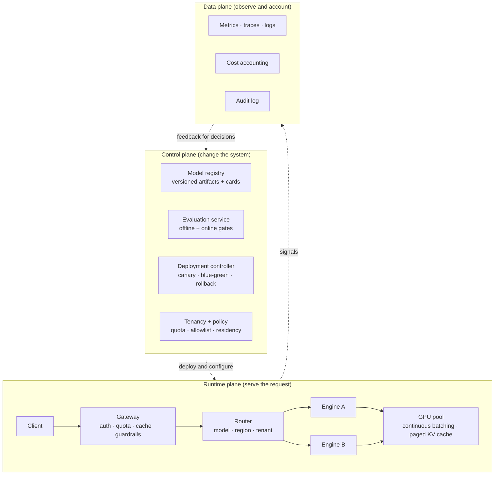

# Model-Serving and AI Platform Architecture

> **Interview answer (say this first).** Serving and platform are two layers, and separating them is the whole point. The **serving path** is what a request touches: a gateway for auth, quota, cache, and guardrails; a router that picks the model, region, and tenant policy; an engine that runs the model with continuous batching and a paged KV cache; and a GPU pool underneath. The **platform** is what makes that path operable: a model registry of versioned artifacts, an evaluation service that gates releases, a deployment controller for canary and rollback, and tenancy, quota, and policy. Read the platform as three planes: the **control plane** changes the system (deploy, configure, evaluate), the **runtime plane** serves each request, and the **data plane** observes and accounts for what happened. The main decision is build versus buy: buy the commodity—managed APIs or a hosted gateway—and build the differentiator, which is usually evaluation, routing policy, and domain tools. The reason to self-host is usually fixed high volume, strict data residency, or a custom model, not fashion; managed APIs win on elasticity and operational burden.

> **Note: Verified.** Every runnable example on this page was executed offline in plain Python (Python 3.14). No model calls were made, and every number shown is computed from the formula on the page rather than quoted from a vendor. Prices that appear are clearly labelled placeholders for your own contract rate. The YAML and JSON snippets were parsed with a standard parser.

## Why this exists

It is tempting to treat serving as "call the model API." That works until the first real requirement:

- **Latency has two halves.** Time to first token (TTFT) and time per output token (TPOT) feel completely different to a user. An agent that waits eight seconds before its first token feels broken even if it finishes quickly.
- **Throughput and latency trade off.** Batching raises tokens per second and raises per-request latency. You cannot maximise both; you choose a point.
- **GPUs are expensive and idle at the trough.** Cost is driven by utilisation, and utilisation is driven by autoscaling decisions, so cost and latency are the same design problem.
- **Models are versioned artifacts, not code.** They need registries, provenance, and a release process with rollback, exactly like software.
- **A platform has users.** The application teams are its customers. Without a registry, an eval gate, and a deploy path, every team invents its own, and none of them is safe.

Here is what that looks like in practice:

- A team self-hosted a model for data residency and then found the GPU was idle 85% of the day, making it far costlier than the API they replaced.
- An autoscaler watched average GPU utilisation, which stayed low while queue delay grew, because the bottleneck was the batch scheduler rather than the compute.
- A model was updated in place with no eval gate; quality dropped, and there was no version to roll back to.
- Two teams deployed the same model on separate GPUs, each at low utilisation, because there was no shared serving platform.
- A gateway cached answers without the tenant in the key, and one customer saw another's cached response.

The lesson: **serving is a system with a capacity model and a release process.** The platform is what turns a model into a product you can operate.

> **The one-sentence purpose.** Serving is the runtime path that turns tokens into answers; the platform is the control, runtime, and data planes that make that path versionable, governable, and cheap to operate.

## Start from zero

Assume you have never deployed a model. Here are the words this page keeps using.

| Word | Plain meaning |
| --- | --- |
| **Inference** | Running a trained model to produce an output. |
| **TTFT** | Time to first token. The wait before output starts. |
| **TPOT / ITL** | Time per output token / inter-token latency. The pace once output starts. |
| **Throughput** | Tokens or requests served per second. |
| **Batching / continuous batching** | Grouping requests so one GPU pass serves many; continuous batching adds and removes sequences each step instead of waiting for a full batch. |
| **KV cache** | Stored attention state for tokens already processed, so the model does not recompute them. |
| **PagedAttention** | Managing the KV cache in fixed-size pages, like virtual memory, to cut waste. |
| **Quantization** | Storing weights in fewer bits (for example 8 or 4) to save memory and raise speed. |
| **GPU memory** | The limited fast memory that holds weights, cache, and activations. |
| **Tensor parallelism** | Splitting one model across several GPUs. |
| **Replica / warm pool / cold start / scale to zero** | A replica is one copy of the stack; a warm pool is pre-started replicas; cold start is the load delay; scale to zero runs none when idle. |
| **Gateway / router / engine** | The entry point that authenticates and limits; the component that picks the model; the inference server that runs batched generation. |
| **Model registry** | A versioned store of model artifacts and their metadata. |
| **Artifact** | A concrete file: weights, tokenizer, config, adapter. |
| **Model card** | A document describing a model's purpose, data, limits, and evaluation. |
| **Evaluation gate** | A CI check that blocks a model or prompt release if quality regresses. |
| **Canary / blue-green / shadow** | Release to a small slice; run two environments and switch; or send live traffic without using its answers. |
| **Control / runtime / data plane** | Control changes the system (registry, evals, deploy, policy); runtime serves requests (gateway, router, engine, GPU); data observes and accounts (metrics, traces, logs, cost). |
| **Tenancy / namespace / quota** | Serving many customers with isolation and usage caps, partitioned by a logical namespace. |
| **Policy engine** | Code that decides what is allowed, evaluated at admission time. |
| **Admission control** | Accepting or rejecting a request before any work is done. |
| **Build vs buy / TCO** | Deciding which parts to build; total cost of ownership adds hardware, licences, people, and idle time. |

Three distinctions matter most:

- **Serving vs platform.** Serving is the runtime path; the platform is the registry, evaluation, deployment, tenancy, and policy around it. A model can serve without a platform, but it cannot be operated or safely changed.
- **Latency vs throughput.** Throughput is how many tokens per second the system produces; latency is how long one user waits. Batching improves the first and worsens the second.
- **Control vs runtime vs data plane.** Control changes the system, runtime serves it, and data observes it. Confusing them is why teams put evaluation code in the request path or logging in the deploy pipeline.

## The core idea

Think of an **airport**. The **control tower** decides which planes fly, on which routes, and when a runway closes — that is the control plane. The **runways and gates** move passengers every minute — that is the runtime plane. The **flight records and radar** describe what happened — that is the data plane. A runway with no tower is dangerous; a tower with no runway is useless; both without radar are blind. The mental model is three planes over one serving path.



The three planes form a loop: the control plane deploys a version, the runtime plane serves it, the data plane measures it, and the measurement feeds the next control-plane decision. Break any arrow and the platform becomes a pile of scripts. The central build-vs-buy decision, as a table:

| | Managed API | Self-hosted | Hybrid |
| --- | --- | --- | --- |
| What you own | Prompt and integration | Weights, GPU, serving stack | Routing and fallback |
| Cost model | Per token | Per GPU-hour, idle at the trough | Blended |
| Latency control | Provider's tail | Your tail | Route by requirement |
| Data residency | Provider's regions | Your regions | Per tenant |
| Model choice | Provider catalog | Any open weights | Both |
| Scaling | Elastic, on demand | You plan capacity | Burst to API |
| Ops burden | Low | High: upgrades, security, on-call | Medium |
| Best for | Fast start, spiky load | Fixed high volume, strict data rules | Resilience and cost |

Self-hosting is justified by high, steady utilisation, strict residency, or a model the API does not offer; it is rarely justified by token price alone once idle time and operations are counted. The three planes split by cadence: control (registry, evals, deploy, policy) changes in minutes to days, runtime (gateway, router, engine, GPU) changes every request, and the data plane (metrics, traces, logs, cost, audit) is continuous.

> **The mental model in one line.** The runtime plane serves one request; the control plane decides which version is live; the data plane proves what happened and what it cost.

## How it works

Follow a model from the registry to a served request, then wrap the platform around it.

1. **Define the serving SLO.** State TTFT, TPOT, availability, and cost per thousand tokens as targets. Every capacity and routing decision follows from these numbers.
2. **Choose a serving mode.** Managed API for elasticity and speed to market; self-hosted for residency, custom weights, or steady high volume; hybrid with API burst for the rest. Write down why.
3. **Put a gateway at the front.** Authenticate, apply per-tenant quotas and rate limits, run input guardrails, check the cache, and attach a trace id. Nothing reaches a model without passing here.
4. **Route by requirement.** Choose the model by difficulty, cost, latency class, region, and tenant policy. Keep the routing rule declarative and versioned, so it can be changed and rolled back.
5. **Run engines with continuous batching.** Let the engine add and remove requests each step, so a long generation does not block short ones. This is the single largest throughput lever.
6. **Page the KV cache.** Allocate cache in fixed pages so memory is used densely and long and short sequences coexist without pre-reserving the maximum length.
7. **Quantize and parallelise as needed.** Use 8-bit or 4-bit weights to fit larger models or more concurrency; use tensor parallelism when a model does not fit on one GPU. Each choice costs some quality or adds communication.
8. **Size the GPU from first principles.** Weights plus KV cache plus activations must fit, with headroom. Compute the KV cache from layers, KV heads, head dimension, and sequence length.
9. **Autoscale on the right signal.** Scale on queue depth or TTFT, not average utilisation. Keep a warm pool to hide cold starts, or accept scale-to-zero for cost at the price of a slow first request.
10. **Register every artifact.** Store weights, tokenizer, config, adapters, and a model card, each immutable and versioned. A model with no version cannot be rolled back.
11. **Gate releases on evals.** Run the offline eval set in CI; block the deploy on regression. Add a sampled online judge after release.
12. **Deploy progressively.** Canary or blue-green with automatic rollback on the serving SLO. Shadow first when the change is risky and traffic is available.
13. **Enforce tenancy and policy.** Namespaces, quotas, allowlists, and residency are admission-control decisions made before work, not checks after.
14. **Attribute cost and observe.** Tag every request with tenant, model, version, and tokens; export traces, metrics, and cost so the data plane closes the loop back to the control plane.

The platform test: **can you answer "which model version served this request, was it evaluated, what did it cost, and can you roll it back?"** If any part is missing, the platform is incomplete.

## The syntax you will use

These are real production forms. Read them once; later chapters explain each.

**A serving deployment in YAML.** A versioned model, a replica count, and resource limits.

```yaml
# serving/deployment.yaml
apiVersion: serving.example/v1
kind: ModelDeployment
metadata:
  name: support-agent-llm
  labels: { model: llama-3.1-8b-instruct, version: "2026-08-01", tenant: shared }
spec:
  replicas: 3
  engine: vllm
  artifact:
    registry: registry.internal/models
    reference: llama-3.1-8b-instruct@sha256:9f2c...
  resources:
    gpu: { type: a100-80gb, count: 1 }
    memory: 64Gi
  batching:
    max_batch_tokens: 8192
    max_concurrent_requests: 64
  autoscaling:
    min_replicas: 2
    max_replicas: 12
    target: { metric: time_to_first_token_p95_ms, value: 800 }
  rollout:
    strategy: canary
    canary_percent: 5
    abort_on: { metric: error_ratio, threshold: 0.02 }
```

`reference` pins the exact artifact digest; `rollout` makes the release reversible. Those two lines are what a versioned release means.

**A routing policy in JSON.** Declarative, versioned, and cheap to change.

```json
{
  "policy_version": "2026-08-14",
  "rules": [
    { "when": { "task": "classification", "tokens_estimate_lt": 2000 },
      "route": "small-model", "max_cost_usd": 0.002 },
    { "when": { "task": "reasoning" },
      "route": "large-model", "region": "eu-west-1" },
    { "when": { "tenant_tier": "free" },
      "route": "small-model", "fallback": "queue" }
  ],
  "default": { "route": "large-model", "fallback": "small-model" }
}
```

A declarative policy can be tested, versioned, and rolled back. Routing logic buried in application code can be none of those.

**The GPU capacity formula in Python.** Replicas follow from throughput, not guesswork.

```python
import math

def replicas_needed(peak_rps, gpu_tokens_per_s, out_tokens_per_req, headroom=1.0):
    per_gpu_rps = gpu_tokens_per_s / out_tokens_per_req
    return math.ceil(peak_rps * headroom / per_gpu_rps), per_gpu_rps

reps, per_gpu = replicas_needed(50, 2000, 300)
print("per-gpu rps:", round(per_gpu, 2))              # 6.67
print("replicas:", reps)                              # 8
print("with 30% headroom:", replicas_needed(50, 2000, 300, 1.3)[0])  # 10
```

Fifty requests per second at 300 output tokens each needs about 6.67 requests per second per GPU, so 8 replicas — 10 with headroom. `per_gpu_rps` counts every GPU token as an output token and ignores prefill and input tokens, so these replica counts are a lower bound. **Capacity is arithmetic, and it is the first thing a design interview checks.**

**The KV cache formula in Python.** The memory cost of concurrency.

```python
def kv_bytes_per_token(layers, kv_heads, head_dim, dtype_bytes=2):
    return 2 * layers * kv_heads * head_dim * dtype_bytes

per_token = kv_bytes_per_token(32, 8, 128)      # 131072 bytes = 128 KiB
print("KiB/token:", per_token / 1024)           # 128.0
print("MiB per 4096-token seq:", per_token * 4096 / 1024 / 1024)  # 512.0
```

For an illustrative 32-layer, 8-KV-head model, each token costs 128 KiB of cache and a 4,096-token sequence costs 512 MiB. **KV cache, not weights, usually caps concurrency.**

**Serving SLOs in PromQL.** The metrics that describe the user's experience.

```promql
# p95 time to first token
histogram_quantile(0.95, sum(rate(ttft_seconds_bucket[5m])) by (le))

# p95 inter-token latency
histogram_quantile(0.95, sum(rate(tpot_seconds_bucket[5m])) by (le))

# queue depth against the ready replica count
sum(engine_queue_depth) / sum(engine_replicas_ready)
```

Scale on queue depth or TTFT. Average GPU utilisation hides a saturated scheduler.

**A model card in YAML.** Provenance and limits travel with the artifact.

```yaml
# registry/llama-3.1-8b-instruct.card.yaml
model: llama-3.1-8b-instruct
version: "2026-08-01"
artifact: registry.internal/models/llama-3.1-8b-instruct@sha256:9f2c...
license: llama-3.1-community
intended_use: "internal support summarisation and retrieval-grounded Q&A"
not_intended_for: ["medical advice", "autonomous financial actions"]
evaluation:
  suite: internal-rag-eval-v7
  faithfulness: 0.94
  answer_relevance: 0.91
  unsafe_output_rate: 0.002
limits: ["may hallucinate on unseen products", "context window 128k tokens"]
```

The card is the control plane's memory: it is how the next person knows what the artifact may and may not be used for.

## Examples: simple to real

**Example 1 — replicas from throughput.** Start with the capacity model, because it constrains everything else.

```python
import math

def replicas_needed(peak_rps, gpu_tokens_per_s, out_tokens_per_req, headroom=1.0):
    per_gpu_rps = gpu_tokens_per_s / out_tokens_per_req
    return math.ceil(peak_rps * headroom / per_gpu_rps), per_gpu_rps

for headroom in (1.0, 1.3, 1.5):
    reps, per_gpu = replicas_needed(50, 2000, 300, headroom)
    print(f"headroom {headroom}: {reps} replicas at {per_gpu:.2f} rps/GPU")
# 1.0 -> 8, 1.3 -> 10, 1.5 -> 12
```

At 2,000 output tokens per second per GPU and 300 tokens per request, one GPU serves 6.67 requests per second. Fifty requests per second needs 8 replicas; 30% headroom pushes that to 10. Headroom is not waste — it is what absorbs a replica restart during a rollout. Because this counts output tokens only and ignores prefill and input tokens, it is a lower bound on the replicas you need.

**Example 2 — KV cache sets the concurrency ceiling.** Weights are a fixed cost; cache grows with concurrency and sequence length.

```python
import math

def kv_bytes_per_token(layers, kv_heads, head_dim, dtype_bytes=2):
    return 2 * layers * kv_heads * head_dim * dtype_bytes

per_token = kv_bytes_per_token(32, 8, 128)          # 131072 bytes
seq = 4096
gpu_gb, weights_gb = 80, 14
free = gpu_gb - weights_gb
concurrent = math.floor(free * 1024**3 / (per_token * seq))
print("KiB/token:", per_token / 1024)               # 128.0
print("MiB/sequence:", per_token * seq / 1024 / 1024)  # 512.0
print("max concurrent sequences:", concurrent)      # 132
```

On an 80 GB GPU with 14 GB of weights, about 66 GB remains, which holds roughly 132 sequences of 4,096 tokens. **That 132 is your real concurrency limit**, and it is what determines whether a batch of 64 even fits. Long contexts shrink it linearly.

**Example 3 — the batching trade-off.** Bigger batches raise throughput and worsen per-request latency.

```python
def batch_step(batch, base_ms=20, per_seq_ms=2):
    return base_ms + per_seq_ms * batch

for b in (1, 8, 16, 32, 64):
    step = batch_step(b)
    print(f"batch {b:2d}: {step:3d} ms/step, {b / (step / 1000):7.1f} tok/s, "
          f"{step / b:6.2f} ms/token")
# batch  1:  22 ms/step,    45.5 tok/s,  22.00 ms/token
# batch  8:  36 ms/step,   222.2 tok/s,   4.50 ms/token
# batch 16:  52 ms/step,   307.7 tok/s,   3.25 ms/token
# batch 32:  84 ms/step,   381.0 tok/s,   2.62 ms/token
# batch 64: 148 ms/step,   432.4 tok/s,   2.31 ms/token
```

Going from batch 1 to batch 16 multiplies throughput by nearly 7. Going from 16 to 64 gains only 40% more, and each token waits longer. **There is a knee; find it and stop.** Continuous batching is how you serve mixed lengths without waiting for a full batch.

**Example 4 — concurrency and replicas from Little's law.** Concurrency equals arrival rate times service time.

```python
import math

def replicas_littles(arrival_rps, service_s, concurrent_per_replica):
    concurrency = arrival_rps * service_s
    return math.ceil(concurrency / concurrent_per_replica), concurrency

reps, conc = replicas_littles(20, 3.0, 8)
print("concurrency:", conc)          # 60.0
print("replicas:", reps)             # 8
print("plus one spare:", reps + 1)   # 9
```

Twenty requests per second, each holding an engine slot for 3 seconds, is 60 concurrent requests. At 8 concurrent per replica that is 8 replicas. **Add a spare for rolling updates**, because replacing a replica without a spare means serving at 100% during the deploy.

**Example 5 — the cost per million tokens, from utilisation.** The GPU hourly rate is an input; substitute your own contract rate.

```python
def cost_per_million(gpu_hour_usd, tokens_per_s, gpus=1, utilization=1.0):
    tokens_per_hour = tokens_per_s * 3600 * gpus * utilization
    return gpu_hour_usd / tokens_per_hour * 1e6

print(round(cost_per_million(3.0, 2000), 2))                    # 0.42
print(round(cost_per_million(3.0, 2000, utilization=0.5), 2))   # 0.83
print(round(cost_per_million(3.0, 2000, gpus=4, utilization=0.25), 2))  # 0.42
```

At full utilisation, the illustrative rate produces 0.42 per million output tokens. At half utilisation it doubles to 0.83. **Utilisation is the cost lever**, which is why autoscaling and batching are cost decisions, not just latency decisions. Never compare a self-hosted figure at 100% utilisation against a managed API: production rarely runs at 100%.

**Example 6 — the gateway stack compounds.** Cache and routing together cut far more than either alone.

```python
requests, model_cost = 1_000_000, 0.02
cached_share, routed_share, cheap_cost = 0.25, 0.60, 0.002

baseline = requests * model_cost
after = (requests * cached_share * 0.0002
         + requests * (1 - cached_share) * (routed_share * cheap_cost
                                            + (1 - routed_share) * model_cost))
print("baseline:", round(baseline, 2))                      # 20000.0
print("after cache + routing:", round(after, 2))            # 6950.0
print("saving:", round((baseline - after) / baseline * 100, 1), "%")  # 65.2%
```

A 25% cache hit rate plus routing 60% of the rest to a cheaper model cuts spend 65.2%. Each control is simple; the stack is what moves the bill. **But every layer adds a correctness risk** — a stale cache hit, a misrouted request — so measure quality per layer, not only the total.

## In production

- **Capacity is arithmetic before it is a cluster.** Estimate replicas from tokens per second and peak requests before choosing hardware. A number beats a hunch in review.
- **Batch for throughput, but watch the latency knee.** Batching is the biggest serving lever and it is also how you blow a TTFT target. Tune to the knee, not to the maximum.
- **Autoscale on queue depth or TTFT, not average utilisation.** Utilisation lags the user experience and hides a saturated scheduler behind idle-looking numbers.
- **Pin artifact digests, not tags.** A mutable tag makes "which model is live?" unanswerable and rollback impossible. Store the digest on every trace.
- **Never deploy a model without an eval gate and a canary.** An offline eval plus a 5% canary with automatic rollback catches regressions that no unit test sees.
- **Enforce tenancy at admission.** Namespaces, quotas, allowlists, and residency checks happen before any GPU work. A post-hoc check cannot unspend the tokens or unsee the data.
- **Include the tenant in every cache key.** A shared cache across tenants is a data-leak bug waiting for a hit.
- **Buy the commodity, build the differentiator.** Managed serving, gateways, and vector stores are commodities. Evaluation, routing policy, and domain tools are where your quality lives.

> **The platform test.** Before shipping any model, answer: which version, evaluated how, deployed how, isolated how, and rolled back how? If a question has no answer, the platform is not done.

## Interview questions

### 1. Walk me through what happens when a request hits an AI serving stack.

**Answer.** It reaches the gateway, which authenticates the caller, checks quota and rate limits, runs input guardrails, and checks the cache. On a miss, the router picks a model and region from the policy. The engine adds the request to a running batch, reads and extends the KV cache, and generates tokens. Output guardrails run, the response streams back, and a trace records tenant, model version, tokens, and cost. The data plane collects the metrics.

**Follow-up: "Where would you look first if latency is high?"** Split TTFT from TPOT. High TTFT usually means queueing or prefill (the initial pass that processes the whole prompt and fills the KV cache); high TPOT usually means batching pressure or a large model. The trace tells you which stage, and the fix differs.

**Trap.** Describing only the model call. The gateway, router, batching, and cache are where most cost, latency, and correctness decisions actually live.

### 2. How do you decide between a managed API and self-hosting?

**Answer.** By volume, residency, model choice, and operational capacity. Managed APIs win on elasticity, time to market, and operational burden, and they suit spiky load. Self-hosting wins when utilisation is high and steady, when data must stay in your regions or on your hardware, or when you need custom weights. The honest comparison is total cost of ownership at realistic utilisation, plus the engineering time to run GPUs on call.

**Follow-up: "When is self-hosting cheaper?"** When a GPU is busy enough that its hourly cost per token beats the API rate, and when that holds through the troughs, not just at peak. Idle GPUs are the usual reason the bill surprises people.

**Trap.** Comparing API list price to GPU price at 100% utilisation. Production never runs at 100%, and operations cost headcount.

### 3. Explain continuous batching and why it matters.

**Answer.** In static batching the server waits for a full batch and runs it to completion, so one long generation blocks short ones and new requests wait. Continuous batching adds and removes sequences at each decode step, so the GPU stays busy and short requests finish quickly. It raises throughput and cuts queueing latency at the same time. It needs a memory manager, which is why paged KV cache matters.

**Follow-up: "What does it cost?"** Complexity, and the need to manage KV cache memory carefully. Without paging, pre-reserving the maximum sequence length wastes most of the memory and limits concurrency.

**Trap.** Saying batching always lowers latency. Larger batches raise per-request latency; the win is throughput and queueing. Continuous batching is what avoids the worst latency penalty.

### 4. What limits how many concurrent requests one GPU can serve?

**Answer.** Memory and compute. Memory holds the weights, the KV cache, and activations; for most models the KV cache is the binding constraint, and it grows with concurrency and sequence length. Compute limits tokens per second, which sets throughput. In practice you compute the KV cache from layers, KV heads, head dimension, and precision, subtract weights from GPU memory, and divide.

**Follow-up: "How do you raise concurrency?"** Reduce per-sequence cache with quantized KV, shorter contexts, or grouped-query attention (sharing key/value heads across query heads to shrink the KV cache); add GPUs and tensor parallelism; or use multiple replicas. Each has a quality, latency, or cost cost.

**Trap.** Sizing by parameter count alone. A model that fits in GPU memory can still serve very few concurrent requests once the cache is counted.

### 5. How should a serving autoscaler decide when to add replicas?

**Answer.** On a signal that reflects the user experience and responds before saturation: queue depth, p95 TTFT, or pending requests per ready replica. Scale out before the queue grows, keep a warm pool to absorb cold starts, and set a minimum replica count that survives a rolling update. Add a floor for latency-sensitive services and a scale-to-zero policy only where the first-request delay is acceptable.

**Follow-up: "Why not scale on GPU utilisation?"** It lags the experience. A GPU can look 40% utilised while the scheduler queue grows, because the bottleneck is batching or memory rather than compute. Queue-based signals react earlier and match the SLO.

**Trap.** Scaling to zero on a latency-critical path. The cold start lands entirely on the first user after idle, which is often the worst possible moment.

### 6. What belongs in a control plane for models, and why separate it from the runtime?

**Answer.** The registry of versioned artifacts and model cards, the evaluation service that gates releases, the deployment controller for canary and rollback, and the tenancy and policy that constrain what runs. It is separate because it changes on a different cadence from serving: you deploy a version once and serve it a million times. Mixing them puts slow, risky operations on the request path.

**Follow-up: "What breaks without one?"** You cannot answer which version served a request, you cannot roll back, and every team deploys differently. Model updates become irreversible experiments on production traffic.

**Trap.** Treating the registry as a file share. A registry without versions, digests, and a release gate is storage, not control.

### 7. How do you run multi-tenant model serving safely?

**Answer.** Isolate at admission: namespaces for resources, quotas and rate limits per tenant, allowlists for models, and residency checks before any work. Keep tenant in every cache key, in every trace, and in cost accounting. Choose an isolation level on purpose — shared pool with quotas is cheapest, dedicated replicas are strongest — and make the choice explicit per tenant tier.

**Follow-up: "Is a shared pool safe?"** It is safe if quotas, cache keying, and authorisation are correct. The risks are noisy neighbours and a cache or log that crosses tenants, so those controls are what make the shared pool acceptable.

**Trap.** Assuming the application enforces tenancy. Enforcement belongs at the gateway and admission layer, where no request path can skip it.

### 8. A model upgrade cut quality and raised latency. How do you find and fix it?

**Answer.** Use the trace data: compare the new version against the old on eval scores, TTFT, TPOT, and error rate, filtered by tenant and model version. Check the deploy path for a missing eval gate or a canary that was too small. Then roll back to the pinned artifact digest, fix the root cause, and re-release behind a proper gate. If routing changed at the same time, check the router first.

**Follow-up: "How do you prevent it next time?"** Pin digests, gate on an offline eval plus a canary, watch TTFT and quality together during the canary, and make rollback a one-command operation with the previous version still warm.

**Trap.** Shipping a small prompt fix to recover quality. It hides the original regression, and the next change compounds it. Roll back first, diagnose second.

## Remember this

- **Serving is the runtime path — gateway, router, engine, GPU — and the platform is the control, data, and runtime planes around it.**
- **Capacity is arithmetic.** Estimate replicas from tokens per second and peak load; the KV cache, not the weights, usually caps concurrency.
- **Batch to the knee.** Continuous batching raises throughput; over-batching blows your TTFT target.
- **Buy the commodity and build the differentiator.** Managed serving is a commodity; evaluation, routing policy, and domain tools are where quality lives.
- **Version, gate, canary, roll back.** Pin artifact digests, run an eval gate, deploy to a small slice, and keep rollback warm.
