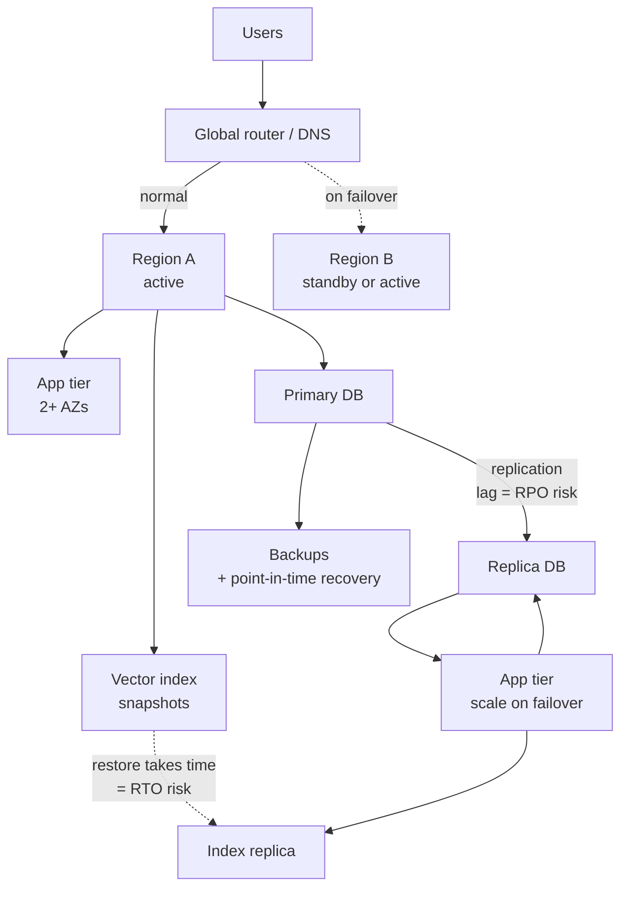

# Availability, Disaster Recovery, and Multi-Region

> **Interview answer (say this first).** Availability is the fraction of time a system can do its job, and it is usually stated in **nines**: 99.9% allows about 8.8 hours of downtime a year, and 99.99% allows about 53 minutes. Each extra nine costs far more than the last, so you choose a target from the business cost of being down, not from fashion. Availability is a product of the components that must all work in a chain, and it improves when critical parts run in parallel as redundancy. **RTO** is how long recovery may take; **RPO** is how much data you may lose. DR strategies trade cost for speed: backup/restore is cheapest and slowest, warm standby is in between, and active-active is the most expensive and fastest. For AI, multi-region also means model-endpoint availability, data residency, latency, cost, and consistency. Stateful AI data — vector indexes and agent memory — makes DR harder, because restoring a service without its state restores something that cannot answer questions. You prove all of this with failover and failback drills, not with a diagram.

> **Note:**
>
> **Verified.** Every runnable example on this page was executed offline in plain Python (Python 3.14). No model or cloud calls were made, and no vendor prices, SLAs, or guarantees are asserted. All numbers are arithmetic on values you supply.

## Why this exists

Everything works until something does not. A zone loses power, a database fails over badly, a model provider is degraded for an hour, or someone deletes an index by mistake. Availability engineering is how you decide, in advance, how much of that you will tolerate and what the system will do.

The trap is treating availability as a word instead of a number. "High availability" means nothing in a design review. "99.95% for the chat API, with an RTO of 30 minutes and an RPO of 5 minutes, proven by a quarterly failover drill" is a commitment you can test, cost, and defend.

For AI systems there is an extra wrinkle. A traditional service is often stateless: if it dies, you start another and it is instantly as good. An AI system is stateful in ways that are expensive to rebuild — a **vector index** that took hours to embed, **agent memory** that may be the product itself, a **model endpoint** owned by a provider, and **feedback data** you cannot recreate. So availability and DR are not just "run two copies"; they are "identify what state is precious, replicate it, and rehearse rebuilding it."

> **The one-sentence purpose.** Availability is a target you buy with redundancy; DR is the plan, with a stated RTO and RPO, for when the redundancy is not enough.

## Start from zero

| Word | Plain meaning |
| --- | --- |
| **Availability** | The fraction of time the system answers correctly when asked. |
| **Nines** | Shorthand for availability: 99%, 99.9%, 99.99%, and so on. |
| **Downtime** | The time the system is not serving correctly. Availability and downtime are two views of one number. |
| **SLA** | A service-level agreement: a promise to a customer, usually with a penalty. |
| **SLO** | A service-level objective: your internal target, usually stricter than the SLA. |
| **SLI** | A service-level indicator: the measurement, such as successful requests over total requests. |
| **SPOF** | Single point of failure: one component whose failure takes the whole system down. |
| **Redundancy** | A spare copy of a component so one failure does not stop the service. |
| **Failover** | Moving traffic or work from a failed component or region to a healthy one. |
| **Failback** | Moving back to the original component or region after it recovers. |
| **RTO** | Recovery time objective: the maximum acceptable time to restore service. |
| **RPO** | Recovery point objective: the maximum acceptable data loss, measured in time. |
| **Backup** | A copy of data kept so it can be restored after loss or corruption. |
| **Restore** | Rebuilding a working system from a backup. |
| **Warm standby** | A second environment kept running at low capacity, ready to scale up. |
| **Active-active** | Two or more regions serving live traffic at the same time. |
| **Active-passive** | One region serves; another is on standby. |
| **Region** | A large isolated group of data centres in one geography. |
| **Availability zone (AZ)** | An isolated data centre or group inside a region. |
| **Blast radius** | Everything that breaks when a given component fails. |
| **Data residency** | A rule that certain data must stay inside a stated geography. |
| **Replication lag** | How far behind a copy is from the original, in seconds or bytes. |
| **Consistency** | Whether every reader sees the same, up-to-date data at the same time. |
| **Game day** | A planned exercise where you deliberately break something to test the plan. |

Three distinctions matter most:

- **Availability vs reliability.** Availability is "is it up?" Reliability is "does it do the right thing?" A system can be 100% up and still wrong, so track quality separately.
- **RTO vs RPO.** RTO is time (how long until we are back?). RPO is data loss (how much did we lose?). A plan that meets one can miss the other.
- **Failover vs failback.** Failover is the emergency move. Failback is the calm move home. Teams rehearse failover and forget failback, then get stuck in the expensive region.

## The core idea

Think of a hospital with an emergency generator.

The hospital does not run on the generator every day; it runs on the grid. The generator is idle, tested, and fuelled. When the grid fails, the generator carries the critical circuits — operating theatres and intensive care first, the car park lights later. Someone decided, in advance, what "critical" means, how many seconds of switchover are acceptable, and how often to test the fuel.

Availability and DR are the same design:

- the **grid** is your primary region;
- the **generator** is your standby or second region;
- the **critical circuits** are the services that must survive;
- the **switchover seconds** are your RTO;
- the **fuel level** is your RPO (how much you can tolerate losing);
- the **monthly test** is a game day.

The critical insight is that **redundancy belongs at the failure boundary, not just at the server**. Backing up a database does not help if you cannot restore it in time. Running two app servers does not help if both share one database. You buy availability where a single failure would otherwise stop the service.



Read the diagram twice. Every dashed arrow is something that only works if you tested it. The replication lag between the primary and the replica sets your realistic RPO; the time to restore or rebuild the vector index sets part of your RTO.

The three classic DR strategies are a cost ladder:

| Strategy | What runs when healthy | Typical RTO | Typical RPO | Cost | Use when |
| --- | --- | --- | --- | --- | --- |
| **Backup / restore** | Only the primary; backups sit in storage | Hours | Hours (since last backup) | Lowest | Internal tools, data you can rebuild |
| **Warm standby / pilot light** | Primary plus a small always-on copy of core data | Minutes to an hour | Minutes | Medium | Customer-facing systems with a real RTO |
| **Active-active** | Two or more regions serving live traffic | Seconds | Near zero | Highest | Systems where downtime is the product |

The table is the whole conversation. Read it left to right and you can see the trade: you are buying lower RTO and RPO with more money and more complexity.

> **The mental model in one line.** Choose an availability target from the cost of being down, find the SPOFs, then buy back just enough redundancy to meet the RTO and RPO — and rehearse it.

## How it works

1. **State the requirement in business terms.** What does one hour of downtime cost, in money, safety, or trust? That number sets how much you can spend on another nine.
2. **Turn it into numbers.** Pick an availability target (for example 99.9%), an RTO, and an RPO for each critical user journey. Different journeys can have different targets.
3. **Map the request path.** Draw every component a request touches: router, app, model gateway, model provider, database, vector store, cache, queue. Anything that must work is a link in the chain.
4. **Find the single points of failure.** A component with no spare is a SPOF. A shared database under two app servers is a SPOF. A single model provider is a SPOF.
5. **Compute the composite availability.** In series, multiply the availabilities. In parallel, combine as one minus the product of the failure probabilities. This tells you whether the target is even reachable.
6. **Choose a DR strategy per component.** Not everything needs active-active. Put the expensive redundancy where a failure is fatal, and use cheaper recovery where a pause is acceptable.
7. **Design the data path first.** Decide what gets replicated, how fast, and how you will detect lag. Data recovery is usually the long pole in RTO.
8. **Build the failover trigger.** Define what a human or an automated system observes and at what threshold it moves traffic. A trigger that depends on a hunch is not a plan.
9. **Build failback.** Define how you move home after the incident, who approves it, and how you avoid bouncing traffic back and forth.
10. **Handle AI-specific state.** Snapshot vector indexes, replicate memory stores, and decide whether to rebuild or restore an index. Rebuilding can be slower but cleaner than restoring a stale copy.
11. **Test with game days.** Deliberately fail a region, a database, and a model provider in staging, and measure the real RTO and RPO against the target.
12. **Record what you learned.** Every drill produces action items. Update the runbook and the target, because an untested plan is a hope.

> **The working rule.** If you cannot describe the failover trigger, the data loss you will accept, and the test that proves it, you do not have a DR plan — you have a backup.

## The syntax you will use

These are real production forms. Read them once; each appears in a runbook or a config repo.

**1. An availability SLO, written down.** The target is a number, not an adjective.

```yaml
# slo/chat-api.yaml
service: chat-api
sli:
  good: "requests with 2xx and latency < 2s"
  total: "all requests"
objective: 0.999          # 99.9% over a 30-day window
window: 30d
error_budget: 0.001
```

An SLO turns "be reliable" into a budget you can spend and a number you can alarm on.

**2. A health and readiness probe.** Failover only works if the router can tell a dead instance from a busy one.

```yaml
# kubernetes readiness probe
readinessProbe:
  httpGet: { path: /healthz, port: 8080 }
  initialDelaySeconds: 5
  periodSeconds: 10
  failureThreshold: 3
```

Readiness decides whether traffic is sent; liveness decides whether the instance is restarted. Mixing them up causes flapping.

**3. Backups with point-in-time recovery.** Define the schedule and the retention together.

```yaml
# backup policy (conceptual)
database:
  full_backup: daily
  incremental: hourly
  pitr_window: 7d          # restore to any second in the last 7 days
storage:
  cross_region_copy: true
  encryption: required
```

Your achievable RPO comes from the backup and incremental cadence, not the `pitr_window`; the window only bounds how far back you can restore. Match both to the requirement.

**4. A failover trigger with thresholds.** Automation is faster than a human at 3am, but it needs a rule.

```python
def should_failover(region_health):
    return (
        region_health["error_rate"] > 0.05
        or region_health["p95_latency_ms"] > 5000
        or region_health["healthy_instances_fraction"] < 0.5
    )
```

A trigger based on several signals is less likely to fire on one noisy metric.

**5. A replication-lag alert tied to RPO.** Lag is the live measure of how much data you would lose.

```yaml
alerts:
  - name: replica-lag-near-rpo
    expr: replication_lag_seconds > 8
    for: 2m
    labels: { severity: page }
    annotations:
      summary: "Replica lag is within 20% of the 10s RPO"
```

Alert before the RPO is breached, not after, so you have time to react.

**6. The failover runbook, short and ordered.**

```text
FAILOVER — chat-api primary region
1. Confirm trigger: error rate > 5% for 5 min (dashboard DR-1).
2. Announce in #incident and name the incident commander.
3. Flip the global router to Region B (command: route switch --to b).
4. Verify: synthetic check + error rate + p95 latency.
5. Watch replica lag and confirm RPO was not breached.
6. Keep the primary in read-only until failback is approved.
```

A runbook is a checklist a tired person can follow without inventing steps.

## Examples: simple to real

These examples are plain standard library and print deterministic results.

**Example 1 — nines to downtime.** The first calculation in every availability review.

```python
SEC_PER_YEAR = 365.25 * 24 * 3600
SEC_PER_MONTH = 30 * 24 * 3600

def downtime_seconds(availability, period_seconds):
    return period_seconds * (1 - availability)

for a in (0.99, 0.999, 0.9999, 0.99999):
    print(a, round(downtime_seconds(a, SEC_PER_YEAR)),
          round(downtime_seconds(a, SEC_PER_MONTH) / 60, 2))
```

Illustrative output:

```text
0.99 315576 432.0
0.999 31558 43.2
0.9999 3156 4.32
0.99999 316 0.43
```

99.9% still allows about 43 minutes of downtime a month. **Each nine cuts the allowed downtime by ten, and usually costs more than ten times as much to reach.**

**Example 2 — composite availability, series vs parallel.** A chain is weaker than its weakest link; a redundant pair is stronger than either.

```python
from math import prod

def series_availability(parts):
    return prod(parts)

def parallel_availability(parts):
    return 1 - prod(1 - p for p in parts)

print("series-3x0.999", round(series_availability([0.999, 0.999, 0.999]), 6))
print("parallel-2x0.99", round(parallel_availability([0.99, 0.99]), 6))
print("parallel-2x0.9999", round(parallel_availability([0.9999, 0.9999]), 9))
combined = series_availability([
    parallel_availability([0.999, 0.999]),
    0.9999,
    parallel_availability([0.9999, 0.9999]),
])
print("combined", round(combined, 6))
```

Illustrative output:

```text
series-3x0.999 0.997003
parallel-2x0.99 0.9999
parallel-2x0.9999 0.99999999
combined 0.999899
```

Three 99.9% components in series give 99.7%, which is worse than any one of them. **Redundancy is how you get above the availability of a single component.**

**Example 3 — RPO and RTO from backup settings.** Backup cadence sets the worst-case data loss; restore throughput sets the recovery time.

```python
def meets_rpo(backup_interval_hours, rpo_hours):
    return backup_interval_hours <= rpo_hours

def restore_minutes(data_gb, restore_mb_per_sec, provision_minutes):
    return data_gb * 1024 / restore_mb_per_sec / 60 + provision_minutes

print("rpo-24h", meets_rpo(24, 4), "rpo-1h", meets_rpo(1, 4))
print("restore-500gb", round(restore_minutes(500, 100, 15), 1),
      "restore-50gb", round(restore_minutes(50, 100, 15), 1))
```

Illustrative output:

```text
rpo-24h False rpo-1h True
restore-500gb 100.3 restore-50gb 23.5
```

A 4-hour RPO rules out daily backups. **Compute the restore time from data size and throughput; "it restores fast" is not an RTO.**

**Example 4 — does the surviving region have enough headroom after failover?** Failover is useless if the other region melts.

```python
def failover_capacity(surviving_rps, peak_rps, headroom=0.3):
    required = peak_rps * (1 + headroom)
    return {"required_rps": round(required, 1),
            "surviving_rps": surviving_rps,
            "ok": surviving_rps >= required}

print(failover_capacity(2000, 1500))
print(failover_capacity(1000, 1500))
```

Illustrative output:

```text
{'required_rps': 1950.0, 'surviving_rps': 2000, 'ok': True}
{'required_rps': 1950.0, 'surviving_rps': 1000, 'ok': False}
```

The second region must absorb the whole peak plus headroom, not half of it. **Size the standby for the failover load, or your failover becomes a second outage.**

**Example 5 — replication lag as a live RPO check.** Alert before you lose more data than allowed.

```python
def replication_lag_status(lag_seconds, rpo_seconds, warn_fraction=0.75):
    if lag_seconds > rpo_seconds:
        return "breach"
    if lag_seconds > rpo_seconds * warn_fraction:
        return "warn"
    return "ok"

for lag in (2, 8, 12):
    print(lag, replication_lag_status(lag, 10))
```

Illustrative output:

```text
2 ok
8 warn
12 breach
```

A 10-second RPO with 12 seconds of lag already breaches the promise. **Turn the RPO into a metric you can watch, not a sentence in a document.**

**Example 6 — what another nine is worth.** Compare the downtime cost to the spend required to reach the next target.

```python
def cost_of_downtime(downtime_cost_per_hour, availability, hours_per_year=8766.0):
    downtime_hours = hours_per_year * (1 - availability)
    return round(downtime_hours, 3), round(downtime_hours * downtime_cost_per_hour, 2)

print("99.9", cost_of_downtime(10000, 0.999))
print("99.99", cost_of_downtime(10000, 0.9999))
print("delta", round(cost_of_downtime(10000, 0.999)[1]
                    - cost_of_downtime(10000, 0.9999)[1], 2))
```

Illustrative output:

```text
99.9 (8.766, 87660.0)
99.99 (0.877, 8766.0)
delta 78894.0
```

At ten thousand dollars per hour, moving from three to four nines avoids about $79k of loss a year. **If the extra redundancy costs less than that, it is worth it; if it costs more, it is not. That is the whole decision.**

## In production

- **Pick the target from the business, then design.** Start with the cost of an hour of downtime and work backward to a target. A target nobody can cost is a slogan, and teams over-engineer "five nines" systems that do not need them.
- **Find the real SPOFs before adding redundancy.** Redundancy at the app tier while one database serves everyone is expensive theatre. Draw the request path and hunt for components with no spare.
- **Redundancy must cross a real failure boundary.** Two pods on one node, two nodes in one zone, or two regions on one provider's control plane can fail together. Redundancy inside the blast radius does not protect you from it.
- **Data is usually the long pole.** The app can fail over in seconds; the database, the vector index, and the memory store take minutes or hours. Design and test the data path first, because that is what sets your RTO.
- **Tie RPO to replication lag and alert on it.** Replication is not binary. Watch lag as a live number and page before it violates the RPO, because that is data you would actually lose.
- **Do not forget failback.** Teams rehearse failover and then run in the standby region for months at higher cost and worse latency. Define the failback trigger, the approval, and the test.
- **Treat the model provider as a component with an SLA and a SPOF.** A single provider is a single point of failure for the whole product. A fallback model or a second provider is the redundancy, and it must be load-tested.
- **Keep stateful AI data in the plan.** Snapshot the vector index, replicate memory, and decide rebuild versus restore. Rebuilding embeddings can take hours, so measure it before an incident forces you to.
- **Distinguish availability from correctness.** A model provider can be 100% available and silently worse. Pair availability monitoring with a quality SLI, or you will pass your uptime target while shipping bad answers.
- **Data residency complicates multi-region.** If personal data must stay in a region, you cannot simply replicate it everywhere. Design region-scoped data planes and route requests to the right copy.
- **Run game days on a schedule.** A quarterly drill that fails a region and a model provider is worth more than any diagram. Measure real RTO and RPO, then fix the gap between plan and reality.
- **Document the trigger and the owner.** Automation is good, but someone must own the decision and the runbook. An incident is the wrong time to discover that nobody knows who can move traffic.

## Interview questions

### 1. How do you choose an availability target?

**Answer.** From the cost of being down, not from a default. Estimate the business impact of an hour of downtime — revenue, safety, contractual penalties, trust — and compare it to the cost of the redundancy needed for each additional nine. Pick the target where the next nine's cost is less than the loss it avoids. State it as a per-journey SLO with an error budget, and keep it separate from any customer-facing SLA, which is usually looser.

**Follow-up: "Why not just target five nines for everything?"** Because each nine multiplies cost and complexity, and most systems do not need it. Five nines on an internal tool is money burned; three nines on a payment path may be negligent.

**Trap.** Quoting a target without being able to say what it costs or what it buys. The number is a decision, not a boast.

### 2. What is the difference between RTO and RPO?

**Answer.** RTO is how long recovery may take, measured in time. RPO is how much data you may lose, also usually expressed in time (the age of the newest acceptable recovery point). A backup plan can meet a generous RTO and miss a tight RPO, or vice versa. They are separate requirements with separate engineering: RTO drives standby capacity and automation, RPO drives replication frequency and lag monitoring.

**Follow-up: "Can you have an RPO of zero?"** Only with synchronous replication, which adds latency and can reduce availability because a write must reach both copies. Most systems accept a small non-zero RPO to keep writes fast and available.

**Trap.** Treating RTO and RPO as the same knob. Doubling backup frequency improves RPO and does nothing for RTO.

### 3. Explain availability as a product, and how redundancy changes it.

**Answer.** Components that must all work are in series, so you multiply their availabilities; a chain is worse than any single link. Redundant components that can substitute for each other are in parallel, so you combine their failure probabilities and the pair is stronger than either alone. This is why three 99.9% services in a chain give about 99.7%, and two 99% replicas give about 99.99%. The math tells you where to spend: fix the weakest series link or add parallelism at the component whose failure is most damaging.

**Follow-up: "Where does redundancy not help?"** When all copies share a common cause of failure — same zone, same provider, same bad deploy. Redundancy only helps across an independent failure boundary.

**Trap.** Adding redundancy everywhere without finding the actual SPOF. You pay for copies that fail together.

### 4. Compare backup/restore, warm standby, and active-active.

**Answer.** Backup/restore keeps only backups, so RTO is hours and RPO is the time since the last backup; it is cheap and right for data you can rebuild. Warm standby keeps a small always-on copy of core data and scales it up on failover, giving minutes of RTO and low-minutes RPO at medium cost. Active-active runs several regions on live traffic, giving seconds of RTO and near-zero RPO at the highest cost and complexity, including cross-region consistency and conflict handling. Choose per component, not per company.

**Follow-up: "What is the hidden cost of active-active?"** Data consistency. Two regions accepting writes must reconcile conflicts, which is a distributed-systems problem. Many teams pay for active-active and then route all writes to one region anyway.

**Trap.** Choosing active-active because it sounds best, then discovering the database cannot merge writes from two regions. Match the strategy to what the data layer can actually do.

### 5. How does multi-region change the picture for an AI system?

**Answer.** Four extra concerns. Model endpoints: a provider may be per-region or region-restricted, and a fallback model must exist and be tested. Data residency: personal or regulated data may be required to stay in a geography, which constrains replication and routing. Latency: a model call is slow, so serving from a far region adds noticeable delay, and cross-region retrieval adds more. Cost: cross-region data transfer, duplicate vector indexes, and duplicate GPU capacity are real costs. Consistency: two regions may serve different retrieval results or memory state, which can confuse users.

**Follow-up: "How do you handle residency and DR together?"** Scope the data plane by region and keep personal data local, replicating only what is allowed. DR for that region restores within the region or a permitted geography, and you document the rule rather than assuming global copies are fine.

**Trap.** Replicating everything everywhere for simplicity and violating a residency rule. Simplicity in the diagram is a compliance problem in production.

### 6. Why is stateful AI data hard for disaster recovery?

**Answer.** A stateless service can be recreated in seconds from an image, but a vector index, an agent memory store, and a fine-tuned adapter are data, and rebuilding them can take hours. The index may need re-embedding millions of chunks, which costs money and time; memory may be the product's core value; a fine-tune may need GPUs and data that also must be recoverable. If you restore the service without its state, you have an empty shell, so RTO is set by the state, not the app.

**Follow-up: "Would you restore the vector index or rebuild it?"** Restore is faster and preserves exact content but can carry stale or poisoned vectors. Rebuild is slower and costlier but gives a clean index. The choice depends on corruption risk; many teams keep snapshots and a tested rebuild pipeline.

**Trap.** Backing up the app but not the index or memory store, then discovering in a drill that "recovery" produces an assistant that knows nothing.

### 7. How do you test a disaster-recovery plan?

**Answer.** Game days. On a schedule, deliberately break something real in a safe environment — kill a region's traffic, stop the primary database, disable the model provider — and measure the actual RTO and RPO against the targets. Include failover and failback, and include the stateful pieces: restore the vector index and a memory snapshot. Record timestamps, compare to the objective, and turn every gap into an owned action item. If you only ever test a health check, you have tested almost nothing.

**Follow-up: "Why test failback too?"** Because failback is where you can lose data again — for example, if the old primary has writes the new one never saw. An untested failback can turn a successful failover into a second incident.

**Trap.** Testing in a way that cannot fail. A drill with a human ready to catch every problem proves the humans, not the system. Push far enough to measure the real recovery time.

### 8. What is a single point of failure, and how do you find them in an AI system?

**Answer.** A component whose failure stops the service. You find them by tracing the request path and asking, at each node, "if this dies, what still works?" Common AI SPOFs are the primary database, the vector store, the model provider, the embedding service, the message queue that carries agent work, and a shared cache that holds deduplication or session state. Each SPOF either gets a redundant equivalent across an independent failure boundary or gets an accepted, documented recovery plan.

**Follow-up: "Is a model provider a SPOF?"** Often yes, and you cannot fix it yourself, so the mitigation is a fallback provider or model and a tested routing rule. If the fallback shares the same underlying outage, it is not real redundancy.

**Trap.** Assuming a managed service has no SPOFs. Managed services fail too, and their failure mode is usually "wait and hope", which is why you still need a fallback and a plan.

## Remember this

- **Availability is a number with a price.** Choose the target from the cost of downtime, and state the RTO and RPO per journey.
- **Series multiplies, parallelism protects.** Fix the weakest link or add redundancy across a real failure boundary, not inside the same blast radius.
- **Data sets your RTO.** The database, vector index, and memory store recover slower than the app, so design and test the data path first.
- **Backup, warm standby, active-active is a cost ladder.** Buy the cheapest strategy that meets the requirement, per component.
- **DR is proven by game days.** Failover without a rehearsed failback is half a plan, and untested state recovery is no plan at all.
