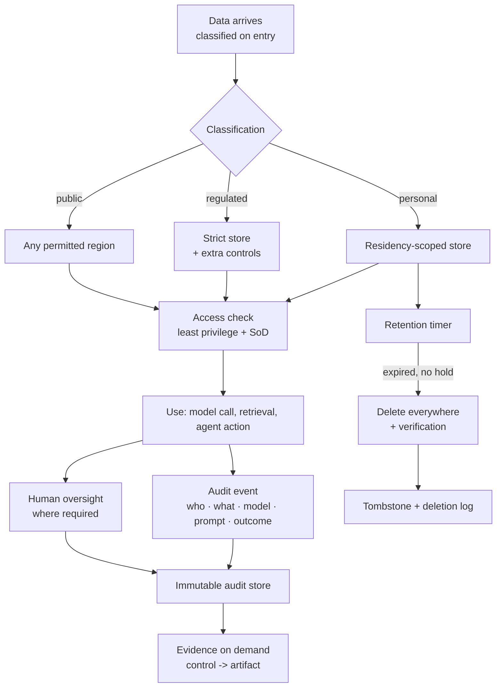

# Compliance Architecture

> **Interview answer (say this first).** Compliance architecture means designing the system so that the rules it must follow are built into the design, not bolted on after an audit. The recurring concerns are **data residency** (data stays in permitted places), **audit trails** (you can reconstruct who did what and why), **retention and deletion** (data lives only as long as allowed, and a person can be erased), **access control and segregation of duties** (people get only the access they need, and no one person can both do and approve a sensitive action), **provenance** (you can trace a model, prompt, and dataset version to an output), and **human oversight** where the risk requires it. The engineering pattern is the same everywhere: define a control, attach it to evidence the system produces automatically, and make the check run in the pipeline. Keep claims general, and route legal interpretation to legal and risk owners — this page describes engineering patterns, not legal advice.

> **Note:**
>
> **Verified.** Every runnable example on this page was executed offline in plain Python (Python 3.14). No model or cloud calls were made, and no legal or regulatory interpretation is offered. The examples are process mechanics you adapt with your legal and risk owners.

## Why this exists

Compliance goes wrong when it is treated as a document. A team writes a policy, an auditor asks for evidence, and the team spends two weeks reconstructing screenshots and spreadsheets. The system already knew the facts — who accessed what, which model version served a request, when data was deleted — but nobody designed it to record or prove them.

The fix is to treat compliance like any other non-functional requirement. Data residency is a routing and replication constraint. Retention is a scheduled deletion job with an exception path. Audit is an append-only event stream. Access control is a policy engine. Provenance is metadata attached to every model call. Human oversight is an approval step in the workflow. Each is a design decision with a testable control.

AI adds specific pressure. A model call is a decision that may affect a person, so regulators and customers want to know which model, which prompt, which data, and who approved it. Training and retrieval data may contain personal information, and an agent can take actions with real permissions, so deletion, segregation of duties, and least privilege matter more than in a read-only system. This page stays general on purpose: the engineering is yours, and the legal meaning of a rule belongs to legal and risk owners.

> **The one-sentence purpose.** Design controls into the system so the evidence exists by default, then let legal and risk owners interpret what the rules require.

## Start from zero

| Word | Plain meaning |
| --- | --- |
| **Compliance** | Meeting rules set by law, regulation, contract, or your own policy. |
| **Control** | A specific safeguard that keeps a rule true, such as an access check or a deletion job. |
| **Evidence** | An artifact that shows a control ran: a log, report, approval, or test result. |
| **Data residency** | A rule that data must stay in a stated geography. |
| **Data sovereignty** | A broader rule that data is subject to the laws of the place it sits in. |
| **Data classification** | Labelling data as public, internal, personal, or regulated, which sets its controls. |
| **Audit trail** | An append-only record of who did what, when, to which resource, and with what outcome. |
| **Immutability** | Records cannot be altered or deleted once written, so the trail can be trusted. |
| **Retention** | How long data is kept before deletion or archival. |
| **Right to erasure** | A person's ability to have their personal data deleted, subject to legal exceptions. |
| **Legal hold** | A freeze that suspends deletion because data is needed for a dispute or investigation. |
| **Segregation of duties (SoD)** | No single person can both perform and approve a sensitive action. |
| **Least privilege** | A person or agent gets the minimum access needed for the task. |
| **Access review** | A periodic check that access is still needed and still appropriate. |
| **Provenance** | The origin and history of a model, prompt, dataset, or output. |
| **Human oversight** | A person can review, intervene in, or stop a high-risk decision. |
| **Control mapping** | Linking each control to the evidence that proves it, and to the rule it serves. |
| **Deletion verification** | Confirming that data was actually removed everywhere, not just marked. |
| **Tombstone** | A marker that a record existed and was deleted, kept without the personal content. |

Three distinctions matter most:

- **Compliance vs security.** Security keeps the system safe; compliance demonstrates that required controls exist. They overlap, but passing an audit is not the same as being secure, and being secure is not the same as being able to prove it.
- **Delete vs tombstone.** A deletion removes personal data. A tombstone keeps a non-personal marker so you can prove the deletion happened without keeping the content.
- **Policy vs mechanism.** Policy says what should be true. Mechanism makes it true automatically. A policy with no mechanism is a wish.

## The core idea

Think of a bank vault, not a filing cabinet.

A bank does not rely on everyone remembering the rules. The vault door has a time lock. Access is granted per person and per role. Every entry is recorded on camera and in a register. Cash is counted in and out, and the count is reconciled. A manager cannot both open the vault and approve the count alone.

Compliance architecture is that discipline for data and AI:

- the **time lock** is encryption and the policy engine;
- the **access list** is least privilege and segregation of duties;
- the **camera** is the immutable audit trail;
- the **register** is retention and deletion with a paper trail;
- the **reconciliation** is your access review and evidence mapping.

The engineering insight is that **every control should emit its own evidence**. If proving the control requires a human to write a report, the control will drift from the report.



Every arrow ends in a record. The point of the diagram is that compliance is a pipeline property, not an after-the-fact cleanup. If a request can reach a model without passing the classification and access steps, no amount of documentation will fix it.

The control-to-evidence map is the table you keep next to the architecture:

| Control | What it makes true | Evidence it must emit |
| --- | --- | --- |
| **Residency routing** | Data is processed only in permitted regions | Region-scoped routing logs |
| **Access control** | Only authorised identities act | Authentication and authorisation events |
| **Segregation of duties** | Requester cannot approve | Approval records showing distinct identities |
| **Audit trail** | Actions are reconstructable | Append-only event log |
| **Retention and deletion** | Data does not live forever | Deletion jobs and verification reports |
| **Provenance** | Outputs trace to versions | Model, prompt, and data version metadata |
| **Human oversight** | A person can intervene | Approval and override records |

If a row has no automatic evidence, that row is a gap you should fix before an auditor finds it.

> **The mental model in one line.** Design each rule as a control, make each control emit evidence automatically, and map every control to the artifact that proves it.

## How it works

1. **Collect the actual requirements.** Work with legal and risk owners to list the rules that apply: residency, retention, deletion, access, oversight, and provenance. You are gathering constraints, not interpreting law.
2. **Classify data on entry, and turn rules into controls.** Every dataset gets a label — public, internal, personal, regulated — that travels with the data and decides where it may go; each requirement then names the control that makes it true, so "data must stay in the EU" becomes a routing rule plus a replication constraint.
3. **Scope the data plane.** Partition storage and processing by region or classification. Keep personal data local where residency requires it, and replicate only what is permitted.
4. **Enforce access with least privilege.** Identities, human and machine, get the minimum access for the task and for a limited time. Review access on a cadence and revoke what is no longer needed.
5. **Enforce segregation of duties.** Define the combinations that must not coexist — requester and approver, author and auditor, deployer and releaser — and check them on every sensitive action, not once a year.
6. **Write an immutable audit trail with provenance.** Every meaningful action emits a structured, append-only event with actor, action, resource, time, outcome, and the model, prompt, and data versions involved. This is what lets you answer "why did it say that?" later.
7. **Implement retention as a timer.** Each class of data has a retention period. A scheduled job deletes or archives when the timer expires, unless a legal hold applies.
8. **Implement deletion end to end.** Erasure must reach every copy: primary stores, replicas, indexes, caches, backups, and derived data such as embeddings. Verify and log the deletion, and keep a tombstone if you must prove it happened.
9. **Build the evidence map.** Link each control to the artifact that proves it and generate the pack on demand. An audit becomes a lookup, not an archaeology project.
10. **Test the controls.** Rehearse an access review, a deletion request, and an audit-evidence pull. A control that has never run is untested, and untested controls fail exactly when they are examined.

> **The working rule.** If a control does not produce evidence automatically, you are relying on memory and goodwill — and neither survives an audit.

## The syntax you will use

These are real production forms. Read them once; each is a control you can implement.

**1. A data-classification policy.** The label decides where data may go and who may touch it.

```yaml
# policy/classification.yaml
classes:
  public:    { residency: any,        retention_days: 3650 }
  internal:  { residency: any,        retention_days: 1825 }
  personal:  { residency: "same-region", retention_days: 365 }
  regulated: { residency: "same-region", retention_days: 365, extra_controls: [audit, oversight] }
```

Classification on entry is the input every other control reads.

**2. An immutable audit event.** One structured record per meaningful action.

```json
{
  "event_id": "e2f1",
  "timestamp": "2026-09-14T10:15:00Z",
  "actor": "svc-support-agent",
  "action": "generate_answer",
  "resource": "doc:policy-42",
  "outcome": "ok",
  "model_version": "support-agent-v3",
  "prompt_version": "3.2.1",
  "data_class": "internal"
}
```

Write it to an append-only store, and include the versions so provenance is free.

**3. A retention rule with a legal-hold escape.** Deletion is a decision, not a date.

```python
def retention_action(age_days, retention_days, legal_hold=False):
    if legal_hold:
        return "hold"
    return "delete" if age_days > retention_days else "retain"
```

The hold path exists so a dispute does not get destroyed by a well-meaning cleanup job.

**4. An erasure walk over every store.** You cannot erase what you cannot find.

```python
def erasure_plan(subject_id, stores):
    plan, uncovered = [], []
    for s in stores:
        key = s.get("subject_key")
        if key:
            plan.append({"store": s["name"], "delete": f"{key}={subject_id}"})
        else:
            uncovered.append(s["name"])
    return {"plan": plan, "uncovered": uncovered, "complete": not uncovered}
```

A store with no subject key is a store you cannot erase from — flag it as a gap.

**5. The evidence pack, generated on demand.**

```text
evidence/2026-09-14/support-agent-v3/
  control-map.json          # control -> artifact
  access-review-q3.csv
  audit-log-export.ndjson
  deletion-report.json
  approvals.json
  model-card.md
  prompt-version.yaml
```

One command should assemble this from live stores, because hand-written packs drift.

## Examples: simple to real

These examples are plain standard library and print deterministic results.

**Example 1 — residency check across stores.** A classification plus a list of stores reveals violations.

```python
ALLOWED_REGIONS = {
    "public": {"us", "eu", "ap"},
    "internal": {"us", "eu", "ap"},
    "personal": {"eu"},
    "regulated": {"eu"},
}

def check_residency(classification, stores):
    allowed = ALLOWED_REGIONS[classification]
    violations = [s["name"] for s in stores if s["region"] not in allowed]
    return {"classification": classification,
            "allowed": sorted(allowed),
            "violations": violations}

stores = [
    {"name": "vector-index", "region": "us"},
    {"name": "primary-db", "region": "eu"},
    {"name": "backup-bucket", "region": "us"},
]

print(check_residency("personal", stores))
print(check_residency("public", stores))
```

Illustrative output:

```text
{'classification': 'personal', 'allowed': ['eu'], 'violations': ['vector-index', 'backup-bucket']}
{'classification': 'public', 'allowed': ['ap', 'eu', 'us'], 'violations': []}
```

The vector index and the backup bucket violate residency even though the primary database is fine. **Check every copy, including indexes and backups, because residency rules follow the data, not the service name.**

**Example 2 — retention with a legal hold.** Age drives deletion, unless a hold overrides it.

```python
def retention_action(age_days, retention_days, legal_hold=False):
    if legal_hold:
        return "hold"
    return "delete" if age_days > retention_days else "retain"

print(30, retention_action(30, 90))
print(120, retention_action(120, 90))
print(120, "hold ->", retention_action(120, 90, legal_hold=True))
```

Illustrative output:

```text
30 retain
120 delete
120 hold -> hold
```

A record past retention is deleted unless a hold applies. **The hold path is what keeps a routine cleanup from destroying evidence in a dispute.**

**Example 3 — a right-to-erasure plan and its gaps.** Walk every store, and fail loudly when one has no way to find the subject.

```python
def erasure_plan(subject_id, stores):
    plan, uncovered = [], []
    for s in stores:
        key = s.get("subject_key")
        if key:
            plan.append({"store": s["name"], "delete": f"{key}={subject_id}"})
        else:
            uncovered.append(s["name"])
    return {"plan": plan, "uncovered": uncovered, "complete": not uncovered}

print(erasure_plan("user-42", [
    {"name": "primary-db", "subject_key": "user_id"},
    {"name": "vector-index", "subject_key": "user_id"},
    {"name": "analytics-warehouse"},
]))
```

Illustrative output:

```text
{'plan': [{'store': 'primary-db', 'delete': 'user_id=user-42'}, {'store': 'vector-index', 'delete': 'user_id=user-42'}], 'uncovered': ['analytics-warehouse'], 'complete': False}
```

The analytics warehouse has no key to find the subject, so erasure cannot complete. **A store that cannot locate a subject cannot erase it; that is a design gap, not a paperwork problem.**

**Example 4 — audit-trail completeness.** Missing fields make an event useless for reconstruction.

```python
REQUIRED_AUDIT_FIELDS = [
    "event_id", "timestamp", "actor", "action",
    "resource", "outcome", "model_version", "prompt_version",
]

def audit_gaps(records):
    gaps = {}
    for r in records:
        missing = [f for f in REQUIRED_AUDIT_FIELDS if not r.get(f)]
        if missing:
            gaps[r.get("event_id", "?")] = missing
    return gaps

print(audit_gaps([
    {"event_id": "e1", "timestamp": "t", "actor": "u1", "action": "read",
     "resource": "doc1", "outcome": "ok", "model_version": "m1", "prompt_version": "p1"},
    {"event_id": "e2", "timestamp": "t", "actor": "u1", "action": "generate",
     "resource": "doc2", "outcome": "ok"},
]))
```

Illustrative output:

```text
{'e2': ['model_version', 'prompt_version']}
```

The event without model and prompt versions cannot answer "which model produced this?" **Audit fields are not decoration; an incomplete event is a gap you will have to explain.**

**Example 5 — segregation-of-duties conflicts.** One check finds people who can both do and approve.

```python
def sod_conflicts(assignments, conflicting_pairs):
    conflicts = []
    for person, roles in assignments.items():
        for a, b in conflicting_pairs:
            if a in roles and b in roles:
                conflicts.append({"person": person, "pair": [a, b]})
    return conflicts

print(sod_conflicts(
    {"ana": ["requester", "approver"], "ravi": ["requester"], "sam": ["approver", "auditor"]},
    [("requester", "approver"), ("approver", "auditor")],
))
```

Illustrative output:

```text
[{'person': 'ana', 'pair': ['requester', 'approver']}, {'person': 'sam', 'pair': ['approver', 'auditor']}]
```

Ana can approve her own request; Sam can approve the work they audit. **Detect these conflicts from role assignments so they are found by a job, not by an incident.**

**Example 6 — control-to-evidence gaps.** Every control needs an artifact, or it is unproven.

```python
CONTROLS = {
    "access-review": "quarterly access review report",
    "audit-log": "immutable log export",
    "retention": "deletion and hold log",
    "human-oversight": "approval decision records",
    "model-provenance": "model card and version registry",
}

def evidence_gaps(control_to_evidence):
    return [c for c in CONTROLS if not control_to_evidence.get(c)]

print(evidence_gaps({"access-review": "report-q3.pdf", "audit-log": "export.json"}))
```

Illustrative output:

```text
['retention', 'human-oversight', 'model-provenance']
```

Three controls have no evidence attached. **An unmapped control is an unproven control, and an unproven control fails at the worst moment — the audit.**

## In production

- **Design for the rule, then confirm the interpretation with legal and risk owners.** Engineers build the mechanism; legal and risk owners decide what the rule means for the organisation. Keep those responsibilities separate and documented, and never present engineering notes as legal advice.
- **Classify data at the boundary, and remember residency follows every copy.** Classification decided later is decoration, so label data as it enters and carry the label through storage, retrieval, and model calls. Replicas, caches, backups, vector indexes, and logs are copies too; a residency control that covers only the primary database is not a residency control.
- **Make the audit trail append-only.** A mutable audit log is not evidence. Use write-once storage or an append-only stream, restrict deletion, and include actor, action, resource, time, outcome, and versions.
- **Record provenance on every AI output.** Model version, prompt version, retrieved sources, and any adapter or dataset identifier. This is what turns "the model decided" into a traceable, reviewable decision.
- **Treat erasure as an end-to-end, verifiable workflow.** Find every store by subject key, delete from primary, replicas, indexes, caches, and derived embeddings, honour legal holds, verify by re-querying the subject keys, and log a tombstone and a report. A `DELETE` that returns success is not proof the bytes are gone; test it on a real subject before a request arrives.
- **Enforce segregation of duties on the action, and review access on a cadence.** Checking role combinations once a year catches conflicts too late, so evaluate the rule when the workflow attempts the sensitive step and block it. Access also accumulates, so a quarterly review that removes stale access is a control, while a report nobody acts on is theatre.
- **Make human oversight real and testable.** Know who can review or stop a high-risk decision, record the approval, and prove the stop path works. "A human looks at it" is a claim until the record exists.
- **Generate evidence from systems, and rehearse the audit.** Evidence should come from the pipeline, the policy engine, and the audit stream, because hand-written evidence drifts. Once a quarter, pull the pack for one system and answer a realistic question end to end; the gaps you find then are far cheaper than the ones an external reviewer finds later.

## Interview questions

### 1. What does compliance architecture mean, in engineering terms?

**Answer.** It means treating the rules the system must satisfy as design constraints and building controls that enforce them and emit evidence automatically. Residency becomes region-scoped storage and routing, retention becomes a scheduled deletion job with holds, audit becomes an append-only event stream, access becomes least privilege plus segregation of duties, and provenance becomes metadata on every model call. The mechanism is consistent: a control that produces its own evidence, mapped to the rule it serves.

**Follow-up: "How is that different from a security architecture?"** Security aims to keep the system safe from harm; compliance architecture aims to make required controls demonstrable. They share controls such as access and logging, but compliance adds the evidence and mapping layer, and it is driven by external rules as well as risk.

**Trap.** Treating compliance as documentation. If the control does not run in the system and produce evidence, it is a claim, not a control.

### 2. How do you handle data residency in a multi-region AI system?

**Answer.** Classify data on entry, then scope storage and processing by region. Keep personal and regulated data inside its permitted geography, and replicate only what the rules allow. Route requests to the correct regional data plane, and check every copy — replicas, caches, backups, vector indexes, and logs — because residency follows the data, not the service. Document the routing rule so it can be audited, and confirm the specific legal requirements with legal and risk owners.

**Follow-up: "What about model providers?"** A provider may process requests in a region you cannot control, so residency may require a regional endpoint, a contract term, or a self-hosted model. Verify the provider's processing location rather than assuming it matches your region.

**Trap.** Replicating everything globally for simplicity. That diagram is clean and the residency position is broken.

### 3. What makes a good audit trail, and what does it need to contain?

**Answer.** It must be complete, structured, and immutable. Every meaningful action emits an event with actor, action, resource, timestamp, outcome, and — for AI — the model version, prompt version, and data class involved. It is stored append-only so it can be trusted. It must be queryable by the questions you actually expect: what happened to this record, what did this user do, which model produced this output, and who approved it.

**Follow-up: "What is the most common audit-trail mistake?"** Logging the event but not the versions or the decision context. You can see that a request happened but cannot reconstruct why the output looked the way it did.

**Trap.** Storing audit events in a mutable table with broad write access. Anyone, or any bug, can rewrite history, and the evidence loses its value.

### 4. How do you implement the right to erasure in an AI system?

**Answer.** As an end-to-end workflow. Identify every store that holds the subject's data using a stable subject key, delete from primary stores, replicas, caches, search indexes, vector embeddings, and backups where feasible, honour legal holds, verify the deletion by re-querying, and keep a tombstone and a deletion report as evidence. Derived data such as embeddings matters because a vector can still encode personal information after the source row is gone.

**Follow-up: "What about backups you cannot easily edit?"** Many organisations rely on backup expiry and documented rotation rather than editing backups, with the deletion applied to live systems and the fact recorded. The acceptable approach is a decision for legal and risk owners; your job is to make the live deletion complete and provable and to know the backup timeline.

**Trap.** Deleting the source row and assuming the index, cache, and analytics copies are clean. Erasure that misses a copy is not erasure.

### 5. Why does segregation of duties matter for AI systems, and how do you enforce it?

**Answer.** AI systems can take consequential actions, and the same person might configure the prompt, approve the model, and release the change, which removes the independent check that catches mistakes or misuse. Define conflicting role pairs — requester and approver, author and auditor, deployer and releaser — and evaluate them when the sensitive action is attempted, blocking and logging violations. Also require independent approval for high-risk changes.

**Follow-up: "How does this apply to agents?"** An agent acts with a service identity, so apply the same logic: separate the identity that proposes an action from the one that approves it, and never let a single credential both draft and execute an irreversible step.

**Trap.** Checking duties once a year in a spreadsheet. Role drift happens weekly; the control has to run where the action happens.

### 6. What is provenance and why do regulators and auditors care about it?

**Answer.** Provenance is the recorded origin and history of a model, prompt, dataset, or output: which versions were used, where the data came from, and how the result was produced. Auditors and regulators care because a decision that affects a person has to be explainable and reviewable. If you can tie an output to a model version, a prompt version, and the retrieved sources, you can answer questions about behaviour and change; without it, every question is guesswork.

**Follow-up: "How do you attach provenance without bloating every request?"** Store a version identifier on each artifact, emit it in the audit event, and keep the registry as the source of truth for what each version contains. The event carries identifiers, not the full content.

**Trap.** Recording only the model name and not the version or prompt. "We used the assistant" is not provenance, and it cannot be tied to a behaviour change.

### 7. When is human oversight required, and how do you make it a real control?

**Answer.** Where the decision is high-risk — affecting rights, safety, finances, or vulnerable people — a person must be able to review the output, intervene, and stop the process. Make it real by naming the role, placing the approval in the workflow for the actions that need it, recording the decision, and testing that the stop path works. For lower-risk work, oversight can be periodic review plus a working stop control. The classification of which decisions are high-risk is set with legal and risk owners.

**Follow-up: "What is the failure mode of approval gates?"** Approval fatigue. If everything needs a click, people approve without reading. Reserve gates for genuinely consequential actions and automate the rest with audit.

**Trap.** Claiming oversight exists because a policy says so. If there is no record of a person reviewing and no tested stop path, it is a claim, not a control.

### 8. How do you prove compliance without hand-writing reports?

**Answer.** Build a control-to-evidence map and generate the evidence pack from the systems that already hold the facts. Access reviews come from the identity system, audit exports from the append-only log, deletions from the deletion job, provenance from the version registry, and oversight from approval records. One command assembles the pack for a system and a date. Then rehearse it quarterly on a real question, so the gaps surface internally before an external reviewer finds them.

**Follow-up: "What if a control has no automatic evidence?"** That is a finding: either build the automation or acknowledge the gap and mitigate it. A control with no evidence is indistinguishable from a control that never ran.

**Trap.** Keeping evidence in a wiki that drifts from reality. Evidence should be generated by the pipeline; hand-written evidence is a liability disguised as an asset.

## Remember this

- **Design the rule in, do not bolt it on.** Each compliance requirement becomes a control that runs in the system and emits evidence by itself.
- **Classify at entry, and remember every copy.** Residency, retention, and access all depend on knowing what the data is and everywhere it lives.
- **Audit trails must be complete, structured, and append-only.** Actor, action, resource, time, outcome, and the model and prompt versions.
- **Erasure and retention are workflows, not statements.** Find every store by subject key, honour holds, delete derived data such as embeddings, verify, and log it.
- **Keep claims general and route legal meaning to legal and risk owners.** Build the mechanism you can control; let the experts interpret the rules, and never present engineering choices as legal advice.
