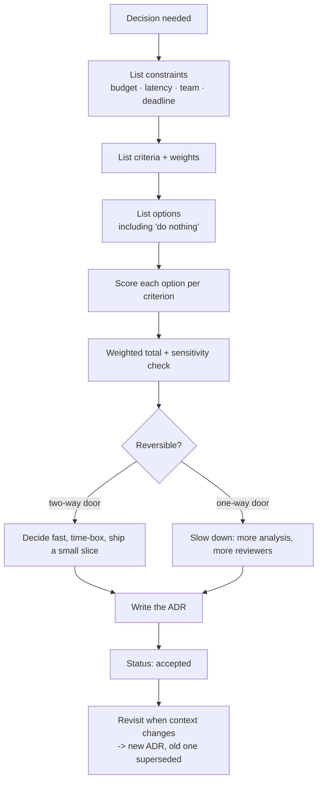

# Architecture Trade-offs and ADRs

> **Interview answer (say this first).** Architecture is choosing under constraints, so every real decision trades one good thing for another. Name the trades explicitly — cost vs latency, consistency vs availability, build vs buy, isolation vs efficiency, flexibility vs simplicity — and score the options against weighted criteria instead of arguing about adjectives. Separate reversible decisions, which you can simply try and undo, from **one-way doors**, which are expensive to reverse and deserve slow, deliberate analysis. Then record the choice in an **Architecture Decision Record (ADR)**: a short document with context, the decision, the consequences, and a status. ADRs are how a team stops re-litigating the same decision every quarter, and how a new engineer learns why the system is the way it is. An ADR captures the reasoning, not just the answer, so it can be revisited when the context changes.

> **Note:**
>
> **Verified.** Every runnable example on this page was executed offline in plain Python (Python 3.14). No model or cloud calls were made, and no vendor prices or guarantees are asserted.

## Why this exists

Most architecture debates are not about facts. They are about two people weighting the same facts differently and never saying so. One wants the lowest latency, another wants the lowest cost, and they argue for an hour because neither trade-off was written down.

The second problem is memory. A decision is made in a meeting, the reasoning lives in someone's head, that person leaves, and two years later a new team reverses the decision without knowing why it was made. Then the original problem returns, and the cycle repeats.

Trade-off analysis and ADRs fix both. The analysis makes the criteria and weights explicit, so the disagreement becomes a conversation about weights rather than about whose option is "better". The ADR records the context, so when the context changes you can deliberately revisit the decision instead of accidentally undoing it.

For AI systems this matters more than usual, because so many decisions are one-way doors or close to it: choosing a vector store, committing to a model provider, picking an embedding model and its dimension, deciding a fine-tuning strategy. Changing an embedding model means re-embedding the entire corpus. Changing a vector store means a migration. These are decisions you want to make slowly and record well.

> **The one-sentence purpose.** Name the trade-off, score the options against stated weights, and write down the decision with its context so it can be defended and revisited.

## Start from zero

| Word | Plain meaning |
| --- | --- |
| **Trade-off** | Giving up some of one quality to get more of another. |
| **Constraint** | A limit you cannot change, such as budget, latency target, or a regulatory rule. |
| **Criterion** | A quality you are judging, such as cost, latency, or operational effort. |
| **Weight** | How much a criterion matters relative to the others, usually summing to 1. |
| **Score** | How well an option does on a criterion, often 1 to 5. |
| **Weighted score** | Score times weight, summed across criteria to rank options. |
| **Trade-off matrix** | A table of options against criteria, with weights and scores. |
| **Sensitivity** | How much the ranking changes when weights shift. |
| **Reversibility** | How easily a decision can be undone. |
| **Two-way door** | A reversible decision: try it, and change your mind cheaply. |
| **One-way door** | An expensive or impossible decision to reverse; deserves deliberate analysis. |
| **ADR** | Architecture Decision Record: a short note of one decision and its reasoning. |
| **Status** | The ADR's state: proposed, accepted, deprecated, or superseded. |
| **Context** | The forces and constraints that made the decision necessary. |
| **Consequences** | What becomes easier and harder because of the decision. |
| **Superseded** | Replaced by a newer decision; the old record is kept for history. |
| **Analysis paralysis** | Delaying a decision because you keep gathering more information. |
| **Build vs buy** | Making a component yourself versus paying a vendor or using open source. |
| **Lock-in** | The cost of leaving a choice, in money, time, and risk. |
| **Good enough threshold** | The point where an option meets the requirement and needs no more analysis. |

Three distinctions matter most:

- **Trade-off vs constraint.** A constraint removes options; a trade-off ranks the remaining ones. Applying a weight to a hard limit is a category error.
- **Weight vs score.** The weight says how much you care; the score says how well the option does. Confusing them hides the real disagreement, which is almost always about weights.
- **Decision vs documentation.** The ADR does not make the decision; it records it. The decision happens with the people who own the risk.

## The core idea

Think of packing a car for a long trip.

You cannot take everything. Every item you add takes space and weight, and more weight costs fuel. The boot has a fixed volume, the roof has a load limit, and the passengers need room. You choose against constraints. If you optimise only for "carry the most", you overload the car and break the suspension. If you optimise only for "use the least fuel", you leave the essentials behind.

Architecture is that packing problem at scale. You have a fixed budget, a latency target, a team, and a deadline. Every option takes from one budget to give to another:

- **cost vs latency** — faster hardware and more replicas cost more;
- **consistency vs availability** — strict agreement between regions can mean refusing writes when they cannot agree;
- **build vs buy** — building gives control and costs people; buying is fast and costs money and lock-in;
- **isolation vs efficiency** — full per-tenant isolation is safer and wastes resources;
- **flexibility vs simplicity** — a general platform serves more use cases and is harder to operate.

The insight is that **a decision is only defensible when its criteria and weights are visible**. Once they are on the page, the argument changes from "my option is better" to "I weight cost more than you do", which is a real, resolvable conversation.



Two features matter. The first is the reversibility fork: reversible decisions should be made quickly and tested, while one-way doors deserve deliberate review. The second is the loop back — an ADR is revisited when the context changes, and the new decision supersedes the old record rather than deleting it.

The default trade-off table for an AI system looks like this:

| Criterion | What it measures | Typical tension with |
| --- | --- | --- |
| **Quality** | Task success, accuracy, grounding | Cost, latency |
| **Latency** | p50 and p95 response time | Cost, quality |
| **Cost** | Per-request and fixed spend | Latency, quality, control |
| **Control** | How much you can change and inspect | Buy, speed |
| **Reliability** | Availability and error behaviour | Cost, simplicity |
| **Operational effort** | What the team must run and page on | Control, cost |
| **Compliance** | Residency, audit, oversight | Cost, latency, simplicity |
| **Time to market** | How fast you can ship | Control, cost |

Reading down the "tension with" column is most of the analysis: it tells you what you are trading before you start scoring.

> **The mental model in one line.** Decide with visible criteria and weights, move fast on two-way doors, slow down on one-way doors, and write down the reasoning so it survives the people who made it.

## How it works

1. **State the decision as a question.** "Which vector store should we use?" is a decision; "we need RAG" is not. A good question names the options and the outcome.
2. **Separate constraints from preferences.** Constraints are hard limits (budget, a residency rule, a latency ceiling). Remove options that break a constraint before scoring; do not weight the impossible.
3. **List the criteria and their weights.** Choose the qualities that matter, then assign weights that sum to 1. Write down why each weight is what it is.
4. **List the options, including "do nothing".** Always include the status quo. It is the baseline against which every change must pay for itself.
5. **Score each option on each criterion.** Use a consistent scale (1 to 5) and define what the numbers mean. Score from evidence where you have it, and mark assumptions where you do not.
6. **Compute weighted totals and check sensitivity.** Rank the options, then nudge the weights to see whether the winner changes. A winner that flips under small weight changes is a weak decision you should discuss further.
7. **Classify reversibility.** Is this a two-way door or a one-way door? Reversibility determines how much analysis and review the decision needs.
8. **Decide with the owners.** The people who own the budget, the risk, and the delivery make the call. Engineering brings the analysis.
9. **Write the ADR.** Context, decision, consequences, status. Short enough that people read it, specific enough that it is useful. Keep the alternatives you rejected and why.
10. **Communicate the decision and its consequences.** An ADR nobody reads changes nothing. Link it from the relevant code or design docs.
11. **Revisit on a trigger, not on a mood.** Reopen a decision when a stated assumption changes, such as a price rise, a new requirement, or a measured result that contradicts the analysis.
12. **Supersede, do not delete.** Write a new ADR and mark the old one superseded, so the history of reasoning is preserved.

> **The working rule.** A trade-off you cannot write as a sentence with "in exchange for" is not yet understood.

## The syntax you will use

These are real production forms. Read them once; each appears in a design doc or a repo.

**1. A weighted decision matrix, in code.** The same table you would draw by hand, made repeatable.

```python
def weighted_scores(options, weights, scores):
    results = []
    for opt in options:
        total = sum(weights[c] * scores[opt][c] for c in weights)
        results.append({"option": opt, "total": round(total, 2)})
    return sorted(results, key=lambda x: -x["total"])
```

Weights sum to 1.0, so the total stays on the same 1-to-5 scale and is comparable across options.

**2. Normalising raw numbers onto a common scale.** Cost and latency are in different units; scores are not.

```python
def minmax_best(values, lower_is_better=True):
    lo, hi = min(values), max(values)
    if hi == lo:
        return [1.0] * len(values)
    if lower_is_better:
        return [round((hi - v) / (hi - lo), 3) for v in values]
    return [round((v - lo) / (hi - lo), 3) for v in values]
```

The best value maps to 1.0 and the worst to 0.0, so you can mix latency in milliseconds with cost in dollars.

**3. An ADR template.** Four required sections plus a status line.

```markdown
# ADR-0012: Use a managed model API for the support agent

- Status: accepted
- Date: 2026-09-14
- Deciders: platform lead, support eng lead, security reviewer

## Context
We need to ship a support assistant in one quarter with a two-person team.
We have no GPU operations experience and no 24x7 inference on-call rotation.

## Decision
Use a managed model API behind our own LLM gateway. Do not self-host a model
this quarter. Pin model versions and expose a fallback model in the gateway.

## Consequences
- Faster delivery; no GPU capacity to operate.
- Per-request cost scales with usage; margin pressure at high volume.
- Data leaves our boundary; we depend on provider terms and region options.
- The gateway gives us a swap path, so the provider is replaceable.

## Alternatives considered
- Self-hosted open model: more control, too slow for this deadline.
- Fine-tuned small model: needs labelled data we do not have yet.
```

The alternatives section is what makes an ADR worth reading later: it explains why the obvious option was not chosen.

**4. A reversibility note in the decision.** Say how hard it would be to undo, in time and money.

```text
Reversibility: two-way
Undo cost: ~2 days (config change + index rebuild on a dev box)
Trigger to revisit: p95 latency > 1.5s or index > 50M vectors

Reversibility: one-way
Undo cost: ~6 weeks (re-embed 40M chunks, migrate, re-validate retrieval quality)
Trigger to revisit: quality regression or a 3x cost change
```

The undo cost is what makes a door "one-way", so estimate it rather than labelling by feeling.

## Examples: simple to real

These examples are plain standard library and print deterministic results.

**Example 1 — a weighted decision matrix.** Three options, four criteria, one ranked total.

```python
def weighted_scores(options, weights, scores):
    results = []
    for opt in options:
        total = sum(weights[c] * scores[opt][c] for c in weights)
        results.append({"option": opt, "total": round(total, 2)})
    return sorted(results, key=lambda x: -x["total"])

print(weighted_scores(
    ["managed-api", "self-hosted", "hybrid"],
    {"quality": 0.4, "latency": 0.3, "cost": 0.2, "control": 0.1},
    {
        "managed-api": {"quality": 5, "latency": 4, "cost": 3, "control": 2},
        "self-hosted": {"quality": 4, "latency": 3, "cost": 2, "control": 5},
        "hybrid": {"quality": 4, "latency": 4, "cost": 3, "control": 4},
    },
))
```

Illustrative output:

```text
[{'option': 'managed-api', 'total': 4.0}, {'option': 'hybrid', 'total': 3.8}, {'option': 'self-hosted', 'total': 3.4}]
```

The managed API wins because quality carries the most weight. **Change `latency` to 0.2, `cost` to 0.2, `control` to 0.5, and `quality` to 0.1 and self-hosting wins (3.9 versus the hybrid's 3.8) — which is exactly the argument you want to have out loud.**

**Example 2 — normalising cost and latency before scoring.** Raw numbers are in different units; the matrix needs a common scale.

```python
def minmax_best(values, lower_is_better=True):
    lo, hi = min(values), max(values)
    if hi == lo:
        return [1.0] * len(values)
    if lower_is_better:
        return [round((hi - v) / (hi - lo), 3) for v in values]
    return [round((v - lo) / (hi - lo), 3) for v in values]

latency_ms = [400, 900, 250]
cost_per_million = [12.0, 2.0, 25.0]
lat_score = minmax_best(latency_ms, lower_is_better=True)
cost_score = minmax_best(cost_per_million, lower_is_better=True)
for i, name in enumerate(["A", "B", "C"]):
    print(name, latency_ms[i], cost_per_million[i],
          round(0.6 * lat_score[i] + 0.4 * cost_score[i], 3))
```

Illustrative output:

```text
A 400 12.0 0.687
B 900 2.0 0.4
C 250 25.0 0.6
```

Option A wins because latency is weighted higher than cost. **Normalising makes the weights mean what you think they mean, instead of letting the units decide.**

**Example 3 — two-way doors versus one-way doors.** Reversibility decides how much process the decision needs.

```python
def door_type(reversal_cost_days, data_migration, external_commitment):
    if external_commitment or data_migration:
        return "one-way"
    if reversal_cost_days > 5:
        return "slow two-way"
    return "two-way"

print("add a read replica:", door_type(1, False, False))
print("change API auth scheme:", door_type(3, False, True))
print("choose vector store and migrate 500M vectors:", door_type(20, True, False))
```

Illustrative output:

```text
add a read replica: two-way
change API auth scheme: one-way
choose vector store and migrate 500M vectors: one-way
```

A read replica is a cheap experiment; a vector-store migration is not. **Spend analysis in proportion to the cost of being wrong.**

**Example 4 — validating an ADR.** Required sections keep the record useful and comparable.

```python
ADR_REQUIRED = ["title", "status", "context", "decision", "consequences", "alternatives"]

def adr_gaps(adr):
    return [f for f in ADR_REQUIRED if not adr.get(f)]

print("complete:", adr_gaps({"title": "T", "status": "accepted", "context": "c",
                             "decision": "d", "consequences": "x",
                             "alternatives": "self-hosted rejected"}))
print("draft:", adr_gaps({"title": "T", "status": "proposed", "decision": "d"}))
```

Illustrative output:

```text
complete: []
draft: ['context', 'consequences', 'alternatives']
```

A record missing context or consequences cannot be revisited later. **An ADR without consequences is an announcement, not a decision record.**

**Example 5 — build vs buy break-even.** At what monthly volume does building pay back its cost?

```python
def break_even_months(build_cost, monthly_build_ops, buy_per_unit, monthly_volume):
    buy_monthly = buy_per_unit * monthly_volume
    monthly_saving = buy_monthly - monthly_build_ops
    if monthly_saving <= 0:
        return None
    return round(build_cost / monthly_saving, 1)

build_cost, build_ops, buy_unit = 120000, 3000, 0.002
for vol in (500000, 2000000, 5000000):
    print(vol, break_even_months(build_cost, build_ops, buy_unit, vol))
```

Illustrative output:

```text
500000 None
2000000 120.0
5000000 17.1
```

At low volume, buying is cheaper every month and building never pays back. **The break-even volume is the number that turns "build or buy" from a preference into a calculation.**

**Example 6 — consistency vs availability, decided by the operation.** The right answer changes per feature, not per company.

```python
def cap_choice(needs_strong_consistency, partition_tolerance_required):
    if needs_strong_consistency and partition_tolerance_required:
        return "CP: refuse writes on partition, keep consistency"
    if not needs_strong_consistency and partition_tolerance_required:
        return "AP: accept writes, reconcile later"
    if needs_strong_consistency:
        return "single-region strong consistency (no partition tolerance)"
    return "AP: available, eventual consistency"

print(cap_choice(True, True))
print(cap_choice(False, True))
print(cap_choice(True, False))
print(cap_choice(False, False))
```

Illustrative output:

```text
CP: refuse writes on partition, keep consistency
AP: accept writes, reconcile later
single-region strong consistency (no partition tolerance)
AP: available, eventual consistency
```

A payments ledger needs CP; a chat-typing indicator is fine with AP. **Choose consistency per operation, because a blanket choice either over-constrains or under-protects part of the system.**

## In production

- **Write the trade-off as a sentence before you score it.** "Strict cross-region consistency in exchange for refusing some writes during a partition" forces the real cost into view. If you cannot write the sentence, you do not yet understand the decision.
- **Make weights explicit and challenge them.** Most disagreements are about weights, not facts. Publishing weights turns a two-hour argument into a ten-minute calibration.
- **Always include "do nothing" and the status quo.** A change has to beat the current system, including the cost of migrating to it. Skipping this step makes every new option look good.
- **Check sensitivity.** Nudge each weight and see whether the winner changes. A decision that flips under small changes is close, so say so and set a trigger to revisit.
- **Sort decisions by reversibility, not by loudness.** Cheap, reversible decisions should be made by the team closest to the work and shipped as an experiment. One-way doors deserve senior review and a written record.
- **Estimate undo cost concretely.** "Six weeks and a full re-embed" is a one-way door; "two days of config" is not. The label follows the estimate, not the other way around.
- **Include the eliminated options in the ADR.** The rejected alternative is the question every future engineer asks. Writing down why it lost saves a repeat discussion.
- **State the consequences honestly, including the bad ones.** An ADR that lists only benefits is marketing. Name the cost, the lock-in, and the new operational burden.
- **Use a status lifecycle and never delete.** Proposed, accepted, deprecated, superseded. Superseding a record preserves the reasoning chain and shows that the decision was revisited deliberately.
- **Revisit on a trigger, not on a feeling.** Define the condition that would reopen the decision, such as a price change, a latency regression, or a new requirement. This prevents both endless reopening and blind drift.
- **Keep ADRs short.** One page is the target. A long ADR is read once and never again; a short one becomes part of how the team thinks.
- **Decide who owns the outcome.** Analysis does not make decisions. Name the decider and the people consulted, so accountability is as clear as the reasoning.

## Interview questions

### 1. How do you compare architectural options objectively?

**Answer.** Turn the comparison into a visible structure: constraints first to remove impossible options, then criteria with explicit weights, then options including the status quo, then scores on a consistent scale. Compute weighted totals, check whether the ranking is sensitive to the weights, and record the result in an ADR. The value is less in the winning number than in the fact that the criteria and weights are now debatable rather than hidden.

**Follow-up: "What if two options score almost the same?"** Treat it as a tie and decide on a tiebreaker: reversibility, team familiarity, or time to market. Say in the ADR that it was close and what would settle it.

**Trap.** Presenting a weighted matrix as objective truth. The weights are judgement. The matrix makes the judgement visible; it does not remove it.

### 2. What is the difference between a two-way door and a one-way door?

**Answer.** A two-way door is cheap to reverse, so you decide quickly, ship a small sliver, and learn from real feedback. A one-way door is expensive or impossible to reverse — changing an embedding model, migrating a vector store, committing to a provider, changing a public API — so it deserves deliberate analysis, more reviewers, and a written record. The skill is estimating the undo cost in time and money rather than labelling by intuition.

**Follow-up: "Which AI decisions are one-way doors?"** Embedding-model choice, because it forces re-embedding; vector-store choice, because it is a migration; the public model or prompt contract, because clients depend on it; and long-term data retention choices with compliance implications.

**Trap.** Applying heavyweight process to reversible decisions and lightweight process to irreversible ones. That combination maximises delay and risk at the same time.

### 3. What is an ADR, and what goes in one?

**Answer.** An Architecture Decision Record is a short document capturing one decision: a title, a status, the context and forces that required the decision, the decision itself, its consequences, and often the alternatives considered. It is written for a reader who was not in the room. Its purpose is to preserve reasoning, so a future team can understand the context, honour the decision, or deliberately supersede it.

**Follow-up: "How long should an ADR be?"** About a page. Long enough to carry the context and the trade-offs, short enough to be read. If it needs more, split it into multiple decisions.

**Trap.** Writing an ADR that records only the decision and not the context or consequences. That is a changelog entry, not a decision record, and it cannot be revisited sensibly.

### 4. How do ADRs prevent re-litigating decisions?

**Answer.** They put the reasoning somewhere durable and linkable. When someone proposes reversing a decision, the team can read the original context, check whether those conditions still hold, and either point to the ADR and move on or write a new ADR that supersedes it with new evidence. That converts an endless repeating argument into a specific question: has the context changed?

**Follow-up: "What if the context has changed?"** Write a new ADR, mark the old one superseded, and keep both. The history shows the decision was revisited deliberately, and the old reasoning explains why the system looked the way it did until now.

**Trap.** Deleting or rewriting old ADRs. Destroying the reasoning chain makes the same debate return with less information than before.

### 5. Walk through a build-vs-buy decision for an AI component.

**Answer.** Start with constraints: budget, deadline, team skills, compliance, and required latency. Then compare the options on total cost of ownership, not licence price alone — build cost, ongoing operations, on-call, upgrade work, and opportunity cost against buy cost, usage fees, lock-in, and data terms. Compute the break-even volume where building pays back. Then judge reversibility: if the component sits behind your own gateway or interface, you keep a swap path and the buy becomes more reversible. Record the call in an ADR.

**Follow-up: "How do you reduce buy-side lock-in?"** Put the vendor behind your own interface — an LLM gateway, a storage abstraction — so the rest of the system does not depend on vendor-specific APIs. That does not remove lock-in, but it makes the exit cheaper.

**Trap.** Comparing only the visible price. The build side has people and on-call; the buy side has lock-in and usage costs that grow with success.

### 6. How do you handle consistency versus availability in an AI system?

**Answer.** Choose per operation. A payments or permissions ledger needs strong consistency, so it should be CP: refuse writes when a partition prevents agreement. A retrieval cache, a typing indicator, or an analytics counter is fine with AP: accept writes and reconcile later. For AI, conversation state and agent memory often sit in the middle — eventual consistency is usually acceptable, but the ordering of tool calls and side effects must be correct, which is a different and stricter requirement.

**Follow-up: "Where does ordering matter more than consistency?"** Agent actions with side effects. Two replicas may both be available, but if a refund and a charge can be reordered or duplicated, the user-visible outcome is wrong even though every node is "up".

**Trap.** Picking one consistency model for the whole system. It either over-constrains the parts that do not need it or leaves the consequential parts unsafe.

### 7. How do you present a trade-off in a design interview?

**Answer.** State the decision, the constraints, the criteria and their relative weights, the options including doing nothing, and the chosen option with its consequences. Then name the trigger that would change your mind. For example: cost is the primary constraint, so we choose a smaller model with a fallback escalation path; the trade-off is lower quality on hard queries in exchange for lower cost and latency; we would revisit if the escalation rate exceeds a threshold. That shows you understand the decision, not just the diagram.

**Follow-up: "What if the interviewer disagrees with your choice?"** Ask which weight they would change, and show what happens to the ranking. That keeps the discussion about criteria instead of defending an option.

**Trap.** Listing options without choosing. An interview answer that says "it depends" and stops there reads as indecision; say what it depends on and then commit.

### 8. When should you revisit a decision, and how?

**Answer.** On a trigger you defined when you made it: an assumption changed, a measured result contradicted the analysis, a price or requirement shifted, or the scale crossed a threshold. Revisiting means writing a new ADR that references the old one, re-running the analysis with current numbers, and marking the old record superseded. Decisions without defined triggers drift silently, and decisions reopened constantly never settle.

**Follow-up: "How do you keep the trigger from being forgotten?"** Write it in the ADR and, where possible, turn it into a monitor or a review item — a latency alert, a cost threshold, or a quarterly architecture review. A trigger nobody watches is a note, not a trigger.

**Trap.** Reopening decisions because a stakeholder prefers a different answer, with no change in context. That is churn, and it erodes the value of having decided at all.

## Remember this

- **Name the trade-off explicitly.** "X in exchange for Y" is the sentence that proves you understand the decision.
- **Make criteria and weights visible.** Most architecture arguments are about weights, so publish them and the argument becomes productive.
- **Sort by reversibility.** Move fast on two-way doors; slow down and write it down for one-way doors.
- **An ADR is context, decision, consequences, status.** Keep it to a page, include the rejected options, and never delete it — supersede it.
- **Define the trigger to revisit.** A decision with no reopening condition drifts, and one reopened constantly never settles.
