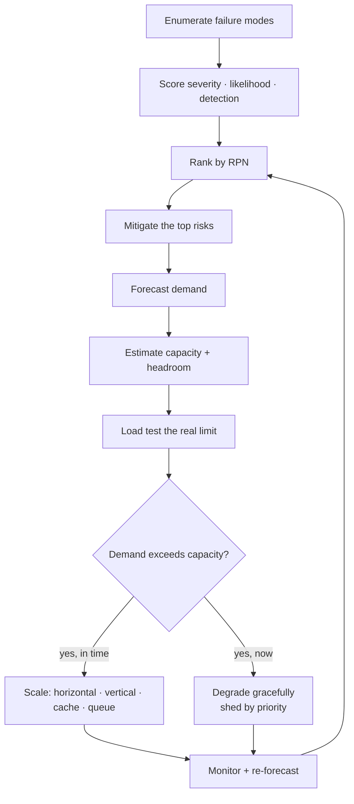

# Failure-Mode Analysis, Capacity Planning, and Scaling

> **Interview answer (say this first).** Three connected disciplines. **Failure-mode analysis** asks, systematically, how each component can fail, what the effect would be, how likely it is, how fast you would detect it, and what you will do about it — FMEA is the standard form, and the risk ranking is severity × likelihood × detection difficulty. AI adds its own failure modes: model outage, provider rate limits, hallucination spikes, cost blow-ups, retrieval degradation, and runaway agents. **Capacity planning** forecasts demand, adds headroom, and validates the plan with load tests, because an untested capacity number is a guess. **Scaling** is how you meet that demand: horizontal and vertical scaling for compute, caching for repeated work, routing for the right model, queueing for bursts, and autoscaling. When you cannot scale fast enough, you degrade gracefully and shed load by priority instead of failing for everyone. The result is a system that bends under pressure rather than breaking.

> **Note:**
>
> **Verified.** Every runnable example on this page was executed offline in plain Python (Python 3.14). No model or cloud calls were made, and no vendor prices or guarantees are asserted. Capacity and queueing numbers are arithmetic on values you supply, not predictions.

## Why this exists

Systems fail in ways their designers did not imagine. A component has no obvious bug, so nobody thinks about it; a dependency has a bad day; a feature interacts with another in a way the tests never covered. Failure-mode analysis is the habit of imagining the failures before they happen, and ranking them so you fix the ones that matter.

Capacity is the other half. A system that works beautifully at a hundred requests a second can fall over at a thousand. The failure is not dramatic; latency rises, queues fill, retries multiply, and the whole thing tips. Capacity planning is how you know where the cliff is before you walk off it.

AI systems make both harder. The **cost** of a request is variable and can spike if a prompt bloats or an agent loops; **quality** can degrade while every metric looks green, so detection is its own failure mode; **provider limits** are outside your control and arrive as sudden errors or throttling; **agent loops** can consume resources without bound; and **retrieval** can degrade silently when an index or a source goes stale. This chapter is the proof step in the architecture loop. You have a design and a trade-off; now you show what breaks, how much load it takes, and how it behaves when the load exceeds the plan.

> **The one-sentence purpose.** Enumerate the ways the system can fail, rank them by risk, plan capacity with measured headroom, and design the scaling and degradation behaviour so overload is a slow bend, not a cliff.

## Start from zero

| Word | Plain meaning |
| --- | --- |
| **Failure mode** | A specific way a component or system can fail. |
| **FMEA** | Failure Mode and Effects Analysis: a table of failures, effects, and mitigations. |
| **Severity** | How bad the effect is, usually on a 1 to 5 scale. |
| **Likelihood (occurrence)** | How often the failure is expected to happen, 1 to 5. |
| **Detection** | How hard the failure is to notice; in FMEA, a high number means hard to detect. |
| **RPN** | Risk Priority Number: severity × likelihood × detection, used to rank. |
| **Mitigation** | The change that reduces severity, likelihood, or detection difficulty. |
| **Capacity** | The load a system can handle while meeting its targets. |
| **Throughput** | Work completed per unit of time, such as requests per second. |
| **Latency** | Time from request to response, usually quoted as p50 and p95. |
| **Utilization** | The fraction of capacity in use; high utilization makes latency shoot up. |
| **Headroom** | Spare capacity kept in reserve above expected peak. |
| **Forecast** | A prediction of future demand from growth and seasonality. |
| **Load test** | A controlled experiment that drives traffic to measure the real limit. |
| **Benchmark** | A measured baseline for a single component or model. |
| **Horizontal scaling** | Adding more instances of a component. |
| **Vertical scaling** | Making one instance bigger (more CPU, memory, GPU). |
| **Autoscaling** | Adding and removing instances automatically from a metric. |
| **Caching** | Storing a result so repeated work is answered faster. |
| **Queueing** | Holding work until capacity is free, converting a spike into a wait. |
| **Backpressure** | Telling upstream senders to slow down when you are saturated. |
| **Graceful degradation** | Serving a reduced feature set instead of failing. |
| **Load shedding** | Deliberately rejecting low-priority work to protect high-priority work. |
| **Runaway agent** | An agent that loops or acts without a bound, consuming resources. |

Three distinctions matter most:

- **Capacity vs headroom.** Capacity is what the system can do; headroom is the margin you keep between normal peak and that limit, so a spike or a lost instance does not immediately break you.
- **Scaling vs degradation.** Scaling adds resources to meet demand; degradation reduces work to fit available resources. You need both, because scaling has a ceiling and a delay.
- **Detection vs severity in FMEA.** A high-severity failure you notice instantly is less dangerous than a medium-severity failure you notice in a week. The detection score is what makes AI quality failures rank high.

## The core idea

Think of a bridge engineer, not a driver.

A driver assumes the bridge will hold. An engineer asks different questions: what loads will it carry, what is the worst storm, what happens if one cable corrodes, how would we notice, and what is the safety margin? The bridge is designed for the worst credible case with margin, and inspected on a schedule.

Failure-mode analysis and capacity planning are that discipline for software: the **load rating** is your capacity and headroom, the **storm** is your peak traffic and a dependency outage, the **corroded cable** is your single point of failure and your silent quality drift, the **inspection** is monitoring and detection, and the **safety margin** is graceful degradation and load shedding.

The central insight is that **reliability work should be aimed by risk, not by intuition**. FMEA produces a ranked list; the top of that list is where the next engineering hour goes. If you fix the interesting-looking problem instead of the highest-risk one, you have worked hard and moved the risk very little.



The loop matters: failure modes are re-ranked after each mitigation, and the capacity plan is re-forecast after each measurement. An architecture is never finished.

The AI failure-mode table is the one to memorise, because these are the failures that normal monitoring misses:

| Failure mode | Effect | Likely cause | Detection signal |
| --- | --- | --- | --- |
| **Model outage** | Requests fail or stall | Provider incident, region loss | Error rate, timeout rate |
| **Provider rate limit** | Throttling, retries, latency spike | Traffic growth, shared quota | 429s, retry rate, queue depth |
| **Hallucination spike** | Wrong answers, trust damage | Prompt change, model update, bad retrieval | Quality SLI, user reports |
| **Cost blow-up** | Budget burn, margin loss | Prompt bloat, long context, loops | Spend rate vs baseline |
| **Retrieval degradation** | Ungrounded answers | Stale index, embedding drift, source outage | Recall proxy, grounding rate |
| **Runaway agent** | Unbounded spend and side effects | Loop, no turn limit, tool error loop | Turn count, duration, tool-call rate |
| **Queue saturation** | Rising latency, timeouts | Demand above capacity, slow worker | Queue depth, p95 latency |
| **Cache stampede** | Origin overload on cache miss | Cache expiry alignment | Miss rate, origin load |

Read the detection column: several of these produce no error at all, which is why AI capacity planning includes quality and cost signals, not just CPU and error rate.

> **The mental model in one line.** Rank failures by risk, plan capacity with measured headroom, and let overload degrade the least important work first.

## How it works

1. **Enumerate failure modes per component.** Go down the request path and ask "how can this fail?" Include dependencies, data, configuration, and human steps. For AI, include the provider, the model, the retrieval index, the cost, and the agent loop.
2. **Score and rank the modes.** Rate each on severity, likelihood, and detection with a consistent 1 to 5 scale, and multiply them into an RPN. A high detection score means hard to notice, which makes silent quality failures rank high; sanity-check the order against intuition.
3. **Assign a mitigation to the top risks.** Reduce severity, reduce likelihood, or improve detection. Improving detection is often the cheapest win, because a failure you see in minutes is far less costly than one you see in days.
4. **Forecast demand.** Start from current traffic and growth, add seasonality and known events, and express the result as a peak, not an average. Peaks drive capacity.
5. **Set a utilization target, headroom, and instance count.** Running hot makes latency rise sharply, so choose a target below the point where the curve turns, keep margin for a lost instance and a spike, then divide peak demand by per-instance capacity at that target and round up with a redundancy floor.
6. **Load test the whole path, then choose scaling per layer.** Benchmarks are per-component; load tests exercise the model calls, retrieval, and queueing together. Then scale stateless services horizontally, databases vertically or by sharding, repeated work from cache, traffic by routing, and bursts with queues.
7. **Design graceful degradation and load shedding by priority.** Decide what the system serves when a dependency is slow or absent — a smaller model, cached answers, a partial feature, an honest error — and reserve capacity for the most important work so batch is shed before safety-critical traffic.
8. **Monitor, re-forecast, and re-rank.** Track utilization, latency, queue depth, cost rate, and quality. When a measurement contradicts the plan, update the forecast and the FMEA, and repeat.

> **The working rule.** A capacity number you have not measured under load is a guess, and a failure mode with no detection signal is one you will discover from a customer.

## The syntax you will use

These are real production forms. Read them once; each is a control or a measurement.

**1. An FMEA table with scores and a mitigation.** The output of the analysis, owned and actionable.

```yaml
# fmea/rag-service.yaml
- mode: hallucination_spike
  severity: 5          # wrong answers damage trust
  likelihood: 2
  detection: 5         # silent, no error code
  mitigation: "online faithfulness SLI + canary prompts"
- mode: provider_rate_limit
  severity: 3
  likelihood: 5
  detection: 2
  mitigation: "second provider + queue + backpressure"
```

The mitigation column is the point. An FMEA with no owner for the mitigation is a worry list.

**2. A capacity model.** Peak demand divided by per-instance capacity at target utilization.

```text
peak_rps        = 1500          # forecast peak, not average
per_instance    = 100 rps       # measured safe throughput
target_util     = 0.7           # keep 30% headroom
required        = ceil(1500 / (100 * 0.7)) = 22
min_replicas    = 2             # redundancy floor
```

Write the inputs next to the number so the next person can re-run it when something changes.

**3. A load-test profile.** Ramp, hold, and spike, to find the knee and test recovery.

```yaml
# loadtest/chat-api.yaml
stages:
  - { duration: 5m,  target: 200 }    # warm up
  - { duration: 10m, target: 1000 }   # expected peak
  - { duration: 5m,  target: 2000 }   # headroom test
  - { duration: 2m,  target: 3000 }   # find the knee
  - { duration: 5m,  target: 500 }    # recovery
thresholds:
  p95_ms: 2000
  error_rate: 0.01
```

The spike stage is what tells you where the cliff is; the recovery stage tells you whether the system comes back cleanly.

**4. A load-shedding rule by priority.** Reserve capacity for the work that must survive.

```python
def shed_decision(priority, load_fraction):
    if load_fraction < 0.8:
        return "accept"
    if priority <= 1:
        return "accept (reserved capacity)"
    if priority == 2:
        return "degrade" if load_fraction < 0.95 else "shed"
    return "shed"
```

Priority 1 is safety-critical and keeps a reserved lane; priority 3 is batch and is shed first.

**5. An autoscaling policy from the right signal.** Scale on the metric that reflects real pressure.

```yaml
# autoscaling on queue depth, not just CPU
scale:
  metric: queue_depth_per_worker
  target: 5
  min: 2
  max: 40
  scale_up_cooldown: 60s
  scale_down_cooldown: 300s
```

For AI workers, queue depth or in-flight model calls usually tracks load better than CPU, because the work is I/O and model-bound. A cost breaker is the same idea for spend: trip when today's spend reaches the budget or the rate exceeds several times baseline, and disable agent tools until a human clears it.

## Examples: simple to real

These examples are plain standard library and print deterministic results.

**Example 1 — ranking failure modes by RPN.** Severity × likelihood × detection gives a prioritised list.

```python
def rpn(failure):
    return failure["severity"] * failure["occurrence"] * failure["detection"]

def rank_failures(failures):
    ranked = [{"mode": f["mode"], "rpn": rpn(f)} for f in failures]
    return sorted(ranked, key=lambda x: -x["rpn"])

FAILURES = [
    {"mode": "model-outage", "severity": 5, "occurrence": 3, "detection": 2},
    {"mode": "provider-rate-limit", "severity": 3, "occurrence": 5, "detection": 2},
    {"mode": "hallucination-spike", "severity": 5, "occurrence": 2, "detection": 5},
    {"mode": "cost-blowup", "severity": 3, "occurrence": 3, "detection": 4},
    {"mode": "retrieval-degradation", "severity": 4, "occurrence": 2, "detection": 5},
    {"mode": "runaway-agent", "severity": 4, "occurrence": 2, "detection": 4},
]

for row in rank_failures(FAILURES)[:4]:
    print(row)
```

Illustrative output:

```text
{'mode': 'hallucination-spike', 'rpn': 50}
{'mode': 'retrieval-degradation', 'rpn': 40}
{'mode': 'cost-blowup', 'rpn': 36}
{'mode': 'runaway-agent', 'rpn': 32}
```

Hallucination and retrieval degradation rank highest, even though a model outage looks scarier, because they are silent. **The detection score is what puts silent AI failures at the top, where they belong.**

**Example 2 — turning RPN into a risk band.** Thresholds make the ranking operable.

```python
FAILURES = [
    {"mode": "model-outage", "severity": 5, "occurrence": 3, "detection": 2},
    {"mode": "provider-rate-limit", "severity": 3, "occurrence": 5, "detection": 2},
    {"mode": "hallucination-spike", "severity": 5, "occurrence": 2, "detection": 5},
    {"mode": "cost-blowup", "severity": 3, "occurrence": 3, "detection": 4},
    {"mode": "retrieval-degradation", "severity": 4, "occurrence": 2, "detection": 5},
    {"mode": "runaway-agent", "severity": 4, "occurrence": 2, "detection": 4},
]
ranked = sorted(FAILURES, key=lambda f: -(
    f["severity"] * f["occurrence"] * f["detection"]))

def risk_band(score, high=50, medium=35):
    if score >= high:
        return "high"
    if score >= medium:
        return "medium"
    return "low"

for f in ranked[:4]:
    score = f["severity"] * f["occurrence"] * f["detection"]
    print(f["mode"], score, risk_band(score))
```

Illustrative output:

```text
hallucination-spike 50 high
retrieval-degradation 40 medium
cost-blowup 36 medium
runaway-agent 32 low
```

Bands turn a long list into a short work queue. **The thresholds are policy: choose them so the "high" band fits the team's actual capacity to act.**

**Example 3 — months until capacity is exhausted.** Growth plus headroom gives a planning horizon.

```python
def months_to_limit(current, growth_per_month, capacity, headroom=0.3):
    usable = capacity * (1 - headroom)
    if growth_per_month <= 0 or current >= usable:
        return 0.0
    return round((usable - current) / growth_per_month, 1)

print("grow-15%", months_to_limit(1000, 150, 5000))
print("grow-300", months_to_limit(1000, 300, 5000))
print("no-growth", months_to_limit(1000, 0, 5000))
```

Illustrative output:

```text
grow-15% 16.7
grow-300 8.3
no-growth 0.0
```

Keeping 30% headroom means usable capacity is 3500, not 5000. **A plan without a deadline is not a plan; the horizon tells you when to act.**

**Example 4 — required replicas for a target utilization.** The number you put in the autoscaling policy.

```python
import math

def replicas_for(peak_rps, per_replica_rps, target_utilization=0.7, min_replicas=2):
    needed = math.ceil(peak_rps / (per_replica_rps * target_utilization))
    return max(needed, min_replicas)

print(replicas_for(500, 100))
print(replicas_for(1500, 100))
print(replicas_for(50, 100))
```

Illustrative output:

```text
8
22
2
```

The minimum of two exists for redundancy, not capacity. **Round up and apply the floor, because half a replica is not a thing and one replica is a SPOF.**

**Example 5 — load shedding by priority.** When capacity runs short, decide who loses.

```python
def shed_decision(priority, load_fraction):
    if load_fraction < 0.8:
        return "accept"
    if priority <= 1:
        return "accept (reserved capacity)"
    if priority == 2:
        return "degrade" if load_fraction < 0.95 else "shed"
    return "shed"

for load in (0.6, 0.85, 0.97):
    print(load, [shed_decision(p, load) for p in (1, 2, 3)])
```

Illustrative output:

```text
0.6 ['accept', 'accept', 'accept']
0.85 ['accept (reserved capacity)', 'degrade', 'shed']
0.97 ['accept (reserved capacity)', 'shed', 'shed']
```

At 97% load, only the reserved class survives. **Choosing who loses in advance turns an overload from a crash into a controlled, explainable decision.**

**Example 6 — why utilization must stay below the knee.** Queue wait grows non-linearly as utilization approaches 1.

```python
def mm1(arrival_rate_per_sec, service_time_sec):
    rho = arrival_rate_per_sec * service_time_sec
    if rho >= 1:
        return round(rho, 3), None
    wait = service_time_sec * rho / (1 - rho)
    total = wait + service_time_sec
    return round(rho, 3), round(total, 3)

for rate in (80, 90, 95):
    print(rate, mm1(rate, 0.01))
```

Illustrative output:

```text
80 (0.8, 0.05)
90 (0.9, 0.1)
95 (0.95, 0.2)
```

This is a simple single-server queue illustration, useful for the shape, not for precise prediction. **Going from 90% to 95% utilization doubles the response time — which is why headroom is a design choice, not waste.**

## In production

- **Rank risk, then spend by rank.** FMEA is only useful if the top of the list gets the next engineering hour. A beautiful table with no prioritised action changes nothing.
- **Improve detection first when it is cheap, and watch cost as a capacity signal.** Most silent AI failures are cheap to observe — sample quality, watch grounding rate, alert on spend rate — and money per minute is a real resource, because a spend-rate alert catches runaway agents and prompt bloat that no CPU graph will show.
- **Forecast peaks, and keep headroom below the knee.** Capacity is set by the busiest minute of the busiest day, not the mean, and latency rises sharply as utilization approaches saturation. Running hot to save money usually costs more in timeouts, retries, and incidents than the spare capacity would have cost.
- **Load test the whole path, and scale on the right signal.** A per-component benchmark misses the interaction of retrieval, model, and queue, and the system limit is usually lower than the sum of the parts. For model and tool workers, queue depth or in-flight requests tracks load better than CPU, because the work is I/O-bound and variable; wrong signals cause oscillation.
- **Cache the repeated work, and queue bursts with a bound.** Agent and RAG traffic repeats prompts and retrievals, so caching helps a lot, but synchronised expiry can send a wave at the origin, so add jitter and a single-flight lock. A queue converts a spike into a wait, which beats a crash, but an unbounded queue turns it into a timeout, so set a maximum depth and shed past it.
- **Decide degradation before you need it.** Prefer a smaller model, cached answers, or a partial feature over a hard failure, and tell the user what changed. Ad-hoc fallbacks under pressure are where correctness bugs enter.
- **Shed by priority with a reserved lane.** Never let batch jobs starve interactive or safety-critical work. Reserve capacity explicitly, and make the shedding rule visible so it can be explained afterward.
- **Re-forecast after every incident and launch.** Reality updates the model. A capacity plan that is not revisited after a spike is already stale.

## Interview questions

### 1. How do you decide which failure modes to work on?

**Answer.** Enumerate the modes per component, score each on severity, likelihood, and detection difficulty, and rank by the product. Then mitigate from the top: reduce the severity, reduce the likelihood, or improve detection. For AI systems, include the silent modes — hallucination, retrieval degradation, cost blow-up, runaway agents — because their detection scores are high and that moves them up the list even when severity looks moderate.

**Follow-up: "Why include detection in the score?"** Because an undetected failure compounds: it harms users longer, and you learn about it too late to limit the damage. A medium-severity failure you cannot see is often worse in practice than a severe one you catch immediately.

**Trap.** Ranking by severity alone. The scariest failure is not always the most expensive one; the silent, frequent, hard-to-detect one usually is.

### 2. What is the difference between capacity and headroom, and how much headroom do you keep?

**Answer.** Capacity is the load the system can handle while meeting its targets; headroom is the margin between expected peak and that limit. You keep headroom so a spike, a lost instance, or a slow dependency does not push you into the non-linear region where latency and errors climb. The amount is a design decision: many teams target around 60 to 70% utilization at peak, which leaves room for one instance to fail and for normal variance, and reduce it only with evidence from load tests.

**Follow-up: "How do you validate the choice?"** With a load test that ramps past the expected peak and records where p95 latency and error rate bend upward. The knee is your real limit, and headroom is the distance you choose to keep below it.

**Trap.** Treating headroom as waste and running at 95% to save money. The savings are usually smaller than the cost of the timeouts and incidents that follow.

### 3. How do you do capacity planning for an LLM-based system?

**Answer.** Model the request path: retrieval, model call, tools, and any queue. Forecast peak requests per second, then convert to load on each layer using measured per-request cost — tokens, model latency, and tool calls. Size the model and tool workers with headroom, keep a queue to absorb bursts, and watch cost rate as a first-class capacity metric because token spend scales with traffic and prompt size. Then load test, because model latency and provider limits are the parts you cannot predict from a spreadsheet.

**Follow-up: "What is the hardest part to plan?"** Provider rate limits and model latency variance. You do not control them, so plan for a fallback model, a queue, and backpressure, and measure your own consumption against the quota you have.

**Trap.** Planning only for request count. Two requests can differ a hundredfold in tokens and latency, so token or cost-based capacity is often the truer measure.

### 4. What scaling strategies do you use, and when?

**Answer.** Horizontal scaling for stateless services — add instances behind a load balancer. Vertical scaling for stateful components that cannot shard easily, or for GPU-bound inference where a bigger card serves more. Caching for repeated work such as identical prompts or retrievals, with jitter to avoid stampede. Routing to send simple requests to a cheaper, faster model and hard ones to a stronger model. Queueing to absorb bursts and decouple producers from workers. Autoscaling on queue depth or in-flight work rather than CPU for I/O-bound AI workers.

**Follow-up: "When does horizontal scaling not help?"** When a shared bottleneck is downstream — one database, one provider quota, one vector index. Adding app replicas then just moves the queue. Find and scale the actual bottleneck.

**Trap.** Adding replicas to fix a problem caused by a shared dependency. You pay for capacity that still cannot get past the bottleneck.

### 5. What is graceful degradation, and how do you design it?

**Answer.** It is serving a reduced but useful experience instead of failing when a dependency is impaired. Design it by pre-deciding the fallback for each dependency: route to a fallback model, serve cached answers with a "reduced quality" note, answer ungrounded with an "unverified" label, or disable agent tools and keep read-only answers. The fallback is chosen for correctness, not just availability, and the user is told what changed. The decision is made in design, not improvised in an incident.

**Follow-up: "How do you avoid degradation hiding a real outage?"** Emit a clear degraded-mode metric, alert when the fallback is active, and treat a long-running degraded mode as an incident. Degradation is a bridge, not a destination.

**Trap.** Degrading silently without telling anyone. Users then trust reduced-quality answers, and the team loses the signal that something is wrong.

### 6. How does load shedding work, and what should never be shed?

**Answer.** Define priority classes and a rule for what happens as load rises: accept everything below a threshold, start degrading low-priority work, then shed it as load approaches capacity, while reserving a lane for the highest priority. Batch and analytics jobs go first. Safety-critical paths, and usually interactive customer paths, are protected. The rule is written down and testable, so the behaviour under stress is predictable and can be explained afterward.

**Follow-up: "Why not just let everything slow down together?"** Because shared slowdown turns into timeouts and cascading retries, which make the overload worse. Shedding a defined slice keeps the critical path fast and the system stable.

**Trap.** Having no priority classes, so under pressure the system drops whatever arrives last. Random shedding damages the most important users by accident.

### 7. How do you find the real capacity limit of an AI system?

**Answer.** Load test the whole path with a realistic traffic mix, not a synthetic uniform load, because AI cost and latency vary with input. Ramp through expected peak, past it, to the knee where latency and errors bend upward; measure p95 latency, error rate, queue depth, token throughput, and cost rate. Then test the failure paths: what happens when the primary model is slow, when the provider throttles, and when the cache misses in unison. The limit you find is the system limit, which is usually below the sum of the component benchmarks.

**Follow-up: "What is the difference between a benchmark and a load test?"** A benchmark measures one component in isolation; a load test measures the system under concurrent, realistic traffic. Benchmarks inform the model; only a load test validates it.

**Trap.** Load testing with clean, uniform inputs. Real traffic is long, messy, and variable, and that is what pushes the system past its limit.

### 8. How do you plan for demand growth?

**Answer.** Forecast from current traffic and growth rate, add known seasonality and events, and express the result as peak load per layer. Compute months until the usable capacity is exhausted, accounting for headroom, and use that horizon to schedule scaling work. Re-forecast after launches and incidents, because growth is rarely smooth and a new feature can step-change demand. Where growth is uncertain, prefer architectures that scale horizontally and cheaply, and keep the spike path tested.

**Follow-up: "What if growth is faster than you can scale?"** Degrade and shed by priority while you scale, and use caching and queueing to buy time. If the trend is durable, the fix is architectural — shard the data layer, add provider capacity, or split workloads — and it needs lead time, which is why the horizon matters.

**Trap.** Planning capacity as a one-time exercise. Demand, model prices, and provider limits all move; a stale plan gives false confidence.

## Remember this

- **Rank failures by risk, then act on the top.** Score severity, likelihood, and detection, and let the ranking choose the work.
- **Detection is a first-class control.** Silent AI failures — hallucination, retrieval drift, cost blow-up — rank high precisely because you cannot see them.
- **Headroom is a design choice.** Latency rises sharply near saturation, so keep margin below the knee and size for failover, not just for average load.
- **Scale on the real bottleneck.** Know the shared dependency before adding replicas, and pick autoscaling signals that track actual pressure.
- **Overload should bend, not break.** Design graceful degradation and priority-based load shedding before you need them, so the critical path survives.
