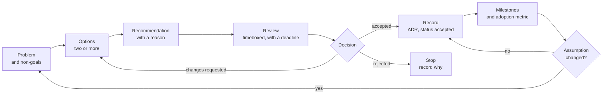
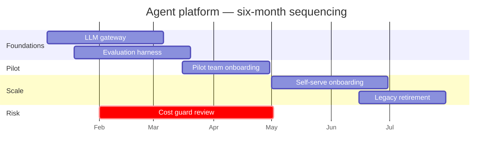

# RFCs, Design Reviews, and Technical Strategy

> **Interview answer (say this first).** An **RFC** (request for comments) is a written proposal that lets other teams review a decision before it is made. A **design review** is the timeboxed meeting that resolves the disagreement and ends in a decision, not a debate. An **ADR** (architecture decision record) captures that decision, its reason, and its consequence, so it survives the people who made it. **Technical strategy** is the same discipline at a larger scale: pick a direction, sequence it into milestones, name the risks, and measure adoption. The rules are: write it down, offer at least two alternatives, name one decision owner, disagree and commit, and say what evidence would change your mind.

## Why this exists

A design is agreed in a meeting. Everyone nods. Nobody writes it down.

Six months later, three teams have built incompatible versions. Team A built a synchronous REST contract, because that is what they remembered. Team B built an event stream, because "decoupled" was said twice. Team C built a nightly file drop, because that is what the first draft of the diagram showed. Each team is locally correct. Each followed a different memory of the same meeting. Integration now costs a quarter of rework, and the argument restarts from zero because there is no record of what was actually decided.

The failure was not the choice. It was the missing review and the missing record. Two other failures follow from the same gap:

- **The loudest voice wins.** With no written proposal, the most senior or most confident person decides, and the reasoning nobody can see never gets tested. A quiet engineer with the right objection says nothing, because there is nothing to comment on.
- **Strategy becomes aspiration.** "We will be AI-first" has no milestones, no risks, and no measure of whether it is happening. Twelve months later the same sentence is repeated with no evidence either way.

Writing and review are not bureaucracy. They are how a group of people larger than one meeting agrees on the same thing, and how the reasoning survives a reorganisation.

## Start from zero

| Word | Plain meaning |
| --- | --- |
| **RFC** | Request for comments: a written proposal circulated for review before a decision. |
| **Design doc** | The detailed technical plan for one system: components, data flow, interfaces, failure plan. |
| **ADR** | Architecture decision record: a one-page note of one decision, its context, and its consequences. |
| **Decision record** | The general term for any written decision, of which an ADR is the common form. |
| **Design review** | A scheduled, timeboxed meeting that examines a proposal and reaches a decision. |
| **Status** | The state of a document. An RFC moves through `draft`, `review`, `accepted`, `superseded`; an ADR uses `proposed`, `accepted`, `deprecated`, `superseded`. |
| **Alternatives considered** | The options that were rejected, and the reason each one lost. |
| **Trade-off** | Gaining one property by giving up another, such as speed for control. |
| **Non-goals** | Explicitly out of scope; the list that stops scope creep. |
| **Spike** | A short, timeboxed investigation that answers one uncertain question with evidence. |
| **Technical strategy** | A multi-quarter direction shared by several teams, not a single system. |
| **Sequencing** | The order in which work happens, and why that order and not another. |
| **Roadmap** | An ordered, usually dated view of what ships next. |
| **Milestone** | A checkpoint with a clear finish and an exit criterion. |
| **Risk register** | A list of known risks, each with an owner and a mitigation. |
| **Adoption metric** | A measure that the intended users actually use the thing, not just that it exists. |
| **Consensus** | Everyone agrees. Slow, and often impossible on a real technical decision. |
| **Consent** | Nobody has a principled objection, so the owner decides and objectors commit. |
| **Escalation** | Raising a blocked decision to a named owner who can break the tie. |
| **Decision owner** | The single person accountable for the decision; modelled by **RAPID** or **DACI**. |
| **RAPID** | Recommend, Agree, Perform, Input, Decide: a way to name who does what in a decision. |
| **DACI** | Driver, Approver, Contributor, Informed: the same idea with different labels. |

Three distinctions matter most:

- **Proposal vs record.** An RFC argues for something before the decision; an ADR records what was decided after it. They are different documents with different tenses.
- **Consensus vs consent.** Consensus needs everyone to agree, which stalls on any strong objection. Consent needs no principled objection, and lets an owner decide. Most healthy teams run on consent.
- **Decision owner vs contributor.** Many people give input; one person owns the outcome. If the owner is unclear, the decision is unclear, and it will be re-litigated.

## The core idea

Think of a decision as a **shared artefact**, not a meeting. A meeting leaves each person with a private copy of the outcome; an artefact leaves everyone with the same copy.

A useful analogy is a planning application. The **RFC** is the application: the proposal, the alternatives, and why this one. The **design review** is the planning committee: a timeboxed session that approves, rejects, or asks for changes. The **ADR** is the approved permit kept on file, so anyone can see what was built and under what conditions. The **strategy** is the local plan: which buildings go up, in what order, and what the town is trying to become.

The lifecycle is always the same.



The loop back is the part teams skip. A decision is made against assumptions. When an assumption breaks, you go around again with a new record — you do not quietly ignore the old one.

Five document types cover most needs. They differ by audience and length, not by prestige.

| Document | Question it answers | Audience | Length |
| --- | --- | --- | --- |
| **RFC** | "Should we do this, and roughly how?" | Reviewers across teams | 3–10 pages |
| **Design doc** | "How exactly will we build it?" | The implementing team | 5–20 pages |
| **ADR** | "What did we decide, and why?" | Any future engineer | 1 page |
| **Strategy** | "Where are we going, in what order, and why?" | Leadership and all teams | 2–5 pages |
| **Decision log** | "What is the current state of every decision?" | Everyone, as an index | One row each |

> **Disagree and commit.** Once the decision is recorded, everyone supports it, including the people who argued for another option. Disagreement belongs in the review and in the record; it does not belong in the implementation. If the evidence changes, the route is not quiet non-compliance — it is a new RFC that supersedes the old decision. That is how a decision is reversed: with a record, not a rumour.

## How it works

1. **Frame the problem and the non-goals.** State what is broken, who feels it, and what "solved" looks like. Then state what the proposal will *not* do. Non-goals are the cheapest way to end an argument about scope before it starts. "This RFC does not change the data model" kills a week of tangential debate.
2. **List at least two real alternatives with trade-offs.** One option is not a decision; it is an announcement. Two is the minimum. Include the status quo ("do nothing"), because a change has to be worth its migration cost. For each option, write what you gain and what you give up.
3. **Make a recommendation with a reason.** Say which option you recommend and why, in one sentence a busy reader can repeat. "I recommend option 2 because it meets the latency budget without new on-call, and the extra cost is within the agreed ceiling."
4. **Circulate for review with a deadline.** Send the RFC to named reviewers and give a date. A review with no deadline never closes. State what you need: approval, or a specific objection.
5. **Run the review: timeboxed, decisions not debates.** The chair keeps the clock, walks the alternatives, and calls for a decision. Disagreements about facts become a **spike** — a short investigation with an owner and a date. Disagreements about taste get resolved by the decision owner, not by more discussion.
6. **Record the decision and its status.** Write the ADR with context, decision, consequences, alternatives, and a status (`proposed`, `accepted`, `deprecated`, or `superseded`). Link it from the RFC and from the code it affects. "Accepted" means the team will follow it; "superseded" means a newer decision replaced it.
7. **Sequence a strategy into milestones with risks.** A strategy is not a goal; it is an order of operations. Break it into milestones, each with a finish line. Keep a **risk register**: what could stop it, who owns the risk, and what reduces it. Unsequenced strategy is just a wish list.
8. **Measure adoption.** Report the metric that shows people are actually using the result — traffic share, number of teams migrated, time to first deploy. A platform that exists but is unused has failed, regardless of its internal quality.
9. **Revisit when the assumptions change.** Each record names the trigger that would reopen it. When the trigger fires, re-run the loop and write a new record that supersedes the old one. Say out loud what would change your mind; that is what separates a decision from a belief.

> **The working rule.** If the decision is not written down, it was not decided. It is a shared assumption, and shared assumptions drift apart.

## The syntax you will use

This section is templates. Copy the shape, keep it short enough that people read it.

**An RFC template, filled in.** The sections are the argument: problem, options, recommendation, trade-offs, risks, rollout.

```markdown
# RFC-014: Adopt one structured-logging library for all Python services

- **Author:** Priya Raman (platform)
- **Status:** review
- **Review by:** 2026-05-08
- **Decision owner:** platform lead (accepts or rejects)
- **Non-goals:** log storage, log retention, the log viewer UI

## Problem
Six services configure logging differently. Two emit JSON; four emit plain
text with a different key for the request id. Incident response cannot join
logs across services, and each new service copies an existing config.

## Options
1. **Standard library `logging` with a shared config module.** No new
   dependency; each team changes two lines. Lowest migration cost.
2. **A third-party structured logger.** Better ergonomics and context
   binding; one new dependency and a learning curve for every team.

## Recommendation
Option 1, because the requirement is a shared schema, not a new logging API.
The shared module fixes the keys and the JSON shape. We can adopt the
third-party library later behind the same module if teams ask for features.

## Trade-offs
- We keep the familiar API; we give up context binding and processors.
- Migration is mechanical and reviewable; a test enforces the schema.
- If the module becomes a bottleneck, the richer option is still open.

## Risks
- Teams ignore the module and keep local config. Mitigation: a lint rule and
  a schema test in the shared CI template.

## Rollout
Ship the module in week 1, migrate one service per team by week 4, delete
the old configs in week 6.
```

The `Review by` date and the named `Decision owner` are the two lines that make an RFC real. Without them it is a blog post.

**An ADR template.** One decision, its consequence, and the condition that would reopen it.

```markdown
# ADR-0031: Route all model calls through one LLM gateway

- Status: accepted
- Date: 2026-09-14
- Deciders: platform lead, security reviewer, support eng lead

## Context
Three products call model providers directly. Each has its own keys and
retry logic. We cannot enforce a spend cap, rotate a provider, or see one
usage view. Two teams need the same fallback behaviour.

## Decision
All model calls go through one internal LLM gateway. The gateway owns
credentials, quotas, routing, retries, caching, and the audit log. Services
call the gateway, never a provider.

## Consequences
+ One place to rotate keys, cap spend, and swap a provider.
+ One audit trail for compliance and one usage dashboard.
- The gateway is now on the critical path and needs its own SLO and on-call.
- A gateway bug can affect every product at once.

## Alternatives considered
- Per-team gateways: less coupling, but we repeat the same work three times
  and still cannot see total spend.
- Direct calls with a shared library: cheapest now, but a library cannot
  enforce a quota or fail over at run time.

## Revisit if
Gateway p95 exceeds 50 ms of added latency, or the gateway is the top cause
of incidents for two quarters in a row.
```

**A decision log.** A one-row-per-decision index that answers "what is true now?".

```markdown
| ID | Date | Decision | ADR | Owner | Status | Revisit trigger |
| --- | --- | --- | --- | --- | --- | --- |
| D-014 | 2026-05-15 | Standardise on one structured-logging module | ADR-0029 | Platform lead | accepted | Teams need context binding |
| D-021 | 2026-09-14 | One LLM gateway for all model calls | ADR-0031 | Platform lead | accepted | Gateway p95 > 50 ms |
| D-027 | 2026-06-10 | No fine-tuning in v1; use retrieval | ADR-0033 | ML lead | accepted | Recall below 0.8 after tuning |
| D-032 | 2026-06-28 | Self-host the embedding model | ADR-0034 | ML lead | superseded by D-041 | Provider price change |
| D-041 | 2026-07-20 | Keep the managed embedding API | ADR-0035 | ML lead | accepted | Price above $0.0001 per 1k tokens |
```

The log is not the decision; the linked ADR is. The log is the map, so it must carry the ADR link.

**A one-paragraph strategy statement.** Direction, why now, what changes, sequence, measure, and the condition that would change it.

```markdown
## Strategy

**Direction.** By Q2 next year, every product team builds agents on one
shared platform instead of embedding its own orchestration.

**Why now.** Three teams are duplicating retrieval, evaluation, and
guardrails, and that duplication is our main source of quality escapes.

**What changes.** Teams own their prompts, tools, and domain logic. The
platform owns the runtime, the evaluation harness, the gateway, and the
guardrails.

**How we sequence it.** Q1: gateway and evaluation harness. Q2: one pilot
team on the platform. Q3: self-serve onboarding for every team. Q4: retire
the legacy orchestration library.

**How we measure it.** Share of agent traffic on the platform, time to a
first production agent for a new team, and the quality-gate pass rate.

**What would change the direction.** If two or more teams cannot migrate
without losing a shipped capability, we stop and revisit the platform
boundary.
```

## Examples: simple to real

These build from one decision to a strategy to a reversal. They are written documents, because that is what the job produces.

**Example 1 — an RFC with two alternatives and a recommendation.** The core unit of technical leadership.

```markdown
# RFC-021: One shared evaluation harness for all agent teams

- Author: Sam Okafor (ML platform) · Status: review · Review by: 2026-06-12
- Decision owner: ML platform lead

## Problem
Four teams evaluate their agents differently. Two have no regression test at
all. A prompt change that helps one team silently breaks another team that
shares the same model. We cannot compare quality across teams, and we cannot
tell whether the platform is getting better or worse.

## Options
1. **Build a small in-house harness.** A curated golden set per team, a
   scorer interface, and a CI job that blocks a merge on a quality drop.
   Cost: about six engineer-weeks plus ongoing ownership.
2. **Buy an evaluation SaaS.** Faster to start and no on-call. Cost: a
   per-run fee that grows with usage, and prompt data leaves our boundary,
   which compliance has already flagged for one product.
3. **Do nothing.** Each team keeps its own spreadsheet. Zero cost now, but
   the cross-team regressions continue.

## Recommendation
Option 1. The deciding constraint is data residency: option 2 cannot hold
the regulated team's prompts. Option 3 fails the requirement that a quality
regression blocks a merge. Option 1 is the only one that meets both, and the
cost is a one-off six weeks against a recurring class of incidents.

## Trade-offs
- We own the harness and its on-call; we get control and residency.
- Building is slower to first value than buying; we ship a minimal version
  in three weeks so the value arrives before the polish.
- A golden set is only as good as its curation, so each team owns its set.

## Risks
- Teams treat the golden set as a formality and never update it. Mitigation:
  make the set a review item on every prompt change.

## Rollout
Week 1–3: scorer interface and CI gate. Week 4–6: one golden set per team.
Week 7: required check on the shared CI template.
```

The recommendation is one paragraph with a reason tied to a constraint. A reviewer can agree or object to that reason. That is the point.

**Example 2 — a design review that resolves a disagreement by testing an assumption.** The meeting does not settle the argument; a spike does.

```text
Design review: where does conversation history live?
Attendees: Team A (product chat), Team B (platform data), decision owner: platform lead
Timebox: 45 minutes

Positions on the table
- Team A: keep history in Postgres, where it already is. One less system.
- Team B: move it to a purpose-built store. Postgres will not hold the
  write volume at 3x peak.

The real disagreement is one factual assumption:
  "Postgres cannot sustain our peak write rate."
Nobody has measured it, so the argument cannot be won with opinions.

Decision of the review (not the technical decision): run a spike.
  Owner: Team B. Timebox: 3 days. Budget: one load test on a staging copy.
  Decision rule agreed in advance:
    if Postgres p95 write < 25 ms at 3x peak -> stay on Postgres
    otherwise -> adopt the purpose-built store

Spike result
  3x peak = 1,800 writes/s. Postgres p95 write = 8 ms, p99 = 19 ms.
  Replication lag stayed under 200 ms.

Outcome
  The assumption was false. Stay on Postgres. Recorded as ADR-0052 with the
  spike numbers attached and a revisit trigger of 5x peak.
```

The review resolved the deadlock without either side winning an argument. It replaced an opinion with a testable claim and a pre-agreed decision rule — decided *before* the result was known, so nobody could move the goalposts.

**Example 3 — an ADR that records the decision and its consequence.** The record from Example 2, written so a future engineer can follow it.

```markdown
# ADR-0052: Keep conversation history in Postgres

- Status: accepted · Date: 2026-06-18 · Supersedes: none
- Deciders: platform lead, Team A lead, Team B lead

## Context
Team A wanted to keep conversation history in Postgres. Team B argued that
Postgres would not hold the peak write rate. Neither side had data, so the
review commissioned a load test instead of debating.

## Decision
Keep conversation history in the existing Postgres cluster. Do not add a
purpose-built store this year.

## Evidence
At 3x current peak (1,800 writes/s), Postgres p95 write latency was 8 ms and
p99 was 19 ms, with replication lag under 200 ms. The load test used the
production schema and index set.

## Consequences
+ One database to operate, back up, and secure; no new on-call.
+ Joins between conversation and product data stay local and fast.
- We stay coupled to the Postgres schema for a high-write workload.
- The cluster becomes the scaling bottleneck before a purpose-built store
  would. On-call must watch write latency and replication lag.

## Alternatives considered
- Purpose-built conversation store: better write scaling, rejected because
  the measured headroom made it unnecessary this year.

## Revisit if
Sustained writes exceed 5x current peak, or p95 write latency rises above
25 ms for a week.
```

The **Evidence** section is what makes this record different from an opinion. A reader can see exactly why the decision was safe and exactly when it stops being safe.

**Example 4 — a six-month strategy with milestones, risks, and an adoption metric.** Direction plus order plus measurement.



| Milestone | Finish line | Exit criterion |
| --- | --- | --- |
| M1 — Gateway live | End of month 2 | Two products routed through it, spend cap enforced |
| M2 — Evaluation harness | End of month 2 | One golden set per team; drop in quality blocks a merge |
| M3 — Pilot team | Month 4 | One team ships an agent with no bespoke orchestration |
| M4 — Self-serve | Month 6 | A new team onboards without platform help |

| Risk | Owner | Mitigation |
| --- | --- | --- |
| Gateway becomes a single point of failure | Platform lead | Multi-region deploy; failover runbook tested monthly |
| Teams cannot migrate without losing a feature | Pilot lead | Migration guide written during the pilot, not after |
| Cost per answer rises as usage grows | Finance + platform | Spend cap in the gateway; weekly cost dashboard |

**Adoption metric.** For a platform, the metric is not "we built it". It is the share of agent traffic running on the platform, and the time it takes a new team to ship its first agent. The target was 80% of traffic and under two weeks to first agent by month 6. Without that number, the strategy has no way to fail honestly.

**Example 5 — a decision reversed because the evidence changed.** Reversal is a normal event, not an admission of failure, as long as it is recorded.

```markdown
# ADR-0041: Keep the managed embedding API (supersedes ADR-0032)

- Status: accepted · Date: 2026-06-30 · Supersedes: ADR-0032

## Context
ADR-0032 chose a self-hosted embedding model because it was cheaper at our
projected volume and kept data in our boundary. The projection assumed a
stable provider price and a small operations burden.

Both assumptions changed. The provider cut embedding prices by 60% in June.
Meanwhile the self-hosted model cost more to operate than estimated: one
GPU pool, an on-call rotation, and a re-embedding job that ran three times
longer than planned.

## Decision
Return to the managed embedding API. Retire the self-hosted model and the
GPU pool.

## Consequences
+ Lower total cost at current and projected volume.
+ One less system to operate and page on.
- Prompt and document text leaves our boundary again; covered by the
  provider's data-processing addendum for the unregulated teams.
- The regulated product keeps a small self-hosted model. This decision does
  not apply to it.

## Alternatives considered
- Keep self-hosting: more control, but the measured cost and operations
  burden now exceed the managed option. Rejected.
- Hybrid routing by product: rejected as premature complexity for one
  regulated product.

## Revisit if
The managed price rises above $0.0001 per 1k tokens, or a new regulation
extends residency to all products.
```

Two things make the reversal honest. First, it names the two assumptions that changed, so a reader can check them. Second, it marks the old ADR `superseded` instead of editing or deleting it. The history now shows why the system self-hosted for a while and why it stopped — which is exactly the question a new engineer would otherwise ask.

## In production

- **A decision not written down was not decided.** If the only record is a meeting, every team leaves with a different version. Write the ADR the same day; a paragraph beats perfect memory.
- **Two alternatives is the minimum.** One option is an announcement. Listing the status quo and one serious rival forces the trade-off into the open.
- **Non-goals prevent scope creep.** State what the proposal will not do. The unwritten out-of-scope list is where every later argument hides.
- **Name the decision owner.** Many people contribute; one person owns the outcome. RAPID and DACI exist only to make that name visible before the argument starts.
- **Reviews are timeboxed and end with a decision.** A review without a clock becomes a debate, and a debate without a decision becomes next quarter's review. Decide, or commission a spike with an owner and a date.
- **ADRs are immutable; supersede rather than edit.** Changing an accepted record destroys the reasoning chain. Write a new ADR, mark the old one superseded, and keep both.
- **Strategies need sequencing and risks, not aspiration.** "Be AI-first" is a slogan. "Gateway, then harness, then pilot, then self-serve, with these three risks owned by these people" is a strategy.
- **Adoption is the metric that matters.** A platform nobody uses has failed. Track the share of traffic, the number of teams migrated, and the time to first result — not the number of features shipped.
- **Consensus is not required; consent is.** Waiting for everyone to agree hands a veto to the most reluctant person. Ask whether anyone has a principled objection; if not, decide and move.
- **Escalation is healthy.** A blocked decision raised to its owner is faster than a stalemate. Escalating early with a clear question is a skill, not a failure.
- **Revisit when assumptions change, and say what would change your mind.** Every record carries a revisit trigger. A decision with no trigger drifts silently; one reopened on every mood never settles.
- **Link the record to the work.** An ADR that nobody can find changes nothing. Link it from the RFC, the code, and the decision log so a newcomer reads the reason before the diff.

## Interview questions

### 1. How do you write a decision that other teams can follow?

**Answer.** I write a short document with six parts: the problem and non-goals, at least two real alternatives with their trade-offs, a clear recommendation with the reason, a named decision owner, a status, and the condition that would reopen it. I keep it short enough to read in ten minutes and link it from the code and the decision log. The test is whether a reviewer can state the decision and its reason after one read.

**Follow-up: "What makes a decision followable rather than just documented?"** A named owner and a reason tied to a constraint. "We chose X" is forgettable; "we chose X over Y because the residency rule excludes Y" is something a team can act on and challenge.

**Trap.** Writing the decision but not the alternatives. Without the rejected options, the first future engineer asks "why not Y?" and the whole debate restarts.

### 2. How do you run a design review that actually resolves disagreement?

**Answer.** I circulate the RFC in advance with a deadline. In the meeting I keep the clock, walk the alternatives, and separate two kinds of disagreement. A disagreement about facts becomes a spike with an owner and a date; a disagreement about values is decided by the decision owner. I record the outcome and its status immediately. The meeting ends with a decision or with a spike, never with "let us discuss more".

**Follow-up: "How do you stop the most senior person from dominating?"** Write positions before the meeting, decide the decision rule before seeing the evidence where possible, and let the data settle factual claims. The pre-agreed rule is the key move; it stops the goalposts moving after a result.

**Trap.** Treating the review as a debate to be won. The review is a decision-making mechanism. If it produces heat before a decision or a spike, it has failed.

### 3. What is the difference between an RFC, a design doc, and an ADR?

**Answer.** An RFC is a proposal before a decision: should we do this, and roughly how? A design doc is the detailed plan for one system after the direction is agreed: components, interfaces, data flow, failure plan. An ADR is a one-page record after the decision: context, decision, consequences, alternatives. They differ by tense and audience. The RFC argues, the design doc specifies, the ADR remembers.

**Follow-up: "When is a design doc too much?"** For a small, reversible change, an RFC with a short design section is enough. Process should match the cost of being wrong.

**Trap.** Using an ADR as a design doc, or a design doc as an RFC. A one-page record cannot specify a system, and a twenty-page design doc is too heavy for a proposal others must review.

### 4. How do you make a decision when the team cannot agree?

**Answer.** I separate consensus from consent. Consensus needs everyone to agree; consent needs no principled objection. If the disagreement is factual, I commission a spike with a pre-agreed decision rule. If it is about values or priorities, the decision owner decides and everyone commits — disagree and commit. If the owner is missing or too junior for the blast radius, I escalate with one clear question.

**Follow-up: "What if someone refuses to commit?"** I check whether it is a principled objection or a preference. A principled objection should be written down in the ADR and the decision reconsidered. A preference is noted and the team moves on. Repeated non-compliance after a decision is a management issue, not a design one.

**Trap.** Chasing consensus until everyone is happy. On a real decision that often means deciding nothing, or deciding the lowest common denominator. Consent plus a named owner is faster and clearer.

### 5. When and how do you reverse a decision?

**Answer.** When a revisit trigger fires or new evidence contradicts the assumptions the decision rested on. Reversing means writing a new ADR that cites the evidence, states the new decision, and marks the old one superseded. I keep both records so the history of why the system changed is visible. I do not silently reverse, and I do not edit the old record.

**Follow-up: "How do you avoid reversing a decision just because someone disagrees?"** I require evidence that an assumption changed. A preference is not a trigger. If the evidence is not there, the old ADR stands and the disagreement is recorded.

**Trap.** Editing or deleting the old ADR to match the new decision. That erases the reasoning chain and guarantees the same debate returns with less information.

### 6. How do you turn a strategy into something teams can execute?

**Answer.** I write direction, why now, what changes, how we sequence it, how we measure it, and what would change the direction. I break the sequence into milestones, each with an exit criterion, and keep a risk register where every risk has an owner and a mitigation. A strategy with no order and no risks is a slogan; teams cannot start work from it.

**Follow-up: "What if a milestone slips?"** The sequence is the plan, not the goal. I hold the direction and the measurement, re-order the milestones, and say which dependency moved. Slipping one milestone is normal; silently dropping the adoption metric is not.

**Trap.** Confusing a roadmap with a strategy. A roadmap is what ships next; a strategy says why that order and what it is for. A roadmap without direction is a backlog.

### 7. How do you measure adoption, and why is it the metric that matters?

**Answer.** Adoption is whether the intended users actually use the result — share of traffic, teams migrated, time to first production use. It matters because a platform or standard that exists but is unused has delivered nothing, whatever its internal quality. I set the adoption target when I write the strategy, so the work can fail honestly instead of being declared a success by default.

**Follow-up: "What if adoption is low but the platform is good?"** Then the problem is adoption, not engineering — onboarding cost, missing features, or trust. I treat that as the next milestone rather than shipping more capabilities.

**Trap.** Measuring output — features shipped, docs written — and calling it adoption. Output is effort; adoption is outcome.

### 8. How do you handle a decision that crosses teams you do not own?

**Answer.** I write an RFC rather than making the call unilaterally, because the affected teams need to see the proposal and object before it lands. I name a decision owner, usually the person accountable for the shared outcome, and I use a RAPID or DACI split so input, approval, and delivery are explicit. If the teams cannot agree, I escalate to that owner with one clear question rather than letting it stall.

**Follow-up: "How do you get busy teams to review?"** Keep the document short, state what you need from them and by when, and put the deadline in the title. A deadline and a named ask get reviews; a long document and "thoughts welcome" does not.

**Trap.** Deciding for other teams and announcing it. It feels fast and produces resentment, resistance, and quiet non-compliance — the exact failure the RFC process exists to prevent.

## Remember this

- **If it is not written down, it was not decided.** A meeting gives everyone a different memory; a record gives everyone the same one.
- **Two alternatives and a non-goals list.** One option is an announcement, and the unwritten out-of-scope list is where later arguments hide.
- **Name the decision owner, timebox the review, and end with a decision.** Consent, not consensus, and disagree and commit afterwards.
- **ADRs are immutable: supersede, do not edit.** Record the evidence that changed and keep both records, so the reasoning chain survives.
- **A strategy is a sequence, not an aspiration.** Milestones with exit criteria, a risk register with owners, and an adoption metric that can honestly fail.
