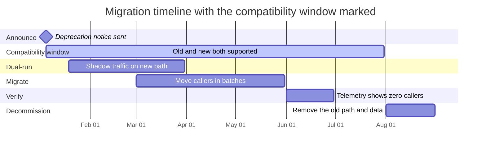
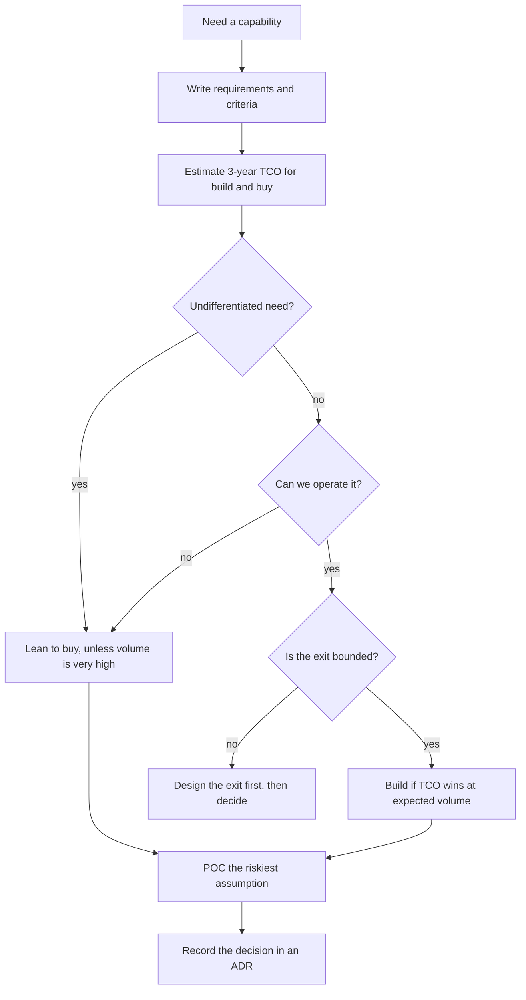

# TCO, Vendor Decisions, Migrations, and Deprecation

> **Interview answer (say this first).** The cheapest price on the first invoice is almost never the lowest total cost of ownership (TCO), so I compare build and buy over a realistic three-year horizon and include integration, operations, egress, and the cost of leaving. I bound lock-in by keeping the vendor behind my own interface and writing an exit plan before I sign. When I change the system I announce it, run the old and new paths together inside a marked compatibility window, migrate with a rollback ready, and only deprecate when telemetry proves no caller remains.

## Why this exists

A payments team picked a managed retrieval vendor because the price was `$0.40` per million tokens — a fifth of the alternative. Eighteen months later the real bill was four times the estimate. The vendor charged per GB for egress, the integration had grown into a bespoke schema-mapping service, and the seat minimum applied even in quiet months. Leaving meant rewriting every call that used a vendor-specific filter. The cheaper unit price had hidden the largest costs.

The same failure happens with time instead of money. A platform team shipped `/v2/answer` and removed `/v1/answer` in the same release. Two internal services and one customer integration still called `/v1`, so they broke on a Tuesday morning with no warning and no way back. The change was correct; the way it was made was not.

TCO and migration discipline fix both failures. TCO compares the whole cost of owning something, not its sticker. Migration discipline changes a live system without breaking the people who depend on it. This page is the economics and the organisational mechanics of switching.

## Start from zero

| Word | Plain meaning |
| --- | --- |
| **Total cost of ownership (TCO)** | The full cost of a choice over its life: licence, compute, integration, operations, egress, training, and the cost of leaving. |
| **Capex vs opex** | Capital expenditure is a large up-front purchase you own; operational expenditure is an ongoing pay-as-you-go cost. |
| **Direct cost** | A cost you can point at, such as the subscription fee or the GPU hours. |
| **Indirect cost** | A cost caused by the choice but not billed by it, such as the engineers who maintain the integration. |
| **Hidden cost** | A real cost that is easy to miss because no invoice names it: egress, onboarding, on-call, or the exit. |
| **Opportunity cost** | The value of the work you cannot do because you are doing this instead. |
| **Unit economics** | The cost and value of one unit of work — one answer, one document, one task. |
| **Build vs buy** | Making a component yourself versus paying a vendor for it; control and cost versus speed. |
| **Vendor lock-in** | How hard it is to leave a provider once you depend on its unique APIs, data formats, or contracts. |
| **Switching cost** | The one-off cost of moving from one option to another, in engineering time, data movement, and risk. |
| **Exit plan** | A written route out of a vendor: what you export, how you rebuild, and what it costs. |
| **Request for proposal (RFP)** | A document that states your requirements and asks vendors to answer them in a comparable format. |
| **Proof of concept (POC)** | A short, scoped build that tests one risky assumption before you commit. |
| **Migration** | Moving users, data, or traffic from one system to another. |
| **Dual-write / dual-run** | Writing to both old and new systems, or running both paths, so you can compare and reverse. |
| **Compatibility window** | The announced period when both the old and the new version are supported. |
| **Deprecation** | Declaring that something is on its way out, while it still works. |
| **Sunset** | The date when the deprecated thing stops working. |
| **Breaking change** | A change that stops existing callers from working unless they update. |
| **Feature flag** | A runtime switch that turns a code path on or off without a deploy. |
| **Rollback** | Returning to the previous working version. |

Three distinctions matter most:

- **Price vs TCO.** Price is one line on one invoice; TCO is every line over the whole life. The whole conversation is about the difference.
- **Deprecation vs sunset.** Deprecation is the announcement; sunset is the date it takes effect. You do the first long before the second.
- **Dual-write vs dual-run.** Dual-write stores every change in both systems (safer, costlier). Dual-run sends shadow traffic to both and keeps one result (cheaper, catches differences earlier).

## The core idea

Think of a car lease. The advertised monthly payment looks cheap. The true cost adds the deposit, the mileage overage, the insurance you must buy from the dealer, and the fee to hand the car back. Owners who compare only the monthly payment choose badly; owners who compare the three-year cost choose well.

TCO is that three-year comparison for a technical choice. Build the table once, with a line for every real cost:

| Cost line | Build (self-host) | Buy (vendor) |
| --- | --- | --- |
| **Licence** | Open-source licence, or a paid one | Subscription or per-unit fee |
| **Compute** | Nodes or GPUs you rent and run | Usually bundled; overage billed |
| **Integration** | Engineer-weeks to build and connect it | Glue code, auth, schema mapping |
| **Operations** | FTE fraction for on-call and upkeep | Support plan plus your own effort |
| **Egress** | Cross-region and cross-AZ transfer | Per-GB data-transfer fee |
| **Training** | Ramp-up, runbooks, documentation | Vendor onboarding, lock-in to their model |
| **Switching** | Export tooling you keep | Contract exit plus API rewrite |
| **3-year TCO** | Sum | Sum |

Read the last row, not the first. A cheap licence with expensive egress and a punitive exit can lose to a costlier licence you can leave.

The second tool is a migration timeline. The point of the picture is the **compatibility window**: the long stretch where both versions work, so nobody is forced to change on the day of the announcement.



And a decision path for build vs buy:



> **The one-sentence rule.** Compare the whole cost over the whole life, keep the exit cheap enough to use, and never break a caller without a window and a way back.

## How it works

1. **Define the requirements and the decision criteria.** Write what the component must do, and the qualities that decide the choice: TCO, integration effort, lock-in, compliance, time to market, operational burden. Criteria without weights become an argument later.
2. **Estimate TCO over a realistic horizon.** Three years is the usual horizon for infrastructure and vendors. Use the volume you expect at year two and year three, not today's pilot volume.
3. **Include integration, operations, and exit costs.** Add the engineer-weeks to connect it, the FTE fraction to run it, and the cost to leave. These three lines decide the outcome more often than the licence does.
4. **Run a POC that tests the risky assumption.** Do not POC the easy part. POC the thing that could kill the decision: can it hold the latency, does it survive the data volume, does the export actually work.
5. **Decide build vs buy with the numbers.** Score the options against the weighted criteria, check that the ranking is not fragile, and write the decision and its consequences in an architecture decision record (ADR).
6. **Plan the migration with dual-run, a compatibility window, and a rollback.** Announce the dates, run both paths, move callers in batches, and keep a tested way back the whole time.
7. **Deprecate with notice, telemetry, and a sunset date.** Say who is affected, publish the date, watch who still calls the old path, and warn before you break them.
8. **Decommission and remove the old path.** Once telemetry shows zero callers for a set period, delete the old code, credentials, dashboards, and data. A live path you forgot about is a security and cost problem.

> **The working rule.** If the exit cost is not in the table, it is not a TCO — it is a hope.

## The syntax you will use

These are the templates you will actually write. Fill them with real numbers and dates.

**A TCO comparison table.** Every real cost line, for both options.

```markdown
| Cost line | Build (self-host) | Buy (vendor) |
| --- | --- | --- |
| Licence | one-off or open source | monthly or annual fee |
| Compute | nodes x monthly rate x months | bundled, plus overage |
| Integration | engineer-weeks x loaded week rate | glue code and schema mapping |
| Operations | FTE fraction x loaded salary x horizon | support plan plus your effort |
| Egress | cross-region and cross-AZ transfer | per-GB data-transfer fee |
| Training | ramp-up and documentation | vendor onboarding |
| Switching | export tooling and rebuild | contract exit plus rewrite |
| **3-year TCO** | sum of the column | sum of the column |
```

**A decision matrix with weighted criteria.** Weights sum to 1.0; scores are 1 to 5, higher is better.

```markdown
| Criterion | Weight | Vendor A | Vendor B | Self-host |
| --- | --- | --- | --- | --- |
| 3-year TCO | 0.30 | 3 | 4 | 5 |
| Integration effort | 0.20 | 5 | 4 | 2 |
| Lock-in / exit cost | 0.20 | 2 | 3 | 5 |
| Compliance fit | 0.15 | 4 | 5 | 3 |
| Time to market | 0.15 | 5 | 5 | 2 |
| **Weighted total** | 1.00 | 3.65 | 4.10 | 3.65 |
```

**A migration plan.** The owner, the dates, the steps, and the rollback in one page.

```markdown
# Migration plan: chat-v1 -> chat-v2

- Owner: Support Platform team
- Decision: ADR-0031 (link)
- Announce: 2026-01-05
- Compatibility window: 2026-01-05 to 2026-07-31
- Sunset for the old path: 2026-08-01

## Steps
1. Dual-run: mirror 5% of traffic to chat-v2; compare answers on the golden set.
2. Canary: move 1% of live callers, then 10%, then 50%, watching quality and p95.
3. Migrate: move the remaining callers in batches, smallest first.
4. Verify: telemetry shows zero requests to chat-v1 for 14 consecutive days.
5. Decommission: delete the chat-v1 route, credentials, dashboards, and logs.

## Rollback
- Trigger: quality score drops below the golden-set floor, or p95 > 3s.
- Action: flip the chat_v2_enabled feature flag back to chat-v1.
- Data: no dual-write is needed, so rollback is a flag change, not a restore.
```

**A deprecation notice with dates.** Announce early, name the replacement, and state the timeline.

```markdown
# Deprecation notice: legacy /v1/embeddings

- Announced: 2026-01-05
- Compatibility window: 2026-01-05 to 2026-07-31 (208 days)
- Sunset: 2026-08-01 00:00 UTC
- Replacement: /v2/embeddings (migration guide: docs/embeddings-v2.md)
- Owner: Platform team (platform@example.com)

## What changes
/v1 stops accepting requests at sunset and returns HTTP 410 Gone.

## Who is affected
Run this to list your callers:
sum by (caller) (rate(api_requests_total{path="/v1/embeddings"}[7d]))

## Timeline
- 2026-01-05: notice sent; both versions supported; warnings in responses.
- 2026-04-30: access logs name the remaining callers weekly.
- 2026-07-31: final day. Any extension needs the owner's written approval.
```

## Examples: simple to real

**Example 1 — build vs buy over three years, where the cheaper first invoice loses.** The vendor's first invoice is `$1,500` a month; the self-hosted compute alone is `$2,400` a month. On price alone, buy wins. On TCO, it loses.

| Cost line | Build (self-host) | Buy (vendor) |
| --- | --- | --- |
| Licence | `$0` (open source) | `$54,000` (`$1,500/month` x 36) |
| Compute | `$86,400` (4 nodes x `$600/month` x 36) | `$0` (bundled) |
| Integration | `$70,000` (deploy + data migration) | `$30,000` |
| Operations | `$300,000` (0.5 FTE x `$200k` x 3 years) | `$120,000` (0.2 FTE) |
| Egress | `$12,000` (internal) | `$288,000` (80 TB/month x `$0.10/GB` x 36) |
| Training | `$8,000` | `$5,000` |
| **3-year TCO (excluding exit)** | **`$476,400`** | **`$497,000`** |
| Exit / switching (contingent) | `$15,000` (export tooling kept) | `$120,000` (exit + API rewrite) |
| **3-year TCO if you exit at year 3** | **`$491,400`** | **`$617,000`** |

The vendor's egress fee alone is `$288,000`, more than the whole self-hosted compute bill. Build is cheaper even before an exit, and `$125,600` cheaper if you leave at year 3. The `$120,000` switching line is **contingent** — you pay it only if you exit — so it belongs in a separate row, not folded into the deterministic total. Pricing it explicitly is the point: it stops the exit from looking free. The lesson is not "always build". It is "sum every line, and label which ones you might not pay". The same arithmetic must run at the volume you actually expect, so keep the sum as code:

```python
buy = {"licence": 54_000, "compute": 0, "integration": 30_000,
       "operations": 120_000, "egress": 288_000, "training": 5_000,
       "switching": 120_000}
build = {"licence": 0, "compute": 86_400, "integration": 70_000,
         "operations": 300_000, "egress": 12_000, "training": 8_000,
         "switching": 15_000}

print(sum(buy.values()))                        # 617000  (assumes an exit at year 3)
print(sum(build.values()))                      # 491400  (assumes an exit at year 3)
print(sum(buy.values()) - sum(build.values()))  # 125600
```

**Example 2 — a decision matrix that makes the trade-offs explicit.** The TCO from Example 1 is one criterion among five, not the whole decision.

Using the weights and scores from the syntax section, Vendor A scores 3.65, Vendor B 4.10, and self-host 3.65. Vendor B wins, but only just, and the tie between A and self-host is a signal. Nudge the weights towards lock-in — give it 0.30 and drop time to market to 0.05 — and the ranking changes:

| Option | Original weights | Lock-in-weighted |
| --- | --- | --- |
| Vendor A | 3.65 | 3.35 |
| Vendor B | 4.10 | 3.90 |
| Self-host | 3.65 | 3.95 |

Self-host wins once lock-in matters more than speed. That is exactly the conversation to have out loud: "we agree on the facts; we disagree on how much lock-in is worth." A matrix does not remove judgement; it makes the judgement visible and easy to challenge.

**Example 3 — a migration with dual-run and a rollback plan.** The team moves the support agent from `chat-v1` to `chat-v2` behind the LLM gateway. Nothing is deleted until the old path is quiet.

The plan is the syntax template, filled in. Dual-run mirrors 5% of traffic to `chat-v2` and compares answers on a golden set — a fixed set of questions with known-good answers. The canary then moves real callers in batches: 1%, 10%, 50%, 100%. Every batch has the same rollback: flip the `chat_v2_enabled` feature flag and traffic is back on `chat-v1` in seconds. Because the two paths share the same conversation store and no dual-write is involved, rollback needs no data restore.

The compatibility window runs from the announcement to the sunset, so callers can move at their own pace. Dual-run is short on purpose: running two paths costs twice the compute and twice the monitoring, so it runs for weeks, not quarters.

**Example 4 — deprecation with a sunset date and telemetry proving no callers remain.** A deprecation is a promise that can be checked, not a hope.

The old `/v1/embeddings` endpoint is announced on 2026-01-05 with a sunset of 2026-08-01. Every request to the old path is counted by caller. The team watches the count fall and gates the sunset on evidence:

| Check | Evidence required | Date |
| --- | --- | --- |
| Telemetry | Zero requests to `/v1/embeddings` for 14 consecutive days | 2026-07-15 |
| Caller audit | No API keys on the old path in the access log | 2026-07-15 |
| Code search | No repository still imports the v1 client | 2026-07-20 |
| Rollback | Old path can be re-enabled for 7 days if a caller appears | 2026-07-31 |
| Sunset | Old path and its data deleted | 2026-08-01 |

The PromQL that proves it is short:

```promql
# Requests to the deprecated path over the last 7 days, per caller.
sum by (caller) (rate(api_requests_total{path="/v1/embeddings"}[7d]))
```

Only when that returns nothing for two weeks, and the caller audit and code search agree, does the sunset proceed. Telemetry is what turns "nobody uses it" from an opinion into a fact.

**Example 5 — a vendor exit plan that bounds lock-in.** Lock-in is a range, not a yes-or-no. The goal is not zero lock-in; it is an exit you could afford to take.

| Lock-in source | What it looks like | How to bound it |
| --- | --- | --- |
| API shape | Vendor-specific calls spread through the code | Put the vendor behind your own gateway or interface |
| Data format | Proprietary embeddings or indexes | Keep the canonical data in your own format |
| Egress | Per-GB fees that punish export | Model export cost in the contract and the TCO |
| Contract | Auto-renewal and long notice periods | Negotiate termination and notice terms up front |
| Skills | Only one team knows the vendor | Document it and share ownership |

A concrete exit plan has five lines: the canonical data lives in your store; an export job rebuilds the vendor's index from that store; a second provider runs on 5% of traffic to prove the abstraction works; the contract allows termination with 90 days' notice and no exit fee; and the team rehearses the exit once a year. That is an exit you can actually take, which changes how you negotiate from then on.

## In production

- **The cheapest unit price is rarely the lowest TCO.** A subscription, a per-token rate, or a licence is one line. Sum licence, compute, integration, operations, egress, training, and switching over the horizon before you choose.
- **Include integration and operations, always.** The FTE who runs the thing and the engineer-weeks to connect it usually decide the outcome. If a build needs 0.5 FTE to run and a buy needs 0.2, that difference is a real line in the table.
- **Egress and data gravity are real costs.** Moving data out of a vendor is billed, slow, and sometimes the reason you stay. Treat per-GB transfer as a first-class cost, and keep a copy you control.
- **Lock-in is a range, not a yes-or-no.** Every buy has some. The question is whether the exit is cheap enough that you would actually take it. Design the exit before you sign, not after.
- **A POC should test the risky assumption.** POC the latency at peak, the export of real data, or the quality on hard cases. A POC that only shows the happy path has proven nothing you did not already assume.
- **Decide with a matrix and record it.** Write the criteria, the weights, the options, and the choice in an ADR. The matrix makes the trade-off visible; the record stops the same debate returning next quarter.
- **Every breaking change needs a compatibility window and a rollback.** Announce a start and an end, support both paths in between, and keep a tested way back until the old path is quiet.
- **Deprecation needs telemetry, notice, and a date.** Count who still calls the old path, tell them before you act, and name the day. A deprecation with no date is a wish, and one with no telemetry is a guess.
- **Dual-run costs extra, so keep it short.** Mirroring a share of traffic adds the mirrored share plus comparison and monitoring cost (only a full dual-run or dual-write doubles everything). Use it to compare and build confidence, then finish the migration.
- **Decommission includes deleting the old data path.** Removing the route but leaving the queue, credentials, and storage is not done. Old data is a cost, a compliance risk, and a way for something to keep quietly calling a "removed" system.
- **Someone must own the migration.** A migration with two owners and no decision-maker stalls at the first hard batch. Name one owner, one rollback trigger, and one sunset date.
- **Revisit the buy decision at renewal.** Contracts auto-renew and usage drifts. Re-run the TCO with real numbers at each renewal, because the volume you assumed and the price you pay both change.

## Interview questions

### 1. What is TCO, and why does the sticker price mislead?

**Answer.** TCO is the full cost of a choice over its life, not the price on the first invoice. It adds licence or subscription, compute, integration, operations, egress, training, and the cost of leaving. The sticker price misleads because it is one line and often the smallest: a managed service with a cheap subscription can cost more than self-hosting once egress, support, and a punitive exit are counted. I estimate TCO over about three years at realistic volume, and I label every assumption.

**Follow-up: "Which line is most often forgotten?"** The exit. Teams cost the arrival of a vendor carefully and the departure not at all, yet switching cost is the line that decides whether the decision is reversible.

**Trap.** Comparing only the recurring fee. Integration and operations are one-off and ongoing costs that never appear on a vendor's price list.

### 2. How do you run a build-vs-buy decision?

**Answer.** First write requirements and weighted criteria. Then estimate three-year TCO for both options, including integration, operations, and exit. Run a POC on the single riskiest assumption, such as whether the managed service holds the latency at peak. Score the options against the criteria, check whether the ranking flips under reasonable weight changes, and record the decision and its consequences in an ADR. Buy when the need is undifferentiated, volume is low, and time to market matters; build when volume is high enough that marginal cost dominates, the need is unique, and you can operate it.

**Follow-up: "What makes the decision reversible?"** Putting the vendor behind your own interface. If the rest of the system talks to your gateway, swapping providers is a config change rather than a rewrite.

**Trap.** Treating "build" as free. Building trades money for people and opportunity cost, and those people must be hired, retained, and on call.

### 3. What is vendor lock-in, and how do you bound it?

**Answer.** Lock-in is how hard it is to leave once you depend on a vendor's unique APIs, data formats, pricing, or contract terms. It is a range, not a yes-or-no, and the test is whether you would actually take the exit if you had to. Bound it with an abstraction layer in front of the vendor, canonical data in your own format, a tested export, a second provider on a small slice of traffic, and contract terms that allow termination with reasonable notice and no exit fee.

**Follow-up: "What is the cheapest lock-in control?"** Keeping your own copy of the canonical data. Almost every exit starts with "export the data", so having it already in your format removes the hardest part.

**Trap.** Saying "we will just rewrite it" without a number. A rewrite of every vendor-specific call is weeks or months, and that unestimated cost is exactly what makes lock-in dangerous.

### 4. What is the difference between an RFP and a POC?

**Answer.** An RFP is a document that states your requirements and asks several vendors to answer in a comparable format, so you can compare on the same criteria. A POC is a short, scoped build with one vendor that tests a risky assumption in your own environment. The RFP narrows the field; the POC de-risks the finalist. Use the RFP for breadth and the POC for depth, and never let a vendor run a POC that only demonstrates its own happy path.

**Follow-up: "What should a POC test?"** The assumption that would kill the decision: peak latency, real data export, quality on hard cases, or cost at expected volume. If it cannot fail, it is a demo, not a POC.

**Trap.** Scoring an RFP on the answers alone. Vendors write good answers; the POC is where the claims meet your data.

### 5. How do you plan a migration that does not break users?

**Answer.** Announce it with dates, run the old and new paths together inside a compatibility window, migrate callers in batches, verify with telemetry, and only then decommission. Keep a tested rollback the whole time, usually a feature flag that returns traffic to the old path. Move the smallest and newest callers first so a failure is cheap, and give internal teams a deadline earlier than the external sunset. The window is what lets callers move on their own schedule instead of yours.

**Follow-up: "What is the risk of a compatibility window?"** Running two paths costs twice the compute and monitoring, and the old path grows stale and insecure. That is why the window has an end date, and why the old path gets no new features.

**Trap.** Removing the old path the moment the new one ships. Internal callers hide in code search and background jobs, and they will surface as an outage.

### 6. How do you deprecate something safely?

**Answer.** Notice, telemetry, and a date. Publish what is going away, what replaces it, and the sunset date, with a compatibility window long enough for the slowest caller. Instrument the old path so you can count who still uses it, broken down by caller. Warn the stragglers directly, and gate the sunset on evidence: zero callers for a set period, plus a code search and an audit. Keep a short rollback window after sunset in case a caller appears.

**Follow-up: "What if a caller refuses to migrate?"** Give them a named contact and an explicit extension process with a new date. Silent non-migration is worse than an agreed extension, because it leaves the old path alive with no owner.

**Trap.** Deprecating by announcement only. Without telemetry you cannot prove the path is unused, so the sunset either breaks someone or never happens.

### 7. What is dual-run, and what does it cost?

**Answer.** Dual-run sends the same input to both the old and new paths and keeps one result, so you can compare behaviour before you commit. Dual-write is stronger: it writes every change to both stores, which makes rollback a switch back rather than a restore. Both cost extra — double compute, double storage, or double monitoring — and dual-write adds a consistency problem if the two stores disagree. Use them to build confidence, keep them as short as the risk allows, and never let them become the permanent architecture.

**Follow-up: "When is dual-write worth it?"** When a failed migration would lose or corrupt data, and the cost of running both stores briefly is less than the cost of a restore. Otherwise prefer dual-run, which does not touch the write path.

**Trap.** Leaving dual-run on forever. It quietly doubles the bill and doubles the surface area that must be tested and secured.

### 8. When do you revisit a buy decision, and how?

**Answer.** At every renewal, and whenever a trigger fires: volume crosses the break-even, quality regresses, the price changes, or a compliance rule changes. Re-run the TCO with real numbers — actual volume, actual egress, actual support cost — and compare it to building or to a second vendor. Re-run the decision matrix with current weights. Then either renew with evidence, renegotiate, or execute the exit plan. The first bill after a year of real usage is worth more than the estimate you made before launch.

**Follow-up: "What trigger would make you leave a vendor?"** A price rise that breaks the unit economics, a repeated availability failure, a compliance change the vendor cannot meet, or a measured exit cost that has fallen enough to make leaving cheap.

**Trap.** Auto-renewing because the renewal date passed unnoticed. Put the renewal date and the break-even volume in the ADR, and set a reminder before the notice period closes.

## Remember this

- **TCO is every line over the whole life.** Licence, compute, integration, operations, egress, training, and switching — summed over about three years at real volume.
- **The cheapest first invoice usually loses.** Integration and operations are the lines that decide, and egress and exit cost are the lines people forget.
- **Lock-in is a range; design the exit before you sign.** Keep canonical data in your own format, put the vendor behind your interface, and rehearse leaving.
- **Every breaking change needs a compatibility window and a rollback.** Announce, dual-run, migrate in batches, verify with telemetry, then decommission.
- **Deprecation is telemetry plus notice plus a date.** Prove no caller remains before the sunset, and delete the old path and its data afterwards.
