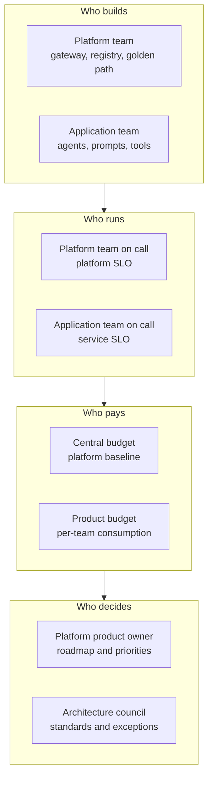
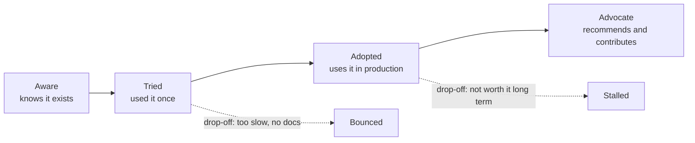

# Operating Models, Stakeholders, and Platform Adoption

> **Interview answer (say this first).** A platform succeeds only when teams adopt it, so I treat it as a product with named customers, a roadmap, and adoption metrics. I start by finding my customers and the job they are trying to do, then write down an ownership model: who builds each thing, who runs it, who pays, and who decides. I define a support boundary so the platform team is not on call for everything. Then I build one golden path that is genuinely easier than doing it by hand, onboard one team end to end, and measure the adoption funnel — aware, tried, adopted, advocate — instead of counting features shipped. Every service and every incident has a named owner, and anything nobody uses gets retired.

## Why this exists

Platform failures are usually social, not technical. Two of them repeat.

The first is a feature nobody uses. A platform team spends a quarter building a policy engine for model routing. It is well tested, well documented, and reviewed by two architects. Six months later, three of forty teams use it. The team never asked the application teams who had to adopt it. They solved an imagined problem, and the work is now a maintenance cost with no value.

The second is an incident with no owner. A shared prompt cache starts serving stale answers. In a channel, one person says "that is the platform"; another says "that is the application team". Nobody is paged. The incident sits for four hours until a customer complains. The cache was written by one team and configured by another, and the boundary between them was never written down.

Both failures have the same root cause: the ownership model was implicit. When ownership is implicit, every team assumes someone else is responsible. When customers are hypothetical, the roadmap reflects the platform team's interests instead of the users'.

Watch for these symptoms:

- A feature launch with a dashboard showing "services created" but no view of active use.
- An incident where the first twenty minutes are spent deciding who should look at it.
- A team that has built its own bespoke pipeline because the official one was slower to use.
- A "platform" that is really a ticket queue with a web form in front of it.
- A support request channel where the platform team answers every question by hand.

> **The one-sentence purpose.** A platform is adopted, not installed: find the customers, agree who owns what, make the supported path the easiest path, and measure whether teams actually use it.

## Start from zero

Platform adoption has its own vocabulary. These words sound similar but mean different things.

| Word | Plain meaning |
| --- | --- |
| **Operating model** | The agreed way work gets done: who builds, who runs, who pays, and who decides. |
| **Ownership** | A single named team accountable for a service's behaviour, including when it breaks. |
| **RACI** | A grid naming, per activity, who is Responsible, Accountable, Consulted, and Informed. |
| **Accountable** | The one party that answers for the outcome. Exactly one per activity. |
| **Responsible** | The party that does the work. Several may share it, but one is accountable. |
| **Platform as a product** | Treating the platform as something with customers, a roadmap, and adoption metrics, not a shared utility. |
| **Internal developer platform (IDP)** | The developer-facing surface — portal, CLI, API, templates — on top of the platform's capabilities. |
| **Golden path** | The one supported, recommended way to do a common task, such as "deploy an agent". |
| **Paved road** | Another name for a golden path: smooth because the platform team maintains it. |
| **Self-service** | Developers get what they need directly, without filing a ticket and waiting for a human. |
| **Customer discovery** | Talking to the teams who must adopt the platform to learn what they need, before building. |
| **User persona** | A short profile of one kind of platform user and what they are trying to achieve. |
| **Jobs-to-be-done (JTBD)** | The task a user is hiring the platform to perform — "ship an agent safely" — not the feature they requested. |
| **Adoption funnel** | The stages a team passes through: aware, tried, adopted, advocate. |
| **Onboarding** | The guided path that takes a new team from "no access" to "running in production". |
| **Developer experience (DevEx)** | How it feels to build and ship with the platform: friction, waiting, and confusion. |
| **Support boundary** | A written statement of what the platform team will support and what it will not. |
| **On-call ownership** | Who is paged when something breaks outside working hours. |
| **Chargeback** | Billing a team for the platform resources it consumes. |
| **Showback** | Reporting a team's cost without billing it. |
| **Guild / community of practice** | A voluntary group across teams that shares practice and feeds the platform roadmap. |
| **Stakeholder** | Anyone affected by the platform's decisions: users, finance, security, leadership. |
| **Escalation** | Raising a blocked or broken thing to the named owner before it becomes an incident. |
| **Retirement** | Removing a feature nobody uses, on purpose and on a schedule. |

Three distinctions carry most of the weight:

- **Ownership vs responsibility.** Many people can work on a thing; exactly one is accountable for it. Two accountable owners means zero.
- **Adoption vs usage.** A team can create a service and never deploy it. Real adoption means regular use in production.
- **Golden path vs mandate.** A golden path is the easiest supported route. A mandate forces everyone through one door. The first produces adoption; the second produces workarounds.

## The core idea

Think of a city's public transport system. Someone plans and builds the lines, someone drives the trains and fixes the signals, someone pays for it through fares and taxes, and someone decides where the next line goes. If those four roles are confused, the system fails: no one maintains the track because everyone assumed the operator did.

A platform has the same four questions for every component: **who builds it, who runs it, who pays for it, and who decides how it changes.** Write the answers down. That is the ownership map.



The same map as a table, because an interview whiteboard usually wants the table:

| Question | Platform team answers for | Application team answers for |
| --- | --- | --- |
| **Who builds** | Gateway, registries, evaluation, golden path | Their agent, prompts, tools, data |
| **Who runs** | The platform's own SLO and pager | Their service's SLO and pager |
| **Who pays** | The central platform budget | Their own token, compute, and storage use |
| **Who decides** | Standards, defaults, and the roadmap | How their product uses the platform |

Now think about adoption as a funnel, not a switch. A team does not adopt a platform because it exists. It becomes aware, tries one task, uses it in production, and eventually recommends it. Most platforms leak at every stage.



| Funnel stage | The question it answers | Metric | Example target |
| --- | --- | --- | --- |
| **Aware** | Do teams know the platform exists? | Eligible teams reached by docs, demo, or onboarding | 100% per quarter |
| **Tried** | Did they attempt one real task? | Teams with at least one self-service run | 60% within 30 days |
| **Adopted** | Do they use it in production? | Teams running a production service on the golden path | 50% of eligible teams in two quarters |
| **Advocate** | Do they recommend and contribute? | Repeat contributors and internal references | 10% of teams per quarter |

Two ideas make the funnel real.

**Platform as a product.** The platform has customers, a value proposition, onboarding, documentation, a support path, and a roadmap driven by feedback. Success is measured by adoption and outcomes, not by the number of features shipped. If developers do not choose the platform, it has failed no matter how good the engineering is.

**The golden path.** One supported, opinionated way to do the most common task, maintained by the platform team. It must be *easier* than the alternative — faster to start, safer by default, and obvious when it breaks. A golden path that is slower than doing it by hand will be routed around, and then you have shadow infrastructure you cannot see.

> **The mental model in one line.** The ownership map says who is answerable; the adoption funnel says whether anyone cares.

## How it works

Follow the work from a blank page to a platform people actually use.

1. **Identify the platform's customers and their jobs.** List the teams who must adopt the platform and the job each is trying to do — "ship an agent to production", "run an evaluation before release", "find out what we spent on models". Use personas and jobs-to-be-done so you design for the task, not the feature request. Talk to at least a dozen people before writing code.
2. **Agree an ownership model and a support boundary.** For each component, write who builds, runs, pays, and decides. Then write the support boundary: what the platform team will fix, what it will advise on, and what the consuming team owns. Publish it, because a boundary nobody has read is not a boundary.
3. **Build a golden path that is easier than the alternative.** Pick the single most common task and make one excellent route through it: a template, a CLI command, a pipeline, and a registry entry. It must beat the DIY route on time to first deploy and on safety. If it does not, fix the path, not the developers.
4. **Onboard one team end to end.** Do it by hand, watching every step. Record where they hesitated, what they had to ask, and what broke. One deep onboarding teaches more than ten surveys, and it is how you find the gaps before you scale.
5. **Measure adoption at each funnel stage.** Count teams aware, teams that tried, teams using it in production, and teams contributing. A drop between two stages is a specific problem with a specific fix; a single "usage" number tells you nothing about where you are losing people.
6. **Gather feedback and iterate.** Treat repetitive complaints as backlog items, not noise. Ship visible improvements on a published roadmap, and tell users what changed because they said it. Feedback that never changes anything stops arriving.
7. **Handle escalations and incidents with a named owner.** Every service has an owner and a pager. For a cross-team incident, the owning team of the failing component leads, and the support boundary decides who assists. Decide this before the incident, not during it.
8. **Retire what nobody uses.** Review the portfolio on a schedule. If a feature has no active users after a fair trial, announce a deprecation date, help the few users migrate, and delete it. Unused features consume on-call attention and make the platform harder to reason about.

Notice the order. Listen, then agree ownership, then build one good path, then prove it with one team, then measure. Building broadly before step four is how platform teams end up with unused features.

### The two loops that keep a platform honest

- **The discovery loop.** Customer interviews and usage data feed the roadmap. If the roadmap has not changed because of a user conversation in a quarter, discovery is not happening.
- **The operational loop.** Incidents and support tickets feed the ownership model and the support boundary. If the same component causes the same confusion twice, the boundary is wrong.

## The syntax you will use

These are the documents a platform team actually writes. They are templates, not application code.

**A RACI table.** One row per activity, one letter per party. `A` is Accountable — exactly one per row. `R` is Responsible. `C` is Consulted. `I` is Informed.

```markdown
| Activity | Platform team | Application team | Security | Finance |
| --- | --- | --- | --- | --- |
| Define the golden path | A/R | C | C | I |
| Onboard a new team | R | A | I | I |
| Approve a production deploy | I | A/R | C | I |
| Grant a policy exception | R | C | A | I |
| Set a team's budget | C | R | I | A |
| Respond to a platform incident | A/R | I | I | I |
| Respond to an agent incident | I | A/R | I | I |
```

Read one row: for "Grant a policy exception", Security is accountable, the platform team does the work, the application team is consulted, and finance is informed. When one row names two accountable parties, the table is broken.

**An ownership map table.** The who-builds, who-runs, who-pays, who-decides view per component.

```markdown
| Component | Builds | Runs (on-call) | Pays | Decides |
| --- | --- | --- | --- | --- |
| Model gateway | Platform team | Platform team | Central budget | Architecture council |
| Agent and prompt registry | Platform team | Platform team | Central budget | Platform team |
| Evaluation service | Platform team | Platform team | Central budget | Platform team |
| A team's agent | Application team | Application team | Application team | Application team |
| Retrieval index | Application team | Application team | Application team | Application team |
| Cost guardrails | Platform team | Platform team | Charged back per team | Finance + platform owner |
```

Every row must have exactly one entry in "Runs (on-call)". A component with two on-call owners has none.

**An adoption-metric table.** Stage, metric, target, and where the number comes from.

```markdown
| Stage | Metric | Target (first 2 quarters) | Source |
| --- | --- | --- | --- |
| Aware | Eligible teams reached | 100% | Onboarding records, docs traffic |
| Tried | Teams with >= 1 self-service run | 60% | Platform API audit log |
| Adopted | Teams with a production service on the path | 50% | Service catalog, deploy records |
| Advocate | Teams contributing or referencing internally | 10% | Merge history, reference list |
| Health | Self-service completion rate | >= 85% | Requests minus human-touched requests |
| Health | Time to first production deploy | < 1 day | Onboarding timestamps |
| Health | Platform availability | 99.9% monthly | Platform SLO dashboard |
```

Three health metrics sit alongside the funnel: self-service completion rate catches a portal that is cosmetic, time to first deploy is the number a new team feels, and availability is what every dependent team notices when it drops.

**A one-page platform charter.** The document a new team reads first. Keep it to one page or nobody reads it.

```markdown
# AI Platform Team Charter

## Mission
Give every product team a safe, fast path from an agent prototype to a governed production service.

## Customers
- Primary: application teams building agents.
- Secondary: data science teams running evaluations.
- Stakeholders: security and finance, who consume guards and cost data.

## What we own
- The model gateway, the agent and prompt registries, and the evaluation service.
- The golden path: scaffold, CI, deploy, observe.
- Platform SLOs and on-call for the components above.

## What we do not own
- A team's prompt quality, tool code, or business logic.
- A team's service SLO and its after-hours paging.
- Bespoke infrastructure that has no path to a golden path.

## How we decide
- The platform product owner sets the roadmap from adoption data and discovery.
- The architecture council approves standards; the owner grants time-boxed exceptions.

## How we measure success
- Golden-path adoption by eligible teams.
- Time from a new team to its first production deploy.
- Self-service completion rate, platform availability, and cost per team.
```

The "what we do not own" section is the part teams quote back to you. Write it as carefully as the mission.

## Examples: simple to real

**Example 1 — the incident nobody owned, fixed by a RACI.** A shared prompt cache served stale answers for four hours. The platform team had built the cache; the application team owned the prompt that produced the bad answer and the configuration that fed the cache. Each assumed the other would respond, so no one was paged. The fix was organisational, not technical. They added one row to the RACI.

```markdown
| Activity | Platform team | Application team |
| --- | --- | --- |
| Respond to a stale-cache incident | A/R | C |
| Tune the cache for a given prompt | C | A/R |
```

Now the cache has one owner, and the boundary between "the cache is broken" and "the prompt is wrong" is written down. The next time it happened, the platform team was paged and resolved it in twenty minutes. Ambiguity cost four hours; a table cost ten minutes to write.

**Example 2 — a golden path that cut onboarding from days to hours.** Before, a new team assembled its own pipeline, registry entry, and budget request by copying another team's repository. After, one command generated a working service on the supported path. The team measured the change, because a golden path with no measurement is an opinion.

```text
                     before      after
steps to first deploy   14           3
teams involved           4           1
median time to deploy   3.5 days    4 hours
failed first attempts    7 of 10     1 of 10
```

The measurement matters as much as the result. If median time to deploy had not moved, the golden path would be decoration. Track it from the first onboarding, and keep tracking it after every template change.

**Example 3 — customer discovery that changed the roadmap.** The platform team's plan was a multi-region failover feature. They interviewed twelve application teams first. Only one cared about multi-region; the top three pains drew 11, 9, and 8 mentions. The roadmap changed.

```text
pain named by teams                     count
"we cannot tell what our agent costs"      11
"we cannot get a prompt reviewed"           9
"we do not know which model is live"        8
"we need multi-region failover"             1

roadmap before: multi-region failover
roadmap after:  cost visibility, prompt review, model registry
```

Discovery is not a survey. It is a small number of real conversations with the people who will have to adopt the thing. Twelve interviews changed a quarter of engineering. The one multi-region request was not ignored; it was recorded as a trigger to revisit when the pain is real, not assumed.

**Example 4 — an adoption funnel with a drop-off and the fix.** The platform looked successful because "tried" was high, but almost nobody reached production use.

```text
stage      teams   conversion
aware        40        --
tried        30      75% of aware
adopted       6      20% of tried
advocate      1      17% of adopted

finding: 24 of 30 teams bounced between tried and adopted.
reason:  the golden path worked for a demo, but the
         production step needed a manual security review
         that took 11 days on average.

fix:     move the review into an automated admission check
         and keep a human only for exceptions.
result:  adopted rose to 18 of 40 teams the next quarter.
```

The headline "30 teams tried the platform" hid the real problem. Splitting the funnel into stages turned a vague disappointment into a specific bottleneck: an eleven-day queue. You cannot fix a funnel you do not measure.

**Example 5 — a support boundary that says what the platform team will not do.** The platform team was drowning in support requests, and its own roadmap had stalled. The fix was a published boundary, negotiated with the application teams rather than imposed.

```markdown
# Platform Support Boundary

## We will
- Fix platform bugs and outages, and stay on call for the components we own.
- Review a design that uses the golden path, within two working days.
- Provide a migration path for anything we deprecate.

## We will advise on, but not operate
- Prompt design and agent logic, during agreed office hours.
- Cost tuning, using the shared cost dashboard.
- Custom retrieval setups that leave the golden path.

## We will not
- Debug a team's own tool code or model prompts outside an incident.
- Run bespoke infrastructure that has no path to a golden path.
- Grant standing exceptions to security policy, only time-boxed ones.

## How to escalate
- Blocked by a platform bug: open a ticket tagged platform-bug.
- Cross-team incident: the owner of the failing component leads.
- Policy exception: request through the architecture council.
```

The boundary did not reduce the platform team's obligations; it made them explicit. Support volume fell, escalations became predictable, and the platform team got its roadmap back.

## In production

- **A platform without customers is a hobby.** If you cannot name the teams who use it and the job it does for them, you are building for yourself. Adoption is the proof of value.
- **Name the owner of every service.** One accountable team per component, recorded in the catalog and in the RACI. Two owners means no owner when it matters.
- **Support boundaries prevent burnout and confusion.** Write what you will operate, what you will advise on, and what you will not touch. A boundary that only exists in the platform team's heads still produces angry escalations.
- **The golden path must be easier than doing it yourself.** If the DIY route is faster, teams will take it and you will not know. Measure time to first deploy and fix the path, never blame the developers.
- **Measure adoption, not features shipped.** A release count rises whether or not anyone uses the release. Count teams at each funnel stage and treat a flat line as a bug.
- **Onboard one team deeply before building for many.** One observed onboarding finds the gaps that ten surveys miss, and it is cheaper than discovering them after a broad launch.
- **Developers are users, so watch their experience.** DevEx is a product metric. Watch time to first deploy, wait time in review, and how often teams ask a question the docs should have answered.
- **Chargeback changes behaviour.** Showback informs; chargeback changes decisions. Attribute cost per team and publish it, so the heavy users can see themselves.
- **Run a community of practice.** A guild of application engineers spreads knowledge, surfaces pain early, and produces contributors. Announce changes there before they ship.
- **Retire unused features.** Review the portfolio on a schedule. Announce a deprecation date, migrate the few users, and delete. Dead features are on-call burden and confusion.
- **Document the ownership model where teams will find it.** In the service catalog and the charter, not in a file nobody opens. If a new joiner cannot answer "who owns this?", it is not documented.
- **Adoption is a leading indicator of value.** Cost savings, reliability, and compliance follow adoption, not the reverse. A platform nobody uses cannot repay anything.

## Interview questions

### 1. What is an operating model, and why does a platform need one?

**Answer.** An operating model is the agreed way work gets done: who builds each thing, who runs it, who pays, and who decides. A platform needs one because it sits across many teams, and most platform failures are ownership failures. When the model is implicit, an incident becomes an argument about whose problem it is, and work falls between teams. Writing the model down gives every component one accountable owner and turns ambiguity into a decision.

**Follow-up: "Who writes it?"** The platform team drafts it with its customers and its stakeholders, and leadership endorses it. An imposed model nobody helped write will be ignored the first time it is inconvenient.

**Trap.** Treating the operating model as a diagram. It is a set of decisions with names attached, not boxes on a slide.

### 2. How do you find the platform's customers and what they need?

**Answer.** I list the teams who must adopt the platform, then talk to a dozen of them individually about the job they are trying to do, not the feature they want. I look for repeated pain across teams and for the workarounds they already built. I also read support tickets and usage data, because what people do reveals more than what they say. Then I write personas and a jobs-to-be-done statement for each group.

**Follow-up: "What if a customer asks for something only they need?"** I record it and look for the general need underneath. If it is genuinely unique, it stays out of the golden path and that team owns it.

**Trap.** Designing for the loudest team or for leadership. The loudest voice is not a sample, and executives are stakeholders rather than users.

### 3. What is a golden path, and how is it different from a mandate?

**Answer.** A golden path is the one supported, opinionated way to do a common task, maintained by the platform team. A mandate forces every team to use it. The golden path competes on quality: it is faster to start, safer by default, and it comes with support and documentation. Teams may leave it, and then they own the operational consequences. Mandating a path before it is good produces shadow infrastructure the platform team cannot see.

**Follow-up: "What stops teams leaving for something worse?"** Nothing, and that is the point. Your job is to make the supported route genuinely better, then measure how many teams choose it.

**Trap.** Calling a checklist plus a gate a golden path. A gate blocks; a golden path attracts.

### 4. How do you measure adoption, and why is that better than counting features?

**Answer.** I measure a funnel: the teams aware of the platform, the teams that tried one real task, the teams using it in production, and the teams that contribute or recommend it. I add health metrics such as self-service completion rate, time to first deploy, and platform availability. Feature counts say what the platform team did; funnel metrics say whether anyone got value. A drop between two stages is a specific, fixable problem.

**Follow-up: "Which single number would you watch?"** Time from a new team joining to its first production deploy on the golden path. It is easy to understand, hard to fake, and it captures discovery, onboarding, and the path all at once.

**Trap.** Reporting "services created". A created service that is never deployed is not adoption.

### 5. How do you draw a support boundary?

**Answer.** I write three lists: what we operate and fix, what we advise on within agreed hours, and what we explicitly do not support. I negotiate it with the application teams rather than impose it, and I publish it where support requests arrive. The boundary names the escalation route for each case: a platform bug, a cross-team incident, and a policy exception. The goal is to make obligations explicit, not to refuse work.

**Follow-up: "What if a team needs help outside the boundary?"** They can buy it as a project with a named outcome and an end date. That is how a boundary protects focus without becoming a wall.

**Trap.** Using the boundary to avoid all responsibility. If the platform is the source of the pain, fixing it is inside the boundary, always.

### 6. What does "platform as a product" mean in practice?

**Answer.** It means treating developers as customers. The platform gets a value proposition, onboarding, documentation, a support path, a published roadmap, and adoption metrics. The platform team does user research and prioritises by user pain, not by what is technically interesting. Success is measured by adoption and outcomes, not by the number of features shipped. If developers will not choose it, it has failed.

**Follow-up: "How is that different from internal customer service?"** A product team owns the outcomes and iterates on feedback. A service desk closes tickets. One builds demand; the other clears a queue.

**Trap.** Saying "we are a product team" while shipping features nobody asked for. The proof is a roadmap that changes because of user evidence.

### 7. A team is blocked and each side says it is the other's problem. How do you resolve it?

**Answer.** I go to the ownership map and the RACI. If one component is involved, its accountable owner leads the fix immediately and we argue about process afterwards. If the problem crosses a boundary, I find the nearest component with a written owner and make them coordinate until we can write the missing row. Then I add the row, so the same ambiguity cannot recur. During an incident, resolution comes first; accountability is settled in the post-incident review.

**Follow-up: "What if the ownership map has no entry for the failing thing?"** Then it is unowned by definition, and we name an owner before closing the incident. An unowned shared component is a future outage.

**Trap.** Letting the debate run while the incident runs. Deciding who is at fault is not the same as fixing the problem.

### 8. When and how do you retire a platform feature?

**Answer.** I review the portfolio on a schedule and look for features with no active users or with usage that does not justify their on-call and maintenance cost. If one qualifies, I announce a deprecation date, help the remaining users migrate, keep it working until that date, then delete it and its data. I publish what replaced it, if anything. Retirement is a normal outcome, not a failure.

**Follow-up: "Why not just leave it running?"** Because every feature carries on-call attention, security patching, and cognitive load. A smaller platform is easier to operate, document, and trust.

**Trap.** Waiting for usage to hit exactly zero. Deprecation with a date is what gets the last few users to move.

## Remember this

- **A platform is adopted, not installed.** Find the customers, learn their job, and measure whether they use it.
- **Write the ownership model down.** Every component gets one accountable owner for build, run, pay, and decide.
- **Make the golden path the easiest path.** It wins by being better than the DIY route, never by being mandatory.
- **Measure the adoption funnel, not the feature count.** Aware, tried, adopted, advocate — each drop-off has a fix.
- **Bound support and retire what nobody uses.** Clear boundaries prevent burnout; dead features are pure cost.
