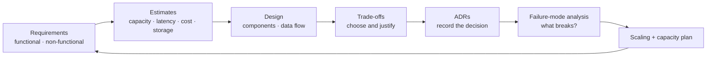

# Phase 11 — AI Systems Architecture

This is the synthesis phase. Everything before it taught a component; this phase is about combining them into a whole system you can defend in a design interview. The questions here are the ones a senior or staff engineer is actually asked: What are the requirements? What does it cost? What happens when a region dies? Why did you choose this and not that?

Architecture is decision-making under uncertainty. There is rarely one right answer; there is a set of trade-offs and a clear reason for the one you chose. This phase gives you the method (requirements → estimation → design → trade-offs → ADRs), the reference architectures, and the failure analysis to back your choices with numbers instead of adjectives.

## What you will be able to do

By the end of this phase you should be able to:

- Run an AI system-design methodology: requirements, constraints, estimates, design, trade-offs.
- Estimate capacity, latency, throughput, cost, and storage before you build.
- Choose a model, and decide build vs buy, RAG vs fine-tuning, and agent vs deterministic workflow.
- Design an LLM gateway and model-routing architecture, and agent orchestration (single and multi-agent).
- Design event-driven and workflow architectures, and integrate with enterprise systems and human-in-the-loop.
- Design multi-tenant, data, knowledge, model-serving, and platform architecture.
- Design for availability: high availability, disaster recovery, and multi-region.
- Design reliability, security, observability, and cost-control as cross-cutting concerns.
- Reason about compliance architecture.
- Write architecture trade-offs and ADRs, and do failure-mode analysis, capacity planning, and scaling.

## The architecture loop

The loop never really ends: production teaches you something, the requirements shift, and you go around again. An architecture is not a diagram; it is the set of decisions, each with a recorded reason and a known failure mode.

## Topic order

1. [System-design methodology](01-system-design-methodology.md) — requirements and the design process.
2. [Estimation: capacity, latency, throughput, cost, storage](02-estimation-capacity-latency-throughput-cost-storage.md) — numbers before design.
3. [Choosing the approach](03-choosing-the-approach.md) — model selection, build vs buy, RAG vs fine-tuning, agent vs workflow.
4. [LLM gateway and model-routing architecture](04-llm-gateway-and-model-routing-architecture.md) — one door, many models.
5. [Agent orchestration and multi-agent architecture](05-agent-orchestration-and-multi-agent-architecture.md) — one agent and many.
6. [Event-driven and workflow architecture](06-event-driven-and-workflow-architecture.md) — asynchronous and durable.
7. [Enterprise integration and human-in-the-loop](07-enterprise-integration-and-human-in-the-loop.md) — fitting into real organisations.
8. [Multi-tenant architecture](08-multi-tenant-architecture.md) — many customers, one system.
9. [Reliability, security, observability, and cost architecture](09-reliability-security-observability-cost-architecture.md) — the cross-cutting concerns.
10. [Data and knowledge architecture](10-data-and-knowledge-architecture.md) — where truth and knowledge live.
11. [Model-serving and AI platform architecture](11-model-serving-and-ai-platform-architecture.md) — serving and the platform that runs it.
12. [Availability, disaster recovery, and multi-region](12-availability-disaster-recovery-and-multi-region.md) — surviving failure.
13. [Compliance architecture](13-compliance-architecture.md) — designing for the rules.
14. [Architecture trade-offs and ADRs](14-architecture-trade-offs-and-adrs.md) — deciding and recording why.
15. [Failure-mode analysis, capacity planning, and scaling](15-failure-mode-analysis-capacity-planning-and-scaling.md) — proving it holds up.

> **How to study this phase.** For every design question, answer in this order: requirements, estimate, design, trade-off, failure mode. Interviewers are not grading the diagram; they are grading whether your choices follow from the constraints and whether you can name what would make you change your mind.
