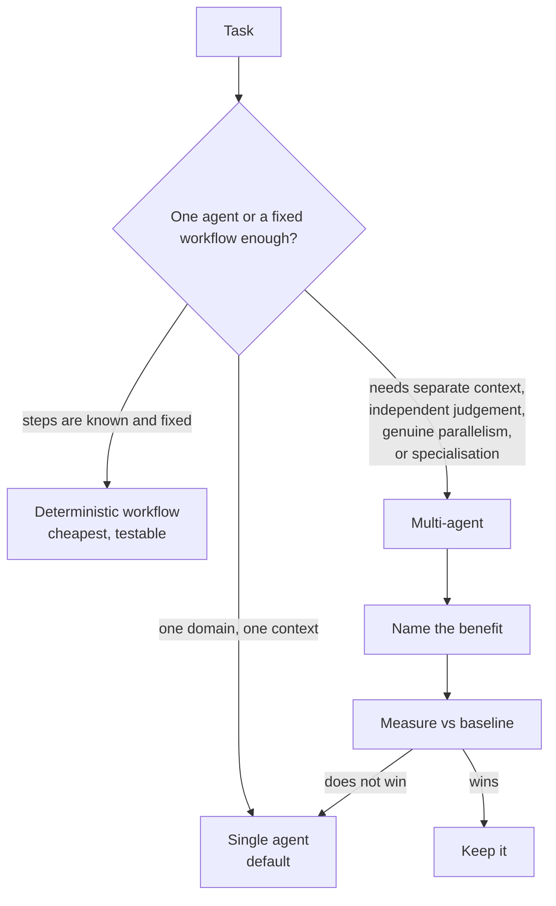

# Why Multi-Agent, and When Not To

> **Interview answer (say this first).** A multi-agent system is several LLM-driven agents that work on one goal and coordinate by handing work or messages to each other. It is not automatically better than one agent; it is a trade. It buys exactly four things: separate context (each agent sees only what it needs), independent judgement (a second mind checks the first), genuine parallelism (independent work runs at the same time), and specialisation (each agent has one narrow job and a few tools). It charges four costs: coordination overhead, extra latency, a larger token bill, and non-determinism that makes debugging and evaluation harder. So the rule is simple: start with one agent, or with a deterministic workflow if the steps are known; move to multiple agents only when you can name one of the four benefits and measure it against the baseline. If you cannot say which benefit you are buying, the answer is one agent.

> **Note:**
>
> **Verified.** Every runnable example on this page was executed offline in plain Python (Python 3.14). No model calls were made. All prices and token counts are **illustrative** and belong to no vendor. Where a line represents model output, it is labelled **illustrative**.

## Why this exists

The instinct is to make one powerful agent with every tool and a giant prompt. It works in a demo and then fails in production for predictable reasons:

- **Tool selection collapses.** Accuracy drops as the tool list grows. Past a dozen or so tools, the model picks the wrong one often enough to matter.
- **Context is polluted.** A failed search, an old draft, and a user's aside all stay in the window and steer later decisions.
- **No parallelism.** One loop is sequential. Independent work waits in line behind unrelated work.
- **No separation of concerns.** The prompt that plans, fetches, writes, and reviews cannot be tuned without breaking something else.
- **No independent check.** The agent that wrote the answer grades it, and it is biased toward its own work.
- **No isolation.** A worker that can see everything can be confused by everything.
- **No cost ceiling.** A loop with no cap spends without limit when the goal is unreachable.

The tempting fix is "add more agents". But every added agent adds a prompt, a context, an interface, and a new way for the handoff to break. Multi-agent is not a free upgrade; it is a deliberate trade that only pays off for a reason you can state and measure.

> **Note:**
>
> **The one-sentence purpose.** Multi-agent is how you buy separate context, independent judgement, real parallelism, or specialisation — and it is only worth its coordination cost when you can name the benefit and measure it.

## Start from zero

| Word | Plain meaning |
| --- | --- |
| **Agent** | A model plus tools plus a loop, working toward a goal. |
| **Single agent** | One loop with all the tools and instructions. The default. |
| **Multi-agent system** | Two or more agents that work on one goal and coordinate with each other. |
| **Coordination** | The work of deciding who does what, in what order, and merging the results. |
| **Orchestrator** | The component, code or agent, that sequences the other agents. |
| **Context** | The text a model can see for one call: instructions, history, tool results. |
| **Context window** | The hard maximum size of that text. |
| **Context isolation** | Giving each agent only the information it needs, so noise cannot leak. |
| **Specialisation** | Giving one agent one narrow job and only the tools for that job. |
| **Genuine parallelism** | Two pieces of work that truly do not depend on each other, so they can run at once. |
| **Independent judgement** | A check performed by a party that did not produce the work. |
| **Deterministic workflow** | Code with fixed branches, used where the path must never vary. |
| **Agentic step** | A step whose next action is chosen by a model. |
| **Topology** | The shape of the system: chain, star, tree, graph. |
| **Fan-out / fan-in** | Start many workers in parallel, then wait for all and merge. |
| **Handoff** | Moving control to another agent, which then finishes the task. |
| **Latency** | The wall-clock time from request to answer. |
| **Token cost** | Money spent on input and output tokens; grow roughly with agent count. |
| **Non-determinism** | The same input can produce different output or a different path across runs. |
| **Golden-trace test** | Runs one input end to end and asserts the stage sequence matches an approved trace. |
| **Cost ceiling** | A maximum spend or step count after which the run stops. |
| **Coordination overhead** | The tokens and time spent organising the work instead of doing it. |
| **Over-orchestration** | Adding agents for a benefit that was never measured and does not exist. |
| **Baseline** | The single-agent result you must beat on success rate, cost, or latency. |

Three distinctions do most of the work:

- **A reason vs a hope.** "The task needs several skills" is a reason. "More agents will be smarter" is a hope. Only reasons survive measurement.
- **Parallel vs sequential work.** Parallelism helps only when the pieces are independent. Dependent pieces must run in order, whatever the diagram says.
- **Agentic vs deterministic.** Only the genuinely uncertain step should be a model call. A known transformation is code, not an agent.

## The core idea

Think about hiring. A single agent is one excellent generalist contractor. A multi-agent system is a small firm with a manager and specialists.

- The **generalist** is cheap to start, needs no meetings, and is the right default for a small task.
- A **firm** is justified when the job genuinely needs several skills, when the pieces are big enough to run at the same time, when each specialist must not see the others' noise, or when a second person must check the first.
- A firm with one employee is just overhead. A firm where everyone reads every email all day is slower than one person.

That is the whole trade. The decision framework is:

| Signal | Question to ask | If yes |
| --- | --- | --- |
| Distinct skill areas | Does one prompt have to hold conflicting instructions? | Specialise into workers |
| Independent subtasks | Can two pieces run at the same time with no shared result? | Fan out in parallel |
| Context pressure | Is the prompt too big or too noisy for one window? | Isolate context per worker |
| Quality risk | Does a wrong answer cost more than a second opinion? | Add a critic or evaluator |
| Known steps | Are the steps fixed and knowable up front? | Use a deterministic workflow or planner-executor |
| None of the above | Is the task one domain and one context? | Stay single-agent |

The framework as a flow:



When a single agent is genuinely better:

- **The task fits in one context** and one prompt can hold all the instructions.
- **The steps are sequential** and each depends on the last, so parallelism buys nothing.
- **A deterministic workflow already solves it** — parse, validate, transform, store. No model decision is needed.
- **The tool list is small** and selection is reliable.
- **There is no quality gate requirement** that a second party must perform.

The decision in plain Python is just a function. That is the point: the choice is reviewable code, not a vibe.

```python
def recommend(s: dict) -> str:
    if s["parallel_independent"] > 1 or (s["domains"] > 1 and s["cross_domain"]):
        return "multi-agent (supervisor + workers)"
    if s["needs_independent_judgement"]:
        return "multi-agent (generator + critic)"
    if s["deterministic_steps"]:
        return "deterministic workflow"
    if s.get("context_isolation"):
        return "multi-agent (isolated workers)"
    return "single agent"
```

## How it works

1. **Build the single-agent baseline first.** Give one agent the tools and instructions. Record success rate, median cost, and p95 latency. Every multi-agent idea must beat this on a metric you care about.
2. **Name the benefit before writing a second agent.** Separate context, independent judgement, genuine parallelism, or specialisation. Write it down. If you cannot, stop.
3. **Check whether a workflow wins already.** If the steps are fixed, encode them in code. A deterministic workflow is cheaper, faster, and testable, and it does not need an agent at all.
4. **Split along independent boundaries.** Fan out only work that shares no intermediate result. Dependent steps stay sequential and must not be drawn as parallel.
5. **Isolate each worker's context.** Give each worker its goal and its own scratch, not the whole conversation. This is the main technical reason to split.
6. **Add a second mind only where quality matters.** A critic or evaluator is worth it when a wrong answer is expensive, not as a default for every output.
7. **Estimate the token bill up front.** Each agent carries its own system prompt and history, so cost grows with the number of agents and with the number of rounds.
8. **Estimate latency honestly.** Parallel fan-out reduces wall-clock time for independent work. Hierarchy adds a round trip per level, so depth increases latency.
9. **Budget for coordination, not just work.** Messages, retries, merges, and the orchestrator's own calls are real cost and real failure surface.
10. **Cap steps, rounds, and spend.** Every loop needs a maximum. An uncapped supervisor is unbounded spend when the goal is unreachable.
11. **Accept non-determinism as a cost.** Multi-agent runs are harder to reproduce. Log the route, the agents chosen, and every handoff, or you cannot explain a failure.
12. **Plan for harder evaluation.** You now have several models to grade and a system that may succeed by luck. Evaluate the whole topology end to end, not just each worker.
13. **Measure after shipping.** Compare the multi-agent result to the baseline again in production. If the benefit does not appear in the data, remove the agents.
14. **Keep deterministic code in charge.** Routing tables, validation, aggregation, budget checks, and final approval are code. Only the uncertain decision is a model call.

## The syntax you will use

**The decision function.** One function turns a description of the task into a structure. It is deliberately boring.

```python
def recommend(s: dict) -> str:
    if s["parallel_independent"] > 1 or (s["domains"] > 1 and s["cross_domain"]):
        return "multi-agent (supervisor + workers)"
    if s["needs_independent_judgement"]:
        return "multi-agent (generator + critic)"
    if s["deterministic_steps"]:
        return "deterministic workflow"
    if s.get("context_isolation"):
        return "multi-agent (isolated workers)"
    return "single agent"
```

The order encodes priority: parallel or cross-domain first, then review, then known steps, then context isolation, then the single-agent default. Every reason `justify()` can produce therefore also appears in `recommend()`, so a context-isolation-only task is never sent back as a single agent.

**The cost model.** Sum every model call's input and output tokens, then apply an illustrative price. The price below is a placeholder, not a vendor quote.

```python
PRICE_IN, PRICE_OUT = 3.0, 15.0        # illustrative, per million tokens

def cost(calls):
    tin = sum(c[0] for c in calls)
    tout = sum(c[1] for c in calls)
    return (tin * PRICE_IN + tout * PRICE_OUT) / 1_000_000
```

**The latency model.** Independent work can overlap; dependent work cannot.

```python
def sequential(steps):        # every step waits for the previous one
    return sum(steps)

def parallel(steps):          # independent steps overlap
    return max(steps)
```

**The break-even.** A single agent re-reads its growing transcript on every subtask. A set of workers each keep a small flat context. Model both and find the crossover.

```python
def single_cost(n, base, growth, out):
    calls = [(base + j * growth, out) for j in range(n)]  # history grows each call
    return cost(calls)

def multi_cost(n, coord, worker):
    return cost([coord] + [worker] * n)                   # flat per worker
```

**A budget guard.** The cap is code, and it runs before the next agent is called.

```python
def within_budget(spent: float, cap: float, next_estimate: float) -> bool:
    return spent + next_estimate <= cap
```

**A justification check.** Before building, list the reasons. An empty list is a strong signal to stay single.

```python
def justify(s: dict) -> list:
    reasons = []
    if s["parallel_independent"] > 1:
        reasons.append("parallelism")
    if s["domains"] > 1 and s["cross_domain"]:
        reasons.append("specialisation")
    if s["needs_independent_judgement"]:
        reasons.append("independent judgement")
    if s.get("context_isolation"):
        reasons.append("context isolation")
    return reasons
```

## Examples: simple to real

**Example 1 — the decision framework on five tasks.**

Each task is described by signals, and the function picks the smallest structure that works. Verified:

```text
decisions:
  summarise one PDF                -> deterministic workflow
  answer one support email         -> single agent
  review a contract clause         -> multi-agent (generator + critic)
  scan code and docs at once       -> multi-agent (supervisor + workers)
  monthly report from 3 sources    -> multi-agent (supervisor + workers)
```

Notice that two of five tasks stayed simple. A summariser over one document is a fixed transform, and a single support reply needs no team. Only the review and the two genuinely broad tasks earn a second agent.

**Example 2 — the split is not free.**

Using illustrative per-agent token counts and the illustrative price above. Verified:

```text
cost:
  single agent:                 $0.0135
  orchestrator+3 workers+review: $0.0351
  ratio:                        2.60x
```

The multi-agent version here costs about 2.6 times the single agent. That is acceptable only if the review or the isolation fixes something the single agent gets wrong. Cost alone never justifies the split.

**Example 3 — latency moves the other way for independent work.**

Three independent steps of `0.8s`, `0.6s`, and `0.5s`. Verified:

```text
latency (independent steps):
  sequential: 1.9s
  parallel:   0.8s
  saved:      1.1s
latency (dependent steps):
  parallel is impossible; all three run in sequence = 1.9s
```

Parallelism is a real benefit, but only for independent work. Drawing dependent steps as parallel is a whiteboard bug that shows up as incorrect output, not just slow output.

**Example 4 — when does context isolation pay for itself?**

A single agent re-reads a growing transcript, so its input tokens grow with the square of the subtask count. A coordinator plus workers keeps each worker flat. Verified with illustrative numbers:

```text
break-even (single agent re-reads history; workers stay flat):
  n=1: single $0.0063  multi $0.0132  -> single cheaper
  n=2: single $0.0150  multi $0.0189  -> single cheaper
  n=3: single $0.0261  multi $0.0246  -> multi cheaper
  n=4: single $0.0396  multi $0.0303  -> multi cheaper
  n=5: single $0.0555  multi $0.0360  -> multi cheaper
  n=6: single $0.0738  multi $0.0417  -> multi cheaper
```

For very short tasks the coordinator overhead dominates, so the single agent wins. From about the third independent subtask the isolation pays off. The crossover depends entirely on your numbers; the point is to compute it instead of guessing.

**Example 5 — the over-use detector.**

List the reasons a task would need multiple agents. Empty means stay single or use a workflow. Verified:

```text
justification check:
  rewrite a sentence     reasons=[none] -> stay single/workflow
  classify 3 tickets     reasons=[parallelism] -> multi-agent
  audit a draft          reasons=[independent judgement] -> multi-agent
  simple lookup          reasons=[none] -> stay single/workflow
```

Two tasks have a real reason; two do not. This check costs nothing and prevents the most common production mistake: a fleet of agents doing one agent's job.

## In production

- **Default to one agent, then a workflow, then multi-agent.** That is the order of increasing cost and decreasing determinism. Climb it only when the rung below fails a metric.
- **Write the benefit on the ticket.** "Separate context", "independent judgement", "parallelism", or "specialisation". A ticket that cannot name one is a ticket to delete an agent, not add one.
- **Measure against the baseline after shipping, not only in the design doc.** Multi-agent systems often look better on the whiteboard and worse in the dashboard.
- **Estimate the token bill before building.** Agents multiply prompts and history. A five-agent run is not five times one agent; it is often more, because the orchestrator also talks.
- **Model latency per topology.** Fan-out lowers wall-clock time for independent work; hierarchy adds a round trip per level. Cut depth before adding workers.
- **Treat non-determinism as a budget line.** Harder debugging and evaluation is a real cost. Pay for tracing and golden traces, or you cannot ship changes with confidence.
- **Give every loop a cap.** Steps, rounds, and total spend. An uncapped multi-agent system is an unbounded bill when the goal is unreachable.
- **Keep the control flow deterministic.** Let code own routing, validation, aggregation, and the final gate. Let models own only the uncertain step.
- **Kill over-orchestration early.** If two agents always fire together in the same order with the same input, they are one agent with extra latency. Merge them.
- **Do not confuse roles with agents.** Two responsibilities can run in one agent; two agents can share no responsibility. Decide roles first, then map them to processes.
- **Beware the multi-agent demo trap.** Demos show cooperation; production shows the coordination failures. Load-test the unhappy paths: a slow worker, a failed worker, a repeated worker.
- **Re-evaluate the topology when the model improves.** A newer, larger model may make the single-agent baseline win again. Multi-agent structure is not permanent.

## Interview questions

### 1. What is a multi-agent system, and when would you not build one?

**Answer.** It is two or more LLM-driven agents that work on one goal and coordinate, usually by delegating work or exchanging messages. I would not build one when the task fits in one context, when the steps are fixed and knowable (a deterministic workflow is better), or when there is no independent work and no independent check. The default is one agent. I only split when I can name separate context, independent judgement, genuine parallelism, or specialisation, and show it beats the baseline.

**Follow-up: "What is the first thing to improve before splitting?"** The tools and the prompt. Bad tool selection is often a description problem, not evidence that you need another agent.

**Trap.** Splitting to fix a prompt bug. You now have two prompts with the same bug and a new interface that can also fail.

### 2. What does a multi-agent system actually buy you?

**Answer.** Four things, and nothing else. Separate context: each agent sees only what it needs, so noise cannot leak. Independent judgement: a party that did not write the work checks it. Genuine parallelism: truly independent pieces run at the same time. Specialisation: one agent holds one narrow job and a few tools. If a proposed design buys none of these, it is just coordination overhead.

**Follow-up: "Which of the four is worth the most in practice?"** Context isolation, because it is the one that makes the other three cheaper rather than more expensive. Smaller contexts mean lower cost and cleaner decisions.

**Trap.** Claiming "better reasoning" as the benefit. More agents do not think harder; they divide work. The reasoning quality comes from the model and the prompt, not the agent count.

### 3. What are the costs of going multi-agent?

**Answer.** Coordination overhead, latency, token cost, and non-determinism. Coordination means extra messages and merge logic. Latency grows with rounds and hierarchy depth. Token cost grows because each agent carries its own system prompt and history. Non-determinism means harder debugging and harder evaluation, because the same input can take a different path. All four are permanent, so the benefit must be large enough to cover them.

**Follow-up: "Which cost surprises teams most?"** Evaluation. People budget for tokens and latency, then discover they cannot tell whether the multi-agent run is actually better than the single agent, because they never built the baseline.

**Trap.** Comparing a tuned multi-agent system to an untuned single agent. The comparison must be against a well-built baseline, or the result is meaningless.

### 4. How do you decide between a single agent, a deterministic workflow, and multiple agents?

**Answer.** Ask three questions in order. Are the steps fixed and knowable? Then a deterministic workflow, no agents needed. Does the task fit in one context with a small tool list? Then a single agent. Does it genuinely need separate context, independent judgement, or real parallelism? Then multi-agent, and only then. This order climbs from cheapest and most testable to most expensive and least deterministic.

**Follow-up: "Where does a router fit?"** A router is a light multi-agent form: classify once and dispatch to one specialist. It is cheap because there is no ongoing coordination loop. If one request belongs to one specialist that can finish alone, a router is enough.

**Trap.** Reaching for multi-agent first because the task is large. Size alone is not a reason; an agent with a good plan and a big context can handle a large single-domain task.

### 5. You have a multi-agent system that is slower and more expensive than one agent. Is that automatically wrong?

**Answer.** Not automatically. If it fixes a measurable quality or isolation problem, the extra cost is the price of that benefit. But it is wrong if no benefit is measured. In that case, remove agents. Common wins are a review gate that catches a class of errors, or isolation that keeps a noisy subtask from corrupting the main reasoning. The test is always the same: does the benefit show up in a metric versus the baseline?

**Follow-up: "How do you present that trade to a stakeholder?"** In their units: quality per dollar, or error rate per p95 latency. "Three times the tokens for a 40 percent drop in wrong answers" is a decision; "it is more sophisticated" is not.

**Trap.** Defending the architecture instead of the metric. The architecture is a means, not a goal.

### 6. When is genuine parallelism real, and when is it fake?

**Answer.** It is real when two pieces share no intermediate result and neither needs the other's output. It is fake when one piece needs the other's result, or when both write to the same shared state. Fake parallelism produces either wrong answers or a hidden sequential dependency. I check by drawing the data flow, not the call graph.

**Follow-up: "What is the risk of fan-out?"** Peak cost and race conditions. All workers run at once, so peak spend spikes, and concurrent writes to shared state can lose updates unless one writer owns each field.

**Trap.** Assuming parallel always lowers latency. It lowers wall-clock time only for independent work, and it raises peak resource usage.

### 7. How does multi-agent change evaluation and debugging?

**Answer.** It makes both harder. Evaluation is now system-level: you must test success rates, cost, and latency of the whole topology, not just each worker. Debugging needs a shared run id across every sub-call, so you can reconstruct which agent did what. You also need golden-trace tests per route. Without that, a failure is a blob of interleaved messages.

**Follow-up: "What is a golden-trace test?"** Run one representative input end to end and assert the recorded stage sequence matches an approved trace. It catches a change that silently reroutes or skips a stage.

**Trap.** Unit-testing workers and assuming the system works. A perfect worker in a broken chain still produces a broken run.

### 8. What is the most common over-use of multi-agent systems?

**Answer.** Wrapping every step in an agent when the steps are known. A pipeline of fetch, parse, validate, and store does not need agents; it needs code. The second most common is adding a critic to every output, which doubles cost and latency for little gain when the task is easy. The third is using a supervisor for requests that belong to exactly one specialist, where a router would do.

**Follow-up: "How do you detect over-use after the fact?"** Look for agents that always run in the same order with the same inputs, and for rounds that never change the output. Both are signs the structure should collapse into fewer agents or into code.

**Trap.** Treating the number of agents as a sophistication score. More agents is a cost, not a badge.

## Remember this

- **A multi-agent system is a trade, not an upgrade.** It buys separate context, independent judgement, genuine parallelism, or specialisation.
- **Start with one agent, then a workflow, then multiple agents.** Climb only when the rung below fails a metric.
- **Coordination, latency, tokens, and non-determinism are permanent costs.** The benefit must be measured, not assumed.
- **Parallelism is real only for independent work.** Dependent steps stay sequential whatever the diagram says.
- **If you cannot name the benefit, you do not need a second agent.**
