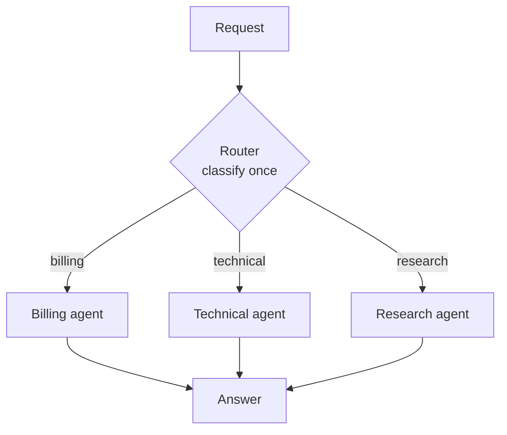
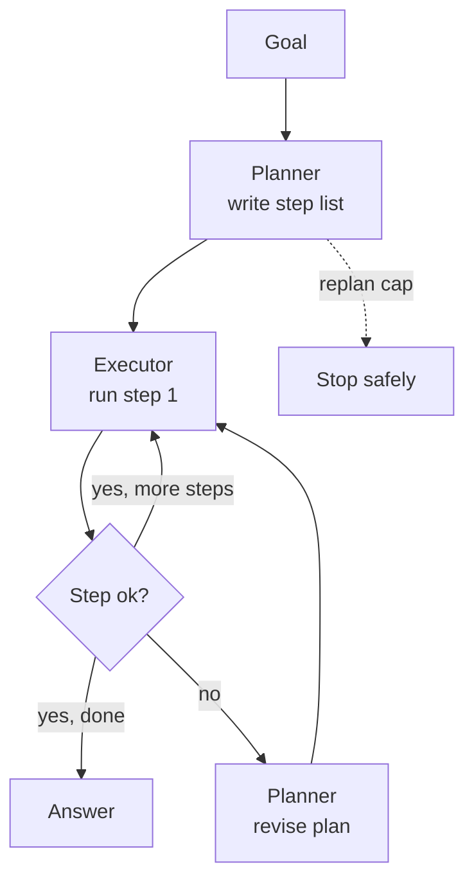
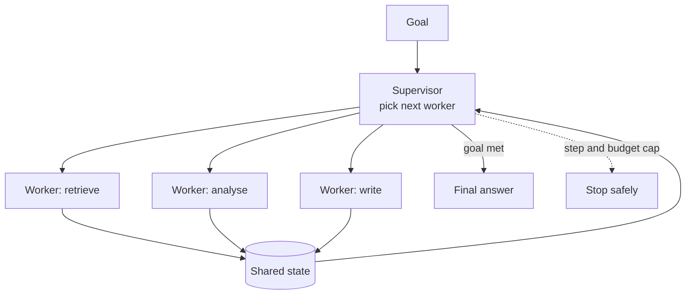
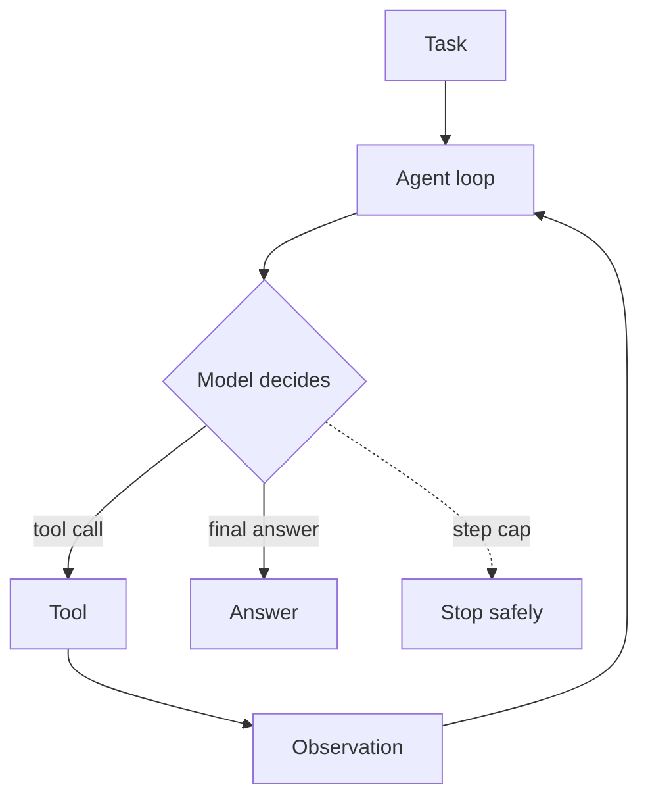

# Agent Roles and Patterns

> **Interview answer (say this first).** A **role** is a job description — the responsibility, the inputs it accepts, the outputs it must produce, and the tools it may use. An **agent** is a running process that fills a role. They are not the same thing: one agent can hold several roles, and one role can be filled by several agents for parallel work. A **pattern** is the rule for how roles interact. The four you must know are **router-agent** (classify once and dispatch), **planner-executor** (write the whole plan, then run it, replan on failure), **supervisor-worker** (a manager delegates in a loop and merges results), and the default, a **single agent**. The two rules that prevent most bugs are explicit interfaces (every role declares its input and output shape) and single-writer ownership (exactly one owner for each piece of shared state). Choose the smallest pattern whose control shape matches the task; do not pick by familiarity.

> **Note:**
>
> **Verified.** Every runnable example on this page was executed offline in plain Python (Python 3.14). No model calls were made. Where a line represents model output, it is labelled **illustrative**.

## Why this exists

Teams often start with the technology and work backwards. They pick a framework, draw many agents, and only then ask what each one does. The failure is predictable:

- **Roles are unnamed, so responsibility is blurry.** Two agents edit the same draft and each overwrites the other.
- **Interfaces are implicit.** The supervisor passes a raw string, the worker expects JSON, and the handoff silently corrupts.
- **No owner for shared state.** Every agent writes to the shared blackboard, and updates are lost.
- **The pattern is overkill.** A supervisor is built for requests that a one-shot router handles.
- **The pattern is under-spec.** A single agent is asked to do work that genuinely needs a plan and several skills.
- **Debugging has no seams.** When every agent can call every agent, the trace is a graph with no named stages.

Naming roles and choosing a pattern first gives the system seams: each role has one job, one interface, and one owner for its outputs. That is what makes a multi-agent system testable and replaceable.

> **Note:**
>
> **The one-sentence purpose.** A role is a responsibility with an interface; a pattern is how roles take turns. Name the roles and their interfaces before you name any agent.

## Start from zero

| Word | Plain meaning |
| --- | --- |
| **Role** | A job: one responsibility, its inputs, its outputs, and its tools. |
| **Agent** | A running model-plus-tools loop that fills a role (or several). |
| **Pattern** | The rule for how roles interact: who calls whom, in what order. |
| **Interface** | The declared shape of what a role accepts and returns. |
| **Contract** | The promise a role makes: given this input, produce that output. |
| **Supervisor** | A manager role that delegates to workers and merges results in a loop. |
| **Worker** | A narrow role that does one job with a small context and few tools. |
| **Planner** | A role that writes the step list before any step runs. |
| **Executor** | A role that runs steps and reports which ones failed. |
| **Router** | A role that classifies a request once, then dispatches to one path. |
| **Dispatch** | Sending a request to the chosen role after classification. |
| **Delegation** | Handing a subtask to another role and waiting for its result. |
| **Handoff** | Transferring control so the new role finishes the task. |
| **Agent-as-tool** | Calling another agent for a bounded job; the caller keeps control. |
| **Ownership** | Which role is allowed to write a given piece of state. |
| **Single-writer rule** | Exactly one role may write each field; others request the change. |
| **Shared state** | The run's source of truth: goal, plan, results, counters. |
| **Private state** | One role's scratch space, hidden from the others. |
| **Mailbox** | A queue where a role receives messages from others. |
| **Task queue** | A list of pending work items a worker pool pulls from. |
| **Capability** | A skill or tool a role can perform, used to match work to roles. |
| **Idempotency** | Running the same operation twice has the same effect as once. |
| **Fan-out / fan-in** | Start many workers, then wait for all and merge. |
| **Pattern selection** | Choosing the smallest pattern whose control shape fits the task. |

Three distinctions do most of the work:

- **Role vs agent.** A role is what must be done; an agent is what does it. Naming roles first lets you merge or split agents without changing the design.
- **Router vs supervisor.** A router decides **once** and gets out of the way. A supervisor stays in the loop, deciding repeatedly.
- **Handoff vs agent-as-tool.** A handoff **transfers** control. Agent-as-tool **borrows** a result and keeps the caller in charge.

## The core idea

Think of a film crew, not a crowd of actors.

- A **role** is a job on the call sheet: director, camera, sound, editor. The job exists whether or not a person is filling it.
- An **agent** is the person filling the job. One person might do camera and sound on a small shoot; a big shoot might have three camera operators.
- The **pattern** is how the crew talks: the director gives notes to camera (delegation), or the editor hands the finished cut back to the director (agent-as-tool), or the producer decides once which crew handles a scene (router).
- The **interface** is the format of the handoff: the director hands over a shot list, not a vague feeling.
- **Ownership** is who is allowed to change the cut. If camera and editor both re-cut the film, you get two films.

The four core patterns as diagrams. A **router** decides once:



A **planner-executor** separates thinking from doing:



A **supervisor-worker** is a loop because the manager keeps deciding:



And the default, a **single agent**, which you should reach for first:



Use the comparison to pick the smallest pattern that fits:

| Pattern | Shape | Control | Best when | Cost | Main failure mode |
| --- | --- | --- | --- | --- | --- |
| Single agent | One loop | One owner | One domain, small tool set | 1x | Context and tool bloat |
| Router-agent | One decision, then a branch | Classify once | Many request types, one path each | 1 classify + 1 agent | Silent misroute |
| Planner-executor | Plan, then run | Fixed plan, bounded replan | Steps knowable, audit needed | 1 plan + N steps | Plan too coarse to execute |
| Supervisor-worker | Ongoing delegation loop | Manager repeats | Broad task, many skills | 1 manager + N workers | Endless or repeated delegation |
| Pipeline (chain) | Fixed sequence | Code owns order | Steps always in the same order | N steps | One slow stage blocks all |
| Critic / evaluator | Generate, then check | Gate or loop | Quality matters | 2x or more | Vague rubric, oscillation |

## How it works

1. **List the responsibilities first.** Write the jobs in plain words: retrieve, classify, draft, verify, publish. These are roles, not agents.
2. **Declare each role's interface.** Inputs, outputs, and allowed tools. An interface is a schema, not a vibe. This is what makes handoffs safe.
3. **Assign roles to agents.** Map several small roles to one agent when they share context, or assign one role to several agents when the work is parallel.
4. **Identify the controller.** Who decides the next step: code, a router, a planner, or a supervisor? The controller owns the control flow.
5. **Pick the pattern from the control shape.** Many request types, one path each → router. Knowable steps → planner-executor. Broad multi-skill task with an unknown path → supervisor-worker. Otherwise single agent.
6. **Apply the single-writer rule.** For every field of shared state, name exactly one role that may write it. Others read it or send a request.
7. **Define the handoff payload.** A worker receives its goal plus its private scratch, never the whole conversation. This keeps context small.
8. **Make the supervisor's decision explicit.** It picks a worker by name from the remaining work, calls it, records the result, and repeats. The choice is testable.
9. **Bound the replan.** A planner-executor may revise the plan, but only up to a fixed number of attempts. Unbounded replanning is an infinite loop with a nice name.
10. **Bound the supervisor loop.** Cap steps, and stop when a repeated (worker, output) pair shows no progress.
11. **Router: log and fall back.** Log the label, the confidence if available, and the fallback path. A misroute still returns a polite wrong answer.
12. **Chain patterns when needed.** A supervisor can use a router as its first step, and a planner-executor can call a critic per step. Compose small patterns instead of inventing a big one.
13. **Measure interfaces, not only outputs.** Track handoff failures separately from reasoning errors. If a payload keeps arriving malformed, the interface is wrong, not the model.
14. **Test each route end to end.** Unit-test roles, then add a golden-trace test per route. A change that fixes one route can silently break another.

## The syntax you will use

**A role as a dataclass.** The interface is declared, so a handoff can be validated.

```python
from dataclasses import dataclass

@dataclass(frozen=True)
class Role:
    name: str
    accepts: str        # input schema name
    returns: str        # output schema name
    tools: tuple        # only the tools this role may use
    owns: tuple = ()    # shared-state fields this role is the single writer of

planner = Role("planner", accepts="goal", returns="plan",
               tools=(), owns=("plan",))
retriever = Role("retriever", accepts="query", returns="documents",
                 tools=("search",), owns=("documents",))
writer = Role("writer", accepts="notes", returns="draft",
              tools=("lookup",), owns=("draft",))
```

**A router as a table.** Rules first; replace with a model only when rules genuinely fail.

```python
ROUTES = {
    "billing": ["invoice", "refund", "charge"],
    "technical": ["error", "crash", "timeout"],
    "research": ["compare", "latest", "sources"],
}

def route(query: str) -> str:
    q = query.lower()
    for name, words in ROUTES.items():
        if any(w in q for w in words):
            return name
    return "general"
```

**A supervisor that owns order and detects no progress.**

```python
def supervise(goal, choose_worker, workers, max_steps=6):
    results, seen = [], set()
    for _ in range(max_steps):
        name = choose_worker(goal, results)
        if name is None:
            return results, "done"
        output = workers[name](goal)
        if (name, output) in seen:            # same worker, same output: stuck
            return results, "no_progress"
        seen.add((name, output))
        results.append((name, output))
    return results, "max_steps"
```

**A planner-executor with a bounded replan.**

```python
def plan_and_execute(planner_fn, executor_fn, goal, max_replans=2):
    plan = planner_fn(goal)
    log = []
    for attempt in range(max_replans + 1):
        ok = True
        for step in plan:
            result = executor_fn(step)
            log.append((attempt, step, result))
            if result is None:                # a step failed
                ok = False
                break
        if ok:
            return log, "done"
        plan = planner_fn(goal + " (revised)")
    return log, "gave_up"                     # the replan cap fired
```

**The single-writer rule in code.** One owner mutates the field; the write is versioned so a lost update is detectable.

```python
def write_once(state: dict, field: str, value, expected_version: int) -> bool:
    if state.get(field + "_version", 0) != expected_version:
        return False                          # someone else wrote first: reject
    state[field] = value
    state[field + "_version"] = expected_version + 1
    return True
```

**Choosing a pattern from signals.** The decision is reviewable code.

```python
def choose_pattern(s: dict) -> str:
    if s["many_request_types"]:
        return "router"
    if s["known_steps"]:
        return "planner-executor"
    if s["broad_task"] and s["many_skills"]:
        return "supervisor-worker"
    return "single agent"
```

## Examples: simple to real

**Example 1 — a router sends each request to exactly one path.**

Four requests, four labels, one decision each. Verified:

```text
router:
  "I need a refund" -> billing
  "app crash on start" -> technical
  "compare these laptops" -> research
  "hello there" -> general
```

The routing code is trivial; the danger is a misclassification nobody notices, because the wrong agent still answers politely.

**Example 2 — a supervisor owns order, workers own work.**

The supervisor selects roles in a fixed order and collects results. Verified:

```text
supervisor:
  status: done
  order:  ['retriever', 'analyst', 'writer']
```

The order lives in the supervisor, not in the workers. That is why the supervisor is the right place to add a step cap and a progress check.

**Example 3 — a planner-executor revises once after a failed step.**

The first run fails at `clean-data`, so the planner produces a revised plan and the executor succeeds. Verified:

```text
planner-executor:
  status: done
  attempts in log: [0, 1]
```

Both attempts appear in the log. That log is the audit trail: you can see exactly when the plan changed. The replan cap is what stops a planner that can never satisfy its own check.

**Example 4 — the single-writer rule prevents a lost update.**

Two workers read a counter, then both write. Verified:

```text
ownership:
  two writers on one field:   1  (one update lost)
  single writer per field:    2  (both applied)
```

The two-writer version lost an update even though no error was raised. With one writer per field, both increments survive. This is the most common silent data bug in multi-agent systems.

**Example 5 — ambiguous ownership duplicates a side effect.**

If two agents both believe they own the next action, both act. Verified:

```text
next-action ownership:
  ['email sent by agent-A', 'email sent by agent-B']  -> duplicate side effect
```

The fix is a rule, not a prompt: exactly one role owns "send the email", and everyone else requests it. Idempotency keys are the safety net when a retry still slips through.

**Example 6 — choose the pattern from the shape of the task.**

Four tasks, four different answers. Verified:

```text
pattern selection:
  triage inbox         -> router
  nightly ETL report   -> planner-executor
  market study         -> supervisor-worker
  one question         -> single agent
```

Note that three of four patterns are the cheap ones. A supervisor is reserved for the broad, multi-skill job that genuinely needs repeated delegation.

## In production

- **Name roles before agents.** The role list survives a change of framework, model, or process count. The agent list does not.
- **Make interfaces schemas.** Validate every handoff payload. A malformed handoff is far cheaper to catch at the boundary than in a downstream agent's reasoning.
- **Enforce single-writer ownership.** One role per shared field. Use versioned writes or a compare-and-set so a lost update becomes an error, not a mystery.
- **Give the supervisor a stopping rule.** A cap on steps plus explicit no-progress detection. An uncapped supervisor delegates forever.
- **Bound every replan and every round.** `max_replans`, `max_rounds`, and a total spend cap. The limit is part of the pattern, not an afterthought.
- **Keep the router cheap and observable.** Log the label, confidence, and fallback. Prefer rules or a small model over the largest model for classification.
- **Do not pass the whole conversation to a worker.** Pass the goal and the worker's private scratch. Context isolation is the main reason the worker exists.
- **Compose small patterns instead of building one big one.** A supervisor whose first step is a router is easier to reason about than a single graph with ten agents and no clear controller.
- **Decide handoff vs agent-as-tool per call.** Hand off when the specialist should finish; use agent-as-tool when the caller must merge the result with other work.
- **Separate handoff failures from reasoning failures in your metrics.** They have different fixes: an interface bug versus a prompt or model problem.
- **Watch for agents that always run in the same order.** Two roles that never vary and never add information are one agent with extra latency. Merge them.
- **Test routes with golden traces.** Unit tests cover roles; golden traces cover the topology. Both are required.

## Interview questions

### 1. What is the difference between a role and an agent?

**Answer.** A role is a job description: a responsibility with declared inputs, outputs, and allowed tools. An agent is a running process that fills a role. They are deliberately separate because one agent can hold several roles (to save cost when they share context) and one role can be filled by several agents (to run parallel copies). Separating them lets you change the process layout without redesigning the responsibilities.

**Follow-up: "Why does the distinction matter for testing?"** You can test a role's contract independently of who fills it. That gives you stable interfaces and mockable workers.

**Trap.** Equating one role with one agent by default. That leads to a fleet of tiny agents where two roles could have shared one context for a fraction of the cost.

### 2. Explain the supervisor-worker pattern and its stopping rule.

**Answer.** A supervisor is a manager role that holds the remaining work, picks a worker for the next step, calls it, records the result, and repeats until the goal is met. Its stopping rule has two parts: a hard cap on steps and spend, and no-progress detection. The detector compares each new (worker, output) pair against the run's history; a repeat means the run is stuck.

**Follow-up: "Where does the supervisor's state live?"** In one shared run state, owned by the supervisor. Workers write their results back through the interface; they do not keep private copies of the goal that drift.

**Trap.** Setting `max_steps` and calling it done. The cap bounds cost but still lets the run waste every step before it fires.

### 3. When do you use planner-executor instead of a supervisor?

**Answer.** When the steps are knowable up front and you want the plan visible and auditable. Plan-and-execute produces a step list before anything runs, so a human or policy can approve it, and each step can be retried individually. A supervisor is better when the path only becomes clear as work returns and the next action genuinely depends on the last result.

**Follow-up: "How does it handle a failed step?"** The executor reports the failure, and the planner revises the remaining plan. That revision must be bounded, or the system replans forever.

**Trap.** Planning at a level too coarse to execute. "Research the market" is not a step; "collect the top five competitor prices" is.

### 4. What is a router-agent, and when is it enough?

**Answer.** A router classifies a request once and dispatches it to exactly one specialist. It is enough when each request belongs to one specialist and that specialist can finish the task alone. It is the cheapest multi-agent form because there is no ongoing coordination loop: one classification plus one agent call.

**Follow-up: "How do you handle uncertainty in classification?"** Log a confidence, ask a clarifying question when it is low, and fall back to a general agent. Never route on a coin flip.

**Trap.** Building a supervisor when a router suffices. The extra loop adds cost and failure modes for no benefit.

### 5. What is the single-writer rule, and why does it matter?

**Answer.** For every piece of shared state, exactly one role may write it; everyone else reads it or requests a change. It matters because concurrent read-modify-write by two agents loses updates silently. The fix is ownership plus versioned writes, so a conflict is detected and rejected instead of quietly overwriting.

**Follow-up: "How do you scale a hot field?"** Route writes through the single owner as messages, or shard the field. If the owner becomes a bottleneck, that is a design signal, not a reason to add writers.

**Trap.** Using a prompt instruction like "do not overwrite each other". Prompts are not locks. Ownership enforced in code is the only reliable version.

### 6. How do you choose between the patterns?

**Answer.** From the control shape, not from preference. Many request types with one path each → router. Known steps with a need for audit → planner-executor. A broad, multi-skill task whose path is unknown → supervisor-worker. One domain and one context → single agent. I also ask whether anything needs an independent check; if so, I add a critic or evaluator to the chosen pattern rather than making it the pattern.

**Follow-up: "Can you combine them?"** Yes, and you should. A supervisor can begin with a router, and a planner-executor can call an evaluator per step. Composition of small patterns beats one large, unclear graph.

**Trap.** Choosing by familiarity. A team that knows supervisor-worker will use it for a classification task that a router handles in one call.

### 7. What belongs in a role's interface?

**Answer.** The input schema, the output schema, and the tools the role may use. Optionally, the shared fields it owns. The schemas are enforced at the boundary so a malformed handoff fails fast. The tool list enforces least privilege: a worker cannot be confused by tools it does not have.

**Follow-up: "What about the model and prompt?"** Those are implementation details of how a role is filled, not part of the interface. Keeping them out lets you upgrade a model without breaking the topology.

**Trap.** Passing free-form strings between roles and parsing them downstream. That is where handoff corruption hides.

### 8. How do you keep a multi-agent pattern from becoming a maintenance problem?

**Answer.** Keep the controller deterministic, make interfaces explicit, own every shared field, and cap every loop. Then instrument the seams: count handoff failures separately from reasoning failures, and add a golden-trace test per route. Finally, delete agents that never change the outcome. A pattern is healthy when each role has a clear reason to exist and the routes are covered by tests.

**Follow-up: "What is the signal that a pattern should collapse into fewer agents?"** Two roles always run in the same order with the same inputs and produce nothing new together. That is one agent with extra latency and an extra failure point.

**Trap.** Adding agents to fix a bad interface. You now have two bad interfaces instead of one.

## Remember this

- **A role is a job; an agent is the worker filling it.** Separate them so you can merge or split processes freely.
- **Router decides once; planner plans first; supervisor decides repeatedly.** Match the pattern to the control shape.
- **Every handoff needs a schema.** Validate at the boundary or corruption travels downstream silently.
- **One writer per shared field.** Prompts are not locks; ownership is enforced in code.
- **Cap every loop, and merge agents that always run together without adding information.**
