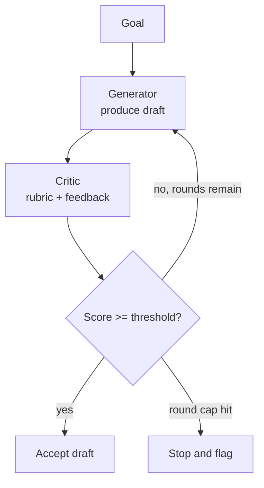
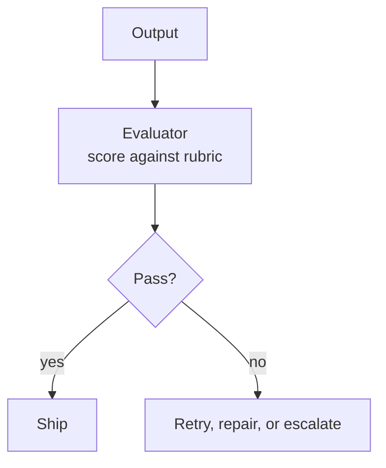
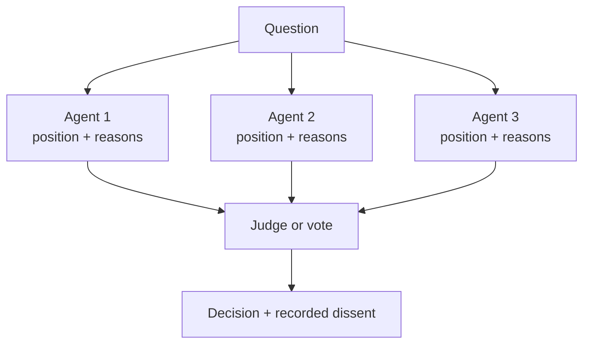

# Debate, Critic, and Evaluator Agents

> **Interview answer (say this first).** Independent judgement means a party that did not write the work checks the work. There are three patterns. A **critic** reviews a draft and returns specific feedback that drives a revision, in a loop. An **evaluator** scores an output against a rubric and returns pass or fail, as a gate. A **debate** has several agents argue different positions, and a judge or a vote decides. The benefit comes from a different context, a different model, or a different perspective — not from "more thinking". Two risks dominate: **self-preference**, where a judge favours work that resembles its own, and **collusion**, where agents echo each other so agreement adds no information. The controls are the same in every case: an explicit rubric, a pass threshold, a round cap, and a cost cap. Independent judgement is worth it when a wrong answer is expensive and the failure is detectable; it is waste when the task is easy or the rubric is vague. In production you combine it with an offline evaluation harness: the harness sets the baseline, the live critic catches local errors.

> **Note:**
>
> **Verified.** Every runnable example on this page was executed offline in plain Python (Python 3.14). No model calls were made. All prices and scores are **illustrative** and belong to no vendor. Where a line represents model output, it is labelled **illustrative**.

## Why this exists

A single agent grades its own homework, and it is biased toward its own answer. The usual failure modes are predictable:

- **Self-approval.** The generator accepts its own draft because it looks like what it intended, not because it is correct.
- **No rubric.** "Is this good?" is not a test. Without criteria, feedback is vague and non-actionable.
- **Oscillation.** A critic and generator bounce between two states forever, each change undoing the last.
- **Collusion.** Two agents agree because one copied the other, so agreement is mistaken for correctness.
- **Self-preference.** A judge approves work from its own model family more often than outside work.
- **Unbounded cost.** Debate rounds multiply the token bill; criticism loops multiply it again.

Independent judgement attacks the first and second failures. Explicit limits and diversity attack the rest. The pattern is an improvement loop, not a truth machine: it reduces a class of errors, and only when the rubric and the judge are sound.

> **Note:**
>
> **The one-sentence purpose.** Independent judgement buys a second perspective on quality; it is worth its cost only when the rubric is explicit, the judge is genuinely independent, and the loop is capped.

## Start from zero

| Word | Plain meaning |
| --- | --- |
| **Independent judgement** | A check by a party that did not produce the work. |
| **Critic** | A reviewer that returns specific feedback so a draft can be improved. |
| **Evaluator** | A judge that scores an output against a rubric and returns pass or fail. |
| **Debate** | Several agents argue different positions, then a judge or vote decides. |
| **Judge** | The agent or rule that picks a winner in a debate. |
| **Rubric** | An explicit scoring sheet: the criteria and their weights. |
| **Criterion** | One line of the rubric, such as groundedness or completeness. |
| **Threshold** | The score at which the output is accepted. |
| **Round** | One critic pass or one debate exchange. |
| **Oscillation** | The loop repeats between two states without reaching the threshold. |
| **Self-preference** | A judge favours work that resembles its own. |
| **Self-consistency** | The same model produces the same opinion when asked again. |
| **Collusion** | Agents reinforce each other so agreement carries no new information. |
| **Echo chamber** | A group where every member repeats the dominant view. |
| **Diversity** | Different models, prompts, or contexts among the judges. |
| **Majority vote** | The most common answer among several independent answers. |
| **Tie-break** | The rule used when votes are equal: summed confidence, then a fixed fallback. |
| **Adjudication** | The final decision after arguments are gathered. |
| **LLM-as-judge** | Using a model to score or compare outputs. |
| **Position bias** | A judge preferring the first or second option because of its order. |
| **Golden set** | A fixed set of inputs with known-good answers for offline scoring. |
| **Evaluation harness** | Code that runs a system over a dataset and computes metrics. |
| **Round cap** | The maximum number of critic or debate rounds. |
| **Cost cap** | The maximum spend before the loop must stop. |
| **Calibration** | How well the judge's scores line up with real quality. |

Three distinctions do most of the work:

- **Critic vs evaluator.** A critic produces feedback that drives a revision. An evaluator produces a verdict that gates the output. A critic improves; an evaluator decides.
- **Debate vs critic.** A critique is one reviewer against one author. A debate is several positions against each other, then a decision.
- **Agreement vs correctness.** Two agents agreeing is only evidence if they arrived independently. Copying destroys the evidence.

## The core idea

Think of scientific peer review.

- The **critic** is a referee: it reads the draft, states what is wrong, and asks for a revision. It does not write the paper.
- The **evaluator** is the editor's checklist: it confirms the paper meets each requirement and accepts or rejects it. It decides.
- The **debate** is a conference panel: several experts argue, and a chair calls the decision.
- **Independence** is the whole point. A referee from the author's own lab, reading the author's own notes, adds little.

The three patterns as diagrams. A **critic** is a revision loop:



An **evaluator** is a gate:



A **debate** gathers positions, then decides:



Compare the patterns before choosing:

| Pattern | Who judges | Output | Best when | Typical cost | Main risk |
| --- | --- | --- | --- | --- | --- |
| Critic | One reviewer of the draft | Feedback plus revised draft | A draft exists and quality can improve | 2x per round | Oscillation, vague feedback |
| Evaluator | One judge with a rubric | Pass or fail plus reasons | You need a gate before shipping | 2x | Rubric drift, self-preference |
| Debate | Several positions, then a judge or vote | One decision plus dissent | The answer is contested and errors are costly | Nx per round | Collusion, groupthink |
| Self-consistency | The same model, sampled | Majority answer | Cheap variance reduction | 2-5x | Correlated errors |
| Deterministic check | Code, not a model | Pass or fail | The criterion is checkable | near zero | Only covers checkable facts |

## How it works

1. **Decide whether judgement is needed.** Use it when a wrong answer is expensive and the failure is detectable. Skip it for easy tasks where the rubric would be trivially satisfied.
2. **Write the rubric first.** List the criteria and their weights. If you cannot write it, you cannot evaluate, and the judge will invent its own standards.
3. **Separate the producer from the judge.** A different call, a different prompt, and ideally a different model. The generator must not grade itself.
4. **Pick the pattern.** A draft that can improve → critic loop. A binary gate → evaluator. A contested question → debate.
5. **Make feedback actionable.** The critic returns the failing criterion and a concrete change, not a score alone.
6. **Set a threshold and a round cap.** Accept at the threshold; stop at the cap. Both exits are mandatory.
7. **Detect oscillation.** Record each draft or verdict. If the loop revisits a state, stop and flag it; more rounds will not help.
8. **Protect independence in a debate.** Use different models or genuinely different contexts. Independent answers first, discussion second.
9. **Decide the aggregation rule up front.** Majority vote, weighted confidence, or a judge, plus a deterministic fallback such as alphabetical order when even the confidence sums tie. Write it down before you see the answers to avoid motivated reasoning.
10. **Record dissent.** A debate that ends 2-to-1 should keep the minority reason. It is often where the real risk lives.
11. **Measure the judge against a golden set.** Compare judge scores to known-good labels. An uncalibrated judge adds cost without reliability.
12. **Cap the cost, not just the rounds.** Debate with N agents for R rounds costs N times R per judgment. Compute the ceiling before enabling it.
13. **Combine with an evaluation harness.** The offline harness scores the system over a dataset; the live critic catches specific errors at run time. They answer different questions.
14. **Re-check the judge when the generator improves.** A critic tuned for one generator can become too lenient or too harsh after a model change.

## The syntax you will use

**A critic loop with a threshold and a cap.** Both exits matter; the score history is the audit trail.

```python
def critic_loop(generate_fn, critique_fn, threshold=0.9, max_rounds=4):
    draft = generate_fn(0, None)              # round 0, no feedback yet
    scores = []
    for i in range(max_rounds):
        score, feedback = critique_fn(draft)  # critic returns a score and notes
        scores.append(score)
        if score >= threshold:
            return draft, "passed", scores
        draft = generate_fn(i + 1, feedback)  # the revision acts on the notes
    return draft, "max_rounds", scores
```

The loop hands the critic's `feedback` back to the generator, so each revision acts on specific notes rather than on a bare round index.

**An evaluator with a weighted rubric.** The verdict names the failed criteria, so the next step can act on it.

```python
RUBRIC = {"grounded": 0.4, "complete": 0.3, "on_tone": 0.3}
PASS_BAR = 0.8

def evaluate(draft: dict) -> dict:
    score = sum(RUBRIC[k] * draft[k] for k in RUBRIC)
    passed = score >= PASS_BAR
    # Name failed criteria only when the draft misses the bar, so a passing
    # draft can never report a non-empty failed list.
    failed = [k for k in RUBRIC if draft[k] < 1.0] if not passed else []
    return {"score": round(score, 2), "pass": passed, "failed": failed}
```

**A debate with a majority, a confidence tie-break, and a deterministic final fallback.** The aggregation rule is explicit code, decided before the votes arrive.

```python
def debate(votes):
    tally = {}
    for name, choice, conf in votes:
        tally[choice] = tally.get(choice, 0) + 1
    top = max(tally.values())
    winners = [c for c, n in tally.items() if n == top]
    if len(winners) == 1:
        return winners[0], "majority"
    tied = {c: sum(conf for _, ch, conf in votes if ch == c) for c in winners}
    best = max(tied.values())
    finalists = sorted(c for c, v in tied.items() if v == best)   # sorted: order-independent
    if len(finalists) == 1:
        return finalists[0], "confidence tie-break"
    return finalists[0], "deterministic tie-break (alphabetical)"
```

If the summed confidence is also equal, the rule returns the alphabetically first finalist. That fallback is fixed and order-independent, so an exact tie can never depend on the order the votes happened to arrive in.

**Modelling self-preference.** Apply an illustrative bias toward the judge's own family and watch the winner change.

```python
def pick(score_own: float, score_other: float) -> str:
    return "own-family" if score_own >= score_other else "other-family"

true_own, true_other, bias = 0.70, 0.80, 0.20
print(pick(true_own + bias, true_other))   # biased judge
print(pick(true_own, true_other))          # neutral judge
```

**Costing a debate.** Rounds multiply the bill, so compute the ceiling before you enable it.

```python
PRICE_IN, PRICE_OUT = 3.0, 15.0            # illustrative, per million tokens

def cost(n_agents, rounds, in_tok=1000, out_tok=200,
         judge_in=1500, judge_out=300):
    debaters = n_agents * rounds * (in_tok * PRICE_IN + out_tok * PRICE_OUT) / 1e6
    judge = (judge_in * PRICE_IN + judge_out * PRICE_OUT) / 1e6
    return debaters + judge
```

**A deterministic pre-check.** Cheap code catches the checkable failures before an expensive judge is called.

```python
def precheck(output: str, required_terms: list) -> list:
    return [t for t in required_terms if t.lower() not in output.lower()]
```

## Examples: simple to real

**Example 1 — a critic loop that stops at the threshold.**

Each revision improves the score, and the loop accepts the third draft. Verified:

```text
critic loop:
  status: passed  scores: [0.4, 0.7, 1.0]
```

It stopped because `1.0 >= 0.9`, not because it ran out of rounds. Without the threshold it would keep revising a good draft; without the cap it would keep going forever.

**Example 2 — oscillation, and the round cap that stops it.**

The critic alternates between two states, neither above the threshold. Verified:

```text
oscillation:
  status: max_rounds  scores: [0.5, 0.4, 0.5, 0.4]  (repeats the same two states)
```

The score pattern `0.5, 0.4` repeats. Detecting that cycle and stopping early saves rounds. A cap alone still pays for the repeated pair.

**Example 3 — an evaluator gates against a weighted rubric.**

Three outputs, three verdicts, with the failed criterion named only when the gate fails. Verified:

```text
evaluator gate:
  {'grounded': 1.0, 'complete': 1.0, 'on_tone': 1.0} -> {'score': 1.0, 'pass': True, 'failed': []}
  {'grounded': 1.0, 'complete': 0.7, 'on_tone': 1.0} -> {'score': 0.91, 'pass': True, 'failed': []}
  {'grounded': 1.0, 'complete': 0.0, 'on_tone': 1.0} -> {'score': 0.7, 'pass': False, 'failed': ['complete']}
```

The third output is grounded and on-tone but incomplete, so it scores `0.7` and fails. The middle output is fractional (`0.91`) yet still clears the bar, and it reports no failed criterion: a passing draft can never list one. Naming `complete` as the failed criterion is what makes the verdict actionable instead of just negative.

**Example 4 — self-preference flips the winner.**

With an illustrative true quality of `0.70` for the judge's own family and `0.80` for another, and an illustrative bias of `0.20`. Verified:

```text
self-preference:
  biased judge:  own 0.90 vs other 0.80 -> own-family
  neutral judge: own 0.70 vs other 0.80 -> other-family
```

The biased judge picks its own family; the neutral judge picks the better work. This is why serious evaluation uses a different model, or hides which output came from where.

**Example 5 — collusion adds agreement but no information.**

With an illustrative per-agent correctness probability of `0.80`. Verified:

```text
collusion check:
  independent pair: catches A when A wrong and B right = 0.16
  colluding pair:   B copies A, so disagreement rate = 0.00 and errors go unseen
```

An independent second opinion catches some of A's errors. A copied opinion catches none, no matter how confident the agreement looks. Diversity is not a nice-to-have; it is the source of the value.

**Example 6 — debate decides, and debate costs.**

A majority verdict and a tie resolved by summed confidence. Verified:

```text
debate:
  verdict: ('approve', 'majority')
  tie case: ('approve', 'confidence tie-break')
```

The cost of running that debate, using illustrative prices and token counts:

```text
debate cost (illustrative prices):
  1 agent(s) x 1 round(s): $0.0150
  1 agent(s) x 3 round(s): $0.0270
  3 agent(s) x 1 round(s): $0.0270
  3 agent(s) x 3 round(s): $0.0630
  5 agent(s) x 1 round(s): $0.0390
  5 agent(s) x 3 round(s): $0.0990
```

Five agents for three rounds costs about 6.6 times a single agent for one round. Debate buys better decisions on contested, high-stakes questions, and nothing at all on easy ones.

## In production

- **Write the rubric before the judge.** A rubric with weights is testable; a vibe is not. If you cannot name the criteria, you cannot trust the score.
- **Separate producer from judge by model where it matters.** A different model family reduces self-preference and correlated errors. If you must share a model, at least change the prompt and hide the source.
- **Always set a threshold and a round cap.** Accept at the threshold, stop at the cap, and flag when the cap fires. An uncapped critic loop is unbounded spend.
- **Detect oscillation explicitly.** Store the draft or verdict hash each round. A repeated state means stop; more rounds will not break the cycle.
- **Make feedback cite a criterion.** "Groundedness is weak because claim X has no source" beats "make it better". Actionable feedback is what drives a real revision.
- **Guard debate against collusion.** Let agents answer independently first, then discuss. Different models or contexts beat several copies of one prompt.
- **Aggregate by a rule fixed in advance.** Majority, weighted confidence, or a judge. Choosing the rule after seeing the votes is how bias enters.
- **Keep the dissent.** A 2-to-1 decision should record the minority reason. The losing argument often predicts the failure.
- **Calibrate the judge on a golden set.** Compare its scores to known-good labels. An uncalibrated judge can be confidently wrong, which is worse than no judge.
- **Watch for position and verbosity bias.** Shuffle option order and control for length, or the judge may prefer the first or longest answer rather than the best.
- **Cost the loop before enabling it.** N agents times R rounds is the multiplier. Put a spend cap around the whole pattern, not just a round cap.
- **Combine live judging with an offline harness, and refresh the judge when the generator changes.** The harness measures the system over a dataset; the live critic catches a specific error now. A model upgrade can make an old critic too lenient, so re-calibrate after every major change.

## Interview questions

### 1. What is independent judgement, and why does it matter?

**Answer.** It is a check performed by a party that did not produce the work. It matters because a model grading its own output is biased toward its intended answer, not the correct one. Independent judgement gives a second context, a second model, or a second perspective. It reduces a class of errors, but only when the rubric is explicit and the judge is genuinely independent.

**Follow-up: "When is a second call not independent?"** When it uses the same model, the same context, and the same prompt. That is a re-run, not a review. It reduces sampling noise but not systematic bias.

**Trap.** Assuming any second opinion adds value. A copied opinion adds only agreement.

### 2. Critic versus evaluator — what is the difference?

**Answer.** A critic produces feedback that drives a revision; it is an improvement loop. An evaluator produces a pass or fail against a rubric; it is a gate. A critic answers "what should change?", an evaluator answers "is this good enough?". You can use both: the critic improves the draft, the evaluator decides whether it ships.

**Follow-up: "Which one do you put in the critical path?"** The evaluator, because it is the decision. Run the critic earlier, or offline, so it does not block every request.

**Trap.** Using a critic as a gate. Feedback is not a pass or fail; without a threshold the loop never ends.

### 3. How does a debate pattern work?

**Answer.** Several agents independently form positions on a question, then exchange arguments, and a judge or a vote decides. The value comes from diversity: different models, prompts, or contexts produce different errors, so disagreement surfaces uncertainty. The decision rule is fixed in advance — majority, weighted confidence, or a judge — and the dissent is recorded.

**Follow-up: "What makes a debate useless?"** Collusion. If the agents share a context or copy each other, they agree for the wrong reason and the debate adds cost without information.

**Trap.** Letting agents see each other's answers before forming their own. That converts independent opinions into an echo chamber.

### 4. What is self-preference, and how do you reduce it?

**Answer.** Self-preference is a judge favouring work that resembles its own: same model family, same style, same phrasing. It shows up as an inflated score for in-family output. I reduce it by using a different model for the judge, hiding the source of each candidate, randomising order, and calibrating the judge against a golden set. Where the criterion is checkable, I use deterministic code instead of a model.

**Follow-up: "Can you remove it completely?"** No. You can reduce it, measure it, and route the highest-stakes decisions to a human or a deterministic check.

**Trap.** Trusting a same-model judge because it is cheap. The saving is small and the bias is systematic.

### 5. How do you stop a critic loop from running forever?

**Answer.** Three controls. A pass threshold so it stops when good enough. A round cap so it stops when progress stalls. And oscillation detection so it stops when it revisits a state. All three are needed because each covers a different failure: never good enough, never finishing, and going in circles.

**Follow-up: "What do you do when the cap fires?"** Flag it, return the best-scoring draft with its score, and route to a human or a fallback. Never silently ship an unaccepted draft.

**Trap.** Relying on the round cap alone. It bounds cost but still pays for every useless round before it fires.

### 6. When is independent judgement worth the cost?

**Answer.** When a wrong answer is expensive and the failure is detectable by the judge. Examples: a legal or medical summary, a customer-facing policy answer, code that must compile and pass tests. It is not worth it for easy tasks, for purely subjective style, or where the rubric cannot be written. I estimate the error rate it removes and compare that to the multiplied cost.

**Follow-up: "How do you prove it is worth it?"** Run the system with and without the judge on a golden set. If the judge does not reduce the error rate on that set, it is decoration.

**Trap.** Adding a critic to every output. Cost doubles for a benefit that is real only on a subset of tasks.

### 7. How does debate interact with an evaluation harness?

**Answer.** They answer different questions. The harness is offline and systematic: it runs the system over a dataset and computes metrics such as pass rate, cost, and latency. Live judging, including debate, is per-run and local: it catches a specific error now. Use the harness to decide whether a critic or debate config is worth keeping; use the live pattern to catch errors the harness cannot see in advance.

**Follow-up: "What is the risk of tuning only on the harness?"** Overfitting. The pattern learns the test set. Keep a held-out set and refresh it as traffic changes.

**Trap.** Using the live judge as your only measurement. It cannot tell you the system-wide error rate.

### 8. What are the failure modes of an LLM judge?

**Answer.** Self-preference, position bias, verbosity bias, rubric drift, and plain miscalibration. Self-preference favours its own family. Position bias favours the first or second option. Verbosity bias favours longer answers. Rubric drift means the judge's standard changes as the prompt or model changes. Miscalibration means its scores do not track real quality. Mitigations are a different judge model, shuffled order, length controls, a pinned rubric, and periodic calibration on a golden set.

**Follow-up: "Which failure is hardest to catch?"** Miscalibration, because the scores still look reasonable. Only a golden set reveals that the judge is confidently wrong.

**Trap.** Treating the judge's score as ground truth. It is another model output, with its own biases and error rate.

## Remember this

- **A critic improves; an evaluator decides; a debate adjudicates.** Pick the one that matches the question.
- **Independence is the value.** Same model, same context, same prompt is a re-run, not a review.
- **Rubric, threshold, round cap, cost cap.** All four, every time; missing one produces a known failure mode.
- **Detect oscillation, not just runaway rounds.** A repeated state means stop early and flag.
- **Calibrate the judge on a golden set, and expect self-preference and collusion.**
