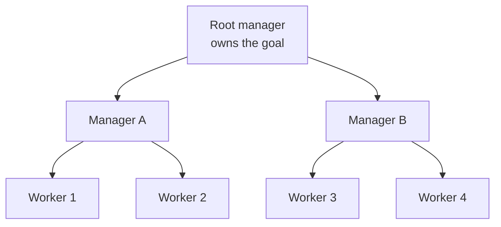
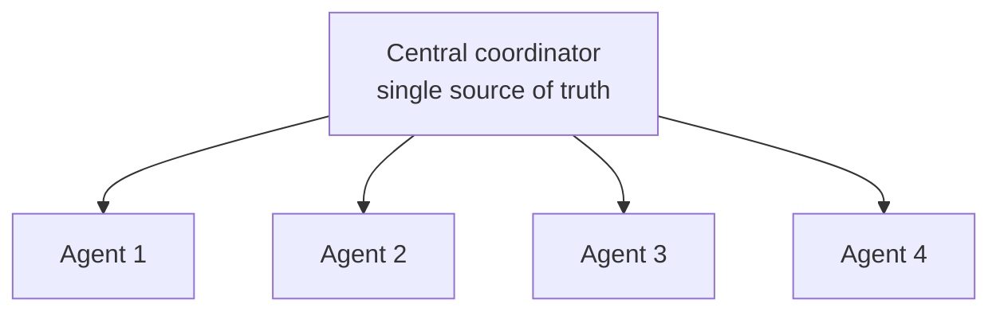
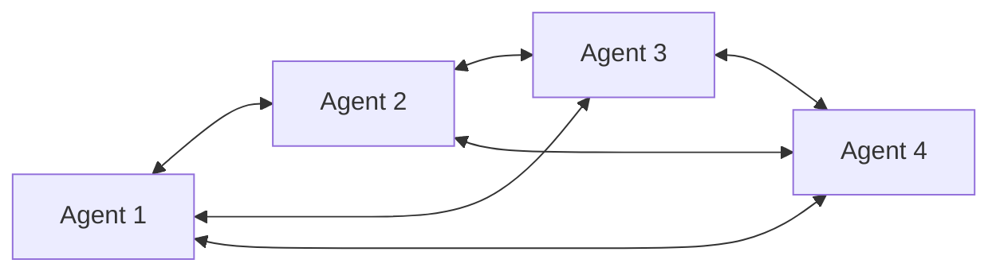

# Hierarchical and Peer-to-Peer Agents

> **Interview answer (say this first).** Topology is the shape of who talks to whom. There are two families. A **hierarchical** system is a tree: a manager delegates to sub-managers, who delegate to workers. **Depth** is the number of levels and **fan-out** is how many direct reports each manager has. A **peer-to-peer** system has no fixed manager; agents talk to each other directly and coordinate by negotiation. A **central coordinator** is the midpoint: one hub in a star that everyone reports to. Hierarchy gives clear ownership, bounded fan-out, and easy per-branch tracing, but it adds a round trip per level and makes each manager a bottleneck and a single point of failure for its subtree. Peer-to-peer gives resilience and locality, but message count grows quickly and ordering, consensus, and observability get hard. In practice, pick hierarchy for work that decomposes cleanly, keep depth shallow (two or three levels), and use peer-to-peer only where robustness or direct negotiation is genuinely worth the coordination cost.

> **Note:**
>
> **Verified.** Every runnable example on this page was executed offline in plain Python (Python 3.14). No model calls were made. All numbers are **illustrative**. Where a line represents model output, it is labelled **illustrative**.

## Why this exists

People draw a multi-agent system and never think about its shape. The shape decides most of its operational behaviour:

- **Deep hierarchies are slow.** Every level adds a delegation and a response, so depth multiplies latency.
- **Wide fan-out overloads the root.** One manager with sixty direct reports has a context and attention problem, not a scale solution.
- **Central coordinators become bottlenecks.** All state and all messages pass through one component, which also becomes a single point of failure.
- **Peer-to-peer explodes.** Full mesh messaging grows with the square of the agent count, and ordering becomes a coordination problem.
- **Emergent coordination is hard to debug.** With no fixed controller, a failure has no obvious owner and no clean trace.
- **Failure blast radius is invisible on the whiteboard.** Losing one manager in a deep tree can cut off a whole branch of workers.

Choosing a topology deliberately — and writing down its depth and fan-out limits — turns those surprises into design decisions.

> **Note:**
>
> **The one-sentence purpose.** Topology decides latency, message volume, failure blast radius, and how hard the system is to trace; choose the shape on purpose, and keep it shallow.

## Start from zero

| Word | Plain meaning |
| --- | --- |
| **Topology** | The shape of the system: who talks to whom. |
| **Hierarchy** | A tree: managers delegate down to sub-managers and workers. |
| **Depth** | The number of levels from root to leaf. |
| **Fan-out (span of control)** | How many direct reports one manager has. |
| **Root** | The top manager that owns the goal. |
| **Manager** | A role that decomposes work and delegates it downward. |
| **Sub-manager** | A manager that reports to another manager. |
| **Leaf / worker** | A role at the bottom of the tree that does the work. |
| **Tree edge** | One link between a manager and a direct report. |
| **Peer-to-peer** | Agents talk directly to each other with no fixed manager. |
| **Mesh** | A peer topology where agents connect to many others. |
| **Central coordinator** | One hub everyone reports to; a star topology. |
| **Star** | A topology with one centre and many spokes. |
| **Emergent coordination** | Order that arises from local rules, with no central controller. |
| **Negotiation** | Peers trading offers and commitments to agree on work. |
| **Broadcast** | Sending one message to many peers at once. |
| **Gossip** | Spreading information peer to peer, like a rumour. |
| **Quorum** | The minimum number of peers that must agree for a decision. |
| **Consensus** | A single agreed value among peers that may disagree. |
| **Backpressure** | Slowing producers when consumers cannot keep up. |
| **Bottleneck** | A component whose capacity limits the whole system. |
| **Single point of failure** | One component whose loss stops the system. |
| **Blast radius** | How much of the system one failure takes down. |
| **Observability** | Being able to see what happened from logs, traces, and metrics. |
| **Trace** | The recorded path of one run across agents. |
| **Message complexity** | How the number of messages grows with the number of agents. |
| **Routing table** | The mapping from a task to the agent that handles it. |
| **Depth limit** | The maximum levels a run may traverse. |
| **Fan-out limit** | The maximum direct reports one manager may have. |

Three distinctions do most of the work:

- **Hierarchy vs star.** A hierarchy has several managers in a tree. A star has exactly one coordinator and flat spokes. The star is simpler but concentrates all load and all failure in one place.
- **Central vs emergent coordination.** Central coordination assigns work from one place. Emergent coordination has no assigner; order comes from local rules. Central is easier to reason about; emergent is harder to debug.
- **Depth vs fan-out.** For the same number of workers, more depth means more latency; more fan-out means more load per manager. They trade against each other.

## The core idea

Think of two ways to organise a large project.

- A **hierarchy** is a company org chart. The chief splits the goal into departments, each department head splits it into teams, and teams do the work. Responsibility is clear; bad news travels up several levels before anyone acts.
- A **central coordinator** is a single dispatcher. Every request goes to one desk, which assigns it. Simple and consistent, but that desk is the whole system's choke point.
- A **peer-to-peer** group is a cooperative of freelancers. They talk directly, divide the work by negotiation, and route around a missing member. Resilient and local, but noisy and hard to audit.

The three shapes as diagrams. A **hierarchy** is a tree:



A **central coordinator** is a star:



A **peer-to-peer** group connects directly:



Compare the shapes before choosing:

| Topology | Coordination | Strength | Weakness | Message growth | Failure mode |
| --- | --- | --- | --- | --- | --- |
| Hierarchy | Central, multi-level | Clear ownership, per-branch tracing | Latency per level, manager bottleneck | Linear in nodes | One manager cuts off its subtree |
| Star / coordinator | Central, one level | One source of truth, simple | Single choke point and single point of failure | 2 per worker | Coordinator down stops everything |
| Peer-to-peer | Emergent, direct | Resilience, locality, negotiation | Ordering, consensus, observability | Quadratic in agents | Storms and inconsistency |
| Hybrid (edge + coordinator) | Mixed | Local autonomy, global truth | More moving parts to reason about | Between the two | Unclear ownership at the seam |

The geometry of a hierarchy follows a few formulas. Depth and fan-out trade against each other for a fixed number of leaves, and they decide both latency and per-manager load.

```python
def tree_nodes(f: int, d: int) -> int:
    return (f ** (d + 1) - 1) // (f - 1)     # root + f + f^2 + ... + f^d

def tree_leaves(f: int, d: int) -> int:
    return f ** d

def hierarchy_latency(depth: int, per_level_s: float) -> float:
    return 2 * depth * per_level_s            # request down, result up
```

## How it works

1. **Start from the decomposition, not the org chart.** Split the goal into sub-goals. The shape should follow the work, not a desire to look organised.
2. **Count the real levels.** If managers only forward messages and never decompose differently, remove the level. Every level that adds no decisions adds only latency.
3. **Set a fan-out limit.** A manager can hold only so many direct reports before its context and attention degrade. Cap it and add a level only when the fan-out is truly exceeded.
4. **Prefer shallow over deep.** For a fixed number of workers, two levels of moderate fan-out beat four levels of tiny fan-out, because latency grows with depth.
5. **Give each manager a decision, not a relay.** A manager must decompose, prioritise, or merge. A pure relay is a wasted round trip.
6. **Choose central coordination when you need one truth.** A coordinator is the simplest way to order work and avoid conflicting writes. Accept that it concentrates load and failure.
7. **Use peer-to-peer for locality and resilience.** Peers shine when agents must negotiate directly and when no single point should stop the system.
8. **Bound peer communication.** Cap who may talk to whom, how often, and how many rounds. An unbounded mesh becomes a message storm.
9. **Fix an ordering and consensus rule.** Peers need a way to agree: quorum, a designated leader per decision, or a deterministic tie-break. Emergent order is not free.
10. **Plan for a manager failure.** With hierarchy, decide whether a lost manager fails its subtree or promotes a deputy. With a star, decide the coordinator failover.
11. **Make the topology observable.** Attach one run id to the whole system, and record the path through the tree or the messages among peers. A trace per branch is the hierarchy's advantage; preserve it.
12. **Add backpressure.** When a manager is saturated, slow the callers rather than queueing forever. A bottleneck with an unbounded queue is a latency bomb.
13. **Watch for the coordinator becoming the bottleneck.** Measure its message and token load. If it dominates, either shard it by domain or push decisions to sub-managers.
14. **Test failure and shutdown, not just the happy path.** Remove a manager, saturate a peer, and drop a message. The topology's weaknesses only appear under failure.

## The syntax you will use

**Tree geometry.** Depth and fan-out determine nodes, leaves, and edges.

```python
def tree_nodes(f: int, d: int) -> int:
    return (f ** (d + 1) - 1) // (f - 1)

def tree_edges(f: int, d: int) -> int:
    return tree_nodes(f, d) - 1          # a tree with N nodes has N-1 edges
```

**Latency per level.** A hierarchy pays a delegation and a response at every level.

```python
def hierarchy_latency(depth: int, per_level_s: float) -> float:
    return 2 * depth * per_level_s       # down then up; flat star is 2 x one level

def flat_latency(per_level_s: float) -> float:
    return 2 * per_level_s
```

**Message counts by topology.** These are the formulas that decide what scales. `n` counts agents; every topology uses the same unit, one message per request or result across a link.

```python
def star_messages(n_workers: int) -> int:
    return 2 * n_workers                      # one link per worker: request + result

def mesh_messages(n_agents: int) -> int:
    return n_agents * (n_agents - 1)          # directed: every pair talks both ways

def tree_messages(f: int, d: int) -> int:
    return 2 * tree_edges(f, d)               # one link per edge: request down + result up
```

**Coordinator load.** How many messages touch the centre per round, by topology. `fan_out` is the root's number of direct reports.

```python
def coordinator_load(topology: str, n: int, fan_out: int = 3) -> int:
    if topology == "star":
        return 2 * n                     # every worker link touches the centre
    if topology == "tree":
        return 2 * fan_out               # root: one link per direct report, x2
    return 2 * (n - 1)                   # peer: one node's links to every other peer
```

**Failure blast radius.** How much of a tree is cut off when one manager dies.

```python
def reachable_after_failure(f: int, d: int, failed_level: int) -> int:
    subtree_leaves = f ** (d - failed_level) if failed_level <= d else 0
    return tree_leaves(f, d) - subtree_leaves
```

**Choosing a shape from the work.** The decision is code, not taste.

```python
def choose_topology(s: dict) -> str:
    if s["needs_single_source_of_truth"] and s["agents"] <= 8:
        return "central coordinator"
    if s["decomposable"] and s["clear_reporting"]:
        return "hierarchy"
    if s["must_tolerate_peer_failure"] or s["peer_negotiation"]:
        return "peer-to-peer"
    return "single agent or workflow"
```

## Examples: simple to real

**Example 1 — tree geometry for three shapes.**

Nodes, leaves, and edges for different depth and fan-out. Verified:

```text
tree shape:
  fan-out=2 depth=3: nodes=15 leaves=8 edges=14
  fan-out=3 depth=2: nodes=13 leaves=9 edges=12
  fan-out=4 depth=2: nodes=21 leaves=16 edges=20
```

More fan-out reaches more leaves in fewer levels, but each manager carries more direct reports. More depth keeps each manager narrow but adds levels to traverse.

**Example 2 — hierarchy latency grows with depth.**

Using an illustrative `0.4s` per level. Verified:

```text
latency (0.4s per level):
  depth=1: hierarchy=0.8s flat=0.8s
  depth=2: hierarchy=1.6s flat=0.8s
  depth=3: hierarchy=2.4s flat=0.8s
  depth=4: hierarchy=3.2s flat=0.8s
```

A depth-4 hierarchy takes four times as long as a flat star for the same coordination step. Flatten the tree until a manager genuinely needs to decompose the work.

**Example 3 — message counts differ by orders of magnitude.**

To coordinate 27 leaf workers. Verified (one unit: a request plus a result per link, so 2 per link; the mesh is counted as directed pairs):

```text
messages to coordinate 27 leaf workers:
  tree (fan-out 3, depth 3): 78   (39 edges x 2)
  star (1 coordinator):      54   (27 links x 2)
  full mesh (27 agents):    702   (27 x 26 directed)
```

On the same unit, the mesh sends `702` messages against the tree's `78` — about nine times as many — and the star is cheapest at `54` because it has no management levels to traverse. Peer-to-peer is not cheaper; it trades message volume for resilience and direct negotiation.

**Example 4 — where the load lands as the system grows.**

Messages per round touching the centre (star and tree root), a single peer, or the whole mesh. Here `n` is the number of worker agents, and the tree uses fan-out 3. Verified:

```text
coordinator messages per round:
  n=  9: star=  18  tree(root)= 6  peer(one)=  16  mesh(total)=  72
  n= 27: star=  54  tree(root)= 6  peer(one)=  52  mesh(total)= 702
  n= 81: star= 162  tree(root)= 6  peer(one)= 160  mesh(total)=6480
```

The star's centre load grows linearly with `n`, and the tree root stays constant at `2 * fan_out` because sub-managers absorb the growth. One peer's own load also grows linearly, at `2 * (n - 1)`, which can look cheap next to the star. But that single inbox is not the cost of a mesh: the total mesh volume is `n * (n - 1)`, which grows quadratically, so peer-to-peer is far more expensive overall (Example 3). The real reason to add a management layer is that it shrinks the root's load without the quadratic blow-up of a mesh.

**Example 5 — the same leaves, three shapes.**

Sixty-four leaves with different depth and fan-out. Verified:

```text
64 leaves, three shapes:
  fan-out=64 depth=1 latency=0.8s root_branches=64
  fan-out= 8 depth=2 latency=1.6s root_branches=8
  fan-out= 2 depth=6 latency=4.8s root_branches=2
```

A flat manager has 64 direct reports: fast but overloaded. A six-level tree has only two branches per manager: calm but six times the latency. The right answer is usually the middle: enough depth to keep fan-out sane, no more.

**Example 6 — a manager failure cuts off its whole subtree.**

Fan-out 3, depth 3, 27 leaves. Verified:

```text
manager failure (fan-out 3, depth 3, 27 leaves):
  one level-1 manager down: 18 of 27 leaves reachable
  one level-2 manager down: 24 of 27 leaves reachable
```

Losing a senior manager removes a third of the workers. This is the hidden cost of depth: it concentrates failure as well as load. Decide up front whether a lost subtree fails the run or is retried by a deputy.

## In production

- **Draw the topology before writing code.** Depth, fan-out, and who talks to whom. Most coordination bugs are visible in the drawing.
- **Keep depth to two or three levels, and re-test after adding one.** Each level adds latency and a failure point. Add a level only when a manager genuinely decomposes the work differently, then check the new critical path.
- **Cap fan-out.** A manager with too many direct reports fails on context and attention. Shard by domain instead of widening.
- **Make every manager a decision-maker.** A relay that only forwards is a wasted round trip. If it does not decompose, prioritise, or merge, remove it.
- **Use a central coordinator for a single source of truth, or a hybrid when local autonomy also matters.** A hub is the simplest way to serialise decisions and avoid conflicting writes; a thin coordinator over local peers keeps that truth without centralising all the work. Then watch the centre for saturation.
- **Budget for the coordinator's load.** In a star, all messages hit the centre. If its load grows with the agent count, shard it or push decisions down.
- **Bound peer-to-peer messaging.** Cap connections, rounds, and message size. A full mesh is quadratic and becomes a storm under load.
- **Fix the consensus rule in advance.** Quorum, a per-decision leader, or a deterministic tie-break. Emergent coordination still needs a decision rule.
- **Plan for manager failure explicitly.** Fail the subtree, promote a deputy, or retry elsewhere. Undefined behaviour here is how a small failure becomes a total one.
- **Preserve per-branch traces.** Attach one run id to the whole system and record the path. The hierarchy's advantage is that a failure localises to a branch.
- **Add backpressure at every manager.** A saturated manager with an unbounded queue turns a slow worker into a system-wide latency spike.
- **Measure message volume, not only token cost.** Coordination messages are real cost and the first symptom of a topology mismatch.

## Interview questions

### 1. What is a hierarchical multi-agent topology?

**Answer.** A tree of roles. A root manager owns the goal and decomposes it into sub-goals, sub-managers decompose further, and leaf workers do the work and report results upward. It gives clear ownership, a bounded number of direct reports per manager, and a trace that localises a failure to a branch. The costs are a round trip per level and a manager that is both a bottleneck and a single point of failure for its subtree.

**Follow-up: "How do you decide depth?"** By how many genuinely different levels of decomposition the work needs, usually two or three. If a level only forwards messages, it is latency with no benefit.

**Trap.** Deep hierarchies for a shallow problem. A three-level tree for a task that one manager can decompose in one step adds two round trips for nothing.

### 2. What do depth and fan-out trade against each other?

**Answer.** For a fixed number of workers, more depth means more latency and more failure points; more fan-out means more load per manager. A flat manager with sixty reports is fast but overloaded; a six-level tree with two reports per manager is calm but slow. The usual answer is a shallow tree with moderate fan-out, chosen so no manager exceeds the attention limit and no branch is more than a couple of round trips deep.

**Follow-up: "How do you compute the shape?"** A tree with fan-out `f` and depth `d` has `f^d` leaves and `(f^(d+1)-1)/(f-1)` nodes. Add an illustrative latency of `2 * d * per_level` to see the cost of depth.

**Trap.** Optimising depth and fan-out by feeling. Write the formula; the trade-off is arithmetic, not taste.

### 3. Hierarchy versus central coordinator — what is the difference?

**Answer.** A hierarchy has several managers arranged in a tree, each owning a branch. A central coordinator is a single hub in a star; every agent reports to it and it owns all decisions. The star is simpler and gives one source of truth, but its centre is the whole system's choke point and single point of failure. A hierarchy distributes load and failure across managers, at the cost of more levels and more latency.

**Follow-up: "When is a star the right choice?"** When the task needs serialised decisions or a single authoritative state and the agent count is small. Beyond that, the centre saturates.

**Trap.** Calling a hierarchy "more scalable" without checking the root. A hierarchy is only scalable if the root's load stops growing as you add leaves — which is exactly what sub-managers are for.

### 4. When would you choose peer-to-peer over hierarchy?

**Answer.** When resilience and direct negotiation matter more than clean ownership. Peers route around a failed member, can act locally without waiting for a manager, and can negotiate a division of work without a scheduler. The price is message volume, ordering, consensus, and observability. I choose peer-to-peer when no single point should stop the system and the agents genuinely need to talk to each other.

**Follow-up: "What is the first thing that breaks at scale?"** Message volume. Full mesh grows with the square of the agent count, so cap connections and introduce gossip or a partial mesh.

**Trap.** Assuming peer-to-peer is decentralised and therefore automatically robust. A message storm or an unresolved consensus is a failure mode too.

### 5. What is emergent coordination, and why is it hard?

**Answer.** It is order that arises from local rules with no central controller, for example agents claiming work from a shared queue or gossiping state until views converge. It is hard because there is no single place that knows the global state, so a failure has no obvious owner and the trace is a web of messages. You also need explicit rules for conflict and consensus, or agents will disagree indefinitely.

**Follow-up: "How do you make it observable?"** One run id across all messages, causal ordering in the trace, and a dashboard of per-agent claims and conflicts. Emergent systems need more instrumentation, not less.

**Trap.** Treating emergence as magic that needs no rules. Without a consensus rule and a conflict rule, it is just noise.

### 6. How does topology affect latency and observability?

**Answer.** Latency: hierarchy and star pay one round trip per level, so depth directly multiplies it; peer-to-peer can act locally but may need extra consensus rounds. Observability: hierarchy is easiest because a failure localises to a branch and the trace is a tree; a star has one log but a choke point; peer-to-peer is hardest because messages cross every which way and need causal ordering to reconstruct.

**Follow-up: "Which topology is best for debugging?"** Hierarchy. A tree trace maps to the responsibility structure, so you can walk from the symptom to the branch that failed.

**Trap.** Choosing peer-to-peer for elegance and then discovering you cannot explain a failure. Budget for tracing before you choose the topology.

### 7. When does a hierarchy become a bottleneck?

**Answer.** When a manager's load grows with the number of leaves instead of staying bounded. Symptoms: the root's queue grows, latency rises faster than worker count, and the root's context is full of status updates. The fixes are to shard the domain across more sub-managers, push decisions down, or replace the tree with a hybrid where local peers coordinate and only exceptions reach the top.

**Follow-up: "How do you detect it early?"** Track messages and tokens per manager, not just per run. A manager whose share rises as you scale is the bottleneck before latency shows it.

**Trap.** Adding workers to a saturated manager. That adds demand to the bottleneck and makes it worse.

### 8. How do you make a topology safe against failures?

**Answer.** Define the failure policy per node. For a manager, decide whether its subtree fails, a deputy takes over, or the work is rescheduled elsewhere. For a coordinator, define failover. For peers, set retries, timeouts, and a consensus rule that tolerates missing members. Add backpressure so a slow node slows its callers instead of queueing forever. Then test by removing a manager and saturating a peer, not just by running the happy path.

**Follow-up: "What is blast radius, and how do you shrink it?"** It is how much of the system one failure takes down. Shrink it by keeping depth shallow, giving each branch a fallback, and not letting one node own all state.

**Trap.** Assuming redundancy without defining takeover. Two managers that both believe they own a branch produce duplicate work and conflicting writes.

## Remember this

- **Topology decides latency, message volume, blast radius, and traceability.** Choose it on purpose.
- **Keep hierarchies shallow.** Every level adds a round trip and a failure point; every manager must actually decide something.
- **Cap fan-out and watch the centre.** A star's coordinator load grows with the agent count; sub-managers are what keep the root's load flat.
- **Peer-to-peer trades cost for resilience.** Message count grows quadratically, and consensus and observability are the real work.
- **Define failure and consensus rules before you need them.** Undefined takeover is how a small failure becomes a total one.
