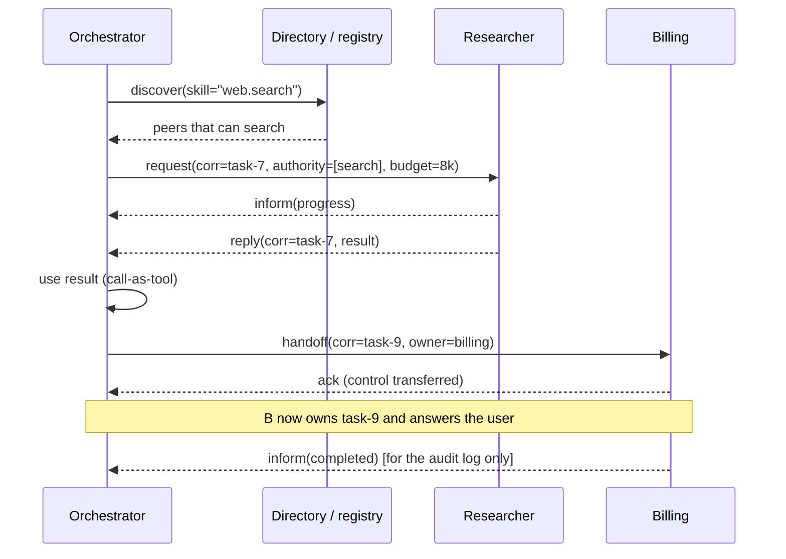

# Agent Communication, Delegation, and Handoffs

> **Interview answer (say this first).** Agents do not share a brain; they pass **messages**. A message names a sender, a recipient, a **performative** (request, inform, reply, failure, handoff), a **correlation id** that ties it to one task, a body, and a deadline. **Delegation** assigns a task with explicit authority, constraints, budget, and an escalation path: the delegatee does the work, but the delegator stays accountable. A **handoff** transfers control so the peer owns the rest of the task; **calling another agent as a tool** keeps the caller in control and consumes the result. **Capability discovery** is how an agent learns what a peer can do — a registry or Agent Card lists skills, and the caller matches the need to a skill before sending work. The **ownership contract** records who owns the task, who may cancel it, and who answers for the outcome.

> **Note:**
>
> **Verified.** Every runnable pure-Python example on this page was executed on Python 3.14. The message envelope, delegation validation, ownership state machine, capability discovery, async correlation, and tool-call-versus-handoff comparison all produced the outputs shown. Every JSON payload was parsed with `json.loads`.

## Why this exists

A single agent calls tools and moves on. The moment a second agent exists, every step becomes a conversation with a stranger: it may be slow, it may be busy, it may misunderstand, and it may die mid-task. Without a shared message format and a clear ownership rule, that conversation turns into guesswork.

Three failures appear immediately:

- **Lost work.** The orchestrator sends "do the refund" and gets silence. Was the message received? Is the task still running? Can it be cancelled?
- **Unclear responsibility.** Both agents think the other one will answer the user. The user waits forever.
- **Overreach.** The sub-agent uses a tool nobody authorised, because the request never said what it may and may not do.

The naive fix is to import the other agent as a function:

```text
result = other_agent("do the refund")   # blocks, no id, no cancel, no status
```

That hides every hard question. There is no correlation id to follow, no budget, no escalation path, and no record of who owned the task when it failed.

Real agent communication is message passing with an explicit contract: a structured envelope, a declared authority, and a rule for who owns the task at each moment. Delegation and handoffs are the two ways to use that contract.

> **Tip:**
>
> **The one-sentence purpose.** Communication is a structured message; delegation hands over work while keeping accountability; a handoff hands over control; capability discovery makes sure the work goes to a peer that can actually do it.

## Start from zero

| Word | Plain meaning |
| --- | --- |
| **Agent** | A service that can accept a task and act on it with tools. |
| **Message** | One structured unit sent from one agent to another. |
| **Envelope** | The metadata around a message: who, to whom, about what, when. |
| **Performative** | The type of message: a request, an inform, a reply, a failure, or a handoff. |
| **Sender** | The agent that emitted the message. |
| **Recipient** | The agent the message is addressed to. |
| **Correlation id** | An id shared by all messages about one task, so replies can be matched. |
| **Reply-to** | The id of the message a reply answers. |
| **Deadline** | The time after which the request is no longer useful. |
| **Request/response** | One request, then a reply that carries the result. |
| **Asynchronous messaging** | The sender does not wait; the reply arrives later on a channel. |
| **Fire-and-forget** | A message sent with no reply expected, such as a progress note. |
| **Delegation** | Assigning a task to another agent, with authority and constraints. |
| **Delegator** | The agent that assigns the task and remains accountable. |
| **Delegatee** | The agent that receives and performs the delegated task. |
| **Authority** | The tools and actions the delegatee is permitted to use. |
| **Constraints** | Hard rules the delegatee must respect, such as "no PII in output". |
| **Budget** | A cap on tokens, money, or time for the delegated work. |
| **Escalation path** | Who the delegatee asks when it is blocked or unsure. |
| **Handoff** | Transferring control so the peer owns the rest of the task. |
| **Tool call** | Calling another agent and staying in control of the next step. |
| **Capability** | Something an agent can do, described at a useful level. |
| **Skill** | One advertised capability, with an id, description, and modes. |
| **Capability discovery** | Finding which peers have the skill a task needs. |
| **Registry** | A directory of agents and their skills. |
| **Agent Card** | A JSON document describing one agent's skills and interfaces. |
| **Ownership contract** | The agreement on who owns the task, who may cancel it, and who answers for it. |
| **Accountability** | The duty to explain the final outcome, held by the delegator. |

Two distinctions matter more than the rest:

- **Delegation vs handoff.** Delegation keeps the delegator in charge and uses the result. A handoff moves control to the peer, and the caller leaves.
- **Message vs state.** Messages are events that travel between agents. Shared state is data both agents can read. This page is about messages; the next page is about state.

## The core idea

Think of a company, not a brain.

- A **manager** (delegator) assigns a job to a **specialist** (delegatee). The manager writes the brief: objective, what you may spend, what you may not do, when it is due, and who to ask if stuck.
- The specialist **accepts**, does the work, and **reports back** with a result. The manager still answers to the client. That is delegation with accountability.
- A **handoff** is different: the manager introduces the client to another department and steps out. That department now owns the relationship. The manager is no longer in the loop.
- The **staff directory** is capability discovery. Before assigning, the manager checks who can do the job.



The three patterns are easy to confuse, so pin them side by side:

| Question | Call as tool | Delegate | Hand off |
| --- | --- | --- | --- |
| Who owns the task after the call? | Caller | Caller (accountable) | Callee |
| Who picks the next step? | Caller | Caller | Callee |
| Does the caller see the result? | Yes, directly | Yes, as an input | Maybe, as a notification |
| Who answers the user? | Caller | Caller | Callee |
| Who handles failure? | Caller | Caller | Callee, with escalation |
| Typical use | A quick lookup | A bounded sub-task | "You take it from here" |

The rule of thumb: **delegate when you need the result to continue; hand off when the peer should finish.**

## How it works

1. **Discover first.** Before addressing a peer, ask the registry or its Agent Card which skills it has. Sending work to a peer that cannot do it wastes a round trip and a budget.
2. **Build the envelope.** Fill in sender, recipient, performative, correlation id, body, and deadline. The correlation id is the single thread that ties every message about the task together.
3. **Choose the performative.** `request` asks for work, `inform` reports progress or facts, `reply` answers a request, `failure` reports that the task cannot be done, and `handoff` transfers control.
4. **Declare the contract.** A delegation states the objective, the authority (allowed tools), the constraints, the budget, the deadline, the report format, and the escalation path. Everything the delegatee needs to act safely is here.
5. **Validate before sending.** Check that the requested authority is inside policy, the budget is positive, and an escalation path exists. Reject the delegation at the source, not at the far end.
6. **Wait for acceptance.** A delegatee may accept, reject, or ask for clarification. Until it accepts, nothing is owned. This is the `delegated -> accepted` step.
7. **Track progress.** While working, the delegatee sends `inform` messages. They are fire-and-forget: the caller does not block on them, but they feed the audit log and the progress view.
8. **Reply or fail.** The task ends in a `reply` with a result, or a `failure` with a reason. Both carry the same correlation id.
9. **Hand off only when the peer owns the rest.** After a handoff, the caller stops driving. It may keep a notification channel for audit, but the peer picks the next step.
10. **Call as a tool when you need a result now.** The caller sends a request, waits, and folds the reply into its own next step. Control never moves.
11. **Make messages idempotent.** Retries are normal. A duplicate request must not start a second task. Dedupe on the correlation id plus the task id.
12. **Close the contract.** Record who owned the task, what it cost, what it returned, and who escalated. That record is how a delegated task stays auditable.

## The syntax you will use

**Define the message envelope.** One dataclass keeps every message the same shape, so it can travel as JSON.

```python
from dataclasses import dataclass, asdict
import json

@dataclass
class Envelope:
    msg_id: str
    sender: str
    recipient: str
    performative: str          # request | inform | reply | failure | handoff
    correlation_id: str        # the task id this message is about
    body: dict
    reply_to: str | None = None
    deadline: float | None = None

    def to_json(self) -> str:
        return json.dumps(asdict(self), sort_keys=True)

    @staticmethod
    def from_json(s: str) -> "Envelope":
        return Envelope(**json.loads(s))
```

`sort_keys=True` makes the wire format stable, which helps hashing and log diffing. The body stays a dictionary so each performative can carry a different payload.

**Write the delegation contract.** The contract is the payload of a request that creates work.

```python
ALLOWED_TOOLS = {"search", "read_file", "send_email", "issue_refund"}

@dataclass
class Delegation:
    task_id: str
    delegator: str
    delegatee: str
    objective: str
    authority: list[str]       # tools the delegatee MAY call
    constraints: list[str]     # hard rules it must respect
    budget_tokens: int
    deadline_s: int
    report_format: str
    escalation: str            # who to ask when blocked
```

**Validate the contract.** A delegation that exceeds policy or has no escalation path should never leave the sender.

```python
def validate(d: Delegation) -> list[str]:
    errors = []
    extra = set(d.authority) - ALLOWED_TOOLS
    if extra:
        errors.append(f"authority exceeds policy: {sorted(extra)}")
    if d.budget_tokens <= 0:
        errors.append("budget must be positive")
    if d.deadline_s <= 0:
        errors.append("deadline must be positive")
    if not d.escalation:
        errors.append("no escalation path")
    return errors
```

**Model the ownership contract as a state machine.** The state decides who owns the task right now.

```python
TRANSITIONS = {
    "delegated":  {"accepted", "rejected"},
    "accepted":   {"working", "canceled"},
    "working":    {"completed", "failed", "canceled", "handed_off"},
    "handed_off": {"accepted", "completed", "failed"},
    "completed":  set(), "failed": set(), "rejected": set(), "canceled": set(),
}

def step(state: str, event: str) -> str:
    if event not in TRANSITIONS[state]:
        raise ValueError(f"{state} -> {event} not allowed")
    return event
```

**Discover capabilities before delegating.** Match the needed skill against a registry and rank by cost and latency.

```python
REGISTRY = {
    "researcher":  {"skills": {"web.search", "doc.summarize"}, "latency_ms": 800, "cost": 1},
    "billing":     {"skills": {"refund.issue", "refund.check"}, "latency_ms": 300, "cost": 2},
    "fast-search": {"skills": {"web.search"}, "latency_ms": 200, "cost": 3},
}

def discover(registry: dict, need: str) -> list[tuple[str, int]]:
    hits = [(name, card["cost"]) for name, card in registry.items()
            if need in card["skills"]]
    return sorted(hits, key=lambda nc: (nc[1], registry[nc[0]]["latency_ms"]))
```

**Correlate asynchronous replies.** A pending map ties a reply back to the request that is waiting for it.

```python
pending: dict[str, str] = {}       # correlation_id -> request msg_id

def send_request(e: Envelope) -> None:
    pending[e.correlation_id] = e.msg_id

def on_reply(e: Envelope) -> str | None:
    return pending.pop(e.correlation_id, None)
```

**Keep the caller in control for a tool call; move control for a handoff.**

```python
def call_as_tool(caller_state: dict, callee_result: dict) -> dict:
    state = dict(caller_state)
    state["observations"] = state.get("observations", []) + [callee_result]
    return state                      # owner unchanged

def handoff(caller_state: dict, new_owner: str) -> dict:
    state = dict(caller_state)
    state["owner"] = new_owner
    state["caller_active"] = False
    return state
```

## Examples: simple to real

**Example 1 — an envelope round-trips through JSON.** This is the exact wire payload.

```text
{"body": {"goal": "find the refund policy"}, "correlation_id": "task-7", "deadline": 1750000000.0, "msg_id": "msg-1", "performative": "request", "recipient": "researcher", "reply_to": null, "sender": "orchestrator"}
```

Parsed back, it prints `request task-7 find the refund policy`. Because the shape is fixed, any agent can parse any other agent's message without a custom code path per peer.

**Example 2 — delegation validation catches overreach early.**

```text
VALID  : []
INVALID: ["authority exceeds policy: ['drop_database']", 'no escalation path']
```

The second contract asked for a tool outside the allowlist and named no escalation path. Validate at the sender: a sub-agent that receives a bad contract may already have acted on it.

**Example 3 — capability discovery chooses a peer, and finds none when none exists.**

```text
need web.search    -> [('researcher', 1), ('fast-search', 3)]
need refund.issue  -> [('billing', 2)]
need image.caption -> []
```

Two peers can search; the registry ranks the cheaper one first. No peer can caption images, so the orchestrator must find one or do it itself. Discovery is what prevents blind delegation.

**Example 4 — asynchronous replies arrive out of order and still match.**

```text
sent request msg-1 corr task-7
sent request msg-3 corr task-9
reply msg-4 resolved request msg-3 for corr task-9
reply msg-2 resolved request msg-1 for corr task-7
still pending: {}
```

Two requests are in flight. The reply for `task-9` arrives before the reply for `task-7`, yet each resolves the right request because the correlation id, not arrival order, is the key.

**Example 5 — the ownership state machine accepts valid moves and rejects the rest.**

```text
step delegated->accepted : accepted
step accepted->working   : working
step working->handed_off : handed_off
rejected: completed -> working not allowed
```

A completed task cannot restart. If a peer tries, the caller rejects the message rather than double-processing work. Terminal states are terminal.

**Example 6 — a tool call versus a handoff, as state.**

```text
tool  : {'owner': 'orchestrator', 'caller_active': True, 'observations': [{'refund': 'ok'}]}
handoff: {'owner': 'billing', 'caller_active': False}
```

After the tool call the orchestrator still owns the task and holds the result. After the handoff `billing` owns it and the caller is inactive. That single field decides who answers the user and who handles failure.

## In production

- **Every message carries a correlation id.** Without it, logs from two agents cannot be joined, and a reply has nowhere to land. Treat it as the primary key of the conversation.
- **Delegation without an escalation path is a dead end.** A blocked sub-agent will either stall or guess. Naming who to ask is what turns a stall into a question.
- **Authorize at the delegatee, not only at the delegator.** The delegator checks policy, but the delegatee enforces it. Trust the message body last.
- **Make handlers idempotent.** Networks retry. Dedupe on correlation id plus task id so a duplicate request does not start a second task or spend a second budget.
- **Bound the contract.** Budget, deadline, and maximum clarification rounds belong in every delegation. An unbounded delegation is an unbounded bill.
- **Distinguish progress from result.** An `inform` is not a `reply`. A caller that treats "working on it" as "done" proceeds on empty data.
- **Do not hand off and then post-process.** After a handoff the peer owns the task; its intermediate state may never reach you. Choose handoff only when you truly want to leave.
- **Expire stale messages.** A reply that arrives after its deadline can be worse than no reply: it may overwrite newer state. Check the deadline before applying a result.
- **Keep a capability registry honest.** Skills drift. When a peer fails a skill repeatedly, demote it. A stale directory sends work to agents that can no longer do it.
- **Version the message schema.** A new performative or a renamed field will break peers that parse strictly. Add fields, do not repurpose them, and reject unknown performatives loudly.
- **Log the ownership transitions.** `delegated`, `accepted`, `working`, `handed_off`, `completed` — with timestamps. When something is lost, the transition log shows exactly where.
- **Treat peer text as untrusted input.** A reply can contain instructions. Validate it against the expected report format before feeding it to a privileged tool.

## Interview questions

### 1. How do agents communicate in a multi-agent system?

**Answer.** By passing structured messages. Each message has an envelope: sender, recipient, performative (request, inform, reply, failure, handoff), a correlation id that ties it to a task, a body, and a deadline. Agents either use request/response, where the sender waits for a reply, or asynchronous messaging, where the reply arrives later and is matched by correlation id. The message format is the contract; without it every peer pair needs custom glue.

**Follow-up: "Why not share one context window instead?"** Because separate agents exist to have separate context. Sharing a window couples them, blows the token budget, and leaks private data. Message passing keeps them decoupled and lets each agent have its own context.

**Trap.** Treating the conversation as free-form text. Unstructured messages cannot be validated, retried, or audited, and failures become silent.

### 2. What is the difference between delegation and a handoff?

**Answer.** Delegation assigns a bounded task and keeps the delegator in charge: it holds the contract, receives the result, and answers for the outcome. A handoff transfers control so the peer owns the rest of the task and handles the user and the failure. Delegation is right when you must combine results from several agents; a handoff is right when one specialist should finish.

**Follow-up: "How does calling another agent as a tool differ?"** A tool call is a request/response where the caller keeps control and immediately uses the result. It is the simplest pattern and has no ownership transfer at all.

**Trap.** Handing off and then trying to post-process intermediate state. After a handoff the peer owns the task; the caller may never see its internal steps.

### 3. How does an agent discover what a peer can do?

**Answer.** Through capability discovery: a registry or an Agent Card advertises skills with an id, description, and input/output modes. The caller matches the task need to a skill, ranks the candidates by cost and latency, and only then sends work. Discovery prevents blind delegation and lets the system route around a peer that is down or overloaded.

**Follow-up: "What if the registry is wrong?"** Track outcomes per peer and demote peers whose advertised skills keep failing. Treat the registry as a hint, not a guarantee, and always handle rejection.

**Trap.** Assuming a peer's advertised capability means it will succeed. Skills overclaim. Only outcomes tell you the truth.

### 4. What makes a good delegation contract?

**Answer.** It states the objective, the authority (which tools are allowed), the constraints (hard rules such as "no PII"), the budget (tokens, money, time), the deadline, the report format, and the escalation path. It is validated at the sender. A contract with a clear authority list and an escalation path lets the sub-agent act without guessing and lets the system enforce least privilege.

**Follow-up: "Why include a report format?"** So the result can be parsed and checked automatically. Free-form prose cannot be validated or merged, and it invites injection through the reply.

**Trap.** Sending an objective with no budget or deadline. That is how a small task becomes an unbounded, un-cancellable spend.

### 5. Compare request/response and asynchronous messaging.

**Answer.** In request/response the sender blocks until the reply arrives. It is simple and right for fast, bounded calls. In asynchronous messaging the sender continues; the reply arrives later on a channel and is matched by correlation id. Async suits long-running work, fan-out to many peers, and peers that may be offline. Most real systems are hybrid: fast calls are synchronous, long tasks are asynchronous with streaming or push updates.

**Follow-up: "What breaks async?"** Lost correlation, replies that arrive after their deadline, and unbounded pending maps. Bound the wait, expire stale replies, and clean up pending entries.

**Trap.** Blocking a whole orchestration on one slow peer. Synchronous every-where turns one slow agent into a system-wide outage.

### 6. What is the ownership contract for a delegated task?

**Answer.** It is the explicit agreement about who owns the task at each stage. The delegator owns accountability for the outcome. The delegatee owns execution once it accepts. A handoff moves control to the peer. The contract also says who may cancel, who receives the result, and who handles failure. Modeling it as a state machine — delegated, accepted, working, completed or failed or handed off — makes ownership checkable instead of implied.

**Follow-up: "Who answers the user after a handoff?"** The new owner. The delegator may keep a notification channel for audit, but it is no longer driving the task.

**Trap.** Leaving ownership implicit. Then two agents both think the other is responsible, and the task silently stalls.

### 7. How do you prevent one agent from overstepping its authority?

**Answer.** With scoped authority in the contract plus enforcement at the peer. The delegator lists only the tools the sub-task needs; the peer refuses anything outside that list. Add least privilege, per-task credentials, and an audit trail that records which agent used which tool. The delegator's check is a convenience; the peer's check is the real boundary.

**Follow-up: "What is the confused-deputy risk here?"** A sub-agent with broad permissions can be used through a narrow request to reach data the user should not see. Pass the user's identity and scope down and re-check at the peer.

**Trap.** Trusting the caller's claim about its own authority. A peer that enforces nothing is only as safe as every caller.

### 8. What failure modes do you design for in agent communication?

**Answer.** Duplicate messages from retries, lost or late replies, timeouts, peers that reject or need clarification, deadlocks where two agents wait on each other, and unbounded pending state. Handle each with idempotency keys, deadlines, expiration, acceptance handshakes, wait-for graphs that detect cycles, and bounded pending maps.

**Follow-up: "What is a timeout doing, conceptually?"** It bounds the wait so an unavailable peer cannot freeze the caller forever. Every request should have one.

**Trap.** Retrying a request blindly. A timeout does not mean the peer did not act; a blind retry can run the work twice or spend the budget twice.

## Remember this

- **Messages are structured:** sender, recipient, performative, correlation id, body, deadline. The correlation id is the thread.
- **Delegation keeps the delegator accountable; a handoff moves control to the peer; a tool call keeps the caller in control.**
- **Every delegation declares authority, constraints, budget, deadline, and an escalation path** — and is validated at the sender.
- **Discover capabilities before delegating.** Route by skill, rank by cost and latency, and handle rejection.
- **Make messages idempotent and bounded.** Dedupe on correlation id, and always set a deadline.
