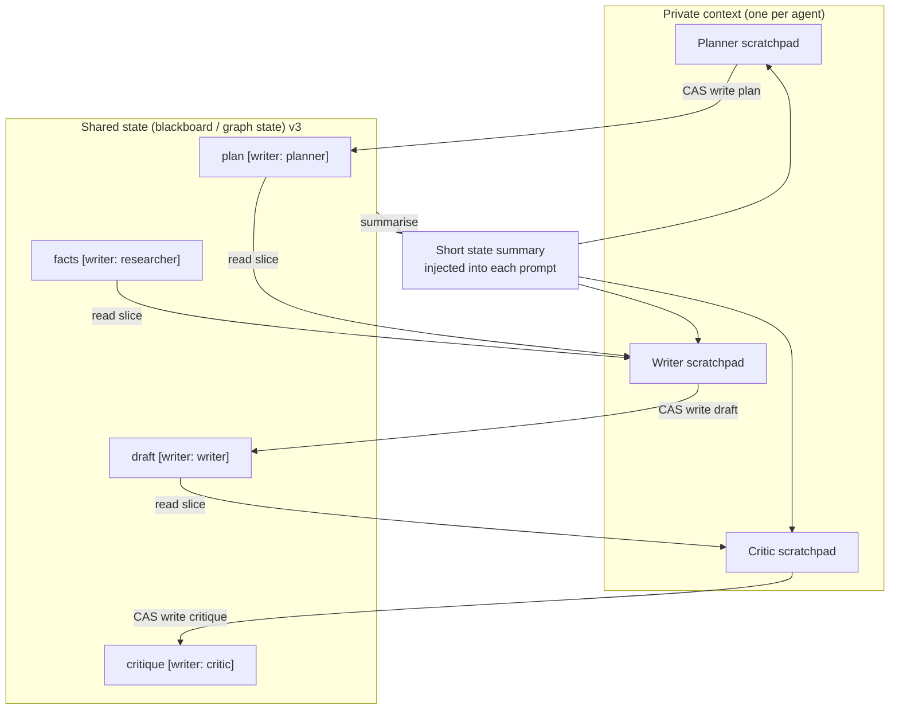

# Shared and Private Memory and State

> **Interview answer (say this first).** Multi-agent systems need two kinds of memory. **Private state** — an agent's scratchpad, reasoning, and partial drafts — lives inside its own context window and is never trusted by anyone else. **Shared state** — the plan, the agreed facts, and the outputs being assembled — lives in one addressable place: a **blackboard** or a **shared graph state** that every agent can read and (if allowed) write. The rule that keeps shared state correct is the **single-writer rule**: each key has exactly one agent allowed to write it, so no two agents update the same field and lose each other's work. Cross-agent read-modify-write needs **versioning**: a writer states the version it read, and the store rejects a **stale write** with **compare-and-swap**. **Context isolation** means each agent sees only the slice it needs, which improves focus and privacy. Conflicts are detected, resolved, and recorded; shared state is **summarised** before re-injection, because the full state will not fit in any one window.

> **Note:**
>
> **Verified.** Every runnable pure-Python example on this page was executed on Python 3.14. The compare-and-swap race, the single-writer rule, the blackboard, context isolation, privacy redaction, and state summarisation produced the outputs shown. JSON payloads were parsed with `json.loads`.

## Why this exists

Two agents working on one job must agree on something. The simplest approach — let both write to one shared document — is also the fastest way to corrupt the job.

Picture a writer and an editor both holding the same draft. The writer improves the introduction. At the same moment the editor fixes the introduction too. Whoever saves last wins; the other change disappears. Nobody gets an error. The system looks fine and the work is wrong. This is a **lost update**, and it is the defining bug of shared state.

There is a second, quieter failure: **leakage**. If every agent reads the whole shared state, then the summariser sees the customer's card number, or a research agent sees the internal pricing plan. Sharing everything is convenient and unsafe.

And a third: **context bloat**. If shared state is one giant object and every agent re-reads all of it, each agent's context fills with data it does not need. Focus drops and cost rises.

The fix is a discipline, not a technology:

- **Split state into private and shared.** Keep reasoning private; publish only what others need.
- **Give each shared key one writer.** One owner per field removes most races by construction.
- **Version shared state.** When read-modify-write is unavoidable, compare versions and reject stale writes.
- **Isolate context.** Hand each agent only the slice its role needs.
- **Summarise.** Re-inject a short, current summary, not the raw history.

> **Tip:**
>
> **The one-sentence purpose.** Private state is one agent's working memory; shared state is the team's agreed record, kept correct with single writers, versions, and isolation.

## Start from zero

| Word | Plain meaning |
| --- | --- |
| **State** | Data the system needs to remember while the job runs. |
| **Memory** | State that outlives one step, and sometimes one run. |
| **Private state** | State only one agent can see: its scratchpad and reasoning. |
| **Scratchpad** | An agent's private working notes for the current task. |
| **Shared state** | State multiple agents can read, and some can write. |
| **Blackboard** | A shared store agents post findings to and read from. |
| **Shared graph state** | A typed, addressable state object passed through a workflow graph. |
| **Context window** | The token budget one model call can see at once. |
| **Context isolation** | Each agent gets only the slice of state its role needs. |
| **Single-writer rule** | Exactly one agent may write a given key. |
| **Race condition** | Two operations interleave so the result depends on timing. |
| **Lost update** | A write is overwritten because another writer did not see it. |
| **Version** | A number that increments on every accepted write. |
| **Compare-and-swap (CAS)** | Write only if the current version equals the one you read. |
| **Optimistic concurrency** | Assume no clash, then reject the write if the version moved. |
| **Write conflict** | Two writers changed the same key from the same base. |
| **Merge** | Combine non-conflicting changes from several writers. |
| **Redaction** | Removing secrets or personal data before publishing. |
| **Namespace** | A partition that keeps one user's or team's data separate. |
| **Summarisation** | Compressing shared state into a short, current form. |
| **Checkpoint** | A saved snapshot of state at a point in time. |
| **Event log** | The ordered list of state changes; the source of truth. |
| **Materialised view** | The current state built by replaying the event log. |
| **Provenance** | Which agent wrote which value, and when. |

Two distinctions decide most designs:

- **Private vs shared.** If no other agent needs it to do its job, it stays private. Sharing is a deliberate act with a privacy cost.
- **State vs messages.** Messages are events in flight. Shared state is the durable record. The next page schedules the messages; this page stores the state.

## The core idea

Think of a project room.

- Each person has a **notebook**: private reasoning they never have to defend. That is the scratchpad.
- In the middle sits a **whiteboard**. Everyone reads it; each column has one named owner who writes it. That is shared state with single writers.
- The whiteboard is **versioned**. If you copy a column and someone else updates it first, your write is rejected and you re-read. That is compare-and-swap.
- Some columns are **covered** when visitors enter. That is redaction and context isolation.
- At the end of the meeting someone writes a short **summary** on a card and pins it up. That is summarisation.



The whiteboard metaphor makes the hard rules obvious:

| Question | Private scratchpad | Shared state |
| --- | --- | --- |
| Who can read it? | One agent | Allowed agents |
| Who can write it? | Its owner | The single key owner |
| Does it need a version? | No | Yes, for read-modify-write |
| Does it need redaction? | Not for privacy | Yes, before publishing |
| Is it re-injected wholesale? | Yes, to its own prompt | No, summarised first |
| Typical contents | Chain-of-thought, candidate drafts | Plan, agreed facts, final outputs |
| Lifetime | One step or one run | The whole job, and often archived |

The discipline in one line: **keep reasoning private, publish conclusions under one owner, version every shared write, and inject only what a role needs.**

## How it works

1. **Draw the boundary.** For each piece of data, ask who must read it. If the answer is "nobody else", it is private. Publish only conclusions and artifacts, not raw reasoning.
2. **Name every shared key.** `plan`, `draft`, `critique`, `facts`. A key is a contract: readers depend on its shape, so changing it is a breaking change.
3. **Assign one writer per key.** Record the owner in a registry. This is the single-writer rule: it removes most races before they start.
4. **Stamp a version.** The shared store keeps a monotonic version that increments on every accepted write.
5. **Read with the version.** A writer reads the key and the version together. The version is its receipt.
6. **Write with compare-and-swap.** The write includes the expected version. If the store's version moved, reject the write and make the agent re-read and retry.
7. **Detect conflicts.** A conflict is a write against a version that no longer matches. Log it; do not silently drop it. Duplicate work often signals overlapping roles.
8. **Resolve conflicts deterministically.** Retry with a fresh read, merge non-overlapping fields, or escalate to a resolver. Never let wall-clock order decide.
9. **Isolate context.** Build each agent's prompt from a role-specific slice: the planner sees `plan`, the writer sees `plan` and `facts`, the critic sees `draft`.
10. **Redact before publishing.** Strip secrets and personal data at the boundary. A field that never enters shared state cannot leak from it.
11. **Summarise before re-injection.** Shared state grows past the context budget, so compress it to a short current summary with the version included.
12. **Checkpoint and version history.** Save snapshots so a bad write can be rolled back, and keep provenance: who wrote what, when, and from which version.

Two refinements sit on top:

- **Event log plus materialised view.** Append every accepted change to an immutable log, and build the current state by replay. This gives an exact audit trail and lets you rebuild state after a bug.
- **Garbage collection by version.** Keep the last few versions for rollback, then archive older ones. Unbounded history is its own memory leak.

## The syntax you will use

**A versioned shared store with compare-and-swap.** The lock makes each check-and-write atomic; the version check makes stale writes fail.

```python
import copy, threading

class SharedState:
    def __init__(self):
        self._data: dict = {}
        self._version = 0
        self._lock = threading.Lock()

    def read(self):
        with self._lock:
            return copy.deepcopy(self._data), self._version

    def compare_and_swap(self, expected_version: int, writer: str, patch: dict):
        with self._lock:
            if expected_version != self._version:
                raise ValueError(
                    f"stale write by {writer}: expected v{expected_version}, "
                    f"actual v{self._version}")
            self._data = {**self._data, **patch}
            self._version += 1
            return self._version
```

`read` returns a deep copy so a caller cannot mutate the store by accident. `compare_and_swap` rejects the write if any other writer moved the version.

**Enforce the single-writer rule at the boundary.** A small owner map prevents two roles from writing the same key.

```python
OWNERS = {"plan": "planner", "draft": "writer", "critique": "critic",
          "facts": "researcher"}

def can_write(agent: str, key: str) -> bool:
    owner = OWNERS.get(key)
    if owner is None:
        return False
    return owner == agent
```

**A blackboard is shared state with a write gate and a query surface.**

```python
class Blackboard:
    def __init__(self):
        self.entries: list[dict] = []

    def post(self, agent: str, key: str, value, confidence: float = 1.0):
        if not can_write(agent, key):
            raise PermissionError(f"{agent} may not write {key!r}")
        self.entries.append({"agent": agent, "key": key,
                             "value": value, "confidence": confidence})
        return len(self.entries) - 1

    def latest(self, key: str):
        for e in reversed(self.entries):
            if e["key"] == key:
                return e
        return None
```

**Give each agent only its slice.** Isolation is both a focus tool and a privacy tool.

```python
def private_view(shared: dict, keys: list[str]) -> dict:
    return {k: shared[k] for k in keys if k in shared}
```

**Redact at the publish boundary.** Secrets never enter shared state in the first place.

```python
SECRET_KEYS = {"secret_key", "api_token", "card_number"}

def redact_for_publish(patch: dict) -> dict:
    clean = {}
    for k, v in patch.items():
        if k in SECRET_KEYS:
            continue
        if isinstance(v, str) and v.startswith("sk-"):
            clean[k] = "[redacted]"
        else:
            clean[k] = v
    return clean
```

**Summarise shared state with a version stamp.** The version ties the summary to the exact state it describes; when the text is truncated, a content hash marks the cut.

```python
import json, hashlib

def summarize(shared: dict, version: int, max_chars: int = 90) -> str:
    clean = redact_for_publish(shared)     # same boundary rule as publishing
    parts = []
    for k in sorted(clean):
        v = clean[k]
        text = json.dumps(v, sort_keys=True) if not isinstance(v, str) else v
        parts.append(f"{k}={text}")
    joined = "; ".join(parts)
    stamp = f"v{version}"
    if len(stamp) + 2 + len(joined) <= max_chars:
        return f"{stamp}: {joined}"
    digest = hashlib.sha256(joined.encode()).hexdigest()[:8]
    keep = max(0, max_chars - len(stamp) - 2)
    return f"{stamp}: {joined[:keep]}...[+{len(joined)-keep} chars sha={digest}]"
```

## Examples: simple to real

**Example 1 — a stale write is rejected, then accepted after a re-read.**

```text
A read version: 0 | B read version: 0
A writes v: 1
B rejected: stale write by writer: expected v0, actual v1
B re-read version: 1 | B writes v: 2
```

Both agents read version 0. A writes first and the version becomes 1. B's write, based on version 0, is rejected. B re-reads and succeeds. No update is lost, because the store refused the stale base.

**Example 2 — two writers on the same key, one lost update prevented.**

```text
C writes draft v: 3
lost update prevented: stale write by editor: expected v2, actual v3
final state: {'plan': ['search', 'draft'], 'draft': 'draft v2'} v 3
```

C and the editor both read version 2. C writes; the editor's stale write is refused. Without the version check, the editor's value would silently overwrite C's, which is exactly the failure the rule exists to prevent.

**Example 3 — the single-writer rule blocks a hijack.**

```text
planner writes plan   : True
writer  writes plan   : False
critic  writes critique: True
who owns draft        : writer
blackboard rejected: writer may not write 'plan'
```

Only the planner may write `plan`. When the writer tries, the blackboard raises. One owner per key means ownership is enforced, not merely documented.

**Example 4 — a blackboard keeps the latest value per key.**

```text
latest plan : {'agent': 'planner', 'key': 'plan', 'value': ['search', 'draft'], 'confidence': 1.0}
latest draft: {'agent': 'writer', 'key': 'draft', 'value': 'refund policy draft v1', 'confidence': 1.0}
entries     : 2
```

Each post records the agent, the key, the value, and a confidence. Readers query the latest entry for a key, so writes are an append-only history rather than destructive edits.

**Example 5 — context isolation hides data a role does not need.**

```text
writer sees  : {'plan': ['search'], 'draft': 'text'}
critic sees  : {'draft': 'text'}
planner sees : {'plan': ['search']}
secret leaked: False
```

The writer never sees the secret key, the critic sees only the draft, and the planner sees only the plan. Compare this with passing the full dictionary to everyone, which would leak the secret and waste context.

**Example 6 — summarise shared state before re-injection.**

```text
summary: v3: critique=too vague; draft=text; note=[redacted]; plan=["search"]; user_id=u_42
```

The summary drops the secret key and redacts a secret-looking value hiding under an innocuous key, keeps the keys a reader needs, and fits a small budget. The injected prompt gets the current state, not the entire history, and the `v3` stamp ties it back to the exact version it describes.

## In production

- **Default to private.** Publish only conclusions another agent needs to proceed. Raw chain-of-thought in shared state is a privacy leak and a context tax.
- **One writer per key, enforced in code.** A documented rule drifts. A permission check fails closed and stops the race before it starts.
- **Always version shared state.** Any read-modify-write across agents needs a version and a compare-and-swap, or you will eventually lose an update silently.
- **Make writes idempotent and retryable.** A rejected write means "re-read and try again", not "give up". Encode the retry so agents do not need custom logic.
- **Redact at the boundary.** Remove secrets and personal data before publishing. Once a value is in shared state, every reader can see it forever in the log.
- **Do not let the summariser see secrets.** The summary is injected into prompts and may be logged. Treat it as a public artifact.
- **Keep the event log immutable.** Append changes; never edit history. The log is what lets you explain a past decision and rebuild state after a bug.
- **Bound the history.** Keep a few versions for rollback and archive the rest. Unbounded version history grows the store without limit.
- **Detect conflicts, do not hide them.** Log every rejected write with both versions. Repeated conflicts mean two roles are doing overlapping work.
- **Namespace by user and tenant.** A missing namespace filter is a cross-user leak. Make the namespace a required argument, not an optional one.
- **Treat shared state as untrusted input to every reader.** A compromised agent can poison a shared key. Validate values at the boundary, and keep provenance so a bad write can be traced.
- **Snapshot before destructive operations.** A checkpoint turns a catastrophic overwrite into a rollback.

## Interview questions

### 1. What is the difference between shared and private state?

**Answer.** Private state is one agent's scratchpad and reasoning: it lives in that agent's context and no one else depends on it. Shared state is data multiple agents can read, such as the plan, agreed facts, and outputs being assembled. Private state is where thinking happens; shared state is the team's record. Keep reasoning private and publish only conclusions, because sharing costs context and leaks information.

**Follow-up: "Where does a final answer live?"** In shared state, under a key with one writer, so every consumer reads the same version.

**Trap.** Sharing the whole context. It couples agents, blows the token budget, and leaks private data to peers that do not need it.

### 2. Why is the single-writer rule important?

**Answer.** Because it removes races by construction. If exactly one agent may write a given key, then two agents can never interleave read-modify-write on that key and lose an update. The rule also makes ownership explicit: when a value is wrong, you know which agent wrote it. Where genuine multi-writer collaboration is needed, you add versioning or a merge step rather than abandoning the rule.

**Follow-up: "What if two agents really must update one field?"** Then serialize them behind a queue or a lock, or split the field into per-writer sub-fields and merge. Do not let both write blind.

**Trap.** Trusting a convention in a document. Enforce the rule with a permission check so it fails closed.

### 3. What is a lost update, and how does compare-and-swap prevent it?

**Answer.** A lost update happens when two writers read the same value, both modify it, and the second write overwrites the first, so one change disappears with no error. Compare-and-swap prevents it by attaching a version to the read. The write succeeds only if the store's version still equals the version the writer read. If another writer moved the version, the store rejects the write and the agent re-reads.

**Follow-up: "What does the agent do after rejection?"** Re-read the latest state, recompute, and retry with the new version. The write is optimistic; conflicts surface as exceptions, not as silent corruption.

**Trap.** Checking the version but not making the check-and-write atomic. Without a lock or a transaction, two writers can still both pass the check.

### 4. Why isolate context between agents?

**Answer.** Two reasons: focus and privacy. Focus, because an agent performs better with only the slice relevant to its role — a critic does not need the research log. Privacy, because an agent that never receives a secret cannot leak it. Context isolation also keeps cost down, since each prompt carries just what it needs instead of the full shared state.

**Follow-up: "Does isolation reduce coordination?"** It can, so the slice must include what the role needs and no more. Design the slice around the decision the agent makes.

**Trap.** Isolating so aggressively that the agent is missing a fact it needs. Isolation is about relevance, not about starving agents.

### 5. How do you handle a write conflict between agents?

**Answer.** Detect it with a version check, then resolve it deterministically. Options are: retry after re-reading, merge non-overlapping fields, or escalate to a resolver with a documented policy. Record the conflict and the resolution for audit. The worst response is to let wall-clock arrival order decide, because that makes the outcome non-reproducible.

**Follow-up: "When is merging wrong?"** When the two writes are contradictory, such as two different plans. A merge that unions contradictory claims produces an incoherent state; escalate instead.

**Trap.** Silently dropping the loser's write. A conflict is a signal that roles overlap or the task design is wrong; log it.

### 6. How do you keep private data out of shared state?

**Answer.** Redact at the publish boundary, before the value enters shared state. Maintain a list of sensitive keys and patterns, drop or mask them on publish, and keep the summariser away from raw personal data. Combine that with namespaces per user or tenant and least-privilege reads, so even a leak is scoped.

**Follow-up: "Why redact before the event log rather than after?"** Because the log is append-only and long-lived. A secret that reaches the log can only be masked, not un-known, and every reader with log access has seen it.

**Trap.** Assuming a trusted agent will not publish a secret. Assume it might, and enforce at the store.

### 7. Why summarise shared state instead of injecting all of it?

**Answer.** Because shared state outgrows any context window. As the job runs, the plan, drafts, critiques, and facts accumulate far past the token budget. Injecting a short, current summary keeps each agent focused and bounds cost, while the full state stays addressable for anyone who needs a specific key. The summary should include the version so it is traceable.

**Follow-up: "What can a summary lose?"** The detail that mattered: an exact error, an order number, a caveat. Keep the raw state and let the summary act as an index, not the only copy.

**Trap.** Summarising with a model and then treating the summary as ground truth. A summary is derived data and can drift; the source of truth is the versioned state.

### 8. How do you make shared state auditable and recoverable?

**Answer.** With an append-only event log plus a materialised view. Every accepted change is appended with its writer, version, timestamp, and previous version. The current state is rebuilt by replaying the log. Checkpoints let you roll back a bad write quickly, and provenance lets you answer "who wrote this value, and from which version." Immutable history plus snapshots covers both explanation and recovery.

**Follow-up: "How do you keep the log from growing forever?"** Archive or compact old segments after keeping enough versions for rollback and audit, following whatever retention policy applies.

**Trap.** Mutating state in place with no history. When a value is wrong, you cannot tell who changed it or why, and you cannot recover the prior value.

## Remember this

- **Private scratchpads for thinking; shared state for agreed facts and outputs.** Publish conclusions, not reasoning.
- **One writer per key, enforced in code.** The single-writer rule removes races before they happen.
- **Version every shared write and use compare-and-swap.** A stale write is rejected, not silently applied.
- **Isolate context per role and redact before publishing.** Isolation gives focus and privacy; redaction gives safety.
- **Keep an append-only log and summarise the view.** The log explains and recovers; the summary keeps prompts small.
