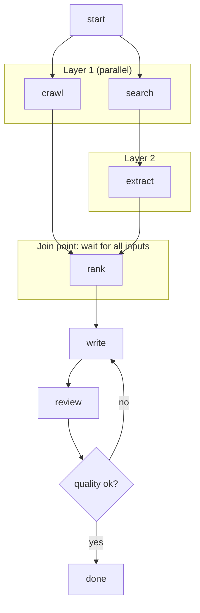

# Agent Scheduling and Coordination

> **Interview answer (say this first).** Scheduling decides **who runs when**. **Sequential** execution runs one step after another when a step depends on the previous one. **Parallel** execution runs independent branches at the same time. **Conditional** execution runs a branch only if a condition holds. A **scheduler** (or orchestrator) reads the dependency graph, releases each task only when its dependencies are finished, and enforces concurrency limits, priorities, and fairness. **Fan-out** starts many branches; **fan-in** is the **join point** where the scheduler waits for them to finish before continuing. **Barriers** synchronise phases. Every task needs **progress tracking** and a **timeout**, and every fan-out needs a **bound**, because branches multiply: a tree with `b` branches and depth `d` has about `b^d` leaves, so threads, requests, and tokens explode quickly. Fairness (often via **ageing**) stops low-priority work from starving, and a **concurrency limit** protects the model and the budget.

> **Note:**
>
> **Verified.** Every runnable pure-Python example on this page was executed on Python 3.14. The DAG topological order and layers, the priority and ageing scheduler, the asyncio concurrency pool, the fan-out/fan-in join, the timeout, and the fan-out cost math all produced the outputs shown.

## Why this exists

A multi-agent system is a set of tasks with dependencies, and something has to decide the order. Get it wrong and the symptoms are distinctive:

- **Everything waits.** The orchestrator blocks on one slow agent while ten ready tasks sit idle. Latency is the sum of every call instead of the longest chain.
- **Everything at once.** The orchestrator fires a hundred calls in parallel. The model provider rate-limits you, memory spikes, and the bill multiplies.
- **Nothing finishes.** A join point waits for a branch that was never started, or a fan-out expands faster than it completes. The job hangs with no error.
- **The wrong work runs first.** A background analysis consumes the budget while the user's request waits. There is no priority and no fairness.

The naive approach is to write `await` in a line and hope. That is a sequential pipeline with no dependencies checked and no bound on concurrency.

Real coordination needs four things:

1. **A graph.** Which task depends on which. The graph tells the scheduler what is ready.
2. **A policy.** Priority, fairness, and a concurrency limit decide which ready task runs next.
3. **Barriers.** Places where the system must wait for a set of tasks before continuing.
4. **Bounds.** A maximum depth, a maximum number of branches, and a timeout on every task.

Scheduling is where cost and latency are won or lost. The model is not the bottleneck; the coordination is.

> **Tip:**
>
> **The one-sentence purpose.** The scheduler turns a dependency graph plus a policy into an execution order that is fast without being unbounded.

## Start from zero

| Word | Plain meaning |
| --- | --- |
| **Scheduler** | The component that decides which ready task runs when. |
| **Orchestrator** | The higher-level agent that owns the plan and calls the scheduler. |
| **Task** | One unit of work, such as one agent invocation. |
| **Dependency graph** | Nodes are tasks; an edge means one task must finish before another. |
| **DAG** | A directed acyclic graph: dependencies with no cycles. |
| **Ready queue** | Tasks whose dependencies are all complete. |
| **Sequential** | Run one task, then the next. Required when there is a dependency. |
| **Parallel** | Run independent tasks at the same time. |
| **Conditional** | Run a branch only if a condition holds, such as a guard or a route. |
| **Priority** | The number that decides which ready task goes first. |
| **Fairness** | A guarantee that low-priority work still eventually runs. |
| **Ageing** | Raising a task's effective priority the longer it waits. |
| **Starvation** | A low-priority task that never runs because high-priority work keeps arriving. |
| **Concurrency limit** | The maximum number of tasks running at once. |
| **Semaphore** | A counter that enforces a concurrency limit. |
| **Worker pool** | A fixed set of workers that pull tasks from a queue. |
| **Backpressure** | Slowing producers when consumers are saturated. |
| **Throttling** | Deliberately limiting the request rate. |
| **Barrier** | A point where the system waits for a group of tasks. |
| **Fan-out** | Starting many branches from one point. |
| **Fan-in** | Collecting many branches back into one point. |
| **Join point** | The barrier where fan-in happens. |
| **Critical path** | The longest dependency chain; the minimum possible latency. |
| **Progress tracking** | Knowing each task's state: queued, running, done, failed. |
| **Timeout** | A maximum wait after which a task is cancelled. |
| **Deadline** | The wall-clock time by which a task must finish. |
| **Thread explosion** | Creating so many concurrent units that the runtime collapses. |
| **Token explosion** | A fan-out whose total token cost grows faster than the budget. |

The three execution modes in one table:

| Mode | When to use | Risk |
| --- | --- | --- |
| Sequential | Task B needs A's output | Slow; critical path is the whole chain |
| Parallel | Tasks are independent | Cost and rate limits; needs a concurrency cap |
| Conditional | A branch depends on a result | Skipped branches can leave state unset |

## The core idea

Think of a project manager with a task board.

- Every card has **dependencies**. A card can move to "doing" only when its dependencies are "done".
- The manager has a **ready column**. Cards with no unfinished dependencies sit there.
- The manager can only run a few cards at once, so there is a **concurrency limit**.
- Some cards are urgent, so they get a **priority**; but every card also gets a little more urgent the longer it waits, so nothing starves. That is **ageing**.
- Some work comes in bundles: send five researchers out, then wait for all five before writing. That is **fan-out and fan-in**.



The layers are the key insight. Everything in the same layer is independent, so it can run in parallel. The **width** of a layer is the concurrency that layer demands. The number of layers is the **critical path** in steps, and each join point is a barrier.

A scheduler is just: **take the ready set, sort it by policy, run up to the limit, and release new tasks as dependencies complete.**

## How it works

1. **Build the graph.** Express tasks as nodes and dependencies as edges. A cycle means the plan is impossible; detect it before running anything.
2. **Compute readiness.** A task is ready when every dependency is complete. The scheduler recomputes the ready set after each completion.
3. **Order the ready set.** Sort by priority, then by a fairness rule such as ageing or round-robin. Tie-break deterministically so runs are reproducible.
4. **Respect the concurrency limit.** Run at most `N` tasks at once. The limit is a semaphore or a fixed worker pool.
5. **Choose the mode.** Sequential when there is a dependency, parallel when there is none, conditional when a guard decides. The graph, not the code style, dictates the mode.
6. **Fan out.** Start a branch per independent sub-task, up to the concurrency limit. Cap the branch count; more branches is not better.
7. **Track progress.** Every task has a state: queued, running, succeeded, failed, or timed out. The join point needs this to know when it is done.
8. **Join at the barrier.** Wait for all required branches, or for a quorum if partial results are enough. Distinguish "all finished" from "all attempted", because a failed branch can still unblock a join.
9. **Handle failure without hanging.** A failed branch must mark the join complete, or the barrier waits forever. Decide whether failure fails the group or is tolerated.
10. **Apply timeouts.** Every task gets a timeout and every group gets a deadline. Cancel on expiry and record it as an outcome, not a crash.
11. **Bound the fan-out.** Set a maximum depth and a maximum node count. When either is hit, stop expanding and summarise what you have.
12. **Feed results back.** Summarise branch outputs before re-injecting them. A join point that concatenates every branch output recreates the token explosion.

Two scheduling policies to know:

- **Priority with ageing.** Higher priority runs first, but a task's effective priority rises with wait time. This serves urgent work without starving the rest.
- **Fair scheduling (round-robin / deficit).** Give each tenant or task a share, and cycle through them. In **deficit scheduling**, a tenant accrues credit whenever it is not served and the scheduler serves whoever has the largest deficit (its outstanding credit), so each receives its weighted share over time. This protects many small jobs from one big one.

## The syntax you will use

**Topological order and parallel layers from a dependency graph.**

```python
from collections import deque

def topo_order(deps: dict[str, set[str]]) -> list[str]:
    indeg = {n: len(d) for n, d in deps.items()}
    ready = deque(sorted(n for n, d in indeg.items() if not d))
    order = []
    while ready:
        n = ready.popleft()
        order.append(n)
        for m, d in deps.items():
            if n in d:
                indeg[m] -= 1
                if indeg[m] == 0:
                    ready.append(m)
    if len(order) != len(deps):
        raise ValueError("cycle detected")
    return order

def layers(deps: dict[str, set[str]]) -> list[list[str]]:
    remaining = {n: set(d) for n, d in deps.items()}
    out = []
    while remaining:
        ready = sorted(n for n, d in remaining.items() if not d)
        if not ready:
            raise ValueError("cycle detected")
        out.append(ready)
        for n in ready:
            remaining.pop(n)
        for d in remaining.values():
            d.difference_update(ready)
    return out
```

`topo_order` gives a legal sequential order; `layers` gives the groups that can run in parallel. A cycle raises instead of spinning.

**Priority scheduling with ageing.** `heapq` pops the smallest key, so lower numbers run first.

```python
import heapq, itertools

counter = itertools.count()

def schedule(tasks: list[tuple[int, str, float]], aging: float = 0.0) -> list[str]:
    # tasks: (priority, name, wait), where wait is how long the task has waited
    pq = []
    for prio, name, wait in tasks:
        heapq.heappush(pq, (prio - aging * wait, prio, next(counter), name))
    order = []
    while pq:
        _, _, _, name = heapq.heappop(pq)
        order.append(name)
    return order
```

The `next(counter)` tie-break makes the order stable. Each task carries its own wait, so the effective key is `prio - aging * wait`: two tasks with the same priority are ordered by how long they waited, and a long enough wait lets a lower-priority task overtake a fresher high-priority one.

**Enforce a concurrency limit with a semaphore.**

```python
import asyncio

async def run_pool(n_jobs: int, limit: int) -> tuple[list[int], int]:
    sem = asyncio.Semaphore(limit)
    active = 0
    peak = 0
    started: list[int] = []

    async def job(i: int) -> None:
        nonlocal active, peak
        async with sem:
            active += 1
            peak = max(peak, active)
            started.append(i)
            await asyncio.sleep(0.02)
            active -= 1

    await asyncio.gather(*(job(i) for i in range(n_jobs)))
    return started, peak
```

All nine jobs start over time, but the peak number running at once never exceeds the limit.

**Fan out, then join.** `asyncio.gather` is the barrier: it returns only when every branch is done.

```python
import asyncio

async def fan_out_fan_in(branches: int) -> int:
    async def worker(n: int) -> int:
        await asyncio.sleep(0.01)
        return n * n
    results = await asyncio.gather(*(worker(i) for i in range(branches)))
    return sum(results)          # join point: all branches must finish
```

**Timeout a task so the barrier cannot hang.**

```python
async def timeout_demo() -> str:
    async def slow() -> str:
        await asyncio.sleep(1.0)
        return "late"

    try:
        return await asyncio.wait_for(slow(), timeout=0.05)
    except asyncio.TimeoutError:
        return "timed out and cancelled"
```

**Bound the fan-out cost before you run it.** Compute the tree size and refuse to exceed it.

```python
def tree_cost(branches: int, depth: int, tokens_per_call: int) -> tuple[int, int]:
    """Return (total nodes, total tokens) for a full b-ary tree of this depth."""
    nodes_at_level = 1
    total_nodes = 0
    total_tokens = 0
    for _ in range(depth):
        nodes_at_level *= branches
        total_nodes += nodes_at_level
        total_tokens += nodes_at_level * tokens_per_call
    return total_nodes, total_tokens

def bounded_cost(branches: int, depth: int, tokens_per_call: int,
                 max_depth: int, max_nodes: int) -> int:
    depth = min(depth, max_depth)
    nodes = 0
    level = 1
    for _ in range(depth):
        level *= branches
        take = min(level, max_nodes - nodes)
        nodes += take
        if nodes >= max_nodes:
            break
    return nodes * tokens_per_call
```

## Examples: simple to real

**Example 1 — a dependency graph flattens into layers that can run in parallel.**

```text
topo order: ['start', 'search', 'crawl', 'extract', 'rank', 'write', 'review']
layers    : [['start'], ['crawl', 'search'], ['extract'], ['rank'], ['write'], ['review']]
parallel width: [1, 2, 1, 1, 1, 1]
```

`search` and `crawl` are independent, so they share a layer and run together. Every other layer has one task. The widths sum to the work; the layer count is the critical path. Running each layer to completion before starting the next is one conservative barrier policy; a scheduler may instead recompute the ready set after every completion, as described in **How it works**.

**Example 2 — priority order, and how ageing prevents starvation.**

```text
priority order: ['user', 'batch', 'background']
without ageing: ['new-high', 'old-low']
with ageing   : ['old-low', 'new-high']
```

Lower numbers run first, so without ageing the newer high-priority task (`priority 0`) runs before the older low-priority task (`priority 9`). With ageing at `0.8` and the old task having waited twelve units, its effective key drops to `9 - 0.8*12 = -0.6` while the new task stays at `0`, so the long-waiting task overtakes it. That is fairness in one line.

**Example 3 — a concurrency limit caps simultaneous work.**

```text
started: [0, 1, 2, 3, 4, 5, 6, 7, 8] | peak concurrent: 3
```

Nine jobs all complete, but at most three run at once. This is the difference between a bounded system and a rate-limit ban. The limit protects the provider, memory, and the wallet.

**Example 4 — a fan-in join point waits for every branch.**

```text
fan-out 4 -> fan-in: 14
```

Four branches run in parallel and the join returns `0 + 1 + 4 + 9 = 14`. The join does not continue until all four finish. If one branch failed silently, the join would hang — which is why failure must mark the branch complete.

**Example 5 — a timeout turns a hang into a recorded outcome.**

```text
timeout: timed out and cancelled
```

The slow task would have taken a second; the group allowed fifty milliseconds. The timeout cancelled it and returned a normal result string. A barrier is only safe when its slowest member has a timeout.

**Example 6 — fan-out cost explodes without bounds, and shrinks with them.**

```text
branches=3 depth=2: nodes=12 tokens=24,000
branches=3 depth=4: nodes=120 tokens=240,000
branches=5 depth=4: nodes=780 tokens=1,560,000
branches=5 depth=6: nodes=19,530 tokens=39,060,000
bounded to depth 2, 8 nodes: 16,000
```

Five branches for six levels is nearly forty million tokens. Capping depth at two and nodes at eight brings the same shape down to sixteen thousand. The bound, not the model, decides whether the job is affordable.

## In production

- **Detect cycles before running.** A dependency cycle means the plan can never start. Validate the graph and fail fast with the offending nodes.
- **Bound concurrency on every provider.** A semaphore per model or API prevents rate-limit errors and noisy-neighbour problems across tasks.
- **Cap fan-out depth and breadth.** Exponential growth is invisible until the bill arrives. Set a maximum depth, a maximum node count, and a maximum spend per job.
- **Give every task a timeout and every group a deadline.** A join point with no timeout is a hang waiting to happen, and a hang can hold a worker forever.
- **Make failure complete the join.** Whether a failed branch fails the group or is tolerated, it must unblock the barrier. Track attempted versus succeeded.
- **Track progress explicitly.** Queued, running, succeeded, failed, cancelled, timed out. Without it you cannot tell a stuck job from a slow one.
- **Choose the concurrency limit from the critical path.** More parallelism than the critical path needs buys nothing. More than the provider allows buys errors.
- **Use backpressure, not hope.** When the ready queue grows beyond a threshold, slow the producer instead of buffering without limit.
- **Prioritise, but age.** Pure priority starves background work. Ageing or round-robin keeps the system fair under load.
- **Keep scheduling deterministic.** Stable tie-breaks make runs reproducible, which matters for debugging and for evaluation.
- **Summarise at joins.** Concatenating every branch output at a fan-in recreates the token explosion you were trying to avoid.
- **Watch the critical path, not the average.** Latency is set by the longest dependency chain. Adding agents to a side branch makes it slower and costs more.

## Interview questions

### 1. What does a scheduler do in a multi-agent system?

**Answer.** It decides which task runs when. It reads the dependency graph, computes the set of ready tasks, orders that set by priority and fairness, runs up to a concurrency limit, and releases new tasks as dependencies finish. It also enforces joins, timeouts, and bounds. In short, the scheduler turns a plan plus a policy into an execution order.

**Follow-up: "How is that different from the orchestrator?"** The orchestrator owns the plan and the goal; the scheduler owns the mechanics of ordering and limits. In small systems one component does both; separating them keeps the policy testable.

**Trap.** Treating scheduling as an implementation detail. Most multi-agent latency and cost problems are scheduling problems, not model problems.

### 2. When do you run tasks sequentially, in parallel, or conditionally?

**Answer.** Sequentially when a task needs the previous task's output — that is a dependency edge. In parallel when tasks are independent, so the same work completes sooner. Conditionally when a branch depends on a result, such as routing to a specialist only if a classifier says so. The dependency graph decides; the code style should follow the graph.

**Follow-up: "What limits parallelism?"** The critical path of independent work, the concurrency limit, and external rate limits. Beyond those, extra parallelism adds cost and risk without reducing latency.

**Trap.** Parallelising steps that actually depend on each other and then reconciling the mess. If there is an edge, make it sequential.

### 3. What is fan-out and fan-in, and where is the join point?

**Answer.** Fan-out starts many branches from one point; fan-in collects them at a join point, which is a barrier. The join waits for its required branches before the next step. It matters because the join is where correctness and latency are decided: it must know when branches are done, handle failures, and bound how much output it merges.

**Follow-up: "What if you only need most of the branches?"** Then the join is a quorum barrier: wait for `k` of `n`, cancel or ignore the rest. Decide the rule up front so the join cannot hang on one slow branch.

**Trap.** Leaving a failed branch out of the completion count. The barrier then waits forever for a task that will never report.

### 4. How do you prevent unbounded fan-out and token explosion?

**Answer.** With explicit bounds: a maximum depth, a maximum number of branches, a maximum total nodes, a concurrency limit, and a per-job spend cap. Compute the projected tree size before running and refuse to exceed it. Summarise branch outputs at the join instead of concatenating them. The cost of a tree grows roughly as `b^d`, so a small increase in depth is a large increase in spend.

**Follow-up: "How do you choose the bounds?"** From the budget and the critical path: how much the job may cost, and how many parallel branches the provider can serve. Then set the smaller number.

**Trap.** Relying on a timeout to stop runaway fan-out. Timeouts bound time, not spend; a wide shallow tree can burn the budget quickly inside one timeout.

### 5. How do you handle priorities and fairness?

**Answer.** Give each task a priority, but add ageing so a long-waiting task rises in effective priority. Alternatively use round-robin or deficit scheduling so every tenant gets a share. Priorities serve urgent work; fairness prevents low-priority work from starving under a constant stream of high-priority work. Tie-break deterministically for reproducibility.

**Follow-up: "What failure does pure priority cause?"** Starvation. If high-priority work always arrives, background tasks never run. Ageing guarantees eventual service.

**Trap.** Recomputing priority from wall-clock time inside the comparison without a stable key. It makes runs non-reproducible and can oscillate.

### 6. How do you stop a join point from hanging forever?

**Answer.** Three mechanisms together: every task has a timeout, every group has a deadline, and failure always marks a branch complete. When a task times out or fails, the join records it and proceeds under a defined policy — fail the group or continue with partial results. Progress tracking makes the stuck branch visible instead of invisible.

**Follow-up: "Should a timeout fail the whole group?"** Depends on the task. If the answer needs every branch, yes. If partial results suffice, continue and mark the missing inputs. Either way, decide before you run.

**Trap.** Retrying a timed-out task forever at the barrier. An unbounded retry is a hang with extra steps.

### 7. How does scheduling affect cost?

**Answer.** Directly. Parallelism multiplies simultaneous spend, fan-out multiplies total spend, and retries multiply both. A concurrency limit caps the instantaneous burn; depth and node caps cap the total; summarising at joins caps the context each later step carries. Scheduling choices usually dominate model choice for the final bill.

**Follow-up: "Where does parallelism not help cost or latency?"** When the work is on the critical path already, or when the provider rate-limits you into serial execution anyway. Then parallelism just adds contention.

**Trap.** Adding more agents to make the job faster. If they are not independent, they add coordination cost and latency.

### 8. What goes wrong with a naive scheduler?

**Answer.** Cycles that never start, barriers that hang on failed branches, unbounded fan-out that explodes cost, no concurrency limit so the provider throttles you, pure priority that starves background work, and no progress tracking so a stuck job looks slow. Each has a specific fix: cycle detection, failure-as-completion, depth and node caps, a semaphore, ageing, and explicit state tracking.

**Follow-up: "What is the single most important guard?"** A concurrency limit plus a total node cap. Together they bound the two ways a scheduler runs away: too fast and too wide.

**Trap.** Assuming the framework handles it. Most frameworks give you fan-out and joins but leave limits, timeouts, and fairness to you.

## Remember this

- **Scheduling is who runs when.** Sequential for dependencies, parallel for independence, conditional for guards.
- **The graph decides the mode.** Ready set plus priority plus concurrency limit is the whole scheduler.
- **Fan-out multiplies cost as `b^d`; fan-in is a barrier that must handle failure and timeout.**
- **Bound everything:** concurrency, depth, node count, spend, and time. Timeouts bound time, not money.
- **Prioritise with ageing, and keep tie-breaks deterministic** so nothing starves and runs stay reproducible.
